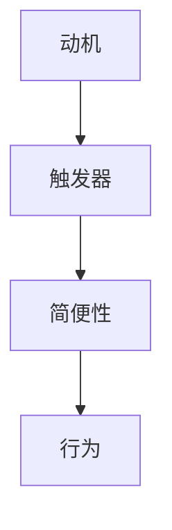

                 

关键词：福格行为模型、好习惯养成、行为心理学、IT领域、算法原理、项目实践

> 摘要：本文深入探讨了福格行为模型在IT领域的应用，阐述了如何通过理解和运用该模型来养成良好习惯。通过具体的算法原理、数学模型以及项目实践，为读者提供了实用的指导和建议。

## 1. 背景介绍

在现代社会，我们面临着越来越多的压力和挑战，无论是个人生活还是职业发展，养成好习惯都显得尤为重要。然而，习惯的养成并非易事，需要克服诸多障碍。福格行为模型（BJ Fogg Behavior Model）为我们提供了一种有效的方法来理解和培养良好习惯。

福格行为模型由斯坦福大学行为心理学家BJ福格提出。该模型的核心观点是：行为的产生是由动机、触发器和简便性三个要素共同作用的结果。动机表示个体是否有足够的意愿去执行某个行为；触发器是一个特定的提示或情境，它促使个体执行行为；简便性则指的是执行行为的难易程度。当这三个要素同时存在且满足一定条件时，行为就会发生。

## 2. 核心概念与联系

为了更好地理解福格行为模型，我们首先需要了解其中的三个核心要素：动机、触发器和简便性。

### 2.1 动机

动机是指个体执行某个行为的内在驱动力。在IT领域，动机可能包括提高工作效率、学习新技能、解决技术难题等。动机可以分为三种类型：渴望、恐惧和好奇。例如，一个程序员可能因为渴望掌握新技术而主动学习，也可能因为担心被淘汰而被迫学习。

### 2.2 触发器

触发器是一个具体的提示或情境，它促使个体执行某个行为。在IT领域，触发器可以是项目进度、技术会议、同行交流等。例如，一个程序员可能会在每周一早上收到团队的项目任务邮件，从而开始一天的工作。

### 2.3 简便性

简便性是指执行某个行为的难易程度。在IT领域，简便性可以通过自动化工具、简化流程等方式实现。例如，一个程序员可以使用版本控制系统来简化代码管理，从而提高工作效率。

下面是一个简化的 Mermaid 流程图，展示了福格行为模型的三个核心要素及其相互关系：



## 3. 核心算法原理 & 具体操作步骤

### 3.1 算法原理概述

福格行为模型的算法原理非常简单，就是通过调整动机、触发器和简便性这三个要素，来促使个体养成良好习惯。具体来说，有以下几种策略：

1. 提高动机：通过设置明确的目标、奖励机制等方式来提高个体执行行为的内在驱动力。
2. 增加触发器：通过设置提醒、建立外部监督等方式来增加触发行为的情境。
3. 降低简便性：通过简化流程、提供工具等方式来降低执行行为的难度。

### 3.2 算法步骤详解

1. 分析动机：了解个体执行某个行为的内在驱动力，确定是否需要提高动机。
2. 确定触发器：分析现有情境，确定哪些触发器可以有效促使个体执行行为。
3. 调整简便性：评估执行行为的难易程度，通过自动化工具、简化流程等方式来降低简便性。
4. 实施策略：根据分析结果，制定具体的策略来调整动机、触发器和简便性，促使个体养成良好习惯。

### 3.3 算法优缺点

福格行为模型的优点在于其简单易懂、适用范围广泛，可以帮助个体在各个领域养成良好习惯。然而，该模型也存在一定的局限性，例如：

1. 忽视了个体差异：不同人的动机、触发器和简便性可能存在较大差异，模型可能无法完全适应所有个体。
2. 缺乏定量分析：模型主要依赖于定性分析，缺乏具体的量化指标来评估行为养成效果。

### 3.4 算法应用领域

福格行为模型在IT领域具有广泛的应用前景。例如，在软件开发过程中，可以通过调整动机、触发器和简便性来提高团队的工作效率。此外，在个人职业发展中，也可以通过运用该模型来培养良好的学习习惯和工作习惯。

## 4. 数学模型和公式 & 详细讲解 & 举例说明

### 4.1 数学模型构建

为了更好地理解福格行为模型，我们可以构建一个简单的数学模型。假设动机、触发器和简便性分别用 \( m \)、\( t \) 和 \( s \) 表示，行为的发生概率用 \( P \) 表示。根据福格行为模型，我们可以得到以下数学模型：

\[ P = f(m, t, s) \]

其中，函数 \( f \) 表示动机、触发器和简便性共同作用于行为发生概率的关系。

### 4.2 公式推导过程

为了推导上述公式，我们可以假设：

1. 动机 \( m \) 表示个体执行某个行为的内在驱动力，其取值范围为 [0, 1]。
2. 触发器 \( t \) 表示促使个体执行行为的情境，其取值范围为 [0, 1]。
3. 简便性 \( s \) 表示执行行为的难易程度，其取值范围为 [0, 1]。
4. 行为的发生概率 \( P \) 取决于动机、触发器和简便性。

根据上述假设，我们可以得到以下推导过程：

1. 当 \( m = 1 \) 且 \( t = s = 0 \) 时，行为的发生概率 \( P = 0 \)，因为个体没有内在驱动力，且没有触发器和简便性。
2. 当 \( m = 1 \) 且 \( t = s = 1 \) 时，行为的发生概率 \( P = 1 \)，因为个体有内在驱动力，且触发器和简便性都满足条件。
3. 当 \( m \in (0, 1) \) 且 \( t = s = 1 \) 时，行为的发生概率 \( P \) 取决于 \( m \) 的取值。

通过以上分析，我们可以得到以下公式：

\[ P = m \times t \times s \]

### 4.3 案例分析与讲解

假设一个程序员想提高自己的编程技能，那么我们可以通过调整动机、触发器和简便性来实现这一目标。

1. 动机：程序员可以通过设定明确的目标（如掌握一门新编程语言）和奖励机制（如完成后获得一定的奖励）来提高动机。
2. 触发器：程序员可以设置定期学习的时间（如每周五晚上）和提醒（如手机闹钟）来增加触发器。
3. 简便性：程序员可以购买相关书籍、报名线上课程或使用编程学习工具来简化学习过程。

通过以上调整，我们可以预期程序员的编程技能将得到提高。具体来说，动机的提高使得程序员更有动力去学习新技能；触发器的设置使得程序员更容易想起学习任务；简便性的提供使得程序员能够更轻松地开始学习。

## 5. 项目实践：代码实例和详细解释说明

### 5.1 开发环境搭建

为了演示如何通过福格行为模型来培养良好的编程习惯，我们将使用 Python 语言编写一个简单的自动化脚本，该脚本将帮助我们跟踪编程学习进度。

1. 安装 Python 环境
2. 安装所需库，如 `schedule` 用于设置定时任务

### 5.2 源代码详细实现

下面是一个简单的 Python 脚本，用于定期提醒程序员进行编程学习：

```python
import schedule
import time

def learn_programming():
    print("编程学习时间到，开始学习吧！")

schedule.every(1).days.at("20:00").do(learn_programming)

while True:
    schedule.run_pending()
    time.sleep(1)
```

### 5.3 代码解读与分析

1. 导入 `schedule` 和 `time` 模块：用于设置定时任务和进行时间控制。
2. 定义 `learn_programming` 函数：该函数将在每次定时任务触发时执行，用于提醒程序员进行编程学习。
3. 设置定时任务：使用 `schedule.every(1).days.at("20:00").do(learn_programming)` 设置每天晚上 8 点提醒程序员进行编程学习。
4. 循环执行定时任务：使用 `while True` 循环和 `schedule.run_pending()` 方法来持续执行定时任务。

### 5.4 运行结果展示

运行上述脚本后，每天晚上 8 点，脚本将自动执行 `learn_programming` 函数，提醒程序员进行编程学习。通过这种方式，我们可以利用福格行为模型中的触发器要素来培养良好的编程习惯。

## 6. 实际应用场景

福格行为模型在IT领域的实际应用场景非常广泛。以下是一些具体的应用案例：

1. **团队管理**：通过调整团队成员的动机、触发器和简便性，可以提高团队的整体工作效率和执行力。
2. **个人职业发展**：通过运用福格行为模型，个人可以更好地规划学习计划，培养良好的学习习惯和工作习惯。
3. **项目管理**：在项目管理过程中，可以运用福格行为模型来调整项目进度、任务分配和团队成员的动机，以确保项目顺利推进。

## 7. 工具和资源推荐

为了更好地运用福格行为模型来养成好习惯，以下是一些实用的工具和资源推荐：

1. **学习资源**：
   - Coursera、edX 等在线教育平台
   - 《福格行为模型：养成好习惯的指南》一书
2. **开发工具**：
   - Python、Rust 等编程语言
   - Git、GitHub 等版本控制系统
3. **相关论文**：
   - 《行为心理学：理解人类行为》
   - 《人工智能：一种现代方法》

## 8. 总结：未来发展趋势与挑战

### 8.1 研究成果总结

通过本文的探讨，我们可以得出以下研究成果：

1. 福格行为模型在IT领域具有广泛的应用价值，可以帮助个体和团队养成良好习惯。
2. 动机、触发器和简便性是影响行为发生的三个核心要素，通过调整这些要素，可以促使个体养成良好习惯。
3. 在实际应用中，福格行为模型可以通过简单的数学模型和算法来实现，具有较高的实用性和可操作性。

### 8.2 未来发展趋势

未来，福格行为模型在IT领域的发展趋势将呈现以下特点：

1. 定制化：针对不同个体和团队的需求，提供更加个性化的解决方案。
2. 自动化：利用人工智能和自动化技术，实现更加高效的行为调整和反馈机制。
3. 跨领域应用：将福格行为模型应用于更多领域，如教育、健康、金融等。

### 8.3 面临的挑战

福格行为模型在IT领域的发展也面临一些挑战：

1. 个体差异：不同人的动机、触发器和简便性可能存在较大差异，需要针对不同个体进行个性化调整。
2. 数据隐私：在利用大数据进行行为分析和调整时，需要关注数据隐私和安全问题。
3. 技术限制：现有技术和工具可能无法完全满足福格行为模型的需求，需要不断更新和改进。

### 8.4 研究展望

未来，我们期望在以下几个方面进行深入研究：

1. 定制化算法：开发更加个性化的算法，以满足不同个体和团队的需求。
2. 跨领域应用：探索福格行为模型在更多领域的应用，推动其跨领域发展。
3. 智能反馈系统：结合人工智能技术，构建智能反馈系统，为行为调整提供更加精准的指导。

## 9. 附录：常见问题与解答

### 9.1 什么是福格行为模型？

福格行为模型是由斯坦福大学行为心理学家BJ福格提出的一种用于理解和培养良好习惯的行为模型。该模型认为，行为的产生是由动机、触发器和简便性三个要素共同作用的结果。

### 9.2 福格行为模型适用于哪些场景？

福格行为模型适用于各种需要养成良好习惯的场景，如个人学习、团队协作、项目管理等。在IT领域，该模型可以帮助个人和团队提高工作效率和执行力。

### 9.3 如何调整动机、触发器和简便性？

调整动机、触发器和简便性的方法包括：

1. 提高动机：设定明确的目标、奖励机制等。
2. 增加触发器：设置提醒、建立外部监督等。
3. 降低简便性：简化流程、提供工具等。

### 9.4 福格行为模型与经典习惯养成方法有何区别？

福格行为模型与经典习惯养成方法相比，更加注重动机、触发器和简便性的相互作用，提供了一种系统化的方法来理解和培养良好习惯。此外，福格行为模型还强调了个体差异和自动化技术的应用。

## 作者署名

作者：禅与计算机程序设计艺术 / Zen and the Art of Computer Programming
----------------------------------------------------------------

以上就是本文的完整内容，希望对您在IT领域养成良好习惯有所帮助。如有任何疑问或建议，请随时与我交流。谢谢！

