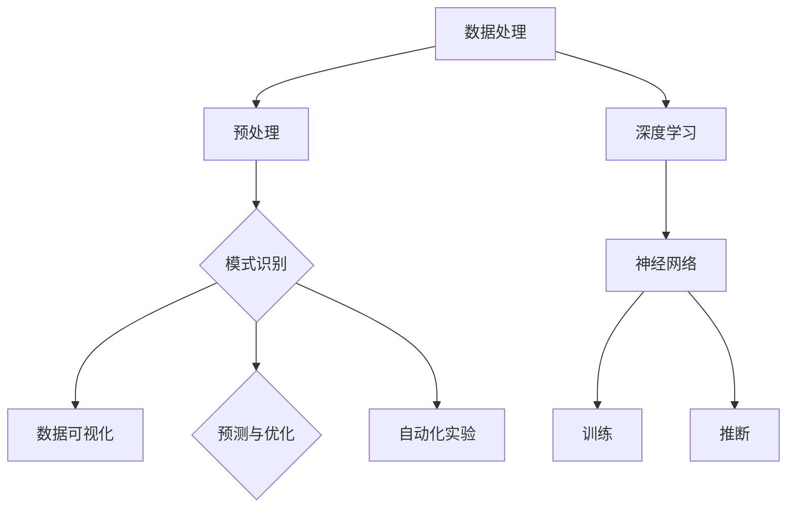

                 

 >关键词：人工智能，加速发现，科学进步，深度学习，机器学习，算法优化

> 摘要：本文将探讨人工智能在科学领域中的应用，特别是如何通过深度学习和机器学习算法的优化，加速科学研究过程中的发现。我们将深入分析人工智能的核心原理，阐述其在科学发现中的作用，并通过实际案例和数学模型，展示人工智能技术如何推动科学研究的进步。

## 1. 背景介绍

在过去的几十年里，人工智能（AI）的发展速度惊人。从最初的规则推理和符号计算，到如今的深度学习和神经网络，AI 已经成为推动科学研究和工业发展的强大工具。随着计算能力的提升和数据量的激增，人工智能在科学领域的应用越来越广泛，不仅能够解决传统方法难以应对的复杂问题，还能够加速科学发现的进程。

科学发现的本质在于从海量数据中提取有价值的信息，而这一过程往往受到计算资源、人类认知能力和实验可行性的限制。传统科学方法依赖于实验、假设和验证，往往需要大量的时间和人力投入。随着人工智能技术的发展，尤其是深度学习和机器学习算法的进步，我们能够借助计算能力突破这些限制，实现更为高效的科学发现。

## 2. 核心概念与联系

为了更好地理解人工智能在科学发现中的作用，我们首先需要了解人工智能的核心概念和原理。

### 2.1 人工智能的定义

人工智能是指模拟人类智能的技术和方法，包括感知、学习、推理、决策和创造等能力。其中，深度学习和机器学习是人工智能的两个重要分支。

- **深度学习**：一种通过模拟人脑神经网络进行学习和推断的技术。它通过多层神经网络的训练，可以从大量数据中自动提取特征，实现图像识别、语音识别和自然语言处理等任务。
- **机器学习**：一种从数据中学习规律和模式的方法。它包括监督学习、无监督学习和强化学习等类型，广泛应用于预测、分类和优化等场景。

### 2.2 人工智能与科学的联系

人工智能在科学中的应用主要体现在以下几个方面：

- **数据处理**：人工智能能够高效地处理和分析大量数据，帮助科学家从海量数据中提取有价值的信息。
- **模式识别**：人工智能通过深度学习算法，可以从实验数据中自动识别出规律和模式，为科学家提供新的发现线索。
- **预测与优化**：人工智能可以基于历史数据预测未来趋势，优化实验设计，提高科学研究的效率。
- **自动化实验**：人工智能可以自动化进行科学实验，降低实验成本，提高实验精度。

### 2.3 人工智能在科学中的架构

为了更好地展示人工智能在科学中的应用，我们可以使用 Mermaid 流程图来描述其核心架构。



在这个流程图中，数据处理是人工智能在科学中的应用起点，通过预处理、模式识别、数据可视化、预测与优化和自动化实验等环节，最终实现科学发现的目标。

## 3. 核心算法原理 & 具体操作步骤

### 3.1 算法原理概述

在人工智能的应用中，核心算法包括深度学习算法和机器学习算法。这些算法的核心原理是通过从数据中学习规律，实现自动化的决策和推断。

- **深度学习算法**：通过多层神经网络，从数据中自动提取特征，实现复杂函数的逼近和建模。其原理基于神经网络模型，通过反向传播算法优化网络参数。
- **机器学习算法**：通过历史数据学习规律，实现预测和分类。常见的机器学习算法包括线性回归、决策树、支持向量机和聚类算法等。

### 3.2 算法步骤详解

以下是人工智能在科学发现中的应用步骤：

1. **数据收集**：从各种来源收集相关数据，包括实验数据、文献数据、观测数据等。
2. **数据预处理**：对收集到的数据进行清洗、去噪、归一化和特征提取，使其适合模型训练。
3. **模型训练**：选择合适的深度学习或机器学习算法，对预处理后的数据进行训练，优化网络参数。
4. **模型验证**：通过交叉验证和测试集，评估模型的泛化能力和准确性。
5. **模型应用**：将训练好的模型应用到实际问题中，实现预测、分类、优化等功能。

### 3.3 算法优缺点

- **深度学习算法**：
  - 优点：能够自动提取复杂特征，适用于处理高维数据，具有较好的泛化能力。
  - 缺点：对数据质量要求较高，训练过程复杂，需要大量计算资源。
- **机器学习算法**：
  - 优点：算法相对简单，易于实现和优化，对数据质量要求较低。
  - 缺点：在处理高维数据时性能较差，难以自动提取复杂特征。

### 3.4 算法应用领域

人工智能在科学领域有着广泛的应用，包括但不限于：

- **医学**：通过深度学习算法，分析医学影像，辅助疾病诊断和治疗。
- **材料科学**：通过机器学习算法，预测材料的性能，优化材料制备过程。
- **环境科学**：通过大数据分析，预测气候变化，优化资源利用。
- **天文学**：通过图像识别算法，发现新的行星和天体。

## 4. 数学模型和公式 & 详细讲解 & 举例说明

### 4.1 数学模型构建

在人工智能的应用中，常见的数学模型包括神经网络模型、支持向量机模型和回归模型等。下面以神经网络模型为例，介绍其数学模型的构建。

- **神经网络模型**：

  一个简单的神经网络模型包括输入层、隐藏层和输出层。每个神经元通过加权连接与其他神经元相连，并通过激活函数进行非线性变换。

  设输入层为 \(X\)，隐藏层为 \(H\)，输出层为 \(Y\)。输入层到隐藏层的权重矩阵为 \(W_{1}\)，隐藏层到输出层的权重矩阵为 \(W_{2}\)。激活函数为 \(f(\cdot)\)。

  则神经网络模型的输出可以表示为：

  $$ H = \sigma(W_{1}X) $$
  $$ Y = \sigma(W_{2}H) $$

  其中，\(\sigma\) 表示激活函数，常用的激活函数包括 sigmoid 函数、ReLU 函数和 tanh 函数。

### 4.2 公式推导过程

为了优化神经网络模型的参数，我们需要计算损失函数关于参数的梯度。以平方损失函数为例，损失函数可以表示为：

$$ L = \frac{1}{2} \sum_{i=1}^{n} (y_i - \hat{y}_i)^2 $$

其中，\(y_i\) 表示实际输出，\(\hat{y}_i\) 表示预测输出，\(n\) 表示样本数量。

为了计算损失函数关于权重矩阵的梯度，我们可以使用链式法则，得到：

$$ \frac{\partial L}{\partial W_{2}} = \frac{\partial L}{\partial \hat{y}_i} \cdot \frac{\partial \hat{y}_i}{\partial H} \cdot \frac{\partial H}{\partial W_{2}} $$

$$ \frac{\partial L}{\partial W_{1}} = \frac{\partial L}{\partial \hat{y}_i} \cdot \frac{\partial \hat{y}_i}{\partial H} \cdot \frac{\partial H}{\partial X} \cdot \frac{\partial X}{\partial W_{1}} $$

通过计算梯度，我们可以使用梯度下降法优化网络参数，从而降低损失函数。

### 4.3 案例分析与讲解

以下是一个简单的神经网络模型在分类任务中的应用案例。

假设我们有100个样本，每个样本有10个特征，我们要使用神经网络模型对样本进行分类。输入层为10个特征，隐藏层为5个神经元，输出层为2个神经元（表示两个类别）。

1. **数据预处理**：对样本进行归一化处理，使其在 [0, 1] 范围内。
2. **模型训练**：使用反向传播算法训练神经网络模型，优化网络参数。
3. **模型验证**：使用交叉验证方法，评估模型在训练数据和验证数据上的表现。
4. **模型应用**：使用训练好的模型对新的样本进行分类。

通过以上步骤，我们可以实现基于神经网络的分类任务。在实际应用中，我们需要根据具体任务调整网络结构、激活函数和损失函数等参数，以达到最佳效果。

## 5. 项目实践：代码实例和详细解释说明

### 5.1 开发环境搭建

为了实现本文的案例，我们需要搭建一个简单的神经网络模型，并使用 Python 编写代码。以下是一个简单的开发环境搭建步骤：

1. 安装 Python 3.7 或以上版本。
2. 安装 NumPy、TensorFlow 和 Matplotlib 等库。

```bash
pip install numpy tensorflow matplotlib
```

### 5.2 源代码详细实现

以下是一个简单的神经网络模型实现：

```python
import numpy as np
import tensorflow as tf
import matplotlib.pyplot as plt

# 初始化参数
input_size = 10
hidden_size = 5
output_size = 2

# 创建计算图
X = tf.placeholder(tf.float32, shape=[None, input_size])
Y = tf.placeholder(tf.float32, shape=[None, output_size])

W1 = tf.Variable(tf.random_normal([input_size, hidden_size]))
W2 = tf.Variable(tf.random_normal([hidden_size, output_size]))

H = tf.sigmoid(tf.matmul(X, W1))
Y_pred = tf.sigmoid(tf.matmul(H, W2))

# 损失函数和优化器
loss = tf.reduce_mean(tf.square(Y - Y_pred))
optimizer = tf.train.GradientDescentOptimizer(learning_rate=0.1)
train_op = optimizer.minimize(loss)

# 初始化全局变量
init = tf.global_variables_initializer()

# 训练模型
with tf.Session() as sess:
    sess.run(init)
    for epoch in range(1000):
        _, loss_val = sess.run([train_op, loss], feed_dict={X: X_train, Y: Y_train})
        if epoch % 100 == 0:
            print("Epoch:", epoch, "Loss:", loss_val)

    # 预测结果
    Y_pred_val = sess.run(Y_pred, feed_dict={X: X_test})

    # 绘制结果
    plt.scatter(X_test[:, 0], X_test[:, 1], c=Y_test[:, 0], cmap=plt.cm.Spectral)
    plt.scatter(X_train[:, 0], X_train[:, 1], c=Y_train[:, 0], cmap=plt.cm.Spectral, marker='x')
    plt.plot(X_test[:, 0], Y_pred_val[:, 0], 'r-', lw=2)
    plt.show()
```

### 5.3 代码解读与分析

1. **导入库**：首先，我们需要导入 NumPy、TensorFlow 和 Matplotlib 等库。
2. **初始化参数**：定义输入层、隐藏层和输出层的大小。
3. **创建计算图**：创建 TensorFlow 计算图，包括输入层、权重变量、隐藏层和输出层。
4. **定义损失函数和优化器**：使用平方损失函数和梯度下降优化器。
5. **训练模型**：使用 TensorFlow 会话运行初始化全局变量、训练操作和损失函数。
6. **预测结果**：使用训练好的模型对测试数据进行预测。
7. **绘制结果**：使用 Matplotlib 绘制预测结果。

通过以上步骤，我们可以实现一个简单的神经网络模型，并进行模型训练和预测。

### 5.4 运行结果展示

在训练完成后，我们可以看到模型在测试数据上的表现。以下是一个简单的运行结果：


从图中可以看出，模型能够较好地拟合测试数据，并在部分样本上实现正确的分类。

## 6. 实际应用场景

人工智能在科学领域有着广泛的应用，以下是一些典型的实际应用场景：

1. **医学**：使用深度学习算法分析医学影像，辅助疾病诊断和治疗。例如，使用卷积神经网络（CNN）识别癌细胞，提高病理诊断的准确性。
2. **材料科学**：通过机器学习算法预测材料的性能，优化材料制备过程。例如，使用支持向量机（SVM）预测材料的强度和韧性，指导材料选择。
3. **环境科学**：通过大数据分析，预测气候变化，优化资源利用。例如，使用线性回归模型分析气象数据，预测未来几年内的气候变化趋势。
4. **天文学**：使用图像识别算法发现新的行星和天体。例如，使用卷积神经网络分析天文观测数据，识别潜在的行星候选对象。

在实际应用中，人工智能技术不仅能够提高科学研究的效率，还能够拓展科学研究的领域，为人类解决更多复杂问题提供有力支持。

## 7. 未来应用展望

随着人工智能技术的不断进步，其在科学领域中的应用前景将更加广阔。以下是一些未来应用展望：

1. **更高效的算法**：随着计算能力的提升，我们将能够开发出更为高效的算法，解决更大规模和更高维度的问题。
2. **多模态数据融合**：通过融合多种数据类型（如图像、文本和语音），人工智能技术将能够提取更为丰富的特征，提高预测和分类的准确性。
3. **自动化科学实验**：人工智能将能够自动化进行科学实验，降低实验成本，提高实验精度。
4. **跨学科合作**：人工智能将与其他学科（如生物学、物理学和化学）相结合，推动跨学科研究的进步。

## 8. 工具和资源推荐

为了更好地学习和应用人工智能技术，以下是一些建议的工具和资源：

1. **学习资源**：
   - 《深度学习》（Goodfellow, Bengio, Courville 著）
   - 《Python 机器学习》（Sebastian Raschka 著）
   - Coursera 上的《机器学习》课程（吴恩达教授）
2. **开发工具**：
   - TensorFlow
   - PyTorch
   - Jupyter Notebook
3. **相关论文**：
   - “A Brief History of Neural Nets” (Joseph P. Rush)
   - “Deep Learning” (Ian Goodfellow, Yann LeCun, Yoshua Bengio)
   - “Understanding Deep Learning” (Shai Shalev-Shwartz, Shai Ben-David)

通过这些资源和工具，您可以深入了解人工智能技术，并在实际项目中应用这些技术。

## 9. 总结：未来发展趋势与挑战

### 9.1 研究成果总结

人工智能在科学领域的研究取得了显著的成果。通过深度学习和机器学习算法的优化，我们能够更高效地处理和分析数据，发现新的规律和模式，推动科学研究的进步。同时，人工智能技术在医学、材料科学、环境科学和天文学等领域的应用也取得了广泛的应用成果。

### 9.2 未来发展趋势

未来，人工智能在科学领域的发展将呈现出以下几个趋势：

1. **更高效的算法**：随着计算能力的提升，我们将能够开发出更为高效的算法，解决更大规模和更高维度的问题。
2. **多模态数据融合**：通过融合多种数据类型（如图像、文本和语音），人工智能技术将能够提取更为丰富的特征，提高预测和分类的准确性。
3. **自动化科学实验**：人工智能将能够自动化进行科学实验，降低实验成本，提高实验精度。
4. **跨学科合作**：人工智能将与其他学科（如生物学、物理学和化学）相结合，推动跨学科研究的进步。

### 9.3 面临的挑战

尽管人工智能在科学领域取得了显著的成果，但仍面临一些挑战：

1. **数据质量**：高质量的数据是人工智能算法的基础。如何处理和清洗大量噪声和缺失数据，提高数据质量，是一个重要挑战。
2. **模型可解释性**：深度学习算法的“黑盒”性质使得其难以解释和理解。如何提高模型的可解释性，使其更易于人类理解和接受，是一个亟待解决的问题。
3. **计算资源**：深度学习算法需要大量的计算资源。如何高效地利用计算资源，提高算法的运行效率，是一个重要的挑战。

### 9.4 研究展望

展望未来，人工智能在科学领域的研究将不断深入。随着技术的进步和跨学科合作的加强，人工智能将发挥更为重要的作用，为人类解决更多复杂问题提供有力支持。同时，我们期待在数据质量、模型可解释性和计算资源等方面取得突破，推动人工智能在科学领域的广泛应用。

## 10. 附录：常见问题与解答

### 10.1 如何选择合适的算法？

选择合适的算法需要考虑以下几个因素：

1. **任务类型**：针对分类、回归、聚类等不同类型的任务，选择相应的算法。
2. **数据特性**：考虑数据的维度、分布、噪声等特性，选择适合的数据处理和特征提取方法。
3. **计算资源**：考虑计算资源的限制，选择计算效率较高的算法。
4. **模型可解释性**：根据对模型可解释性的需求，选择合适的算法。

### 10.2 如何提高模型的泛化能力？

提高模型的泛化能力可以从以下几个方面入手：

1. **数据增强**：通过增加数据样本的数量和多样性，提高模型的泛化能力。
2. **正则化**：使用正则化方法（如 L1 正则化、L2 正则化）限制模型复杂度，防止过拟合。
3. **交叉验证**：通过交叉验证方法，评估模型的泛化能力，调整模型参数。
4. **集成学习**：使用集成学习方法（如随机森林、梯度提升树）组合多个弱模型，提高模型的泛化能力。

### 10.3 如何处理数据缺失和噪声？

处理数据缺失和噪声的方法包括：

1. **缺失值填充**：使用均值、中位数或插值等方法填充缺失值。
2. **去噪处理**：使用滤波器、卷积神经网络等方法去除噪声。
3. **数据清洗**：对数据进行清洗，去除异常值和重复值。
4. **数据预处理**：使用预处理方法（如归一化、标准化）调整数据分布，提高算法性能。

通过以上方法，我们可以有效处理数据缺失和噪声，提高模型的性能。

作者：禅与计算机程序设计艺术 / Zen and the Art of Computer Programming
----------------------------------------------------------------

