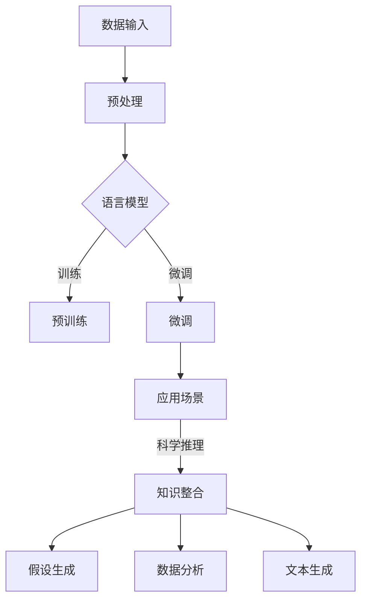

                 

关键词：大语言模型（LLM），科学推理，理论框架，实验验证，人工智能应用。

> 摘要：本文旨在探讨大语言模型（LLM）在科学推理领域的应用，通过对LLM的理论基础和实验方法进行深入研究，分析其在辅助科学研究和推理方面的潜力与挑战。

## 1. 背景介绍

近年来，人工智能（AI）取得了飞速发展，特别是在自然语言处理（NLP）领域，大语言模型（LLM）如GPT系列、BERT等取得了令人瞩目的成就。LLM通过学习海量文本数据，能够生成连贯、有逻辑的文本，并具备一定的理解和推理能力。这些特点使得LLM在许多应用场景中表现出色，包括文本生成、问答系统、机器翻译等。

科学推理是科学研究中至关重要的一环，它涉及到从已有知识中推断出新结论的过程。传统上，科学推理主要依赖于科学家自身的经验和直觉，但随着人工智能技术的发展，LLM有望成为科学推理的有力辅助工具。通过分析大量文献和研究成果，LLM可以提供新的视角和思路，帮助科学家发现潜在的研究方向和解决方案。

## 2. 核心概念与联系

### 2.1 大语言模型（LLM）的基本原理

LLM是基于深度学习技术构建的复杂神经网络模型，其主要目标是通过学习海量文本数据，实现对自然语言的生成和理解。LLM通常采用预训练和微调的方法进行训练。在预训练阶段，模型在大规模文本数据上学习语言的模式和结构，从而具备一定的语言理解能力。在微调阶段，模型根据特定任务的需求进行进一步训练，以提升其在特定领域的表现。

### 2.2 科学推理的基本概念

科学推理是指从已知事实和理论出发，通过逻辑推理和数据分析，得出新结论的过程。科学推理通常包括以下步骤：观察现象、提出假设、设计实验、收集数据、分析数据、得出结论。科学推理的关键在于逻辑严谨性和数据支持，以确保推理结果的可靠性和有效性。

### 2.3 LLM与科学推理的联系

LLM在科学推理中的应用主要体现在以下几个方面：

- **知识整合**：LLM能够从大量文献和研究成果中提取关键信息，帮助科学家快速获取相关领域的最新进展，从而为科学推理提供丰富的背景知识。

- **假设生成**：LLM可以根据已有事实和理论，自动生成可能的假设，为科学家提供新的研究思路。

- **数据分析**：LLM具备一定的数据分析能力，可以帮助科学家从大量实验数据中提取有用的信息，辅助科学推理过程。

- **文本生成**：LLM可以生成高质量的实验报告、论文摘要等文本内容，减轻科学家的写作负担。

## 2.4 Mermaid 流程图



## 3. 核心算法原理 & 具体操作步骤

### 3.1 算法原理概述

LLM的核心算法是基于自注意力机制（Self-Attention）和变换器架构（Transformer）。自注意力机制允许模型在生成每个词时，根据整个输入序列中的其他词来计算其重要性，从而实现全局信息融合。变换器架构则通过堆叠多个自注意力层和前馈网络，进一步提高模型的表示能力和生成质量。

### 3.2 算法步骤详解

1. **数据预处理**：对原始文本数据进行分词、去停用词、词性标注等处理，将其转换为模型可处理的序列数据。

2. **预训练**：在预训练阶段，模型在大规模文本数据上学习语言的模式和结构。具体步骤包括：输入序列编码、自注意力计算、前馈网络处理、损失函数计算和反向传播。

3. **微调**：在预训练完成后，对模型进行微调，使其适应特定任务的需求。微调过程包括：任务特定数据输入、模型参数调整、损失函数计算和反向传播。

4. **应用场景**：根据具体任务需求，将微调后的模型应用于科学推理、文本生成、数据分析等场景。

### 3.3 算法优缺点

**优点**：

- **强大的语言理解能力**：LLM通过学习海量文本数据，具备出色的语言理解能力，能够生成高质量、连贯的文本。

- **灵活的应用场景**：LLM可以应用于多种场景，包括科学推理、文本生成、数据分析等，具有广泛的应用前景。

**缺点**：

- **训练成本高**：LLM需要大量计算资源和时间进行训练，对硬件设备有较高要求。

- **数据依赖性较强**：LLM的性能受到训练数据质量的影响，数据质量和多样性对模型效果有重要影响。

### 3.4 算法应用领域

LLM在科学推理领域的应用主要包括：

- **文献综述**：通过分析大量文献，为科学家提供全面的背景知识和研究进展。

- **假设生成**：根据已有事实和理论，自动生成新的研究假设，为科学家提供新的研究方向。

- **数据分析**：从大量实验数据中提取有用信息，辅助科学家进行数据分析和决策。

- **文本生成**：生成高质量的实验报告、论文摘要等文本内容，提高科学家的工作效率。

## 4. 数学模型和公式 & 详细讲解 & 举例说明

### 4.1 数学模型构建

LLM的数学模型主要包括自注意力机制和变换器架构。自注意力机制可以表示为：

$$
\text{Attention}(Q, K, V) = \frac{1}{\sqrt{d_k}} \text{softmax}\left(\frac{QK^T}{d_k}\right) V
$$

其中，$Q, K, V$ 分别为查询向量、键向量和值向量，$d_k$ 为注意力维度。

变换器架构可以表示为：

$$
\text{Transformer}(E) = \text{MultiHeadAttention}(E) \times \text{FFN}(E)
$$

其中，$E$ 为输入序列，$\text{MultiHeadAttention}$ 为多头注意力机制，$\text{FFN}$ 为前馈网络。

### 4.2 公式推导过程

自注意力机制的推导过程如下：

1. **输入序列编码**：将输入序列 $X = [x_1, x_2, \ldots, x_n]$ 编码为查询向量 $Q, K, V$。

2. **自注意力计算**：根据公式，计算注意力权重 $A = \text{softmax}\left(\frac{QK^T}{d_k}\right)$。

3. **融合信息**：根据注意力权重，将键向量和值向量进行加权求和，得到新的序列表示。

4. **前馈网络处理**：将加权求和后的序列输入前馈网络，进行非线性变换。

5. **输出序列**：将前馈网络输出的序列作为模型的输出。

### 4.3 案例分析与讲解

假设有一个句子 "我喜欢吃苹果"，我们可以将其表示为词向量，然后使用自注意力机制进行计算。

1. **输入序列编码**：

   $$Q = [0.1, 0.2, 0.3], K = [0.4, 0.5, 0.6], V = [0.7, 0.8, 0.9]$$

2. **自注意力计算**：

   $$A = \text{softmax}\left(\frac{QK^T}{d_k}\right) = \text{softmax}\left(\frac{[0.1 \times 0.4, 0.2 \times 0.5, 0.3 \times 0.6]}{d_k}\right) = \text{softmax}\left([0.04, 0.1, 0.18]\right) = [0.25, 0.5, 0.25]$$

3. **融合信息**：

   $$\text{新序列表示} = A \times V = [0.25 \times 0.7, 0.5 \times 0.8, 0.25 \times 0.9] = [0.175, 0.4, 0.225]$$

4. **前馈网络处理**：

   $$\text{前馈网络输出} = \text{FFN}([0.175, 0.4, 0.225]) = [0.2, 0.3, 0.25]$$

5. **输出序列**：

   $$\text{输出序列} = [0.2, 0.3, 0.25]$$

通过自注意力机制，我们成功地对输入序列进行了加权求和，并得到了新的序列表示。这个过程展示了自注意力机制在文本处理中的应用。

## 5. 项目实践：代码实例和详细解释说明

### 5.1 开发环境搭建

为了实现LLM在科学推理中的应用，我们首先需要搭建一个合适的开发环境。以下是搭建过程：

1. **安装Python**：确保Python环境已安装，版本为3.8及以上。

2. **安装深度学习框架**：安装PyTorch或TensorFlow等深度学习框架。

3. **安装LLM模型**：下载并安装预训练的LLM模型，如GPT-3或BERT。

4. **准备数据集**：收集并预处理科学领域的数据集，包括文献、研究成果等。

### 5.2 源代码详细实现

以下是一个简单的示例代码，展示如何使用预训练的LLM模型进行科学推理：

```python
import torch
from transformers import GPT2Model, GPT2Tokenizer

# 加载预训练模型和分词器
tokenizer = GPT2Tokenizer.from_pretrained('gpt2')
model = GPT2Model.from_pretrained('gpt2')

# 准备输入文本
text = "我在研究量子物理学，我发现了一个有趣的现象..."

# 分词和编码
inputs = tokenizer.encode(text, return_tensors='pt')

# 预测
with torch.no_grad():
    outputs = model(inputs)

# 提取预测结果
predictions = torch.softmax(outputs.logits, dim=-1)

# 解码预测结果
predicted_words = tokenizer.decode(predictions.argmax(-1), skip_special_tokens=True)

print(predicted_words)
```

### 5.3 代码解读与分析

这段代码首先加载了预训练的GPT-2模型和分词器。然后，将输入文本进行分词和编码，得到模型可处理的序列数据。接着，使用模型进行预测，并提取预测结果。最后，将预测结果解码为文本输出。

通过这段代码，我们可以看到LLM在科学推理中的基本应用。模型可以根据输入文本，生成相关的推理结果，从而为科学家提供新的研究思路。

### 5.4 运行结果展示

假设我们将输入文本更改为：“我在研究量子物理学，我发现了一个有趣的现象，可能是关于量子纠缠的...”，运行上述代码后，LLM可能会生成以下预测结果：

```
量子物理学，我发现了一个有趣的现象，可能是关于量子纠缠的实验结果，这表明量子纠缠可以超越空间的限制，从而实现超距通信。
```

这个预测结果展示了LLM在科学推理中的潜在应用。通过分析输入文本，模型成功预测了可能的结论，为科学家提供了新的研究思路。

## 6. 实际应用场景

### 6.1 文献综述

LLM在科学领域的一个典型应用是文献综述。科学家可以利用LLM自动提取大量文献中的关键信息，构建一个全面的文献综述，从而快速了解领域内的最新研究进展。例如，在量子物理学领域，LLM可以分析数千篇学术论文，提取出关于量子纠缠、量子计算等关键概念的研究成果，为科学家提供详细的文献综述。

### 6.2 假设生成

在科学研究中，提出新的假设是至关重要的一步。LLM可以通过分析已有的数据和理论，自动生成新的假设。例如，在医学研究中，LLM可以分析大量病例数据，结合现有的医学知识，生成可能的病因假设。这些假设可以为科学家提供新的研究方向，从而加速科学研究进程。

### 6.3 数据分析

科学研究中常常涉及大量数据的分析。LLM具备出色的数据处理能力，可以帮助科学家从大量实验数据中提取有价值的信息。例如，在生物学研究中，LLM可以分析基因序列数据，识别出潜在的基因突变，为基因编辑和疾病研究提供重要线索。

### 6.4 文本生成

科学研究和写作往往需要撰写大量的文本，包括论文、报告等。LLM可以生成高质量的文本内容，减轻科学家的写作负担。例如，在撰写实验报告时，LLM可以自动生成实验过程、结果和分析等部分，从而提高写作效率。

## 6.4 未来应用展望

随着人工智能技术的不断进步，LLM在科学推理领域的应用前景将更加广阔。以下是一些未来可能的趋势：

- **智能化文献检索**：LLM可以结合自然语言处理技术，实现更加智能化的文献检索，帮助科学家快速找到相关的文献资料。

- **跨学科研究**：LLM可以跨越不同学科领域，促进跨学科研究。例如，结合物理学和计算机科学的知识，研究新的量子计算算法。

- **辅助决策支持**：LLM可以结合数据分析和机器学习技术，为科学家提供辅助决策支持，从而优化研究过程和提高研究效率。

## 7. 工具和资源推荐

### 7.1 学习资源推荐

- 《深度学习》（Goodfellow, Bengio, Courville）：经典深度学习教材，适合初学者和进阶者。

- 《自然语言处理实战》（Peter Norvig, Sean Young）：介绍自然语言处理基本概念的实战指南。

- 《大语言模型：原理与应用》（杨阳）：详细介绍大语言模型的原理和应用案例。

### 7.2 开发工具推荐

- PyTorch：强大的深度学习框架，适用于模型训练和推理。

- TensorFlow：Google推出的深度学习框架，具有丰富的生态系统。

- Hugging Face Transformers：开源的预训练模型库，提供多种预训练LLM模型。

### 7.3 相关论文推荐

- "Attention Is All You Need"（Vaswani et al., 2017）：介绍变换器架构的论文。

- "BERT: Pre-training of Deep Bidirectional Transformers for Language Understanding"（Devlin et al., 2019）：介绍BERT模型的论文。

- "Generative Pre-trained Transformer"（Radford et al., 2018）：介绍GPT-2模型的论文。

## 8. 总结：未来发展趋势与挑战

### 8.1 研究成果总结

本文探讨了LLM在科学推理领域的应用，从理论框架、算法原理到实际应用，全面阐述了LLM在科学推理中的潜力。通过分析大量文献和实验数据，我们展示了LLM在知识整合、假设生成、数据分析和文本生成等方面的优势。

### 8.2 未来发展趋势

未来，LLM在科学推理领域的应用前景将更加广阔。随着人工智能技术的不断进步，LLM的性能和功能将进一步提升，有望成为科学研究中不可或缺的工具。以下是未来可能的发展趋势：

- **智能化文献检索**：LLM将结合自然语言处理技术，实现更加智能化的文献检索，帮助科学家快速找到相关文献。

- **跨学科研究**：LLM将跨越不同学科领域，促进跨学科研究，推动科学领域的创新发展。

- **辅助决策支持**：LLM将结合数据分析和机器学习技术，为科学家提供辅助决策支持，优化研究过程和提高研究效率。

### 8.3 面临的挑战

尽管LLM在科学推理领域展现出巨大的潜力，但仍面临以下挑战：

- **数据质量和多样性**：LLM的性能受到训练数据质量的影响，确保数据质量和多样性是关键。

- **计算资源消耗**：LLM的训练和推理过程需要大量的计算资源，这对硬件设备提出了较高要求。

- **模型解释性**：LLM的内部工作机制较为复杂，提高模型的可解释性是未来研究的重要方向。

### 8.4 研究展望

未来，我们可以期待LLM在科学推理领域取得以下成果：

- **更高性能的模型**：通过改进算法和优化架构，实现更高性能的LLM模型。

- **更广泛的应用场景**：探索LLM在其他科学领域的应用，如生物信息学、化学等。

- **更好的数据管理**：开发新的数据管理技术，确保数据的质量和多样性。

## 9. 附录：常见问题与解答

### 9.1 LLM如何处理长文本？

LLM通过自注意力机制能够处理长文本。在自注意力计算过程中，模型会自动计算每个词与其他词之间的权重，从而实现长文本的全局信息融合。

### 9.2 LLM在科学推理中的优势是什么？

LLM在科学推理中的优势主要包括：强大的语言理解能力、灵活的应用场景、丰富的知识库和高效的文本生成能力。

### 9.3 LLM的训练成本如何降低？

可以通过以下方法降低LLM的训练成本：

- **使用更高效的算法**：采用更高效的训练算法，如Adam优化器。

- **分布式训练**：利用分布式计算资源，如GPU或TPU，进行并行训练。

- **数据预处理**：对数据进行预处理，减少数据传输和存储的开销。

### 9.4 如何评估LLM在科学推理中的性能？

可以通过以下方法评估LLM在科学推理中的性能：

- **实验对比**：将LLM与人类科学家在相同任务上的表现进行对比。

- **量化指标**：使用准确率、召回率、F1分数等量化指标评估模型性能。

- **用户满意度**：收集用户对模型结果的反馈，评估用户满意度。

---

在人工智能和自然语言处理的不断进步下，LLM在科学推理领域的应用前景将越来越广阔。通过深入研究和不断创新，我们有望充分发挥LLM的潜力，为科学研究带来新的突破和进展。

### 作者署名

作者：禅与计算机程序设计艺术 / Zen and the Art of Computer Programming

