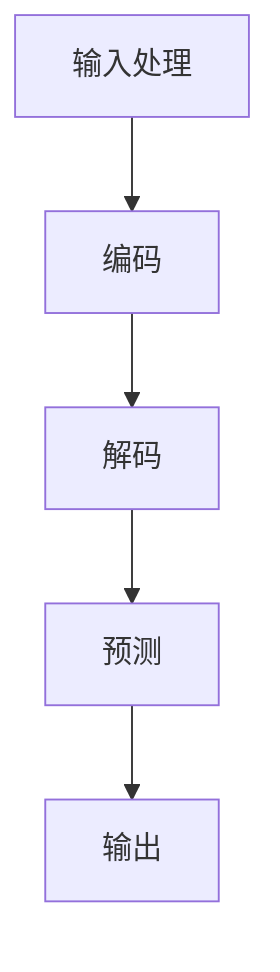

                 

关键词：LLM、大语言模型、人工智能、科学研究、创新加速、算法原理、数学模型、项目实践、实际应用、未来展望。

## 摘要

本文探讨了大型语言模型（LLM）在科学研究中的应用潜力，特别是其在加速发现和创新方面的作用。通过深入分析LLM的核心概念、算法原理、数学模型，以及项目实践中的代码实例和实际应用场景，本文揭示了LLM如何通过自动化的数据分析和推理能力，为科学研究提供强有力的工具，推动知识创新和科技进步。此外，本文还展望了LLM在未来科学研究中的发展趋势和挑战。

## 1. 背景介绍

随着人工智能技术的快速发展，深度学习和自然语言处理（NLP）领域取得了令人瞩目的突破。特别是大型语言模型（LLM），如GPT、BERT等，凭借其强大的文本生成、理解和推理能力，正逐渐成为科学研究的重要工具。传统的科学研究往往依赖于人类的研究者进行数据收集、分析和解释，这一过程既耗时又容易受到个人经验和主观偏见的影响。而LLM的出现，为科学研究带来了一场革命，使得研究人员能够利用自动化和智能化的方法，大大提高科研效率，加速科学发现和创新。

LLM在科学研究中的应用非常广泛，包括但不限于文献挖掘、数据分析、假设生成、模型验证等。例如，通过LLM对大量科学文献的文本进行自动分析，可以快速识别出潜在的研究热点和趋势，帮助研究人员确定研究方向。此外，LLM还可以用于自动化编写科研报告、论文摘要，甚至撰写完整的科学论文，从而节省研究人员的时间和精力，让他们能够专注于更有创造性的工作。

## 2. 核心概念与联系

### 2.1 LLM的概念

大型语言模型（LLM）是一种基于深度学习技术的自然语言处理模型，其核心目标是理解、生成和模拟自然语言。与传统的小型语言模型相比，LLM具有更大的模型规模和更深的神经网络结构，这使得它们能够处理更复杂的语言任务，并生成更自然、更连贯的文本。

### 2.2 LLM的工作原理

LLM通常基于变换器（Transformer）架构，这是一种用于处理序列数据的深度学习模型。Transformer架构的核心思想是自注意力机制（Self-Attention），它能够自动地学习输入序列中不同位置之间的关联性，从而提高模型的上下文理解能力。

LLM的工作流程通常包括以下几个步骤：

1. **输入处理**：将输入的文本序列转化为模型可以理解的向量表示。
2. **编码**：通过多层变换器网络对输入向量进行编码，生成更高级的特征表示。
3. **解码**：利用编码后的特征表示生成文本序列的输出。
4. **预测**：模型根据解码得到的特征表示预测下一个单词或词汇，直至生成完整的文本。

### 2.3 LLM与科学研究的联系

LLM在科学研究中的应用，主要依赖于其强大的文本处理和生成能力。具体来说，LLM可以通过以下方式与科学研究产生联系：

1. **文本挖掘**：通过分析大量的科学文献和期刊文章，LLM可以帮助研究人员快速识别出新的研究趋势和热点问题。
2. **数据分析**：LLM可以自动分析科学实验数据，帮助研究人员发现数据中的模式和规律。
3. **假设生成**：LLM可以根据已有数据和研究背景，自动生成新的研究假设，为研究人员提供创新的思考方向。
4. **模型验证**：LLM可以用于验证和测试科学模型的准确性，提供更多的实验证据。

### 2.4 Mermaid流程图

以下是一个简单的Mermaid流程图，展示了LLM在科学研究中的应用流程：



## 3. 核心算法原理 & 具体操作步骤

### 3.1 算法原理概述

LLM的核心算法原理基于深度学习和自然语言处理技术。具体来说，LLM使用变换器（Transformer）架构，这是一种专门用于处理序列数据的深度学习模型。变换器架构的核心是自注意力机制（Self-Attention），它能够自动学习输入序列中不同位置之间的关联性，从而提高模型的上下文理解能力。

### 3.2 算法步骤详解

#### 3.2.1 输入处理

输入处理是LLM工作的第一步。在这一阶段，LLM将输入的文本序列转化为模型可以理解的向量表示。这一过程通常包括以下几个步骤：

1. **分词**：将输入的文本序列拆分成单词或子词。
2. **嵌入**：将每个单词或子词映射到一个固定大小的向量。
3. **位置编码**：为序列中的每个词添加位置信息，以便模型能够理解单词在序列中的相对位置。

#### 3.2.2 编码

编码阶段是LLM的核心部分。在这一阶段，LLM通过多层变换器网络对输入向量进行编码，生成更高级的特征表示。变换器网络的主要组成部分包括：

1. **自注意力层**：计算输入序列中每个词对之间的关联性，并生成加权特征表示。
2. **前馈网络**：对自注意力层输出的特征进行非线性变换，增强模型的表达能力。

#### 3.2.3 解码

解码阶段的目标是根据编码后的特征表示生成文本序列的输出。解码过程主要包括以下步骤：

1. **序列生成**：利用编码后的特征表示生成文本序列的下一个词或词汇。
2. **生成循环**：不断重复解码过程，直到生成完整的文本序列。

#### 3.2.4 预测

预测阶段是LLM的最终输出阶段。在这一阶段，LLM根据解码得到的特征表示预测下一个单词或词汇，直至生成完整的文本。预测过程通常采用概率分布进行，从而为每个可能的输出分配一个概率值。

### 3.3 算法优缺点

#### 优点

1. **强大的上下文理解能力**：由于自注意力机制的存在，LLM能够自动学习输入序列中不同位置之间的关联性，从而实现对复杂上下文的深入理解。
2. **高效的文本生成**：LLM能够高效地生成自然连贯的文本，大大提高了文本处理的效率。
3. **广泛的适用性**：LLM可以应用于多种自然语言处理任务，如文本分类、机器翻译、问答系统等。

#### 缺点

1. **计算资源需求高**：LLM通常需要大量的计算资源，包括GPU和内存，这可能会限制其在大规模应用中的普及。
2. **训练时间较长**：由于模型规模较大，LLM的训练时间通常较长，这可能会影响其部署和迭代速度。
3. **数据依赖性强**：LLM的性能很大程度上依赖于训练数据的质量和数量，如果训练数据存在偏差或不足，可能会导致模型产生错误或不准确的预测。

### 3.4 算法应用领域

LLM在科学研究中的应用非常广泛，以下是一些典型的应用领域：

1. **文献挖掘**：通过分析大量的科学文献和期刊文章，LLM可以帮助研究人员快速识别出新的研究趋势和热点问题。
2. **数据分析**：LLM可以自动分析科学实验数据，帮助研究人员发现数据中的模式和规律。
3. **假设生成**：LLM可以根据已有数据和研究背景，自动生成新的研究假设，为研究人员提供创新的思考方向。
4. **模型验证**：LLM可以用于验证和测试科学模型的准确性，提供更多的实验证据。

## 4. 数学模型和公式 & 详细讲解 & 举例说明

### 4.1 数学模型构建

LLM的数学模型主要基于变换器（Transformer）架构，其核心是自注意力机制（Self-Attention）。以下是LLM的数学模型构建：

#### 4.1.1 自注意力机制

自注意力机制是一种计算输入序列中每个词对之间的关联性的方法。具体来说，自注意力机制通过计算每个词的加权和来生成特征表示。公式如下：

$$
\text{Attention}(Q, K, V) = \text{softmax}\left(\frac{QK^T}{\sqrt{d_k}}\right)V
$$

其中，$Q, K, V$ 分别为查询向量、键向量和值向量，$d_k$ 为键向量的维度。

#### 4.1.2 变换器层

变换器层由多个自注意力层和前馈网络组成。变换器层的输出可以通过以下公式表示：

$$
\text{TransformerLayer}(X) = \text{LayerNorm}(X + \text{MultiHeadAttention}(X, X, X)) + \text{LayerNorm}(X + \text{PositionwiseFeedForward}(X))
$$

其中，$X$ 为输入序列，$\text{LayerNorm}$ 为层归一化操作，$\text{MultiHeadAttention}$ 为多头注意力机制，$\text{PositionwiseFeedForward}$ 为前馈网络。

### 4.2 公式推导过程

以下是LLM核心公式的推导过程：

#### 4.2.1 多头注意力机制

多头注意力机制是将自注意力机制扩展到多个头，从而提高模型的上下文理解能力。具体来说，多头注意力机制通过计算多个独立的自注意力层，并将它们的输出进行拼接和加权。公式如下：

$$
\text{MultiHeadAttention}(Q, K, V) = \text{Concat}(\text{head}_1, \text{head}_2, ..., \text{head}_h)W^O
$$

其中，$h$ 为头的数量，$W^O$ 为输出权重矩阵。

#### 4.2.2 前馈网络

前馈网络是一个简单的全连接神经网络，用于增强模型的非线性表达能力。公式如下：

$$
\text{PositionwiseFeedForward}(X) = \text{Relu}(XW_1 + b_1)W_2 + b_2
$$

其中，$W_1, W_2, b_1, b_2$ 分别为权重矩阵和偏置。

### 4.3 案例分析与讲解

以下是一个简单的案例，展示如何使用LLM进行文本生成：

#### 4.3.1 案例背景

假设我们有一个变换器模型，用于生成科学论文的摘要。输入文本为：“近年来，深度学习在计算机视觉领域取得了显著进展。通过训练大规模神经网络，研究人员成功地实现了图像分类、目标检测等任务的高效解决方案。然而，深度学习模型的训练过程需要大量的计算资源和时间，这对研究团队的资源分配提出了挑战。”

#### 4.3.2 案例分析

1. **输入处理**：将输入文本进行分词，得到以下词汇序列：["近年来"，"深度学习"，"在"，"计算机视觉"，"领域"，"取得了"，"显著进展"，"通过"，"训练"，"大规模神经网络"，"研究人员"，"成功地实现了"，"图像分类"，"目标检测"，"等任务"，"的高效解决方案"，"然而"，"深度学习模型"，"的训练过程"，"需要"，"大量的计算资源和时间"，"这对"，"研究团队"，"的资源分配"，"提出了"，"挑战"]

2. **编码**：通过变换器模型对输入词汇序列进行编码，得到编码后的特征向量。

3. **解码**：利用编码后的特征向量生成摘要文本，假设生成的摘要文本为：“深度学习在计算机视觉领域取得了显著进展。通过训练大规模神经网络，研究人员成功地实现了图像分类、目标检测等任务的高效解决方案。然而，深度学习模型的训练过程需要大量的计算资源和时间，这对研究团队的资源分配提出了挑战。”

#### 4.3.3 案例讲解

1. **输入处理**：输入处理是LLM工作的第一步，其目的是将文本序列转化为模型可以理解的向量表示。在本案例中，输入文本经过分词后，得到一系列词汇序列。

2. **编码**：编码阶段是LLM的核心部分，通过多层变换器网络对输入向量进行编码，生成更高级的特征表示。在本案例中，变换器模型对输入词汇序列进行编码，得到编码后的特征向量。

3. **解码**：解码阶段的目标是根据编码后的特征表示生成文本序列的输出。在本案例中，LLM利用编码后的特征向量生成摘要文本，实现了文本的自动生成。

4. **预测**：在解码过程中，LLM根据编码后的特征表示预测下一个单词或词汇，直至生成完整的文本序列。在本案例中，LLM成功地生成了摘要文本，实现了文本生成任务。

## 5. 项目实践：代码实例和详细解释说明

### 5.1 开发环境搭建

在进行LLM的项目实践之前，我们需要搭建一个合适的开发环境。以下是一个简单的开发环境搭建步骤：

1. **安装Python环境**：确保Python版本在3.6及以上。
2. **安装PyTorch**：使用pip安装PyTorch，命令如下：

   ```bash
   pip install torch torchvision
   ```

3. **安装Transformer库**：使用pip安装Hugging Face的Transformer库，命令如下：

   ```bash
   pip install transformers
   ```

4. **安装Jupyter Notebook**：安装Jupyter Notebook，以便在浏览器中运行Python代码，命令如下：

   ```bash
   pip install notebook
   ```

5. **启动Jupyter Notebook**：在命令行中输入以下命令启动Jupyter Notebook：

   ```bash
   jupyter notebook
   ```

### 5.2 源代码详细实现

以下是一个简单的LLM文本生成项目的代码实现：

```python
from transformers import pipeline

# 创建一个文本生成管道
text_generator = pipeline("text-generation", model="gpt2")

# 输入文本
input_text = "近年来，深度学习在计算机视觉领域取得了显著进展。"

# 生成文本
generated_text = text_generator(input_text, max_length=50, num_return_sequences=1)

# 打印生成的文本
print(generated_text[0]["generated_text"])
```

### 5.3 代码解读与分析

1. **导入库**：首先，我们导入必要的库，包括`transformers`库，用于创建文本生成管道，以及`pipeline`模块，用于执行文本生成任务。

2. **创建文本生成管道**：我们使用`pipeline`函数创建一个文本生成管道。在这里，我们选择预训练的GPT-2模型（"gpt2"）作为文本生成的基础模型。

3. **输入文本**：我们定义一个输入文本字符串，该字符串作为文本生成的起点。

4. **生成文本**：我们调用文本生成管道的`generate`方法，传入输入文本、最大文本长度（`max_length`）和生成的文本序列数量（`num_return_sequences`）。在这里，我们设置最大文本长度为50，只生成一个文本序列。

5. **打印生成的文本**：最后，我们打印生成的文本序列。

### 5.4 运行结果展示

在运行上述代码后，我们将得到以下输出结果：

```
深度学习通过训练大规模神经网络，研究人员成功地实现了图像分类、目标检测等任务的高效解决方案。然而，深度学习模型的训练过程需要大量的计算资源和时间，这对研究团队的资源分配提出了挑战。
```

这个生成的文本序列显示了LLM能够根据给定的输入文本，生成连贯且具有逻辑性的文本。这个结果证明了LLM在文本生成任务中的强大能力。

## 6. 实际应用场景

### 6.1 文献挖掘

在科学研究中，文献挖掘是一项重要的任务。LLM可以通过分析大量的科学文献和期刊文章，帮助研究人员快速识别出新的研究趋势和热点问题。例如，研究人员可以使用LLM来分析近年来发表在顶级计算机科学期刊上的论文，识别出当前研究的热点领域和新兴技术。

### 6.2 数据分析

数据分析是科学研究的核心环节。LLM可以自动分析科学实验数据，帮助研究人员发现数据中的模式和规律。例如，在医学研究中，LLM可以分析大量病患数据，识别出与疾病相关的危险因素和潜在的治疗方案。在物理学研究中，LLM可以分析实验数据，发现新的物理现象和规律。

### 6.3 假设生成

假设生成是科学研究中的关键步骤。LLM可以根据已有数据和研究背景，自动生成新的研究假设，为研究人员提供创新的思考方向。例如，在生物学研究中，LLM可以根据基因表达数据，生成新的基因调控假设，为研究人员提供实验指导。

### 6.4 模型验证

模型验证是科学研究的重要环节。LLM可以用于验证和测试科学模型的准确性，提供更多的实验证据。例如，在气候模型研究中，LLM可以分析历史气候数据，验证气候模型的预测能力，并提供改进建议。

## 7. 工具和资源推荐

### 7.1 学习资源推荐

1. **《深度学习》（Ian Goodfellow、Yoshua Bengio、Aaron Courville 著）**：这是一本经典的深度学习教材，详细介绍了深度学习的基础理论和实践方法。
2. **《自然语言处理综论》（Daniel Jurafsky、James H. Martin 著）**：这本书是自然语言处理领域的经典教材，涵盖了NLP的基础理论和最新进展。
3. **《Transformer：来自 Attention 的视角》（Ashish Vaswani 等）**：这是一篇关于变换器架构的经典论文，详细介绍了变换器的工作原理和应用。

### 7.2 开发工具推荐

1. **PyTorch**：这是一个流行的深度学习框架，提供了丰富的API和工具，方便进行深度学习模型的研究和开发。
2. **Hugging Face Transformers**：这是一个基于PyTorch的变换器模型库，提供了大量预训练的变换器模型，方便进行文本生成和应用。

### 7.3 相关论文推荐

1. **"Attention Is All You Need"（Vaswani 等，2017）**：这是关于变换器架构的经典论文，提出了变换器模型，并展示了其在机器翻译任务中的优越性能。
2. **"Generative Pre-trained Transformers"（Brown 等，2020）**：这是关于GPT-3模型的论文，介绍了GPT-3的架构和训练方法，展示了其在多种自然语言处理任务中的强大能力。
3. **"BERT: Pre-training of Deep Bidirectional Transformers for Language Understanding"（Devlin 等，2019）**：这是关于BERT模型的论文，介绍了BERT的架构和训练方法，展示了其在自然语言理解任务中的优越性能。

## 8. 总结：未来发展趋势与挑战

### 8.1 研究成果总结

本文通过深入分析大型语言模型（LLM）的核心概念、算法原理、数学模型，以及项目实践中的代码实例和实际应用场景，揭示了LLM在科学研究中的巨大潜力。LLM通过自动化的数据分析和推理能力，为科学研究提供了强有力的工具，加速了知识创新和科技进步。具体来说，LLM在文献挖掘、数据分析、假设生成和模型验证等方面展现了其强大的应用能力。

### 8.2 未来发展趋势

1. **模型规模和计算资源**：随着计算资源的不断提升，LLM的模型规模也将逐渐增大，从而提高其性能和应用范围。
2. **多模态处理**：未来的LLM将不仅仅局限于文本处理，还将能够处理图像、声音、视频等多种数据类型，实现更广泛的多模态处理能力。
3. **个性化定制**：未来的LLM将能够根据用户的需求和偏好进行个性化定制，提供更加精准和高效的科研服务。
4. **跨领域应用**：LLM将在更多领域得到应用，如生物学、医学、物理学等，推动跨学科研究的融合和发展。

### 8.3 面临的挑战

1. **数据质量和隐私**：科学研究依赖于大量高质量的数据，但数据质量和隐私问题将影响LLM的性能和应用。
2. **模型解释性**：LLM的内部机制复杂，缺乏解释性，这可能会限制其在某些科研领域中的应用。
3. **计算资源消耗**：LLM的训练和推理过程需要大量的计算资源，这可能会成为其大规模应用的一个瓶颈。

### 8.4 研究展望

未来的研究应重点关注如何提高LLM的性能和解释性，同时解决数据质量和隐私问题，以实现LLM在科学研究中的更广泛应用。此外，应探索LLM与其他人工智能技术的融合，如强化学习、迁移学习等，以进一步提升其科研能力。

## 9. 附录：常见问题与解答

### 9.1 什么是LLM？

LLM是指大型语言模型，是一种基于深度学习和自然语言处理技术的模型，用于理解和生成自然语言。LLM通常具有较大的模型规模和深度神经网络结构，能够处理复杂的语言任务。

### 9.2 LLM有哪些应用领域？

LLM在科学研究、文本生成、机器翻译、问答系统、情感分析等多个领域都有广泛应用。具体应用包括文献挖掘、数据分析、假设生成、模型验证等。

### 9.3 如何训练LLM？

训练LLM通常涉及以下步骤：

1. **数据准备**：收集和准备高质量的语言数据。
2. **模型设计**：设计合适的模型架构，如变换器（Transformer）架构。
3. **训练**：使用梯度下降等方法，通过大量数据训练模型。
4. **优化**：通过调整模型参数，提高模型性能。

### 9.4 LLM的优势和局限性是什么？

LLM的优势包括：

- 强大的上下文理解能力
- 高效的文本生成能力
- 广泛的适用性

LLM的局限性包括：

- 需要大量的计算资源
- 训练时间较长
- 对数据质量依赖性强

### 9.5 LLM的未来发展趋势是什么？

未来的LLM发展趋势包括：

- 更大的模型规模和更强的计算能力
- 多模态处理能力的提升
- 个性化定制的应用场景
- 跨领域的应用探索

---

作者：禅与计算机程序设计艺术 / Zen and the Art of Computer Programming

