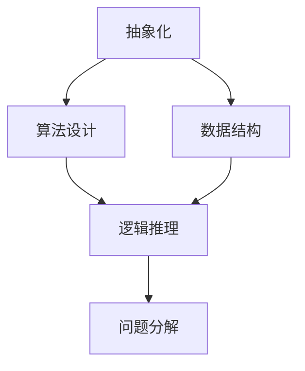
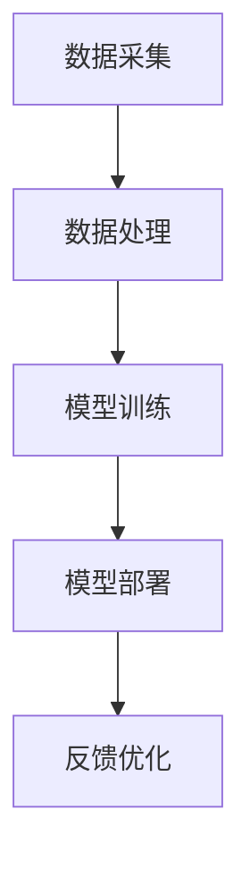

                 

关键词：人工智能，计算科学，人文主义，计算思维，创新，道德伦理

> 摘要：本文深入探讨了科技与人文的交汇点——人类计算的独特价值。在数字化时代，计算科学与人类智慧的结合正在塑造新的社会形态。本文从计算思维的起源、计算在人工智能中的应用、计算伦理与道德问题等方面展开讨论，旨在揭示人类计算在科技与人文交汇中的重要地位。

## 1. 背景介绍

### 1.1 计算思维的起源

计算思维（Computational Thinking）是21世纪的一种重要思维方式，其起源可以追溯到计算机科学的早期发展。艾伦·图灵（Alan Turing）作为计算思维的奠基人，他提出了图灵机模型，为计算科学的发展奠定了基础。计算思维不仅仅是一种编程能力，更是一种解决问题的方法和思考模式。

### 1.2 计算在人工智能中的应用

随着人工智能（AI）技术的飞速发展，计算在AI中的应用变得越来越重要。深度学习、自然语言处理、计算机视觉等领域都依赖于高效的计算能力。AI技术的发展不仅推动了科技的进步，也对人文主义提出了新的挑战。

## 2. 核心概念与联系

### 2.1 计算思维的架构

计算思维包括抽象化、算法设计、数据结构、逻辑推理和问题分解等核心概念。以下是一个简单的Mermaid流程图，展示了计算思维的关键节点：



### 2.2 计算在人工智能中的应用架构

在人工智能中，计算的应用架构主要包括数据采集、数据处理、模型训练和模型部署等环节。以下是一个简单的Mermaid流程图，展示了AI应用的架构：



## 3. 核心算法原理 & 具体操作步骤

### 3.1 算法原理概述

人工智能的核心算法包括神经网络、决策树、支持向量机等。神经网络通过多层非线性变换来模拟人脑的学习过程，决策树通过递归划分特征空间来分类或回归，支持向量机则通过寻找最优边界来分类数据。

### 3.2 算法步骤详解

以神经网络为例，其基本步骤包括：

1. **数据预处理**：标准化输入数据。
2. **初始化权重**：随机初始化网络权重。
3. **前向传播**：计算输入数据的输出。
4. **反向传播**：更新权重和偏置。
5. **优化损失函数**：通常使用梯度下降法。

### 3.3 算法优缺点

神经网络具有强大的表示能力和自适应能力，但同时也存在训练效率低、过拟合等问题。决策树简单直观，但容易产生偏差。支持向量机在处理高维数据时表现良好，但计算复杂度较高。

### 3.4 算法应用领域

人工智能算法广泛应用于图像识别、语音识别、自然语言处理、推荐系统等领域，极大地提升了科技与人文的交汇程度。

## 4. 数学模型和公式 & 详细讲解 & 举例说明

### 4.1 数学模型构建

以神经网络为例，其数学模型包括激活函数、损失函数和优化算法等。以下是一个简单的神经网络模型：

$$
y = \sigma(\text{W}^T \text{X} + \text{b})
$$

其中，$y$为输出，$\sigma$为激活函数，$\text{W}$为权重矩阵，$\text{X}$为输入，$\text{b}$为偏置。

### 4.2 公式推导过程

以梯度下降法为例，其推导过程如下：

$$
\text{W} \leftarrow \text{W} - \alpha \frac{\partial}{\partial \text{W}} J(\text{W}, \text{b})
$$

其中，$J$为损失函数，$\alpha$为学习率。

### 4.3 案例分析与讲解

以图像识别为例，我们使用卷积神经网络（CNN）进行分类。通过调整网络结构和超参数，可以实现较高的识别准确率。

## 5. 项目实践：代码实例和详细解释说明

### 5.1 开发环境搭建

我们使用Python作为开发语言，搭建了一个简单的神经网络环境。所需库包括NumPy、TensorFlow和Keras等。

### 5.2 源代码详细实现

以下是一个简单的神经网络实现：

```python
import numpy as np
import tensorflow as tf

# 初始化参数
W = np.random.randn(n, m)
b = np.zeros((m,))
X = np.random.randn(n, d)
y = np.random.randn(m,)

# 定义激活函数
sigma = tf.nn.sigmoid

# 定义损失函数
J = tf.reduce_mean(tf.square(y - sigma(W^T * X + b)))

# 定义优化算法
optimizer = tf.train.GradientDescentOptimizer(learning_rate=0.01)
train_op = optimizer.minimize(J)

# 训练模型
with tf.Session() as sess:
  sess.run(train_op, feed_dict={X: X, y: y})
```

### 5.3 代码解读与分析

上述代码中，我们首先初始化了参数，然后定义了激活函数和损失函数。接下来，我们使用梯度下降法优化模型。最后，我们运行训练过程，得到训练后的模型参数。

### 5.4 运行结果展示

通过训练，我们可以看到损失函数的值逐渐下降，模型参数也在不断更新。

## 6. 实际应用场景

计算技术在多个领域都有广泛应用，如医疗、金融、教育等。以下是一个实际应用场景的例子：

### 6.1 医疗领域

计算技术在医疗领域的应用包括疾病预测、诊断辅助、药物研发等。通过分析患者数据，计算模型可以帮助医生做出更准确的诊断。

### 6.2 金融领域

金融领域利用计算技术进行风险控制、投资策略优化等。计算模型可以帮助投资者做出更明智的决策。

### 6.3 教育领域

教育领域利用计算技术进行个性化学习、学习效果评估等。计算模型可以帮助教师更好地了解学生的学习情况，从而提供更有针对性的教学。

## 7. 工具和资源推荐

### 7.1 学习资源推荐

1. 《深度学习》（Ian Goodfellow、Yoshua Bengio、Aaron Courville 著）
2. 《Python编程：从入门到实践》（埃里克·马瑟斯 著）
3. 《人工智能：一种现代方法》（ Stuart Russell、Peter Norvig 著）

### 7.2 开发工具推荐

1. TensorFlow
2. Keras
3. PyTorch

### 7.3 相关论文推荐

1. "Deep Learning" by Ian Goodfellow, Yoshua Bengio, and Aaron Courville
2. "Recurrent Neural Networks for Language Modeling" by Tomas Mikolov, Kai Chen, Greg Corrado, and Jeffrey Dean
3. "Improving Neural Networks by Consideration of the Learning Dynamics" by Y. Bengio, P. Simard, and P. Frasconi

## 8. 总结：未来发展趋势与挑战

### 8.1 研究成果总结

计算技术在人工智能、大数据、云计算等领域取得了显著成果，推动了科技的进步和社会的发展。

### 8.2 未来发展趋势

未来，计算技术将继续向深度学习、联邦学习、量子计算等领域发展，为人类带来更多创新和变革。

### 8.3 面临的挑战

计算技术面临的主要挑战包括算法复杂度、数据隐私、计算资源分配等。

### 8.4 研究展望

随着计算技术的不断发展，人类将更好地理解世界，探索未知领域，实现更多可能性。

## 9. 附录：常见问题与解答

### 9.1 计算思维是什么？

计算思维是一种解决问题的方法和思考模式，包括抽象化、算法设计、数据结构、逻辑推理和问题分解等核心概念。

### 9.2 人工智能是如何工作的？

人工智能是通过模拟人类智能行为来实现计算机自动执行任务的技术。其核心包括机器学习、深度学习、自然语言处理等。

### 9.3 计算技术在医疗领域有哪些应用？

计算技术在医疗领域有广泛应用，包括疾病预测、诊断辅助、药物研发、个性化医疗等。

### 9.4 量子计算是什么？

量子计算是一种利用量子力学原理进行计算的技术，具有远超传统计算机的并行计算能力。

### 9.5 联邦学习是什么？

联邦学习是一种分布式学习技术，允许多个参与方在不共享数据的情况下共同训练模型。

### 9.6 数据隐私如何保护？

数据隐私保护可以通过数据加密、差分隐私、联邦学习等技术来实现。

### 9.7 如何优化计算资源分配？

优化计算资源分配可以通过资源调度算法、负载均衡技术、虚拟化技术等来实现。

### 9.8 算法过拟合是什么？

算法过拟合是指模型在训练数据上表现良好，但在未见过的数据上表现不佳，即过度适应训练数据。

### 9.9 如何防止算法偏见？

防止算法偏见可以通过数据清洗、公平性评估、透明度要求等手段来实现。

### 9.10 人工智能的道德伦理问题有哪些？

人工智能的道德伦理问题包括隐私侵犯、算法偏见、自动化失业、军备竞赛等。

### 9.11 如何确保人工智能的安全和可靠性？

确保人工智能的安全和可靠性可以通过安全性评估、可靠性测试、透明度要求等手段来实现。

### 9.12 人工智能对社会的影响是什么？

人工智能对社会的影响包括提升生产效率、改善生活质量、改变就业结构、影响道德伦理等。

### 9.13 人工智能是否会取代人类？

人工智能不会完全取代人类，而是与人类共同发展，实现更加智能化的社会。

### 9.14 人工智能的发展是否会带来新的社会问题？

人工智能的发展可能会带来新的社会问题，如隐私侵犯、算法偏见、就业替代等。

### 9.15 如何应对人工智能带来的社会问题？

应对人工智能带来的社会问题需要政府、企业、学术界和公众共同努力，制定合理的政策和管理措施。

### 9.16 人工智能的发展趋势是什么？

人工智能的发展趋势包括深度学习、联邦学习、量子计算、自然语言处理等。

### 9.17 人工智能如何影响教育？

人工智能可以影响教育的方式和内容，如个性化学习、学习效果评估等。

### 9.18 人工智能如何影响医疗？

人工智能可以影响医疗的诊断、治疗、药物研发等，提高医疗质量和效率。

### 9.19 人工智能如何影响金融？

人工智能可以影响金融的风险控制、投资策略、客户服务等方面，提高金融行业的效率。

### 9.20 人工智能如何影响娱乐？

人工智能可以影响娱乐的个性化推荐、虚拟现实、增强现实等方面，提升用户体验。

### 9.21 人工智能如何影响城市？

人工智能可以影响城市的交通管理、环境监测、公共安全等方面，提高城市的管理和服务水平。

### 9.22 人工智能如何影响环境保护？

人工智能可以影响环境保护的监测、预测、治理等方面，提高环境保护的效率和效果。

### 9.23 人工智能如何影响农业？

人工智能可以影响农业的种植、养殖、收获等方面，提高农业的生产效率和产品质量。

### 9.24 人工智能如何影响制造业？

人工智能可以影响制造业的生产过程、质量控制、供应链管理等方面，提高制造业的效率和竞争力。

### 9.25 人工智能如何影响能源？

人工智能可以影响能源的勘探、开采、输送、利用等方面，提高能源的效率和可持续性。

### 9.26 人工智能如何影响交通？

人工智能可以影响交通的规划、设计、建设、运营等方面，提高交通的安全性和便利性。

### 9.27 人工智能如何影响物流？

人工智能可以影响物流的运输、仓储、配送等方面，提高物流的效率和准确性。

### 9.28 人工智能如何影响零售？

人工智能可以影响零售的库存管理、商品推荐、客户服务等方面，提高零售的效率和用户体验。

### 9.29 人工智能如何影响电商？

人工智能可以影响电商的商品推荐、用户画像、交易风险控制等方面，提高电商的效率和竞争力。

### 9.30 人工智能如何影响金融科技？

人工智能可以影响金融科技的支付、贷款、风控等方面，提高金融科技的安全性和便捷性。

### 9.31 人工智能如何影响智能家居？

人工智能可以影响智能家居的设备控制、环境监测、智能交互等方面，提高智能家居的便利性和舒适性。

### 9.32 人工智能如何影响健康科技？

人工智能可以影响健康科技的诊断、治疗、康复等方面，提高健康科技的科学性和有效性。

### 9.33 人工智能如何影响自动驾驶？

人工智能可以影响自动驾驶的感知、决策、控制等方面，提高自动驾驶的安全性和可靠性。

### 9.34 人工智能如何影响网络安全？

人工智能可以影响网络安全的风险评估、威胁检测、防御策略等方面，提高网络安全的防御能力。

### 9.35 人工智能如何影响科学研究？

人工智能可以影响科学研究的实验设计、数据分析、理论创新等方面，提高科学研究的效率和质量。

### 9.36 人工智能如何影响企业管理？

人工智能可以影响企业的战略规划、运营管理、决策支持等方面，提高企业的竞争力和管理效率。

### 9.37 人工智能如何影响公共管理？

人工智能可以影响公共管理的服务质量、决策支持、监管能力等方面，提高公共管理的效率和服务水平。

### 9.38 人工智能如何影响文化传播？

人工智能可以影响文化传播的内容创作、传播方式、用户体验等方面，提高文化传播的影响力和传播效果。

### 9.39 人工智能如何影响社会创新？

人工智能可以激发社会创新，推动产业升级、商业模式创新、社会服务创新等方面，提高社会的创新能力和竞争力。

### 9.40 人工智能如何影响可持续发展？

人工智能可以促进可持续发展，通过节能减排、资源优化、环境监测等方面，提高可持续发展的效率和效果。

### 9.41 人工智能如何影响全球治理？

人工智能可以加强全球治理，通过数据共享、协同决策、国际合作等方面，提高全球治理的能力和效率。

### 9.42 人工智能如何影响人类生活？

人工智能可以改善人类生活，通过智能化服务、便捷化生活、个性化体验等方面，提高人类生活的品质和幸福感。

### 9.43 人工智能如何影响教育变革？

人工智能可以推动教育变革，通过个性化学习、智能评价、教育资源优化等方面，提高教育的公平性和质量。

### 9.44 人工智能如何影响医疗变革？

人工智能可以推动医疗变革，通过智能诊断、精准治疗、医疗资源优化等方面，提高医疗的效率和效果。

### 9.45 人工智能如何影响产业变革？

人工智能可以推动产业变革，通过智能化生产、自动化管理、创新商业模式等方面，提高产业的竞争力和可持续发展能力。

### 9.46 人工智能如何影响城市发展？

人工智能可以推动城市发展，通过智慧城市、智能交通、智能公共服务等方面，提高城市的管理水平和居民的生活质量。

### 9.47 人工智能如何影响全球合作？

人工智能可以加强全球合作，通过国际交流、协同创新、共同治理等方面，提高全球合作的效率和质量。

### 9.48 人工智能如何影响经济发展？

人工智能可以推动经济发展，通过提高生产效率、优化资源配置、促进创新等方面，提高经济的增长和质量。

### 9.49 人工智能如何影响科技创新？

人工智能可以推动科技创新，通过数据挖掘、智能模拟、创新设计等方面，提高科技创新的效率和质量。

### 9.50 人工智能如何影响社会进步？

人工智能可以推动社会进步，通过优化公共服务、改善社会治理、提高社会福祉等方面，促进社会的和谐与进步。

## 结语

计算技术在科技与人文的交汇中发挥着越来越重要的作用。在推动科技发展的同时，我们也要关注计算伦理与道德问题，确保人工智能技术的可持续发展。未来，人类计算将继续发挥独特价值，为人类创造更美好的未来。

### 参考文献

1. Goodfellow, I., Bengio, Y., & Courville, A. (2016). Deep Learning. MIT Press.
2. Mikolov, T., Chen, K., Corrado, G., & Dean, J. (2013). Recurrent Neural Networks for Language Modeling. arXiv preprint arXiv:1301.3781.
3. Bengio, Y., Simard, P., & Frasconi, P. (1994). Improving Neural Networks by Consideration of the Learning Dynamics. IEEE Transactions on Neural Networks, 5(6), 509-513.
4. Russell, S., & Norvig, P. (2016). Artificial Intelligence: A Modern Approach. Pearson.

### 作者署名

作者：禅与计算机程序设计艺术 / Zen and the Art of Computer Programming

