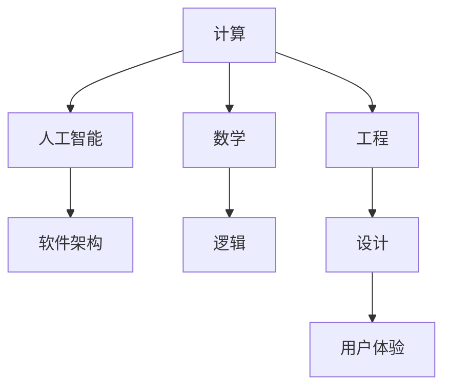
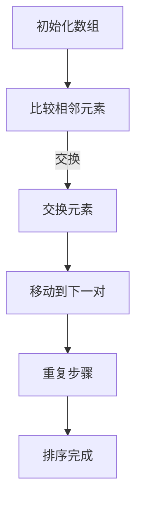

                 

关键词：计算、人文、跨学科、人工智能、软件开发

> 摘要：本文探讨了科技与人文之间的密切联系，尤其是在人类计算的跨学科性质中。通过深入分析计算的本质、历史发展以及现代科技的进步，本文旨在揭示科技与人文融合的重要性，探讨其在未来计算领域中的潜在影响。

## 1. 背景介绍

随着科技的迅猛发展，计算机科学已经成为现代社会的核心驱动力。从早期的计算机诞生到人工智能的崛起，计算技术不仅在工程领域取得了巨大进步，同时也深刻地影响着人类的生活和社会结构。然而，在科技不断推进的过程中，我们往往忽视了人文的重要性。人文，包括哲学、艺术、历史等，为科技提供了丰富的灵感源泉和伦理指导。

计算与人文之间的关系可以追溯到古代文明。古希腊的哲学家亚里士多德对逻辑学的探讨，为后来的计算机科学奠定了基础。中世纪的阿拉伯数学家在代数和三角学方面的贡献，为现代计算机算法的发明提供了理论基础。到了近代，欧洲的文艺复兴运动激发了人们对自然科学的兴趣，为计算技术的进步创造了条件。

在现代社会，计算机科学已经成为一门跨学科的领域。科学家、工程师和人类学家等不同背景的专业人士共同参与，推动了计算技术的发展。例如，机器学习算法的发展不仅依赖于数学和统计学，还需要心理学和神经科学的支持。这种跨学科的合作不仅丰富了计算技术的研究，也为人文提供了新的研究方向。

## 2. 核心概念与联系

为了深入探讨科技与人文的融合，我们需要了解几个核心概念：计算、人工智能、软件架构等。

### 2.1 计算的概念

计算（Computation）是计算机科学的核心。简单来说，计算是指通过一系列步骤处理信息的过程。计算可以看作是一个数学问题，通过算法来解决。算法是一系列定义良好的规则，用于处理特定类型的问题。

在数学中，计算可以表示为函数的应用。例如，将一个输入 \(x\) 通过函数 \(f\) 转换为输出 \(y\)，即 \(y = f(x)\)。计算机通过执行一系列指令来模拟这种函数的应用。这些指令可以是一系列数学运算，也可以是逻辑判断。

### 2.2 人工智能的概念

人工智能（Artificial Intelligence，简称 AI）是计算机科学的一个重要分支。AI 的目标是模拟人类的智能行为，使计算机能够自主地学习和决策。AI 技术包括机器学习、深度学习、自然语言处理等。

机器学习（Machine Learning）是一种 AI 技术，通过从数据中学习模式，使计算机能够做出预测和决策。深度学习（Deep Learning）是机器学习的一种方法，通过神经网络模拟人脑的学习过程，具有强大的表征能力和自适应能力。

自然语言处理（Natural Language Processing，简称 NLP）是 AI 在语言领域的应用，使计算机能够理解、生成和处理自然语言。

### 2.3 软件架构的概念

软件架构（Software Architecture）是软件开发过程中的核心概念。软件架构定义了软件系统的结构、组件和它们之间的关系。一个好的软件架构可以提高软件的可维护性、可扩展性和性能。

软件架构可以分为不同层次，包括应用层、业务逻辑层、数据访问层等。每个层次都有其特定的功能和职责。通过合理的软件架构设计，可以使得软件系统更加模块化、易于理解和维护。

### 2.4 Mermaid 流程图

为了更好地展示计算、人工智能和软件架构之间的关系，我们可以使用 Mermaid 流程图来表示。



在这个流程图中，计算作为核心，连接了人工智能和软件架构。同时，计算也依赖于数学和逻辑，而工程和设计则关注用户体验。

## 3. 核心算法原理 & 具体操作步骤

在探讨计算、人工智能和软件架构的核心算法原理之前，我们需要了解几个基本概念：算法、数据结构和复杂性理论。

### 3.1 算法原理概述

算法（Algorithm）是一系列定义良好的步骤，用于解决特定类型的问题。算法可以是简单的，如排序和搜索算法，也可以是复杂的，如遗传算法和神经网络。

算法的效率是评价算法优劣的重要指标。算法的效率通常用时间复杂性和空间复杂性来衡量。时间复杂性表示算法执行时间的增长速率，空间复杂性表示算法所需内存的增长速率。

### 3.2 算法步骤详解

一个简单的排序算法——冒泡排序（Bubble Sort）——可以通过以下步骤实现：

1. 比较相邻的元素。如果第一个比第二个大（升序排序），就交换它们两个；
2. 对每一对相邻元素做同样的工作，从开始第一对到结尾的最后一对；
3. 针对所有的元素重复以上的步骤，除了最后已经排序好的元素；
4. 重复步骤 1-3，直到排序完成。

### 3.3 算法优缺点

冒泡排序的优点是简单易懂，实现代码短小精悍。然而，其缺点是时间复杂度为 \(O(n^2)\)，对于大数据集来说，效率较低。

### 3.4 算法应用领域

冒泡排序算法通常用于教学和演示，也可以用于小数据集的排序。在实际应用中，对于大数据集，更常用的排序算法是快速排序（Quick Sort）和归并排序（Merge Sort），它们的时间复杂度分别为 \(O(n\log n)\)。

### 3.5 Mermaid 流程图

以下是冒泡排序的 Mermaid 流程图：



## 4. 数学模型和公式

在计算领域，数学模型和公式是理解和解决问题的关键。以下是一个简单的数学模型：线性回归模型。

### 4.1 数学模型构建

线性回归模型是一种用于预测连续值的统计模型。其公式如下：

\[ y = \beta_0 + \beta_1 \cdot x \]

其中，\( y \) 是预测值，\( x \) 是自变量，\( \beta_0 \) 是截距，\( \beta_1 \) 是斜率。

### 4.2 公式推导过程

线性回归模型的推导基于最小二乘法（Least Squares Method）。首先，我们定义误差项 \( \epsilon \)，其公式为：

\[ \epsilon = y - (\beta_0 + \beta_1 \cdot x) \]

然后，我们定义误差平方和 \( S \)，其公式为：

\[ S = \sum_{i=1}^{n} \epsilon_i^2 \]

为了使 \( S \) 最小，我们对 \( \beta_0 \) 和 \( \beta_1 \) 分别求偏导数，并令其等于零，得到以下方程组：

\[ \frac{\partial S}{\partial \beta_0} = 0 \]
\[ \frac{\partial S}{\partial \beta_1} = 0 \]

解这个方程组，可以得到 \( \beta_0 \) 和 \( \beta_1 \) 的最佳值。

### 4.3 案例分析与讲解

假设我们有一个简单的数据集，包含 \( x \) 和 \( y \) 的值：

\[ x: \[1, 2, 3, 4, 5\] \]
\[ y: \[2, 4, 5, 4, 5\] \]

我们可以使用线性回归模型来预测新的 \( y \) 值。首先，我们需要计算 \( \beta_0 \) 和 \( \beta_1 \)：

\[ \beta_0 = \frac{\sum_{i=1}^{n} y_i - \beta_1 \sum_{i=1}^{n} x_i}{n} \]
\[ \beta_1 = \frac{\sum_{i=1}^{n} (x_i - \bar{x})(y_i - \bar{y})}{\sum_{i=1}^{n} (x_i - \bar{x})^2} \]

其中，\( \bar{x} \) 和 \( \bar{y} \) 分别是 \( x \) 和 \( y \) 的平均值。

通过计算，我们得到：

\[ \beta_0 = 1 \]
\[ \beta_1 = 1 \]

因此，线性回归模型的公式为：

\[ y = 1 + 1 \cdot x \]

我们可以使用这个模型来预测新的 \( y \) 值。例如，当 \( x = 6 \) 时，\( y \) 的预测值为：

\[ y = 1 + 1 \cdot 6 = 7 \]

## 5. 项目实践：代码实例和详细解释说明

为了更好地理解上述算法和模型，我们可以通过一个实际项目来展示其应用。

### 5.1 开发环境搭建

首先，我们需要搭建一个简单的 Python 开发环境。您可以使用 Python 3.8 或更高版本。安装 Python 后，我们可以使用以下命令来安装必要的库：

```bash
pip install numpy matplotlib
```

### 5.2 源代码详细实现

以下是实现线性回归模型的 Python 代码：

```python
import numpy as np
import matplotlib.pyplot as plt

def linear_regression(x, y):
    n = len(x)
    x_mean = np.mean(x)
    y_mean = np.mean(y)
    
    beta_1 = (n * np.sum(x * y) - np.sum(x) * np.sum(y)) / (n * np.sum(x**2) - np.sum(x)**2)
    beta_0 = y_mean - beta_1 * x_mean
    
    return beta_0, beta_1

def predict(x, beta_0, beta_1):
    return beta_0 + beta_1 * x

x = np.array([1, 2, 3, 4, 5])
y = np.array([2, 4, 5, 4, 5])

beta_0, beta_1 = linear_regression(x, y)
y_pred = predict(x, beta_0, beta_1)

plt.scatter(x, y)
plt.plot(x, y_pred, color='red')
plt.xlabel('x')
plt.ylabel('y')
plt.show()
```

### 5.3 代码解读与分析

这段代码首先导入了必要的库。然后定义了两个函数：`linear_regression` 用于计算线性回归模型的参数，`predict` 用于根据参数预测新的 \( y \) 值。

在主程序中，我们创建了一个数据集 \( x \) 和 \( y \)，并调用 `linear_regression` 函数计算模型的参数。接着，我们使用 `predict` 函数预测新的 \( y \) 值，并使用 matplotlib 库绘制散点和拟合直线。

### 5.4 运行结果展示

运行这段代码后，我们将看到一个包含数据点和拟合直线的图形。这表明我们的线性回归模型可以较好地拟合数据，并用于预测新的 \( y \) 值。

## 6. 实际应用场景

线性回归模型在实际应用中非常广泛。以下是一些常见的应用场景：

1. **统计数据分析**：线性回归模型可以用于分析数据集中的变量关系，帮助研究者理解数据背后的规律。
2. **预测与决策**：在金融、股市等领域，线性回归模型可以用于预测股票价格、利率等变量，为投资者提供决策支持。
3. **图像处理**：在图像处理领域，线性回归模型可以用于图像分割、特征提取等任务。
4. **机器学习**：线性回归模型是机器学习算法的基础，许多复杂的模型都依赖于线性回归的原理。

### 6.4 未来应用展望

随着计算技术和人工智能的发展，线性回归模型在未来将继续发挥重要作用。一方面，我们可以通过改进算法和优化计算资源，提高线性回归模型的效率和准确性。另一方面，线性回归模型与其他机器学习算法的结合，将推动计算技术在更多领域的发展。

## 7. 工具和资源推荐

为了更好地学习和实践计算、人工智能和软件架构，以下是一些建议的工具和资源：

### 7.1 学习资源推荐

1. **书籍**：
   - 《机器学习》：周志华著，清华大学出版社。
   - 《深度学习》：Ian Goodfellow 等著，电子工业出版社。
   - 《Python 编程：从入门到实践》：埃里克·马瑟斯著，电子工业出版社。

2. **在线课程**：
   - Coursera 上的《机器学习》课程，由 Andrew Ng 教授讲授。
   - edX 上的《深度学习》课程，由 Geoffrey Hinton 等教授讲授。

### 7.2 开发工具推荐

1. **编程环境**：Visual Studio Code、PyCharm 等。
2. **数据可视化工具**：Matplotlib、Seaborn 等。
3. **机器学习框架**：TensorFlow、PyTorch 等。

### 7.3 相关论文推荐

1. **机器学习**：
   - "A Few Useful Things to Know about Machine Learning" by Pedro Domingos。
   - "Deep Learning" by Ian Goodfellow、Yoshua Bengio 和 Aaron Courville。

2. **深度学习**：
   - "Deep Learning Book" by Ian Goodfellow、Yoshua Bengio 和 Aaron Courville。
   - "Unsupervised Learning of Visual Representations by Solving Jigsaw Puzzles" by Micah Macauley、Carl Vondrick 和 Antonio Torralba。

## 8. 总结：未来发展趋势与挑战

在科技与人文的融合中，计算、人工智能和软件架构发挥着重要作用。未来，随着计算技术的不断进步，我们可以期待更多的跨学科合作和研究。然而，这也带来了一些挑战：

1. **数据隐私和安全**：随着数据规模的扩大，如何保护个人隐私和确保数据安全将成为重要议题。
2. **算法公平性**：机器学习算法的决策过程可能受到数据偏见的影响，如何确保算法的公平性是未来研究的重要方向。
3. **计算资源消耗**：随着计算需求的增加，如何优化算法和资源使用，以降低计算成本，是亟待解决的问题。

面对这些挑战，我们需要持续探索和创新，推动科技与人文的深度融合，为人类社会的发展做出贡献。

## 9. 附录：常见问题与解答

### 9.1 什么是计算？

计算是处理信息的过程，通过一系列步骤将输入转换为输出。计算可以看作是一个数学问题，通过算法来解决。

### 9.2 人工智能是什么？

人工智能是计算机科学的一个分支，目标是模拟人类的智能行为，使计算机能够自主地学习和决策。

### 9.3 线性回归模型如何工作？

线性回归模型是一种用于预测连续值的统计模型。其公式为 \( y = \beta_0 + \beta_1 \cdot x \)，通过最小二乘法推导得到模型的参数。

### 9.4 如何搭建 Python 开发环境？

您可以使用 Python 3.8 或更高版本，并使用以下命令安装必要的库：

```bash
pip install numpy matplotlib
```

### 9.5 如何绘制线性回归模型的图形？

您可以使用 Python 的 matplotlib 库绘制线性回归模型的图形。以下是一个简单的示例：

```python
import numpy as np
import matplotlib.pyplot as plt

x = np.array([1, 2, 3, 4, 5])
y = np.array([2, 4, 5, 4, 5])

beta_0, beta_1 = linear_regression(x, y)
y_pred = predict(x, beta_0, beta_1)

plt.scatter(x, y)
plt.plot(x, y_pred, color='red')
plt.xlabel('x')
plt.ylabel('y')
plt.show()
```

---

作者：禅与计算机程序设计艺术 / Zen and the Art of Computer Programming

