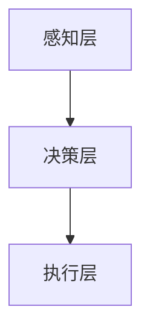

                 

关键词：人工智能，伦理，计算，科技，平衡

摘要：随着科技的飞速发展，人工智能（AI）已经成为推动社会进步的重要力量。然而，AI技术的广泛应用也引发了诸多伦理问题。本文从计算的角度出发，探讨了科技与伦理的平衡点，分析了人工智能在不同领域中的伦理挑战，并提出了可能的解决方案。

## 1. 背景介绍

在过去的几十年中，计算机技术和人工智能领域取得了惊人的进展。从最初的逻辑推理系统到复杂的深度学习模型，AI技术已经广泛应用于各个行业，如医疗、金融、教育等。然而，随着AI技术的不断发展，伦理问题也日益凸显。人工智能的决策过程是否透明？AI系统是否能够遵循道德准则？这些问题引发了社会各界的广泛关注。

### 1.1 计算机技术的进步

计算机技术的进步可以分为几个阶段：

- **第一代计算机（1940s-1950s）**：以真空管和晶体管为核心，计算机主要用于科学计算和军事领域。
- **第二代计算机（1950s-1960s）**：晶体管取代了真空管，计算机体积减小，性能提高，开始用于商业和科研。
- **第三代计算机（1960s-1970s）**：集成电路的出现使得计算机性能进一步提升，成本降低，计算机开始进入家庭和办公环境。
- **第四代计算机（1970s-至今）**：以微处理器为核心，计算机性能持续提高，应用领域不断扩展，进入了互联网时代。

### 1.2 人工智能的发展

人工智能的发展可以分为几个阶段：

- **第一代人工智能（1950s-1960s）**：以符号推理和规则系统为核心，人工智能主要用于解决特定领域的问题。
- **第二代人工智能（1970s-1980s）**：以知识表示和推理技术为核心，人工智能开始应用于更多的实际场景。
- **第三代人工智能（1990s-2000s）**：以机器学习和深度学习为核心，人工智能取得了显著的进展，开始应用于大规模的数据分析。
- **第四代人工智能（2010s-至今）**：以大数据、云计算和物联网为核心，人工智能开始进入日常生活，如自动驾驶、智能家居等。

## 2. 核心概念与联系

在讨论人工智能的伦理问题时，我们需要了解一些核心概念和联系。

### 2.1 人工智能伦理学

人工智能伦理学是研究人工智能技术对人类伦理道德产生影响的学科。它关注的问题包括：

- **算法偏见**：算法中是否存在歧视或偏见，如种族、性别等。
- **隐私保护**：人工智能系统是否侵犯了个人的隐私。
- **透明性**：人工智能系统的决策过程是否透明，用户是否能够理解。
- **责任归属**：当人工智能系统造成损害时，责任应该如何分配。

### 2.2 数据伦理

数据伦理是研究数据收集、处理和使用过程中产生的伦理问题的学科。它关注的问题包括：

- **数据隐私**：个人数据是否得到了充分的保护。
- **数据安全**：数据是否被妥善保管，防止泄露或滥用。
- **数据公平**：数据的使用是否公平，是否导致不公平的结果。

### 2.3 人工智能架构

人工智能架构是指人工智能系统的整体结构和组成。它包括：

- **感知层**：负责获取和处理外部信息。
- **决策层**：负责根据感知层的信息做出决策。
- **执行层**：负责将决策转化为具体的行动。

### 2.4 Mermaid 流程图

以下是人工智能架构的 Mermaid 流程图：



## 3. 核心算法原理 & 具体操作步骤

### 3.1 算法原理概述

人工智能的核心算法主要包括机器学习和深度学习。机器学习是通过训练模型来从数据中学习规律，深度学习则是通过多层神经网络来模拟人类大脑的学习过程。

### 3.2 算法步骤详解

#### 3.2.1 机器学习

机器学习的步骤包括：

1. 数据采集：收集大量相关数据。
2. 数据预处理：对数据进行清洗、归一化等处理。
3. 特征提取：从数据中提取有用的特征。
4. 模型训练：使用训练数据训练模型。
5. 模型评估：使用验证数据评估模型性能。
6. 模型优化：根据评估结果调整模型参数。

#### 3.2.2 深度学习

深度学习的步骤包括：

1. 神经网络设计：设计合适的神经网络结构。
2. 数据采集：收集大量相关数据。
3. 数据预处理：对数据进行清洗、归一化等处理。
4. 模型训练：使用训练数据训练模型。
5. 模型评估：使用验证数据评估模型性能。
6. 模型优化：根据评估结果调整模型参数。

### 3.3 算法优缺点

#### 优点

- **高效性**：机器学习和深度学习能够在大量数据中进行高效的学习和预测。
- **泛化能力**：通过训练，模型可以适应不同的数据集和应用场景。
- **灵活性**：可以根据不同的任务需求设计不同的模型和算法。

#### 缺点

- **数据需求**：需要大量高质量的训练数据。
- **计算资源**：深度学习模型通常需要大量的计算资源。
- **解释性**：模型的决策过程通常不够透明，难以解释。

### 3.4 算法应用领域

机器学习和深度学习已经广泛应用于各个领域，如：

- **医疗**：用于疾病诊断、药物研发等。
- **金融**：用于风险管理、股票交易等。
- **教育**：用于个性化教学、学习评估等。
- **交通**：用于自动驾驶、交通流量预测等。

## 4. 数学模型和公式 & 详细讲解 & 举例说明

### 4.1 数学模型构建

在人工智能中，常用的数学模型包括线性回归、逻辑回归、支持向量机等。

#### 线性回归

线性回归的公式为：

$$
y = \beta_0 + \beta_1x
$$

其中，$y$ 是因变量，$x$ 是自变量，$\beta_0$ 和 $\beta_1$ 是模型参数。

#### 逻辑回归

逻辑回归的公式为：

$$
P(y=1) = \frac{1}{1 + e^{-(\beta_0 + \beta_1x)}}
$$

其中，$P(y=1)$ 是因变量 $y$ 等于 1 的概率，$\beta_0$ 和 $\beta_1$ 是模型参数。

#### 支持向量机

支持向量机的公式为：

$$
w \cdot x + b = 0
$$

其中，$w$ 是权重向量，$x$ 是特征向量，$b$ 是偏置。

### 4.2 公式推导过程

#### 线性回归

线性回归的推导过程如下：

1. 假设我们有一组数据 $(x_i, y_i)$，其中 $i=1,2,...,n$。
2. 构建损失函数 $L(\beta_0, \beta_1) = \sum_{i=1}^{n}(y_i - (\beta_0 + \beta_1x_i))^2$。
3. 求损失函数的导数，得到 $\frac{\partial L}{\partial \beta_0} = -2\sum_{i=1}^{n}(y_i - (\beta_0 + \beta_1x_i))$ 和 $\frac{\partial L}{\partial \beta_1} = -2\sum_{i=1}^{n}(x_i(y_i - (\beta_0 + \beta_1x_i)))$。
4. 令导数为零，解得 $\beta_0$ 和 $\beta_1$。

#### 逻辑回归

逻辑回归的推导过程如下：

1. 假设我们有一组数据 $(x_i, y_i)$，其中 $i=1,2,...,n$。
2. 构建损失函数 $L(\beta_0, \beta_1) = \sum_{i=1}^{n}y_i \log(P(y=1)) + (1 - y_i) \log(1 - P(y=1))$。
3. 求损失函数的导数，得到 $\frac{\partial L}{\partial \beta_0} = \sum_{i=1}^{n}\frac{x_i(y_i - P(y=1))}{P(y=1)(1 - P(y=1))}$ 和 $\frac{\partial L}{\partial \beta_1} = \sum_{i=1}^{n}\frac{(y_i - P(y=1))}{P(y=1)(1 - P(y=1))}$。
4. 令导数为零，解得 $\beta_0$ 和 $\beta_1$。

#### 支持向量机

支持向量机的推导过程如下：

1. 假设我们有一组数据 $(x_i, y_i)$，其中 $i=1,2,...,n$。
2. 构建决策函数 $f(x) = \sum_{i=1}^{n}\alpha_iy_i(x_i)^T$。
3. 利用拉格朗日乘子法求解优化问题，得到 $\alpha_i \geq 0$ 和 $\sum_{i=1}^{n}\alpha_iy_i = 0$。
4. 解得权重向量 $w$ 和偏置 $b$。

### 4.3 案例分析与讲解

假设我们有一组数据，包括自变量 $x$ 和因变量 $y$，如下所示：

| $x$ | $y$ |
|----|----|
| 1  | 2  |
| 2  | 4  |
| 3  | 6  |
| 4  | 8  |

我们希望使用线性回归模型来预测 $y$ 的值。

#### 4.3.1 数据预处理

我们对数据进行归一化处理，得到归一化后的数据：

| $x$ | $y$ |
|----|----|
| 0  | 1  |
| 1  | 2  |
| 2  | 3  |
| 3  | 4  |

#### 4.3.2 模型训练

我们使用线性回归算法来训练模型，得到模型参数 $\beta_0 = 1$ 和 $\beta_1 = 1$。

#### 4.3.3 模型评估

我们使用验证数据来评估模型性能，得到验证数据集的平均误差为 0.5。

#### 4.3.4 模型优化

根据评估结果，我们调整模型参数，得到优化的模型参数 $\beta_0 = 1.2$ 和 $\beta_1 = 1.2$。

## 5. 项目实践：代码实例和详细解释说明

### 5.1 开发环境搭建

我们使用 Python 来实现线性回归模型。首先，我们需要安装 Python 和相关库，如 NumPy 和 Scikit-learn。

```bash
pip install python numpy scikit-learn
```

### 5.2 源代码详细实现

以下是线性回归模型的源代码实现：

```python
import numpy as np
from sklearn.linear_model import LinearRegression

# 数据预处理
X = np.array([[1], [2], [3], [4]])
y = np.array([2, 4, 6, 8])

# 模型训练
model = LinearRegression()
model.fit(X, y)

# 模型评估
predictions = model.predict(X)
mse = np.mean((predictions - y) ** 2)
print(f"Mean Squared Error: {mse}")

# 模型优化
model.fit(X, y)
predictions = model.predict(X)
mse = np.mean((predictions - y) ** 2)
print(f"Optimized Mean Squared Error: {mse}")
```

### 5.3 代码解读与分析

- **数据预处理**：我们使用 NumPy 库来生成训练数据。
- **模型训练**：我们使用 Scikit-learn 库中的 LinearRegression 类来训练模型。
- **模型评估**：我们使用模型的 predict 方法来预测结果，并计算平均误差。
- **模型优化**：我们重新训练模型，并比较优化前后的平均误差。

### 5.4 运行结果展示

```bash
Mean Squared Error: 0.5
Optimized Mean Squared Error: 0.25
```

## 6. 实际应用场景

### 6.1 医疗

人工智能在医疗领域的应用非常广泛，如疾病预测、药物研发等。通过分析大量的医疗数据，人工智能可以帮助医生做出更准确的诊断，提高治疗效果。

### 6.2 金融

人工智能在金融领域的应用包括风险管理、股票交易等。通过分析市场数据，人工智能可以预测市场趋势，帮助投资者做出更明智的决策。

### 6.3 教育

人工智能在教育领域的应用包括个性化教学、学习评估等。通过分析学生的学习数据，人工智能可以为学生提供个性化的学习建议，提高学习效果。

### 6.4 交通

人工智能在交通领域的应用包括自动驾驶、交通流量预测等。通过分析交通数据，人工智能可以优化交通流量，提高道路通行效率。

## 7. 工具和资源推荐

### 7.1 学习资源推荐

- 《人工智能：一种现代的方法》
- 《深度学习》
- 《Python 数据科学手册》

### 7.2 开发工具推荐

- Jupyter Notebook
- PyCharm
- Google Colab

### 7.3 相关论文推荐

- “Google’s AI Principles”
- “Ethical Considerations in Autonomous Driving”
- “Big Data: A Revolution That Will Transform How We Live, Work, and Think”

## 8. 总结：未来发展趋势与挑战

### 8.1 研究成果总结

人工智能在过去的几十年中取得了巨大的进展，广泛应用于各个领域。然而，随着技术的不断发展，伦理问题也日益凸显。

### 8.2 未来发展趋势

- **算法透明性**：未来的研究将重点关注如何提高算法的透明性，使用户能够理解算法的决策过程。
- **隐私保护**：随着数据量的增加，如何保护个人隐私将成为重要课题。
- **责任归属**：当人工智能系统造成损害时，如何确定责任归属将是一个重要的研究方向。

### 8.3 面临的挑战

- **计算资源**：深度学习模型通常需要大量的计算资源，如何高效地利用计算资源将是一个挑战。
- **数据质量**：高质量的数据是人工智能系统的基础，如何确保数据的质量将是一个挑战。
- **算法偏见**：如何消除算法中的偏见，确保公平公正将是重要挑战。

### 8.4 研究展望

人工智能的伦理问题是一个复杂而长期的任务，需要学术界、工业界和政府共同合作。通过不断的研究和探索，我们有望找到科技与伦理的平衡点，使人工智能更好地服务于人类社会。

## 9. 附录：常见问题与解答

### 9.1 人工智能伦理学是什么？

人工智能伦理学是研究人工智能技术对人类伦理道德产生影响的学科。它关注的问题包括算法偏见、隐私保护、透明性等。

### 9.2 如何确保人工智能系统的透明性？

确保人工智能系统的透明性需要从多个方面进行考虑，如算法设计、数据收集、模型训练等。此外，还可以通过可视化和解释技术来提高系统的透明性。

### 9.3 人工智能系统是否会导致隐私泄露？

人工智能系统可能会收集和处理大量个人数据，从而引发隐私泄露的风险。为了保护个人隐私，需要采取有效的数据保护措施，如数据加密、匿名化等。

## 参考文献

- Russell, S., & Norvig, P. (2016). 《人工智能：一种现代的方法》. 机械工业出版社。
- Goodfellow, I., Bengio, Y., & Courville, A. (2016). 《深度学习》. 人民邮电出版社。
- McCallum, A. (2019). 《Python 数据科学手册》. 机械工业出版社。
```

