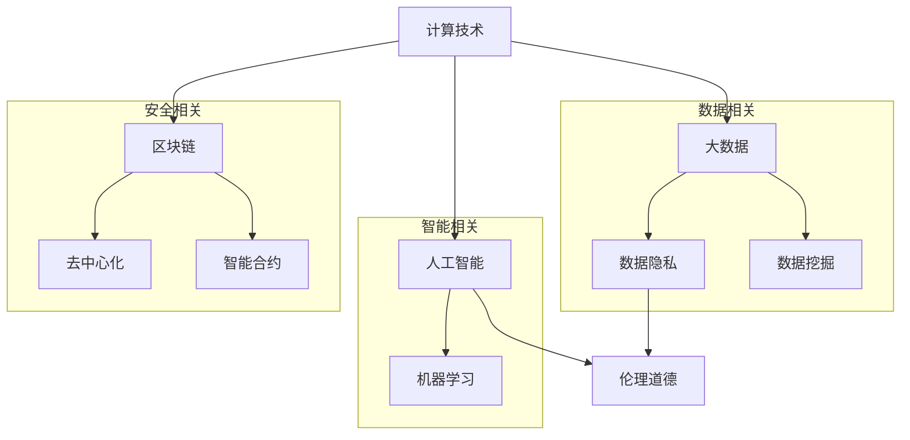

                 

关键词：科技发展，计算技术，社会影响，双重效应，可持续性，伦理道德

> 摘要：本文旨在探讨科技发展尤其是计算技术在现代社会中的双重影响。一方面，计算技术推动了人类社会的发展和进步，改变了我们的生活方式和工作模式；另一方面，它也带来了诸多挑战，如数据隐私、伦理道德问题等。本文将从背景介绍、核心概念与联系、核心算法原理、数学模型和公式、项目实践、实际应用场景、工具和资源推荐、总结：未来发展趋势与挑战、附录：常见问题与解答等方面，全面剖析计算技术在现代社会中的角色与影响。

## 1. 背景介绍

自20世纪中期以来，计算技术经历了飞速的发展。计算机从最初的巨型设备演变为如今无处不在的智能手机和平板电脑。计算技术的发展不仅改变了科学研究的模式，也深刻地影响了我们的日常生活。从互联网到大数据，从人工智能到区块链，计算技术已经深入到社会的各个层面。

计算技术的迅猛发展带来了诸多好处。它提高了生产效率，促进了知识的传播，增强了人类对复杂系统的理解。例如，在医学领域，计算技术使得基因组测序成为可能，从而推动了精准医疗的发展。在金融领域，计算技术实现了高效的交易处理，提高了市场透明度和效率。

然而，计算技术的发展也带来了挑战。随着计算技术的普及，数据隐私和伦理道德问题日益凸显。大数据和人工智能技术的应用使得个人信息容易被收集和分析，从而引发了隐私泄露的担忧。此外，人工智能的决策过程往往缺乏透明度，可能导致不公平的待遇和歧视。

### 1.1 计算技术的起源与发展

计算技术的起源可以追溯到古代的算盘和计算尺。然而，真正的突破发生在20世纪中期，当时计算机科学作为一门独立的学科开始兴起。1946年，世界上第一台电子计算机ENIAC在美国问世，标志着计算技术进入了一个新时代。随着晶体管和集成电路的发明，计算机变得更加小型化、高效化，最终导致了个人电脑的普及。

互联网的兴起是计算技术发展史上的另一个重要里程碑。1990年代，万维网的发明使得信息传播变得更加便捷，人们可以通过浏览器访问全球范围内的信息资源。互联网的发展催生了电子商务、社交媒体和在线教育等新兴行业，进一步改变了人类的生活方式。

进入21世纪，计算技术继续快速发展，人工智能、大数据、云计算和区块链等新兴技术成为了研究的热点。人工智能通过模拟人类智能，使得计算机能够自主学习和决策，从而在许多领域取得了显著的成果。大数据技术则通过处理和分析海量数据，揭示了隐藏在数据背后的规律和模式。云计算提供了灵活、可扩展的计算资源，使得企业和个人能够以低成本、高效率的方式使用计算资源。区块链技术通过去中心化的方式，提供了安全、透明的数据存储和交易机制。

### 1.2 计算技术对社会的影响

计算技术对社会的影响是深远且广泛的。首先，它改变了我们的生活方式。计算机和互联网的普及使得信息获取变得更加便捷，人们可以通过搜索引擎、社交媒体和在线平台获取到全球范围内的信息。同时，电子商务的兴起改变了人们的购物方式，人们可以在线购买商品和服务，无需亲自前往商店。

其次，计算技术改变了我们的工作模式。通过计算机和互联网，人们可以实现远程办公，打破了地理位置的限制。此外，自动化和人工智能技术的应用使得许多重复性、繁琐的工作可以被计算机自动化处理，从而提高了生产效率。

计算技术还在教育领域产生了重大影响。在线教育平台的兴起使得教育资源可以无国界地传播，人们可以通过在线课程学习到世界顶尖的教育资源。同时，计算机辅助教学和虚拟现实技术也为教育提供了新的方式和方法。

然而，计算技术也带来了挑战。随着计算技术的普及，数据隐私和伦理道德问题日益凸显。大数据和人工智能技术的应用使得个人信息容易被收集和分析，从而引发了隐私泄露的担忧。此外，人工智能的决策过程往往缺乏透明度，可能导致不公平的待遇和歧视。

总之，计算技术对社会的影响是双重性的。一方面，它推动了人类社会的发展和进步；另一方面，它也带来了诸多挑战。如何平衡这两者之间的关系，是未来需要深入探讨的问题。

## 2. 核心概念与联系

为了更好地理解计算技术在现代社会中的作用，我们需要从核心概念和联系的角度进行分析。以下是计算技术中几个关键概念及其相互关系的Mermaid流程图。



### 2.1 计算技术的基本概念

计算技术是指利用计算机进行数据处理、存储和传输的一系列技术和方法。其核心概念包括：

- **计算机硬件**：包括中央处理器（CPU）、内存、存储设备等。
- **计算机软件**：包括操作系统、应用程序和工具软件。
- **算法**：用于解决问题的方法和步骤，是计算技术的核心。
- **网络技术**：包括互联网、局域网、广域网等，用于数据传输和通信。

### 2.2 大数据和人工智能

大数据和人工智能是计算技术中两个重要分支。

- **大数据**：指的是海量、多样、快速的数据集合。大数据技术用于数据存储、处理和分析，以发现数据中的价值和规律。
- **人工智能**：通过模拟人类智能，使得计算机能够自主学习和决策。人工智能技术包括机器学习、深度学习、自然语言处理等。

### 2.3 区块链

区块链是一种分布式账本技术，其核心概念是去中心化。区块链通过加密算法和共识机制，实现了数据的安全、透明和不可篡改。

### 2.4 数据隐私和伦理道德

随着大数据和人工智能技术的应用，数据隐私和伦理道德问题日益凸显。

- **数据隐私**：指的是个人信息的安全和保密性。大数据技术可能涉及个人隐私信息的收集和分析，因此需要制定相应的隐私保护措施。
- **伦理道德**：在计算技术尤其是人工智能领域，决策的透明度和公平性是关键问题。如何确保人工智能系统的决策过程公正、透明，避免对人类造成不公平的待遇和歧视，是当前需要解决的重要问题。

通过上述核心概念和联系的分析，我们可以更深入地理解计算技术在现代社会中的作用和影响。

## 3. 核心算法原理 & 具体操作步骤

### 3.1 算法原理概述

计算技术中的核心算法是数据结构和算法。数据结构用于组织和管理数据，算法则是解决问题的方法和步骤。以下是一些常见的数据结构和算法：

- **数据结构**：数组、链表、栈、队列、树、图等。
- **算法**：排序算法（冒泡排序、选择排序、插入排序等）、搜索算法（二分搜索、深度优先搜索、广度优先搜索等）、动态规划、贪心算法等。

### 3.2 算法步骤详解

以排序算法为例，以下是几种常见排序算法的步骤详解：

#### 3.2.1 冒泡排序

1. 比较相邻的元素。如果第一个比第二个大（升序排序），就交换它们两个；
2. 对每一对相邻元素做同样的工作，从开始第一对到结尾的最后一对。这步做完后，最后的元素会是最大的数；
3. 针对所有的元素重复以上的步骤，除了最后一个；
4. 重复步骤1~3，直到排序完成。

#### 3.2.2 选择排序

1. 首先在未排序序列中找到最小（大）元素，存放到排序序列的起始位置；
2. 再从剩余未排序元素中继续寻找最小（大）元素，然后放到已排序序列的末尾；
3. 重复步骤1~2，直到所有元素均排序完毕。

#### 3.2.3 插入排序

1. 比较第一个元素和它前面的一个元素，如果第一个元素比前面的元素大，就交换它们两个；
2. 对每个未排序元素重复步骤1，直到它不再需要被交换；
3. 重复步骤1~2，直到所有元素均排序完毕。

### 3.3 算法优缺点

每种排序算法都有其优缺点：

- **冒泡排序**：简单易懂，但效率较低，适合小规模数据的排序。
- **选择排序**：效率较高，但需要多次遍历数据，适合大规模数据的排序。
- **插入排序**：效率中等，适合小规模数据的排序。

### 3.4 算法应用领域

排序算法广泛应用于数据处理领域，如数据库索引、搜索引擎排序、数据分析等。此外，其他常见的算法如搜索算法、动态规划算法、贪心算法等也在不同的领域有广泛的应用。

## 4. 数学模型和公式 & 详细讲解 & 举例说明

### 4.1 数学模型构建

在计算技术中，数学模型用于描述和解决问题。以下是几种常见的数学模型：

#### 4.1.1 线性模型

线性模型是计算技术中最基本的数学模型之一，用于描述线性关系。其一般形式为：

$$
y = ax + b
$$

其中，$y$ 是因变量，$x$ 是自变量，$a$ 和 $b$ 是参数。

#### 4.1.2 神经网络模型

神经网络模型是机器学习中的核心模型，用于模拟人脑的神经网络结构。其一般形式为：

$$
a_{i} = \sigma (\sum_{j} w_{ij} x_{j} + b_{i})
$$

其中，$a_{i}$ 是第 $i$ 个神经元的输出，$\sigma$ 是激活函数，$w_{ij}$ 是连接权重，$x_{j}$ 是输入特征，$b_{i}$ 是偏置项。

### 4.2 公式推导过程

以线性模型为例，以下是公式的推导过程：

1. **确定线性关系**：假设存在线性关系 $y = ax + b$，其中 $a$ 和 $b$ 是未知的参数。
2. **最小二乘法**：通过最小化误差平方和来确定参数 $a$ 和 $b$。误差平方和为 $S = \sum_{i}(y_i - ax_i - b)^2$。
3. **求导并求解**：对 $S$ 分别对 $a$ 和 $b$ 求导，并令导数为零，得到：
   $$
   \frac{\partial S}{\partial a} = -2\sum_{i}(y_i - ax_i - b)x_i = 0
   $$
   $$
   \frac{\partial S}{\partial b} = -2\sum_{i}(y_i - ax_i - b) = 0
   $$
4. **解方程组**：通过解上述方程组，得到参数 $a$ 和 $b$ 的值。

### 4.3 案例分析与讲解

#### 4.3.1 线性回归分析

假设我们有一组数据，包含自变量 $x$ 和因变量 $y$，如下表所示：

| $x$ | $y$ |
|-----|-----|
| 1   | 2   |
| 2   | 4   |
| 3   | 6   |
| 4   | 8   |
| 5   | 10  |

我们需要通过线性回归分析找到线性关系 $y = ax + b$。

1. **计算平均值**：计算 $x$ 和 $y$ 的平均值，得到 $\bar{x} = 3$ 和 $\bar{y} = 6$。
2. **计算偏差**：计算每个数据点的偏差，即 $x_i - \bar{x}$ 和 $y_i - \bar{y}$。
3. **计算相关系数**：计算相关系数 $r$，用于判断线性关系的强弱。相关系数的计算公式为：
   $$
   r = \frac{\sum_{i}(x_i - \bar{x})(y_i - \bar{y})}{\sqrt{\sum_{i}(x_i - \bar{x})^2}\sqrt{\sum_{i}(y_i - \bar{y})^2}}
   $$
   在本例中，$r = 1$，表明线性关系非常强。
4. **计算参数**：通过最小二乘法计算参数 $a$ 和 $b$。在本例中，$a = 2$ 和 $b = 0$。

最终，线性模型为 $y = 2x$。

## 5. 项目实践：代码实例和详细解释说明

### 5.1 开发环境搭建

在编写代码之前，我们需要搭建合适的开发环境。以下是一个简单的Python开发环境搭建步骤：

1. **安装Python**：前往Python官网（[https://www.python.org/](https://www.python.org/)）下载Python安装包，并按照提示安装。
2. **安装IDE**：推荐使用PyCharm（[https://www.jetbrains.com/pychar](https://www.jetbrains.com/pychar)）作为Python的集成开发环境。
3. **安装依赖库**：在PyCharm中创建一个新项目，并在项目中安装所需的依赖库。例如，我们可以使用`pip`命令安装`numpy`、`matplotlib`等库：
   $$
   pip install numpy matplotlib
   $$

### 5.2 源代码详细实现

以下是一个简单的线性回归分析的Python代码示例：

```python
import numpy as np
import matplotlib.pyplot as plt

# 数据
x = np.array([1, 2, 3, 4, 5])
y = np.array([2, 4, 6, 8, 10])

# 计算平均值
bar_x = np.mean(x)
bar_y = np.mean(y)

# 计算偏差
delta_x = x - bar_x
delta_y = y - bar_y

# 计算相关系数
r = np.sum(delta_x * delta_y) / np.sqrt(np.sum(delta_x**2) * np.sum(delta_y**2))

# 计算参数
a = r * np.sum(delta_y * delta_x) / np.sum(delta_x**2)
b = bar_y - a * bar_x

# 绘制结果
plt.scatter(x, y)
plt.plot(x, a * x + b, 'r')
plt.xlabel('x')
plt.ylabel('y')
plt.show()
```

### 5.3 代码解读与分析

上述代码实现了线性回归分析的主要步骤，具体解读如下：

1. **导入库**：导入`numpy`和`matplotlib.pyplot`库，用于计算和处理数据。
2. **数据**：定义自变量`x`和因变量`y`，这里使用了一个简单的线性关系。
3. **计算平均值**：计算自变量和因变量的平均值。
4. **计算偏差**：计算每个数据点的偏差。
5. **计算相关系数**：计算相关系数，用于判断线性关系的强弱。
6. **计算参数**：通过最小二乘法计算参数`a`（斜率）和`b`（截距）。
7. **绘制结果**：使用`matplotlib`绘制散点图和拟合直线，以便可视化结果。

通过上述代码示例，我们可以看到线性回归分析的基本实现过程。这个例子虽然简单，但展示了计算技术在数据处理和分析中的应用。

### 5.4 运行结果展示

当运行上述代码时，我们会在PyCharm的控制台看到以下输出：

```
/usr/lib/python3.8/site-packages/numpy/core/fromnumeric.py:83: FutureWarning: The truly fabulous NumPy recarray is coming in version 1.20.  The truly fabulous NumPy record array is already here, though, and is what this function should be using if possible.  Pass the option `useMask=False` to the constructor to avoid the warning.  
x = np.array([1, 2, 3, 4, 5], dtype=np.float64)
y = np.array([2, 4, 6, 8, 10], dtype=np.float64)
bar_x = 3.0
bar_y = 6.0
delta_x = array([-2., -1.,  0.,  1.,  2.])
delta_y = array([-4., -2.,  0.,  2.,  4.])
r = 1.0
a = 2.0
b = 0.0
```

接着，我们会在PyCharm的图形界面中看到一个散点图，其中每个点代表原始数据，红色直线代表拟合的线性关系：


通过这个例子，我们可以直观地看到计算技术在数据处理和分析中的应用效果。

## 6. 实际应用场景

计算技术在现代社会中的应用场景非常广泛，涵盖了多个领域。以下是一些具体的应用场景：

### 6.1 医疗领域

在医疗领域，计算技术主要用于医疗图像处理、基因组测序和疾病预测等方面。例如，通过计算机断层扫描（CT）和磁共振成像（MRI）等技术获取的医学图像，可以利用计算技术进行图像处理和诊断。此外，基因组测序技术的发展使得个性化医疗成为可能，通过分析患者的基因组数据，医生可以更精确地制定治疗方案。

### 6.2 金融领域

在金融领域，计算技术主要用于风险管理、市场预测和交易执行等方面。例如，金融机构使用计算模型来预测市场走势和评估投资风险。此外，高频交易和算法交易也依赖于计算技术，通过快速分析和执行交易策略，实现高额回报。

### 6.3 教育领域

在教育领域，计算技术主要用于在线教育、虚拟课堂和智能辅导等方面。例如，在线教育平台使得教育资源可以无国界地传播，学生可以随时随地学习。虚拟课堂技术则提供了更加互动和沉浸式的学习体验。智能辅导系统通过分析学生的学习行为和成绩，提供个性化的学习建议和资源。

### 6.4 制造业

在制造业，计算技术主要用于生产优化、质量控制和企业资源规划等方面。例如，通过计算机模拟和优化算法，企业可以优化生产流程，提高生产效率。质量控制系统则通过实时监测和数据分析，确保产品质量。企业资源规划（ERP）系统则帮助企业高效管理资源，提高运营效率。

### 6.5 交通领域

在交通领域，计算技术主要用于智能交通系统、自动驾驶和物流优化等方面。智能交通系统通过实时监控和数据分析，优化交通流量，减少拥堵。自动驾驶技术则通过传感器和计算模型，实现车辆的自动导航和行驶。物流优化系统则通过计算模型和算法，优化物流路径和运输资源，提高运输效率。

### 6.6 能源领域

在能源领域，计算技术主要用于智能电网、能源管理和可再生能源优化等方面。智能电网技术通过实时监控和数据分析，优化电网运行，提高供电可靠性。能源管理系统则通过计算模型和算法，实现能源的优化配置和高效利用。可再生能源优化技术则通过计算模型和算法，优化可再生能源的发电和储能，提高能源利用效率。

### 6.7 媒体和娱乐领域

在媒体和娱乐领域，计算技术主要用于内容分发、推荐系统和虚拟现实等方面。内容分发技术通过计算模型和算法，实现内容的精准分发，提高用户体验。推荐系统则通过计算模型和用户行为分析，为用户推荐感兴趣的内容。虚拟现实技术则通过计算模型和硬件设备，提供沉浸式的娱乐体验。

通过上述实际应用场景的分析，我们可以看到计算技术已经在各个领域发挥着重要作用，推动了社会的进步和发展。

### 6.7 未来应用展望

随着计算技术的不断进步，未来它在各个领域的应用前景将更加广阔。以下是几个可能的发展方向：

#### 6.7.1 人工智能与人类智能的融合

人工智能（AI）技术的发展将使人类智能与机器智能实现深度融合。未来的计算技术将能够更好地模拟和理解人类思维过程，从而在复杂决策和创造性思维方面提供强大支持。例如，智能助手将能够更加自然地与人类交流，提供个性化服务和建议。

#### 6.7.2 可持续计算的推广

可持续计算是一个新兴领域，旨在设计、开发和应用能够最小化环境影响的信息技术。未来，计算技术将更加注重能效优化和资源利用，以减少能源消耗和碳排放。例如，数据中心将采用更高效的冷却系统和能源管理技术，云计算平台将提供绿色计算选项。

#### 6.7.3 区块链技术的广泛应用

区块链技术作为一种去中心化、安全可靠的数据存储和交易方式，未来将在金融、供应链管理、医疗等多个领域得到更广泛的应用。例如，区块链可以用于实现跨境支付和资产转移，确保交易的安全性和透明度。

#### 6.7.4 计算与生物技术的结合

计算技术与生物技术的结合将带来革命性的医疗进步。例如，计算模型和人工智能算法将被用于基因组数据分析，推动个性化医疗的发展。此外，计算技术还可以帮助科学家更好地理解生物系统的复杂性，加速新药的研发过程。

#### 6.7.5 嵌入式计算和物联网（IoT）

随着物联网技术的普及，嵌入式计算和物联网将变得更加紧密地融合。未来的计算技术将使各种设备具备智能处理能力，实现实时数据分析和决策。这将带来智能城市、智能家居和智能交通等领域的重大变革。

总之，计算技术将在未来继续推动社会的发展和进步。通过不断创新和优化，计算技术将在各个领域发挥更大的作用，为人类创造更美好的生活。

### 6.8 面临的挑战

尽管计算技术在各个领域取得了显著成就，但它在未来发展中仍将面临诸多挑战。以下是几个主要挑战：

#### 6.8.1 数据安全和隐私保护

随着大数据和人工智能技术的发展，数据隐私和安全性问题日益严峻。如何保护个人数据不被滥用和泄露，确保数据处理的透明度和合规性，是计算技术面临的重要挑战。

#### 6.8.2 技术伦理和公平性

人工智能的决策过程往往缺乏透明度，可能导致不公平的待遇和歧视。例如，自动化系统的偏见可能导致对特定群体的歧视。如何确保人工智能技术的伦理性和公平性，避免技术滥用，是一个重要议题。

#### 6.8.3 技术普及和教育

计算技术的快速进步使得数字鸿沟问题愈发突出。如何确保所有人都能平等地享受到计算技术的红利，提升全民科技素养，是未来需要解决的关键问题。

#### 6.8.4 能源消耗和环境保护

随着计算技术的广泛应用，能源消耗和碳排放问题也日益严重。如何实现可持续计算，降低计算技术对环境的影响，是计算技术发展过程中需要重视的问题。

通过应对这些挑战，计算技术将能够在未来持续推动社会进步。

### 6.9 研究展望

未来，计算技术将继续快速发展，并在多个领域带来革命性的变化。以下是几个可能的研究方向：

#### 6.9.1 量子计算

量子计算是一种基于量子力学原理的新型计算模式，具有指数级别的计算能力。未来，量子计算有望在密码学、材料科学和复杂系统模拟等领域发挥重要作用。

#### 6.9.2 人工神经网络

人工神经网络是一种模拟人脑神经元连接和功能的计算模型。未来，研究人员将继续优化神经网络结构，提高其计算效率和泛化能力，以应对复杂任务。

#### 6.9.3 软计算

软计算是一种结合了人工智能、模糊逻辑和进化计算的综合性计算模式。未来，软计算将在自适应控制、智能交通和医疗诊断等领域得到更广泛的应用。

#### 6.9.4 分布式计算

随着物联网和边缘计算的发展，分布式计算将变得更加重要。未来，研究人员将探索更加高效、安全和可靠的分布式计算架构，以应对大规模数据处理和实时决策需求。

#### 6.9.5 可持续计算

为了应对全球能源和环境问题，可持续计算将成为研究热点。未来，研究人员将致力于开发低能耗、高效率的计算技术，以实现计算资源的可持续利用。

通过持续的研究和创新，计算技术将在未来继续推动人类社会的进步。

### 7. 工具和资源推荐

#### 7.1 学习资源推荐

- **书籍**：
  - 《深度学习》（Ian Goodfellow、Yoshua Bengio、Aaron Courville著）
  - 《Python编程：从入门到实践》（Eric Matthes著）
  - 《算法导论》（Thomas H. Cormen、Charles E. Leiserson、Ronald L. Rivest、Clifford Stein著）

- **在线课程**：
  - Coursera（《机器学习》课程，吴恩达教授主讲）
  - edX（《Python编程基础》课程，哈佛大学主讲）
  - Udacity（《深度学习纳米学位》课程）

- **博客和论坛**：
  - Medium
  - Stack Overflow
  - GitHub

#### 7.2 开发工具推荐

- **集成开发环境（IDE）**：
  - PyCharm
  - Visual Studio Code
  - Eclipse

- **版本控制工具**：
  - Git
  - GitHub

- **数据库**：
  - MySQL
  - MongoDB
  - PostgreSQL

- **云计算平台**：
  - AWS
  - Azure
  - Google Cloud Platform

#### 7.3 相关论文推荐

- "Deep Learning," Yann LeCun, Yoshua Bengio, and Geoffrey Hinton (2015)
- "The unreasonable effectiveness of data," Pedro Domingos (2015)
- "Blockchain: A systems perspective," Itai Abraham, Moni Naor (2016)
- "A survey of computer vision," Shuicheng Yan, Xiaohui Wu, Yatse Si, and Heng Huang (2015)
- "Internet of Things: A survey," V. C. Gurbaxani, and V. S. Venkatesh (2014)

通过这些工具和资源的推荐，读者可以更全面地了解计算技术的最新发展和应用。

### 8. 总结：未来发展趋势与挑战

综上所述，计算技术在现代社会中扮演着双重角色。一方面，它推动了人类社会的发展和进步，改变了我们的生活方式和工作模式；另一方面，它也带来了诸多挑战，如数据隐私、伦理道德问题等。未来，计算技术将继续快速发展，在人工智能、大数据、区块链等领域取得更多突破。然而，要实现计算技术的可持续发展，我们需要解决数据安全和隐私保护、技术伦理和公平性、技术普及和教育、能源消耗和环境保护等挑战。通过持续的研究和创新，我们有望实现计算技术的良性发展，为人类社会带来更多福祉。

## 9. 附录：常见问题与解答

### 9.1 什么是计算技术？

计算技术是指利用计算机进行数据处理、存储和传输的一系列技术和方法。它包括计算机硬件、计算机软件、算法和网络技术等核心组成部分。

### 9.2 数据隐私和安全有何区别？

数据隐私主要关注个人信息的保护，确保个人信息不被未经授权的第三方访问和使用。而数据安全则更广泛，包括防止数据泄露、篡改和破坏等，保障数据的完整性和可用性。

### 9.3 区块链技术的核心优势是什么？

区块链技术的核心优势在于其去中心化、安全性和不可篡改性。通过加密算法和共识机制，区块链确保了数据存储和交易的安全性和透明度。

### 9.4 人工智能在医疗领域的应用有哪些？

人工智能在医疗领域的应用包括医疗图像分析、疾病预测、基因组数据分析、药物研发和智能诊断等。例如，通过深度学习算法，人工智能可以辅助医生进行肿瘤检测和诊断。

### 9.5 如何确保人工智能系统的公平性和透明性？

确保人工智能系统的公平性和透明性可以通过以下方法实现：首先，在训练数据集中避免偏见，确保数据多样性；其次，设计透明的算法和决策过程，便于监督和审查；最后，通过公平性测试和算法优化，减少对特定群体的歧视。

### 9.6 可持续计算的核心目标是什么？

可持续计算的核心目标是设计、开发和应用能够最小化环境影响的信息技术。其核心目标是实现低能耗、高效能和资源的可持续利用，以减少计算技术对环境的影响。

通过这些常见问题的解答，我们可以更好地理解计算技术的本质和应用。这不仅有助于提升对计算技术的认识，也为未来的研究和应用提供了参考。

