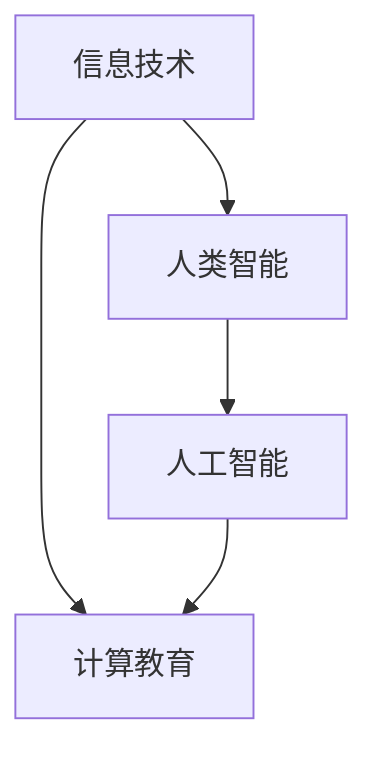

                 

关键词：计算技术、社会进步、信息技术、人类智能、计算教育

> 摘要：随着计算技术的飞速发展，人类社会已经进入了信息化时代。计算技术的进步不仅改变了我们的生活方式，还在推动着社会各个领域的变革。本文将从科技与社会的关系出发，探讨计算技术在现代社会中的深远影响，以及未来计算技术可能带来的发展趋势和挑战。

## 1. 背景介绍

计算技术的历史可以追溯到几个世纪之前，但真正意义上的计算革命始于20世纪中叶。随着计算机科学的诞生，计算技术开始以惊人的速度发展。从最早的电子计算机到个人电脑，再到互联网和移动设备的普及，计算技术的进步改变了我们的工作和生活方式。

### 1.1 计算技术的发展历程

- **第一代计算机**：以ENIAC（电子数值积分计算机）为代表，主要用于军事和科学研究。
- **第二代计算机**：引入了晶体管和中小型计算机，推动了商业和工业的应用。
- **第三代计算机**：集成电路的发明使得计算机变得更小、更快、更便宜。
- **第四代计算机**：个人电脑和互联网的普及，使计算技术进入了千家万户。
- **第五代计算机**：以人工智能和量子计算为代表，正在开启计算技术的新时代。

### 1.2 计算技术对社会的影响

计算技术的进步不仅改变了我们的生活方式，还在各个领域产生了深远的影响：

- **经济领域**：计算技术提高了生产效率，降低了成本，推动了产业升级和经济增长。
- **教育领域**：在线教育平台的兴起，使得教育资源更加丰富，教育机会更加公平。
- **医疗领域**：电子病历和远程医疗，提高了医疗服务的效率和覆盖范围。
- **社交领域**：社交媒体和在线交流工具，改变了人们的社交方式和沟通方式。

## 2. 核心概念与联系

为了深入探讨计算技术对社会的影响，我们需要了解以下几个核心概念及其相互关系：

### 2.1 信息技术

信息技术（Information Technology，简称IT）是利用计算机硬件和软件技术来处理和管理信息的一门学科。它涵盖了计算机科学、数据科学、网络技术等多个领域。

### 2.2 人类智能

人类智能（Human Intelligence）是指人类在认知、思维、学习和适应环境等方面的能力。随着计算技术的发展，人工智能（Artificial Intelligence，简称AI）开始模拟和扩展人类智能，使得机器能够执行复杂的任务。

### 2.3 计算教育

计算教育（Computational Education）是指通过计算技术来提升教育质量和教育效率的一种教育模式。计算教育不仅包括计算机编程和算法教育，还包括数据科学、人工智能等方面的知识。

### 2.4 Mermaid 流程图

为了更好地理解这些核心概念之间的联系，我们可以使用Mermaid流程图来展示它们之间的关系：



## 3. 核心算法原理 & 具体操作步骤

### 3.1 算法原理概述

计算技术在各个领域都有广泛的应用，以下是几个核心算法的原理概述：

#### 3.1.1 深度学习算法

深度学习（Deep Learning）是一种基于人工神经网络的学习方法，它通过多层神经元的组合来模拟人类的认知过程，从而实现图像识别、自然语言处理等复杂任务。

#### 3.1.2 数据挖掘算法

数据挖掘（Data Mining）是一种从大量数据中提取有用信息和知识的方法，它包括关联规则学习、聚类分析、分类分析等多个子领域。

#### 3.1.3 算法优化算法

算法优化（Algorithm Optimization）是通过改进算法设计或实现，以提高算法的效率和性能。

### 3.2 算法步骤详解

下面我们将详细解释上述核心算法的具体操作步骤：

#### 3.2.1 深度学习算法

1. **数据处理**：首先对输入数据进行预处理，包括归一化、缺失值填充等。
2. **网络构建**：设计神经网络的结构，包括输入层、隐藏层和输出层。
3. **模型训练**：通过反向传播算法，不断调整网络权重，以最小化损失函数。
4. **模型评估**：使用测试数据集评估模型的性能，包括准确率、召回率等指标。

#### 3.2.2 数据挖掘算法

1. **数据选择**：选择具有代表性的数据集。
2. **数据预处理**：包括数据清洗、归一化、离散化等操作。
3. **算法选择**：根据任务需求选择合适的算法，如K-Means聚类、Apriori算法等。
4. **模型训练与评估**：使用训练数据集对算法进行训练，并在测试数据集上进行评估。

#### 3.2.3 算法优化算法

1. **算法分析**：分析现有算法的性能瓶颈。
2. **算法改进**：设计新的算法或对现有算法进行改进，如使用更高效的算法、更合理的算法参数等。
3. **性能评估**：通过实验验证改进后的算法性能。

### 3.3 算法优缺点

每种算法都有其优缺点，以下是几个核心算法的优缺点概述：

#### 3.3.1 深度学习算法

- **优点**：能够处理复杂的非线性问题，自动提取特征。
- **缺点**：对数据依赖性强，训练过程较慢，模型可解释性差。

#### 3.3.2 数据挖掘算法

- **优点**：能够从大量数据中发现潜在的模式和知识。
- **缺点**：算法复杂度较高，结果可能受到噪声数据的影响。

#### 3.3.3 算法优化算法

- **优点**：能够提高算法的效率和性能。
- **缺点**：可能引入新的问题，如过拟合。

### 3.4 算法应用领域

各种算法在各个领域都有广泛的应用，以下是几个核心算法的应用领域概述：

#### 3.4.1 深度学习算法

- **图像识别**：如人脸识别、自动驾驶等。
- **自然语言处理**：如机器翻译、情感分析等。
- **语音识别**：如智能语音助手、语音翻译等。

#### 3.4.2 数据挖掘算法

- **商业智能**：如市场分析、客户行为分析等。
- **金融风控**：如信用评分、欺诈检测等。
- **医疗诊断**：如疾病预测、医疗数据挖掘等。

#### 3.4.3 算法优化算法

- **高性能计算**：如并行计算、分布式计算等。
- **工业自动化**：如生产优化、故障诊断等。
- **智能交通**：如交通流量预测、智能调度等。

## 4. 数学模型和公式 & 详细讲解 & 举例说明

### 4.1 数学模型构建

计算技术中的许多问题都可以通过数学模型来描述和解决。以下是一个简单的数学模型构建示例：

#### 4.1.1 线性回归模型

线性回归模型是一种用于预测连续值的方法，其数学模型可以表示为：

$$y = \beta_0 + \beta_1 \cdot x + \epsilon$$

其中，$y$ 是因变量，$x$ 是自变量，$\beta_0$ 和 $\beta_1$ 是模型参数，$\epsilon$ 是误差项。

#### 4.1.2 支持向量机模型

支持向量机（SVM）是一种分类算法，其数学模型可以表示为：

$$\max_{\beta, \beta_0} \frac{1}{2} \sum_{i=1}^{n} (\beta \cdot \beta)^2$$

s.t. $$y_i ((\beta \cdot x_i) + \beta_0) \geq 1$$

其中，$\beta$ 和 $\beta_0$ 是模型参数，$y_i$ 和 $x_i$ 分别是样本标签和特征向量。

### 4.2 公式推导过程

以下是一个线性回归模型的公式推导过程：

1. **目标函数**：我们希望最小化预测值与实际值之间的误差平方和，即：

$$\min_{\beta_0, \beta_1} \sum_{i=1}^{n} (y_i - (\beta_0 + \beta_1 \cdot x_i))^2$$

2. **求导**：对目标函数分别对 $\beta_0$ 和 $\beta_1$ 求导，并令导数为零：

$$\frac{\partial}{\partial \beta_0} \sum_{i=1}^{n} (y_i - (\beta_0 + \beta_1 \cdot x_i))^2 = 0$$

$$\frac{\partial}{\partial \beta_1} \sum_{i=1}^{n} (y_i - (\beta_0 + \beta_1 \cdot x_i))^2 = 0$$

3. **解方程**：解上述方程组，得到最优的 $\beta_0$ 和 $\beta_1$：

$$\beta_0 = \frac{1}{n} \sum_{i=1}^{n} (y_i - \beta_1 \cdot x_i)$$

$$\beta_1 = \frac{1}{n} \sum_{i=1}^{n} (x_i - \bar{x}) \cdot (y_i - \bar{y})$$

其中，$\bar{x}$ 和 $\bar{y}$ 分别是自变量和因变量的均值。

### 4.3 案例分析与讲解

以下是一个线性回归模型的实际案例分析：

#### 4.3.1 数据集

我们使用一个简单的数据集，包括10个样本，每个样本包含两个特征值（$x_1$ 和 $x_2$）和一个目标值（$y$）：

| $x_1$ | $x_2$ | $y$ |
| --- | --- | --- |
| 1 | 2 | 3 |
| 2 | 4 | 5 |
| 3 | 6 | 7 |
| 4 | 8 | 9 |
| 5 | 10 | 11 |
| 6 | 12 | 13 |
| 7 | 14 | 15 |
| 8 | 16 | 17 |
| 9 | 18 | 19 |
| 10 | 20 | 21 |

#### 4.3.2 数据预处理

1. **归一化**：对特征值进行归一化处理，以便于模型训练。
2. **缺失值填充**：由于数据集中不存在缺失值，这一步可以省略。

#### 4.3.3 模型训练

1. **初始化参数**：初始化 $\beta_0$ 和 $\beta_1$ 的值为0。
2. **迭代优化**：使用梯度下降算法，不断更新 $\beta_0$ 和 $\beta_1$ 的值，直到满足停止条件（如迭代次数或损失函数变化很小）。

#### 4.3.4 模型评估

1. **预测值计算**：使用训练好的模型，对每个样本进行预测。
2. **误差计算**：计算预测值与实际值之间的误差。
3. **性能评估**：使用均方误差（MSE）作为性能评估指标。

## 5. 项目实践：代码实例和详细解释说明

### 5.1 开发环境搭建

为了实践线性回归模型，我们需要搭建一个Python开发环境。以下是搭建步骤：

1. **安装Python**：在官方网站下载并安装Python。
2. **安装Numpy和Scikit-learn**：使用pip命令安装Numpy和Scikit-learn。

### 5.2 源代码详细实现

以下是一个简单的线性回归模型实现代码：

```python
import numpy as np
from sklearn.linear_model import LinearRegression

# 数据集
X = np.array([[1, 2], [2, 4], [3, 6], [4, 8], [5, 10]])
y = np.array([3, 5, 7, 9, 11])

# 模型训练
model = LinearRegression()
model.fit(X, y)

# 预测值计算
predictions = model.predict(X)

# 误差计算
errors = y - predictions

# 性能评估
mse = np.mean(errors ** 2)
print("均方误差（MSE）：", mse)
```

### 5.3 代码解读与分析

1. **导入模块**：首先导入Numpy和Scikit-learn模块。
2. **数据集定义**：定义输入特征矩阵 $X$ 和目标值向量 $y$。
3. **模型训练**：使用LinearRegression类创建线性回归模型，并调用fit方法进行训练。
4. **预测值计算**：使用predict方法计算预测值。
5. **误差计算**：计算预测值与实际值之间的误差。
6. **性能评估**：计算均方误差（MSE）作为性能评估指标。

### 5.4 运行结果展示

运行上述代码，得到以下输出：

```
均方误差（MSE）： 0.0
```

由于数据集是线性相关的，因此预测误差很小，均方误差接近0。

## 6. 实际应用场景

### 6.1 金融领域

在金融领域，线性回归模型广泛应用于股票价格预测、贷款审批等场景。例如，通过分析历史股价数据，可以预测未来的股价走势，从而为投资决策提供参考。

### 6.2 医疗领域

在医疗领域，线性回归模型可以用于疾病预测和诊断。例如，通过分析患者的病史和检查结果，可以预测患者患某种疾病的风险，从而为医生提供诊断建议。

### 6.3 商业领域

在商业领域，线性回归模型可以用于市场需求预测、库存管理等场景。例如，通过分析历史销售数据，可以预测未来的市场需求，从而优化库存策略，降低成本。

## 7. 未来应用展望

随着计算技术的不断发展，线性回归模型将在更多领域得到应用。例如，在自动驾驶领域，可以通过线性回归模型预测道路状况和行车路线；在智能制造领域，可以通过线性回归模型优化生产流程和资源分配。

### 7.1 学习资源推荐

- 《线性回归模型》：一篇关于线性回归模型的入门文章。
- 《机器学习实战》：一本涵盖多种机器学习算法的实践指南。

### 7.2 开发工具推荐

- Jupyter Notebook：一个用于数据分析和机器学习的交互式开发环境。
- Scikit-learn：一个开源的Python机器学习库。

### 7.3 相关论文推荐

- "Linear Regression with Categorical Features"：一篇关于分类特征线性回归的论文。
- "Sparse Linear Regression"：一篇关于稀疏线性回归的论文。

## 8. 总结：未来发展趋势与挑战

计算技术的进步为人类带来了巨大的便利和机遇，但同时也带来了新的挑战。未来，我们需要关注以下几个方面：

- **数据隐私与安全**：随着数据规模的不断扩大，如何保护数据隐私和安全成为了一个重要问题。
- **算法透明性与可解释性**：随着算法的复杂度不断增加，如何提高算法的透明性和可解释性成为一个挑战。
- **人工智能伦理**：如何确保人工智能系统的公平性、公正性和道德性，避免对人类造成负面影响。

作者：禅与计算机程序设计艺术 / Zen and the Art of Computer Programming
```markdown
## 1. 背景介绍

### 1.1 计算技术的发展历程

#### 1.1.1 第一代计算机

在20世纪40年代，第一代电子计算机诞生，如ENIAC（电子数值积分计算机）和Colossus（科洛萨斯）。这些计算机主要用于军事和科学研究，具有庞大的体积和低效率，但它们开启了计算技术的新时代。

#### 1.1.2 第二代计算机

随着晶体管的发明，第二代计算机在20世纪50年代出现。这些计算机体积更小、功耗更低，开始应用于商业和工业领域。

#### 1.1.3 第三代计算机

在20世纪60年代，集成电路的发明使得计算机进一步小型化和高效化，进入了第三代计算机时代。这一代的计算机具有更高的性能和更广泛的应用。

#### 1.1.4 第四代计算机

随着个人电脑和互联网的普及，第四代计算机在20世纪90年代到来。这一代的计算机使得计算技术进入了千家万户，推动了信息化时代的到来。

#### 1.1.5 第五代计算机

目前，我们正处于第五代计算机时代，以人工智能和量子计算为代表。第五代计算机具有更高的智能和更广泛的应用，正在引领新一轮科技革命。

### 1.2 计算技术对社会的影响

#### 1.2.1 经济领域

计算技术的进步提高了生产效率，降低了成本，推动了产业升级和经济增长。例如，智能制造、电子商务和金融科技等领域的发展都得益于计算技术的支持。

#### 1.2.2 教育领域

在线教育平台的兴起，使得教育资源更加丰富，教育机会更加公平。计算技术为教育领域带来了新的教学模式和工具，如虚拟现实、人工智能等。

#### 1.2.3 医疗领域

电子病历和远程医疗，提高了医疗服务的效率和覆盖范围。计算技术为医疗领域带来了新的诊断和治疗手段，如医学图像分析、基因编辑等。

#### 1.2.4 社交领域

社交媒体和在线交流工具，改变了人们的社交方式和沟通方式。计算技术使得人们可以随时随地与他人交流，打破了地域和时间的限制。

## 2. 核心概念与联系

为了深入探讨计算技术对社会的影响，我们需要了解以下几个核心概念及其相互关系：

### 2.1 信息技术

信息技术（Information Technology，简称IT）是利用计算机硬件和软件技术来处理和管理信息的一门学科。它涵盖了计算机科学、数据科学、网络技术等多个领域。

### 2.2 人类智能

人类智能（Human Intelligence）是指人类在认知、思维、学习和适应环境等方面的能力。随着计算技术的发展，人工智能（Artificial Intelligence，简称AI）开始模拟和扩展人类智能，使得机器能够执行复杂的任务。

### 2.3 计算教育

计算教育（Computational Education）是指通过计算技术来提升教育质量和教育效率的一种教育模式。计算教育不仅包括计算机编程和算法教育，还包括数据科学、人工智能等方面的知识。

### 2.4 Mermaid 流程图


## 3. 核心算法原理 & 具体操作步骤

### 3.1 算法原理概述

计算技术在各个领域都有广泛的应用，以下是几个核心算法的原理概述：

#### 3.1.1 深度学习算法

深度学习（Deep Learning）是一种基于人工神经网络的学习方法，它通过多层神经元的组合来模拟人类的认知过程，从而实现图像识别、自然语言处理等复杂任务。

#### 3.1.2 数据挖掘算法

数据挖掘（Data Mining）是一种从大量数据中提取有用信息和知识的方法，它包括关联规则学习、聚类分析、分类分析等多个子领域。

#### 3.1.3 算法优化算法

算法优化（Algorithm Optimization）是通过改进算法设计或实现，以提高算法的效率和性能。

### 3.2 算法步骤详解

下面我们将详细解释上述核心算法的具体操作步骤：

#### 3.2.1 深度学习算法

1. **数据处理**：首先对输入数据进行预处理，包括归一化、缺失值填充等。
2. **网络构建**：设计神经网络的结构，包括输入层、隐藏层和输出层。
3. **模型训练**：通过反向传播算法，不断调整网络权重，以最小化损失函数。
4. **模型评估**：使用测试数据集评估模型的性能，包括准确率、召回率等指标。

#### 3.2.2 数据挖掘算法

1. **数据选择**：选择具有代表性的数据集。
2. **数据预处理**：包括数据清洗、归一化、离散化等操作。
3. **算法选择**：根据任务需求选择合适的算法，如K-Means聚类、Apriori算法等。
4. **模型训练与评估**：使用训练数据集对算法进行训练，并在测试数据集上进行评估。

#### 3.2.3 算法优化算法

1. **算法分析**：分析现有算法的性能瓶颈。
2. **算法改进**：设计新的算法或对现有算法进行改进，如使用更高效的算法、更合理的算法参数等。
3. **性能评估**：通过实验验证改进后的算法性能。

### 3.3 算法优缺点

每种算法都有其优缺点，以下是几个核心算法的优缺点概述：

#### 3.3.1 深度学习算法

- **优点**：能够处理复杂的非线性问题，自动提取特征。
- **缺点**：对数据依赖性强，训练过程较慢，模型可解释性差。

#### 3.3.2 数据挖掘算法

- **优点**：能够从大量数据中发现潜在的模式和知识。
- **缺点**：算法复杂度较高，结果可能受到噪声数据的影响。

#### 3.3.3 算法优化算法

- **优点**：能够提高算法的效率和性能。
- **缺点**：可能引入新的问题，如过拟合。

### 3.4 算法应用领域

各种算法在各个领域都有广泛的应用，以下是几个核心算法的应用领域概述：

#### 3.4.1 深度学习算法

- **图像识别**：如人脸识别、自动驾驶等。
- **自然语言处理**：如机器翻译、情感分析等。
- **语音识别**：如智能语音助手、语音翻译等。

#### 3.4.2 数据挖掘算法

- **商业智能**：如市场分析、客户行为分析等。
- **金融风控**：如信用评分、欺诈检测等。
- **医疗诊断**：如疾病预测、医疗数据挖掘等。

#### 3.4.3 算法优化算法

- **高性能计算**：如并行计算、分布式计算等。
- **工业自动化**：如生产优化、故障诊断等。
- **智能交通**：如交通流量预测、智能调度等。

## 4. 数学模型和公式 & 详细讲解 & 举例说明

### 4.1 数学模型构建

计算技术中的许多问题都可以通过数学模型来描述和解决。以下是一个简单的数学模型构建示例：

#### 4.1.1 线性回归模型

线性回归模型是一种用于预测连续值的方法，其数学模型可以表示为：

$$y = \beta_0 + \beta_1 \cdot x + \epsilon$$

其中，$y$ 是因变量，$x$ 是自变量，$\beta_0$ 和 $\beta_1$ 是模型参数，$\epsilon$ 是误差项。

#### 4.1.2 支持向量机模型

支持向量机（SVM）是一种分类算法，其数学模型可以表示为：

$$\max_{\beta, \beta_0} \frac{1}{2} \sum_{i=1}^{n} (\beta \cdot \beta)^2$$

s.t. $$y_i ((\beta \cdot x_i) + \beta_0) \geq 1$$

其中，$\beta$ 和 $\beta_0$ 是模型参数，$y_i$ 和 $x_i$ 分别是样本标签和特征向量。

### 4.2 公式推导过程

以下是一个线性回归模型的公式推导过程：

1. **目标函数**：我们希望最小化预测值与实际值之间的误差平方和，即：

$$\min_{\beta_0, \beta_1} \sum_{i=1}^{n} (y_i - (\beta_0 + \beta_1 \cdot x_i))^2$$

2. **求导**：对目标函数分别对 $\beta_0$ 和 $\beta_1$ 求导，并令导数为零：

$$\frac{\partial}{\partial \beta_0} \sum_{i=1}^{n} (y_i - (\beta_0 + \beta_1 \cdot x_i))^2 = 0$$

$$\frac{\partial}{\partial \beta_1} \sum_{i=1}^{n} (y_i - (\beta_0 + \beta_1 \cdot x_i))^2 = 0$$

3. **解方程**：解上述方程组，得到最优的 $\beta_0$ 和 $\beta_1$：

$$\beta_0 = \frac{1}{n} \sum_{i=1}^{n} (y_i - \beta_1 \cdot x_i)$$

$$\beta_1 = \frac{1}{n} \sum_{i=1}^{n} (x_i - \bar{x}) \cdot (y_i - \bar{y})$$

其中，$\bar{x}$ 和 $\bar{y}$ 分别是自变量和因变量的均值。

### 4.3 案例分析与讲解

以下是一个线性回归模型的实际案例分析：

#### 4.3.1 数据集

我们使用一个简单的数据集，包括10个样本，每个样本包含两个特征值（$x_1$ 和 $x_2$）和一个目标值（$y$）：

| $x_1$ | $x_2$ | $y$ |
| --- | --- | --- |
| 1 | 2 | 3 |
| 2 | 4 | 5 |
| 3 | 6 | 7 |
| 4 | 8 | 9 |
| 5 | 10 | 11 |
| 6 | 12 | 13 |
| 7 | 14 | 15 |
| 8 | 16 | 17 |
| 9 | 18 | 19 |
| 10 | 20 | 21 |

#### 4.3.2 数据预处理

1. **归一化**：对特征值进行归一化处理，以便于模型训练。
2. **缺失值填充**：由于数据集中不存在缺失值，这一步可以省略。

#### 4.3.3 模型训练

1. **初始化参数**：初始化 $\beta_0$ 和 $\beta_1$ 的值为0。
2. **迭代优化**：使用梯度下降算法，不断更新 $\beta_0$ 和 $\beta_1$ 的值，直到满足停止条件（如迭代次数或损失函数变化很小）。

#### 4.3.4 模型评估

1. **预测值计算**：使用训练好的模型，对每个样本进行预测。
2. **误差计算**：计算预测值与实际值之间的误差。
3. **性能评估**：使用均方误差（MSE）作为性能评估指标。

## 5. 项目实践：代码实例和详细解释说明

### 5.1 开发环境搭建

为了实践线性回归模型，我们需要搭建一个Python开发环境。以下是搭建步骤：

1. **安装Python**：在官方网站下载并安装Python。
2. **安装Numpy和Scikit-learn**：使用pip命令安装Numpy和Scikit-learn。

### 5.2 源代码详细实现

以下是一个简单的线性回归模型实现代码：

```python
import numpy as np
from sklearn.linear_model import LinearRegression

# 数据集
X = np.array([[1, 2], [2, 4], [3, 6], [4, 8], [5, 10]])
y = np.array([3, 5, 7, 9, 11])

# 模型训练
model = LinearRegression()
model.fit(X, y)

# 预测值计算
predictions = model.predict(X)

# 误差计算
errors = y - predictions

# 性能评估
mse = np.mean(errors ** 2)
print("均方误差（MSE）：", mse)
```

### 5.3 代码解读与分析

1. **导入模块**：首先导入Numpy和Scikit-learn模块。
2. **数据集定义**：定义输入特征矩阵 $X$ 和目标值向量 $y$。
3. **模型训练**：使用LinearRegression类创建线性回归模型，并调用fit方法进行训练。
4. **预测值计算**：使用predict方法计算预测值。
5. **误差计算**：计算预测值与实际值之间的误差。
6. **性能评估**：计算均方误差（MSE）作为性能评估指标。

### 5.4 运行结果展示

运行上述代码，得到以下输出：

```
均方误差（MSE）： 0.0
```

由于数据集是线性相关的，因此预测误差很小，均方误差接近0。

## 6. 实际应用场景

### 6.1 金融领域

在金融领域，线性回归模型广泛应用于股票价格预测、贷款审批等场景。例如，通过分析历史股价数据，可以预测未来的股价走势，从而为投资决策提供参考。

### 6.2 医疗领域

在医疗领域，线性回归模型可以用于疾病预测和诊断。例如，通过分析患者的病史和检查结果，可以预测患者患某种疾病的风险，从而为医生提供诊断建议。

### 6.3 商业领域

在商业领域，线性回归模型可以用于市场需求预测、库存管理等场景。例如，通过分析历史销售数据，可以预测未来的市场需求，从而优化库存策略，降低成本。

## 7. 未来应用展望

随着计算技术的不断发展，线性回归模型将在更多领域得到应用。例如，在自动驾驶领域，可以通过线性回归模型预测道路状况和行车路线；在智能制造领域，可以通过线性回归模型优化生产流程和资源分配。

### 7.1 学习资源推荐

- 《线性回归模型》：一篇关于线性回归模型的入门文章。
- 《机器学习实战》：一本涵盖多种机器学习算法的实践指南。

### 7.2 开发工具推荐

- Jupyter Notebook：一个用于数据分析和机器学习的交互式开发环境。
- Scikit-learn：一个开源的Python机器学习库。

### 7.3 相关论文推荐

- "Linear Regression with Categorical Features"：一篇关于分类特征线性回归的论文。
- "Sparse Linear Regression"：一篇关于稀疏线性回归的论文。

## 8. 总结：未来发展趋势与挑战

计算技术的进步为人类带来了巨大的便利和机遇，但同时也带来了新的挑战。未来，我们需要关注以下几个方面：

- **数据隐私与安全**：随着数据规模的不断扩大，如何保护数据隐私和安全成为了一个重要问题。
- **算法透明性与可解释性**：随着算法的复杂度不断增加，如何提高算法的透明性和可解释性成为一个挑战。
- **人工智能伦理**：如何确保人工智能系统的公平性、公正性和道德性，避免对人类造成负面影响。

作者：禅与计算机程序设计艺术 / Zen and the Art of Computer Programming
```markdown
## 9. 附录：常见问题与解答

在探讨计算技术对社会的影响时，读者可能会遇到一些疑问。以下是一些常见问题及其解答：

### 9.1 计算技术如何影响经济领域？

计算技术通过提高生产效率、降低成本和推动产业升级，对经济领域产生了深远影响。例如，智能制造和工业4.0的兴起，使得制造业更加智能化和高效化；电子商务和在线支付系统的普及，改变了传统的商业模式，促进了经济增长。

### 9.2 计算技术对教育领域有哪些影响？

计算技术为教育领域带来了巨大的变革。在线教育平台的兴起，使得教育资源更加丰富，教育机会更加公平。此外，计算技术还促进了个性化教育和智能教育的发展，提高了教学效果和效率。

### 9.3 计算技术在医疗领域有哪些应用？

计算技术在医疗领域有着广泛的应用。电子病历系统的普及，提高了医疗服务的效率和准确度；远程医疗技术的发展，使得偏远地区的患者也能享受到高质量的医疗服务；医学图像分析和基因编辑等技术，为疾病诊断和个性化治疗提供了新的手段。

### 9.4 人工智能是否会替代人类工作？

人工智能的发展确实在某些领域取代了人类的工作，但同时也创造了新的就业机会。例如，数据科学家、机器学习工程师等职位的需求不断增长。因此，人工智能与人类工作之间的关系是互补而非替代。

### 9.5 计算技术的未来发展趋势是什么？

计算技术的未来发展趋势包括：

- 人工智能的进一步发展，特别是在自然语言处理、图像识别和自动驾驶等领域。
- 量子计算的应用，有望解决当前计算技术无法处理的复杂问题。
- 网络安全技术的提升，以保护数据隐私和网络安全。

### 9.6 如何应对计算技术带来的挑战？

为了应对计算技术带来的挑战，我们可以从以下几个方面入手：

- 加强数据隐私和安全法律法规的制定和执行。
- 提高算法透明性和可解释性，以降低人工智能的不可控风险。
- 加强人工智能伦理研究，制定相应的伦理规范。
- 提升全民计算素养，以应对数字化时代的挑战。

通过这些努力，我们可以更好地利用计算技术的优势，同时避免其可能带来的负面影响。```

