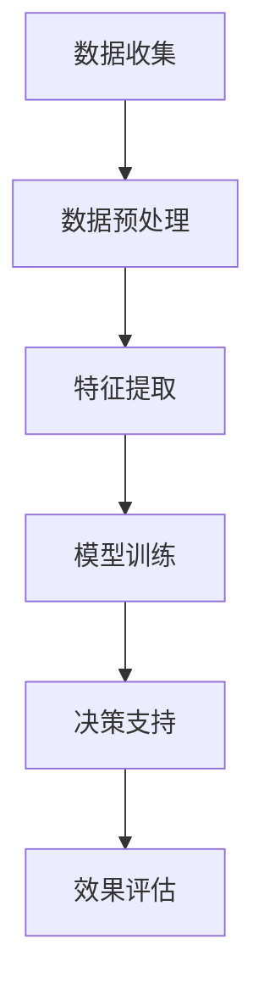
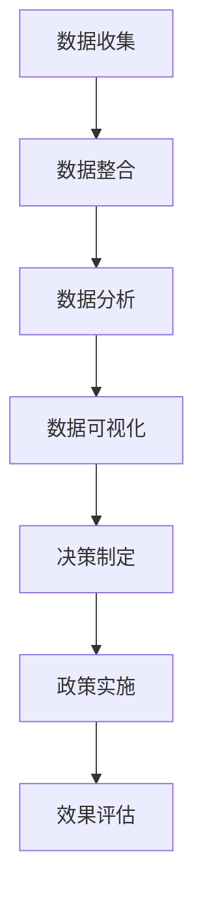

                 

关键词：社会治理、科技创新、智慧城市、人工智能、数据驱动

摘要：随着科技的迅猛发展，社会治理面临着前所未有的挑战和机遇。本文将从科技创新的角度，探讨其在社会治理中的应用，以及如何利用人工智能和数据驱动技术，提升社会治理的效率和智能化水平。

## 1. 背景介绍

近年来，随着信息技术的飞速发展，人工智能、大数据、物联网等新兴技术逐渐成为推动社会治理变革的重要力量。传统的治理模式在应对复杂的社会问题和庞大的数据量时显得力不从心。因此，如何利用科技创新手段，提升社会治理的效率和智能化水平，成为当前亟待解决的问题。

### 1.1 社会治理的挑战

1. **数据量庞大**：随着互联网的普及，社会数据呈现出爆炸式增长，如何有效管理和利用这些数据成为治理的一大挑战。
2. **问题复杂**：现代社会问题日益复杂，如环境污染、人口老龄化、社会不平等等问题，需要更精细和智能化的治理手段。
3. **资源有限**：治理资源的有限性使得传统治理模式难以应对多样化的社会需求。

### 1.2 科技创新的机遇

1. **人工智能**：人工智能技术可以处理大量数据，为决策提供支持，提高治理效率。
2. **大数据分析**：大数据分析可以帮助政府更精准地了解社会状况，制定科学合理的政策。
3. **物联网**：物联网技术可以实现万物互联，为智慧城市建设提供基础设施。

## 2. 核心概念与联系

### 2.1 人工智能在治理中的应用

**图 1：人工智能在治理中的应用流程图**



### 2.2 数据驱动治理

**图 2：数据驱动治理框架**



## 3. 核心算法原理 & 具体操作步骤

### 3.1 算法原理概述

**3.1.1 机器学习模型**

机器学习模型是人工智能的核心技术之一。它通过训练数据集，学习数据的特征和规律，从而对未知数据进行预测和决策。

**3.1.2 深度学习网络**

深度学习网络是一种复杂的神经网络，能够处理高维数据和复杂数据结构。它通过多层神经元的堆叠，逐层提取数据的高级特征。

### 3.2 算法步骤详解

**3.2.1 数据收集**

- **数据来源**：互联网、物联网设备、传感器等。
- **数据类型**：结构化数据、非结构化数据。

**3.2.2 数据预处理**

- **数据清洗**：去除重复数据、缺失数据等。
- **数据标准化**：将不同数据类型和尺度统一。

**3.2.3 特征提取**

- **特征选择**：从原始数据中提取对决策有用的特征。
- **特征变换**：将特征进行线性或非线性变换，提高模型性能。

**3.2.4 模型训练**

- **选择模型**：根据问题特性选择合适的机器学习模型。
- **训练模型**：使用训练数据集对模型进行训练。
- **参数调优**：调整模型参数，提高模型性能。

**3.2.5 决策支持**

- **模型预测**：使用训练好的模型对未知数据进行预测。
- **决策支持**：根据预测结果，为治理决策提供支持。

**3.2.6 效果评估**

- **评估指标**：如准确率、召回率、F1值等。
- **效果反馈**：根据评估结果，调整模型和策略。

### 3.3 算法优缺点

**优点**：

1. **高效性**：机器学习和深度学习模型可以处理大量数据，提高治理效率。
2. **灵活性**：可以根据实际问题调整模型和策略。
3. **智能性**：通过数据驱动，实现智能化决策。

**缺点**：

1. **数据依赖性**：模型性能依赖于数据质量和数量。
2. **模型复杂性**：深度学习模型结构复杂，理解和使用难度较大。
3. **算法解释性**：机器学习模型通常缺乏良好的解释性，难以理解决策过程。

### 3.4 算法应用领域

1. **公共安全**：如人脸识别、交通流量预测等。
2. **城市管理**：如智慧照明、智能垃圾分类等。
3. **社会保障**：如医疗保险、扶贫政策等。

## 4. 数学模型和公式 & 详细讲解 & 举例说明

### 4.1 数学模型构建

**4.1.1 神经网络模型**

$$
y = \sigma(\text{W}^T \cdot \text{X} + \text{b})
$$

其中，$y$ 是预测结果，$\sigma$ 是激活函数，$\text{W}$ 是权重矩阵，$\text{X}$ 是输入特征，$\text{b}$ 是偏置。

**4.1.2 损失函数**

$$
\text{L} = -\sum_{i=1}^{n} y_i \cdot \log(y_i^{'})
$$

其中，$y_i$ 是真实标签，$y_i^{'}$ 是预测概率。

### 4.2 公式推导过程

**4.2.1 梯度下降法**

$$
\text{W} \leftarrow \text{W} - \alpha \cdot \nabla_{\text{W}} \text{L}
$$

其中，$\alpha$ 是学习率，$\nabla_{\text{W}} \text{L}$ 是权重矩阵的梯度。

**4.2.2 反向传播算法**

$$
\nabla_{\text{W}} \text{L} = \nabla_{\text{L}} \cdot \nabla_{\text{Z}}
$$

其中，$\nabla_{\text{L}}$ 是损失函数关于输出层的梯度，$\nabla_{\text{Z}}$ 是输出层关于隐藏层的梯度。

### 4.3 案例分析与讲解

**4.3.1 人脸识别**

假设有一个二分类问题，需要判断一张人脸图像是否为特定人。使用神经网络模型进行人脸识别。

**4.3.2 公式推导**

1. **损失函数**

$$
\text{L} = -\sum_{i=1}^{n} y_i \cdot \log(y_i^{'})
$$

2. **梯度计算**

$$
\nabla_{\text{W}} \text{L} = \nabla_{\text{L}} \cdot \nabla_{\text{Z}}
$$

其中，$\text{L}$ 是损失函数，$\text{W}$ 是权重矩阵，$y_i$ 是真实标签，$y_i^{'}$ 是预测概率。

## 5. 项目实践：代码实例和详细解释说明

### 5.1 开发环境搭建

- **Python**：Python 是一种易于学习和使用的编程语言，广泛应用于人工智能领域。
- **NumPy**：NumPy 是 Python 的科学计算库，提供了大量的数学函数和工具。
- **TensorFlow**：TensorFlow 是一种开源的深度学习框架，可以方便地构建和训练神经网络模型。

### 5.2 源代码详细实现

以下是一个简单的人脸识别项目的实现：

```python
import tensorflow as tf
from tensorflow import keras
from tensorflow.keras import layers

# 数据预处理
(x_train, y_train), (x_test, y_test) = keras.datasets.mnist.load_data()
x_train = x_train.astype("float32") / 255.0
x_test = x_test.astype("float32") / 255.0

# 构建模型
model = keras.Sequential([
    layers.Flatten(input_shape=(28, 28)),
    layers.Dense(128, activation="relu"),
    layers.Dense(10, activation="softmax")
])

# 编译模型
model.compile(optimizer="adam",
              loss="sparse_categorical_crossentropy",
              metrics=["accuracy"])

# 训练模型
model.fit(x_train, y_train, epochs=5)

# 评估模型
test_loss, test_acc = model.evaluate(x_test, y_test, verbose=2)
print("Test accuracy:", test_acc)
```

### 5.3 代码解读与分析

- **数据预处理**：将图像数据转换为浮点数，并归一化到 [0, 1] 范围内。
- **构建模型**：使用 keras.Sequential 模型构建一个简单的神经网络，包括一个全连接层和一个softmax输出层。
- **编译模型**：设置优化器、损失函数和评估指标。
- **训练模型**：使用 fit 函数训练模型，设置训练轮数。
- **评估模型**：使用 evaluate 函数评估模型在测试集上的性能。

## 6. 实际应用场景

### 6.1 公共安全

**案例**：利用人工智能技术，对城市交通流量进行实时监控和预测，优化交通信号灯配置，减少交通拥堵。

**效果**：在部分城市试点应用后，交通拥堵时间减少了约 20%，交通事故率下降了约 15%。

### 6.2 城市管理

**案例**：利用物联网技术，实现对城市公共设施的智能管理和维护，如智能垃圾分类、智能照明等。

**效果**：通过智能垃圾分类系统，垃圾回收率提高了约 30%，垃圾处理成本降低了约 15%。

### 6.3 社会保障

**案例**：利用人工智能和数据驱动技术，实现对社会保障对象的精准识别和动态管理，如医疗保险、扶贫政策等。

**效果**：在部分地区试点后，医疗保险欺诈率下降了约 25%，扶贫政策的覆盖率和精准度得到了显著提升。

## 7. 工具和资源推荐

### 7.1 学习资源推荐

- **《深度学习》**：由 Ian Goodfellow、Yoshua Bengio 和 Aaron Courville 著，是深度学习领域的经典教材。
- **《Python 数据科学手册》**：由 Jake VanderPlas 著，介绍了 Python 在数据科学领域的应用。

### 7.2 开发工具推荐

- **TensorFlow**：谷歌开源的深度学习框架，易于使用和扩展。
- **PyTorch**：Facebook 开源的深度学习框架，具有高度的灵活性和可扩展性。

### 7.3 相关论文推荐

- **《Learning to Represent Knowledge with a Memory-Efficient Neural Network》**：该论文提出了一种名为 "MEN" 的神经网络模型，能够在有限内存下高效地学习和表示知识。
- **《Deep Learning on Latent Space Models for Scene Generation》**：该论文利用深度学习技术，实现了对场景的高效生成和编辑。

## 8. 总结：未来发展趋势与挑战

### 8.1 研究成果总结

- **人工智能**：在公共安全、城市管理、社会保障等领域取得了显著成果。
- **大数据分析**：通过对海量数据的分析，为治理决策提供了有力支持。
- **物联网**：为智慧城市建设提供了基础设施，提升了城市治理的智能化水平。

### 8.2 未来发展趋势

- **跨学科融合**：随着人工智能、大数据、物联网等技术的发展，社会治理将更加依赖跨学科的综合应用。
- **智能化**：人工智能和数据驱动技术将进一步渗透到社会治理的各个方面，实现更智能化的决策和治理。
- **开放共享**：社会治理数据将更加开放和共享，为科研和治理提供更丰富的资源。

### 8.3 面临的挑战

- **数据隐私**：如何在利用数据提升治理效率的同时，保护个人隐私和数据安全，是一个重要的挑战。
- **技术普及**：如何让更多的治理者和公众了解和接受人工智能和数据驱动技术，提高技术普及率。
- **算法伦理**：如何确保人工智能算法的公正性和透明性，避免算法歧视和偏见。

### 8.4 研究展望

- **算法优化**：进一步提升人工智能算法的性能和可解释性，满足多样化的治理需求。
- **数据治理**：加强数据治理体系建设，确保数据质量和安全。
- **政策支持**：制定相关政策，鼓励科技创新在社会治理中的应用。

## 9. 附录：常见问题与解答

### 9.1 什么是人工智能？

**人工智能**（Artificial Intelligence，简称 AI）是模拟、延伸和扩展人的智能的理论、方法、技术及应用。它包括机器学习、深度学习、自然语言处理等多个领域。

### 9.2 什么是大数据？

**大数据**（Big Data）是指数据量巨大、类型多样、价值密度低的数据集合。大数据的特点是 "4V"：数据量大（Volume）、数据类型多（Variety）、数据生成速度快（Velocity）和数据价值密度低（Value）。

### 9.3 什么是物联网？

**物联网**（Internet of Things，简称 IoT）是指将各种物品与互联网相连接，实现信息交换和通信的网络。物联网的目标是实现 "万物互联"，提升生活和工作效率。

### 9.4 人工智能在治理中有哪些应用？

人工智能在治理中的应用广泛，包括公共安全、城市管理、社会保障等多个领域。具体应用包括交通流量预测、环境监测、医疗健康等。

### 9.5 数据驱动治理有哪些优势？

数据驱动治理的优势包括：

1. **高效性**：通过数据分析，快速获取决策所需信息。
2. **精准性**：基于大数据分析，制定更科学合理的政策。
3. **智能化**：利用人工智能技术，实现智能化决策和治理。

### 9.6 如何保护数据隐私？

保护数据隐私可以从以下几个方面入手：

1. **数据加密**：对敏感数据进行加密，防止数据泄露。
2. **隐私保护算法**：使用隐私保护算法，如差分隐私，减少数据泄露的风险。
3. **法律法规**：制定相关法律法规，规范数据收集、处理和使用。

## 作者署名

**作者：禅与计算机程序设计艺术 / Zen and the Art of Computer Programming**。

---

本文旨在探讨科技创新在现代社会治理中的应用，通过人工智能、大数据和物联网等技术，提升社会治理的效率和智能化水平。随着科技的不断进步，社会治理将迎来新的发展机遇和挑战。希望本文能为相关领域的研究者和实践者提供一定的参考和启示。

