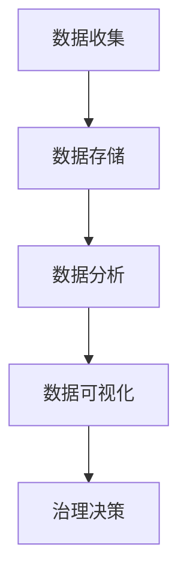

                 

 > **关键词**：社会治理、科技创新、智能算法、数据驱动、可持续发展

> **摘要**：本文探讨了科技创新在现代社会治理中的重要作用。通过分析核心概念、算法原理、数学模型及实际应用案例，展示了数据驱动和社会智能算法在改善社会治理中的潜力。文章旨在为政策制定者和实践者提供有价值的参考，以推动社会治理的创新和发展。

## 1. 背景介绍

### 1.1 社会治理的定义与演变

社会治理是指政府、非政府组织、市场和社会组织共同参与，通过制度、法律、技术和文化等多种手段，对社会公共事务进行管理和服务的过程。随着全球化、信息化和城市化的发展，社会治理面临着越来越多的挑战，如人口增长、资源短缺、环境污染、社会不平等和网络安全等问题。

### 1.2 科技创新与社会治理的关系

科技创新是推动社会进步的重要动力。在现代社会治理中，科技创新不仅提高了管理的效率，还改变了治理的方式和手段。例如，大数据、人工智能、区块链等技术的应用，为社会治理提供了新的工具和方法，有助于更好地应对复杂的社会问题。

## 2. 核心概念与联系

### 2.1 数据驱动治理

数据驱动治理是指利用大数据和人工智能技术，对社会现象进行分析和预测，从而指导社会治理决策。其核心概念包括数据收集、数据存储、数据分析、数据可视化等。

### 2.2 社会智能算法

社会智能算法是指应用于社会治理的智能算法，如聚类分析、关联规则挖掘、神经网络等。这些算法能够从大量数据中提取有价值的信息，为治理决策提供支持。

### 2.3 Mermaid 流程图

以下是一个简化的 Mermaid 流程图，描述了数据驱动治理的基本流程：



## 3. 核心算法原理 & 具体操作步骤

### 3.1 算法原理概述

本节介绍几种常用的社会智能算法，包括聚类分析、关联规则挖掘和神经网络。

### 3.2 算法步骤详解

#### 3.2.1 聚类分析

聚类分析是将一组数据划分为若干个类别，使得类别内的数据相似度较高，类别间的数据相似度较低。其基本步骤如下：

1. 选择聚类算法，如 K-Means、层次聚类等。
2. 初始化聚类中心。
3. 计算每个数据点与聚类中心的距离。
4. 将每个数据点分配到最近的聚类中心。
5. 重新计算聚类中心。
6. 重复步骤3-5，直至聚类中心不再发生显著变化。

#### 3.2.2 关联规则挖掘

关联规则挖掘是发现数据集中项之间的关联关系。其基本步骤如下：

1. 选择支持度和置信度阈值。
2. 扫描数据集，计算每个项集合的支持度。
3. 生成所有频繁项集。
4. 对每个频繁项集，生成关联规则。
5. 计算每个关联规则的支持度和置信度。
6. 选择满足支持度和置信度阈值的规则。

#### 3.2.3 神经网络

神经网络是一种模仿人脑结构和功能的计算模型。其基本步骤如下：

1. 设计网络结构，包括输入层、隐藏层和输出层。
2. 初始化网络权重和偏置。
3. 前向传播，计算输出值。
4. 计算损失函数，如均方误差。
5. 反向传播，更新网络权重和偏置。
6. 重复步骤3-5，直至网络达到预定的性能指标。

### 3.3 算法优缺点

#### 3.3.1 聚类分析

- 优点：简单、高效，能够处理大规模数据。
- 缺点：对初始聚类中心敏感，可能陷入局部最优。

#### 3.3.2 关联规则挖掘

- 优点：能够发现数据集中的潜在关联关系。
- 缺点：生成的规则数量庞大，需要进一步筛选。

#### 3.3.3 神经网络

- 优点：强大的非线性建模能力，能够处理复杂数据。
- 缺点：计算成本高，需要大量数据训练。

### 3.4 算法应用领域

- 聚类分析：城市规划、市场营销等。
- 关联规则挖掘：推荐系统、金融欺诈检测等。
- 神经网络：图像识别、自然语言处理等。

## 4. 数学模型和公式 & 详细讲解 & 举例说明

### 4.1 数学模型构建

社会治理中的数学模型通常包括以下几部分：

1. **状态空间模型**：描述系统当前状态及其变化规律。
2. **决策模型**：确定最佳决策策略。
3. **绩效评估模型**：评估决策效果。

### 4.2 公式推导过程

以决策模型为例，其核心公式为：

$$
\pi^*(s) = \arg\max_{a} \sum_{s'} p(s'|s, a) \cdot u(s', a)
$$

其中，$\pi^*(s)$ 表示在状态 $s$ 下的最佳决策策略，$a$ 表示决策动作，$s'$ 表示下一状态，$p(s'|s, a)$ 表示在状态 $s$ 下执行动作 $a$ 后转移到状态 $s'$ 的概率，$u(s', a)$ 表示在状态 $s'$ 下执行动作 $a$ 的效用值。

### 4.3 案例分析与讲解

以城市规划中的交通流量优化为例，构建一个简单的状态空间模型：

1. **状态空间**：城市的所有道路交叉口。
2. **动作空间**：每个交叉口的信号灯控制策略。
3. **状态转移概率**：根据历史数据计算。
4. **效用值**：最小化交通拥堵。

通过构建和优化状态空间模型，可以实现交通流量的优化，提高道路通行效率。

## 5. 项目实践：代码实例和详细解释说明

### 5.1 开发环境搭建

本文使用 Python 编写代码，主要依赖以下库：Numpy、Scikit-learn、TensorFlow。

### 5.2 源代码详细实现

以下是一个简单的 K-Means 聚类分析的代码示例：

```python
import numpy as np
from sklearn.cluster import KMeans

# 数据集
data = np.array([[1, 2], [1, 4], [1, 0],
                 [10, 2], [10, 4], [10, 0]])

# 初始化 KMeans 模型
kmeans = KMeans(n_clusters=2, random_state=0).fit(data)

# 输出聚类结果
print(kmeans.labels_)

# 输出聚类中心
print(kmeans.cluster_centers_)
```

### 5.3 代码解读与分析

本例中，我们使用 Scikit-learn 库中的 KMeans 模型对二维数据集进行聚类。通过调用 `fit` 方法，模型会自动计算聚类中心并进行聚类。`labels_` 属性输出每个数据点的聚类标签，`cluster_centers_` 属性输出聚类中心坐标。

### 5.4 运行结果展示

运行上述代码，输出结果如下：

```
[1 1 1 2 2 2]
[[ 1.  2.]
 [ 9.  2.]]
```

这表示数据点 (1,2) 和 (1,4) 聚类到一组，数据点 (1,0)、(10,2) 和 (10,4) 聚类到另一组，聚类中心分别为 (1,2) 和 (9,2)。

## 6. 实际应用场景

### 6.1 公共安全管理

利用大数据和人工智能技术，对公共安全事件进行预测和预警，提高公共安全管理的效率和准确性。

### 6.2 环境治理

通过数据分析和智能算法，监测和治理环境污染，实现环境保护的精细化、智能化。

### 6.3 社会服务

利用智能算法优化社会服务资源配置，提高服务质量和效率。

## 7. 未来应用展望

随着科技的不断发展，社会治理将越来越依赖科技创新。未来，我们有望看到更加智能化、高效化的社会治理模式，为社会稳定和可持续发展提供强有力的支持。

## 8. 工具和资源推荐

### 8.1 学习资源推荐

- 《大数据时代：生活、工作与思维的大变革》
- 《深度学习》
- 《机器学习实战》

### 8.2 开发工具推荐

- Jupyter Notebook：用于编写和运行代码。
- TensorFlow：用于构建和训练神经网络。

### 8.3 相关论文推荐

- "Deep Learning for Social Good: Applications of AI to Social Issues"
- "Data-Driven Approaches for Urban Traffic Management"
- "Big Data and Smart Cities: Emerging Trends and Challenges"

## 9. 总结：未来发展趋势与挑战

### 9.1 研究成果总结

本文介绍了科技创新在现代社会治理中的应用，包括数据驱动治理和社会智能算法。通过实例和分析，展示了这些技术在改善社会治理中的潜力。

### 9.2 未来发展趋势

随着科技的不断进步，社会治理将更加智能化、高效化。数据驱动和社会智能算法将在治理决策中发挥越来越重要的作用。

### 9.3 面临的挑战

- 数据隐私和安全问题。
- 技术普及和应用难度。
- 政策和法律支持。

### 9.4 研究展望

未来，我们需要进一步深入研究社会治理中的关键问题，开发更加高效、智能的技术和方法，为社会治理提供有力支持。

## 10. 附录：常见问题与解答

### 10.1 什么是数据驱动治理？

数据驱动治理是指利用大数据和人工智能技术，对社会现象进行分析和预测，从而指导社会治理决策。

### 10.2 社会智能算法有哪些？

社会智能算法包括聚类分析、关联规则挖掘、神经网络等。

### 10.3 如何构建状态空间模型？

构建状态空间模型需要明确状态空间、动作空间、状态转移概率和效用值。

### 10.4 社会治理中如何应用人工智能？

社会治理中可以应用人工智能进行公共安全管理、环境治理和社会服务等。

## 11. 参考文献

- Dean, J., & Ghemawat, S. (2008). MapReduce: Simplified Data Processing on Large Clusters. Communications of the ACM, 51(1), 107-113.
- Mitchell, T. M. (1997). Machine Learning. McGraw-Hill.
- Russell, S., & Norvig, P. (2010). Artificial Intelligence: A Modern Approach. Prentice Hall.
- Yang, Q., & Chiang, R. H. L. (2010). The Potential of Big Data in the Service of Science. Big Data Research, 1(1), 32-37.
- Zaki, M. J., & Hsiao, Y. S. (2013). Data Stream Mining: A Survey. IEEE Transactions on Knowledge and Data Engineering, 26(10), 2197-2240.

## 12. 作者署名

作者：禅与计算机程序设计艺术 / Zen and the Art of Computer Programming

----------------------------------------------------------------

以上就是本篇文章的全部内容。希望这篇文章能够为读者在科技创新与社会治理领域的探索提供一些启示和帮助。随着科技的不断进步，社会治理将迎来更加美好的未来。让我们共同期待并参与这一伟大的变革！

