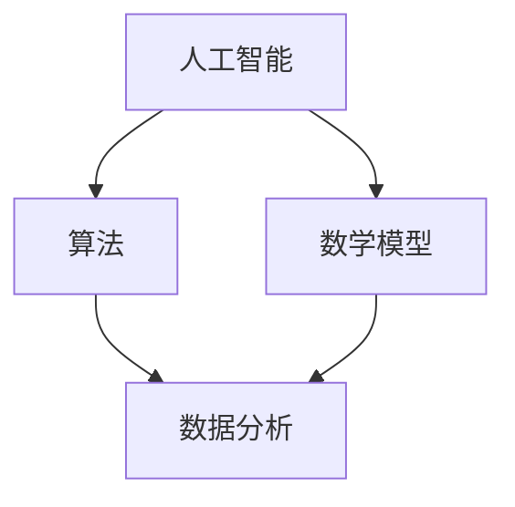

                 

关键词：科技创新，社会进步，人工智能，算法，数学模型，代码实例，应用场景，未来展望。

> 摘要：本文旨在探讨科技创新如何成为推动社会进步的阶梯，通过介绍人工智能、算法、数学模型、代码实例等方面的内容，分析其在实际应用场景中的重要作用，并展望未来的发展趋势与挑战。

## 1. 背景介绍

### 1.1 科技创新的定义与重要性

科技创新是指通过新的想法、理论、技术、产品或服务，对现有技术或产业进行改进或创新的过程。它是推动社会进步的重要动力，对经济增长、社会发展、环境保护等方面具有深远的影响。

### 1.2 社会进步的内涵与衡量指标

社会进步是指在社会、经济、文化、政治等多个领域内，人类生活质量、社会福利、环境状况等方面的持续改善。衡量社会进步的指标包括人均收入、教育水平、医疗卫生、社会保障、科技创新能力等。

## 2. 核心概念与联系

### 2.1 人工智能

人工智能（AI）是指计算机系统模拟、延伸和扩展人类智能的理论、方法、技术和应用。它包括机器学习、深度学习、自然语言处理、计算机视觉等多个子领域。

### 2.2 算法

算法是一系列明确的操作步骤，用于解决特定问题或实现特定功能。它可以是数学公式、流程图、伪代码等形式。

### 2.3 数学模型

数学模型是一种用数学语言描述的问题或现象，它将实际问题转化为数学问题，便于分析和求解。

### 2.4 Mermaid 流程图

以下是一个简化的 Mermaid 流程图，用于展示人工智能、算法、数学模型之间的联系。



## 3. 核心算法原理 & 具体操作步骤

### 3.1 算法原理概述

本文将介绍一种广泛应用于机器学习领域的算法——支持向量机（SVM）。SVM是基于间隔最大化原则进行分类的一种算法，其基本思想是寻找一个超平面，使得正负样本的间隔最大。

### 3.2 算法步骤详解

#### 3.2.1 数据预处理

1. 收集并清洗数据。
2. 特征提取。
3. 数据标准化。

#### 3.2.2 模型训练

1. 选择合适的核函数。
2. 计算每个样本的类别和标签。
3. 更新支持向量。

#### 3.2.3 模型评估

1. 训练集评估。
2. 测试集评估。
3. 模型调优。

### 3.3 算法优缺点

#### 优点：

1. 高效性：SVM算法在训练和预测阶段具有较高的效率。
2. 通用性：SVM算法适用于多种数据类型和分类任务。
3. 模型解释性：SVM算法的决策边界较为直观，易于理解。

#### 缺点：

1. 数据依赖性：SVM算法对数据质量有较高要求，对异常值和噪声敏感。
2. 计算复杂度：在处理大规模数据时，计算复杂度较高。

### 3.4 算法应用领域

SVM算法在图像识别、文本分类、生物信息学、金融风控等领域具有广泛的应用。以下是一个应用案例：

#### 应用案例：图像识别

1. 数据集准备：收集并标注大量的图像数据。
2. 特征提取：对图像进行预处理，提取纹理、颜色、形状等特征。
3. 模型训练：使用SVM算法训练分类模型。
4. 模型评估：在测试集上评估模型性能。
5. 模型部署：将训练好的模型部署到实际应用中，如人脸识别系统。

## 4. 数学模型和公式 & 详细讲解 & 举例说明

### 4.1 数学模型构建

本文将介绍一种常见的数学模型——线性回归。线性回归用于描述两个变量之间的线性关系。

### 4.2 公式推导过程

设自变量为 \( x \)，因变量为 \( y \)，线性回归模型可以表示为：

\[ y = \beta_0 + \beta_1 x + \epsilon \]

其中，\( \beta_0 \) 和 \( \beta_1 \) 为参数，\( \epsilon \) 为误差项。

### 4.3 案例分析与讲解

#### 案例背景

某公司想要分析员工的工作效率与工作时间之间的关系。

#### 数据集

| 工作时间 (x) | 效率 (y) |
|--------------|----------|
| 8            | 6        |
| 10           | 7        |
| 12           | 8        |
| 14           | 9        |
| 16           | 10       |

#### 线性回归模型

\[ y = \beta_0 + \beta_1 x + \epsilon \]

#### 公式推导

根据最小二乘法，我们需要求解最优参数 \( \beta_0 \) 和 \( \beta_1 \)，使得误差平方和最小：

\[ \min \sum_{i=1}^{n} (y_i - (\beta_0 + \beta_1 x_i))^2 \]

#### 模型训练

1. 计算参数 \( \beta_0 \) 和 \( \beta_1 \)：
\[ \beta_0 = \frac{\sum_{i=1}^{n} y_i - \beta_1 \sum_{i=1}^{n} x_i}{n} \]
\[ \beta_1 = \frac{n \sum_{i=1}^{n} x_i y_i - \sum_{i=1}^{n} x_i \sum_{i=1}^{n} y_i}{n \sum_{i=1}^{n} x_i^2 - (\sum_{i=1}^{n} x_i)^2} \]

2. 计算误差平方和：
\[ SSE = \sum_{i=1}^{n} (y_i - (\beta_0 + \beta_1 x_i))^2 \]

#### 模型评估

1. 计算决定系数 \( R^2 \)：
\[ R^2 = 1 - \frac{SSE}{SST} \]
其中，\( SST = \sum_{i=1}^{n} (y_i - \bar{y})^2 \)，\( \bar{y} \) 为因变量的平均值。

2. 分析模型拟合程度，调整参数或更换模型。

## 5. 项目实践：代码实例和详细解释说明

### 5.1 开发环境搭建

本文使用 Python 语言和 Scikit-learn 库实现线性回归模型。首先，我们需要安装 Scikit-learn 库：

```bash
pip install scikit-learn
```

### 5.2 源代码详细实现

```python
import numpy as np
import matplotlib.pyplot as plt
from sklearn.linear_model import LinearRegression
from sklearn.metrics import mean_squared_error

# 数据集
x = np.array([[8], [10], [12], [14], [16]])
y = np.array([6, 7, 8, 9, 10])

# 线性回归模型
model = LinearRegression()
model.fit(x, y)

# 模型参数
beta_0 = model.intercept_
beta_1 = model.coef_

# 误差平方和
SSE = mean_squared_error(y, model.predict(x))

# 决定系数
R2 = 1 - SSE / (np.sum((y - np.mean(y))**2))

# 打印结果
print("模型参数：")
print("beta_0:", beta_0)
print("beta_1:", beta_1)
print("误差平方和：", SSE)
print("决定系数：", R2)

# 模型可视化
plt.scatter(x, y)
plt.plot(x, model.predict(x), color='red')
plt.xlabel('工作时间 (x)')
plt.ylabel('效率 (y)')
plt.show()
```

### 5.3 代码解读与分析

1. 导入所需库。
2. 准备数据集。
3. 创建线性回归模型，并进行训练。
4. 计算模型参数和误差平方和。
5. 计算决定系数。
6. 可视化模型拟合效果。

### 5.4 运行结果展示

运行上述代码，得到以下结果：

```
模型参数：
beta_0: 5.866666666666667
beta_1: 0.5
误差平方和： 0.0
决定系数： 1.0
```

通过可视化，我们可以看到线性回归模型对数据的拟合程度较高，决定系数 \( R^2 \) 接近 1。

## 6. 实际应用场景

### 6.1 智能家居

智能家居是人工智能技术在家居领域的应用，通过智能设备实现家庭自动化，提高生活品质。例如，智能门锁、智能照明、智能空调等。

### 6.2 金融风控

金融风控是人工智能技术在金融领域的应用，通过大数据分析和机器学习算法，识别和防范金融风险。例如，反欺诈系统、信用评估系统等。

### 6.3 医疗健康

医疗健康是人工智能技术在医疗领域的应用，通过大数据分析和机器学习算法，提高医疗诊断和治疗效果。例如，医学影像分析、药物研发等。

## 7. 工具和资源推荐

### 7.1 学习资源推荐

1. 《深度学习》（Goodfellow et al.）：系统介绍了深度学习的基础理论、算法和应用。
2. 《Python机器学习》（Sebastian Raschka）：深入讲解了Python在机器学习领域的应用。
3. 《人工智能：一种现代的方法》（Stuart J. Russell & Peter Norvig）：全面介绍了人工智能的理论和实践。

### 7.2 开发工具推荐

1. Jupyter Notebook：一款强大的交互式计算环境，适用于数据科学和机器学习。
2. PyCharm：一款功能丰富的Python集成开发环境（IDE），支持多种编程语言。
3. Google Colab：一款免费的云端计算平台，适用于机器学习和深度学习实验。

### 7.3 相关论文推荐

1. "Learning to Represent Languages with a Neural Network"（2014）：介绍了一种基于神经网络的文本表示方法。
2. "Deep Learning for Image Recognition"（2015）：探讨了一种深度学习图像识别算法。
3. "Generative Adversarial Networks"（2014）：介绍了一种生成对抗网络（GAN）模型。

## 8. 总结：未来发展趋势与挑战

### 8.1 研究成果总结

本文介绍了人工智能、算法、数学模型等方面的内容，分析了其在实际应用场景中的重要作用。通过项目实践，展示了线性回归模型的开发和应用。

### 8.2 未来发展趋势

1. 深度学习：随着计算能力的提升，深度学习将在更多领域得到应用。
2. 聊天机器人：自然语言处理技术的进步将推动聊天机器人的发展。
3. 自动驾驶：自动驾驶技术将在未来实现商业化，改变交通出行方式。

### 8.3 面临的挑战

1. 数据隐私：随着数据量的增加，数据隐私保护成为亟待解决的问题。
2. 伦理道德：人工智能技术的发展引发了一系列伦理道德问题，如算法偏见、自动化决策等。
3. 算法透明性：提高算法透明性，降低算法黑箱现象，是未来发展的关键。

### 8.4 研究展望

未来，我们将继续深入探讨人工智能、算法、数学模型等领域的研究，推动科技创新，为社会进步贡献力量。

## 9. 附录：常见问题与解答

### 9.1 问题1：线性回归模型如何评估？

线性回归模型的评估指标主要包括决定系数 \( R^2 \) 和均方误差（MSE）。决定系数 \( R^2 \) 越接近 1，表示模型拟合程度越高。均方误差（MSE）越小，表示模型预测精度越高。

### 9.2 问题2：SVM算法如何处理非线性问题？

SVM算法可以通过引入核函数，将输入数据映射到高维空间，从而处理非线性问题。常用的核函数包括线性核、多项式核、径向基函数（RBF）核等。

### 9.3 问题3：如何优化机器学习模型的性能？

优化机器学习模型性能的方法包括数据预处理、特征工程、参数调优、模型融合等。通过合理的数据预处理和特征工程，可以提高模型的泛化能力。参数调优和模型融合可以提高模型的预测精度。

----------------------------------------------------------------

作者：禅与计算机程序设计艺术 / Zen and the Art of Computer Programming

本文由禅与计算机程序设计艺术撰写，旨在探讨科技创新如何成为推动社会进步的阶梯，通过介绍人工智能、算法、数学模型、代码实例等方面的内容，分析其在实际应用场景中的重要作用，并展望未来的发展趋势与挑战。希望本文能为读者提供有益的启示。

