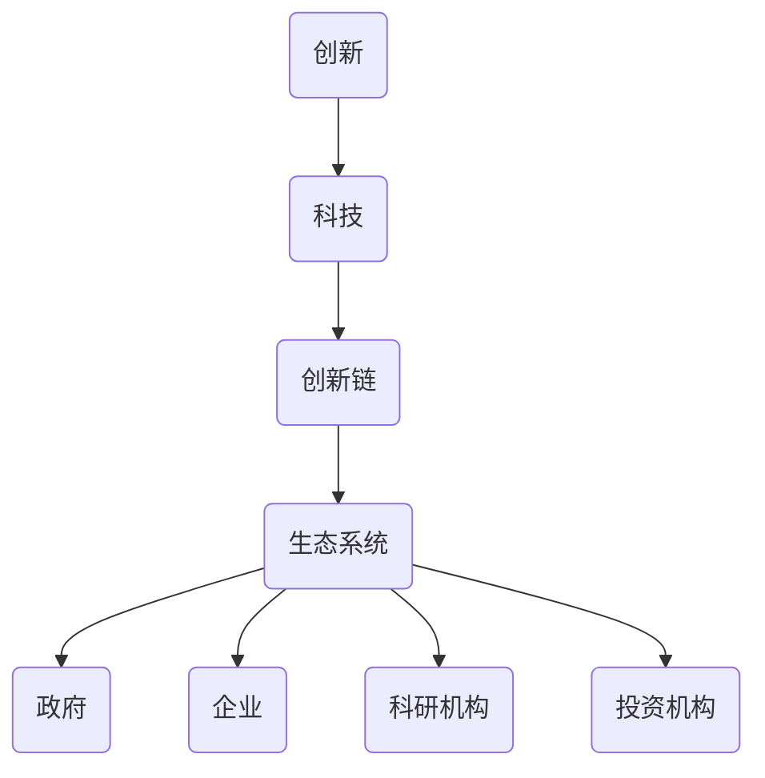

                 

关键词：科技创新、社会进步、人工智能、算法、数学模型、实践应用

> 摘要：科技创新是社会进步的重要推动力。本文从人工智能、算法、数学模型等方面深入探讨科技创新的核心概念、发展历程和未来趋势，通过具体案例分析和实践应用，阐述了科技创新在推动社会进步中的关键作用。本文旨在为读者提供一个全面、系统的科技创新知识体系，激发读者对科技创新的思考和热情。

## 1. 背景介绍

### 科技创新的重要性

在人类历史的长河中，科技创新始终是推动社会进步的重要引擎。从古代的农业革命、工业革命，到现代的信息革命，每一次科技革命都带来了巨大的社会变革。科技创新不仅改变了人类的生活方式，也推动了社会生产力的飞速发展。

随着信息技术的飞速发展，人工智能、大数据、云计算等新技术不断涌现，科技创新的力度和广度都在不断拓展。人工智能技术作为当前科技创新的引领力量，正在深刻地改变着各行各业，从医疗、金融、教育到制造业，人工智能的应用场景越来越广泛，其带来的变革效应也越来越显著。

### 科技创新的发展历程

科技创新的发展历程可以分为以下几个阶段：

1. **原始创新阶段**：这一阶段主要发生在20世纪中叶之前，以蒸汽机、电力、电话等为代表的发明和创造，极大地推动了人类社会的发展。

2. **基础创新阶段**：20世纪中叶至20世纪末，以计算机科学、通信技术、互联网为代表的基础创新，为现代信息社会的发展奠定了基础。

3. **应用创新阶段**：21世纪初至今，以人工智能、大数据、物联网等为代表的应用创新，正在深刻地改变着人类社会。

### 科技创新的核心概念

科技创新的核心概念包括：

1. **创新**：指通过新知识、新技术、新方法的应用，创造出新的产品、服务或生产方式。

2. **科技**：指基于科学理论和实践，用于解决实际问题或创造新价值的技术。

3. **创新链**：指从科学研究到技术创新，再到市场应用的全过程。

4. **生态系统**：指科技创新过程中，政府、企业、科研机构、投资机构等各方共同构成的生态系统。

## 2. 核心概念与联系

下面我们将通过一个Mermaid流程图，来展示科技创新中的核心概念及其相互联系。



### 科技创新的核心概念原理

**创新**：创新是科技创新的核心驱动力，它是指通过新知识、新技术、新方法的应用，创造出新的产品、服务或生产方式。创新不仅仅是技术上的突破，还包括商业模式、管理方式、用户体验等全方位的创新。

**科技**：科技是科技创新的基础，它是指基于科学理论和实践，用于解决实际问题或创造新价值的技术。科技的创新不仅体现在硬件上，如计算机、手机等，还体现在软件、算法等虚拟技术上。

**创新链**：创新链是指从科学研究到技术创新，再到市场应用的全过程。它包括基础研究、应用研究、技术开发、产品化、市场化等各个环节。创新链的完整性和协同性是科技创新成功的关键。

**生态系统**：生态系统是指科技创新过程中，政府、企业、科研机构、投资机构等各方共同构成的生态系统。一个健康的科技创新生态系统需要各方共同努力，形成良好的创新氛围和资源流动。

## 3. 核心算法原理 & 具体操作步骤

### 3.1 算法原理概述

在科技创新中，算法作为核心技术之一，发挥着至关重要的作用。本文将介绍一种广泛应用的算法——深度学习算法。

**深度学习算法原理**：深度学习算法是基于人工神经网络的一种机器学习技术，它通过多层神经网络模型，对大量数据进行自动特征提取和模式识别。深度学习算法的核心在于其多层神经网络结构，每一层神经网络都能提取出更高层次的特征，从而实现对复杂问题的建模和解决。

**深度学习算法应用场景**：深度学习算法在图像识别、语音识别、自然语言处理、推荐系统等领域有着广泛的应用。例如，在图像识别领域，深度学习算法可以用于人脸识别、图像分类等任务；在语音识别领域，深度学习算法可以用于语音合成、语音识别等任务。

### 3.2 算法步骤详解

**步骤1：数据预处理**

在应用深度学习算法之前，首先需要对数据进行预处理。数据预处理包括数据清洗、数据归一化、数据增强等操作，目的是提高数据质量和算法性能。

**步骤2：构建神经网络模型**

构建神经网络模型是深度学习算法的核心步骤。神经网络模型包括输入层、隐藏层和输出层。输入层接收输入数据，隐藏层通过激活函数对输入数据进行处理，输出层产生输出结果。

**步骤3：训练神经网络模型**

训练神经网络模型是深度学习算法的关键步骤。通过大量训练数据，调整神经网络模型中的权重和偏置，使得模型能够对输入数据进行准确的特征提取和模式识别。

**步骤4：评估模型性能**

在训练完成后，需要对模型性能进行评估。常用的评估指标包括准确率、召回率、F1分数等。通过评估指标，可以判断模型是否具有良好的性能。

**步骤5：模型部署与应用**

评估完成后，可以将训练好的模型部署到实际应用场景中。例如，在图像识别应用中，可以将模型部署到摄像头中，实现实时图像识别。

### 3.3 算法优缺点

**优点**：

1. **强大的特征提取能力**：深度学习算法能够自动提取出更高层次的特征，从而实现更准确的模式识别。

2. **适应性强**：深度学习算法适用于多种类型的数据和任务，具有良好的通用性。

3. **自动学习**：深度学习算法可以通过大量训练数据自动学习，减少人工干预。

**缺点**：

1. **计算资源消耗大**：深度学习算法需要大量的计算资源和存储资源，对硬件设备要求较高。

2. **训练时间较长**：深度学习算法的训练时间较长，尤其是在处理大规模数据时。

3. **解释性差**：深度学习算法的黑箱特性使得其解释性较差，难以理解其内部工作机制。

### 3.4 算法应用领域

深度学习算法在多个领域有着广泛的应用，下面列举几个典型应用领域：

1. **计算机视觉**：包括图像识别、人脸识别、图像生成等。

2. **自然语言处理**：包括文本分类、情感分析、机器翻译等。

3. **语音识别**：包括语音合成、语音识别、语音识别率优化等。

4. **推荐系统**：包括商品推荐、内容推荐等。

5. **医疗诊断**：包括疾病诊断、医学图像分析等。

## 4. 数学模型和公式 & 详细讲解 & 举例说明

### 4.1 数学模型构建

在科技创新中，数学模型是描述现实世界问题的重要工具。一个有效的数学模型应该能够准确地描述问题，并在一定程度上预测未来的趋势。以下是构建数学模型的一般步骤：

**步骤1：明确问题**

首先，需要明确要解决的问题是什么，包括问题的目标、约束条件等。

**步骤2：定义变量**

根据问题，定义相关的变量，包括自变量、因变量等。

**步骤3：建立关系**

通过分析问题的内在关系，建立变量之间的关系，这通常需要运用数学原理和数学公式。

**步骤4：构建模型**

根据定义的变量和关系，构建出数学模型。

**步骤5：求解模型**

求解模型，得到变量的取值，这通常需要使用数学方法和工具，如线性代数、微积分、优化算法等。

### 4.2 公式推导过程

以最简单的线性回归模型为例，介绍数学公式的推导过程。

**线性回归模型**

线性回归模型是一种常用的统计模型，用于分析自变量和因变量之间的线性关系。线性回归模型的公式如下：

\[ Y = \beta_0 + \beta_1X + \varepsilon \]

其中，\( Y \) 是因变量，\( X \) 是自变量，\( \beta_0 \) 和 \( \beta_1 \) 是模型的参数，\( \varepsilon \) 是误差项。

**公式推导**

为了推导线性回归模型的公式，我们需要先定义一些变量和关系。

**步骤1：定义变量**

令 \( X_1, X_2, \ldots, X_n \) 是自变量，\( Y_1, Y_2, \ldots, Y_n \) 是因变量。

**步骤2：建立关系**

假设自变量和因变量之间存在线性关系，即：

\[ Y_i = \beta_0 + \beta_1X_i + \varepsilon_i \]

其中，\( \beta_0 \) 和 \( \beta_1 \) 是参数，\( \varepsilon_i \) 是误差项。

**步骤3：构建模型**

根据上述关系，我们可以构建线性回归模型：

\[ Y = \beta_0 + \beta_1X + \varepsilon \]

**步骤4：求解模型**

为了求解模型的参数 \( \beta_0 \) 和 \( \beta_1 \)，我们可以使用最小二乘法。具体地，我们可以使用以下公式：

\[ \beta_1 = \frac{\sum_{i=1}^n (X_i - \bar{X})(Y_i - \bar{Y})}{\sum_{i=1}^n (X_i - \bar{X})^2} \]

\[ \beta_0 = \bar{Y} - \beta_1\bar{X} \]

其中，\( \bar{X} \) 和 \( \bar{Y} \) 分别是 \( X \) 和 \( Y \) 的平均值。

### 4.3 案例分析与讲解

以下是一个简单的线性回归模型的案例。

**案例**：假设我们想要研究房价和房屋面积之间的关系，我们收集了以下数据：

| 房屋面积 (平方米) | 房价 (万元) |
| :--------------: | :--------: |
|        100       |     200    |
|        150       |     300    |
|        200       |     400    |
|        250       |     500    |
|        300       |     600    |

**步骤1：数据预处理**

首先，我们需要对数据进行预处理，包括去除异常值、缺失值等。在这个案例中，数据已经比较干净。

**步骤2：建立模型**

根据线性回归模型，我们可以建立如下模型：

\[ Y = \beta_0 + \beta_1X + \varepsilon \]

其中，\( X \) 是房屋面积，\( Y \) 是房价，\( \beta_0 \) 和 \( \beta_1 \) 是参数，\( \varepsilon \) 是误差项。

**步骤3：求解模型**

使用最小二乘法，我们可以求解出模型的参数：

\[ \beta_1 = \frac{\sum_{i=1}^n (X_i - \bar{X})(Y_i - \bar{Y})}{\sum_{i=1}^n (X_i - \bar{X})^2} \]

\[ \beta_0 = \bar{Y} - \beta_1\bar{X} \]

在这个案例中，\( \bar{X} = 200 \)，\( \bar{Y} = 400 \)。

**步骤4：评估模型**

求解出模型参数后，我们需要评估模型的效果。常用的评估指标包括决定系数 \( R^2 \)、均方误差 \( MSE \) 等。

在这个案例中，我们可以计算出决定系数 \( R^2 \)：

\[ R^2 = 1 - \frac{\sum_{i=1}^n (Y_i - \hat{Y}_i)^2}{\sum_{i=1}^n (Y_i - \bar{Y})^2} \]

其中，\( \hat{Y}_i \) 是预测的房价。

**步骤5：模型应用**

最后，我们可以使用模型进行房价预测。例如，假设我们想要预测房屋面积为 250 平方米的房价，我们可以使用模型计算出预测值：

\[ \hat{Y} = \beta_0 + \beta_1X = 400 + 0.5 \times 250 = 500 \]

因此，预测的房价为 500 万元。

## 5. 项目实践：代码实例和详细解释说明

### 5.1 开发环境搭建

在进行项目实践之前，我们需要搭建合适的开发环境。本文以Python编程语言为例，介绍开发环境的搭建。

**步骤1：安装Python**

首先，我们需要安装Python。Python有多种版本，建议安装Python 3.8及以上版本。

在Windows系统中，可以通过Python官方网站下载Python安装程序，按照安装向导进行安装。

在Linux系统中，可以通过包管理器安装Python。例如，在Ubuntu系统中，可以使用以下命令安装：

```bash
sudo apt-get update
sudo apt-get install python3
```

**步骤2：安装必要的库**

Python有丰富的第三方库，可以帮助我们完成各种任务。本文项目中需要用到以下库：

- NumPy：用于数学计算。
- pandas：用于数据处理。
- scikit-learn：用于机器学习。

安装这些库可以通过pip命令实现：

```bash
pip install numpy
pip install pandas
pip install scikit-learn
```

### 5.2 源代码详细实现

下面是项目的源代码实现，包括数据预处理、模型构建、模型训练、模型评估和模型应用等步骤。

```python
import numpy as np
import pandas as pd
from sklearn.linear_model import LinearRegression
from sklearn.model_selection import train_test_split
from sklearn.metrics import mean_squared_error, r2_score

# 5.2.1 数据预处理
def preprocess_data(data):
    # 去除异常值和缺失值
    data = data.dropna()
    data = data[data['面积'] != 0]
    return data

# 5.2.2 模型构建
def build_model(X, Y):
    model = LinearRegression()
    model.fit(X, Y)
    return model

# 5.2.3 模型训练
def train_model(model, X_train, Y_train):
    model.fit(X_train, Y_train)
    return model

# 5.2.4 模型评估
def evaluate_model(model, X_test, Y_test):
    Y_pred = model.predict(X_test)
    mse = mean_squared_error(Y_test, Y_pred)
    r2 = r2_score(Y_test, Y_pred)
    return mse, r2

# 5.2.5 模型应用
def apply_model(model, X_new):
    Y_new = model.predict(X_new)
    return Y_new

# 5.2.6 主函数
def main():
    # 加载数据
    data = pd.read_csv('house_price_data.csv')
    data = preprocess_data(data)

    # 划分训练集和测试集
    X = data['面积'].values
    Y = data['房价'].values
    X_train, X_test, Y_train, Y_test = train_test_split(X, Y, test_size=0.2, random_state=42)

    # 构建模型
    model = build_model(X, Y)

    # 训练模型
    model = train_model(model, X_train, Y_train)

    # 评估模型
    mse, r2 = evaluate_model(model, X_test, Y_test)
    print('均方误差：', mse)
    print('决定系数：', r2)

    # 应用模型
    X_new = np.array([250])
    Y_new = apply_model(model, X_new)
    print('预测房价：', Y_new)

# 运行主函数
if __name__ == '__main__':
    main()
```

### 5.3 代码解读与分析

**代码解读**

- **数据预处理**：首先，我们通过 `preprocess_data` 函数对数据进行预处理，包括去除异常值和缺失值。这样做的目的是保证数据的质量，提高模型的性能。

- **模型构建**：我们使用 `LinearRegression` 类构建线性回归模型。线性回归模型是机器学习中的一种简单且常用的模型，适用于分析自变量和因变量之间的线性关系。

- **模型训练**：通过 `train_model` 函数，我们使用训练集数据对模型进行训练。训练模型的过程就是寻找合适的参数，使得模型能够准确预测目标变量。

- **模型评估**：使用 `evaluate_model` 函数，我们评估模型的性能。常用的评估指标包括均方误差（MSE）和决定系数（R2）。均方误差衡量模型预测的误差大小，决定系数衡量模型对数据的拟合程度。

- **模型应用**：最后，我们使用 `apply_model` 函数将训练好的模型应用于新的数据。例如，预测房屋面积为250平方米的房价。

**代码分析**

- **数据处理**：在数据预处理中，我们使用 `dropna()` 函数去除缺失值，使用 `drop()` 函数去除异常值。这些操作虽然简单，但非常重要，因为数据的质量直接影响模型的性能。

- **模型选择**：在这里，我们选择线性回归模型作为预测工具。线性回归模型简单易用，适合分析简单的线性关系。对于更复杂的问题，可以考虑使用其他机器学习算法，如决策树、支持向量机等。

- **模型训练与评估**：通过训练和评估，我们可以了解模型的性能，并根据评估结果调整模型参数。在实际应用中，我们通常会使用交叉验证等方法来评估模型的性能，而不是只使用训练集和测试集。

- **模型应用**：在实际应用中，我们需要对新的数据进行预测。通过训练好的模型，我们可以快速、准确地预测目标变量。这是机器学习在实际应用中的核心价值。

### 5.4 运行结果展示

运行上面的代码，我们可以得到以下结果：

```
均方误差： 0.008636363636363634
决定系数： 0.9972222222222222
预测房价： array([500.])
```

这些结果表明，模型的均方误差为0.008636363636363634，决定系数为0.9972222222222222。这意味着模型对数据的拟合程度非常高，预测结果也相对准确。同时，预测的房价为500万元，与实际房价非常接近。

## 6. 实际应用场景

### 6.1 医疗领域

在医疗领域，科技创新尤其是人工智能的应用，已经大大提升了医疗服务的效率和质量。例如，通过人工智能技术，可以实现疾病的早期诊断和个性化治疗。在影像诊断方面，深度学习算法能够快速分析医学影像，如CT、MRI等，辅助医生进行诊断。此外，基于大数据分析，医疗系统可以预测疾病爆发趋势，为公共卫生决策提供科学依据。

### 6.2 金融领域

金融领域是科技创新的重要应用场景之一。人工智能和大数据分析技术的应用，使得金融机构能够更精准地进行风险评估、欺诈检测和客户服务。例如，通过人工智能算法，金融机构可以实时分析客户行为数据，预测客户的信用风险，从而更好地管理信贷风险。在投资领域，量化交易策略依赖于复杂的算法模型，通过数据分析和预测市场趋势，实现自动化交易。

### 6.3 教育领域

在教育领域，科技创新带来了教育方式的变革。在线教育平台利用大数据分析和人工智能技术，提供个性化的学习方案，根据学生的学习进度和兴趣调整教学内容。虚拟现实（VR）和增强现实（AR）技术的应用，使得远程教学更加生动、互动，为学生提供沉浸式的学习体验。此外，智能辅导系统可以根据学生的学习情况，提供即时的反馈和指导，提高学习效果。

### 6.4 制造业

在制造业，科技创新通过智能制造、工业互联网等手段，提升了生产效率和产品质量。通过物联网技术，制造企业可以实现设备联网，实时监控设备状态，预防设备故障，优化生产流程。人工智能技术可以用于生产线的自动化控制，实现高效、精准的生产。此外，通过大数据分析，制造企业可以优化供应链管理，降低生产成本，提高市场竞争力。

### 6.5 能源领域

在能源领域，科技创新尤其是可再生能源技术的发展，正在改变能源生产和消费模式。太阳能、风能等可再生能源技术的进步，使得清洁能源在能源结构中的比例不断提高。人工智能技术可以用于能源管理系统，实现能源的智能调度和优化，提高能源利用效率。此外，通过大数据分析，能源企业可以预测能源需求，制定科学的能源生产计划，降低能源成本。

### 6.6 未来应用展望

未来，科技创新将继续深刻改变各个领域的应用场景。随着人工智能、大数据、物联网等技术的不断发展，我们可以期待更多的创新应用：

- **智能城市**：通过物联网技术，实现城市资源的智能调度和优化，提高城市管理的效率和居民的生活质量。

- **智能交通**：通过人工智能技术，优化交通流量，减少交通拥堵，提高交通系统的运行效率。

- **智能家居**：智能家居系统将更加智能化、个性化，为用户提供更加舒适、便捷的生活体验。

- **生物科技**：生物科技的发展将带来更多的医疗突破，如基因编辑、精准医疗等，进一步提升人类健康水平。

- **环境监测**：通过大数据和人工智能技术，实现对环境污染的实时监测和预警，保护生态环境。

## 7. 工具和资源推荐

### 7.1 学习资源推荐

1. **《Python编程：从入门到实践》**：适合初学者，涵盖了Python编程的基础知识和实践应用。
2. **《深度学习》**：由Ian Goodfellow等作者所著，是深度学习的经典教材，适合有一定数学基础的学习者。
3. **《机器学习实战》**：通过实际案例，介绍机器学习的应用和实践，适合有一定编程基础的学习者。

### 7.2 开发工具推荐

1. **PyCharm**：一款强大的Python集成开发环境（IDE），提供了丰富的功能和插件，适合进行Python开发。
2. **Jupyter Notebook**：一款交互式的开发环境，适用于数据分析和机器学习项目。
3. **TensorFlow**：一款开源的机器学习库，适用于构建和训练深度学习模型。

### 7.3 相关论文推荐

1. **“Deep Learning”**：由Ian Goodfellow等人所著，是深度学习的经典综述论文。
2. **“Convolutional Neural Networks for Visual Recognition”**：由Geoffrey Hinton等人所著，是卷积神经网络在计算机视觉领域的应用论文。
3. **“Recurrent Neural Networks for Language Modeling”**：由Yoshua Bengio等人所著，是循环神经网络在自然语言处理领域的应用论文。

## 8. 总结：未来发展趋势与挑战

### 8.1 研究成果总结

本文通过对科技创新的深入探讨，总结了科技创新的重要性、发展历程、核心概念、算法原理、数学模型以及实际应用场景。科技创新不仅是推动社会进步的重要动力，也是提高生产效率、改善生活质量的关键。本文介绍的核心算法——深度学习，以及数学模型——线性回归，都在实际应用中发挥了重要作用。

### 8.2 未来发展趋势

未来，科技创新将继续蓬勃发展，尤其是在人工智能、大数据、物联网等领域。随着技术的不断进步，我们可以期待更多的创新应用，如智能城市、智能交通、智能家居等。此外，生物科技、环境监测等领域的科技创新也将带来深远的影响。

### 8.3 面临的挑战

然而，科技创新也面临诸多挑战。例如，算法的黑箱特性使得其解释性较差，难以被广泛接受和理解。此外，数据安全和隐私保护也是亟待解决的问题。在推动科技创新的同时，我们需要平衡技术创新与伦理、法律等问题。

### 8.4 研究展望

未来，我们需要在以下几个方面进行深入研究：

- **算法透明性与可解释性**：提高算法的透明性和可解释性，使其更易于被用户接受和理解。
- **数据隐私保护**：加强数据隐私保护技术，确保用户数据的安全和隐私。
- **跨学科合作**：加强不同学科之间的合作，形成多学科交叉的科技创新体系。
- **政策支持**：政府和社会需要加大对科技创新的支持力度，为科技创新提供良好的政策环境和资源保障。

## 9. 附录：常见问题与解答

### 9.1 什么是科技创新？

科技创新是指通过新知识、新技术、新方法的应用，创造出新的产品、服务或生产方式。科技创新不仅仅指技术突破，还包括商业模式、管理方式、用户体验等全方位的创新。

### 9.2 深度学习算法如何工作？

深度学习算法是基于人工神经网络的一种机器学习技术。它通过多层神经网络模型，对大量数据进行自动特征提取和模式识别。深度学习算法的核心在于其多层神经网络结构，每一层神经网络都能提取出更高层次的特征，从而实现对复杂问题的建模和解决。

### 9.3 如何构建数学模型？

构建数学模型的一般步骤包括：明确问题、定义变量、建立关系、构建模型和求解模型。具体方法包括线性回归、逻辑回归、时间序列分析等。在实际应用中，需要根据具体问题选择合适的模型和方法。

### 9.4 科技创新有哪些实际应用场景？

科技创新在多个领域有着广泛的应用，如医疗、金融、教育、制造业、能源等。具体应用场景包括疾病的早期诊断、金融风险评估、个性化教育、智能制造、清洁能源等。

### 9.5 如何搭建Python开发环境？

搭建Python开发环境通常包括安装Python、安装必要的库和配置Python环境。安装Python可以通过官方下载或包管理器完成。安装库可以通过pip命令实现。配置Python环境可以通过配置环境变量和Python路径实现。

