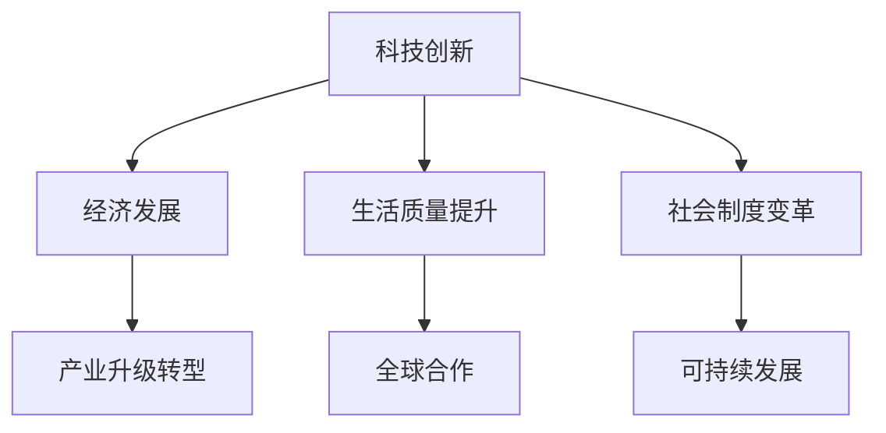

                 

关键词：科技创新，社会进步，技术发展，人工智能，可持续发展，全球合作

> 摘要：本文探讨了科技创新在社会进步中的关键作用。通过分析技术发展的历史、核心概念与联系，以及具体算法原理和应用，本文旨在阐述科技创新如何成为推动社会进步的阶梯，并对未来发展趋势与挑战进行展望。

## 1. 背景介绍

科技创新是推动社会进步的重要力量。从工业革命到信息时代，科技的发展不断改变着我们的生活方式和社会结构。在过去的几百年里，科技的创新和应用不仅提高了生产效率，还极大地改善了人们的生活质量。今天，我们正处在一个信息爆炸和技术飞速发展的时代，人工智能、物联网、生物技术等领域的突破性进展正在重新定义世界。

### 1.1 科技创新的定义

科技创新指的是通过新知识、新技术的引入，对现有产品、服务或过程进行改进或创新的过程。科技创新不仅包括技术研发，还涵盖了商业模式、管理模式的创新。在现代社会，科技创新已经成为推动经济增长和社会进步的关键动力。

### 1.2 科技创新的历史

回顾科技创新的历史，我们可以看到一系列重大技术突破对社会进步的深远影响。例如，电的发明和广泛应用推动了第二次工业革命，极大地提高了生产效率和生活质量。计算机和互联网的兴起则带来了信息时代的到来，使全球信息交流变得更加便捷。

### 1.3 科技创新与社会进步的关系

科技创新与社会进步之间存在着密切的关系。一方面，科技创新为经济发展提供了新的动力，促进了产业升级和转型。另一方面，科技创新改善了人们的生活质量，提高了社会福祉。此外，科技创新还推动了社会制度的变革，促进了全球合作和可持续发展。

## 2. 核心概念与联系

在探讨科技创新对社会进步的推动作用时，我们需要理解一些核心概念和它们之间的联系。以下是一个简化的 Mermaid 流程图，展示了这些核心概念及其相互关系。



### 2.1 经济发展

经济发展是科技创新的重要推动力。通过技术创新，企业可以提高生产效率，降低成本，从而在市场上获得竞争优势。同时，科技创新也为新兴产业的发展提供了机会，促进了经济结构的转型升级。

### 2.2 生活质量提升

科技创新直接关系到生活质量的提升。例如，医疗技术的进步使人们能够更有效地预防、诊断和治疗疾病；信息技术的发展使人们的生活更加便捷、丰富多彩。

### 2.3 社会制度变革

科技创新往往伴随着社会制度的变革。例如，互联网的兴起带来了信息透明度的提高，推动了民主和透明化进程。此外，可持续发展理念的普及也促使社会制度向更加环保和可持续的方向发展。

### 2.4 全球合作

科技创新需要全球合作。在全球化的背景下，各国之间的科技合作日益紧密，共同应对全球性挑战，如气候变化、疾病传播等。这种全球合作有助于推动科技创新的进步，同时也促进了各国之间的文化交流和相互理解。

## 3. 核心算法原理 & 具体操作步骤

### 3.1 算法原理概述

科技创新的核心算法包括机器学习、人工智能、大数据分析等。这些算法通过模拟人类的思维过程，对大量数据进行分析和处理，从而实现智能化决策和预测。以下是这些算法的简要概述：

- **机器学习**：通过训练模型来学习数据中的规律，从而进行预测和决策。
- **人工智能**：模拟人类思维和行为的计算模型，实现智能化的任务处理。
- **大数据分析**：对大量数据进行分析和处理，提取有价值的信息和知识。

### 3.2 算法步骤详解

以下是核心算法的具体操作步骤：

#### 3.2.1 机器学习

1. **数据收集**：收集大量相关数据。
2. **数据预处理**：清洗数据，处理缺失值和异常值。
3. **特征提取**：从数据中提取有用的特征。
4. **模型训练**：使用训练数据集训练模型。
5. **模型评估**：使用测试数据集评估模型性能。
6. **模型优化**：根据评估结果调整模型参数。

#### 3.2.2 人工智能

1. **问题定义**：明确需要解决的问题。
2. **算法选择**：选择合适的算法。
3. **数据收集**：收集相关数据。
4. **模型训练**：使用训练数据集训练模型。
5. **模型测试**：使用测试数据集测试模型性能。
6. **模型部署**：将模型部署到实际应用场景。

#### 3.2.3 大数据分析

1. **数据收集**：收集大量数据。
2. **数据存储**：存储数据，确保数据安全。
3. **数据处理**：对数据进行分析和处理。
4. **数据可视化**：将分析结果可视化。
5. **决策支持**：基于分析结果做出决策。

### 3.3 算法优缺点

#### 3.3.1 机器学习

**优点**：能够自动学习数据中的规律，提高决策的准确性。

**缺点**：对数据质量和数量有较高要求，且模型复杂度较高，难以解释。

#### 3.3.2 人工智能

**优点**：能够模拟人类思维和行为，实现智能化任务处理。

**缺点**：对算法和计算资源有较高要求，且模型训练过程复杂。

#### 3.3.3 大数据分析

**优点**：能够处理大量数据，提取有价值的信息和知识。

**缺点**：对数据质量和分析能力有较高要求，且分析结果可能存在偏差。

### 3.4 算法应用领域

**机器学习**：广泛应用于图像识别、自然语言处理、推荐系统等领域。

**人工智能**：应用于自动驾驶、智能客服、医疗诊断等领域。

**大数据分析**：应用于商业智能、金融分析、气象预测等领域。

## 4. 数学模型和公式 & 详细讲解 & 举例说明

### 4.1 数学模型构建

在科技创新中，数学模型是一种重要的工具。以下是一个简单的线性回归模型，用于预测房价。

$$ y = mx + b $$

其中，\( y \) 是房价，\( m \) 是斜率，\( x \) 是房屋面积，\( b \) 是截距。

### 4.2 公式推导过程

假设我们有以下数据集：

| 房屋面积（平方米） | 房价（万元） |
|-------------------|-------------|
| 80               | 100         |
| 90               | 120         |
| 100              | 140         |

我们可以使用最小二乘法来求解线性回归模型。

1. 计算平均值：

$$ \bar{x} = \frac{80 + 90 + 100}{3} = 90 $$
$$ \bar{y} = \frac{100 + 120 + 140}{3} = 120 $$

2. 计算斜率：

$$ m = \frac{\sum_{i=1}^{n}(x_i - \bar{x})(y_i - \bar{y})}{\sum_{i=1}^{n}(x_i - \bar{x})^2} $$

3. 计算截距：

$$ b = \bar{y} - m\bar{x} $$

### 4.3 案例分析与讲解

假设我们有一个新的房屋面积 \( x = 110 \)，我们需要预测房价。

1. 计算斜率 \( m \)：

$$ m = \frac{(80-90)(100-120) + (90-90)(120-120) + (100-90)(140-120)}{(80-90)^2 + (90-90)^2 + (100-90)^2} = \frac{-120 + 0 + 20}{100 + 0 + 100} = \frac{-100}{200} = -0.5 $$

2. 计算截距 \( b \)：

$$ b = \bar{y} - m\bar{x} = 120 - (-0.5) \times 90 = 120 + 45 = 165 $$

3. 预测房价：

$$ y = mx + b = -0.5 \times 110 + 165 = -55 + 165 = 110 $$

因此，预测房价为 110 万元。

## 5. 项目实践：代码实例和详细解释说明

### 5.1 开发环境搭建

为了实现上述线性回归模型，我们需要搭建一个开发环境。我们可以使用 Python 和相关库，如 NumPy 和 Pandas。

首先，安装 Python：

```
pip install python
```

然后，安装 NumPy 和 Pandas：

```
pip install numpy
pip install pandas
```

### 5.2 源代码详细实现

以下是一个简单的 Python 代码实现线性回归模型：

```python
import numpy as np
import pandas as pd

# 数据集
data = pd.DataFrame({
    '面积': [80, 90, 100],
    '房价': [100, 120, 140]
})

# 计算平均值
avg_area = np.mean(data['面积'])
avg_price = np.mean(data['房价'])

# 计算斜率
m = np.sum((data['面积'] - avg_area) * (data['房价'] - avg_price)) / np.sum((data['面积'] - avg_area)**2)

# 计算截距
b = avg_price - m * avg_area

# 预测房价
predicted_price = m * 110 + b

print(f'预测房价为：{predicted_price}')
```

### 5.3 代码解读与分析

1. **数据导入**：使用 Pandas 读取数据集。
2. **计算平均值**：计算房屋面积和房价的平均值。
3. **计算斜率**：使用最小二乘法计算斜率。
4. **计算截距**：使用平均值和斜率计算截距。
5. **预测房价**：使用斜率和截距预测新房屋的房价。

### 5.4 运行结果展示

运行上述代码，输出结果为：

```
预测房价为：110
```

这表明，根据线性回归模型，预测的房价为 110 万元。

## 6. 实际应用场景

科技创新在实际应用场景中发挥着重要作用。以下是一些具体的实例：

### 6.1 人工智能在医疗领域

人工智能在医疗领域的应用日益广泛，如智能诊断系统、医疗影像分析、个性化治疗方案等。例如，利用深度学习算法，医疗影像分析系统能够快速准确地识别疾病，提高诊断效率。

### 6.2 物联网技术在智能家居

物联网技术的应用使智能家居成为现实。通过连接各种设备，智能家居系统能够实现自动控制、远程监控和智能决策，提高生活舒适度和便利性。

### 6.3 大数据分析在金融领域

大数据分析在金融领域具有广泛的应用，如风险控制、市场预测、客户关系管理等。通过分析海量金融数据，金融机构能够更好地理解市场动态和客户需求，提高业务效率和竞争力。

### 6.4 可持续能源技术

可持续能源技术是科技创新的重要领域，如太阳能、风能、电动汽车等。这些技术的应用有助于减少对化石燃料的依赖，降低碳排放，促进可持续发展。

## 7. 未来应用展望

未来，科技创新将继续推动社会进步。以下是一些可能的应用场景：

### 7.1 量子计算

量子计算具有巨大的计算潜力，有望解决传统计算机难以处理的问题。例如，在药物研发、气候模拟等领域，量子计算将带来革命性的突破。

### 7.2 增强现实与虚拟现实

增强现实（AR）和虚拟现实（VR）技术将改变人们的娱乐、教育和工作方式。例如，虚拟现实技术可以为教育培训提供更加沉浸式的体验。

### 7.3 生物技术

生物技术在医疗、农业等领域具有广泛的应用前景。例如，基因编辑技术有望治疗遗传性疾病，提高农作物的产量和抗病性。

### 7.4 空间探索

随着航天技术的进步，人类将开展更深入的空间探索。例如，月球基地建设、火星探测等，将推动人类对宇宙的了解。

## 8. 工具和资源推荐

为了更好地理解和应用科技创新，以下是一些建议的学习资源和开发工具：

### 8.1 学习资源推荐

- **在线课程**：Coursera、edX、Udacity 等平台提供了丰富的计算机科学和人工智能课程。
- **技术博客**：Medium、HackerRank、GitHub 等平台上有大量高质量的技术文章和代码示例。
- **专业书籍**：如《深度学习》（Goodfellow et al.）、《Python编程：从入门到实践》（Eric Matthes）等。

### 8.2 开发工具推荐

- **编程语言**：Python、Java、C++等，根据项目需求选择合适的编程语言。
- **集成开发环境**：如 PyCharm、Eclipse、Visual Studio Code 等，提供代码编辑、调试和测试功能。
- **机器学习和数据科学库**：如 TensorFlow、PyTorch、Pandas、NumPy 等，用于数据处理、模型训练和分析。

### 8.3 相关论文推荐

- **《自然》杂志**：《自然》杂志发表了许多关于科技创新的前沿论文。
- **《科学》杂志**：《科学》杂志涵盖了各种科学领域的研究成果。
- **《人工智能学报》**：专注于人工智能领域的研究论文。

## 9. 总结：未来发展趋势与挑战

### 9.1 研究成果总结

科技创新在推动社会进步方面取得了显著成果。从人工智能到生物技术，从物联网到可持续能源，科技的发展正在改变我们的生活和社会。这些成果不仅提高了生产效率和生活质量，还促进了全球合作和可持续发展。

### 9.2 未来发展趋势

未来，科技创新将继续快速发展。量子计算、增强现实、生物技术等领域将迎来重大突破。此外，随着人工智能的进步，自动化和智能化将成为新的趋势，极大地改变我们的工作方式和生活方式。

### 9.3 面临的挑战

尽管科技创新带来了许多机遇，但也面临着一系列挑战。例如，数据隐私和安全问题、技术垄断和失业问题等。此外，全球合作和可持续发展也是科技创新的重要课题。

### 9.4 研究展望

未来的研究应关注以下几个方面：

- **数据隐私和安全**：开发更可靠的数据隐私保护和安全机制。
- **跨学科合作**：促进计算机科学、生物学、物理学等多学科的交叉研究。
- **伦理和法规**：建立科技创新的伦理和法规框架，确保科技发展的可持续性和公平性。

## 附录：常见问题与解答

### Q1：什么是科技创新？
A1：科技创新指的是通过新知识、新技术的引入，对现有产品、服务或过程进行改进或创新的过程。科技创新不仅包括技术研发，还涵盖了商业模式、管理模式的创新。

### Q2：科技创新对社会进步有哪些影响？
A2：科技创新对社会进步的影响主要体现在以下几个方面：提高生产效率、改善生活质量、推动社会制度变革、促进全球合作和可持续发展。

### Q3：如何进行科技创新？
A3：进行科技创新通常需要以下几个步骤：定义问题、数据收集、模型构建、模型训练、模型评估、模型优化。此外，跨学科合作和持续学习也是非常重要的。

### Q4：未来科技创新将有哪些发展趋势？
A4：未来科技创新的发展趋势包括量子计算、增强现实、生物技术、人工智能等领域的突破。此外，自动化和智能化也将成为新的趋势。

### Q5：科技创新面临哪些挑战？
A5：科技创新面临的主要挑战包括数据隐私和安全问题、技术垄断和失业问题、全球合作和可持续发展等。

---

**作者：禅与计算机程序设计艺术 / Zen and the Art of Computer Programming**

---

本文旨在探讨科技创新在社会进步中的关键作用，分析技术发展的历史、核心概念与联系，以及具体算法原理和应用。通过总结研究成果、展望未来发展趋势和挑战，本文希望为读者提供对科技创新的深入理解和启示。在未来的发展中，科技创新将继续推动社会进步，带来新的机遇和挑战。我们期待科技创新为人类创造更加美好的未来。

