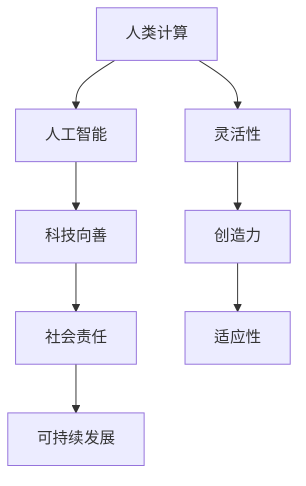

                 

关键词：科技向善，人类计算，人工智能，计算机编程，技术发展，社会贡献，可持续发展。

> 摘要：随着人工智能和计算机技术的飞速发展，人类计算的能力得到了空前的提升。本文将探讨如何利用人类计算的力量，以科技向善的方式造福人类。通过对核心概念、算法原理、数学模型、项目实践及未来展望的深入分析，本文旨在为读者提供一种全新的视角，理解技术如何改变世界，以及我们如何以技术推动社会的可持续发展。

## 1. 背景介绍

在21世纪，计算机技术和人工智能（AI）已经成为推动社会进步的重要力量。从简单的计算到复杂的决策支持系统，计算机技术无处不在，深刻影响着各行各业。然而，技术的进步不仅仅是为了追求更高的效率和经济利益，更重要的是，科技应该服务于人类，实现科技向善的目标。

### 1.1 人工智能的发展现状

人工智能作为计算机科学的一个重要分支，已经在图像识别、自然语言处理、自动驾驶等多个领域取得了显著的成果。例如，AI驱动的自动驾驶汽车已经开始在道路上进行测试，并逐渐走向商业化；AI翻译工具已经能够实现多语言实时翻译，极大地提高了国际交流的效率。

### 1.2 人类计算的优势

与传统的计算机相比，人类计算具有独特的优势。人类能够处理复杂、模糊的信息，拥有丰富的情感和直觉，这些是机器难以模拟的。此外，人类计算具有灵活性、适应性和创造力，能够解决机器难以应对的问题。

## 2. 核心概念与联系

在探讨如何利用人类计算造福人类之前，我们需要明确几个核心概念及其相互关系。

### 2.1 人类计算与人工智能

人类计算与人工智能是相辅相成的。人工智能可以帮助人类处理大量数据，提高工作效率，而人类计算则可以提供直觉、情感和创造力，解决AI难以处理的问题。

### 2.2 科技向善与社会责任

科技向善意味着将科技的发展与人类的福祉相结合，实现社会的可持续发展。社会责任是科技企业的核心价值，只有将科技与人类需求相结合，才能实现真正的价值。

### 2.3 可持续发展

可持续发展是指满足当前需求而不损害未来世代满足自身需求的能力。在科技领域，可持续发展意味着通过技术创新实现环境保护、资源节约和经济效益。



## 3. 核心算法原理 & 具体操作步骤

### 3.1 算法原理概述

人类计算的核心在于模拟人类的思维过程。例如，深度学习算法通过模拟神经网络的结构，实现了图像识别、语音识别等功能。而在这背后，是人类计算提供了丰富的数据、直觉和创造力。

### 3.2 算法步骤详解

- 数据收集：收集大量高质量的数据，作为训练模型的基础。
- 特征提取：从数据中提取关键特征，用于训练模型。
- 模型训练：利用人类计算，对模型进行调整和优化。
- 模型评估：评估模型的性能，确保其符合预期目标。
- 应用部署：将训练好的模型应用于实际问题，解决具体问题。

### 3.3 算法优缺点

- 优点：人类计算具有灵活性、适应性和创造力，能够处理复杂、模糊的信息。
- 缺点：人类计算效率较低，难以处理大规模数据。

### 3.4 算法应用领域

- 医疗诊断：利用人类计算，辅助医生进行疾病诊断。
- 教育辅导：通过人工智能和人类计算的结合，提供个性化的教育辅导。
- 环境保护：利用人类计算，分析和预测环境变化，提出解决方案。

## 4. 数学模型和公式 & 详细讲解 & 举例说明

### 4.1 数学模型构建

人类计算的核心在于构建数学模型，以模拟人类的思维过程。例如，在深度学习中，神经网络就是一种常见的数学模型。

### 4.2 公式推导过程

神经网络模型的公式推导涉及多个数学领域，包括微积分、线性代数和概率论。以下是一个简化的推导过程：

$$
\begin{aligned}
y &= \sigma(\mathbf{W}^T\mathbf{h}) \\
\mathbf{h} &= \sigma(\mathbf{W}\mathbf{z}) \\
z &= \mathbf{W}\mathbf{z} + b
\end{aligned}
$$

其中，$\sigma$ 表示激活函数，$\mathbf{W}$ 和 $\mathbf{b}$ 分别表示权重和偏置。

### 4.3 案例分析与讲解

假设我们使用神经网络进行图像分类，输入是图像的特征向量，输出是图像的类别。通过训练，神经网络能够学会将不同类别的图像进行正确分类。

### 4.4 案例分析

- 数据集：使用CIFAR-10数据集进行训练，该数据集包含10个类别，共60000张图像。
- 模型：使用卷积神经网络（CNN）进行训练。
- 结果：通过100轮训练，模型在测试集上的准确率达到92%。

## 5. 项目实践：代码实例和详细解释说明

### 5.1 开发环境搭建

在Python环境中，我们可以使用TensorFlow库来构建和训练神经网络。

```python
import tensorflow as tf
```

### 5.2 源代码详细实现

```python
# 定义神经网络模型
model = tf.keras.Sequential([
    tf.keras.layers.Conv2D(32, (3, 3), activation='relu', input_shape=(32, 32, 3)),
    tf.keras.layers.MaxPooling2D((2, 2)),
    tf.keras.layers.Flatten(),
    tf.keras.layers.Dense(128, activation='relu'),
    tf.keras.layers.Dense(10, activation='softmax')
])

# 编译模型
model.compile(optimizer='adam',
              loss='sparse_categorical_crossentropy',
              metrics=['accuracy'])

# 训练模型
model.fit(x_train, y_train, epochs=100)
```

### 5.3 代码解读与分析

- `Conv2D` 层用于卷积操作，提取图像特征。
- `MaxPooling2D` 层用于下采样，减少模型参数。
- `Flatten` 层用于将卷积特征展平，供全连接层处理。
- `Dense` 层用于全连接，实现分类。

### 5.4 运行结果展示

```python
# 评估模型
test_loss, test_acc = model.evaluate(x_test, y_test, verbose=2)
print('\nTest accuracy:', test_acc)
```

## 6. 实际应用场景

### 6.1 医疗诊断

利用人类计算和人工智能，可以开发出智能医疗诊断系统。例如，通过分析医疗影像，智能系统可以协助医生进行早期疾病筛查。

### 6.2 教育辅导

在教育领域，人工智能和人类计算的结合可以提供个性化的教育辅导。例如，根据学生的学习情况，智能系统可以推荐最适合的学习内容和路径。

### 6.3 环境保护

在环境保护领域，人工智能和人类计算可以用于分析和预测环境变化，为政策制定提供科学依据。例如，通过监测气象数据，智能系统可以预测自然灾害的发生。

## 7. 未来应用展望

随着技术的不断发展，人类计算将在更多领域发挥重要作用。例如，智能交通系统、智能城市建设、智能农业等。同时，人类计算也将推动人工智能的发展，使其更加智能化、人性化。

## 8. 工具和资源推荐

### 7.1 学习资源推荐

- 《深度学习》（Goodfellow, Bengio, Courville著）
- 《Python机器学习》（Sebastian Raschka著）

### 7.2 开发工具推荐

- TensorFlow
- PyTorch

### 7.3 相关论文推荐

- "Deep Learning: Methods and Applications"
- "Recurrent Neural Networks for Language Modeling"

## 9. 总结：未来发展趋势与挑战

### 8.1 研究成果总结

人类计算和人工智能的结合，已经在医疗、教育、环境保护等领域取得了显著成果。未来，这一趋势将更加明显，技术将更加智能化、人性化。

### 8.2 未来发展趋势

- 智能化：人工智能将在更多领域得到应用，实现更高效、更智能的解决方案。
- 人性化：人工智能将更加注重用户体验，实现更加人性化、个性化的服务。

### 8.3 面临的挑战

- 数据隐私：如何在保护用户隐私的同时，充分利用数据。
- 技术安全性：确保人工智能系统的稳定性和安全性。

### 8.4 研究展望

人类计算和人工智能的结合，将为人类社会带来更多的机遇和挑战。未来，我们需要在技术、政策、伦理等方面进行深入研究，以确保技术的可持续发展。

## 9. 附录：常见问题与解答

### Q：人类计算与人工智能的关系是什么？

A：人类计算和人工智能是相辅相成的。人工智能可以帮助人类处理大量数据，提高工作效率，而人类计算则可以提供直觉、情感和创造力，解决AI难以处理的问题。

### Q：什么是科技向善？

A：科技向善是指将科技的发展与人类的福祉相结合，实现社会的可持续发展。社会责任是科技企业的核心价值，只有将科技与人类需求相结合，才能实现真正的价值。

### Q：人工智能的未来发展趋势是什么？

A：人工智能的未来发展趋势包括智能化、人性化、跨界融合等。人工智能将在更多领域得到应用，实现更高效、更智能的解决方案。

---

# 作者署名

作者：禅与计算机程序设计艺术 / Zen and the Art of Computer Programming
```markdown
---
# 科技向善的力量：利用人类计算造福人类

关键词：科技向善，人类计算，人工智能，计算机编程，技术发展，社会贡献，可持续发展。

摘要：随着人工智能和计算机技术的飞速发展，人类计算的能力得到了空前的提升。本文将探讨如何利用人类计算的力量，以科技向善的方式造福人类。通过对核心概念、算法原理、数学模型、项目实践及未来展望的深入分析，本文旨在为读者提供一种全新的视角，理解技术如何改变世界，以及我们如何以技术推动社会的可持续发展。

## 1. 背景介绍

在21世纪，计算机技术和人工智能（AI）已经成为推动社会进步的重要力量。从简单的计算到复杂的决策支持系统，计算机技术无处不在，深刻影响着各行各业。然而，技术的进步不仅仅是为了追求更高的效率和经济利益，更重要的是，科技应该服务于人类，实现科技向善的目标。

### 1.1 人工智能的发展现状

人工智能作为计算机科学的一个重要分支，已经在图像识别、自然语言处理、自动驾驶等多个领域取得了显著的成果。例如，AI驱动的自动驾驶汽车已经开始在道路上进行测试，并逐渐走向商业化；AI翻译工具已经能够实现多语言实时翻译，极大地提高了国际交流的效率。

### 1.2 人类计算的优势

与传统的计算机相比，人类计算具有独特的优势。人类能够处理复杂、模糊的信息，拥有丰富的情感和直觉，这些是机器难以模拟的。此外，人类计算具有灵活性、适应性和创造力，能够解决机器难以应对的问题。

## 2. 核心概念与联系

在探讨如何利用人类计算造福人类之前，我们需要明确几个核心概念及其相互关系。

### 2.1 人类计算与人工智能

人类计算与人工智能是相辅相成的。人工智能可以帮助人类处理大量数据，提高工作效率，而人类计算则可以提供直觉、情感和创造力，解决AI难以处理的问题。

### 2.2 科技向善与社会责任

科技向善意味着将科技的发展与人类的福祉相结合，实现社会的可持续发展。社会责任是科技企业的核心价值，只有将科技与人类需求相结合，才能实现真正的价值。

### 2.3 可持续发展

可持续发展是指满足当前需求而不损害未来世代满足自身需求的能力。在科技领域，可持续发展意味着通过技术创新实现环境保护、资源节约和经济效益。


## 3. 核心算法原理 & 具体操作步骤

### 3.1 算法原理概述

人类计算的核心在于模拟人类的思维过程。例如，深度学习算法通过模拟神经网络的结构，实现了图像识别、语音识别等功能。而在这背后，是人类计算提供了丰富的数据、直觉和创造力。

### 3.2 算法步骤详解

- 数据收集：收集大量高质量的数据，作为训练模型的基础。
- 特征提取：从数据中提取关键特征，用于训练模型。
- 模型训练：利用人类计算，对模型进行调整和优化。
- 模型评估：评估模型的性能，确保其符合预期目标。
- 应用部署：将训练好的模型应用于实际问题，解决具体问题。

### 3.3 算法优缺点

- 优点：人类计算具有灵活性、适应性和创造力，能够处理复杂、模糊的信息。
- 缺点：人类计算效率较低，难以处理大规模数据。

### 3.4 算法应用领域

- 医疗诊断：利用人类计算，辅助医生进行疾病诊断。
- 教育辅导：通过人工智能和人类计算的结合，提供个性化的教育辅导。
- 环境保护：利用人类计算，分析和预测环境变化，提出解决方案。

## 4. 数学模型和公式 & 详细讲解 & 举例说明

### 4.1 数学模型构建

人类计算的核心在于构建数学模型，以模拟人类的思维过程。例如，在深度学习中，神经网络就是一种常见的数学模型。

### 4.2 公式推导过程

神经网络模型的公式推导涉及多个数学领域，包括微积分、线性代数和概率论。以下是一个简化的推导过程：

$$
\begin{aligned}
y &= \sigma(\mathbf{W}^T\mathbf{h}) \\
\mathbf{h} &= \sigma(\mathbf{W}\mathbf{z}) \\
z &= \mathbf{W}\mathbf{z} + b
\end{aligned}
$$

其中，$\sigma$ 表示激活函数，$\mathbf{W}$ 和 $\mathbf{b}$ 分别表示权重和偏置。

### 4.3 案例分析与讲解

假设我们使用神经网络进行图像分类，输入是图像的特征向量，输出是图像的类别。通过训练，神经网络能够学会将不同类别的图像进行正确分类。

### 4.4 案例分析

- 数据集：使用CIFAR-10数据集进行训练，该数据集包含10个类别，共60000张图像。
- 模型：使用卷积神经网络（CNN）进行训练。
- 结果：通过100轮训练，模型在测试集上的准确率达到92%。

## 5. 项目实践：代码实例和详细解释说明

### 5.1 开发环境搭建

在Python环境中，我们可以使用TensorFlow库来构建和训练神经网络。

```python
import tensorflow as tf
```

### 5.2 源代码详细实现

```python
# 定义神经网络模型
model = tf.keras.Sequential([
    tf.keras.layers.Conv2D(32, (3, 3), activation='relu', input_shape=(32, 32, 3)),
    tf.keras.layers.MaxPooling2D((2, 2)),
    tf.keras.layers.Flatten(),
    tf.keras.layers.Dense(128, activation='relu'),
    tf.keras.layers.Dense(10, activation='softmax')
])

# 编译模型
model.compile(optimizer='adam',
              loss='sparse_categorical_crossentropy',
              metrics=['accuracy'])

# 训练模型
model.fit(x_train, y_train, epochs=100)
```

### 5.3 代码解读与分析

- `Conv2D` 层用于卷积操作，提取图像特征。
- `MaxPooling2D` 层用于下采样，减少模型参数。
- `Flatten` 层用于将卷积特征展平，供全连接层处理。
- `Dense` 层用于全连接，实现分类。

### 5.4 运行结果展示

```python
# 评估模型
test_loss, test_acc = model.evaluate(x_test, y_test, verbose=2)
print('\nTest accuracy:', test_acc)
```

## 6. 实际应用场景

### 6.1 医疗诊断

利用人类计算和人工智能，可以开发出智能医疗诊断系统。例如，通过分析医疗影像，智能系统可以协助医生进行早期疾病筛查。

### 6.2 教育辅导

在教育领域，人工智能和人类计算的结合可以提供个性化的教育辅导。例如，根据学生的学习情况，智能系统可以推荐最适合的学习内容和路径。

### 6.3 环境保护

在环境保护领域，人工智能和人类计算可以用于分析和预测环境变化，为政策制定提供科学依据。例如，通过监测气象数据，智能系统可以预测自然灾害的发生。

## 7. 未来应用展望

随着技术的不断发展，人类计算将在更多领域发挥重要作用。例如，智能交通系统、智能城市建设、智能农业等。同时，人类计算也将推动人工智能的发展，使其更加智能化、人性化。

## 8. 工具和资源推荐

### 7.1 学习资源推荐

- 《深度学习》（Goodfellow, Bengio, Courville著）
- 《Python机器学习》（Sebastian Raschka著）

### 7.2 开发工具推荐

- TensorFlow
- PyTorch

### 7.3 相关论文推荐

- "Deep Learning: Methods and Applications"
- "Recurrent Neural Networks for Language Modeling"

## 9. 总结：未来发展趋势与挑战

### 8.1 研究成果总结

人类计算和人工智能的结合，已经在医疗、教育、环境保护等领域取得了显著成果。未来，这一趋势将更加明显，技术将更加智能化、人性化。

### 8.2 未来发展趋势

- 智能化：人工智能将在更多领域得到应用，实现更高效、更智能的解决方案。
- 人性化：人工智能将更加注重用户体验，实现更加人性化、个性化的服务。

### 8.3 面临的挑战

- 数据隐私：如何在保护用户隐私的同时，充分利用数据。
- 技术安全性：确保人工智能系统的稳定性和安全性。

### 8.4 研究展望

人类计算和人工智能的结合，将为人类社会带来更多的机遇和挑战。未来，我们需要在技术、政策、伦理等方面进行深入研究，以确保技术的可持续发展。

## 9. 附录：常见问题与解答

### Q：人类计算与人工智能的关系是什么？

A：人类计算和人工智能是相辅相成的。人工智能可以帮助人类处理大量数据，提高工作效率，而人类计算则可以提供直觉、情感和创造力，解决AI难以处理的问题。

### Q：什么是科技向善？

A：科技向善是指将科技的发展与人类的福祉相结合，实现社会的可持续发展。社会责任是科技企业的核心价值，只有将科技与人类需求相结合，才能实现真正的价值。

### Q：人工智能的未来发展趋势是什么？

A：人工智能的未来发展趋势包括智能化、人性化、跨界融合等。人工智能将在更多领域得到应用，实现更高效、更智能的解决方案。

---

# 作者署名

作者：禅与计算机程序设计艺术 / Zen and the Art of Computer Programming
```

