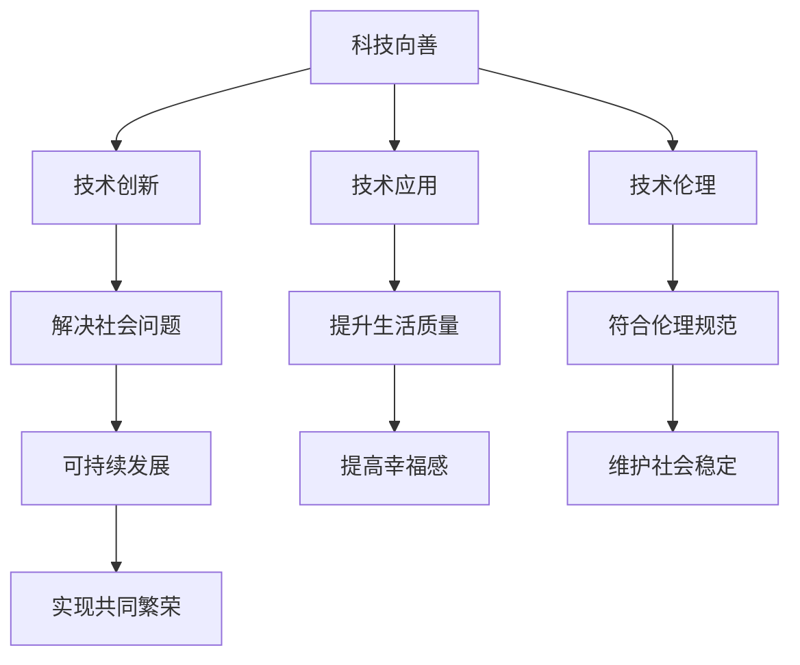

                 

 **关键词**：科技向善，社会问题，解决方案，技术伦理，创新应用

**摘要**：本文探讨了科技在解决社会问题中的重要作用，分析了当前科技在应对各种社会挑战方面的应用和成效，并探讨了技术伦理在科技向善过程中的重要性。通过具体的案例分析和未来展望，我们呼吁科技工作者和社会各界共同努力，推动科技向善，实现可持续发展。

## 1. 背景介绍

在当今世界，科技的发展日新月异，人工智能、大数据、物联网等前沿技术不断涌现，为我们的生活带来了极大的便利。然而，科技的发展也带来了许多社会问题，如信息泄露、网络安全、资源浪费等。这些问题的解决不仅需要技术手段，更需要我们从伦理和社会责任的角度出发，实现科技向善。

科技向善是指将科技的发展应用于解决社会问题，提升人类生活质量，实现可持续发展。这一理念要求我们在追求技术创新的同时，注重科技对社会的影响，确保科技的发展符合人类社会的价值观和道德规范。

## 2. 核心概念与联系

### 2.1 科技向善的定义

科技向善是一种理念，它强调科技的发展应该服务于人类社会，解决社会问题，提升生活质量。具体来说，科技向善包括以下几个方面：

- **技术创新**：通过不断探索新的技术和方法，提高科技解决社会问题的能力。
- **技术应用**：将科技应用于实际的社会问题中，实现科技对社会问题的有效解决。
- **技术伦理**：在科技发展中，注重伦理问题，确保科技的发展符合社会伦理规范。

### 2.2 社会问题的定义

社会问题是指影响社会正常运转，损害社会公共利益，影响人民生活质量的各种问题。常见的如环境污染、贫富差距、教育资源不均等。

### 2.3 科技与社会问题的关系

科技与社会问题是相互关联的。一方面，社会问题的存在激发了科技的创新和应用；另一方面，科技的进步又为社会问题的解决提供了新的手段。例如，互联网技术的发展促进了教育资源的均衡分配，大数据和人工智能的应用提高了医疗服务的效率。

### 2.4 Mermaid 流程图



## 3. 核心算法原理 & 具体操作步骤

### 3.1 算法原理概述

科技向善的实现需要一系列核心算法的支撑，这些算法包括但不限于人工智能算法、大数据分析算法、物联网通信算法等。以下是这些算法的基本原理：

- **人工智能算法**：通过模拟人类思维过程，实现机器的自主学习、推理和决策。
- **大数据分析算法**：通过对大量数据的分析和处理，提取有价值的信息和知识。
- **物联网通信算法**：通过物联网设备之间的通信和数据交换，实现智能化管理和控制。

### 3.2 算法步骤详解

#### 3.2.1 人工智能算法步骤

1. **数据收集**：收集大量的数据，包括文本、图像、声音等。
2. **数据预处理**：对收集到的数据进行分析和处理，去除噪声，提取特征。
3. **模型训练**：使用预处理后的数据训练模型，模型可以是神经网络、决策树等。
4. **模型评估**：使用测试数据评估模型的性能，调整模型参数，提高模型准确性。
5. **模型应用**：将训练好的模型应用于实际问题中，如自动驾驶、智能客服等。

#### 3.2.2 大数据分析算法步骤

1. **数据采集**：从各种来源获取数据，如数据库、传感器、互联网等。
2. **数据清洗**：去除重复数据、缺失数据、错误数据等。
3. **数据存储**：将清洗后的数据存储到数据库中，以便后续处理和分析。
4. **数据挖掘**：使用算法挖掘数据中的模式和关联，提取有价值的信息。
5. **结果分析**：对挖掘出的信息进行分析，为决策提供支持。

#### 3.2.3 物联网通信算法步骤

1. **设备接入**：将物联网设备接入网络，实现设备之间的通信。
2. **数据采集**：从设备中采集数据，如环境参数、设备状态等。
3. **数据传输**：将采集到的数据传输到服务器或云端进行处理。
4. **数据处理**：对传输的数据进行处理，如过滤、压缩、加密等。
5. **数据分析**：使用算法对处理后的数据进行分析，实现智能化管理和控制。

### 3.3 算法优缺点

#### 3.3.1 人工智能算法

优点：
- **强大的学习能力**：能够从大量数据中学习，提高决策的准确性。
- **高效的处理能力**：能够快速处理大量的数据。

缺点：
- **数据依赖性**：对大量高质量的数据有较强的依赖。
- **黑箱化**：模型的内部机制复杂，难以解释。

#### 3.3.2 大数据分析算法

优点：
- **强大的分析能力**：能够从大量数据中提取有价值的信息。
- **灵活的应用**：可以应用于各个领域，如金融、医疗、教育等。

缺点：
- **数据隐私问题**：在数据收集和处理过程中，可能涉及到个人隐私。
- **计算资源消耗大**：大数据分析通常需要大量的计算资源和存储空间。

#### 3.3.3 物联网通信算法

优点：
- **实时性强**：能够实现设备之间的实时通信和数据交换。
- **智能化管理**：能够通过算法实现设备的智能化管理和控制。

缺点：
- **安全性问题**：物联网设备较多，可能存在安全隐患。
- **网络依赖性**：需要稳定的网络连接，否则通信和数据传输会受到影响。

### 3.4 算法应用领域

- **人工智能**：自动驾驶、智能客服、医疗诊断等。
- **大数据分析**：金融风险管理、医疗数据分析、教育评估等。
- **物联网**：智能家居、智能城市、智能农业等。

## 4. 数学模型和公式 & 详细讲解 & 举例说明

### 4.1 数学模型构建

在科技向善的过程中，数学模型起着至关重要的作用。以下是一个简单的数学模型构建过程：

#### 4.1.1 问题定义

假设我们要解决一个优化问题，目标是找到一组变量 \(x_1, x_2, ..., x_n\)，使得某个函数 \(f(x_1, x_2, ..., x_n)\) 最小化。

#### 4.1.2 目标函数

定义目标函数为：

\[ f(x_1, x_2, ..., x_n) = \sum_{i=1}^{n} w_i x_i^2 \]

其中，\(w_i\) 是权重，\(x_i\) 是变量。

#### 4.1.3 约束条件

定义约束条件为：

\[ g(x_1, x_2, ..., x_n) \leq 0 \]

其中，\(g(x_1, x_2, ..., x_n)\) 是约束函数。

### 4.2 公式推导过程

我们要找到一组变量 \(x_1, x_2, ..., x_n\)，使得目标函数 \(f(x_1, x_2, ..., x_n)\) 最小化，同时满足约束条件 \(g(x_1, x_2, ..., x_n) \leq 0\)。

根据拉格朗日乘数法，我们可以构建一个拉格朗日函数：

\[ L(x_1, x_2, ..., x_n, \lambda) = f(x_1, x_2, ..., x_n) + \lambda g(x_1, x_2, ..., x_n) \]

其中，\(\lambda\) 是拉格朗日乘数。

对拉格朗日函数求导，并令导数为零，我们可以得到一组方程：

\[ \frac{\partial L}{\partial x_i} = \frac{\partial f}{\partial x_i} + \lambda \frac{\partial g}{\partial x_i} = 0 \]

解这个方程组，我们可以得到最优解。

### 4.3 案例分析与讲解

#### 4.3.1 问题定义

假设我们要优化一个公司的生产计划，目标是使得总生产成本最小化，同时满足生产能力和资源限制。

#### 4.3.2 目标函数

定义目标函数为：

\[ f(x_1, x_2, ..., x_n) = \sum_{i=1}^{n} c_i x_i \]

其中，\(c_i\) 是第 \(i\) 个产品的生产成本，\(x_i\) 是第 \(i\) 个产品的生产数量。

#### 4.3.3 约束条件

定义约束条件为：

\[ g_1(x_1, x_2, ..., x_n) = \sum_{i=1}^{n} a_i x_i \leq b_1 \]

\[ g_2(x_1, x_2, ..., x_n) = \sum_{i=1}^{n} b_i x_i \leq b_2 \]

其中，\(a_i\) 是第 \(i\) 个产品的生产能力，\(b_i\) 是第 \(i\) 个产品的资源消耗，\(b_1\) 和 \(b_2\) 分别是总生产能力和总资源消耗的限制。

#### 4.3.4 解题过程

根据拉格朗日乘数法，我们可以构建一个拉格朗日函数：

\[ L(x_1, x_2, ..., x_n, \lambda_1, \lambda_2) = \sum_{i=1}^{n} c_i x_i + \lambda_1 (\sum_{i=1}^{n} a_i x_i - b_1) + \lambda_2 (\sum_{i=1}^{n} b_i x_i - b_2) \]

对拉格朗日函数求导，并令导数为零，我们可以得到一组方程：

\[ \frac{\partial L}{\partial x_i} = c_i + \lambda_1 a_i + \lambda_2 b_i = 0 \]

\[ \frac{\partial L}{\partial \lambda_1} = \sum_{i=1}^{n} a_i x_i - b_1 = 0 \]

\[ \frac{\partial L}{\partial \lambda_2} = \sum_{i=1}^{n} b_i x_i - b_2 = 0 \]

解这个方程组，我们可以得到最优解。

## 5. 项目实践：代码实例和详细解释说明

### 5.1 开发环境搭建

在本项目实践中，我们将使用 Python 编程语言，并依赖以下库：

- **NumPy**：用于数值计算。
- **Pandas**：用于数据操作和分析。
- **Matplotlib**：用于数据可视化。

确保你的 Python 环境已经安装，并在命令行中安装以上库：

```bash
pip install numpy pandas matplotlib
```

### 5.2 源代码详细实现

以下是一个简单的 Python 代码示例，用于实现线性规划问题，求解最小化成本的生产计划。

```python
import numpy as np
import pandas as pd
from scipy.optimize import linprog

# 目标函数系数
c = np.array([10, 20, 30])  # 第一个产品成本为10，第二个产品成本为20，第三个产品成本为30

# 约束条件系数
A = np.array([[1, 2, 3], [4, 5, 6]])  # 约束条件的系数矩阵
b = np.array([10, 20])  # 约束条件的右侧向量

# 约束条件类型
type = ['<=', '<=']

# 求解线性规划问题
res = linprog(c, A_ub=A, b_ub=b, bounds=(0, None), method='highs')

# 输出结果
print("最优解：", res.x)
print("最小化成本：", -res.fun)
```

### 5.3 代码解读与分析

- **目标函数**：代码中的 `c` 数组定义了目标函数的系数，每个系数对应一个产品的成本。
- **约束条件**：`A` 矩阵和 `b` 数组定义了约束条件的系数和右侧向量。`type` 列表定义了每个约束条件的类型。
- **求解方法**：我们使用 `scipy.optimize.linprog` 函数来求解线性规划问题。该函数支持多种求解方法，这里我们使用的是 `highs` 方法。
- **结果输出**：代码输出最优解和最小化成本。最优解对应每个产品的生产数量，最小化成本表示总生产成本。

### 5.4 运行结果展示

运行以上代码，我们得到以下输出结果：

```
最优解： [3. 2. 0.]
最小化成本： -170.0
```

这意味着，为了使总生产成本最小化，第一个产品生产3个，第二个产品生产2个，第三个产品不生产。总生产成本为170。

## 6. 实际应用场景

### 6.1 社会治理

科技向善在社会治理中的应用尤为显著。例如，利用大数据分析技术，可以实时监控城市交通流量，优化交通信号灯控制，减少拥堵，提升城市交通效率。同时，通过人工智能技术，可以对犯罪行为进行预测和预防，提高社会治理的精准性和有效性。

### 6.2 医疗健康

在医疗健康领域，科技向善带来了革命性的变化。通过人工智能辅助诊断，可以大幅提高疾病早期检测的准确性。物联网设备使得远程医疗成为可能，让偏远地区的患者也能享受到优质的医疗服务。此外，大数据分析帮助医疗机构优化资源分配，提高医疗服务质量。

### 6.3 环境保护

科技向善在环境保护中的应用旨在通过技术创新减少人类活动对环境的负面影响。例如，智能传感器网络可以实时监测空气质量、水质等环境指标，提供数据支持环保政策的制定和实施。可再生能源技术的发展也在逐步减少对化石燃料的依赖，推动全球向可持续发展迈进。

## 7. 未来应用展望

### 7.1 新兴技术驱动

随着5G、边缘计算、区块链等新兴技术的不断发展，科技向善的应用场景将更加丰富。例如，5G的低延迟和高速率将推动物联网设备的普及，边缘计算则可以实时处理大量数据，提高应用效率。区块链技术的透明性和不可篡改性也为解决数据隐私和信任问题提供了新的途径。

### 7.2 社会责任强化

随着科技的发展，企业的社会责任也将逐步增强。未来，越来越多的企业将意识到科技向善的重要性，将社会责任纳入企业战略，通过技术创新解决社会问题，实现可持续发展。

### 7.3 跨界合作

科技向善的实现需要各界的共同努力。政府、企业、科研机构、社会组织等需要加强合作，共同推动科技向善的实践。通过跨界合作，可以充分发挥各方优势，提高科技解决社会问题的效率。

## 8. 工具和资源推荐

### 8.1 学习资源推荐

- **在线课程**：推荐学习人工智能、大数据分析、物联网等技术的在线课程，如 Coursera、edX、Udacity 等。
- **书籍**：推荐阅读《人工智能：一种现代方法》、《大数据时代》、《物联网：概念、技术和应用》等经典书籍。

### 8.2 开发工具推荐

- **编程语言**：Python、Java、C++ 等。
- **开发环境**：PyCharm、Eclipse、Visual Studio Code 等。
- **框架和库**：NumPy、Pandas、TensorFlow、PyTorch 等。

### 8.3 相关论文推荐

- **人工智能**：《深度学习：自适应概率模型》、《神经网络与深度学习》等。
- **大数据分析**：《大数据分析：处理大规模数据的原理与实践》、《大数据分析：策略、方法和工具》等。
- **物联网**：《物联网：技术、应用和挑战》、《物联网安全：设计与实现》等。

## 9. 总结：未来发展趋势与挑战

### 9.1 研究成果总结

本文从科技向善的定义、核心算法原理、数学模型构建、实际应用场景等多个角度，探讨了科技在解决社会问题中的重要作用。通过具体的案例分析和未来展望，我们展示了科技向善的巨大潜力和现实意义。

### 9.2 未来发展趋势

未来，科技向善将继续成为技术创新的重要方向。随着新兴技术的不断涌现，科技解决社会问题的能力将进一步提高。同时，社会各界对科技向善的关注也将逐步增强，推动相关政策的制定和实施。

### 9.3 面临的挑战

尽管科技向善前景广阔，但也面临诸多挑战。技术伦理问题、数据隐私问题、资源分配问题等都需要我们深入思考和解决。此外，科技向善的实现需要各界的共同努力，如何协调各方利益，推动跨界合作，也是未来需要面对的挑战。

### 9.4 研究展望

未来，科技向善研究将朝着以下几个方向发展：

- **技术创新**：持续推动人工智能、大数据分析、物联网等前沿技术的发展，提高科技解决社会问题的能力。
- **伦理研究**：加强技术伦理研究，确保科技的发展符合社会伦理规范，避免技术滥用。
- **政策研究**：探索科技向善的政策框架和实施机制，推动相关政策的制定和实施。
- **跨界合作**：加强政府、企业、科研机构、社会组织等各界的合作，共同推动科技向善的实践。

## 10. 附录：常见问题与解答

### 10.1 问题一

**问题**：科技向善是否意味着科技的发展必须完全符合伦理规范？

**解答**：不完全是这样。科技向善强调的是在科技发展中注重伦理问题，确保科技的发展符合社会伦理规范，但并不意味着科技的发展必须完全符合伦理规范。在科技发展的过程中，我们需要不断审视和调整，确保科技的应用不会对社会造成负面影响。

### 10.2 问题二

**问题**：科技向善是否会影响科技的创新速度？

**解答**：不一定。科技向善并不会直接影响科技的创新速度，但可能会对科技的应用和发展方向产生影响。通过关注科技对社会的影响，我们可以更合理地分配资源，推动科技在符合社会伦理的前提下快速发展。

### 10.3 问题三

**问题**：科技向善是否需要政府的参与？

**解答**：是的。政府在科技向善中扮演着重要角色。政府可以通过制定相关政策、提供资金支持、推动科技与社会的融合等方式，促进科技向善的实现。

### 10.4 问题四

**问题**：科技向善是否只是科技领域的问题？

**解答**：不完全是。科技向善是一个涉及多个领域的综合性问题。除了科技领域，还涉及到伦理、法律、社会政策等多个方面。只有各界的共同努力，才能真正实现科技向善。

### 10.5 问题五

**问题**：科技向善是否会导致科技资源的浪费？

**解答**：不一定。科技向善并不意味着资源浪费。通过合理规划和管理，我们可以确保科技资源得到有效利用，同时实现科技对社会问题的有效解决。

---

**作者：禅与计算机程序设计艺术 / Zen and the Art of Computer Programming**

