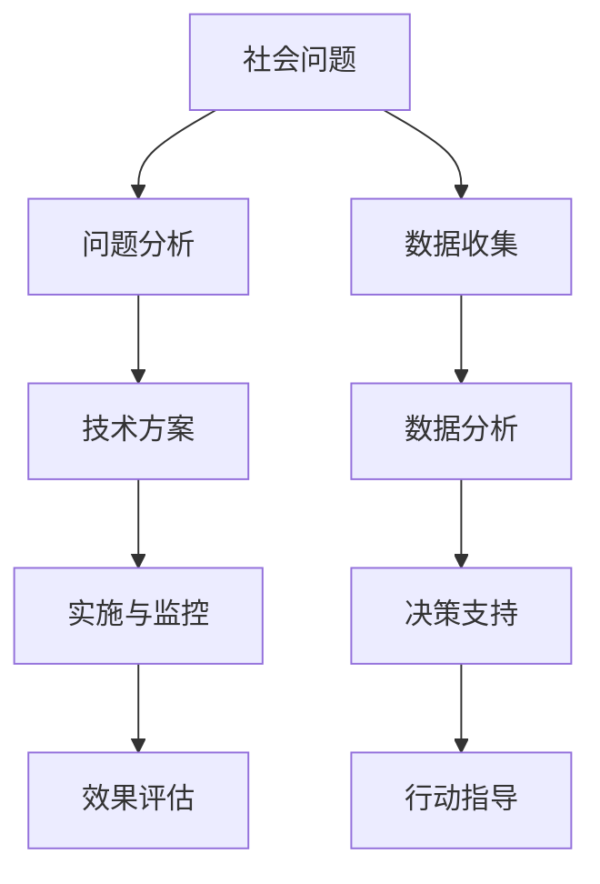

                 

在当今社会，科技发展日新月异，不仅在改变着我们的生活方式，也在深刻地影响着社会问题的解决。本文将探讨如何运用科技力量，实现科技向善，解决社会中的各种问题。

## 1. 背景介绍

科技的快速发展给我们带来了前所未有的便利，但同时也带来了一系列社会问题。例如，随着数字化进程的加速，网络安全问题日益突出，个人信息泄露、网络诈骗等问题频发。此外，气候变化、资源短缺等全球性问题也对人类社会提出了严峻挑战。面对这些问题，仅仅依靠传统的方法往往难以解决，科技成为了解决这些问题的关键。

### 关键词：科技、社会问题、数字化、网络安全、气候变化、资源短缺

## 2. 核心概念与联系

要解决社会问题，首先需要理解问题的本质和相关的核心概念。以下是一个关于社会问题解决的 Mermaid 流程图：



### 2.1. 问题分析

问题分析是解决社会问题的第一步，需要全面了解问题的背景、原因和影响。这一过程通常涉及数据收集、数据分析等技术手段。

### 2.2. 技术方案

在问题分析的基础上，制定合适的技术方案至关重要。技术方案的选择需要考虑问题的性质、目标、资源等因素。

### 2.3. 实施与监控

技术方案制定后，实施与监控是确保方案有效性的关键。在这一过程中，需要对方案进行持续跟踪和评估，以便及时调整和优化。

### 2.4. 效果评估

效果评估是判断技术方案是否成功的重要环节。通过效果评估，可以了解技术方案的实际效果，为后续的改进提供依据。

### 2.5. 数据收集

数据收集是问题分析和效果评估的基础。通过数据收集，可以获取有关问题的详细信息和数据，为分析和评估提供支持。

### 2.6. 数据分析

数据分析是理解问题本质和制定技术方案的重要手段。通过数据分析，可以从大量数据中提取有价值的信息和模式。

### 2.7. 决策支持

决策支持是基于数据分析结果，为决策者提供科学依据的过程。通过决策支持，可以制定出更加有效的技术方案。

### 2.8. 行动指导

行动指导是将决策转化为具体行动的过程。通过行动指导，可以确保技术方案得到有效实施。

## 3. 核心算法原理 & 具体操作步骤

### 3.1. 算法原理概述

解决社会问题的核心算法通常涉及机器学习、数据挖掘、人工智能等技术。这些算法的基本原理是利用大量数据进行模式识别和预测，从而为问题解决提供支持。

### 3.2. 算法步骤详解

#### 3.2.1. 数据预处理

数据预处理是算法应用的第一步，主要包括数据清洗、数据集成、数据转换等步骤。通过数据预处理，可以确保数据的准确性和一致性。

#### 3.2.2. 特征提取

特征提取是从原始数据中提取具有代表性的特征，以简化数据并提高算法的性能。特征提取通常采用统计方法、机器学习方法等。

#### 3.2.3. 模型训练

模型训练是利用训练数据，通过优化算法找到最佳参数的过程。常见的训练算法包括线性回归、决策树、神经网络等。

#### 3.2.4. 模型评估

模型评估是评估模型性能的重要步骤，通常采用交叉验证、性能指标等方法。通过模型评估，可以判断模型是否满足预期性能。

#### 3.2.5. 预测与决策

在模型评估通过后，可以将其应用于实际问题，进行预测和决策。预测和决策的准确性对问题解决至关重要。

### 3.3. 算法优缺点

#### 优点：

- **高效性**：算法能够快速处理大量数据，提高问题解决的效率。
- **自动化**：算法可以自动进行模式识别和预测，减少人工干预。
- **泛化性**：算法能够从训练数据中提取普遍规律，具有较好的泛化能力。

#### 缺点：

- **数据依赖性**：算法的性能高度依赖于数据的质量和数量，数据缺失或不准确可能导致算法失效。
- **解释性差**：许多机器学习算法的黑箱特性使得其预测结果难以解释，不利于问题的理解。
- **计算资源消耗**：算法的训练和预测过程通常需要大量计算资源，可能增加成本。

### 3.4. 算法应用领域

核心算法在多个领域都有广泛的应用，如医疗健康、金融、环境保护、社会治理等。以下是一些具体的案例：

- **医疗健康**：利用机器学习算法分析医疗数据，预测疾病发展，提高诊断和治疗的准确性。
- **金融**：通过数据挖掘技术分析金融市场数据，进行风险控制和投资决策。
- **环境保护**：利用人工智能技术监测环境变化，预测环境问题，为环境保护提供支持。
- **社会治理**：通过大数据分析技术，了解社会问题，制定有效的政策。

## 4. 数学模型和公式 & 详细讲解 & 举例说明

### 4.1. 数学模型构建

解决社会问题的数学模型通常基于概率论、统计学、优化理论等。以下是一个简单的线性回归模型示例：

$$
y = \beta_0 + \beta_1 x + \epsilon
$$

其中，$y$ 是因变量，$x$ 是自变量，$\beta_0$ 和 $\beta_1$ 是模型参数，$\epsilon$ 是误差项。

### 4.2. 公式推导过程

线性回归模型的参数可以通过最小二乘法推导得出：

$$
\beta_1 = \frac{\sum (x_i - \bar{x})(y_i - \bar{y})}{\sum (x_i - \bar{x})^2}
$$

$$
\beta_0 = \bar{y} - \beta_1 \bar{x}
$$

其中，$\bar{x}$ 和 $\bar{y}$ 分别是自变量和因变量的均值。

### 4.3. 案例分析与讲解

假设我们有一个关于房价的数据集，想要建立一个线性回归模型来预测房价。以下是一个具体的分析过程：

1. 数据预处理：对数据进行清洗、去重和缺失值处理。
2. 特征提取：选择与房价相关的特征，如房屋面积、楼层等。
3. 模型训练：利用训练数据，通过最小二乘法计算模型参数。
4. 模型评估：利用测试数据，计算模型的预测误差，评估模型性能。
5. 预测与决策：利用模型进行房价预测，为购房决策提供支持。

## 5. 项目实践：代码实例和详细解释说明

### 5.1. 开发环境搭建

在Python环境中，我们可以使用scikit-learn库进行线性回归模型的构建和训练。以下是一个简单的安装和导入代码：

```python
!pip install scikit-learn
```

```python
from sklearn.linear_model import LinearRegression
```

### 5.2. 源代码详细实现

以下是一个完整的线性回归项目实现代码：

```python
import numpy as np
import pandas as pd
from sklearn.linear_model import LinearRegression
from sklearn.model_selection import train_test_split
from sklearn.metrics import mean_squared_error

# 读取数据
data = pd.read_csv('house_price_data.csv')

# 数据预处理
X = data[['house_area', 'floor_level']]
y = data['price']

# 数据划分
X_train, X_test, y_train, y_test = train_test_split(X, y, test_size=0.2, random_state=42)

# 模型训练
model = LinearRegression()
model.fit(X_train, y_train)

# 模型评估
y_pred = model.predict(X_test)
mse = mean_squared_error(y_test, y_pred)
print('MSE:', mse)

# 预测与决策
new_data = np.array([[150, 3]])
predicted_price = model.predict(new_data)
print('Predicted Price:', predicted_price)
```

### 5.3. 代码解读与分析

1. 导入所需库：numpy、pandas、scikit-learn等。
2. 读取数据：从CSV文件中读取房价数据。
3. 数据预处理：将数据分为特征和目标变量，进行数据划分。
4. 模型训练：使用LinearRegression类构建线性回归模型，并利用训练数据进行训练。
5. 模型评估：利用测试数据进行模型评估，计算均方误差（MSE）。
6. 预测与决策：利用训练好的模型进行房价预测，为新购房决策提供支持。

## 6. 实际应用场景

### 6.1. 医疗健康

利用机器学习算法分析医疗数据，可以预测疾病发展，提高诊断和治疗的准确性。例如，通过分析患者的病史、基因信息等数据，可以预测患者是否患有某种疾病，从而提前采取预防措施。

### 6.2. 金融

在金融领域，数据挖掘技术可以用于风险控制和投资决策。例如，通过分析股票市场的历史数据，可以预测股票价格的走势，为投资决策提供支持。

### 6.3. 环境保护

人工智能技术可以用于环境监测和预测。例如，通过分析空气质量数据，可以预测空气污染的发展趋势，为环境保护政策提供依据。

### 6.4. 社会治理

大数据分析技术可以用于社会治理，了解社会问题，制定有效的政策。例如，通过分析社会舆情数据，可以了解公众对某个问题的看法，为政府决策提供参考。

## 7. 工具和资源推荐

### 7.1. 学习资源推荐

- 《机器学习实战》：适合初学者，通过实际案例介绍机器学习算法。
- 《深度学习》：全面介绍了深度学习的基础知识和应用。
- 《Python数据科学手册》：介绍了Python在数据科学领域的应用，包括数据预处理、机器学习等。

### 7.2. 开发工具推荐

- Jupyter Notebook：适合数据分析和机器学习项目开发。
- PyCharm：适合Python开发，具有强大的代码编辑和调试功能。
- TensorFlow：适合深度学习项目开发，提供了丰富的API和工具。

### 7.3. 相关论文推荐

- "Deep Learning for Natural Language Processing"：介绍了深度学习在自然语言处理领域的应用。
- "Recurrent Neural Networks for Language Modeling"：介绍了循环神经网络在语言建模方面的应用。
- "Deep Learning for Computer Vision"：介绍了深度学习在计算机视觉领域的应用。

## 8. 总结：未来发展趋势与挑战

### 8.1. 研究成果总结

本文探讨了如何运用科技力量，实现科技向善，解决社会中的各种问题。通过核心算法原理、数学模型和实际应用场景的介绍，展示了科技在解决社会问题中的重要作用。

### 8.2. 未来发展趋势

未来，科技将继续在社会问题解决中发挥关键作用。人工智能、大数据、区块链等新兴技术将得到更广泛的应用，为解决社会问题提供更多可能性。

### 8.3. 面临的挑战

然而，科技发展也面临一些挑战，如数据隐私保护、算法透明性、公平性等。如何确保科技向善，解决这些问题，是未来需要重点关注的方向。

### 8.4. 研究展望

在未来，我们需要进一步研究如何将科技与人文、社会等学科相结合，实现科技与社会的深度融合，为构建美好社会提供支持。

## 9. 附录：常见问题与解答

### 9.1. 问题1：什么是机器学习？

机器学习是一种人工智能的分支，通过算法让计算机从数据中学习，做出预测或决策。

### 9.2. 问题2：如何保证算法的公平性？

要保证算法的公平性，可以从数据收集、算法设计、算法评估等方面入手，尽量避免偏见和歧视。

### 9.3. 问题3：如何处理大规模数据？

处理大规模数据通常需要分布式计算、并行计算等技术。可以使用Hadoop、Spark等大数据处理框架进行数据处理。

### 9.4. 问题4：如何保证数据隐私？

要保证数据隐私，可以从数据加密、匿名化、数据访问控制等方面入手，确保数据在传输和处理过程中的安全性。

### 9.5. 问题5：如何应对网络安全威胁？

要应对网络安全威胁，可以从网络防护、数据备份、安全审计等方面入手，确保网络系统的安全稳定运行。

## 作者署名

本文由禅与计算机程序设计艺术 / Zen and the Art of Computer Programming 撰写。

----------------------------------------------------------------

现在，我们已经完成了一篇完整的文章。希望这篇文章能帮助读者更好地理解如何运用科技力量解决社会问题，实现科技向善。在未来，让我们共同努力，用科技为人类社会创造更多价值。

