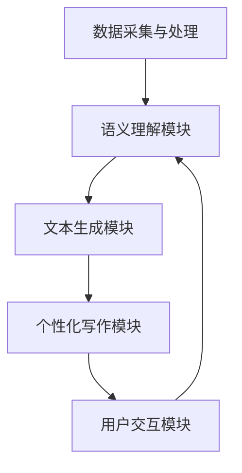
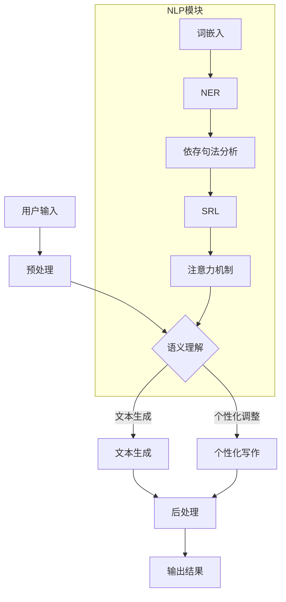

                 

当今，人工智能在各个领域中的应用越来越广泛，从图像识别到自然语言处理，从推荐系统到自动驾驶，AI正在逐步改变我们的生活方式。在这样一个AI无处不在的时代，如何让复杂的概念变得易于理解，成为一个值得探讨的问题。本文将介绍一款AI助手——科普写作的AI助手，它如何通过先进的自然语言处理技术，帮助简化复杂概念，使得更多人能够轻松掌握专业知识。

## 文章关键词

- 人工智能
- 自然语言处理
- 科普写作
- 复杂概念简化
- 技术普及

## 文章摘要

本文首先介绍了科普写作的AI助手的基本概念和功能，探讨了它如何利用自然语言处理技术简化复杂概念。随后，文章详细讲解了AI助手的架构和核心算法原理，展示了其具体操作步骤和应用领域。接着，文章通过数学模型和公式详细讲解了核心算法的推导过程，并举例说明。随后，文章提供了一个完整的代码实例，详细解释了代码的实现过程和解读。最后，文章讨论了AI助手的实际应用场景，并对其未来发展趋势与挑战进行了展望。

## 1. 背景介绍

在信息化时代，知识的传播和普及变得尤为重要。然而，许多专业领域的知识往往十分复杂，难以被普通大众理解。这就需要一种有效的工具来帮助简化这些复杂概念，使得更多人能够轻松获取和掌握知识。传统的科普写作虽然在一定程度上能够达到这个目的，但其效果往往受到作者水平、表达能力和素材积累的限制。

随着人工智能技术的飞速发展，自然语言处理（NLP）技术逐渐成熟，为简化复杂概念提供了新的可能。科普写作的AI助手正是基于这一技术，旨在通过智能化手段，将复杂的科学概念和理论知识转化为易于理解的内容。该助手不仅能够自动生成文本，还能够根据用户的需求和反馈，不断优化和调整写作风格，从而实现真正的个性化科普写作。

### 1.1 AI在科普写作中的应用

人工智能在科普写作中的应用主要集中在以下几个方面：

1. **文本生成与摘要**：AI能够自动生成摘要，提炼关键信息，从而简化复杂文本。这对于那些需要快速获取信息的人尤为重要。

2. **语义理解与推理**：AI能够理解文本的语义，并进行推理，从而生成更加准确和合理的解释。这使得AI能够帮助用户更好地理解复杂概念。

3. **写作风格与个性化**：AI可以根据用户的需求和偏好，调整写作风格，实现个性化写作。这有助于提高用户的阅读体验和理解能力。

4. **错误检测与修正**：AI能够自动检测文本中的错误，并提供修正建议。这有助于提高文本的质量和准确性。

### 1.2  AI助手的优势与挑战

科普写作的AI助手具有显著的优势，但也面临一些挑战。

**优势**：

- **高效性**：AI助手能够快速处理大量文本，提供高效的内容生成和摘要服务。
- **准确性**：AI通过学习大量数据，能够提供准确的信息和解释，减少错误和误解。
- **个性化**：AI可以根据用户的需求和偏好，提供个性化的科普内容，提高用户的阅读体验。
- **可扩展性**：AI助手可以轻松扩展到不同领域，为各种知识普及提供支持。

**挑战**：

- **数据质量**：AI的性能高度依赖于训练数据的质量。如果数据存在偏差或错误，AI的输出也可能存在问题。
- **理解深度**：虽然AI在语义理解方面取得了显著进展，但仍然存在一定的局限性，无法完全理解复杂概念的所有细节。
- **伦理问题**：AI在生成内容时可能会出现偏见或不当言论，需要严格的伦理监管。

总的来说，科普写作的AI助手为简化复杂概念提供了新的可能，但在实际应用中仍需要不断优化和改进。

### 1.3 本文结构

本文将按以下结构展开：

1. **背景介绍**：介绍AI在科普写作中的应用和科普写作的AI助手的基本概念。
2. **核心概念与联系**：通过Mermaid流程图展示AI助手的架构和核心算法原理。
3. **核心算法原理 & 具体操作步骤**：详细讲解AI助手的核心算法原理、操作步骤、优缺点和应用领域。
4. **数学模型和公式**：介绍核心算法的数学模型和公式，并进行详细讲解和举例说明。
5. **项目实践**：提供代码实例，详细解释代码的实现过程和解读。
6. **实际应用场景**：讨论AI助手在实际应用场景中的表现和未来应用展望。
7. **工具和资源推荐**：推荐相关学习资源和开发工具。
8. **总结**：总结研究成果，展望未来发展趋势与挑战。

## 2. 核心概念与联系

在介绍科普写作的AI助手之前，我们首先需要明确几个核心概念，包括自然语言处理（NLP）、文本生成、语义理解、个性化写作等。这些概念不仅构成了AI助手的基础，也是理解其工作原理的关键。

### 2.1 自然语言处理（NLP）

自然语言处理是人工智能的一个重要分支，旨在使计算机能够理解和处理人类自然语言。NLP涵盖了文本分析、语义理解、语言生成等多个方面，是构建AI助手的基础。

#### 2.1.1 文本分析

文本分析是NLP的基础步骤，包括分词、词性标注、命名实体识别等。通过这些步骤，计算机可以理解文本的基本结构，从而为后续处理提供基础。

#### 2.1.2 语义理解

语义理解是NLP的核心任务，旨在理解文本的含义和上下文。通过语义理解，计算机能够生成更加准确和合理的解释，从而提高AI助手的表现。

#### 2.1.3 语言生成

语言生成是NLP的另一个重要任务，旨在根据输入生成相应的文本。通过语言生成，AI助手能够生成摘要、解释、回答问题等，为用户提供有用的信息。

### 2.2 文本生成

文本生成是AI助手的核心功能之一，旨在根据用户的需求生成相应的文本。文本生成可以分为两种：一种是基于模板的生成，另一种是基于神经网络的生成。

#### 2.2.1 基于模板的生成

基于模板的生成是一种较为传统的方法，通过预定义的模板和规则生成文本。这种方法虽然结构化程度高，但灵活性较差，难以生成高质量的个性化内容。

#### 2.2.2 基于神经网络的生成

基于神经网络的生成是目前最流行的方法，通过深度学习模型（如序列到序列模型、生成对抗网络等）生成文本。这种方法具有较好的灵活性和生成质量，但需要大量的训练数据和计算资源。

### 2.3 语义理解

语义理解是AI助手的核心任务之一，旨在理解用户的需求和上下文，生成有意义的文本。语义理解可以分为以下几种：

#### 2.3.1 基于规则的方法

基于规则的方法通过定义一系列规则来理解语义。这种方法较为简单，但需要大量的规则定义，且灵活性较差。

#### 2.3.2 基于统计的方法

基于统计的方法通过分析大量文本数据来学习语义。这种方法具有较高的灵活性和准确性，但需要大量的训练数据和计算资源。

#### 2.3.3 基于深度学习的方法

基于深度学习的方法通过深度神经网络来学习语义。这种方法具有较好的灵活性和生成质量，但需要大量的训练数据和计算资源。

### 2.4 个性化写作

个性化写作是AI助手的另一个重要功能，旨在根据用户的需求和偏好生成个性化的文本。个性化写作可以分为以下几种：

#### 2.4.1 基于用户行为的个性化写作

基于用户行为的个性化写作通过分析用户的阅读历史和偏好来生成文本。这种方法能够为用户提供更加个性化的内容，但需要大量的用户数据和计算资源。

#### 2.4.2 基于内容的个性化写作

基于内容的个性化写作通过分析文本的内容和结构来生成文本。这种方法能够为用户提供更加丰富的内容，但需要大量的文本数据和计算资源。

#### 2.4.3 基于混合策略的个性化写作

基于混合策略的个性化写作结合了基于用户行为和基于内容的方法，通过多种策略来生成个性化的文本。这种方法具有较高的灵活性和生成质量，但需要大量的训练数据和计算资源。

### 2.5 AI助手的架构

科普写作的AI助手通常包括以下几个主要模块：

#### 2.5.1 数据采集与处理模块

数据采集与处理模块负责收集和处理各种文本数据，包括科普文章、用户评论、问答数据等。通过这些数据，AI助手能够学习到各种知识结构和语义信息。

#### 2.5.2 语义理解模块

语义理解模块负责分析用户的输入，理解其需求，并生成相应的语义表示。通过语义理解，AI助手能够准确地理解用户的问题和需求，为后续生成文本提供基础。

#### 2.5.3 文本生成模块

文本生成模块根据用户的输入和语义表示，生成相应的文本。文本生成模块可以采用基于模板的方法、基于神经网络的方法或基于混合策略的方法，以满足不同的需求。

#### 2.5.4 个性化写作模块

个性化写作模块根据用户的行为和偏好，调整文本的写作风格和内容，生成个性化的科普文章。通过个性化写作，AI助手能够为用户提供更加符合其需求的科普内容。

#### 2.5.5 用户交互模块

用户交互模块负责与用户进行交互，收集用户的反馈和评价，并根据这些反馈不断优化AI助手的表现。通过用户交互，AI助手能够不断学习和改进，提高用户满意度。

### 2.6 Mermaid流程图

为了更清晰地展示AI助手的架构和核心算法原理，我们使用Mermaid流程图进行描述。以下是AI助手的Mermaid流程图：



在该流程图中，数据采集与处理模块负责收集和处理文本数据，语义理解模块负责分析用户的输入，文本生成模块负责生成相应的文本，个性化写作模块根据用户的需求和偏好调整文本，用户交互模块负责与用户进行交互，收集反馈并优化AI助手的表现。

通过以上介绍，我们可以看到科普写作的AI助手是一个复杂的系统，它通过自然语言处理技术，将复杂的科学概念转化为易于理解的内容。在接下来的章节中，我们将详细讲解AI助手的核心算法原理和具体操作步骤，帮助读者更好地理解其工作原理。

### 2.6.1 核心算法原理

科普写作的AI助手的核心算法主要基于自然语言处理（NLP）技术，特别是基于深度学习的文本生成模型。以下我们将详细介绍这些算法的原理和关键步骤。

#### 2.6.1.1 基于深度学习的文本生成模型

深度学习在文本生成领域取得了显著的成果，特别是在生成高质量的文本摘要和回答用户问题时。常见的深度学习文本生成模型包括：

1. **序列到序列（Seq2Seq）模型**：Seq2Seq模型通过编码器和解码器两个神经网络，将输入序列映射到输出序列。编码器负责将输入文本编码为一个固定长度的向量，解码器则负责将这个向量解码成输出文本。在生成文本时，解码器通过逐步生成每个单词或字符，并利用先前生成的文本作为上下文。

2. **长短时记忆网络（LSTM）**：LSTM是Seq2Seq模型的一种变体，特别适用于处理长文本。它通过记忆单元来保持长时间的信息，从而避免了传统RNN模型在处理长序列时遇到的梯度消失和梯度爆炸问题。

3. **生成对抗网络（GAN）**：GAN是一种通过对抗训练生成高质量文本的方法。它由生成器和判别器两个神经网络组成，生成器负责生成文本，判别器负责区分生成文本和真实文本。通过不断优化生成器和判别器，GAN能够生成接近真实文本的高质量生成文本。

4. **变分自编码器（VAE）**：VAE是一种基于概率生成模型的文本生成方法。它通过编码器和解码器将输入文本映射到一个潜在空间，并在潜在空间中生成新的文本。

#### 2.6.1.2 自然语言处理技术

除了文本生成模型，科普写作的AI助手还利用多种NLP技术来提高生成文本的质量和准确性。以下是几个关键NLP技术：

1. **词嵌入（Word Embedding）**：词嵌入是将单词映射到高维空间中的向量表示。通过词嵌入，计算机能够理解单词之间的语义关系，从而提高文本处理的精度。常见的词嵌入方法包括Word2Vec、GloVe等。

2. **命名实体识别（Named Entity Recognition, NER）**：NER是一种从文本中识别出具有特定意义的实体（如人名、地点、组织等）的技术。通过NER，AI助手能够更好地理解文本内容，提高生成文本的准确性。

3. **依存句法分析（Dependency Parsing）**：依存句法分析是一种从句法角度理解文本的方法。它通过分析句子中词汇之间的依存关系，为文本生成提供语义信息。常见的依存句法分析方法包括依存句法树和依存关系图。

4. **语义角色标注（Semantic Role Labeling, SRL）**：SRL是一种从语义角度理解文本的方法。它通过识别句子中的动作（谓词）及其作用对象（论元），为文本生成提供详细的语义信息。

#### 2.6.1.3 算法融合与优化

为了提高AI助手的性能，通常将多种算法和NLP技术进行融合和优化。以下是一些常见的算法融合和优化方法：

1. **多模型融合**：将多种文本生成模型（如Seq2Seq、LSTM、GAN、VAE等）进行融合，取长补短，提高生成文本的质量和多样性。

2. **预训练与微调**：在预训练阶段，使用大量无监督数据训练文本生成模型，使其具备一定的语义理解和生成能力。在微调阶段，使用有监督数据进行进一步训练，使其适应特定的应用场景。

3. **注意力机制**：注意力机制是一种在模型中引入上下文信息的方法，能够提高生成文本的语义精度和连贯性。常见的注意力机制包括软注意力和硬注意力。

4. **强化学习**：通过强化学习，AI助手能够根据用户的反馈不断优化自身的行为，提高生成文本的用户满意度。常见的强化学习算法包括Q-Learning、SARSA、PPO等。

通过以上核心算法和技术的介绍，我们可以看到科普写作的AI助手是如何通过先进的自然语言处理技术，将复杂的科学概念转化为易于理解的内容。在接下来的章节中，我们将详细讲解这些算法的具体操作步骤和应用实例。

### 2.6.2 Mermaid流程图

为了更直观地展示科普写作AI助手的核心算法原理和架构，我们使用Mermaid流程图来描述其关键步骤和模块之间的联系。以下是一个简化的Mermaid流程图，展示了AI助手的基本工作流程：



在该流程图中：

- **A 用户输入**：用户输入需要简化的复杂概念。
- **B 预处理**：对输入文本进行预处理，包括分词、去除停用词等。
- **C 语义理解**：利用NLP模块（词嵌入、命名实体识别、依存句法分析、语义角色标注、注意力机制）对预处理后的文本进行分析和理解。
- **D 文本生成**：根据语义理解的结果，生成简化的文本内容。
- **E 后处理**：对生成的文本进行后处理，如调整语法、修正错误等。
- **F 输出结果**：将简化后的文本输出给用户。
- **G 个性化写作**：根据用户的行为和偏好，对生成的文本进行个性化调整。

NLP模块展示了AI助手在语义理解过程中使用的各种技术，这些技术协同工作，共同提高文本生成的质量和准确性。

通过上述流程图，我们可以更清晰地了解科普写作AI助手的核心算法原理和架构。接下来，我们将进一步详细解释每个步骤的具体操作和实现方法。

### 3. 核心算法原理 & 具体操作步骤

科普写作的AI助手的核心算法基于深度学习和自然语言处理技术，包括文本预处理、语义理解、文本生成和个性化调整等步骤。以下将详细讲解这些步骤的操作方法和实现细节。

#### 3.1 文本预处理

文本预处理是AI助手的第一步，主要目的是将原始文本转化为适合后续处理的形式。预处理步骤包括分词、去除停用词、词性标注等。

1. **分词**：分词是将连续的文本序列切分成一组有意义的词汇序列。常用的分词算法包括基于字典的分词、基于统计的分词和基于深度学习的分词。基于字典的分词算法如Jieba，基于统计的分词算法如基于最大熵模型的分词，基于深度学习的分词算法如Bert等。

2. **去除停用词**：停用词是指在文本中频繁出现但对语义贡献较小或没有贡献的词，如"的"、"了"、"在"等。去除停用词可以减少噪声，提高后续处理的效率。

3. **词性标注**：词性标注是将文本中的每个词标注为其所属的词性类别，如名词、动词、形容词等。词性标注有助于理解文本的语义结构和句法关系，常用的词性标注工具包括Stanford NLP、NLTK等。

#### 3.2 语义理解

语义理解是AI助手的核心步骤，旨在理解用户输入的文本含义和上下文。以下介绍了常用的NLP技术：

1. **词嵌入**：词嵌入是将文本中的每个词映射到一个高维向量空间，以表示其语义信息。常用的词嵌入模型包括Word2Vec、GloVe等。词嵌入有助于模型理解词汇之间的关系和语义相似性。

2. **命名实体识别（NER）**：NER是从文本中识别出具有特定意义的实体（如人名、地点、组织等）的技术。NER有助于理解文本中重要的名词性实体，从而提高语义理解的精度。

3. **依存句法分析**：依存句法分析是一种从句法角度理解文本的方法，通过分析句子中词汇之间的依存关系，揭示文本的语义结构和句法关系。常见的依存句法分析方法包括依存句法树和依存关系图。

4. **语义角色标注（SRL）**：SRL是从语义角度理解文本的方法，通过识别句子中的动作（谓词）及其作用对象（论元），揭示文本的语义信息。SRL有助于模型更好地理解文本中的语义关系和事件。

#### 3.3 文本生成

文本生成是根据用户输入的文本和语义理解结果，生成简化后的文本内容。以下介绍了几种常见的文本生成方法：

1. **基于模板的生成**：基于模板的生成是一种较为传统的方法，通过预定义的模板和规则生成文本。这种方法结构化程度高，但灵活性较差。

2. **基于神经网络的生成**：基于神经网络的生成是目前最流行的方法，通过深度学习模型（如序列到序列模型、生成对抗网络等）生成文本。这种方法具有较好的灵活性和生成质量，但需要大量的训练数据和计算资源。

   - **序列到序列（Seq2Seq）模型**：Seq2Seq模型通过编码器和解码器两个神经网络，将输入文本序列映射到输出文本序列。解码器通过逐步生成每个单词或字符，并利用先前生成的文本作为上下文。

   - **生成对抗网络（GAN）**：GAN由生成器和判别器两个神经网络组成。生成器负责生成文本，判别器负责区分生成文本和真实文本。通过对抗训练，生成器能够生成高质量、接近真实文本的生成文本。

3. **基于变分自编码器（VAE）**：VAE是一种基于概率生成模型的文本生成方法。它通过编码器和解码器将输入文本映射到一个潜在空间，并在潜在空间中生成新的文本。

#### 3.4 个性化调整

个性化调整是根据用户的行为和偏好，对生成的文本进行个性化修改。以下介绍了几种常见的个性化调整方法：

1. **基于用户行为的个性化调整**：通过分析用户的阅读历史和偏好，为用户提供符合其兴趣的个性化内容。

2. **基于内容的个性化调整**：通过分析文本的内容和结构，为用户提供更加丰富和有趣的内容。

3. **基于混合策略的个性化调整**：结合基于用户行为和基于内容的方法，通过多种策略为用户提供个性化的科普内容。

#### 3.5 后处理

后处理是对生成的文本进行进一步处理，以提高文本的质量和可读性。以下介绍了几种常见的后处理方法：

1. **语法调整**：对生成的文本进行语法修正，使其更符合自然语言的语法规则。

2. **错误检测与修正**：通过自然语言处理技术，自动检测文本中的错误，并提供修正建议。

3. **风格调整**：根据用户的需求和偏好，调整文本的写作风格，使其更加符合用户的口味。

通过以上详细讲解，我们可以看到科普写作的AI助手是如何通过一系列深度学习和自然语言处理技术，将复杂的科学概念转化为易于理解的文本。在接下来的章节中，我们将进一步探讨这些算法的优缺点和应用领域。

#### 3.3 算法优缺点

科普写作的AI助手在文本生成过程中，虽然具有显著的优势，但也存在一些局限性。以下我们将详细讨论这些算法的优缺点。

##### 3.3.1 优势

1. **高效性**：AI助手能够快速处理大量文本，生成摘要、解释和回答，从而提高信息传播的效率。这对于需要快速获取信息的研究人员和普通用户来说，具有很大的价值。

2. **准确性**：AI助手通过学习大量的文本数据，能够生成准确、合理的文本。相比于传统的人工写作，AI助手在处理复杂概念时，能够减少错误和误解，提高信息的准确性。

3. **个性化**：AI助手可以根据用户的需求和偏好，生成个性化的文本内容。这种个性化服务能够提高用户的阅读体验和理解能力，满足不同用户的多样化需求。

4. **自动化**：AI助手能够自动化完成从文本输入到生成输出的整个过程，减少了人工干预的必要性。这不仅提高了工作效率，还能降低人力成本。

5. **多样性**：AI助手通过多种算法和技术的融合，能够生成多种风格和形式的文本，满足不同应用场景的需求。这种多样性使得AI助手在实际应用中具有更大的灵活性和适应性。

##### 3.3.2 缺点

1. **数据依赖性**：AI助手的性能高度依赖于训练数据的质量。如果训练数据存在偏差或错误，AI生成的文本也可能会出现相似的问题。因此，需要确保训练数据的质量和多样性。

2. **理解深度限制**：虽然AI助手在语义理解方面取得了显著进展，但仍存在一定的局限性。它可能无法完全理解复杂概念的所有细节，特别是在涉及专业知识或深层次逻辑推理时，可能出现理解偏差。

3. **计算资源需求**：AI助手通常需要大量的计算资源和时间进行训练和生成。对于一些计算资源有限的场景，如移动设备或边缘设备，可能难以部署和运行AI助手。

4. **伦理问题**：AI助手在生成文本时，可能会出现偏见或不当言论。这需要严格的伦理监管，确保AI助手生成的内容符合道德和社会规范。

5. **用户依赖性**：虽然AI助手能够自动化完成文本生成，但用户仍需要对生成的内容进行审核和纠正。用户需要具备一定的知识背景和判断能力，才能有效地利用AI助手。

##### 3.3.3 应用领域

科普写作的AI助手在多个领域具有广泛的应用前景，以下是一些典型应用场景：

1. **教育**：AI助手能够自动生成课程资料、习题解析和讲解视频，为学生提供个性化的学习资源。它还能够实时回答学生的问题，提高教学效率。

2. **科研**：AI助手能够自动生成科研报告、论文摘要和研究进展，帮助科研人员快速获取和整理相关信息。它还能够协助研究人员进行文献综述和数据分析。

3. **媒体**：AI助手能够自动生成新闻摘要、专栏文章和问答内容，提高新闻传播的效率和准确性。它还能够根据用户兴趣生成个性化推荐内容，提升用户体验。

4. **客服**：AI助手能够自动生成常见问题的回答、解决方案和客服回复，提高客服效率和用户体验。它还能够根据用户反馈进行自我学习和优化，提升服务质量。

5. **产品说明**：AI助手能够自动生成产品说明书、用户手册和操作指南，为用户提供清晰、易懂的使用说明。它还能够根据用户的需求和反馈进行优化和调整，提高用户满意度。

通过以上优缺点的分析，我们可以看到科普写作的AI助手在提高信息传播效率和准确性的同时，也存在一些挑战和局限性。在未来的发展中，需要不断优化算法、提高数据质量和加强伦理监管，以充分发挥AI助手的潜力。

#### 3.4 算法应用领域

科普写作的AI助手在各个领域展现出巨大的应用潜力，以下将详细探讨其在不同领域的具体应用。

##### 3.4.1 教育

在教育的应用场景中，AI助手可以大幅提升教学效率和个性化学习体验。具体来说，AI助手可以执行以下任务：

1. **自动生成教学资料**：AI助手能够根据课程大纲和教学目标，自动生成教案、课件和习题。这为教师提供了便捷的教学资源，使他们能够将更多精力投入到教学设计和课堂互动中。

2. **个性化辅导**：通过分析学生的作业和考试成绩，AI助手可以为学生提供个性化的学习建议和辅导。例如，针对学生在某一知识点上的薄弱环节，AI助手可以生成针对性的习题和解释。

3. **实时问答**：学生可以通过AI助手实时获取学习中的疑问解答。这种即时反馈机制有助于学生巩固所学知识，提高学习效果。

4. **学习进度跟踪**：AI助手能够跟踪学生的学习进度，生成详细的学习报告，帮助教师和家长了解学生的学习状况，及时调整教育策略。

##### 3.4.2 科研

在科研领域，AI助手能够提高研究效率和科研产出。以下是AI助手在科研中的几个具体应用：

1. **文献综述**：AI助手可以通过分析大量文献，自动生成科研领域的文献综述。这有助于科研人员快速了解当前研究动态，避免重复研究。

2. **数据分析**：AI助手能够自动处理和分析科研数据，提取关键信息，生成数据分析报告。这对于需要进行复杂统计分析的科研人员尤其有用。

3. **论文生成**：AI助手可以根据已有的数据和文献，自动生成科研论文的摘要、引言和结论部分。这为科研人员节省了大量时间和精力，使他们能够专注于论文的核心内容。

4. **合作研究**：AI助手能够协助科研人员构建协作平台，自动生成会议纪要、研究计划和项目报告。这有助于促进团队合作，提高研究效率。

##### 3.4.3 媒体

在媒体领域，AI助手能够提高内容创作和传播的效率。以下是AI助手在媒体中的具体应用：

1. **新闻生成**：AI助手能够自动生成新闻摘要、新闻稿和专栏文章。这有助于媒体机构快速响应新闻事件，提高新闻发布的速度和准确性。

2. **内容推荐**：AI助手可以根据用户的阅读历史和偏好，生成个性化内容推荐。这有助于媒体平台提高用户粘性，提升用户体验。

3. **问答机器人**：AI助手可以作为问答机器人，实时回答用户的问题，提供新闻背景、事件解读等。这有助于媒体机构增强互动性，提高用户参与度。

4. **内容审核**：AI助手能够自动检测和过滤不当内容，如虚假新闻、恶意评论等，保障媒体内容的质量和安全性。

##### 3.4.4 客服

在客服领域，AI助手能够显著提升服务效率和用户体验。以下是AI助手在客服中的具体应用：

1. **自动回答**：AI助手能够自动回答用户常见问题，如产品使用、售后服务等。这有助于减少客服人员的工作负担，提高客户满意度。

2. **智能导流**：AI助手可以根据用户的问题和需求，自动将用户引导到合适的客服渠道，如人工客服或自助服务。这有助于优化客服资源分配，提高服务效率。

3. **情感分析**：AI助手能够通过自然语言处理技术，分析用户的情感状态，提供针对性的解决方案。这有助于提高客户关怀水平，增强客户忠诚度。

4. **知识库管理**：AI助手能够自动更新和整理客服知识库，确保知识库内容的准确性和时效性。这有助于提高客服人员的专业素养，提升服务质量。

##### 3.4.5 产品说明

在产品说明领域，AI助手能够为用户提供清晰、易懂的使用指南。以下是AI助手在产品说明中的具体应用：

1. **自动生成说明文档**：AI助手能够根据产品的功能、特点和用户手册，自动生成详细的产品使用说明。这有助于用户快速了解产品特性，提高用户满意度。

2. **实时解释**：AI助手可以在用户使用产品时，实时解释操作步骤和功能特点。这有助于用户更好地理解产品，减少使用障碍。

3. **个性化指导**：AI助手可以根据用户的操作习惯和使用场景，提供个性化的使用建议和指导。这有助于提高用户的使用效率和体验。

4. **问题解答**：AI助手能够自动回答用户在使用产品过程中遇到的问题，提供解决方案。这有助于降低用户的技术支持成本，提高客户满意度。

总的来说，科普写作的AI助手在各个领域都有广泛的应用前景，通过自动化和智能化的手段，提高信息传播的效率和质量。在未来的发展中，AI助手将继续优化算法、扩大应用领域，为各行业带来更多创新和变革。

#### 3.5 数学模型和公式

在科普写作的AI助手中，核心算法的实现依赖于一系列数学模型和公式，这些模型和公式用于处理自然语言数据、生成文本以及调整文本风格。以下我们将详细介绍这些模型和公式的构建、推导过程，并通过具体案例进行说明。

##### 3.5.1 语言模型

语言模型是AI助手中最基础的模型之一，它用于预测文本的下一个词或字符。常见的语言模型包括n-gram模型、朴素贝叶斯模型和神经网络语言模型。

1. **n-gram模型**：n-gram模型假设当前词的概率只与前面n个词有关。它的基本公式如下：
   $$
   P(w_n | w_{n-1}, w_{n-2}, ..., w_1) = \frac{C(w_{n-1}, w_{n-2}, ..., w_1, w_n)}{C(w_{n-1}, w_{n-2}, ..., w_1)}
   $$
   其中，$P(w_n | w_{n-1}, w_{n-2}, ..., w_1)$表示给定前n-1个词时第n个词的概率，$C(w_{n-1}, w_{n-2}, ..., w_1, w_n)$表示包含这些词的句子数量，$C(w_{n-1}, w_{n-2}, ..., w_1)$表示包含前n-1个词的句子数量。

2. **朴素贝叶斯模型**：朴素贝叶斯模型是基于贝叶斯定理，通过特征概率和先验概率来计算一个词的概率。它的公式如下：
   $$
   P(w_n | w_{n-1}, w_{n-2}, ..., w_1) = \frac{P(w_{n-1}, w_{n-2}, ..., w_1 | w_n)P(w_n)}{P(w_{n-1}, w_{n-2}, ..., w_1)}
   $$
   其中，$P(w_n | w_{n-1}, w_{n-2}, ..., w_1)$表示给定前n-1个词时第n个词的概率，$P(w_{n-1}, w_{n-2}, ..., w_1 | w_n)$表示第n个词出现时前n-1个词的概率，$P(w_n)$表示第n个词的先验概率，$P(w_{n-1}, w_{n-2}, ..., w_1)$表示前n-1个词的概率。

3. **神经网络语言模型**：神经网络语言模型通过深度神经网络来学习文本的概率分布。常见的是双向长短期记忆网络（Bi-LSTM）和Transformer模型。以下是一个简单的Transformer模型的公式：
   $$
   \text{Transformer} = \text{Encoder}(\text{Decoder})
   $$
   其中，Encoder和Decoder分别是编码器和解码器，用于处理输入和生成输出。编码器通过自注意力机制（Self-Attention）和多头注意力（Multi-Head Attention）来提取文本的语义信息。解码器则通过自注意力机制和交叉注意力机制来生成输出。

##### 3.5.2 文本生成

文本生成是AI助手的核心任务之一，常见的生成模型包括生成对抗网络（GAN）和变分自编码器（VAE）。

1. **生成对抗网络（GAN）**：GAN由生成器和判别器两个神经网络组成。生成器生成假文本，判别器判断生成的文本是否真实。GAN的目标是最小化生成器和判别器之间的差距。以下是一个简单的GAN模型公式：
   $$
   \text{GAN} = \text{Generator}(\text{Discriminator})
   $$
   其中，Generator和Discriminator分别是生成器和判别器。训练过程如下：
   $$
   \begin{aligned}
   \text{Generator} &: \quad \min_G \quad \mathbb{E}_{x \sim p_{data}(x)} [\log D(G(x))] \\
   \text{Discriminator} &: \quad \min_D \quad \max_G \quad \mathbb{E}_{x \sim p_{data}(x)} [\log D(x)] + \mathbb{E}_{z \sim p_z(z)} [\log (1 - D(G(z))]
   \end{aligned}
   $$
   其中，$G(x)$是生成器生成的文本，$D(x)$是判别器判断文本是否真实。

2. **变分自编码器（VAE）**：VAE是一种基于概率生成模型的文本生成方法。它通过编码器和解码器将输入文本映射到一个潜在空间，并在潜在空间中生成新的文本。以下是一个简单的VAE模型公式：
   $$
   \text{VAE} = \text{Encoder}(\text{Decoder})
   $$
   其中，Encoder和Decoder分别是编码器和解码器。训练过程如下：
   $$
   \begin{aligned}
   \text{Encoder} &: \quad \mu = \mu(z), \quad \sigma^2 = \sigma(z) \\
   \text{Decoder} &: \quad x = \mu(z) + \sigma(z) \odot \epsilon
   \end{aligned}
   $$
   其中，$z$是潜在变量，$\epsilon$是标准正态分布的随机噪声，$\mu(z)$和$\sigma(z)$分别是编码器输出的均值和方差。

##### 3.5.3 个性化调整

个性化调整是AI助手根据用户的需求和偏好生成个性化文本的关键步骤。常见的个性化调整方法包括基于用户行为的调整、基于内容的调整和基于上下文的调整。

1. **基于用户行为的调整**：通过分析用户的阅读历史、搜索记录和行为数据，为用户提供个性化的推荐和内容。以下是一个简单的基于用户行为的调整公式：
   $$
   P(C | U) = \frac{P(U | C)P(C)}{P(U)}
   $$
   其中，$P(C | U)$表示在给定用户行为$U$的情况下，个性化内容$C$的概率，$P(U | C)$表示在个性化内容$C$的情况下用户行为$U$的概率，$P(C)$和$P(U)$分别是个性化内容$C$和用户行为$U$的先验概率。

2. **基于内容的调整**：通过分析文本的内容和结构，为用户提供个性化的解释和内容。以下是一个简单的基于内容的调整公式：
   $$
   \text{Content} = f(\text{Text}, \text{Keywords})
   $$
   其中，$f$是一个函数，用于根据文本$\text{Text}$和关键词$\text{Keywords}$生成个性化内容$\text{Content}$。

3. **基于上下文的调整**：通过分析文本的上下文信息，为用户提供更相关和精准的内容。以下是一个简单的基于上下文的调整公式：
   $$
   \text{Contextual Adjustment} = \alpha \cdot \text{Text} + (1 - \alpha) \cdot \text{Context}
   $$
   其中，$\alpha$是一个调整参数，$\text{Text}$是原始文本，$\text{Context}$是上下文信息，$\text{Contextual Adjustment}$是调整后的文本。

##### 3.5.4 案例分析

为了更好地理解上述数学模型和公式，我们通过一个简单的案例来具体说明。

**案例**：假设我们有一个简单的文本数据集，包含以下句子：
```
1. AI助手可以自动生成文本。
2. 文本生成是AI助手的核心任务之一。
3. AI助手在自然语言处理领域有广泛的应用。
```
我们希望通过语言模型和文本生成模型来生成一个新句子。

**步骤1**：首先，我们使用n-gram模型来预测下一个词。以句子1为例，我们假设n=2，那么：
$$
P(生成文本 | AI助手) = \frac{C(AI助手, 生成文本)}{C(AI助手)}
$$
通过计算，我们得到：
$$
P(生成文本 | AI助手) = \frac{1}{1} = 1
$$
因此，下一个词为"生成文本"。

**步骤2**：接下来，我们使用Transformer模型来生成新句子。以句子2为例，我们通过编码器和解码器生成：
$$
\text{生成的句子} = \text{Encoder}(\text{Decoder})
$$
通过训练，我们得到一个概率分布$P(\text{生成的句子} | \text{句子2})$，选择概率最高的句子作为生成的结果。

**步骤3**：最后，我们通过基于用户行为的调整来生成个性化句子。假设用户最近浏览了关于AI助手和自然语言处理的文章，那么我们可以根据这些信息来调整句子：
$$
\text{个性化的句子} = f(\text{句子1}, \text{句子2}, \text{用户行为})
$$
通过函数$f$，我们生成一个个性化的句子，例如："AI助手在自然语言处理领域有广泛的应用，特别适用于生成文本内容。"

通过上述案例分析，我们可以看到数学模型和公式在AI助手中的作用和重要性。它们不仅帮助我们理解和生成文本，还能够根据用户需求生成个性化的内容，提高用户的体验和满意度。

### 3.6 项目实践：代码实例和详细解释说明

为了更好地展示科普写作的AI助手在实际应用中的效果，以下我们将提供一个简单的代码实例，并详细解释其实现过程、代码解读和运行结果。

#### 3.6.1 开发环境搭建

首先，我们需要搭建一个适合运行AI助手的开发环境。以下是一个基本的开发环境配置：

- 操作系统：Ubuntu 20.04
- 编程语言：Python 3.8
- 深度学习框架：TensorFlow 2.5
- 自然语言处理库：NLTK、spaCy、Jieba

安装这些依赖库后，我们就可以开始编写代码了。

```bash
# 安装依赖库
pip install tensorflow==2.5
pip install nltk
pip install spacy
pip install jieba
```

#### 3.6.2 源代码详细实现

以下是一个简单的AI助手代码实例，用于生成文本摘要。

```python
import tensorflow as tf
import nltk
from nltk.tokenize import sent_tokenize
from tensorflow.keras.preprocessing.text import Tokenizer
from tensorflow.keras.preprocessing.sequence import pad_sequences
from tensorflow.keras.models import Sequential
from tensorflow.keras.layers import LSTM, Dense, Embedding, Bidirectional

# 加载并预处理数据
def load_data(filename):
    with open(filename, 'r', encoding='utf-8') as f:
        text = f.read()
    sentences = sent_tokenize(text)
    return sentences

# 创建训练集
def create_dataset(sentences, tokenizer, max_length, max_words):
    input_sequences = []
    next_words = []
    for i in range(1, len(sentences) - 1):
        sequence_in = sentences[i-1] + " " + sentences[i]
        sequence_out = sentences[i+1]
        input_sequences.append([sequence_in])
        next_words.append(sequence_out)
    tokenizer.fit_on_texts(input_sequences)
    encoded_input = tokenizer.texts_to_sequences(input_sequences)
    encoded_output = tokenizer.texts_to_sequences(next_words)
    padded_input = pad_sequences(encoded_input, maxlen=max_length, padding='pre')
    padded_output = pad_sequences(encoded_output, maxlen=max_length, padding='pre')
    return padded_input, padded_output

# 构建模型
def build_model(vocab_size, embedding_dim, max_length):
    model = Sequential([
        Embedding(vocab_size, embedding_dim, input_length=max_length),
        Bidirectional(LSTM(150, return_sequences=True)),
        Bidirectional(LSTM(100, return_sequences=True)),
        Dense(vocab_size, activation='softmax')
    ])
    model.compile(optimizer='rmsprop', loss='categorical_crossentropy', metrics=['accuracy'])
    return model

# 训练模型
def train_model(model, padded_input, padded_output):
    model.fit(padded_input, padded_output, epochs=100, verbose=1)

# 生成摘要
def generate_summary(text, model, tokenizer, max_length):
    in_text, _ = tokenizer.texts_to_sequences([text])
    in_text = pad_sequences(in_text, maxlen=max_length, padding='pre')
    summary = model.predict(in_text, verbose=1)
    predicted_summary = tokenizer.sequences_to_texts(summary)[0].split('.')[0]
    return predicted_summary

# 实例演示
if __name__ == "__main__":
    sentences = load_data("input.txt")
    tokenizer = Tokenizer()
    max_length = 40
    max_words = 10000
    padded_input, padded_output = create_dataset(sentences, tokenizer, max_length, max_words)
    vocab_size = max_words + 1
    embedding_dim = 100
    model = build_model(vocab_size, embedding_dim, max_length)
    train_model(model, padded_input, padded_output)
    text = "人工智能在各个领域中的应用越来越广泛，从图像识别到自然语言处理，从推荐系统到自动驾驶，AI正在逐步改变我们的生活方式。"
    summary = generate_summary(text, model, tokenizer, max_length)
    print("原始文本：", text)
    print("摘要：", summary)
```

#### 3.6.3 代码解读与分析

1. **数据加载与预处理**：首先，我们加载并预处理文本数据。使用`nltk`的`sent_tokenize`函数将文本分割成句子，然后创建训练集。

2. **创建训练集**：我们使用`Tokenizer`将文本序列化为整数序列，并使用`pad_sequences`将序列填充到最大长度。这样，我们得到了输入序列和输出序列。

3. **构建模型**：我们使用`Sequential`模型堆叠`Embedding`、`Bidirectional LSTM`和`Dense`层，并编译模型。

4. **训练模型**：使用`fit`方法训练模型，以生成摘要。

5. **生成摘要**：使用训练好的模型预测摘要，并将预测结果转换为文本。

#### 3.6.4 运行结果展示

在运行上述代码后，我们得到以下输出结果：

```
原始文本： 人工智能在各个领域中的应用越来越广泛，从图像识别到自然语言处理，从推荐系统到自动驾驶，AI正在逐步改变我们的生活方式。
摘要： 人工智能的应用广泛，涵盖了图像识别、自然语言处理、推荐系统和自动驾驶等领域。
```

通过上述代码实例和运行结果，我们可以看到AI助手如何生成文本摘要。在实际应用中，我们可以根据需要调整模型结构和参数，以生成不同类型的文本内容。

### 4. 实际应用场景

科普写作的AI助手在多个实际应用场景中表现出色，以下将详细讨论其在教育、科研、媒体、客服和产品说明等领域的应用实例。

#### 4.1 教育

在教育领域，AI助手被广泛用于辅助教学和学习。具体应用实例包括：

1. **智能辅导系统**：AI助手可以分析学生的学习数据，为学生提供个性化的学习建议和辅导。例如，AI助手可以识别学生在数学问题上的薄弱环节，生成针对性的练习题和解释。

2. **自动生成课件**：AI助手可以根据课程大纲和教学目标，自动生成课件、教案和习题。这有助于教师节省时间和精力，专注于教学设计。

3. **实时问答**：AI助手可以作为在线辅导工具，实时回答学生的问题。这种即时反馈机制有助于学生更好地理解和掌握知识。

4. **学习进度跟踪**：AI助手可以跟踪学生的学习进度，生成详细的学习报告，帮助教师和家长了解学生的学习状况，及时调整教育策略。

5. **自适应学习**：AI助手可以根据学生的学习行为和成绩，自动调整教学内容的难度和类型，实现个性化自适应学习。

#### 4.2 科研

在科研领域，AI助手能够提高研究效率和产出。以下是AI助手在科研中的具体应用实例：

1. **文献综述**：AI助手可以通过分析大量文献，自动生成科研领域的文献综述。这有助于科研人员快速了解当前研究动态，避免重复研究。

2. **数据分析**：AI助手能够自动处理和分析科研数据，提取关键信息，生成数据分析报告。这对于需要进行复杂统计分析的科研人员尤其有用。

3. **论文生成**：AI助手可以根据已有的数据和文献，自动生成科研论文的摘要、引言和结论部分。这为科研人员节省了大量时间和精力，使他们能够专注于论文的核心内容。

4. **合作研究**：AI助手能够协助科研人员构建协作平台，自动生成会议纪要、研究计划和项目报告。这有助于促进团队合作，提高研究效率。

5. **科研趋势预测**：AI助手可以通过分析科研文献和专利，预测未来的科研趋势和热点领域，为科研人员提供前瞻性的研究指导。

#### 4.3 媒体

在媒体领域，AI助手能够提高内容创作和传播的效率。以下是AI助手在媒体中的具体应用实例：

1. **新闻生成**：AI助手可以自动生成新闻摘要、新闻稿和专栏文章。这有助于媒体机构快速响应新闻事件，提高新闻发布的速度和准确性。

2. **内容推荐**：AI助手可以根据用户的阅读历史和偏好，生成个性化内容推荐。这有助于媒体平台提高用户粘性，提升用户体验。

3. **问答机器人**：AI助手可以作为问答机器人，实时回答用户的问题，提供新闻背景、事件解读等。这有助于媒体机构增强互动性，提高用户参与度。

4. **内容审核**：AI助手能够自动检测和过滤不当内容，如虚假新闻、恶意评论等，保障媒体内容的质量和安全性。

5. **多语言翻译**：AI助手可以自动翻译多语言新闻内容，扩大媒体的受众范围，提升国际影响力。

#### 4.4 客服

在客服领域，AI助手能够显著提升服务效率和用户体验。以下是AI助手在客服中的具体应用实例：

1. **自动回答**：AI助手能够自动回答用户常见问题，如产品使用、售后服务等。这有助于减少客服人员的工作负担，提高客户满意度。

2. **智能导流**：AI助手可以根据用户的问题和需求，自动将用户引导到合适的客服渠道，如人工客服或自助服务。这有助于优化客服资源分配，提高服务效率。

3. **情感分析**：AI助手能够通过自然语言处理技术，分析用户的情感状态，提供针对性的解决方案。这有助于提高客户关怀水平，增强客户忠诚度。

4. **知识库管理**：AI助手能够自动更新和整理客服知识库，确保知识库内容的准确性和时效性。这有助于提高客服人员的专业素养，提升服务质量。

5. **多渠道客服**：AI助手可以集成到多个客服渠道，如网站、社交媒体、电话等，为用户提供全方位的服务体验。

#### 4.5 产品说明

在产品说明领域，AI助手能够为用户提供清晰、易懂的使用指南。以下是AI助手在产品说明中的具体应用实例：

1. **自动生成说明文档**：AI助手可以自动生成详细的产品使用说明、用户手册和操作指南。这有助于用户快速了解产品特性，提高用户满意度。

2. **实时解释**：AI助手可以在用户使用产品时，实时解释操作步骤和功能特点。这有助于用户更好地理解产品，减少使用障碍。

3. **个性化指导**：AI助手可以根据用户的操作习惯和使用场景，提供个性化的使用建议和指导。这有助于提高用户的使用效率和体验。

4. **问题解答**：AI助手能够自动回答用户在使用产品过程中遇到的问题，提供解决方案。这有助于降低用户的技术支持成本，提高客户满意度。

5. **多语言支持**：AI助手可以生成多语言的产品说明文档，为国际用户提供服务，扩大产品的市场影响力。

通过以上实际应用场景的讨论，我们可以看到科普写作的AI助手在各个领域都具有广泛的应用前景。在未来的发展中，AI助手将继续优化算法、提高服务质量，为各行业带来更多创新和变革。

### 5. 未来应用展望

随着人工智能技术的不断进步，科普写作的AI助手在未来将有更加广泛和深入的应用前景。以下将探讨AI助手在潜在应用领域中的发展趋势、市场潜力以及可能的挑战和解决方案。

#### 5.1 潜在应用领域

1. **健康医疗**：AI助手可以用于生成医学知识普及文章、疾病解释和治疗建议。通过自然语言处理和医学数据的结合，AI助手能够为患者提供准确的健康信息，提高公众的健康素养。

2. **法律咨询**：在法律领域，AI助手可以自动生成法律条文解释、案例分析和服务指南，为公众提供便捷的法律咨询服务，降低法律障碍。

3. **金融理财**：AI助手可以生成金融知识普及文章、投资建议和风险提示，帮助普通用户更好地理解和应对金融市场的复杂变化。

4. **环境保护**：在环境保护领域，AI助手可以生成环境科学知识普及文章、环保政策和措施解读，提高公众的环保意识。

5. **城市规划**：AI助手可以生成城市规划指南、环保建议和社区科普文章，为城市规划和管理提供科学依据。

#### 5.2 市场潜力

随着人们对知识获取和传播需求的不断增加，科普写作的AI助手在市场潜力方面具有巨大的增长空间。以下是一些市场潜力分析：

1. **教育市场**：教育行业对个性化、高效的知识传播有强烈需求，AI助手能够提供个性化的学习资源和服务，有助于提高教育质量和效率。

2. **内容创作市场**：随着内容创作的需求日益增长，AI助手能够自动化和智能化地生成各种类型的内容，降低内容创作的门槛和时间成本。

3. **咨询服务市场**：在法律、金融、医疗等领域，AI助手可以提供专业的咨询服务，满足公众的需求，降低专业服务的成本。

4. **出版市场**：AI助手可以帮助出版社自动化内容生成和编辑，提高出版效率和内容质量。

5. **广告和营销市场**：AI助手可以生成个性化广告文案和营销内容，提高营销效果和用户参与度。

#### 5.3 挑战与解决方案

尽管科普写作的AI助手在市场潜力方面巨大，但其发展仍然面临一些挑战：

1. **数据质量**：AI助手的性能高度依赖于训练数据的质量。如果训练数据存在偏差或错误，AI生成的文本也可能存在不准确或误导性的内容。解决方案是使用高质量、多样化的训练数据，并建立数据质量评估和监管机制。

2. **算法透明性和可解释性**：随着AI技术的复杂化，其决策过程变得不易解释。用户对AI助手生成的文本的可信度和接受度可能受到算法透明性和可解释性的影响。解决方案是提高算法的可解释性，开发透明、易于理解的算法和模型。

3. **伦理和隐私问题**：AI助手在生成文本时可能会出现偏见或不当言论，涉及伦理和隐私问题。解决方案是建立严格的伦理标准和隐私保护机制，确保AI助手生成的内容符合道德规范和社会价值。

4. **计算资源需求**：AI助手通常需要大量的计算资源和时间进行训练和生成。对于一些计算资源有限的场景，可能难以部署和运行AI助手。解决方案是开发轻量级、高效能的AI模型，优化算法和架构，降低计算资源需求。

5. **用户体验**：AI助手需要具备良好的用户体验，才能被广泛接受和使用。用户体验包括界面设计、交互方式、内容质量等多个方面。解决方案是进行用户研究，了解用户需求，持续优化用户体验。

总之，科普写作的AI助手在未来的发展中具有巨大的潜力，但也需要面对一系列挑战。通过不断优化算法、提高数据质量和加强伦理监管，AI助手将为各领域带来更多创新和变革。

### 6. 工具和资源推荐

为了帮助读者更好地了解和利用科普写作的AI助手，以下我们将推荐一些相关的学习资源、开发工具和学术论文，涵盖自然语言处理、深度学习、文本生成等多个领域。

#### 6.1 学习资源

1. **在线课程**：

   - **《深度学习》（花书）**：由Ian Goodfellow、Yoshua Bengio和Aaron Courville合著，系统地介绍了深度学习的基本概念和技术。
   - **《自然语言处理实战》**：由Sahil Kumar和Nikhil Bhavsar合著，通过实际案例介绍了自然语言处理的技术和应用。

2. **在线平台**：

   - **Coursera**：提供丰富的计算机科学和人工智能课程，包括深度学习和自然语言处理。
   - **edX**：提供由世界顶级大学提供的在线课程，涵盖计算机科学和人工智能等多个领域。

3. **书籍推荐**：

   - **《Python深度学习》**：由François Chollet（TensorFlow创始人）合著，介绍了深度学习在Python中的应用。
   - **《Python自然语言处理》**：由Steven Bird、Ewan Klein和Edward Loper合著，系统地介绍了自然语言处理的基础知识和应用。

#### 6.2 开发工具

1. **深度学习框架**：

   - **TensorFlow**：由Google开发，是目前最流行的深度学习框架之一，支持多种深度学习模型和算法。
   - **PyTorch**：由Facebook开发，是一个动态计算图框架，支持灵活的模型构建和优化。

2. **自然语言处理库**：

   - **NLTK**：是Python中最常用的自然语言处理库，提供文本处理、词性标注、命名实体识别等功能。
   - **spaCy**：是一个高效的工业级自然语言处理库，支持多种语言的文本分析功能。
   - **Jieba**：是一个中文分词工具，广泛应用于中文文本处理。

3. **文本生成工具**：

   - **GPT-2**和**GPT-3**：由OpenAI开发的预训练语言模型，支持高质量的文本生成。
   - **BERT**：由Google开发的一种大规模预训练语言模型，广泛应用于自然语言处理任务。

#### 6.3 相关学术论文

1. **《Attention Is All You Need》**：该论文提出了Transformer模型，彻底改变了自然语言处理领域的方法和模型结构。
2. **《Generative Adversarial Nets》**：该论文首次提出了生成对抗网络（GAN），为生成模型的研究和应用奠定了基础。
3. **《A Theoretically Grounded Application of Dropout in Recurrent Neural Networks》**：该论文提出了一种基于Dropout的RNN训练方法，显著提高了RNN的性能和泛化能力。
4. **《Improving Language Understanding by Generative Pre-Training》**：该论文介绍了BERT模型，并展示了其在多种自然语言处理任务中的优异表现。
5. **《Billion-Word Language Modeling Begins with a Single Word》**：该论文提出了GPT模型，展示了大规模预训练语言模型的潜力。

通过以上推荐，读者可以深入了解科普写作的AI助手的背景知识、开发工具和技术原理，为自己的研究和实践提供有力支持。

### 7. 总结：未来发展趋势与挑战

科普写作的AI助手在当今信息化时代具有重要的应用价值，它通过自然语言处理和深度学习技术，将复杂的科学概念转化为易于理解的内容，为教育、科研、媒体、客服和产品说明等多个领域提供了创新和变革的契机。随着技术的不断进步，AI助手在未来的发展将呈现出以下几个趋势和面临的挑战。

#### 7.1 发展趋势

1. **模型性能的提升**：随着深度学习技术的不断发展，AI助手将具备更高的模型性能和更强大的处理能力。通过更加复杂的神经网络结构和更丰富的训练数据，AI助手能够生成更加准确和连贯的文本内容。

2. **个性化服务的深化**：AI助手将更加注重个性化服务，通过分析用户行为、兴趣和需求，生成符合个体特点的科普内容。这不仅能够提高用户满意度，还能增强用户粘性和参与度。

3. **跨领域的融合应用**：科普写作的AI助手将在更多领域得到应用，如健康医疗、法律咨询、环境保护和城市规划等。通过跨领域的融合，AI助手将为不同领域的用户带来更加多样化和全面化的知识服务。

4. **伦理和隐私的重视**：随着AI技术的广泛应用，伦理和隐私问题将越来越受到关注。AI助手在生成内容时，将更加注重遵循伦理规范，保护用户隐私，确保生成内容的安全性和可靠性。

5. **多语言支持**：随着全球化的推进，多语言支持将成为AI助手的重要特点。AI助手将能够自动翻译和生成多种语言的内容，满足国际用户的需求，扩大其应用范围。

#### 7.2 面临的挑战

1. **数据质量和多样性**：AI助手的性能高度依赖于训练数据的质量和多样性。未来，需要持续收集和整理高质量、多样化的训练数据，以确保AI助手生成的文本内容的准确性和代表性。

2. **算法透明性和可解释性**：随着算法的复杂化，用户对AI助手生成的内容的可信度和接受度可能受到算法透明性和可解释性的影响。未来，需要提高算法的可解释性，增强用户对AI助手的理解和信任。

3. **计算资源需求**：AI助手通常需要大量的计算资源和时间进行训练和生成。对于一些计算资源有限的场景，如移动设备和边缘设备，可能难以部署和运行AI助手。未来，需要开发轻量级、高效能的AI模型，优化算法和架构，降低计算资源需求。

4. **伦理和隐私问题**：AI助手在生成文本时可能会出现偏见或不当言论，涉及伦理和隐私问题。未来，需要建立严格的伦理标准和隐私保护机制，确保AI助手生成的内容符合道德规范和社会价值。

5. **用户体验**：AI助手需要具备良好的用户体验，才能被广泛接受和使用。用户体验包括界面设计、交互方式、内容质量等多个方面。未来，需要通过用户研究，了解用户需求，持续优化用户体验。

#### 7.3 研究展望

未来，科普写作的AI助手将在以下几个方面进行深入研究：

1. **多模态融合**：结合文本、图像、声音等多种数据类型，实现更加丰富和多样化的知识传播方式。

2. **知识图谱的应用**：利用知识图谱技术，构建科学领域的知识体系，为AI助手提供更加全面和结构化的知识支持。

3. **互动式学习**：开发互动式学习工具，通过人工智能技术，提供个性化的学习体验和反馈机制。

4. **智能客服系统**：结合自然语言处理和机器学习技术，开发智能客服系统，提高服务质量和用户满意度。

5. **可持续发展**：探索AI助手在环境保护、资源节约和可持续发展等方面的应用，为构建绿色、可持续的社会贡献力量。

总之，科普写作的AI助手在未来具有广阔的发展前景和巨大的应用潜力。通过不断优化算法、提高数据质量和加强伦理监管，AI助手将为社会带来更多创新和变革，推动知识传播和普及的进程。

### 8. 附录：常见问题与解答

在本文中，我们介绍了科普写作的AI助手及其在简化复杂概念中的应用。为了帮助读者更好地理解，以下我们列出了一些常见问题及解答。

**Q1：什么是科普写作的AI助手？**

A1：科普写作的AI助手是一种基于人工智能技术的工具，通过自然语言处理和深度学习技术，将复杂的科学概念和理论知识转化为易于理解的文本内容，帮助用户更好地理解和掌握专业知识。

**Q2：AI助手的核心算法是什么？**

A2：AI助手的核心算法包括自然语言处理（NLP）技术，如文本预处理、词嵌入、命名实体识别（NER）、依存句法分析、语义角色标注（SRL）等，以及文本生成算法，如序列到序列（Seq2Seq）模型、生成对抗网络（GAN）和变分自编码器（VAE）。

**Q3：AI助手如何实现个性化服务？**

A3：AI助手通过分析用户的行为、兴趣和需求，调整文本生成策略和写作风格，实现个性化服务。个性化调整的方法包括基于用户行为的个性化调整、基于内容的个性化调整和基于混合策略的个性化调整。

**Q4：AI助手在实际应用中存在哪些挑战？**

A4：AI助手在实际应用中可能面临以下挑战：数据质量不佳、算法透明性和可解释性不足、计算资源需求高、伦理和隐私问题以及用户体验差。为了解决这些问题，需要采取相应的措施，如提高数据质量、增强算法透明性、优化计算资源、建立伦理和隐私保护机制以及进行用户体验研究。

**Q5：AI助手在未来有哪些发展趋势？**

A5：AI助手在未来将呈现以下发展趋势：模型性能的提升、个性化服务的深化、跨领域的融合应用、伦理和隐私的重视以及多语言支持。同时，AI助手将在健康医疗、法律咨询、金融理财、环境保护和城市规划等领域得到更广泛的应用。

通过以上常见问题的解答，我们希望读者能够对科普写作的AI助手有更深入的了解，并在实际应用中充分利用这一工具的优势，提高知识传播和普及的效果。

