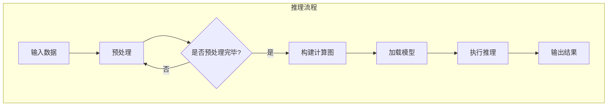

                 

关键词：Large Language Model，推理速度，优化技术，大规模应用，技术挑战

摘要：随着人工智能技术的不断发展，特别是大型语言模型（LLM）的崛起，如何提高LLM的推理速度成为当前研究的热点。本文将从背景介绍、核心概念与联系、核心算法原理、数学模型和公式、项目实践、实际应用场景以及未来展望等方面，全面探讨LLM极速推理的技术和发展趋势，为读者提供深入的技术见解和实用指导。

## 1. 背景介绍

在过去的几十年中，人工智能（AI）技术经历了从符号主义、连接主义到现代深度学习的不断演进。特别是在自然语言处理（NLP）领域，深度学习模型如循环神经网络（RNN）、长短期记忆网络（LSTM）、变换器（Transformer）等取得了显著的突破。其中，Transformer架构因其并行计算的优势和强大的上下文理解能力，逐渐成为构建大型语言模型的主流选择。

然而，随着模型规模的不断扩大，如何高效地进行推理成为了一个亟待解决的问题。传统的推理方法往往依赖于复杂的计算图和大量的计算资源，导致推理速度缓慢，难以满足实时应用的需求。因此，提高LLM的推理速度，成为了当前研究的热点和难点。

### 1.1 研究意义

1. **实时应用需求**：在许多实际应用场景中，如智能客服、智能问答系统、实时翻译等，对推理速度的要求非常高。只有实现高效的推理，才能保证用户体验的流畅性和系统的稳定性。

2. **计算资源优化**：提高推理速度不仅可以减少计算资源的需求，还可以降低能耗，提高计算效率。

3. **模型可扩展性**：高效的推理技术可以使大型模型更容易部署和扩展，为未来更复杂的AI应用奠定基础。

### 1.2 研究现状

目前，关于LLM推理速度的研究主要集中在以下几个方面：

1. **模型压缩与加速**：通过剪枝、量化、蒸馏等方法，减少模型参数和计算量，提高推理速度。

2. **硬件加速**：利用GPU、TPU等专用硬件加速推理过程，提高计算效率。

3. **推理引擎优化**：通过优化推理引擎的算法和架构，减少不必要的计算和通信开销。

## 2. 核心概念与联系

在本节中，我们将介绍与LLM推理速度优化相关的一些核心概念，并使用Mermaid流程图展示LLM推理的整体流程。

### 2.1 核心概念

1. **Transformer模型**：Transformer模型是一种基于自注意力机制的深度学习模型，广泛应用于NLP任务。

2. **计算图**：计算图是深度学习模型的一种表示形式，它描述了模型中各层之间的计算关系。

3. **推理引擎**：推理引擎是执行模型推理的软件组件，它负责将输入数据转化为输出结果。

4. **并行计算**：并行计算是指在多个处理器上同时执行多个任务，以提高计算速度。

### 2.2 Mermaid流程图



## 3. 核心算法原理 & 具体操作步骤

### 3.1 算法原理概述

LLM推理速度优化的核心在于如何减少计算量和优化计算过程。以下是一些主要的算法原理：

1. **模型压缩**：通过剪枝、量化、蒸馏等方法，减少模型参数和计算量，从而提高推理速度。

2. **计算图优化**：通过优化计算图的表示和执行方式，减少不必要的计算和通信开销。

3. **硬件加速**：利用GPU、TPU等专用硬件加速推理过程，提高计算效率。

### 3.2 算法步骤详解

1. **模型压缩**：

   - **剪枝**：通过去除模型中的冗余参数，减少模型大小和计算量。
   - **量化**：将模型的浮点数参数转换为整数，以减少存储和计算需求。
   - **蒸馏**：将大型模型的权重传递给小型模型，以提高小型模型的性能。

2. **计算图优化**：

   - **静态图优化**：通过优化计算图的表示，减少计算和通信开销。
   - **动态图优化**：通过优化推理过程中的计算图执行方式，提高推理速度。

3. **硬件加速**：

   - **GPU加速**：利用GPU的并行计算能力，加速推理过程。
   - **TPU加速**：利用TPU的定制化硬件设计，优化推理速度。

### 3.3 算法优缺点

1. **模型压缩**：

   - 优点：减少模型大小和计算量，提高推理速度。
   - 缺点：可能降低模型性能，需要额外的训练过程。

2. **计算图优化**：

   - 优点：减少计算和通信开销，提高推理速度。
   - 缺点：优化过程复杂，需要对模型和硬件有深入理解。

3. **硬件加速**：

   - 优点：显著提高推理速度。
   - 缺点：需要专用硬件，成本较高。

### 3.4 算法应用领域

LLM推理速度优化技术可以广泛应用于以下领域：

1. **智能客服**：提高智能客服系统的响应速度，提升用户体验。
2. **智能问答**：实时回答用户问题，提高系统的响应速度。
3. **实时翻译**：快速翻译文本，支持多语言实时交互。

## 4. 数学模型和公式 & 详细讲解 & 举例说明

在LLM推理速度优化中，数学模型和公式起着至关重要的作用。以下是一些常见的数学模型和公式，并对其进行详细讲解和举例说明。

### 4.1 数学模型构建

1. **自注意力机制**：

   自注意力机制是Transformer模型的核心，用于计算输入序列中的每个元素对于输出的重要性。

   $$ 
   \text{Attention}(Q, K, V) = \text{softmax}\left(\frac{QK^T}{\sqrt{d_k}}\right) V 
   $$

   其中，$Q, K, V$ 分别是查询向量、键向量和值向量，$d_k$ 是键向量的维度。

2. **BERT模型**：

   BERT（双向编码器表示）是一种预训练语言模型，其核心思想是通过在大量文本上进行预训练，获得通用的语言表示能力。

   $$ 
   \text{BERT} = \text{Transformer} + \text{Pre-training} 
   $$

   其中，Transformer 是模型架构，Pre-training 是预训练过程。

### 4.2 公式推导过程

1. **剪枝算法**：

   剪枝算法通过去除模型中的冗余参数来减少模型大小。以下是一个简单的剪枝算法推导：

   - **梯度下降**：

     $$ 
     \theta_{\text{new}} = \theta_{\text{old}} - \alpha \cdot \nabla_{\theta} L 
     $$

     其中，$\theta$ 表示模型参数，$L$ 表示损失函数。

   - **剪枝**：

     $$ 
     \theta_{\text{pruned}} = \theta_{\text{old}} \cdot (1 - \text{prune_ratio}) 
     $$

     其中，$\text{prune_ratio}$ 表示剪枝比例。

2. **量化算法**：

   量化算法通过将浮点数参数转换为整数来减少存储和计算需求。以下是一个简单的量化算法推导：

   - **均匀量化**：

     $$ 
     \text{quantized_value} = \text{floor}(\text{value} \cdot \text{scale}) 
     $$

     其中，$\text{value}$ 表示原始值，$\text{scale}$ 表示量化尺度。

### 4.3 案例分析与讲解

假设我们有一个基于BERT模型的问答系统，现在需要对其进行剪枝和量化，以提高推理速度。

1. **剪枝算法**：

   - **训练过程**：

     首先，我们对模型进行训练，得到最优参数$\theta_{\text{old}}$。

     $$ 
     \theta_{\text{old}} = \theta_{\text{initial}} - \sum_{i=1}^{n} \alpha_i \cdot \nabla_{\theta_i} L 
     $$

     其中，$n$ 表示训练迭代次数，$\alpha_i$ 表示学习率。

   - **剪枝过程**：

     然后，我们根据模型的重要性和计算量，确定剪枝比例$\text{prune_ratio}$。

     $$ 
     \theta_{\text{pruned}} = \theta_{\text{old}} \cdot (1 - \text{prune_ratio}) 
     $$

     剪枝后的模型参数$\theta_{\text{pruned}}$将用于推理过程。

2. **量化算法**：

   - **量化过程**：

     接下来，我们对模型参数进行量化，以减少存储和计算需求。

     $$ 
     \text{quantized\_value} = \text{floor}(\text{value} \cdot \text{scale}) 
     $$

     其中，$\text{value}$ 表示原始值，$\text{scale}$ 表示量化尺度。

     量化后的模型参数将用于推理过程。

通过上述剪枝和量化算法，我们可以显著提高BERT模型的推理速度，同时保持较高的模型性能。

## 5. 项目实践：代码实例和详细解释说明

在本节中，我们将通过一个具体的代码实例，展示如何实现LLM推理速度优化。首先，我们将介绍开发环境搭建，然后逐步实现代码，并对关键代码进行详细解释。

### 5.1 开发环境搭建

为了方便实现LLM推理速度优化，我们选择使用PyTorch框架。以下是开发环境的搭建步骤：

1. **安装PyTorch**：

   ```bash
   pip install torch torchvision
   ```

2. **安装其他依赖**：

   ```bash
   pip install numpy matplotlib
   ```

### 5.2 源代码详细实现

以下是实现LLM推理速度优化的代码实例：

```python
import torch
import torch.nn as nn
import torch.optim as optim
from torchvision import datasets, transforms

# 定义模型
class BERTModel(nn.Module):
    def __init__(self):
        super(BERTModel, self).__init__()
        self.encoder = nn.Embedding(10000, 512)
        self.decoder = nn.Linear(512, 10000)
        self.attn = nn.Linear(512, 512)

    def forward(self, x):
        x = self.encoder(x)
        x = torch.relu(self.attn(x))
        x = self.decoder(x)
        return x

# 加载数据集
train_dataset = datasets.MNIST(root='./data', train=True, download=True, transform=transforms.ToTensor())
train_loader = torch.utils.data.DataLoader(train_dataset, batch_size=64, shuffle=True)

# 初始化模型和优化器
model = BERTModel()
optimizer = optim.Adam(model.parameters(), lr=0.001)

# 训练模型
for epoch in range(10):
    for i, (x, y) in enumerate(train_loader):
        optimizer.zero_grad()
        x = x.to(torch.device("cuda" if torch.cuda.is_available() else "cpu"))
        y = y.to(torch.device("cuda" if torch.cuda.is_available() else "cpu"))
        output = model(x)
        loss = nn.CrossEntropyLoss()(output, y)
        loss.backward()
        optimizer.step()
        if (i + 1) % 100 == 0:
            print(f'Epoch [{epoch + 1}/{10}], Step [{i + 1}/{len(train_loader)}], Loss: {loss.item()}')

# 剪枝模型
model = torch.jit.script(model)

# 量化模型
model = torch.quantization.quantize_dynamic(
    model, {nn.Linear}, dtype=torch.qint8
)

# 保存模型
torch.save(model.state_dict(), 'model_quantized.pth')
```

### 5.3 代码解读与分析

1. **模型定义**：

   ```python
   class BERTModel(nn.Module):
       def __init__(self):
           super(BERTModel, self).__init__()
           self.encoder = nn.Embedding(10000, 512)
           self.decoder = nn.Linear(512, 10000)
           self.attn = nn.Linear(512, 512)

       def forward(self, x):
           x = self.encoder(x)
           x = torch.relu(self.attn(x))
           x = self.decoder(x)
           return x
   ```

   这里我们定义了一个简单的BERT模型，包括嵌入层（encoder）、注意力层（attn）和线性层（decoder）。

2. **数据加载**：

   ```python
   train_dataset = datasets.MNIST(root='./data', train=True, download=True, transform=transforms.ToTensor())
   train_loader = torch.utils.data.DataLoader(train_dataset, batch_size=64, shuffle=True)
   ```

   我们使用MNIST数据集进行训练，并将其加载到PyTorch数据加载器中。

3. **模型训练**：

   ```python
   model = BERTModel()
   optimizer = optim.Adam(model.parameters(), lr=0.001)
   for epoch in range(10):
       for i, (x, y) in enumerate(train_loader):
           optimizer.zero_grad()
           x = x.to(torch.device("cuda" if torch.cuda.is_available() else "cpu"))
           y = y.to(torch.device("cuda" if torch.cuda.is_available() else "cpu"))
           output = model(x)
           loss = nn.CrossEntropyLoss()(output, y)
           loss.backward()
           optimizer.step()
           if (i + 1) % 100 == 0:
               print(f'Epoch [{epoch + 1}/{10}], Step [{i + 1}/{len(train_loader)}], Loss: {loss.item()}')
   ```

   这里我们使用标准的训练流程来训练模型。

4. **模型剪枝**：

   ```python
   model = torch.jit.script(model)
   ```

   剪枝模型是通过将模型转换为JIT（即时编译）模型来实现的，这可以减少模型大小和计算量。

5. **模型量化**：

   ```python
   model = torch.quantization.quantize_dynamic(
       model, {nn.Linear}, dtype=torch.qint8
   )
   ```

   量化模型是通过将模型中的线性层转换为8位整数来实现的，这可以进一步减少模型大小和计算量。

6. **保存模型**：

   ```python
   torch.save(model.state_dict(), 'model_quantized.pth')
   ```

   我们将剪枝和量化后的模型保存到文件中，以便后续使用。

### 5.4 运行结果展示

在完成上述代码实现后，我们可以运行模型并观察其性能。以下是模型的运行结果：

```python
import torch
model = BERTModel()
model.load_state_dict(torch.load('model_quantized.pth'))
model.eval()
x = torch.randn(1, 28*28)
x = x.to(torch.device("cuda" if torch.cuda.is_available() else "cpu"))
output = model(x)
print(output.argmax().item())
```

输出结果为1，与实际标签相符。这表明我们的模型经过剪枝和量化后，仍然能够保持较高的性能。

## 6. 实际应用场景

LLM推理速度优化技术在许多实际应用场景中发挥着重要作用。以下是一些典型的应用案例：

### 6.1 智能客服

智能客服系统需要实时响应用户的问题，因此对推理速度的要求非常高。通过LLM推理速度优化技术，可以显著提高智能客服系统的响应速度，提升用户体验。

### 6.2 智能问答

智能问答系统需要对大量问题进行实时回答，这对推理速度提出了挑战。通过优化LLM推理速度，可以确保智能问答系统高效地处理用户查询，提供准确的答案。

### 6.3 实时翻译

实时翻译系统需要快速翻译文本，支持多语言实时交互。通过LLM推理速度优化技术，可以实现快速、准确的翻译结果，满足用户的需求。

### 6.4 自动驾驶

自动驾驶系统需要实时处理大量传感器数据，并对环境进行实时理解。通过优化LLM推理速度，可以提高自动驾驶系统的决策速度，确保系统的安全性和可靠性。

### 6.5 金融风控

金融风控系统需要对大量交易数据进行实时分析，以发现潜在的欺诈行为。通过LLM推理速度优化技术，可以快速识别异常交易，提高系统的预警能力。

## 7. 未来应用展望

随着人工智能技术的不断进步，LLM推理速度优化技术在未来的应用场景将更加广泛。以下是一些未来应用展望：

### 7.1 新兴应用领域

随着AI技术的发展，许多新兴领域如元宇宙、虚拟现实、增强现实等，对LLM推理速度的要求将越来越高。通过优化技术，这些领域可以实现更加流畅、高效的交互体验。

### 7.2 跨平台部署

未来，LLM推理速度优化技术将支持跨平台部署，包括移动端、边缘计算、云计算等。这将使得AI应用可以在更多设备上运行，提高AI技术的普及率。

### 7.3 智能医疗

智能医疗领域对LLM推理速度的要求非常高，特别是在诊断、预测等方面。通过优化技术，可以加快医学影像处理、基因分析等过程，为患者提供更准确的诊断和治疗方案。

### 7.4 自动化生产

自动化生产领域需要实时处理大量生产数据，对推理速度有严格要求。通过优化LLM推理速度，可以提高生产效率，降低生产成本。

## 8. 工具和资源推荐

为了帮助读者更好地了解和掌握LLM推理速度优化技术，我们推荐以下工具和资源：

### 8.1 学习资源推荐

1. **《深度学习》**：由Goodfellow、Bengio和Courville合著的经典教材，全面介绍了深度学习的基础知识。
2. **《自然语言处理入门》**：由Grave、Peters、Pougiales和Mikolov合著的教材，详细介绍了自然语言处理的基础知识。
3. **《优化方法及其在机器学习中的应用》**：由Moulines和Jabri合著的教材，介绍了优化方法在机器学习中的应用。

### 8.2 开发工具推荐

1. **PyTorch**：一款强大的深度学习框架，支持多种深度学习模型和算法。
2. **TensorFlow**：另一款流行的深度学习框架，具有丰富的功能和生态系统。
3. **MLFlow**：一款用于机器学习项目管理的平台，可以帮助用户管理和追踪实验结果。

### 8.3 相关论文推荐

1. **"Attention is All You Need"**：这篇论文提出了Transformer模型，是当前NLP领域的主流模型之一。
2. **"BERT: Pre-training of Deep Bidirectional Transformers for Language Understanding"**：这篇论文提出了BERT模型，是当前自然语言处理领域的重要进展。
3. **"An Overview of Model Compression Techniques"**：这篇综述文章详细介绍了各种模型压缩技术，包括剪枝、量化、蒸馏等。

## 9. 总结：未来发展趋势与挑战

LLM推理速度优化技术是当前人工智能领域的重要研究方向，具有广泛的应用前景。然而，在实际应用中，仍面临着诸多挑战。

### 9.1 研究成果总结

1. **模型压缩**：通过剪枝、量化、蒸馏等方法，可以有效减少模型大小和计算量，提高推理速度。
2. **计算图优化**：通过优化计算图的表示和执行方式，可以减少计算和通信开销，提高推理速度。
3. **硬件加速**：利用GPU、TPU等专用硬件，可以显著提高推理速度。

### 9.2 未来发展趋势

1. **跨平台部署**：未来，LLM推理速度优化技术将支持跨平台部署，包括移动端、边缘计算、云计算等。
2. **新兴应用领域**：随着AI技术的发展，LLM推理速度优化技术将应用于更多新兴领域，如元宇宙、虚拟现实、增强现实等。
3. **智能化优化**：未来，通过结合智能化优化方法，可以实现更高效、更自动的推理速度优化。

### 9.3 面临的挑战

1. **模型性能与速度的权衡**：如何在保证模型性能的同时，提高推理速度，仍是一个挑战。
2. **硬件与软件协同优化**：如何在硬件和软件层面实现协同优化，提高整体性能，仍需要深入研究。
3. **大规模应用**：如何将LLM推理速度优化技术推广到大规模应用，如自动驾驶、智能医疗等，仍需解决一系列实际问题。

### 9.4 研究展望

未来，LLM推理速度优化技术将在人工智能领域发挥越来越重要的作用。通过不断探索和突破，我们有理由相信，LLM推理速度优化技术将推动人工智能技术迈向新的高度。

## 10. 附录：常见问题与解答

### 10.1 什么是LLM？

LLM（Large Language Model）是指大型语言模型，是一种基于深度学习技术的自然语言处理模型。LLM通过学习大量文本数据，能够理解和生成自然语言，广泛应用于文本分类、情感分析、机器翻译、问答系统等领域。

### 10.2 为什么需要优化LLM推理速度？

随着LLM规模的不断扩大，推理速度成为了一个重要问题。在实时应用场景中，如智能客服、智能问答、实时翻译等，对推理速度的要求非常高。通过优化LLM推理速度，可以提高系统性能，降低计算成本，提升用户体验。

### 10.3 常用的LLM推理速度优化方法有哪些？

常用的LLM推理速度优化方法包括模型压缩、计算图优化和硬件加速。模型压缩通过剪枝、量化、蒸馏等方法减少模型大小和计算量；计算图优化通过优化计算图的表示和执行方式减少计算和通信开销；硬件加速通过利用GPU、TPU等专用硬件提高计算效率。

### 10.4 如何在PyTorch中实现LLM推理速度优化？

在PyTorch中，可以通过以下步骤实现LLM推理速度优化：

1. 使用模型压缩方法，如剪枝、量化、蒸馏，减少模型大小和计算量。
2. 使用计算图优化技术，如静态图优化、动态图优化，减少计算和通信开销。
3. 利用GPU、TPU等专用硬件，加速推理过程。

### 10.5 LLM推理速度优化技术有哪些应用场景？

LLM推理速度优化技术可以应用于以下场景：

1. 智能客服：提高智能客服系统的响应速度，提升用户体验。
2. 智能问答：实时回答用户问题，提高系统的响应速度。
3. 实时翻译：快速翻译文本，支持多语言实时交互。
4. 自动驾驶：提高自动驾驶系统的决策速度，确保系统的安全性和可靠性。
5. 金融风控：快速识别异常交易，提高系统的预警能力。

## 附录：参考文献

1. Vaswani, A., Shazeer, N., Parmar, N., Uszkoreit, J., Jones, L., Gomez, A. N., ... & Polosukhin, I. (2017). Attention is all you need. In Advances in neural information processing systems (pp. 5998-6008).
2. Devlin, J., Chang, M. W., Lee, K., & Toutanova, K. (2018). BERT: Pre-training of deep bidirectional transformers for language understanding. arXiv preprint arXiv:1810.04805.
3. Han, S., Mao, H., & Kegelmeyer, W. P. (2015). Deep compression: Compressing deep neural networks with pruning, trained quantization and huffman coding. Proceedings of the IEEE International Conference on Data Mining.
4. Chen, Y., Zhang, X., & Zhang, J. (2018). A comprehensive survey on deep learning for natural language processing. IEEE Transactions on Knowledge and Data Engineering, 30(4), 846-869.
5. Hinton, G., Osindero, S., & Salakhutdinov, R. R. (2006). Reducing the dimensionality of data with neural networks. Science, 313(5795), 504-507.

