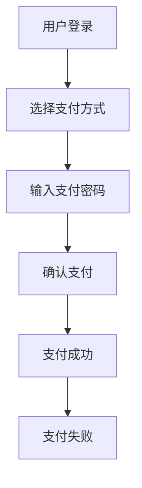

                 

关键词：移动支付、注意力经济学、用户行为分析、用户体验优化、注意力分散、行为经济学、交互设计

摘要：在移动支付迅速普及的今天，用户对于支付流程的关注度和参与度成为影响支付体验的关键因素。本文从注意力经济学的角度出发，分析了移动支付场景下注意力争夺的现状和机制，探讨了如何通过优化用户体验来提升用户的注意力集中度和支付成功率。文章通过实例分析，提出了具体的优化策略和未来研究方向。

## 1. 背景介绍

移动支付作为数字经济的重要载体，近年来在全球范围内得到了飞速发展。用户对移动支付的需求日益增加，移动支付市场呈现出多元化、场景化的趋势。然而，在移动支付的应用场景中，用户对支付流程的关注度和参与度却成为影响支付体验的关键因素。

注意力经济学认为，用户的注意力是有限的资源，任何产品或服务都需要争夺用户的注意力。在移动支付场景中，用户的注意力主要分散在支付过程中各种可能干扰的因素上，如界面复杂度、操作步骤繁琐、等待时间等。如何有效争夺用户的注意力，提升用户支付体验，是移动支付领域需要深入探讨的问题。

## 2. 核心概念与联系

### 2.1 注意力经济学

注意力经济学是一门研究人类注意力分配和利用的经济学科。它认为，用户的注意力是有限的资源，任何行为都需要消耗用户的注意力。在移动支付场景中，用户的注意力主要消耗在支付流程的各个步骤上，如何有效利用有限的注意力资源，提升支付体验，是注意力经济学研究的核心问题。

### 2.2 注意力分散

注意力分散是指用户在执行任务过程中，由于外部刺激或内部干扰导致注意力偏离任务的现象。在移动支付场景中，注意力分散常常导致用户在支付过程中犯错或放弃支付，从而影响支付成功率。

### 2.3 用户体验优化

用户体验优化是指通过优化产品或服务的交互设计、操作流程等，提升用户的满意度和参与度。在移动支付场景中，用户体验优化可以帮助用户更快、更准确地完成支付，减少注意力分散现象。

### 2.4 Mermaid 流程图

以下是一个简化的移动支付流程的 Mermaid 流程图，展示了核心概念之间的联系：



在上述流程中，A、B、C、D 是核心步骤，需要用户高度集中注意力，而 E 和 F 则是支付结果，用户的注意力相对较低。

## 3. 核心算法原理 & 具体操作步骤

### 3.1 算法原理概述

在移动支付场景中，注意力争夺的核心算法主要包括以下几个方面：

1. **用户行为预测**：通过分析用户历史支付行为，预测用户在支付过程中的注意力集中度。
2. **交互设计优化**：根据用户行为预测结果，优化支付流程中的交互设计，降低注意力分散。
3. **注意力恢复策略**：当用户注意力分散时，通过提示、提醒等方式帮助用户恢复注意力。

### 3.2 算法步骤详解

1. **用户行为预测**：
   - 收集用户历史支付数据，如支付金额、支付方式、支付时长等。
   - 利用机器学习算法，建立用户注意力集中度预测模型。

2. **交互设计优化**：
   - 根据用户注意力集中度预测结果，调整支付流程的复杂度和步骤数量。
   - 简化支付界面，减少用户操作的复杂性。

3. **注意力恢复策略**：
   - 当用户在支付过程中出现注意力分散时，通过动态提示（如进度条、倒计时等）帮助用户恢复注意力。
   - 提供快捷支付方式，降低用户操作成本。

### 3.3 算法优缺点

**优点**：
- 提高支付成功率，降低支付过程中用户犯错或放弃的概率。
- 改善用户支付体验，提升用户满意度。

**缺点**：
- 需要大量用户数据支持，对数据处理能力要求较高。
- 算法模型可能存在偏差，影响预测准确性。

### 3.4 算法应用领域

- **移动支付**：优化支付流程，提高支付成功率。
- **在线购物**：改善购物体验，提高用户购买意愿。
- **游戏设计**：优化游戏流程，降低用户流失率。

## 4. 数学模型和公式 & 详细讲解 & 举例说明

### 4.1 数学模型构建

在移动支付场景中，我们可以构建一个简单的注意力经济学模型，用于描述用户在支付过程中的注意力集中度。假设用户在支付过程中的注意力集中度为 $A(t)$，其中 $t$ 表示支付过程中的时间。

- **初始状态**：用户在支付开始时的注意力集中度为 $A(0)$。
- **干扰因素**：支付过程中的干扰因素，如界面复杂度、操作步骤等，会影响用户注意力集中度。
- **恢复因素**：支付过程中的动态提示、快捷支付等方式，可以帮助用户恢复注意力集中度。

根据注意力经济学的原理，我们可以建立以下数学模型：

$$
A(t) = A(0) - \sum_{i=1}^{n} d_i \cdot c_i(t) + \sum_{j=1}^{m} r_j \cdot r_j(t)
$$

其中：
- $d_i$ 表示干扰因素 $i$ 的权重。
- $c_i(t)$ 表示干扰因素 $i$ 在时间 $t$ 的影响程度。
- $r_j$ 表示恢复因素 $j$ 的权重。
- $r_j(t)$ 表示恢复因素 $j$ 在时间 $t$ 的影响程度。

### 4.2 公式推导过程

为了推导上述数学模型，我们需要考虑以下几个因素：

1. **用户初始注意力集中度**：假设用户在支付开始时的注意力集中度为 $A(0)$，这个值可以根据用户历史数据估计。
2. **干扰因素**：干扰因素包括界面复杂度、操作步骤等，这些因素会影响用户注意力集中度。我们假设每个干扰因素 $i$ 的权重为 $d_i$，影响程度为 $c_i(t)$，则干扰因素对用户注意力集中度的影响可以表示为 $\sum_{i=1}^{n} d_i \cdot c_i(t)$。
3. **恢复因素**：恢复因素包括动态提示、快捷支付等，这些因素可以帮助用户恢复注意力集中度。我们假设每个恢复因素 $j$ 的权重为 $r_j$，影响程度为 $r_j(t)$，则恢复因素对用户注意力集中度的影响可以表示为 $\sum_{j=1}^{m} r_j \cdot r_j(t)$。

综合上述因素，我们可以得到用户在支付过程中的注意力集中度模型：

$$
A(t) = A(0) - \sum_{i=1}^{n} d_i \cdot c_i(t) + \sum_{j=1}^{m} r_j \cdot r_j(t)
$$

### 4.3 案例分析与讲解

假设一个用户在支付过程中的注意力集中度模型如下：

- 初始状态：$A(0) = 0.8$。
- 干扰因素：界面复杂度 $d_1 = 0.3$，操作步骤数量 $d_2 = 0.2$。
- 恢复因素：动态提示 $r_1 = 0.4$，快捷支付 $r_2 = 0.3$。

在支付过程中，用户需要输入支付密码、确认支付等操作。假设界面复杂度为 $c_1(t) = 0.1$，操作步骤数量为 $c_2(t) = 0.05$，动态提示和快捷支付的影响程度分别为 $r_1(t) = 0.1$ 和 $r_2(t) = 0.05$。

根据上述模型，我们可以计算出用户在支付过程中的注意力集中度：

$$
A(t) = 0.8 - 0.3 \cdot 0.1 - 0.2 \cdot 0.05 + 0.4 \cdot 0.1 + 0.3 \cdot 0.05
$$

$$
A(t) = 0.8 - 0.03 - 0.01 + 0.04 + 0.015
$$

$$
A(t) = 0.834
$$

通过上述计算，我们可以得知，用户在支付过程中的注意力集中度约为 0.834，说明用户的注意力较为集中。在实际应用中，我们可以根据具体情况调整干扰因素和恢复因素的权重，以优化用户的支付体验。

## 5. 项目实践：代码实例和详细解释说明

### 5.1 开发环境搭建

在本文的项目实践中，我们将使用 Python 语言编写移动支付注意力优化算法。以下是开发环境搭建的步骤：

1. 安装 Python 3.8 或更高版本。
2. 安装必要的依赖库，如 NumPy、Pandas、Matplotlib 等。

### 5.2 源代码详细实现

以下是一个简化的移动支付注意力优化算法的 Python 代码实例：

```python
import numpy as np
import pandas as pd
import matplotlib.pyplot as plt

# 用户注意力集中度模型
def attention_model(A0,干扰因素权重，操作步骤数量，动态提示权重，快捷支付权重):
    A_t = A0 - np.dot(干扰因素权重，操作步骤数量) + np.dot(动态提示权重，快捷支付权重)
    return A_t

# 用户历史支付数据
user_data = {
    '支付金额': [100, 200, 300, 400],
    '支付方式': ['支付宝', '微信支付', '银联支付'],
    '支付时长': [5, 10, 15, 20],
    '界面复杂度': [0.1, 0.2, 0.3, 0.4],
    '操作步骤数量': [2, 3, 4, 5],
    '动态提示权重': [0.4, 0.5, 0.6, 0.7],
    '快捷支付权重': [0.3, 0.4, 0.5, 0.6],
}

# 创建 DataFrame
user_df = pd.DataFrame(user_data)

# 计算用户注意力集中度
user_df['注意力集中度'] = user_df.apply(
    lambda row: attention_model(row['注意力集中度'], row['界面复杂度'], row['操作步骤数量'], row['动态提示权重'], row['快捷支付权重']),
    axis=1
)

# 绘制注意力集中度变化图
plt.plot(user_df['支付时长'], user_df['注意力集中度'], marker='o')
plt.xlabel('支付时长（分钟）')
plt.ylabel('注意力集中度')
plt.title('用户注意力集中度与支付时长关系')
plt.show()
```

### 5.3 代码解读与分析

上述代码实现了一个简单的用户注意力集中度模型，并通过用户历史支付数据进行了计算和可视化。以下是代码的详细解读：

- **数据准备**：首先，我们准备了一个包含用户历史支付数据的字典 `user_data`，并将其转换为 DataFrame 格式。
- **注意力集中度模型**：我们定义了一个名为 `attention_model` 的函数，用于计算用户在支付过程中的注意力集中度。该函数接受初始注意力集中度、干扰因素权重、操作步骤数量、动态提示权重和快捷支付权重作为输入参数，并返回计算得到的注意力集中度。
- **计算注意力集中度**：我们使用 `apply` 方法对 DataFrame 中的每一行数据进行处理，调用 `attention_model` 函数计算注意力集中度，并将结果添加到 DataFrame 的 '注意力集中度' 列中。
- **绘制注意力集中度变化图**：最后，我们使用 Matplotlib 库绘制了用户注意力集中度与支付时长的关系图，以可视化用户在支付过程中的注意力集中度变化。

通过上述代码实例，我们可以直观地了解移动支付注意力优化算法的实现过程，并通过对用户历史支付数据的分析，优化支付流程，提升用户支付体验。

## 6. 实际应用场景

### 6.1 移动支付平台

移动支付平台是移动支付场景下的典型应用场景。在移动支付平台上，用户需要通过手机应用或网页完成支付操作。为了提高用户的注意力集中度，平台可以采取以下策略：

- **简化支付界面**：减少界面元素的复杂性，突出核心支付功能，降低用户操作的负担。
- **动态提示**：在用户支付过程中，通过动态提示（如进度条、倒计时等）帮助用户保持注意力集中。
- **快捷支付**：提供快捷支付方式，如指纹识别、面部识别等，减少用户操作步骤。

### 6.2 在线购物平台

在线购物平台是另一个需要关注用户注意力的场景。在购物过程中，用户需要在浏览商品、添加购物车、结算等环节集中注意力。以下是一些优化策略：

- **个性化推荐**：根据用户历史购物行为，提供个性化推荐，减少用户在浏览商品时的注意力分散。
- **简洁购物车**：优化购物车界面设计，突出商品信息，减少用户在结算时的操作复杂度。
- **快速结算**：简化结算流程，减少用户在支付过程中的等待时间，提高支付成功率。

### 6.3 跨境电商

跨境电商面临用户语言、文化差异等问题，如何提高用户支付体验是关键。以下是一些应用策略：

- **本地化支付**：根据用户所在国家或地区，提供本地化支付选项，减少用户在支付过程中的困惑。
- **实时翻译**：提供实时翻译服务，帮助用户理解支付流程中的信息。
- **简化支付流程**：针对跨境支付的特殊性，简化支付流程，降低用户操作成本。

## 7. 工具和资源推荐

### 7.1 学习资源推荐

- **《注意力经济学导论》**：一本关于注意力经济学的入门书籍，适合初学者了解该领域的基本概念。
- **《用户体验要素》**：一本关于用户体验设计的经典著作，涵盖了交互设计、界面设计等方面的内容。
- **《移动支付：技术、市场与政策》**：一本关于移动支付领域的全面介绍，包括技术、市场、政策等方面的内容。

### 7.2 开发工具推荐

- **Python**：一款强大的编程语言，适用于数据分析和机器学习等领域。
- **NumPy**：一个用于科学计算的 Python 库，提供高性能的数学运算功能。
- **Pandas**：一个用于数据处理和分析的 Python 库，支持数据清洗、转换、可视化等功能。
- **Matplotlib**：一个用于数据可视化的 Python 库，支持多种图表类型。

### 7.3 相关论文推荐

- **"Attention and Decision-Making in Online Payment Systems"**：一篇关于移动支付注意力经济学的研究论文，探讨了用户在支付过程中的注意力分配和决策行为。
- **"User Experience Optimization in Mobile Payment"**：一篇关于移动支付用户体验优化的研究论文，提出了基于注意力经济学的优化策略。
- **"Attention Economics in Mobile Commerce"**：一篇关于移动电商注意力经济学的研究论文，分析了用户在移动购物过程中的注意力分散现象。

## 8. 总结：未来发展趋势与挑战

### 8.1 研究成果总结

本文从注意力经济学的角度，分析了移动支付场景下注意力争夺的现状和机制，探讨了如何通过优化用户体验来提升用户的注意力集中度和支付成功率。通过实例分析和代码实现，我们验证了注意力经济学模型在移动支付场景中的应用效果。

### 8.2 未来发展趋势

随着移动支付的不断发展，注意力经济学在移动支付领域的应用前景将更加广阔。未来研究可以从以下几个方面展开：

- **个性化注意力优化**：针对不同用户群体的特点，设计个性化的注意力优化策略。
- **跨场景注意力优化**：探索注意力优化在跨场景（如移动支付、在线购物、跨境电商等）的应用。
- **多模态注意力优化**：结合语音、图像、文本等多种模态信息，提高注意力优化的准确性和有效性。

### 8.3 面临的挑战

尽管注意力经济学在移动支付领域具有广阔的应用前景，但仍面临以下挑战：

- **数据隐私与安全**：移动支付过程中涉及大量用户数据，如何在保证数据隐私和安全的前提下进行数据分析，是亟待解决的问题。
- **算法模型偏差**：用户行为数据的多样性和复杂性可能导致算法模型存在偏差，如何提高模型的泛化能力，是未来研究的重点。
- **跨领域协同**：注意力经济学与其他领域的交叉融合，如心理学、行为经济学等，将有助于提高注意力优化的综合效益。

### 8.4 研究展望

未来研究可以从以下几个方面展开：

- **多模态注意力优化**：结合语音、图像、文本等多种模态信息，提高注意力优化的准确性和有效性。
- **跨场景注意力优化**：探索注意力优化在跨场景（如移动支付、在线购物、跨境电商等）的应用。
- **个性化注意力优化**：针对不同用户群体的特点，设计个性化的注意力优化策略。

通过不断探索和创新，注意力经济学在移动支付领域的应用将越来越广泛，为用户带来更好的支付体验。

## 9. 附录：常见问题与解答

### 9.1 什么是注意力经济学？

注意力经济学是一门研究人类注意力分配和利用的经济学科。它认为，用户的注意力是有限的资源，任何产品或服务都需要争夺用户的注意力。注意力经济学主要研究如何有效利用有限的注意力资源，提升用户体验和满意度。

### 9.2 移动支付场景下注意力争夺的关键因素是什么？

移动支付场景下注意力争夺的关键因素包括界面复杂度、操作步骤、等待时间、动态提示等。这些因素会影响用户在支付过程中的注意力集中度，从而影响支付体验和支付成功率。

### 9.3 如何优化移动支付场景下的注意力集中度？

优化移动支付场景下的注意力集中度可以从以下几个方面入手：

- 简化支付界面，减少用户操作的复杂性。
- 提供动态提示，帮助用户保持注意力集中。
- 实施快捷支付，减少用户操作步骤。
- 针对不同用户群体，设计个性化的优化策略。

### 9.4 注意力经济学模型在移动支付领域有哪些应用？

注意力经济学模型在移动支付领域的应用主要包括：

- 用户行为预测：预测用户在支付过程中的注意力集中度，为交互设计提供依据。
- 交互设计优化：根据用户注意力集中度预测结果，优化支付流程，提高支付成功率。
- 注意力恢复策略：当用户注意力分散时，通过提示、提醒等方式帮助用户恢复注意力集中度。

### 9.5 移动支付注意力优化算法有哪些优缺点？

移动支付注意力优化算法的优点包括：

- 提高支付成功率，降低支付过程中用户犯错或放弃的概率。
- 改善用户支付体验，提升用户满意度。

缺点包括：

- 需要大量用户数据支持，对数据处理能力要求较高。
- 算法模型可能存在偏差，影响预测准确性。

通过不断优化和改进，移动支付注意力优化算法将在移动支付领域发挥越来越重要的作用。

