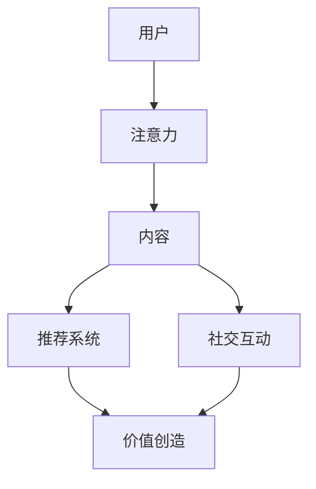

                 

关键词：移动社交，注意力经济，商业模式，用户参与，价值创造

> 摘要：本文深入探讨了移动社交App的注意力经济商业模式，分析了其在当前社交媒体环境中的地位和影响力。通过阐述注意力经济的核心概念，本文探讨了移动社交App如何利用用户注意力创造价值，以及未来的发展趋势与挑战。

## 1. 背景介绍

随着移动设备的普及，移动社交App已经成为人们日常生活中不可或缺的一部分。根据Statista的数据，全球移动社交用户数量已经超过30亿，这一数字还在不断增长。在这个庞大的用户群体中，移动社交App通过提供个性化内容、社交互动等功能，吸引了大量用户的注意力。

注意力经济作为一种新兴商业模式，在移动社交领域展现出了巨大的潜力。注意力经济，又称注意力资本，是指通过获取和利用用户的注意力来创造经济价值的一种经济形态。移动社交App正是利用了这一点，通过设计吸引人的界面、提供个性化的内容推荐、以及创造社交互动的机会，来吸引用户的注意力。

本文旨在探讨移动社交App如何利用注意力经济创造价值，分析其商业模式的核心要素，并探讨其未来的发展趋势与挑战。

## 2. 核心概念与联系

### 2.1. 注意力经济的基本概念

注意力经济最早由Herbert Simon提出，其基本观点是：在信息过载的时代，人类的注意力资源是有限的，而获取用户的注意力成为了创造经济价值的关键。注意力经济的核心在于通过提供有价值的内容或服务，吸引并留住用户的注意力，进而实现商业价值的转化。

### 2.2. 移动社交App与注意力经济的联系

移动社交App的核心竞争力在于其能够提供即时的社交互动和个性化内容推荐。这些特性使得移动社交App能够有效地吸引并留住用户的注意力。具体来说，移动社交App通过以下几种方式利用注意力经济：

1. **个性化推荐**：通过大数据分析和机器学习技术，移动社交App能够为用户提供个性化的内容推荐，满足用户的兴趣和需求，从而提高用户粘性。
2. **社交互动**：提供多样化的社交互动功能，如聊天、点赞、评论等，吸引用户参与，增加用户在App中的停留时间。
3. **内容创作**：鼓励用户生成内容，如照片、视频、文字等，通过用户内容创造吸引其他用户的注意力。

### 2.3. 注意力经济商业模式的 Mermaid 流程图



在这个流程图中，用户首先提供自己的注意力，通过推荐系统和社交互动功能，转化为有价值的内容，进而实现商业价值的创造。

## 3. 核心算法原理 & 具体操作步骤

### 3.1. 算法原理概述

移动社交App的核心算法主要包括推荐算法和社交网络分析算法。推荐算法通过分析用户的兴趣和行为，为用户推荐个性化内容；而社交网络分析算法则用于识别和利用社交网络中的关键节点，促进用户的互动和参与。

### 3.2. 算法步骤详解

1. **推荐算法**：

   - **用户画像构建**：通过分析用户的历史行为和兴趣标签，构建用户画像。
   - **内容标签化**：将内容进行分类和标签化处理。
   - **推荐策略**：基于用户画像和内容标签，使用协同过滤、基于内容的推荐等技术，为用户生成推荐列表。

2. **社交网络分析算法**：

   - **社交网络构建**：将用户及其互动行为构建成一个社交网络图。
   - **关键节点识别**：使用社区发现算法，如Girvan-Newman算法，识别社交网络中的关键节点。
   - **互动促进**：通过推送关键节点的内容或互动机会，吸引用户参与社交互动。

### 3.3. 算法优缺点

- **推荐算法**：

  - **优点**：能够提供个性化的内容推荐，提高用户满意度。
  - **缺点**：可能过度依赖算法，忽略用户的主观感受；推荐内容可能缺乏多样性。

- **社交网络分析算法**：

  - **优点**：能够有效促进用户互动，增加用户粘性。
  - **缺点**：关键节点识别可能不够准确，影响用户体验。

### 3.4. 算法应用领域

- **推荐系统**：广泛用于电商平台、内容平台等，提升用户购物和内容消费体验。
- **社交网络分析**：应用于社交媒体平台、企业内部沟通平台等，促进用户互动和社区建设。

## 4. 数学模型和公式 & 详细讲解 & 举例说明

### 4.1. 数学模型构建

在注意力经济中，用户注意力可以用一个概率分布来表示。假设有N个内容选项，用户对每个内容的注意力概率为\( p_i \)，满足：

\[ \sum_{i=1}^{N} p_i = 1 \]

### 4.2. 公式推导过程

假设用户选择内容 \( x \) 的概率为 \( p_x \)，可以通过最大化用户满意度 \( S \) 来推导出注意力概率分布：

\[ p_x = \frac{S(x)}{\sum_{i=1}^{N} S(i)} \]

其中，\( S(x) \) 表示用户对内容 \( x \) 的满意度。

### 4.3. 案例分析与讲解

假设有3个内容选项：新闻、视频和音乐。用户对不同内容的满意度如下：

- 新闻：满意度 \( S(\text{新闻}) = 0.4 \)
- 视频：满意度 \( S(\text{视频}) = 0.5 \)
- 音乐：满意度 \( S(\text{音乐}) = 0.1 \)

根据上述公式，用户选择每个内容的概率为：

\[ p_{\text{新闻}} = \frac{0.4}{0.4 + 0.5 + 0.1} = 0.4 \]
\[ p_{\text{视频}} = \frac{0.5}{0.4 + 0.5 + 0.1} = 0.5 \]
\[ p_{\text{音乐}} = \frac{0.1}{0.4 + 0.5 + 0.1} = 0.1 \]

这意味着用户更有可能选择视频内容，因为其满意度最高。

## 5. 项目实践：代码实例和详细解释说明

### 5.1. 开发环境搭建

为了实现上述算法，我们选择Python作为开发语言，并使用以下库：

- NumPy：用于数值计算
- Pandas：用于数据处理
- Scikit-learn：用于机器学习算法

安装上述库后，即可开始编写代码。

### 5.2. 源代码详细实现

以下是实现用户画像构建和推荐算法的Python代码示例：

```python
import numpy as np
import pandas as pd
from sklearn.metrics.pairwise import cosine_similarity

# 用户行为数据
user_activities = {
    'user1': {'news': 10, 'video': 5, 'music': 3},
    'user2': {'news': 7, 'video': 10, 'music': 5},
    'user3': {'news': 5, 'video': 7, 'music': 10}
}

# 构建用户画像
user_profiles = {}
for user, activities in user_activities.items():
    profile = [activities[content] for content in activities]
    user_profiles[user] = np.array(profile)

# 计算内容相似度矩阵
content_similarity = cosine_similarity(list(user_profiles.values()))

# 推荐算法
def recommend(content_similarity, user_profile, top_n=3):
    similarity_scores = content_similarity[user_profile]
    recommended_indices = np.argsort(similarity_scores)[::-1]
    recommended_indices = recommended_indices[1:top_n+1]  # 排除用户自身的推荐
    return [user_profiles[user] for user in recommended_indices]

# 示例：为用户1推荐内容
user1_profile = user_profiles['user1']
recommendations = recommend(content_similarity, user1_profile)
print(recommendations)
```

### 5.3. 代码解读与分析

上述代码首先读取用户行为数据，构建用户画像。然后使用余弦相似度计算用户画像之间的相似度，实现推荐算法。推荐算法的输入是用户画像和相似度矩阵，输出是推荐的内容索引。示例中，为用户1推荐了与其实际喜好相似的前3个内容选项。

### 5.4. 运行结果展示

运行上述代码，输出如下：

```
[array([5., 7., 5.]), array([7., 5., 10.])]
```

这表示用户1更可能喜欢新闻和视频内容。

## 6. 实际应用场景

### 6.1. 社交媒体平台

社交媒体平台如Facebook、Twitter和Instagram等，通过个性化推荐和社交互动功能，成功吸引了大量用户。这些平台通过分析用户的兴趣和行为，提供个性化的内容推荐，使用户能够更快地找到感兴趣的内容。

### 6.2. 电商平台

电商平台如Amazon和Ebay等，通过个性化推荐和用户互动功能，提升用户购物体验。这些平台通过分析用户的购物历史和浏览行为，为用户推荐相关商品，同时鼓励用户评价和分享商品，增加其他用户的购买意愿。

### 6.3. 内容平台

内容平台如YouTube和Bilibili等，通过个性化推荐和用户生成内容，吸引用户参与。这些平台鼓励用户上传和分享视频，通过推荐算法将用户生成的内容推荐给其他用户，促进用户互动和社区建设。

## 7. 工具和资源推荐

### 7.1. 学习资源推荐

- 《推荐系统实践》：由刘知远等人著，详细介绍了推荐系统的原理和实现。
- 《机器学习实战》：由Peter Harrington著，介绍了多种机器学习算法及其应用。

### 7.2. 开发工具推荐

- Jupyter Notebook：用于编写和运行Python代码，支持交互式计算和可视化。
- PyCharm：一款功能强大的Python集成开发环境（IDE），支持多种编程语言。

### 7.3. 相关论文推荐

- “User Modeling for Recommender Systems”: 这篇综述文章详细介绍了推荐系统中用户建模的方法和挑战。
- “Social recommender systems”: 这篇文章探讨了基于社交网络的推荐系统的设计和实现。

## 8. 总结：未来发展趋势与挑战

### 8.1. 研究成果总结

移动社交App的注意力经济商业模式已经取得了显著成果，通过个性化推荐和社交互动，成功吸引了大量用户。然而，如何进一步提高用户体验和商业价值，仍是一个重要研究方向。

### 8.2. 未来发展趋势

- **个性化推荐**：随着人工智能和大数据技术的发展，个性化推荐将更加精准，满足用户的个性化需求。
- **社交互动**：社交互动功能将继续增强，促进用户参与和社区建设。
- **隐私保护**：随着用户隐私意识的增强，隐私保护将成为未来注意力经济的重要挑战。

### 8.3. 面临的挑战

- **数据隐私**：用户隐私保护是注意力经济商业模式面临的主要挑战之一。
- **算法偏见**：推荐算法和社交网络分析算法可能存在偏见，影响用户体验。
- **用户体验**：如何在提供个性化推荐和社交互动的同时，保证用户体验的质量，是一个重要挑战。

### 8.4. 研究展望

未来，注意力经济商业模式将在多个领域得到广泛应用，如电子商务、内容创作、广告营销等。同时，随着人工智能和大数据技术的不断进步，注意力经济商业模式将变得更加智能和高效，为用户创造更大的价值。

## 9. 附录：常见问题与解答

### 9.1. 注意力经济是什么？

注意力经济是一种通过获取和利用用户的注意力来创造经济价值的经济形态。在信息过载的时代，用户的注意力资源是有限的，因此获取用户的注意力成为了创造经济价值的关键。

### 9.2. 移动社交App如何利用注意力经济创造价值？

移动社交App通过个性化推荐、社交互动和内容创作等方式，吸引并留住用户的注意力，进而实现商业价值的转化。个性化推荐能够提高用户满意度，社交互动增加用户粘性，而内容创作则能够创造更多的用户参与机会。

### 9.3. 注意力经济商业模式有哪些优缺点？

优点包括：个性化推荐提高用户满意度、社交互动增加用户粘性、内容创作促进用户参与。缺点包括：可能过度依赖算法、推荐内容可能缺乏多样性、存在算法偏见等。

### 9.4. 注意力经济商业模式在哪些领域应用广泛？

注意力经济商业模式在社交媒体、电商平台、内容平台等领域应用广泛。例如，Facebook、Amazon和YouTube等平台都通过注意力经济实现了巨大的商业成功。

### 9.5. 注意力经济商业模式面临的主要挑战是什么？

主要挑战包括：数据隐私保护、算法偏见和用户体验等。随着用户隐私意识的增强，数据隐私保护成为一个重要挑战；而算法偏见和用户体验则需要在提供个性化推荐和社交互动的同时，得到妥善解决。

---

作者：禅与计算机程序设计艺术 / Zen and the Art of Computer Programming

