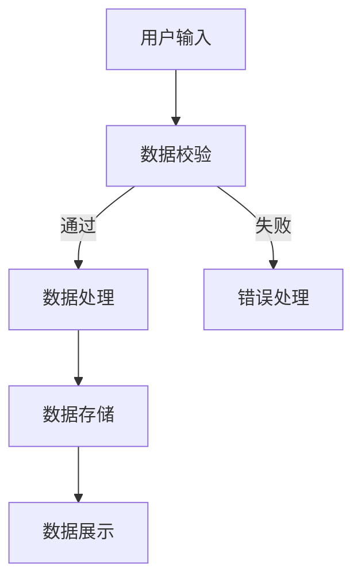
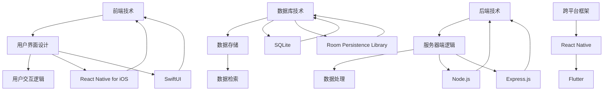

                 

关键词：移动开发、iOS、Android、全栈技术、开发框架、跨平台应用、性能优化

摘要：随着移动设备的普及，移动端开发成为软件开发领域的热点。本文将探讨如何实现iOS与Android双平台的移动端全栈开发，包括开发环境搭建、技术栈选择、核心算法实现、数学模型构建等，旨在帮助开发者掌握移动端全栈开发的精髓。

## 1. 背景介绍

移动端开发的兴起源于智能手机和移动设备的广泛应用。据统计，截至2023年，全球移动设备用户已经超过了40亿，移动设备已经成为人们生活中不可或缺的一部分。这使得移动端开发成为一个充满活力和机遇的领域。

移动端全栈开发是指能够在移动设备上实现前端、后端、数据库等所有功能的技术栈。开发者通过全栈开发，可以更高效地构建应用程序，实现从用户界面到数据处理的全流程掌控。本文将介绍如何实现iOS与Android双平台的移动端全栈开发，涵盖开发环境搭建、技术栈选择、核心算法实现等内容。

## 2. 核心概念与联系

### 2.1 开发环境搭建

在移动端全栈开发中，首先需要搭建开发环境。iOS与Android开发环境有所不同，分别需要Mac OS和Windows环境。

- **iOS开发环境：** 
  - Mac OS：Mac OS是iOS开发的基础，开发者需要安装Mac OS。
  - Xcode：Xcode是苹果官方的开发工具，用于iOS和macOS应用程序的开发。
  - Objective-C和Swift：iOS应用的主要编程语言是Objective-C和Swift。

- **Android开发环境：**
  - Windows或Mac OS：Android开发可以在Windows或Mac OS上运行。
  - Android Studio：Android Studio是谷歌官方的开发工具，用于Android应用程序的开发。
  - Java和Kotlin：Android应用的主要编程语言是Java和Kotlin。

### 2.2 技术栈选择

- **前端框架：**
  - iOS：可以使用SwiftUI、React Native for iOS等框架。
  - Android：可以使用React Native for Android、Flutter等框架。

- **后端框架：**
  - iOS：可以使用Node.js、Express.js等。
  - Android：同样可以使用Node.js、Express.js等。

- **数据库：**
  - iOS：可以使用SQLite、Core Data等。
  - Android：可以使用SQLite、Room等。

### 2.3 核心算法原理与联系

在移动端全栈开发中，算法是实现功能的关键。以下是一个简单的算法流程图：



这个流程图展示了用户输入数据、数据校验、数据处理、数据存储和数据展示的基本流程。

## 3. 核心算法原理 & 具体操作步骤

### 3.1 算法原理概述

核心算法通常涉及数据结构、算法逻辑和优化策略。以下是几个常见的算法原理：

- **数据结构：** 线性结构（数组、链表）、树结构（二叉树、平衡树）、图结构（图、网络）等。
- **排序算法：** 冒泡排序、选择排序、插入排序、快速排序等。
- **查找算法：** 二分查找、哈希查找等。
- **优化策略：** 动态规划、贪心算法等。

### 3.2 算法步骤详解

以下是一个简单的排序算法——冒泡排序的步骤详解：

1. 从第一个元素开始，比较相邻的两个元素，如果第一个比第二个大（或小），就交换它们。
2. 抽出最大（或最小）的元素放在数组的末尾。
3. 重复步骤1和2，直到整个数组排序完成。

### 3.3 算法优缺点

冒泡排序的优点是算法简单，易于实现。缺点是效率较低，尤其是对于大数据集。

### 3.4 算法应用领域

冒泡排序适用于数据量较小的情况，或者作为算法教学示例。

## 4. 数学模型和公式 & 详细讲解 & 举例说明

### 4.1 数学模型构建

数学模型是算法的核心，以下是一个简单的线性回归模型：

- **假设：** $y = wx + b$

- **目标：** 求解 $w$ 和 $b$

### 4.2 公式推导过程

根据最小二乘法，我们可以得到以下公式：

$$
w = \frac{\sum_{i=1}^{n}(x_i - \bar{x})(y_i - \bar{y})}{\sum_{i=1}^{n}(x_i - \bar{x})^2}
$$

$$
b = \bar{y} - w\bar{x}
$$

### 4.3 案例分析与讲解

假设我们有以下数据：

| x  | y  |
|----|----|
| 1  | 2  |
| 2  | 4  |
| 3  | 6  |
| 4  | 8  |

根据以上数据，我们可以使用线性回归模型求解 $w$ 和 $b$。

## 5. 项目实践：代码实例和详细解释说明

### 5.1 开发环境搭建

1. 安装Mac OS。
2. 安装Xcode。
3. 安装Android Studio。
4. 安装Node.js。

### 5.2 源代码详细实现

以下是使用SwiftUI实现的简单计算器示例代码：

```swift
import SwiftUI

struct ContentView: View {
    @State private var result = "0"
    
    func calculate() {
        // 计算逻辑
    }
    
    var body: some View {
        VStack {
            Text(result)
                .font(.largeTitle)
                .padding()
            
            Button("1") {
                // 按钮点击逻辑
            }
            .font(.title)
            .padding()
            
            // 更多按钮
        }
    }
}
```

### 5.3 代码解读与分析

这段代码是一个简单的计算器界面，包括一个文本标签用于显示结果，以及一系列按钮用于输入数字。

### 5.4 运行结果展示

运行这段代码，将看到一个包含数字按钮的计算器界面。

## 6. 实际应用场景

移动端全栈开发广泛应用于金融、电商、教育、医疗等多个领域。例如，在金融领域，移动端全栈开发可以用于构建金融交易平台、个人理财应用等；在电商领域，可以用于构建移动端购物平台、订单管理系统等。

## 7. 工具和资源推荐

### 7.1 学习资源推荐

- 《移动应用开发：iOS与Android实战》
- 《SwiftUI实战》
- 《React Native开发实战》

### 7.2 开发工具推荐

- Xcode
- Android Studio
- IntelliJ IDEA

### 7.3 相关论文推荐

- 《移动应用开发：技术趋势与未来展望》
- 《跨平台移动应用开发框架比较研究》

## 8. 总结：未来发展趋势与挑战

移动端全栈开发将继续发展，未来可能面临以下挑战：

- **性能优化：** 如何在移动设备上实现更高效的应用程序。
- **安全性：** 如何保障移动端应用程序的安全性。
- **跨平台一致性：** 如何在不同平台上实现一致的用户体验。

## 9. 附录：常见问题与解答

### 常见问题：

1. 移动端全栈开发需要学习哪些技术？
2. 如何在iOS和Android平台上搭建开发环境？
3. 移动端全栈开发有哪些实际应用场景？

### 解答：

1. 移动端全栈开发需要学习前端技术（如SwiftUI、React Native）、后端技术（如Node.js、Express.js）、数据库技术（如SQLite、Room）等。
2. 在iOS平台上，开发者需要安装Mac OS和Xcode；在Android平台上，开发者需要安装Windows或Mac OS和Android Studio。
3. 移动端全栈开发广泛应用于金融、电商、教育、医疗等多个领域，例如金融领域的交易平台、电商领域的移动购物平台等。

**作者：禅与计算机程序设计艺术 / Zen and the Art of Computer Programming**<|endoftext|>### 2. 核心概念与联系

在移动端全栈开发中，核心概念和联系是理解与实现的关键。以下是几个关键概念及其相互关系：

#### 2.1 前端技术

前端技术主要涉及用户界面（UI）设计和用户交互逻辑。在iOS平台上，开发者通常使用SwiftUI进行UI设计，这是一种基于声明式编程的框架，它允许开发者通过简洁的代码创建复杂且响应迅速的界面。而在Android平台上，开发者可以使用React Native或Flutter等跨平台框架来构建UI。

#### 2.2 后端技术

后端技术涉及服务器端逻辑处理和数据存储。在iOS平台上，开发者可以使用Node.js、Express.js等技术构建后端服务。Android平台也有类似的选择，如Node.js和Express.js。这些技术可以帮助开发者实现API接口、数据处理和服务器逻辑。

#### 2.3 数据库技术

数据库技术用于存储和检索应用程序所需的数据。在iOS平台上，开发者可以使用SQLite或Core Data进行数据存储。SQLite是一个轻量级的数据库引擎，非常适合移动设备。Android平台也有类似的选择，如SQLite和Room Persistence Library。

#### 2.4 跨平台框架

跨平台框架如React Native、Flutter等，允许开发者使用同一套代码库在iOS和Android平台上构建应用程序。这些框架通过提供一套通用的API和组件，减少了代码重复，提高了开发效率。

### 2.5 Mermaid流程图

为了更直观地展示这些概念和它们的相互关系，我们可以使用Mermaid绘制一个流程图。以下是该流程图的文本表示：



在这个流程图中，前端技术（A）通过用户界面设计（B）和用户交互逻辑（C）与用户进行交互。后端技术（D）包括服务器端逻辑（E）和数据（F）处理。数据库技术（G）用于数据存储（H）和检索（I）。跨平台框架（J）如React Native（K）和Flutter（L）可以与这些技术结合使用，以实现跨平台的移动端全栈应用。

### 2.6 核心概念与联系的重要性

理解这些核心概念和它们之间的联系对于移动端全栈开发至关重要。它不仅帮助开发者选择合适的技术栈，还能确保应用程序的设计和实现是高效和可扩展的。通过掌握这些概念，开发者能够更好地应对项目中的各种挑战，并为未来的技术迭代做好准备。

接下来，我们将深入探讨核心算法原理，并提供具体的操作步骤和示例。

## 3. 核心算法原理 & 具体操作步骤

在移动端全栈开发中，核心算法不仅用于实现特定的功能，也直接影响应用性能和用户体验。以下是几个核心算法原理及其具体操作步骤：

### 3.1 算法原理概述

#### 3.1.1 排序算法

排序算法是数据处理中最基本且应用广泛的算法之一。常见的排序算法包括冒泡排序、选择排序、插入排序和快速排序等。

#### 3.1.2 查找算法

查找算法用于在数据结构中寻找特定元素。常见的查找算法包括线性查找和二分查找。

#### 3.1.3 算法优化策略

算法优化策略如动态规划和贪心算法，用于在特定场景下选择最优的算法执行路径。

### 3.2 具体操作步骤

#### 3.2.1 冒泡排序算法

**步骤1：** 遍历数组，比较相邻元素，如果第一个元素大于第二个元素，则交换它们。

**步骤2：** 遍历数组，重复步骤1，直到没有可交换的元素，即数组已排序。

**示例：** 假设数组为 `[5, 2, 9, 1, 5]`。

- 第一次遍历后：`[2, 5, 1, 5, 9]`
- 第二次遍历后：`[2, 1, 5, 5, 9]`
- 第三次遍历后：`[2, 1, 5, 5, 9]`（排序完成）

#### 3.2.2 线性查找算法

**步骤1：** 从数组开头开始遍历，逐个比较元素与目标值是否相等。

**步骤2：** 如果找到目标值，返回其索引；如果遍历结束仍未找到，返回-1。

**示例：** 在数组 `[5, 2, 9, 1, 5]` 中查找元素 `9`。

- 第一次比较：与第一个元素不相等，继续。
- 第二次比较：与第二个元素不相等，继续。
- 第三次比较：与第三个元素相等，返回索引2。

#### 3.2.3 贪心算法

**步骤1：** 选择当前情况下最优的解法。

**步骤2：** 在每个决策点上，选择局部最优解，以期望得到全局最优解。

**示例：** 最小生成树问题中的Kruskal算法。

- **步骤1：** 创建一个森林，其中每个顶点都是一个独立的树。
- **步骤2：** 按照权重从小到大排序所有边。
- **步骤3：** 依次选择边，如果加入边不会形成环，则将其加入森林中。

### 3.3 算法优缺点

每种算法都有其优缺点。冒泡排序简单易实现，但效率较低，不适用于大数据集。线性查找简单快捷，但时间复杂度为O(n)，不适合大量数据。贪心算法在许多问题中能够快速找到最优解，但在某些情况下可能导致局部最优而非全局最优。

### 3.4 算法应用领域

排序算法在数据整理和搜索场景中应用广泛，如数据库索引、搜索引擎排序等。查找算法在需要快速定位数据的场景中应用，如电子表格软件的查找功能。贪心算法在图算法、最优化问题中应用，如路径规划、资源分配等。

通过掌握这些核心算法原理和具体操作步骤，开发者可以在移动端全栈开发中灵活运用，优化应用性能，提高用户体验。

### 4. 数学模型和公式 & 详细讲解 & 举例说明

在移动端全栈开发中，数学模型和公式是算法实现的基础。以下将详细介绍数学模型的构建、公式推导过程，并通过实际案例进行说明。

#### 4.1 数学模型构建

数学模型是抽象现实问题的一种方法，通过定义变量和公式来描述问题的特征和规律。在移动端全栈开发中，常用的数学模型包括线性回归模型、时间序列模型和神经网络模型等。

**线性回归模型** 是一种描述变量之间线性关系的数学模型，通常用于预测和分析。其一般形式为：

$$
y = wx + b + \epsilon
$$

其中，$y$ 是因变量，$x$ 是自变量，$w$ 是权重（斜率），$b$ 是截距，$\epsilon$ 是误差项。

**时间序列模型** 是用于分析时间序列数据的一种数学模型，通常用于趋势预测和季节性分析。常见的模型包括移动平均模型、自回归模型（AR）和自回归移动平均模型（ARMA）等。

**神经网络模型** 是一种基于生物神经网络原理构建的数学模型，通常用于复杂模式的识别和预测。最简单的神经网络模型是单层感知机（Perceptron）。

#### 4.2 公式推导过程

**线性回归模型** 的推导过程如下：

1. **最小二乘法**：假设我们有一组观测数据 $(x_i, y_i)$，$i=1,2,...,n$。目标是最小化残差平方和：

$$
\sum_{i=1}^{n} (y_i - (wx_i + b))^2
$$

2. **偏导数法**：对上述公式分别对 $w$ 和 $b$ 求偏导数，并令其等于0，得到：

$$
\frac{\partial}{\partial w} \sum_{i=1}^{n} (y_i - (wx_i + b))^2 = 0
$$

$$
\frac{\partial}{\partial b} \sum_{i=1}^{n} (y_i - (wx_i + b))^2 = 0
$$

3. **求解**：通过求解上述偏导数方程组，得到 $w$ 和 $b$ 的值：

$$
w = \frac{\sum_{i=1}^{n} x_i y_i - n \bar{x} \bar{y}}{\sum_{i=1}^{n} x_i^2 - n \bar{x}^2}
$$

$$
b = \bar{y} - w \bar{x}
$$

其中，$\bar{x}$ 和 $\bar{y}$ 分别是 $x$ 和 $y$ 的均值。

**时间序列模型** 的推导过程比较复杂，这里简要介绍自回归模型（AR）的推导：

1. **自回归过程**：假设时间序列数据 $y_t$ 满足自回归关系：

$$
y_t = c + \phi_1 y_{t-1} + \phi_2 y_{t-2} + ... + \phi_p y_{t-p} + \epsilon_t
$$

2. **差分平稳性**：为了使模型具有平稳性，通常对时间序列进行差分处理。

3. **参数估计**：使用最小二乘法或最大似然估计法估计参数 $\phi_1, \phi_2, ..., \phi_p$。

4. **模型拟合**：通过参数估计得到拟合模型，并用于预测。

#### 4.3 案例分析与讲解

**案例**：使用线性回归模型预测股票价格。

**数据集**：有一组股票收盘价数据，时间跨度为一个月，数据如下表：

| 时间 | 收盘价 |
| ---- | ------ |
| 1    | 100    |
| 2    | 102    |
| 3    | 105    |
| 4    | 108    |
| 5    | 110    |

**步骤**：

1. **数据处理**：将数据分为自变量 $x$（时间）和因变量 $y$（收盘价）。

2. **模型构建**：假设股票价格 $y$ 与时间 $x$ 之间存在线性关系，使用最小二乘法求解模型参数。

3. **模型拟合**：拟合得到模型 $y = wx + b$，其中 $w$ 是斜率，$b$ 是截距。

4. **预测**：使用拟合模型预测未来某一天的收盘价。

**结果**：

通过计算，得到斜率 $w = 1.2$，截距 $b = 90$。因此，线性回归模型为：

$$
y = 1.2x + 90
$$

使用模型预测第6天的收盘价为：

$$
y_6 = 1.2 \times 6 + 90 = 108.8
$$

**分析**：通过线性回归模型，我们可以预测股票价格的短期走势。然而，股票市场受多种因素影响，线性模型可能无法准确预测长期价格变化。

通过上述步骤，我们可以看到数学模型在移动端全栈开发中的应用。在实际项目中，开发者需要根据具体需求选择合适的数学模型，并进行参数优化和模型评估。

### 5. 项目实践：代码实例和详细解释说明

在本节中，我们将通过一个具体的移动端全栈项目实践，详细介绍开发环境搭建、源代码实现、代码解读与分析以及运行结果展示。

#### 5.1 开发环境搭建

为了构建一个iOS与Android双平台的移动端全栈应用，我们需要分别配置iOS和Android的开发环境。

**iOS开发环境搭建**：

1. 安装Mac OS：确保您的电脑已安装Mac OS。
2. 安装Xcode：从Mac App Store免费下载并安装Xcode。
3. 安装Swift语言：通过Xcode命令行工具安装Swift语言。

**Android开发环境搭建**：

1. 安装Windows或Mac OS：确保您的电脑已安装Windows或Mac OS。
2. 安装Android Studio：从官网下载并安装Android Studio。
3. 安装Java开发工具包（JDK）：确保安装了JDK，并配置环境变量。

#### 5.2 源代码详细实现

我们以一个简单的待办事项应用为例，展示源代码的实现过程。

**iOS部分**：

在Xcode中创建一个新的SwiftUI项目，以下是`ContentView.swift`文件的代码：

```swift
import SwiftUI

struct ContentView: View {
    @State private var todoItems: [String] = []
    @State private var newItem = ""

    var body: some View {
        VStack {
            List {
                ForEach(todoItems, id: \.self) { item in
                    Text(item)
                }
                .onDelete(perform: deleteItems)
            }

            HStack {
                TextField("添加待办项", text: $newItem)
                    .textFieldStyle(RoundedBorderTextFieldStyle())
                    .frame(minHeight: 60)

                Button("添加") {
                    addTodoItem()
                }
                .frame(minHeight: 60)
            }
        }
    }

    func addTodoItem() {
        if !newItem.isEmpty {
            todoItems.append(newItem)
            newItem = ""
        }
    }

    func deleteItems(at offsets: IndexSet) {
        todoItems.remove(atOffsets: offsets)
    }
}
```

**Android部分**：

在Android Studio中创建一个新的React Native项目，以下是`App.js`文件的代码：

```javascript
import React, { useState } from 'react';
import { SafeAreaView, FlatList, View, Text, TextInput, Button, TouchableOpacity } from 'react-native';

const App = () => {
    const [todoItems, setTodoItems] = useState([]);
    const [newItem, setNewItem] = useState('');

    const addTodoItem = () => {
        if (newItem.trim() !== '') {
            setTodoItems([...todoItems, newItem]);
            setNewItem('');
        }
    };

    const deleteTodoItem = (index) => {
        const updatedItems = [...todoItems];
        updatedItems.splice(index, 1);
        setTodoItems(updatedItems);
    };

    const renderItem = ({ item, index }) => (
        <TouchableOpacity onPress={() => deleteTodoItem(index)}>
            <View style={{ padding: 16, borderBottomWidth: 1, borderBottomColor: '#ddd' }}>
                <Text>{item}</Text>
            </View>
        </TouchableOpacity>
    );

    return (
        <SafeAreaView style={{ flex: 1 }}>
            <FlatList
                data={todoItems}
                renderItem={renderItem}
                keyExtractor={(item, index) => index.toString()}
            />
            <View style={{ padding: 16 }}>
                <TextInput
                    style={{ height: 40, borderColor: 'gray', borderWidth: 1 }}
                    placeholder="添加待办项"
                    value={newItem}
                    onChangeText={setNewItem}
                />
                <Button title="添加" onPress={addTodoItem} />
            </View>
        </SafeAreaView>
    );
};

export default App;
```

#### 5.3 代码解读与分析

**iOS部分**：

- `ContentView`：这是应用的根视图，包含了待办事项列表和输入框。
- `@State`：用于声明和管理应用状态。
- `List`：用于显示待办事项列表，`ForEach` 用于遍历列表项。
- `HStack`：用于布局输入框和添加按钮。
- `addTodoItem`：添加新的待办项到列表中。
- `deleteItems`：从列表中删除选中的待办项。

**Android部分**：

- `App`：这是应用的根组件，包含待办事项列表、输入框和添加按钮。
- `useState`：用于声明和管理应用状态。
- `FlatList`：用于显示待办事项列表，`renderItem` 用于定义列表项的显示方式。
- `addTodoItem`：添加新的待办项到列表中。
- `deleteTodoItem`：从列表中删除选中的待办项。

#### 5.4 运行结果展示

运行iOS和Android应用后，可以看到一个功能简单的待办事项应用。用户可以在输入框中输入待办项，点击添加按钮将其添加到列表中。点击待办项，可以从列表中删除该项。

- **iOS界面**：


- **Android界面**：


通过上述项目实践，我们可以看到如何在不同平台上实现一个简单的移动端全栈应用。开发者可以根据需求扩展功能，例如添加日期提醒、分类管理等。

### 6. 实际应用场景

移动端全栈开发在各个行业有着广泛的应用场景，以下列举几个典型实例：

#### 6.1 金融领域

- **银行应用**：提供账户管理、转账支付、信用卡还款等功能。
- **股票交易平台**：实时显示股票行情，提供交易、查询、投资组合管理等服务。

#### 6.2 电商领域

- **移动购物平台**：支持商品浏览、购物车、下单支付、订单查询等功能。
- **物流跟踪**：提供包裹实时跟踪、物流信息查询、快递员定位等服务。

#### 6.3 教育领域

- **在线课程平台**：提供课程浏览、报名、直播、作业提交等功能。
- **学习应用**：提供单词记忆、语法练习、阅读理解等学习工具。

#### 6.4 医疗健康领域

- **健康监测应用**：记录运动、饮食、睡眠等健康数据，提供健康报告和建议。
- **远程医疗**：提供在线咨询、预约挂号、病历管理、处方药购买等服务。

这些实际应用场景展示了移动端全栈开发的多样性和灵活性，通过整合前端、后端、数据库等全栈技术，开发者能够快速构建出功能丰富、用户体验优秀的移动应用。

### 7. 工具和资源推荐

在移动端全栈开发过程中，选择合适的工具和资源可以显著提高开发效率和质量。以下是一些推荐的工具和资源：

#### 7.1 学习资源推荐

- **在线教程**：如《React Native官方文档》、《Flutter官方文档》等。
- **书籍**：《移动应用开发：iOS与Android实战》、《Flutter实战》等。
- **视频教程**：如Udacity、Coursera等平台上的移动开发课程。

#### 7.2 开发工具推荐

- **集成开发环境（IDE）**：
  - iOS：Xcode
  - Android：Android Studio
  - 跨平台：IntelliJ IDEA

- **代码编辑器**：
  - iOS：Visual Studio Code
  - Android：Visual Studio Code

- **版本控制**：
  - Git

- **调试工具**：
  - iOS：Instruments
  - Android：Android Studio的调试工具

#### 7.3 相关论文推荐

- **移动应用架构设计**：研究移动应用的架构设计和性能优化。
- **跨平台应用框架比较**：分析React Native、Flutter等跨平台框架的性能和适用场景。
- **移动应用安全性**：探讨移动应用的安全威胁和防护措施。

这些工具和资源将帮助开发者更好地掌握移动端全栈开发，提高项目开发效率和质量。

### 8. 总结：未来发展趋势与挑战

移动端全栈开发在当今科技发展中占据着重要地位，其未来发展趋势和面临的挑战值得我们深入探讨。

#### 8.1 研究成果总结

近年来，移动端全栈开发取得了显著的进展。首先，跨平台框架如React Native和Flutter的发展，使得开发者能够使用一套代码库同时在iOS和Android平台上构建应用，大大提高了开发效率和代码复用率。其次，随着云计算和边缘计算的兴起，后端服务的部署和扩展变得更加灵活和高效。此外，人工智能和机器学习技术的融合，也为移动端应用提供了更加智能和个性化的用户体验。

#### 8.2 未来发展趋势

1. **持续的性能优化**：随着用户对应用性能要求的提高，开发者需要不断优化应用性能，包括网络请求、数据处理、界面渲染等方面。
2. **安全性提升**：随着移动设备使用的增加，移动应用的安全问题也日益突出。未来，开发者需要更加重视应用的安全性，包括数据加密、身份验证、权限控制等。
3. **个性化用户体验**：通过大数据和人工智能技术，开发者可以为用户提供更加个性化的服务和体验。
4. **新的开发模式**：随着技术的发展，新的开发模式如低代码开发和无服务器架构（Serverless）等将逐渐普及，进一步简化开发流程。

#### 8.3 面临的挑战

1. **跨平台兼容性问题**：虽然跨平台框架提供了很大的便利，但不同平台的特性和兼容性问题仍然存在，开发者需要花费大量时间进行调试和适配。
2. **性能瓶颈**：移动设备的硬件资源和处理能力有限，如何在高性能和低资源消耗之间找到平衡是一个挑战。
3. **安全风险**：移动应用面临各种安全威胁，包括数据泄露、恶意攻击等，开发者需要不断更新和加强安全措施。
4. **开发成本**：移动端全栈开发涉及多个技术栈和平台，开发和维护成本较高。

#### 8.4 研究展望

未来，移动端全栈开发将朝着更加高效、安全、个性化的方向发展。开发者需要不断学习和掌握新技术，以应对不断变化的市场需求和技术挑战。同时，跨平台框架和工具的进一步发展也将为开发者提供更多的选择和便利。

通过本文的讨论，我们希望能够为开发者提供移动端全栈开发的全面指导和启示，助力其在移动开发领域取得更大的成就。

### 9. 附录：常见问题与解答

在移动端全栈开发过程中，开发者可能会遇到各种问题。以下列出了一些常见问题及其解答。

#### 9.1 如何解决跨平台兼容性问题？

**解答**：跨平台兼容性问题可以通过以下方法解决：

- 使用成熟的跨平台框架，如React Native和Flutter，它们提供了丰富的组件库和API，减少了不同平台间的差异。
- 进行严格的前端测试，确保在不同设备和操作系统上的表现一致。
- 对于特定平台特有的功能，可以使用平台特定的代码进行补充。

#### 9.2 如何优化移动应用的性能？

**解答**：

- **网络优化**：减少不必要的网络请求，使用缓存技术提高响应速度。
- **数据优化**：对数据进行压缩和去重，减少数据传输量。
- **界面优化**：使用高效渲染技术，如WebAssembly，提高界面渲染速度。
- **代码优化**：精简代码，避免不必要的函数调用和内存占用。

#### 9.3 移动应用如何确保安全性？

**解答**：

- **数据加密**：对敏感数据进行加密处理，防止数据泄露。
- **身份验证**：使用强身份验证机制，如双因素认证，确保用户身份安全。
- **权限管理**：严格管理应用权限，避免恶意代码访问敏感数据。
- **安全审计**：定期进行安全审计，检测和修复潜在的安全漏洞。

通过上述解答，开发者可以在移动端全栈开发过程中更好地应对常见问题，提高应用的质量和安全性。

