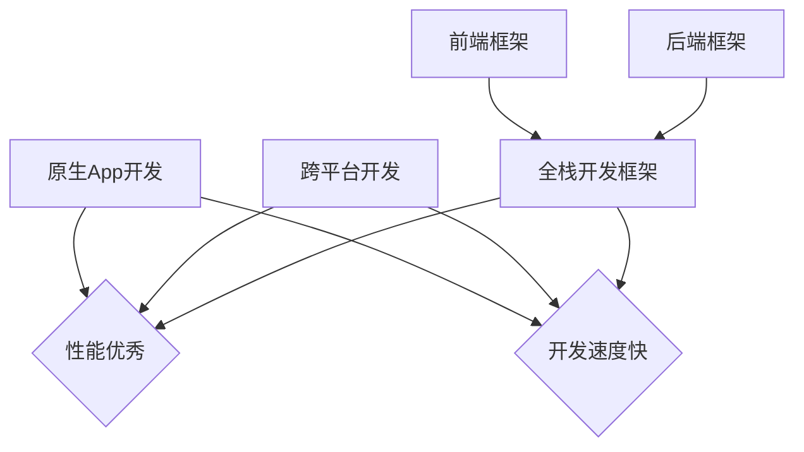

                 

关键词：移动端全栈开发、原生App、跨平台开发、全栈开发框架、性能优化、开发工具、应用场景、未来展望

> 摘要：本文将探讨移动端全栈开发的两种主要方案：原生App开发与跨平台开发。我们将从背景介绍、核心概念、算法原理、数学模型、项目实践、实际应用场景、工具和资源推荐等多个角度，深入剖析这两种方案的技术细节、优缺点以及未来发展趋势，旨在为广大开发者提供一条清晰、实用的全栈开发之路。

## 1. 背景介绍

随着智能手机的普及和移动互联网的快速发展，移动应用市场呈现出爆发式增长。据数据显示，截至2022年底，全球移动应用用户已超过30亿，移动应用市场规模达到数万亿美元。在这样的背景下，开发高质量的移动应用变得尤为重要。而全栈开发，作为一种能够同时掌握前端和后端技术的开发方式，越来越受到开发者的青睐。

全栈开发的优势在于能够降低项目成本、提高开发效率，使开发者能够更加专注于业务的实现。然而，在移动端全栈开发中，开发者面临的一个关键问题是如何在原生App与跨平台方案之间做出选择。原生App开发具有更好的性能和用户体验，但开发成本较高；而跨平台开发则具有较高的开发效率，但性能和用户体验相对较差。本文将详细探讨这两种方案，帮助开发者做出明智的选择。

## 2. 核心概念与联系

### 2.1 原生App开发

原生App开发是指使用原生语言（如Java、Objective-C、Swift等）为特定平台（如iOS、Android等）编写应用程序。这种开发方式能够充分利用平台特性，实现高性能和优秀用户体验。然而，原生App开发的缺点在于开发成本高、开发周期长。

### 2.2 跨平台开发

跨平台开发是指使用跨平台框架（如React Native、Flutter、UniApp等）编写应用程序，从而实现一次编写，多平台运行。这种开发方式能够提高开发效率，降低开发成本，但性能和用户体验相对较差。

### 2.3 全栈开发框架

全栈开发框架是指同时支持前端和后端开发的框架。常见的全栈开发框架包括Vue、React、Angular等。这些框架能够帮助开发者快速构建全栈应用，提高开发效率。

### 2.4 Mermaid 流程图



## 3. 核心算法原理 & 具体操作步骤

### 3.1 算法原理概述

在移动端全栈开发中，算法原理主要涉及以下几个方面：

1. 前端性能优化：包括页面渲染优化、资源加载优化、网络请求优化等。
2. 后端性能优化：包括数据库优化、缓存策略、服务器优化等。
3. 跨平台开发框架：如React Native、Flutter等框架的原理。
4. 原生App开发：包括iOS和Android平台的原生开发技术。

### 3.2 算法步骤详解

1. 前端性能优化：
   - 页面渲染优化：使用虚拟DOM、懒加载等技术。
   - 资源加载优化：使用CDN、图片压缩等技术。
   - 网络请求优化：使用HTTP/2、缓存等技术。

2. 后端性能优化：
   - 数据库优化：使用索引、分库分表等技术。
   - 缓存策略：使用Redis、Memcached等技术。
   - 服务器优化：使用Nginx、Apache等技术。

3. 跨平台开发框架：
   - React Native：使用JavaScript编写，实现原生组件。
   - Flutter：使用Dart语言编写，实现原生UI。

4. 原生App开发：
   - iOS：使用Swift或Objective-C编写。
   - Android：使用Java或Kotlin编写。

### 3.3 算法优缺点

1. 前端性能优化：
   - 优点：提高页面加载速度、降低服务器压力。
   - 缺点：需要一定的技术积累和经验。

2. 后端性能优化：
   - 优点：提高数据处理速度、降低系统延迟。
   - 缺点：需要投入较多的时间和精力。

3. 跨平台开发框架：
   - 优点：提高开发效率、降低开发成本。
   - 缺点：性能和用户体验相对较差。

4. 原生App开发：
   - 优点：性能优秀、用户体验好。
   - 缺点：开发成本高、开发周期长。

### 3.4 算法应用领域

1. 前端性能优化：广泛应用于各类移动端应用，如电商平台、社交媒体等。
2. 后端性能优化：广泛应用于大型企业应用、金融系统等。
3. 跨平台开发框架：广泛应用于初创企业、中小型企业。
4. 原生App开发：广泛应用于大型企业、高端应用。

## 4. 数学模型和公式 & 详细讲解 & 举例说明

### 4.1 数学模型构建

在移动端全栈开发中，常用的数学模型包括：

1. 页面渲染模型：包括渲染树构建、图层合成等。
2. 资源加载模型：包括HTTP请求、资源缓存等。
3. 网络请求模型：包括HTTP/2、WebSockets等。

### 4.2 公式推导过程

以页面渲染模型为例，其公式推导过程如下：

1. 渲染树构建时间 = 节点数量 × 节点渲染时间
2. 图层合成时间 = 图层数量 × 图层合成时间

### 4.3 案例分析与讲解

假设一个电商应用的页面，节点数量为100，节点渲染时间为0.1秒，图层数量为10，图层合成时间为0.05秒。根据上述公式，我们可以计算出：

1. 渲染树构建时间 = 100 × 0.1 = 10秒
2. 图层合成时间 = 10 × 0.05 = 0.5秒

因此，页面渲染总时间为10.5秒。通过优化页面渲染，如使用虚拟DOM、懒加载等技术，可以显著降低页面渲染时间。

## 5. 项目实践：代码实例和详细解释说明

### 5.1 开发环境搭建

以React Native为例，开发环境搭建步骤如下：

1. 安装Node.js
2. 安装React Native CLI
3. 创建一个新的React Native项目
4. 配置Android和iOS开发环境

### 5.2 源代码详细实现

以一个简单的电商应用为例，其源代码实现如下：

```jsx
// App.js
import React from 'react';
import { View, Text, Button } from 'react-native';

const App = () => {
  const handleClick = () => {
    // 请求后端接口，获取商品数据
  };

  return (
    <View style={{ flex: 1, justifyContent: 'center', alignItems: 'center' }}>
      <Text>Hello, React Native!</Text>
      <Button title="获取商品列表" onPress={handleClick} />
    </View>
  );
};

export default App;
```

### 5.3 代码解读与分析

以上代码是一个简单的React Native应用，主要包含以下部分：

1. 引入必要的React Native组件。
2. 定义一个名为`App`的组件，用于渲染页面。
3. 定义一个名为`handleClick`的方法，用于请求后端接口。

通过这个简单的实例，我们可以看到React Native开发的基本流程，包括页面布局、组件通信等。

### 5.4 运行结果展示

运行以上代码，在iOS和Android设备上，我们将看到一个包含文本和按钮的简单页面。点击按钮后，将请求后端接口，获取商品数据。

## 6. 实际应用场景

### 6.1 电商应用

电商应用是移动端全栈开发的一个重要应用场景。通过原生App开发，可以实现高性能、优秀用户体验的电商应用；而通过跨平台开发框架，可以快速搭建电商应用，提高开发效率。

### 6.2 社交媒体

社交媒体应用对性能和用户体验要求较高。原生App开发能够提供优秀的性能和用户体验，但开发成本较高；跨平台开发框架可以降低开发成本，但性能和用户体验相对较差。因此，在实际开发中，需要根据需求选择合适的开发方案。

### 6.3 金融应用

金融应用对性能和安全性要求较高。原生App开发能够提供高性能和安全保障，但开发成本较高；跨平台开发框架可以降低开发成本，但性能和安全性相对较差。在实际开发中，需要根据业务需求和成本预算，选择合适的开发方案。

## 7. 工具和资源推荐

### 7.1 学习资源推荐

1. 《React Native开发实战》
2. 《Flutter实战：Dart语言与Flutter框架》
3. 《移动Web开发指南》

### 7.2 开发工具推荐

1. Android Studio
2. Xcode
3. React Native CLI
4. Flutter SDK

### 7.3 相关论文推荐

1. "React Native: A Framework for Building Native Apps with JavaScript"
2. "Flutter: Building Native Apps with Dart"
3. "Performance Analysis of Cross-platform Mobile Application Frameworks"

## 8. 总结：未来发展趋势与挑战

### 8.1 研究成果总结

移动端全栈开发在近年来取得了显著成果。原生App开发在性能和用户体验方面具有优势，但开发成本较高；跨平台开发框架在开发效率和成本方面具有优势，但性能和用户体验相对较差。随着技术的不断发展，未来移动端全栈开发将更加成熟。

### 8.2 未来发展趋势

1. 跨平台开发框架将继续发展，成为移动端全栈开发的的主流选择。
2. 原生开发技术将不断进步，提高开发效率和性能。
3. 混合式开发模式将得到广泛应用，结合原生和跨平台开发的优点。

### 8.3 面临的挑战

1. 性能优化：如何提高跨平台开发框架的性能，接近原生App。
2. 安全性：如何保障移动端应用的安全，防止数据泄露。
3. 开发成本：如何降低开发成本，提高开发效率。

### 8.4 研究展望

移动端全栈开发在未来的发展中，需要重点关注以下几个方面：

1. 性能优化：研究新的性能优化技术，提高跨平台开发框架的性能。
2. 安全性：研究安全防护技术，保障移动端应用的安全。
3. 开发工具：研究开发工具的自动化、智能化，提高开发效率。

## 9. 附录：常见问题与解答

### 9.1 什么是原生App开发？

原生App开发是指使用原生语言（如Java、Objective-C、Swift等）为特定平台（如iOS、Android等）编写应用程序。

### 9.2 跨平台开发有哪些优点？

跨平台开发的主要优点包括：

1. 提高开发效率：一次编写，多平台运行，降低开发成本。
2. 简化开发流程：使用跨平台框架，简化开发流程，降低开发难度。
3. 资源共享：跨平台开发框架能够共享代码，降低维护成本。

### 9.3 原生App开发和跨平台开发如何选择？

根据项目需求、成本预算、开发周期等因素综合考虑。如果对性能和用户体验有较高要求，可以选择原生App开发；如果需要快速开发、降低成本，可以选择跨平台开发框架。

### 9.4 如何优化移动端应用的性能？

1. 前端性能优化：使用虚拟DOM、懒加载、资源压缩等技术。
2. 后端性能优化：使用缓存、数据库优化、服务器优化等技术。
3. 网络优化：使用HTTP/2、WebSockets等技术。

### 9.5 如何保障移动端应用的安全？

1. 数据加密：使用HTTPS、数据加密等技术，保障数据传输安全。
2. 防护措施：使用防火墙、反病毒软件等，防止恶意攻击。
3. 安全测试：进行安全测试，及时发现并修复漏洞。

---

本文由禅与计算机程序设计艺术 / Zen and the Art of Computer Programming 撰写，旨在为广大开发者提供一条清晰、实用的移动端全栈开发之路。在未来的发展中，我们将继续关注移动端全栈开发的最新动态，为广大开发者带来更多有价值的内容。感谢您的阅读！
----------------------------------------------------------------

