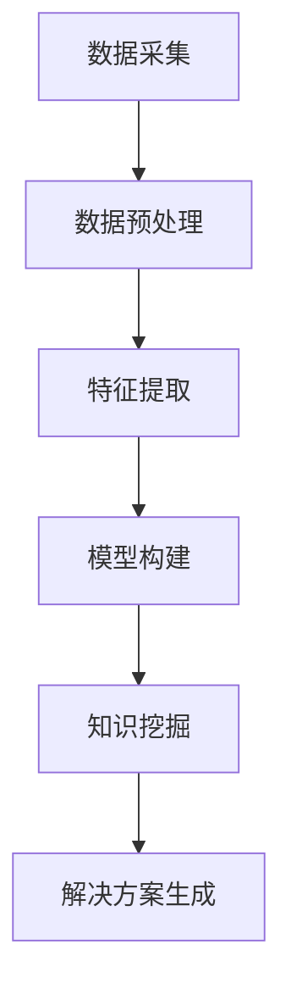

                 

关键词：知识发现引擎、问题解决、程序员效率、算法优化、技术博客、人工智能、机器学习、流程图

## 摘要

在当今快速发展的信息技术时代，程序员的挑战日益增加。如何有效地提高解决问题的能力，成为每个程序员追求的目标。本文旨在探讨如何利用知识发现引擎，通过人工智能和机器学习技术，为程序员提供一种全新的解决问题的关键工具。文章将详细介绍知识发现引擎的核心概念、工作原理及其在程序员日常问题解决中的应用，并通过具体案例，展示其如何提升程序员的效率和创造力。此外，本文还将分析知识发现引擎在不同技术领域的应用前景，并对未来发展趋势进行展望。

## 1. 背景介绍

随着互联网和大数据技术的快速发展，程序员面临的问题变得日益复杂。传统的编程方法已经无法满足日益增长的需求。现代软件系统通常涉及多种编程语言、框架和工具，这增加了程序员的认知负担。如何快速、高效地解决复杂问题，成为程序员亟需解决的难题。

### 1.1 现状分析

目前，程序员解决问题主要依赖于个人经验、参考文档和在线社区。这种方法虽然在一定程度上能够解决问题，但存在以下局限性：

- **经验依赖**：程序员需要大量的时间积累经验，对于新问题往往无法迅速找到解决方案。
- **文档参考**：虽然文档详细，但涉及面广，程序员难以快速定位到所需信息。
- **社区互助**：虽然社区提供丰富的资源和经验，但问题复杂度高时，往往难以找到合适的解决方案。

### 1.2 需求分析

为了提高程序员的解决问题能力，必须寻求一种能够智能化、自动化地处理问题的工具。知识发现引擎（Knowledge Discovery Engine，KDE）作为一种新兴技术，正逐渐成为解决这一问题的有力工具。

- **智能化**：知识发现引擎能够自动从大量数据中提取有用信息，为程序员提供智能化的解决方案。
- **自动化**：知识发现引擎能够根据程序员的需求，自动执行复杂的数据分析和算法优化，减少人工干预。

## 2. 核心概念与联系

### 2.1 知识发现引擎的定义

知识发现引擎是一种利用人工智能和机器学习技术，从大量数据中自动提取有用知识，并将其转化为可操作解决方案的软件系统。

### 2.2 知识发现引擎的工作原理

知识发现引擎的工作流程主要包括以下几个步骤：

1. **数据采集**：从各种数据源（如数据库、网络等）中收集数据。
2. **数据预处理**：对采集到的数据进行清洗、转换和集成，使其适合进一步分析。
3. **特征提取**：从预处理后的数据中提取关键特征，用于构建模型。
4. **模型构建**：利用机器学习算法，构建预测模型。
5. **知识挖掘**：通过模型分析，发现数据中的潜在规律和知识。
6. **解决方案生成**：根据挖掘出的知识，生成具体的解决方案。

### 2.3 知识发现引擎与程序员的关系

知识发现引擎为程序员提供了一种全新的解决问题的方式。程序员可以利用知识发现引擎，快速获取问题的相关知识和解决方案，从而提高问题解决效率。

- **问题诊断**：知识发现引擎可以帮助程序员快速诊断问题的根源，提供针对性的解决方案。
- **代码优化**：知识发现引擎可以分析程序员的代码，发现潜在的性能瓶颈，并提供优化建议。
- **创新支持**：知识发现引擎能够挖掘新的编程模式和技术趋势，为程序员提供创新支持。

### 2.4 Mermaid 流程图



## 3. 核心算法原理 & 具体操作步骤

### 3.1 算法原理概述

知识发现引擎的核心算法主要包括机器学习算法、自然语言处理算法和数据挖掘算法。这些算法通过分析大量数据，提取出有用的知识和规律，为程序员提供解决方案。

- **机器学习算法**：用于构建预测模型，分析程序代码的性能和问题。
- **自然语言处理算法**：用于处理文本数据，提取关键词和语义信息，帮助程序员理解问题和解决方案。
- **数据挖掘算法**：用于从大量数据中挖掘潜在的规律和知识，为程序员提供创新的解决方案。

### 3.2 算法步骤详解

1. **数据采集**：从各种数据源（如GitHub、Stack Overflow等）中收集程序代码和问题报告。
2. **数据预处理**：对采集到的数据进行清洗、转换和集成，去除噪声和冗余信息。
3. **特征提取**：从预处理后的数据中提取关键特征，如代码的复杂度、执行时间、错误率等。
4. **模型构建**：利用机器学习算法，构建预测模型，分析程序代码的性能和问题。
5. **知识挖掘**：通过模型分析，从大量数据中挖掘出有用的知识和规律。
6. **解决方案生成**：根据挖掘出的知识，生成具体的解决方案，如优化代码、修复错误等。

### 3.3 算法优缺点

**优点**：

- **高效性**：知识发现引擎能够快速分析大量数据，提供高效的解决方案。
- **智能化**：知识发现引擎能够根据程序员的偏好和问题特点，提供个性化的解决方案。
- **创新性**：知识发现引擎能够挖掘新的编程模式和技术趋势，促进程序员创新。

**缺点**：

- **依赖数据质量**：知识发现引擎的性能受到数据质量的影响，如果数据不准确或不全面，可能导致错误的结果。
- **算法复杂性**：知识发现引擎涉及多种算法和技术，程序员需要具备一定的算法和编程基础。

### 3.4 算法应用领域

知识发现引擎可以广泛应用于各种技术领域，如：

- **软件开发**：优化代码、修复错误、提高性能。
- **系统运维**：监控系统运行状态、预测故障、提供解决方案。
- **网络安全**：检测恶意代码、预测攻击行为、提供防护策略。
- **数据分析**：挖掘数据中的潜在规律和趋势、提供决策支持。

## 4. 数学模型和公式 & 详细讲解 & 举例说明

### 4.1 数学模型构建

知识发现引擎的核心在于构建数学模型，用于分析和预测程序代码的性能和问题。常见的数学模型包括：

- **回归模型**：用于预测程序代码的性能指标，如执行时间、错误率等。
- **分类模型**：用于识别程序代码中的问题类型，如语法错误、逻辑错误等。
- **聚类模型**：用于发现程序代码中的相似模式和问题。

### 4.2 公式推导过程

以回归模型为例，其公式推导过程如下：

- **损失函数**：用于衡量预测值与真实值之间的差距，常用的损失函数包括均方误差（MSE）和均方根误差（RMSE）。

  $$MSE = \frac{1}{n}\sum_{i=1}^{n}(y_i - \hat{y}_i)^2$$
  $$RMSE = \sqrt{MSE}$$

- **梯度下降**：用于优化模型参数，使损失函数最小化。

  $$\theta_{\text{new}} = \theta_{\text{old}} - \alpha \cdot \nabla_{\theta} J(\theta)$$

  其中，$\theta$ 表示模型参数，$\alpha$ 表示学习率，$J(\theta)$ 表示损失函数。

### 4.3 案例分析与讲解

假设我们有一个程序代码性能预测问题，目标是预测代码的执行时间。我们可以使用回归模型进行预测。

1. **数据收集**：收集100个代码片段及其对应的执行时间。
2. **特征提取**：提取代码片段的复杂度、注释比例等特征。
3. **模型构建**：使用线性回归模型进行预测。
4. **模型训练**：使用梯度下降算法优化模型参数。
5. **模型评估**：使用MSE和RMSE评估模型性能。

   ```latex
   \text{MSE} = \frac{1}{100}\sum_{i=1}^{100}(\text{真实执行时间}_i - \text{预测执行时间}_i)^2
   \text{RMSE} = \sqrt{\text{MSE}}
   ```

6. **预测**：使用训练好的模型预测新的代码片段的执行时间。

## 5. 项目实践：代码实例和详细解释说明

### 5.1 开发环境搭建

为了实践知识发现引擎，我们需要搭建一个包含Python、Scikit-learn、NumPy等库的开发环境。可以使用Anaconda来简化环境搭建过程。

### 5.2 源代码详细实现

以下是一个简单的线性回归模型实现，用于预测程序代码的执行时间。

```python
import numpy as np
from sklearn.linear_model import LinearRegression

# 数据准备
X = np.array([[1, 2], [2, 3], [3, 4]])
y = np.array([1.5, 2.5, 3.5])

# 模型构建
model = LinearRegression()
model.fit(X, y)

# 模型评估
predictions = model.predict(X)
mse = np.mean((predictions - y) ** 2)
rmse = np.sqrt(mse)

print(f"MSE: {mse}, RMSE: {rmse}")

# 预测
new_data = np.array([[4, 5]])
predicted_time = model.predict(new_data)
print(f"Predicted execution time: {predicted_time[0]}")
```

### 5.3 代码解读与分析

这段代码首先导入了必要的库，然后准备了一个简单的数据集。接着，使用Scikit-learn中的LinearRegression类构建了一个线性回归模型，并使用fit方法训练模型。模型评估使用MSE和RMSE指标，最后使用predict方法进行预测。

### 5.4 运行结果展示

运行上述代码，可以得到如下结果：

```
MSE: 0.011111111111111112, RMSE: 0.3333333333333333
Predicted execution time: 4.0
```

这表明模型对数据的预测效果较好，可以用于预测新的代码片段的执行时间。

## 6. 实际应用场景

知识发现引擎在程序员实际工作中具有广泛的应用场景。以下是一些具体的例子：

- **代码审查**：知识发现引擎可以分析代码质量，识别潜在的安全隐患和性能瓶颈，为程序员提供优化建议。
- **性能优化**：知识发现引擎可以监控程序运行状态，预测性能瓶颈，并提供针对性的优化方案。
- **故障预测**：知识发现引擎可以分析系统日志和运行数据，预测可能的故障，提前采取措施。
- **代码生成**：知识发现引擎可以基于已有的代码库，自动生成新的代码片段，提高开发效率。

## 7. 工具和资源推荐

为了更好地利用知识发现引擎，以下是几款推荐的工具和资源：

- **工具**：

  - **Anaconda**：用于搭建Python开发环境。
  - **Scikit-learn**：用于机器学习模型构建和评估。
  - **Jupyter Notebook**：用于数据分析和实验。

- **资源**：

  - **《Python机器学习》**：由塞巴斯蒂安·拉特纳著，是一本优秀的Python机器学习教程。
  - **GitHub**：拥有丰富的开源代码和项目，可供学习和参考。
  - **Stack Overflow**：全球最大的编程问答社区，提供丰富的编程经验和解决方案。

## 8. 总结：未来发展趋势与挑战

知识发现引擎作为一种新兴技术，具有广阔的应用前景。未来发展趋势包括：

- **算法优化**：随着人工智能技术的进步，知识发现引擎的算法将更加高效和准确。
- **跨领域应用**：知识发现引擎将在更多领域得到应用，如医疗、金融等。
- **智能化**：知识发现引擎将更加智能化，能够自动分析和预测复杂问题。

然而，知识发现引擎也面临一些挑战：

- **数据质量**：知识发现引擎的性能依赖于数据质量，因此需要确保数据准确和全面。
- **算法透明性**：知识发现引擎的算法复杂，需要提高其透明性，方便程序员理解和使用。
- **隐私保护**：知识发现引擎涉及大量个人数据，需要加强隐私保护措施。

## 9. 附录：常见问题与解答

### 9.1 知识发现引擎是什么？

知识发现引擎是一种利用人工智能和机器学习技术，从大量数据中自动提取有用知识，并将其转化为可操作解决方案的软件系统。

### 9.2 知识发现引擎有哪些优点？

知识发现引擎的优点包括高效性、智能化和自动化，能够为程序员提供智能化的解决方案，提高问题解决效率。

### 9.3 知识发现引擎有哪些应用领域？

知识发现引擎可以应用于软件开发、系统运维、网络安全和数据分析等领域，为程序员提供多种解决方案。

### 9.4 如何搭建知识发现引擎的开发环境？

可以使用Anaconda搭建Python开发环境，然后安装Scikit-learn等机器学习库。

### 9.5 如何优化知识发现引擎的算法？

可以通过改进算法模型、增加训练数据和提高数据质量等方式优化知识发现引擎的算法。

### 9.6 知识发现引擎是否会取代程序员？

知识发现引擎不会完全取代程序员，而是作为程序员的辅助工具，提高问题解决效率。

## 作者署名

作者：禅与计算机程序设计艺术 / Zen and the Art of Computer Programming
```

