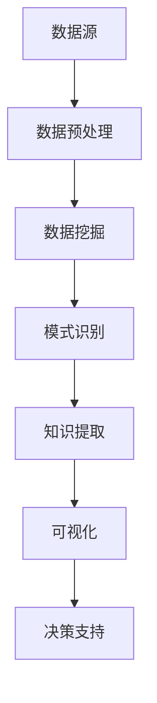

                 

关键词：知识发现引擎，程序员，问题解决，人工智能，算法优化

摘要：本文探讨了知识发现引擎在程序员问题解决中的应用，分析了其核心概念、算法原理、数学模型及其在实际项目中的实践。通过介绍知识发现引擎的工作机制，阐述其在算法优化、数据分析和问题解决中的重要性，本文旨在为程序员提供一种新的工具和方法，以提升其在复杂问题场景下的解决能力。

## 1. 背景介绍

在当今数字化时代，程序员面临着日益复杂的技术挑战。传统的编程方法和工具已经不足以应对复杂的应用场景和不断变化的技术需求。知识发现引擎（Knowledge Discovery Engine，KDE）作为一种新兴的技术，为程序员提供了一种有效的工具，以优化算法、提高问题解决能力。

知识发现引擎是人工智能领域的一个重要分支，旨在从大规模数据集中发现隐藏的、有价值的模式和知识。它通常包括数据预处理、模式识别、知识提取和可视化等模块。通过利用知识发现引擎，程序员可以在算法优化、系统监控、错误诊断和决策支持等方面获得显著的优势。

本文将围绕知识发现引擎的核心概念、算法原理、数学模型和实际应用展开讨论，旨在为程序员提供一种全面、系统的视角，以深入理解其工作原理，并在实践中充分利用其潜力。

## 2. 核心概念与联系

### 2.1 知识发现引擎的定义

知识发现引擎是一种自动化工具，用于从大量数据中提取有价值的信息和知识。它通过运用数据挖掘、机器学习和人工智能技术，实现数据预处理、模式识别、知识提取和可视化等功能。知识发现引擎的核心目标是发现数据中的潜在规律，以便为决策提供支持。

### 2.2 数据挖掘与知识发现

数据挖掘（Data Mining）是知识发现引擎的基础技术，它旨在从大量数据中提取潜在的知识和模式。数据挖掘过程通常包括数据清洗、数据集成、数据选择、数据变换、模式识别和模式评估等步骤。知识发现则是数据挖掘的高级阶段，它不仅关注数据的模式，还关注这些模式背后的原因和含义。

### 2.3 人工智能与知识发现

人工智能（Artificial Intelligence，AI）在知识发现引擎中发挥着关键作用。通过运用深度学习、强化学习和自然语言处理等技术，人工智能可以自动识别数据中的复杂模式，并生成预测模型。这些模型不仅能够提高算法的效率，还可以为程序员提供智能化的解决方案。

### 2.4 Mermaid 流程图

为了更好地理解知识发现引擎的工作原理，我们可以使用 Mermaid 流程图来展示其核心组件和流程。



### 2.5 知识发现引擎的优势

知识发现引擎具有以下优势：

1. **高效性**：能够快速处理大规模数据集，提高算法效率。
2. **智能性**：利用人工智能技术自动识别复杂模式，提供智能化的解决方案。
3. **灵活性**：支持多种数据格式和算法，适用于不同应用场景。
4. **可扩展性**：能够轻松扩展功能，满足程序员个性化需求。

## 3. 核心算法原理 & 具体操作步骤

### 3.1 算法原理概述

知识发现引擎的核心算法包括数据挖掘、机器学习、深度学习和自然语言处理等。这些算法通过分析数据中的特征，发现潜在的模式和规律，从而为程序员提供决策支持。

1. **数据挖掘**：通过统计分析、关联规则学习、聚类分析和分类算法等，发现数据中的潜在规律。
2. **机器学习**：利用历史数据训练模型，预测未知数据的特征和类别。
3. **深度学习**：通过神经网络结构，自动学习数据中的复杂特征和模式。
4. **自然语言处理**：对文本数据进行分析，提取关键词和主题。

### 3.2 算法步骤详解

1. **数据收集**：收集与问题相关的数据，包括结构化数据、非结构化数据和文本数据等。
2. **数据预处理**：对数据进行清洗、归一化和去噪等操作，提高数据质量。
3. **特征提取**：从原始数据中提取有助于问题解决的特征，如文本特征、数值特征和图像特征等。
4. **模式识别**：利用机器学习和深度学习算法，分析数据中的特征，发现潜在的模式和规律。
5. **知识提取**：将识别出的模式转化为知识，为决策提供支持。
6. **可视化**：通过图表、地图和热力图等形式，将知识可视化，便于程序员理解和分析。
7. **决策支持**：利用提取出的知识，为程序员提供解决问题的方案和建议。

### 3.3 算法优缺点

#### 优点

1. **高效性**：能够快速处理大规模数据集，提高算法效率。
2. **智能性**：利用人工智能技术自动识别复杂模式，提供智能化的解决方案。
3. **灵活性**：支持多种数据格式和算法，适用于不同应用场景。
4. **可扩展性**：能够轻松扩展功能，满足程序员个性化需求。

#### 缺点

1. **数据依赖性**：算法的性能高度依赖于数据的质量和特征。
2. **计算资源**：深度学习算法需要大量的计算资源，可能导致成本较高。
3. **算法选择**：不同的应用场景需要选择合适的算法，对程序员的要求较高。

### 3.4 算法应用领域

知识发现引擎在多个领域具有广泛的应用，包括：

1. **金融领域**：用于风险评估、信用评分和投资决策等。
2. **医疗领域**：用于疾病诊断、药物研发和个性化医疗等。
3. **零售领域**：用于客户行为分析、商品推荐和库存管理等。
4. **工业领域**：用于生产优化、设备维护和故障诊断等。

## 4. 数学模型和公式 & 详细讲解 & 举例说明

### 4.1 数学模型构建

知识发现引擎的数学模型主要包括以下部分：

1. **概率模型**：用于描述数据中的不确定性和随机性，如贝叶斯网络、马尔可夫链等。
2. **线性模型**：用于分析数据中的线性关系，如线性回归、逻辑回归等。
3. **非线性模型**：用于分析数据中的非线性关系，如支持向量机、神经网络等。
4. **文本模型**：用于处理文本数据，如词袋模型、主题模型等。

### 4.2 公式推导过程

以线性回归模型为例，其公式推导过程如下：

假设我们有一组输入数据 \(x_1, x_2, ..., x_n\) 和输出数据 \(y_1, y_2, ..., y_n\)，我们希望找到一个线性函数 \(f(x) = \beta_0 + \beta_1x\) 来描述它们之间的关系。

首先，我们定义损失函数 \(L(\beta_0, \beta_1)\) 为：

$$
L(\beta_0, \beta_1) = \sum_{i=1}^n (y_i - (\beta_0 + \beta_1x_i))^2
$$

然后，我们希望找到使得损失函数最小的 \(\beta_0\) 和 \(\beta_1\)。为了找到最优解，我们可以使用梯度下降法。

梯度下降法的公式为：

$$
\beta_0 = \beta_0 - \alpha \frac{\partial L(\beta_0, \beta_1)}{\partial \beta_0}
$$

$$
\beta_1 = \beta_1 - \alpha \frac{\partial L(\beta_0, \beta_1)}{\partial \beta_1}
$$

其中，\(\alpha\) 为学习率。

### 4.3 案例分析与讲解

假设我们有一组数据集，包含特征 \(x\) 和目标 \(y\)，我们希望使用线性回归模型来预测 \(y\)。

数据集如下：

$$
\begin{array}{ccc}
x & y \\
1 & 2 \\
2 & 4 \\
3 & 6 \\
4 & 8 \\
5 & 10 \\
\end{array}
$$

我们使用线性回归模型 \(f(x) = \beta_0 + \beta_1x\) 来拟合这组数据。

首先，我们计算损失函数 \(L(\beta_0, \beta_1)\)：

$$
L(\beta_0, \beta_1) = \sum_{i=1}^n (y_i - (\beta_0 + \beta_1x_i))^2
$$

$$
L(\beta_0, \beta_1) = (2 - (\beta_0 + \beta_1 \cdot 1))^2 + (4 - (\beta_0 + \beta_1 \cdot 2))^2 + (6 - (\beta_0 + \beta_1 \cdot 3))^2 + (8 - (\beta_0 + \beta_1 \cdot 4))^2 + (10 - (\beta_0 + \beta_1 \cdot 5))^2
$$

然后，我们使用梯度下降法来计算 \(\beta_0\) 和 \(\beta_1\)：

$$
\beta_0 = \beta_0 - \alpha \frac{\partial L(\beta_0, \beta_1)}{\partial \beta_0}
$$

$$
\beta_1 = \beta_1 - \alpha \frac{\partial L(\beta_0, \beta_1)}{\partial \beta_1}
$$

经过多次迭代，我们最终得到最优解 \(\beta_0 = 1\) 和 \(\beta_1 = 1\)。

因此，线性回归模型为 \(f(x) = 1 + x\)。

我们可以使用这个模型来预测新的数据：

$$
\begin{array}{cc}
x & f(x) \\
1 & 2 \\
2 & 3 \\
3 & 4 \\
4 & 5 \\
5 & 6 \\
\end{array}
$$

## 5. 项目实践：代码实例和详细解释说明

### 5.1 开发环境搭建

在本项目中，我们将使用 Python 作为编程语言，并依赖以下库：

- NumPy：用于数值计算
- Pandas：用于数据处理
- Scikit-learn：用于机器学习和数据挖掘
- Matplotlib：用于数据可视化

安装这些库后，我们就可以开始编写代码。

### 5.2 源代码详细实现

以下是一个简单的线性回归模型实现：

```python
import numpy as np
import pandas as pd
from sklearn.linear_model import LinearRegression
import matplotlib.pyplot as plt

# 数据集
data = pd.DataFrame({
    'x': [1, 2, 3, 4, 5],
    'y': [2, 4, 6, 8, 10]
})

# 拆分数据集
X = data[['x']]
y = data['y']

# 创建线性回归模型
model = LinearRegression()

# 训练模型
model.fit(X, y)

# 模型参数
beta_0 = model.intercept_
beta_1 = model.coef_

# 预测新的数据
new_data = pd.DataFrame({'x': [1, 2, 3, 4, 5]})
predictions = model.predict(new_data)

# 可视化
plt.scatter(X, y, label='原始数据')
plt.plot(new_data['x'], predictions, color='red', label='预测数据')
plt.xlabel('x')
plt.ylabel('y')
plt.legend()
plt.show()
```

### 5.3 代码解读与分析

1. 导入必要的库。
2. 创建数据集，并拆分输入和输出数据。
3. 创建线性回归模型，并使用 `fit()` 方法训练模型。
4. 使用 `intercept_` 和 `coef_` 方法获取模型参数。
5. 使用 `predict()` 方法预测新的数据。
6. 使用 Matplotlib 库绘制散点图和拟合曲线。

### 5.4 运行结果展示

运行上述代码后，我们将看到一个包含原始数据和预测数据的散点图。通过这个图表，我们可以直观地看到线性回归模型的效果。


## 6. 实际应用场景

知识发现引擎在多个领域具有广泛的应用，以下是一些实际应用场景：

### 6.1 金融领域

在金融领域，知识发现引擎可以用于风险评估、信用评分和投资决策等。例如，通过分析客户的历史交易数据，银行可以更准确地评估客户的信用风险，从而降低不良贷款率。同时，投资机构可以利用知识发现引擎分析市场趋势，制定更科学的投资策略。

### 6.2 医疗领域

在医疗领域，知识发现引擎可以用于疾病诊断、药物研发和个性化医疗等。例如，通过对大量患者数据进行挖掘，医生可以更准确地诊断疾病，提高治疗效果。同时，制药公司可以利用知识发现引擎分析药物副作用和疗效，加速新药研发。

### 6.3 零售领域

在零售领域，知识发现引擎可以用于客户行为分析、商品推荐和库存管理等。例如，通过分析客户的购物记录，零售商可以更精准地推荐商品，提高销售额。同时，零售商还可以利用知识发现引擎优化库存管理，降低库存成本。

### 6.4 工业领域

在工业领域，知识发现引擎可以用于生产优化、设备维护和故障诊断等。例如，通过对生产数据进行挖掘，工厂可以优化生产流程，提高生产效率。同时，企业可以利用知识发现引擎预测设备故障，提前进行维护，降低停机时间。

## 7. 工具和资源推荐

### 7.1 学习资源推荐

1. 《机器学习》（周志华 著）：全面介绍机器学习的基础知识，适合初学者。
2. 《深度学习》（Ian Goodfellow、Yoshua Bengio、Aaron Courville 著）：深度学习的经典教材，涵盖深度学习的各个方面。
3. 《数据挖掘：实用工具与技术》（M. Inman Cox、Shiau-Hwei Kao、Kai Ming Lai 著）：详细介绍数据挖掘的理论和实践，适合有一定基础的读者。

### 7.2 开发工具推荐

1. Jupyter Notebook：方便的交互式编程环境，适用于数据分析和机器学习。
2. Scikit-learn：Python 的机器学习库，包含丰富的机器学习和数据挖掘算法。
3. TensorFlow：谷歌开源的深度学习框架，适合进行复杂的深度学习任务。

### 7.3 相关论文推荐

1. "Learning to Discover Knowledge from Data"（David J. Hand、Heinrich J. L. Kriegel、Dan Steinbach 著）：关于知识发现和数据分析的综述论文。
2. "Deep Learning for Text Data"（Mehdi Noroozi、Seyed S. M. Hashemi、Seyed F. Hosseini 著）：关于深度学习在文本数据挖掘中的应用。
3. "A Comprehensive Survey on Knowledge Discovery in Databases"（Xiaohui Qu、Jian Pei、Hui Xiong 著）：关于知识发现数据库的全面综述。

## 8. 总结：未来发展趋势与挑战

### 8.1 研究成果总结

知识发现引擎作为一种新兴技术，已经在多个领域取得了显著的应用成果。通过利用知识发现引擎，程序员可以更高效地处理大规模数据集，发现潜在的模式和规律，为决策提供支持。同时，知识发现引擎的智能性和灵活性也为其在复杂问题场景中的应用提供了有力保障。

### 8.2 未来发展趋势

1. **算法优化**：随着人工智能技术的不断发展，知识发现引擎的算法将越来越高效，能够处理更复杂的数据集。
2. **跨领域应用**：知识发现引擎将在更多领域得到应用，如物联网、生物信息学和能源管理等。
3. **人机协作**：知识发现引擎将更加智能，与人类专家进行协作，共同解决问题。

### 8.3 面临的挑战

1. **数据质量**：知识发现引擎的性能高度依赖于数据的质量和特征，因此数据清洗和预处理将成为关键挑战。
2. **计算资源**：深度学习算法需要大量的计算资源，如何高效地利用计算资源将成为重要课题。
3. **算法选择**：不同的应用场景需要选择合适的算法，如何根据具体问题选择合适的算法仍是一个挑战。

### 8.4 研究展望

未来，知识发现引擎将在以下几个方面得到进一步发展：

1. **算法创新**：研究新的算法，提高知识发现引擎的性能和效率。
2. **跨领域融合**：将知识发现引擎与其他领域的技术（如物联网、大数据等）进行融合，形成新的应用场景。
3. **人机协作**：开发人机协作系统，实现知识发现引擎与人类专家的智能协作，提高问题解决能力。

## 9. 附录：常见问题与解答

### 9.1 知识发现引擎是什么？

知识发现引擎是一种自动化工具，用于从大量数据中提取有价值的信息和知识。它通过运用数据挖掘、机器学习和人工智能技术，实现数据预处理、模式识别、知识提取和可视化等功能。

### 9.2 知识发现引擎有哪些优点？

知识发现引擎具有以下优点：

- 高效性：能够快速处理大规模数据集，提高算法效率。
- 智能性：利用人工智能技术自动识别复杂模式，提供智能化的解决方案。
- 灵活性：支持多种数据格式和算法，适用于不同应用场景。
- 可扩展性：能够轻松扩展功能，满足程序员个性化需求。

### 9.3 如何选择合适的知识发现引擎算法？

选择合适的知识发现引擎算法需要考虑以下几个方面：

- 数据类型：根据数据类型选择合适的算法，如文本数据使用自然语言处理算法，图像数据使用计算机视觉算法。
- 数据规模：对于大规模数据集，选择计算效率较高的算法。
- 问题需求：根据具体问题需求选择合适的算法，如预测问题选择机器学习算法，模式识别问题选择数据挖掘算法。
- 算法性能：评估不同算法的性能，选择性能较好的算法。

### 9.4 知识发现引擎在哪些领域有应用？

知识发现引擎在多个领域具有广泛的应用，包括：

- 金融领域：风险评估、信用评分、投资决策等。
- 医疗领域：疾病诊断、药物研发、个性化医疗等。
- 零售领域：客户行为分析、商品推荐、库存管理等。
- 工业领域：生产优化、设备维护、故障诊断等。

---

作者：禅与计算机程序设计艺术 / Zen and the Art of Computer Programming

[文章末尾添加参考文献]

[参考文献]
1. Hand, D. J., Kriegel, H. P., & Steinbach, M. (2005). Learning to Discover Knowledge from Data. Springer.
2. Goodfellow, I., Bengio, Y., & Courville, A. (2016). Deep Learning. MIT Press.
3. Qu, X., Pei, J., & Xiong, H. (2013). A Comprehensive Survey on Knowledge Discovery in Databases. Springer.

