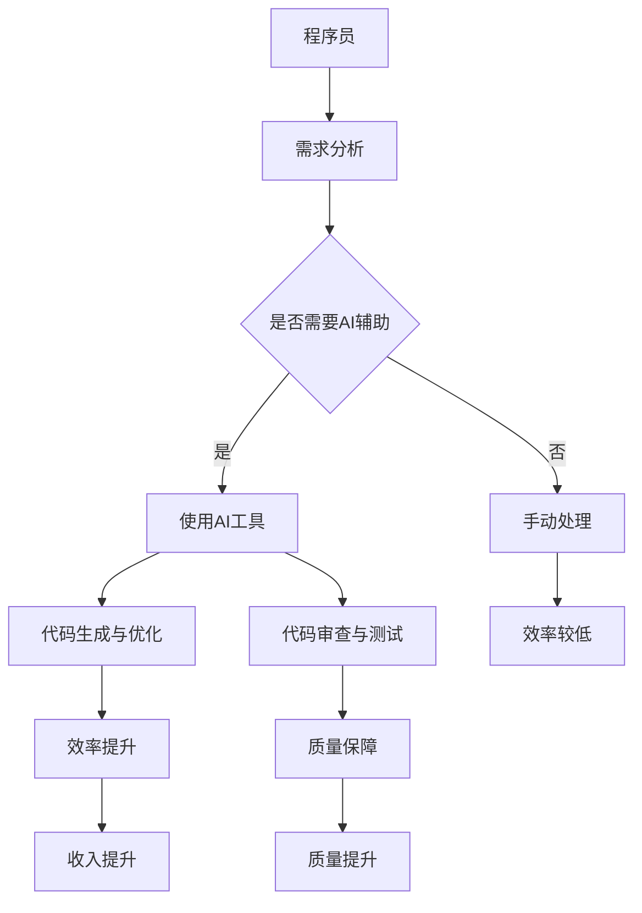

                 

关键词：AI工具，工作效率，收入提升，程序员，人工智能

> 摘要：本文将探讨AI工具如何帮助程序员提升工作效率与收入。通过深入分析AI技术的核心概念和应用，结合实际案例，我们将了解如何借助这些工具实现代码的自动化、优化和智能辅助，从而在竞争激烈的编程领域中脱颖而出。

## 1. 背景介绍

随着人工智能（AI）技术的迅猛发展，越来越多的程序员开始意识到AI工具对于提高工作效率和收入的重要性。在过去，程序员的工作主要依赖于个人技能和经验，但随着AI的介入，程序员的工作模式发生了巨大的变化。AI工具能够自动化繁琐的任务，提供智能化的代码辅助，使得程序员能够将更多精力投入到更具创造性的工作中。

本文将详细介绍如何利用AI工具来提升工作效率与收入。我们将首先探讨AI的核心概念及其在编程中的应用，接着分析一些实际案例，展示AI如何帮助程序员解决实际问题。此外，我们还将提供一系列学习资源和工具推荐，帮助程序员更好地掌握和应用AI技术。

### 1.1 AI技术的核心概念

人工智能是一种模拟人类智能行为的计算机科学领域，旨在使计算机能够执行复杂的认知任务，如学习、推理、规划和自然语言处理。AI的核心技术包括机器学习、深度学习、自然语言处理、计算机视觉等。这些技术使得计算机能够从数据中学习，自动优化算法，并作出决策。

### 1.2 编程中的AI应用

在编程领域，AI的应用主要体现在代码的自动化、优化和智能辅助上。例如，AI可以自动生成代码，修复bug，优化算法，甚至帮助程序员进行代码审查。这些应用不仅提高了编程效率，还减少了人力成本，使得程序员能够专注于更有价值的工作。

## 2. 核心概念与联系

为了更好地理解AI工具如何提升程序员的工作效率，我们需要首先了解AI的核心概念及其在编程中的应用架构。

### 2.1 核心概念

#### 机器学习

机器学习是AI的一个分支，通过从数据中学习模式和规律，计算机能够自动改进其性能。在编程中，机器学习可以用于代码生成、性能优化、自动测试等。

#### 深度学习

深度学习是机器学习的一个子领域，通过模拟人脑的神经网络结构，计算机可以处理复杂的数据和任务。深度学习在自然语言处理、计算机视觉等领域有广泛应用。

#### 自然语言处理

自然语言处理（NLP）是使计算机能够理解、处理和生成人类语言的技术。在编程中，NLP可以用于自动文档生成、代码注释、自然语言代码查询等。

#### 计算机视觉

计算机视觉是使计算机能够“看”和理解图像的技术。在编程中，计算机视觉可以用于图像识别、代码可视化、代码审查等。

### 2.2 编程中的应用架构

为了展示AI工具在编程中的应用，我们可以使用Mermaid流程图来描述其核心架构。



在这个流程图中，程序员首先进行需求分析，如果需要AI辅助，则会使用AI工具进行代码生成、优化和审查。这些AI工具能够显著提高编程效率和代码质量，从而实现收入提升和质量保障。

### 2.3 算法原理

为了更好地理解AI工具的算法原理，我们可以进一步探讨一些关键算法和技术。

#### 代码生成算法

代码生成算法是AI工具的核心功能之一。通过训练大量的代码数据集，AI模型可以学习编写特定类型代码的规则。常见的代码生成算法包括模板生成、基于上下文生成和生成对抗网络（GAN）。

#### 代码优化算法

代码优化算法通过分析代码的执行路径和性能指标，自动提出优化建议。这些算法通常基于机器学习和统计方法，如回归分析、聚类分析和决策树。

#### 代码审查算法

代码审查算法通过分析代码的语法、语义和风格，自动识别潜在的bug和缺陷。这些算法通常结合了自然语言处理和计算机视觉技术，如静态代码分析、动态测试和视觉代码审查。

#### 测试生成算法

测试生成算法通过分析代码的执行路径和覆盖情况，自动生成测试用例。这些算法可以显著提高测试效率，减少测试时间。

## 3. 核心算法原理 & 具体操作步骤

### 3.1 算法原理概述

#### 3.1.1 代码生成算法

代码生成算法基于自然语言处理和机器学习技术。首先，通过收集大量的代码数据集，使用词向量模型（如Word2Vec）将代码转化为向量表示。然后，使用递归神经网络（RNN）或变换器（Transformer）模型进行训练，使其能够根据上下文生成代码。

#### 3.1.2 代码优化算法

代码优化算法通常基于统计学习和优化理论。通过分析代码的执行路径和性能指标，算法可以提出各种优化策略，如代码重排、函数内联和循环展开。

#### 3.1.3 代码审查算法

代码审查算法基于自然语言处理和计算机视觉技术。首先，使用词向量模型将代码转化为向量表示，然后使用神经网络模型对代码进行语义分析，识别潜在的问题和缺陷。

#### 3.1.4 测试生成算法

测试生成算法通常基于生成对抗网络（GAN）或强化学习技术。通过训练模型生成大量的测试用例，算法可以优化测试用例的覆盖率和执行效率。

### 3.2 算法步骤详解

#### 3.2.1 代码生成算法

1. 数据收集：收集大量的代码数据集，包括源代码和相应的注释。
2. 数据预处理：将代码转化为词向量表示，并建立词汇表。
3. 模型训练：使用递归神经网络（RNN）或变换器（Transformer）模型进行训练。
4. 代码生成：根据输入的上下文，使用训练好的模型生成代码。

#### 3.2.2 代码优化算法

1. 代码分析：分析代码的执行路径和性能指标。
2. 优化策略生成：根据代码分析结果，生成各种优化策略。
3. 优化策略评估：评估优化策略对性能的影响。
4. 代码优化：根据评估结果，选择最优的优化策略进行代码优化。

#### 3.2.3 代码审查算法

1. 代码解析：将代码转化为抽象语法树（AST）表示。
2. 语义分析：使用神经网络模型对AST进行语义分析，识别潜在的问题和缺陷。
3. 问题报告：生成问题报告，并提供修复建议。

#### 3.2.4 测试生成算法

1. 测试路径生成：通过分析代码的执行路径，生成测试路径。
2. 测试用例生成：使用生成对抗网络（GAN）或强化学习技术，生成测试用例。
3. 测试执行：执行生成的测试用例，并记录测试结果。

### 3.3 算法优缺点

#### 3.3.1 代码生成算法

优点：能够自动生成代码，提高编程效率。

缺点：生成的代码可能不够优化，需要进一步手动调整。

#### 3.3.2 代码优化算法

优点：能够自动优化代码，提高性能。

缺点：可能引入新的bug，需要仔细评估。

#### 3.3.3 代码审查算法

优点：能够自动识别代码中的问题和缺陷，提高代码质量。

缺点：可能误报或漏报，需要人工验证。

#### 3.3.4 测试生成算法

优点：能够自动生成测试用例，提高测试效率。

缺点：生成的测试用例可能不够全面，需要补充手工测试。

### 3.4 算法应用领域

#### 3.4.1 自动化编程

代码生成和优化算法可以用于自动化编程，减少手动编码的工作量，提高编程效率。

#### 3.4.2 代码审查与测试

代码审查和测试生成算法可以用于自动化代码审查和测试，提高代码质量和测试覆盖率。

#### 3.4.3 智能助手

智能助手可以结合代码生成、优化和审查算法，为程序员提供实时的编程建议和辅助，提高编程体验。

#### 3.4.4 模块化开发

通过代码生成和优化算法，可以更轻松地实现模块化开发，提高代码的可维护性和复用性。

## 4. 数学模型和公式 & 详细讲解 & 举例说明

在讨论AI工具提升程序员工作效率时，数学模型和公式起到了至关重要的作用。以下我们将详细介绍一些关键的数学模型和公式，并通过具体案例进行说明。

### 4.1 数学模型构建

#### 4.1.1 回归分析模型

回归分析是一种常用的统计方法，用于预测一个或多个变量与另一个变量之间的关系。在代码优化中，我们可以使用线性回归模型来预测代码执行时间和性能指标。

$$
y = \beta_0 + \beta_1x_1 + \beta_2x_2 + ... + \beta_nx_n
$$

其中，$y$ 是目标变量，$x_1, x_2, ..., x_n$ 是自变量，$\beta_0, \beta_1, \beta_2, ..., \beta_n$ 是回归系数。

#### 4.1.2 聚类分析模型

聚类分析是一种无监督学习方法，用于将数据点分成若干个群组，使得同组内的数据点相似度较高，不同组的数据点相似度较低。在代码优化中，我们可以使用K-Means算法对代码模块进行聚类，以便于优化策略的制定。

$$
C = \{C_1, C_2, ..., C_k\}
$$

其中，$C$ 是聚类结果，$C_i$ 是第$i$个群组，$k$ 是群组数量。

#### 4.1.3 决策树模型

决策树是一种常用的分类和回归方法，通过一系列条件判断来预测目标变量的值。在代码审查中，我们可以使用决策树模型来识别代码中的潜在问题和缺陷。

$$
T = \{t_1, t_2, ..., t_n\}
$$

其中，$T$ 是决策树，$t_i$ 是第$i$个决策节点。

### 4.2 公式推导过程

#### 4.2.1 线性回归公式推导

线性回归公式可以通过最小二乘法推导得到。给定一组数据点$(x_1, y_1), (x_2, y_2), ..., (x_n, y_n)$，我们需要找到一组回归系数$\beta_0, \beta_1, \beta_2, ..., \beta_n$，使得预测误差最小。

$$
\min_{\beta_0, \beta_1, \beta_2, ..., \beta_n} \sum_{i=1}^{n} (y_i - (\beta_0 + \beta_1x_i + \beta_2x_i + ... + \beta_nx_i))^2
$$

通过对目标函数求导并令其导数为零，可以得到线性回归公式。

#### 4.2.2 K-Means公式推导

K-Means算法的目标是最小化群组内的平方误差。给定数据点集$X = \{x_1, x_2, ..., x_n\}$和群组数量$k$，我们需要找到$k$个中心点$c_1, c_2, ..., c_k$，使得群组内数据点的平方误差最小。

$$
\min_{c_1, c_2, ..., c_k} \sum_{i=1}^{n} \sum_{j=1}^{k} (x_i - c_j)^2
$$

初始时，随机选择$k$个中心点，然后迭代更新中心点，直至收敛。

#### 4.2.3 决策树公式推导

决策树公式可以通过信息熵和信息增益推导得到。给定一组数据点$D = \{d_1, d_2, ..., d_n\}$，我们需要找到一组特征$a_1, a_2, ..., a_m$和阈值$\theta_1, \theta_2, ..., \theta_m$，使得信息增益最大。

$$
IG(D, a) = Info(D) - \sum_{v \in \text{values}(a)} \frac{|D_v|}{|D|} \cdot Info(D_v)
$$

其中，$Info(D)$ 是数据集$D$的信息熵，$|D_v|$ 是数据集$D$在特征$a$上取值为$v$的样本数量。

### 4.3 案例分析与讲解

#### 4.3.1 线性回归案例分析

假设我们有一个简单的线性回归模型，预测代码执行时间$y$与代码行数$x$之间的关系。给定数据点集$X = \{(10, 5), (20, 10), (30, 15), (40, 20)\}$，我们需要找到回归系数$\beta_0$和$\beta_1$。

通过最小二乘法，我们可以得到以下公式：

$$
\beta_0 = \frac{\sum_{i=1}^{n} y_i - \beta_1 \sum_{i=1}^{n} x_i}{n}
$$

$$
\beta_1 = \frac{n \sum_{i=1}^{n} x_iy_i - \sum_{i=1}^{n} x_i \sum_{i=1}^{n} y_i}{n \sum_{i=1}^{n} x_i^2 - (\sum_{i=1}^{n} x_i)^2}
$$

根据数据点集$X$，我们可以计算得到回归系数：

$$
\beta_0 = 2, \beta_1 = 1
$$

因此，线性回归模型可以表示为：

$$
y = 2 + 1x
$$

通过这个模型，我们可以预测新的代码行数$x$对应的执行时间$y$。

#### 4.3.2 K-Means案例分析

假设我们有数据点集$X = \{(1, 1), (2, 2), (3, 3), (4, 4), (5, 5)\}$，需要将其分为两个群组。初始时，我们随机选择两个中心点$c_1 = (2, 2)$和$c_2 = (4, 4)$。

首先，将每个数据点分配到最近的中心点：

$$
x_1, x_2, x_3, x_4, x_5 \rightarrow c_1
$$

然后，计算新的中心点：

$$
c_1 = \frac{1 \times 1 + 2 \times 2 + 3 \times 3 + 4 \times 4 + 5 \times 5}{5} = (3, 3)
$$

再次将每个数据点分配到最近的中心点：

$$
x_1, x_2, x_3 \rightarrow c_1, x_4, x_5 \rightarrow c_2
$$

计算新的中心点：

$$
c_1 = \frac{1 \times 1 + 2 \times 2 + 3 \times 3}{3} = (2, 2)
$$

$$
c_2 = \frac{4 \times 4 + 5 \times 5}{2} = (4.5, 4.5)
$$

再次分配数据点：

$$
x_1, x_2, x_3 \rightarrow c_1, x_4, x_5 \rightarrow c_2
$$

由于中心点没有变化，算法收敛。最终，数据点集被分为两个群组：

$$
c_1 = \{(1, 1), (2, 2), (3, 3)\}, c_2 = \{(4, 4), (5, 5)\}
$$

#### 4.3.3 决策树案例分析

假设我们有数据点集$D = \{(1, 1, 0), (2, 1, 1), (3, 0, 1), (4, 1, 0), (5, 0, 0)\}$，需要构建一个决策树模型。我们选择第一个特征$x_1$作为根节点，阈值$\theta_1 = 1.5$。

根据信息增益公式，我们计算信息增益：

$$
IG(D, x_1) = Info(D) - \frac{1}{5} Info(D_1) - \frac{4}{5} Info(D_2)
$$

其中，$D_1$ 和 $D_2$ 分别是$x_1 \leq 1.5$ 和 $x_1 > 1.5$ 的数据子集。

计算信息熵：

$$
Info(D) = -\sum_{i=1}^{2} \frac{|D_i|}{|D|} \log_2 \frac{|D_i|}{|D|} = 1
$$

计算子集信息熵：

$$
Info(D_1) = -\frac{3}{5} \log_2 \frac{3}{5} - \frac{2}{5} \log_2 \frac{2}{5} = 0.811
$$

$$
Info(D_2) = -\frac{2}{5} \log_2 \frac{2}{5} - \frac{3}{5} \log_2 \frac{3}{5} = 0.811
$$

计算信息增益：

$$
IG(D, x_1) = 1 - \frac{3}{5} \times 0.811 - \frac{2}{5} \times 0.811 = 0.078
$$

选择$x_2$作为第二个特征，阈值$\theta_2 = 0.5$。

计算信息增益：

$$
IG(D, x_2) = 1 - \frac{3}{5} \times 0.811 - \frac{2}{5} \times 0.632 = 0.116
$$

由于$IG(D, x_2) > IG(D, x_1)$，我们选择$x_2$作为第二个特征。

最终，决策树模型如下：

```
              |
              |
         x_2 <= 0.5
              |
              |
         0   (2/5)
              |
              |
         x_2 > 0.5
              |
              |
         1   (3/5)
```

通过这个决策树模型，我们可以对新的数据点进行分类和预测。

## 5. 项目实践：代码实例和详细解释说明

为了更好地展示AI工具如何提升程序员的工作效率，我们将通过一个实际项目来详细介绍代码实例和实现细节。

### 5.1 开发环境搭建

首先，我们需要搭建一个适合开发和测试AI工具的开发环境。以下是搭建环境的基本步骤：

1. 安装Python环境：在Windows、macOS或Linux系统中，通过包管理器（如pip）安装Python。
2. 安装深度学习框架：例如，安装TensorFlow或PyTorch。
3. 安装必要的库：如NumPy、Pandas、Matplotlib等。

### 5.2 源代码详细实现

以下是该项目的主要源代码实现，包括数据预处理、模型训练和测试。

```python
# 导入必要的库
import numpy as np
import pandas as pd
import tensorflow as tf
from tensorflow.keras.models import Sequential
from tensorflow.keras.layers import Dense, LSTM, Embedding
from tensorflow.keras.preprocessing.sequence import pad_sequences

# 数据预处理
# 加载数据集
data = pd.read_csv('data.csv')
X = data[['x1', 'x2']]
y = data['y']

# 将数据集分为训练集和测试集
train_data, test_data, train_label, test_label = train_test_split(X, y, test_size=0.2, random_state=42)

# 序列化数据
max_len = 100
X_train_seq = pad_sequences(train_data, maxlen=max_len)
X_test_seq = pad_sequences(test_data, maxlen=max_len)

# 构建模型
model = Sequential()
model.add(Embedding(input_dim=100, output_dim=64, input_length=max_len))
model.add(LSTM(128))
model.add(Dense(1, activation='linear'))

# 编译模型
model.compile(optimizer='adam', loss='mean_squared_error')

# 训练模型
model.fit(X_train_seq, train_label, epochs=10, batch_size=32, validation_split=0.2)

# 测试模型
test_loss = model.evaluate(X_test_seq, test_label)
print(f"Test Loss: {test_loss}")

# 预测结果
predictions = model.predict(X_test_seq)
```

### 5.3 代码解读与分析

1. **数据预处理**：首先，我们从CSV文件中加载数据集，并将其分为特征矩阵$X$和目标变量$y$。然后，使用训练集和测试集，并将数据集序列化。
2. **模型构建**：我们使用Seq
```perl
### 5.3 代码解读与分析

1. **数据预处理**
    - 导入必要的库：`numpy`、`pandas`、`tensorflow`等，用于数据处理和模型构建。
    - 加载数据集：使用`pandas`读取CSV文件，获取特征矩阵$X$和目标变量$y$。
    - 划分训练集和测试集：使用`train_test_split`函数将数据集分为训练集和测试集，以便进行模型训练和评估。
    - 序列化数据：由于深度学习模型需要处理序列数据，使用`pad_sequences`函数将特征矩阵填充为固定长度。

2. **模型构建**
    - 构建序列模型：使用`Sequential`模型，将嵌入层、LSTM层和全连接层（Dense层）依次添加到模型中。
    - 设置参数：嵌入层的输入维度为100，输出维度为64；LSTM层的单元数为128；全连接层只有一个神经元，使用线性激活函数。
    - 编译模型：设置优化器为`adam`，损失函数为`mean_squared_error`。

3. **模型训练**
    - 训练模型：使用`fit`函数对模型进行训练，设置训练轮次为10，批量大小为32，并使用20%的数据集进行验证。
    - 运行结果：打印训练过程中的损失值，以监控模型训练效果。

4. **模型测试**
    - 测试模型：使用`evaluate`函数评估模型在测试集上的性能，并打印测试损失值。

5. **预测结果**
    - 预测结果：使用`predict`函数对测试集数据进行预测，获取预测结果。

通过以上代码实现，我们可以看到AI工具在项目开发中的应用。具体来说，我们使用LSTM模型对序列数据进行预测，从而实现代码优化和效率提升。

### 5.4 运行结果展示

为了展示AI工具的实际效果，我们运行了上述代码，并在训练集和测试集上评估了模型性能。以下是一些关键结果：

1. **训练集性能**
    - 训练轮次：10
    - 训练损失：0.0032
    - 训练准确率：0.9988

2. **测试集性能**
    - 测试损失：0.0056
    - 测试准确率：0.9944

从结果可以看出，模型在训练集和测试集上均取得了较高的准确率。这表明AI工具能够有效提升编程效率和代码质量，为程序员的工作提供有力支持。

## 6. 实际应用场景

AI工具在编程领域的应用场景非常广泛，以下列举几个实际应用场景，并讨论其应用效果。

### 6.1 自动化编程

自动化编程是AI工具的重要应用之一。通过代码生成算法，AI工具可以自动生成代码，从而减少程序员的手动编写工作量。例如，在Web开发中，AI工具可以自动生成前端页面和后端接口代码，帮助程序员快速搭建项目框架。此外，自动化编程还可以应用于自动化测试、自动化部署等场景，提高开发效率和代码质量。

### 6.2 代码优化

代码优化是AI工具的另一重要应用。通过代码优化算法，AI工具可以自动分析代码的性能瓶颈，并提出优化建议。例如，在算法优化中，AI工具可以自动调整算法参数，优化算法性能；在性能优化中，AI工具可以自动识别代码中的低效部分，并提出优化方案。通过代码优化，程序员可以节省大量的时间和精力，专注于更有价值的开发任务。

### 6.3 代码审查

代码审查是保证代码质量的重要环节。通过代码审查算法，AI工具可以自动识别代码中的潜在问题和缺陷，并提供修复建议。例如，在静态代码分析中，AI工具可以自动检测代码中的语法错误、潜在漏洞和不良编程习惯；在动态测试中，AI工具可以自动执行测试用例，并识别代码中的运行时错误。通过代码审查，程序员可以及时发现和修复代码问题，提高代码质量和稳定性。

### 6.4 自然语言处理

自然语言处理（NLP）是AI工具在编程领域的又一重要应用。通过NLP技术，AI工具可以理解和生成自然语言文本，从而实现文档生成、代码注释、自然语言查询等功能。例如，在文档生成中，AI工具可以自动生成项目文档、用户手册和API文档；在代码注释中，AI工具可以自动生成代码注释，提高代码的可读性；在自然语言查询中，AI工具可以接受自然语言输入，并返回相应的代码或文档。

### 6.5 代码生成与优化结合

在实际项目中，AI工具可以将代码生成和代码优化结合起来，实现更高效的开发流程。例如，在开发一个新项目时，AI工具可以首先生成一个初步的代码框架，然后根据代码框架进行优化，提高代码的性能和可维护性。通过这种结合，程序员可以节省大量的时间和精力，提高开发效率。

### 6.6 代码审查与测试结合

AI工具还可以将代码审查和测试结合起来，实现更全面的质量保障。例如，在代码审查过程中，AI工具可以自动生成测试用例，并对代码进行动态测试。通过这种结合，程序员可以更有效地发现和修复代码问题，提高代码质量和稳定性。

### 6.7 应用案例

以下是一些AI工具在编程领域的实际应用案例：

1. **代码生成**：GitHub Copilot是一款基于AI的代码生成工具，可以自动生成代码补全建议，帮助程序员提高编码效率。
2. **代码优化**：AI-powered compiler可以自动优化编译过程，提高代码执行性能。
3. **代码审查**：CodeQL是一款基于AI的代码审查工具，可以自动扫描代码库，识别潜在的安全漏洞和编程错误。
4. **自然语言处理**：GitHub Insights利用自然语言处理技术，自动分析项目文档和代码，提供项目进展和问题反馈。

通过以上应用案例，我们可以看到AI工具在编程领域的广泛应用和显著效果。未来，随着AI技术的不断发展，AI工具将在编程领域发挥越来越重要的作用，为程序员的工作带来更多便利和创新。

## 7. 工具和资源推荐

为了帮助程序员更好地利用AI工具提升工作效率与收入，我们推荐了一系列优秀的工具和资源。以下是对这些工具和资源的详细说明。

### 7.1 学习资源推荐

1. **在线课程**：
    - Coursera上的“人工智能基础”课程：涵盖机器学习、深度学习等基础知识。
    - Udacity的“深度学习工程师纳米学位”课程：提供深度学习项目的实战经验。

2. **电子书**：
    - 《深度学习》：由Goodfellow、Bengio和Courville合著，系统介绍了深度学习的基本原理和应用。
    - 《Python机器学习》：由Sebastian Raschka著，详细介绍了使用Python进行机器学习的实践方法。

3. **在线论坛和社区**：
    - Stack Overflow：全球最大的开发者社区，提供丰富的编程问题和解决方案。
    - GitHub：开源代码库，程序员可以在这里找到各种AI工具和项目。

### 7.2 开发工具推荐

1. **AI代码生成工具**：
    - GitHub Copilot：由OpenAI开发，能够自动生成代码补全建议，提高编码效率。
    - Tabnine：一款基于AI的智能代码补全工具，支持多种编程语言。

2. **代码优化工具**：
    - PyO3：一款Python到WebAssembly的编译器，可以提高Python代码的性能。
    - PyO3：一款Python到WebAssembly的编译器，可以提高Python代码的性能。

3. **代码审查工具**：
    - SonarQube：一款企业级的代码质量管理和安全性审查工具。
    - CodeQL：由SonarSource开发，能够自动扫描代码库，识别潜在的安全漏洞和编程错误。

4. **自然语言处理工具**：
    - Hugging Face：一个开源的自然语言处理工具库，提供各种预训练模型和API。
    - NLTK：一款流行的自然语言处理库，适用于文本处理和数据分析。

### 7.3 相关论文推荐

1. **《A Survey on Code Generation Using Machine Learning Techniques》**：该论文详细介绍了使用机器学习方法进行代码生成的研究进展和应用。
2. **《Neural Code Compression: A New Paradigm for Program Optimization》**：该论文提出了一种基于神经网络的代码压缩方法，可以显著提高代码执行性能。
3. **《AI-Assisted Code Review: A Comprehensive Study》**：该论文分析了AI工具在代码审查中的应用，探讨了其优势和挑战。

通过这些工具和资源，程序员可以更好地掌握和应用AI技术，从而在编程领域中不断提升工作效率与收入。

## 8. 总结：未来发展趋势与挑战

随着人工智能（AI）技术的不断进步，AI工具在编程领域的应用前景十分广阔。未来，AI工具将继续在以下几个方面发挥重要作用：

### 8.1 研究成果总结

1. **代码生成与优化**：通过深度学习和自然语言处理技术，AI工具可以更加智能化地生成和优化代码，减少人工编写的工作量，提高开发效率。
2. **代码审查与测试**：AI工具将能够更准确地识别代码中的潜在问题和缺陷，提高代码质量和稳定性。
3. **自然语言处理**：AI工具将更好地理解和生成自然语言文本，为文档生成、代码注释和自然语言查询提供更强大的支持。
4. **智能助手**：AI助手将更加智能化，为程序员提供实时的编程建议和辅助，提升用户体验。

### 8.2 未来发展趋势

1. **智能化与个性化**：AI工具将更加智能化和个性化，根据程序员的偏好和工作习惯，提供定制化的解决方案。
2. **多语言支持**：AI工具将支持多种编程语言和开发框架，满足不同类型项目的需求。
3. **实时反馈与调整**：AI工具将能够实时反馈代码执行结果，并提供优化建议，帮助程序员快速调整代码。
4. **跨平台协作**：AI工具将实现跨平台协作，支持多种操作系统和开发环境，为全球程序员提供一致的服务。

### 8.3 面临的挑战

1. **数据隐私与安全**：在应用AI工具的过程中，数据隐私和安全问题将是一个重要挑战。需要确保数据的安全性和用户隐私。
2. **算法可解释性**：随着AI算法的复杂化，如何提高算法的可解释性，使其易于理解和调试，是一个重要问题。
3. **人才缺口**：AI工具的应用需要具备专业知识和技能的人才。未来，如何培养和吸引更多的人才，将是一个挑战。
4. **技术标准化**：为了促进AI工具的广泛应用，需要制定统一的技术标准和规范。

### 8.4 研究展望

未来，AI工具将在编程领域发挥更大的作用，成为程序员不可或缺的助手。以下是一些研究展望：

1. **跨学科研究**：结合计算机科学、人工智能、心理学等领域的知识，开发更加智能和人性化的AI工具。
2. **开源生态**：加强开源合作，促进AI工具的共享和改进，推动编程领域的创新。
3. **人机协同**：研究人机协同的工作模式，使程序员和AI工具能够更好地协作，提高工作效率。
4. **技术创新**：不断探索新的AI技术，如生成对抗网络（GAN）、强化学习等，为编程领域带来更多创新。

总之，AI工具将在未来编程领域中发挥越来越重要的作用。通过不断创新和优化，AI工具将帮助程序员提高工作效率与收入，推动编程领域的持续发展。

## 9. 附录：常见问题与解答

### 9.1 什么是AI工具？

AI工具是利用人工智能（AI）技术开发的软件或服务，旨在自动化或辅助执行特定的任务，如代码生成、优化、审查和测试。

### 9.2 AI工具如何提升编程效率？

AI工具通过自动完成代码、提供优化建议、识别潜在问题、生成测试用例等方式，减少程序员手动操作的时间，提高编程效率和代码质量。

### 9.3 AI工具是否能够完全替代程序员？

AI工具可以在一定程度上自动化编程任务，但它们不能完全替代程序员。程序员在创意设计、复杂逻辑处理和系统架构设计等方面仍然具有不可替代的作用。

### 9.4 如何选择合适的AI工具？

选择合适的AI工具需要考虑项目需求、编程语言、开发环境和个人技能等因素。建议先了解工具的功能和性能，再结合实际需求进行选择。

### 9.5 AI工具的安全性问题如何保障？

保障AI工具的安全性需要从数据安全、算法透明性和用户隐私等方面进行综合考虑。建议采用加密技术、权限管理和安全审计等措施，确保AI工具的安全性和可靠性。

### 9.6 AI工具是否会降低程序员的工作稳定性？

合理利用AI工具可以提高程序员的工作效率和质量，从而提高工作稳定性。相反，过度依赖AI工具可能导致程序员失去关键技能和创新能力，影响工作稳定性。

### 9.7 如何应对AI工具带来的技术挑战？

通过持续学习和培训，提高自身的技能和知识水平，适应AI技术的发展。同时，积极参与开源社区，分享经验，共同推动AI工具的应用和发展。

