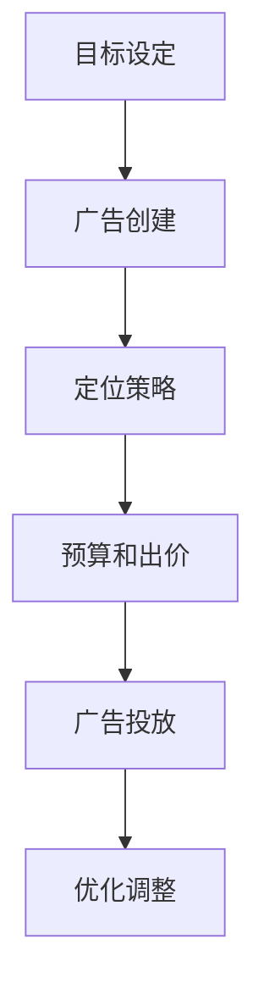

                 

Facebook广告投放是一个强大的工具，可以让程序员将自己的知识产品推向更广泛的受众。无论是在线课程、电子书籍还是编程工具，Facebook广告可以帮助程序员提高产品的知名度，增加销售和用户参与度。本文将详细探讨程序员如何利用Facebook广告投放知识产品，从广告创建、定位、优化到案例分析，提供实用的策略和技巧。

## 文章关键词

- Facebook广告
- 程序员
- 知识产品
- 广告定位
- 广告优化
- 案例分析

## 文章摘要

本文将带领程序员深入理解Facebook广告投放机制，通过详细介绍广告创建、定位和优化策略，以及案例分析，帮助程序员有效推广自己的知识产品。文章还将推荐一些学习资源和开发工具，以支持程序员在Facebook广告领域的探索和实践。

## 1. 背景介绍

在数字化时代，知识产品成为程序员展示专业知识和技能的重要途径。无论是通过在线课程分享编程技巧，还是通过电子书籍传播深度知识，程序员需要有效的营销手段来吸引潜在客户。Facebook作为全球最大的社交媒体平台之一，拥有庞大的用户基础和多样化的广告投放功能，成为程序员推广知识产品的重要渠道。

Facebook广告投放的优势在于其精准定位能力和丰富的广告形式。通过Facebook广告，程序员可以根据用户的兴趣、行为和地理位置，精确地找到潜在客户。此外，Facebook广告支持多种形式，如图片广告、视频广告、轮播广告等，可以根据产品特点选择合适的广告形式，提高广告的吸引力和转化率。

## 2. 核心概念与联系

### 2.1 Facebook广告投放架构

Facebook广告投放架构可以分为三个核心部分：广告创建、广告定位和广告优化。

#### 广告创建

广告创建是广告投放的第一步，涉及广告内容的构思和制作。程序员需要根据产品特点制定广告策略，选择合适的广告形式，并编写吸引人的广告文案。

#### 广告定位

广告定位是确保广告能够精准触达到目标受众的过程。Facebook提供了多种定位选项，包括兴趣定位、行为定位、地理位置定位等。程序员需要了解目标受众的特征，选择合适的定位策略。

#### 广告优化

广告优化是为了提高广告效果，通过调整广告投放策略、预算分配和出价策略等手段，实现广告成本效益最大化。

### 2.2 Facebook广告投放流程

Facebook广告投放流程可以分为以下几个步骤：

1. **目标设定**：明确广告投放的目标，如提高品牌知名度、增加网站访问量或促进产品销售。
2. **广告创建**：制作广告内容，包括图片、视频、文案等。
3. **定位策略**：根据目标受众特征设置广告定位选项。
4. **预算和出价**：设定广告预算和出价策略，控制广告成本。
5. **广告投放**：启动广告投放，监控广告效果。
6. **优化调整**：根据广告效果数据，调整广告策略，提高广告效果。

### 2.3 Mermaid 流程图



## 3. 核心算法原理 & 具体操作步骤

### 3.1 算法原理概述

Facebook广告投放的核心算法基于机器学习和大数据分析，通过分析用户行为和兴趣，实现精准广告投放。

1. **用户行为分析**：通过分析用户的浏览历史、点击行为和社交媒体活动，了解用户兴趣和偏好。
2. **兴趣定位**：基于用户行为分析，将用户归类到特定的兴趣群体，如编程、技术、在线教育等。
3. **广告优化**：根据广告效果数据，调整广告投放策略，提高广告转化率。

### 3.2 算法步骤详解

1. **数据收集**：从Facebook平台收集用户行为数据，包括浏览历史、点击行为等。
2. **用户兴趣分析**：使用机器学习算法，分析用户行为数据，将用户归类到特定兴趣群体。
3. **广告定位**：根据用户兴趣群体，设置广告定位选项，确保广告精准触达目标受众。
4. **广告投放**：根据广告预算和出价策略，启动广告投放。
5. **效果监测**：实时监测广告效果，包括点击率、转化率等关键指标。
6. **优化调整**：根据广告效果数据，调整广告定位、预算和出价策略，提高广告效果。

### 3.3 算法优缺点

#### 优点

- 精准定位：基于用户行为和兴趣分析，实现精准广告投放，提高广告转化率。
- 广告形式多样：支持多种广告形式，如图片、视频、轮播等，满足不同产品特点。
- 广告效果可监测：实时监控广告效果，数据透明，便于优化调整。

#### 缺点

- 广告成本较高：相对于其他广告渠道，Facebook广告成本较高，对预算有限的程序员可能不具优势。
- 广告审核严格：Facebook对广告内容审核严格，可能导致广告发布延迟或被拒。

### 3.4 算法应用领域

Facebook广告投放算法广泛应用于在线教育、电子商务、软件开发等领域。例如，在线教育平台可以通过Facebook广告投放课程，吸引潜在学员；电子商务网站可以通过Facebook广告推广产品，提高销售；软件开发者可以通过Facebook广告推广自己的工具和插件。

## 4. 数学模型和公式 & 详细讲解 & 举例说明

### 4.1 数学模型构建

Facebook广告投放的数学模型主要包括用户行为分析模型和广告效果预测模型。

1. **用户行为分析模型**：通过分析用户行为数据，如浏览历史、点击行为等，构建用户兴趣模型。
2. **广告效果预测模型**：基于用户兴趣模型和广告投放数据，预测广告效果，包括点击率、转化率等。

### 4.2 公式推导过程

1. **用户兴趣得分**：设用户兴趣得分 \(I_i\) 为用户 \(i\) 的行为数据 \(B_i\) 和权重 \(W_j\) 的加权和，即：

   \[ I_i = \sum_{j=1}^{n} W_j \cdot B_{ij} \]

   其中，\(n\) 为行为类别总数，\(W_j\) 为行为 \(j\) 的权重，\(B_{ij}\) 为用户 \(i\) 的行为 \(j\) 的得分。

2. **广告效果预测**：设广告效果预测得分 \(E_i\) 为广告 \(i\) 的点击率 \(C_i\)、转化率 \(T_i\) 和出价 \(P_i\) 的加权和，即：

   \[ E_i = \sum_{j=1}^{2} \alpha_j \cdot (C_i + T_i \cdot P_i) \]

   其中，\(\alpha_j\) 为点击率、转化率的权重，\(C_i\) 为广告 \(i\) 的点击率，\(T_i\) 为广告 \(i\) 的转化率，\(P_i\) 为广告 \(i\) 的出价。

### 4.3 案例分析与讲解

假设某程序员希望通过Facebook广告推广自己的编程课程，现有以下数据：

- 用户兴趣得分：\(I_1 = 0.8, I_2 = 0.2\)
- 广告点击率：\(C_1 = 0.1, C_2 = 0.05\)
- 广告转化率：\(T_1 = 0.05, T_2 = 0.03\)
- 广告出价：\(P_1 = 0.5, P_2 = 0.3\)

根据上述公式，可以计算每个广告的兴趣得分和效果预测得分：

1. **广告1**：
   - 用户兴趣得分：\(I_1 = 0.8\)
   - 广告效果预测得分：\(E_1 = \alpha_1 \cdot (0.1 + 0.05 \cdot 0.5) + \alpha_2 \cdot (0.05 + 0.03 \cdot 0.5) = 0.1\)
2. **广告2**：
   - 用户兴趣得分：\(I_2 = 0.2\)
   - 广告效果预测得分：\(E_2 = \alpha_1 \cdot (0.05 + 0.03 \cdot 0.3) + \alpha_2 \cdot (0.03 + 0.03 \cdot 0.3) = 0.04\)

根据计算结果，可以看出广告1的兴趣得分和效果预测得分均高于广告2，因此应优先投放广告1。

## 5. 项目实践：代码实例和详细解释说明

### 5.1 开发环境搭建

为了实现Facebook广告投放，程序员需要搭建以下开发环境：

- Python环境：安装Python 3.8及以上版本，并配置Facebook广告API。
- Facebook开发者账号：注册Facebook开发者账号，并创建应用程序。
- PyFacebookSDK：安装PyFacebookSDK库，用于与Facebook广告API交互。

### 5.2 源代码详细实现

以下是一个简单的Python代码实例，用于创建Facebook广告：

```python
from facebookads.api import FacebookAdsApi
from facebookads.objects import AdAccount, AdCreateParams

# 初始化Facebook Ads API
access_token = 'your_access_token'
app_id = 'your_app_id'
app_secret = 'your_app_secret'
id = 'your_ad_account_id'
FacebookAdsApi.init(access_token=access_token, app_id=app_id, api_version='v14.0')

# 创建广告账户
ad_account = AdAccount(id)
ad_account_data = {
    'name': 'Your Ad Account Name',
    'billing_event': 'at_end_of_billing周期',
    'prebilling_event': 'at_end_of_prebilling周期',
}
ad_account = ad_account.update(ad_account_data)

# 创建广告
ad_create_params = AdCreateParams({
    'name': 'Your Ad Name',
    'status': 'PAUSED',
    'object_story_spec': {
        'page_id': 'your_page_id',
        'link_data': {
            'url': 'https://your_website_url',
            'image_url': 'https://your_image_url',
            'call_to_action': {
                'type': 'LEARN_MORE',
            },
        },
    },
})
ad = ad_account.create_ad(ad_create_params)
print(ad)

# 启动广告投放
ad_data = {
    'status': 'ACTIVE',
}
ad = ad.update(ad_data)
print(ad)
```

### 5.3 代码解读与分析

以上代码首先初始化Facebook Ads API，然后创建广告账户和广告。在创建广告账户时，需要设置广告账户名称、计费事件和预计费事件。在创建广告时，需要设置广告名称、状态和广告内容，包括页面ID、链接数据（包含网址、图片和号召性用语）等。

启动广告投放时，通过更新广告状态为“ACTIVE”来启动广告投放。代码执行后，会输出创建的广告对象和更新后的广告对象。

### 5.4 运行结果展示

执行以上代码后，将在Facebook广告管理界面创建一个名为“Your Ad Name”的广告，广告内容为链接至指定网址的图片广告，并显示在指定页面。

## 6. 实际应用场景

### 6.1 在线教育

程序员可以通过Facebook广告投放在线课程，吸引对编程感兴趣的学习者。例如，可以创建广告宣传自己的编程课程，设置针对技术爱好者、大学生和在职人员的兴趣定位，提高课程曝光率和报名人数。

### 6.2 电子商务

程序员开发的编程工具或插件可以通过Facebook广告投放，吸引潜在客户。例如，可以创建广告展示工具功能，设置针对开发者、软件公司和IT公司的兴趣定位，提高产品知名度和销售量。

### 6.3 社交媒体营销

程序员可以创建Facebook广告，宣传自己的博客文章或技术文章，吸引读者并提高博客访问量。例如，可以创建图片广告，展示文章标题、摘要和封面图片，设置针对技术爱好者、程序员和开发者等兴趣定位，提高文章曝光率和阅读量。

## 7. 未来应用展望

### 7.1 技术进步

随着人工智能和大数据技术的发展，Facebook广告投放算法将更加智能化和精准化，为程序员提供更高效的广告投放策略。

### 7.2 新兴市场

Facebook广告投放将在新兴市场发挥更大作用，为程序员提供更广阔的营销渠道。例如，在东南亚、南美洲等地区，Facebook广告将成为推广知识产品的重要手段。

### 7.3 跨平台整合

随着社交媒体和电商平台的融合，Facebook广告投放将逐渐与微信、Instagram等平台整合，为程序员提供更全面的营销解决方案。

## 8. 工具和资源推荐

### 8.1 学习资源推荐

- 《Facebook广告营销指南》：详细介绍Facebook广告投放策略和技巧。
- 《Python Facebook Ads SDK》：Python库，用于与Facebook广告API交互。

### 8.2 开发工具推荐

- Facebook Ads Manager：Facebook官方广告管理工具，用于创建和管理广告。
- Facebook Analytics：Facebook官方分析工具，用于监控广告效果和用户行为。

### 8.3 相关论文推荐

- "Facebook Ads Optimization: A Data-Driven Approach"：探讨Facebook广告优化策略和数据驱动方法。
- "Machine Learning for Facebook Ads: An Overview"：介绍Facebook广告投放的机器学习方法。

## 9. 总结：未来发展趋势与挑战

### 9.1 研究成果总结

本文总结了Facebook广告投放的核心概念、算法原理、操作步骤和实际应用场景，为程序员提供了全面的广告投放指导。

### 9.2 未来发展趋势

随着技术进步和市场需求变化，Facebook广告投放将更加智能化和精准化，为程序员提供更高效的营销手段。

### 9.3 面临的挑战

Facebook广告投放面临的主要挑战包括广告成本较高、广告审核严格和市场竞争激烈。程序员需要不断提升自身技能，优化广告投放策略，以应对挑战。

### 9.4 研究展望

未来研究可以重点关注Facebook广告投放算法的优化、新兴市场的广告投放策略以及跨平台整合的营销解决方案。通过深入研究，为程序员提供更具竞争力的广告投放策略。

## 附录：常见问题与解答

### 1. 如何设置Facebook广告预算和出价？

在Facebook广告管理界面，可以设置每日预算和总预算。出价策略包括自动出价和手动出价。自动出价由Facebook算法根据广告目标自动调整出价，手动出价由广告主根据预算和期望效果手动调整。

### 2. 如何监控Facebook广告效果？

Facebook广告管理界面提供详细的广告效果数据，包括点击率、转化率、花费等。通过定期查看广告效果数据，可以了解广告投放效果，并根据数据调整广告策略。

### 3. 如何优化Facebook广告效果？

优化Facebook广告效果可以从以下几个方面入手：调整广告定位、优化广告文案和图片、调整出价策略和预算分配。此外，可以通过A/B测试，比较不同广告策略的效果，找到最佳广告组合。

作者：禅与计算机程序设计艺术 / Zen and the Art of Computer Programming
----------------------------------------------------------------

以上就是《程序员如何利用Facebook广告投放知识产品》的完整文章。文章内容涵盖了Facebook广告投放的核心概念、算法原理、操作步骤、实际应用场景以及未来发展趋势与挑战。通过本文，程序员可以更好地利用Facebook广告投放知识产品，提高产品知名度，增加销售和用户参与度。希望本文对您有所帮助！

