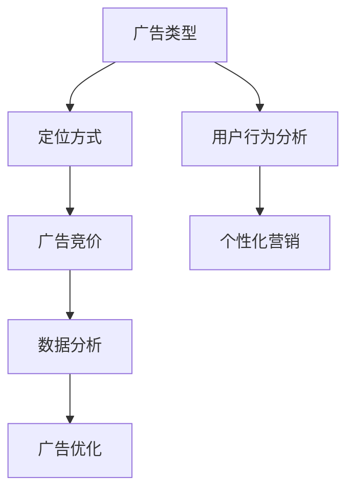

                 

关键词：Facebook广告投放、知识产品、营销策略、编程技能、社交媒体广告、算法优化、数据分析、用户行为分析、个性化营销、互动设计。

> 摘要：本文将探讨程序员如何利用Facebook广告投放知识产品，通过深入理解算法原理、数据分析、用户行为分析等，设计出高效、个性化的广告营销策略，提升广告效果，实现商业目标。

## 1. 背景介绍

随着互联网技术的飞速发展，社交媒体广告成为营销的重要组成部分。Facebook作为全球最大的社交网络平台之一，其广告投放系统已发展成为复杂的生态系统，涵盖了多种广告类型、定位方式、优化策略等。对于程序员来说，掌握Facebook广告投放知识不仅有助于提升个人竞争力，还能为企业和品牌带来显著的商业价值。

本文旨在帮助程序员理解和掌握Facebook广告投放的核心知识，通过算法原理、数据分析、用户行为分析等多个维度，设计出高效、个性化的广告营销策略。以下是本文的结构：

## 2. 核心概念与联系

为了更好地理解Facebook广告投放系统，我们需要从以下几个核心概念入手：

- **广告类型**：了解不同的广告类型，如图片广告、视频广告、轮播广告等。
- **定位方式**：熟悉基于用户属性、兴趣、行为等多种维度的定位方法。
- **广告竞价**：理解如何通过竞价策略优化广告投放效果。
- **数据分析**：掌握数据分析方法，通过数据反馈优化广告策略。

下面是一个简化的Mermaid流程图，展示了Facebook广告投放的核心概念与联系。



## 3. 核心算法原理 & 具体操作步骤

### 3.1 算法原理概述

Facebook广告投放系统基于一种称为“逆概率评分”（Inverse Probability Rating，IPR）的算法。该算法通过评估用户对广告的潜在兴趣，对用户进行打分，进而决定广告投放给哪些用户。算法的核心原理包括以下几个方面：

- **用户特征建模**：收集并整合用户的历史行为、兴趣标签、地理位置等多维度数据，构建用户特征模型。
- **广告特征建模**：分析广告内容、目标受众、出价等特征，构建广告特征模型。
- **概率计算**：基于用户和广告特征模型，计算用户对广告的点击概率。
- **逆概率评分**：通过逆概率评分，为用户分配广告投放权重。

### 3.2 算法步骤详解

1. **数据收集**：收集用户行为数据、广告数据等。
2. **特征工程**：对数据进行处理，提取用户和广告特征。
3. **模型训练**：使用机器学习算法，训练用户特征模型和广告特征模型。
4. **概率计算**：根据模型预测用户对广告的点击概率。
5. **逆概率评分**：计算用户的逆概率评分，确定广告投放权重。
6. **广告投放**：根据评分权重，将广告投放给用户。

### 3.3 算法优缺点

**优点**：
- 高度个性化：基于用户兴趣和行为进行广告投放，提高广告的相关性。
- 高效竞价：优化广告投放，提高广告转化率。
- 数据驱动：通过数据分析不断优化广告策略，提高广告效果。

**缺点**：
- 数据隐私：用户数据隐私问题备受关注，可能导致用户反感。
- 复杂性：算法模型复杂，需要丰富的技术知识和实践经验。

### 3.4 算法应用领域

Facebook广告投放算法在多个领域具有广泛应用，如电商、金融、教育、医疗等。通过算法优化，可以提升广告投放效果，实现更高的用户转化率和ROI。

## 4. 数学模型和公式 & 详细讲解 & 举例说明

### 4.1 数学模型构建

Facebook广告投放的数学模型主要包括用户特征模型、广告特征模型和点击概率模型。以下是一个简化的数学模型：

$$
P(C|U, A) = \frac{P(U, A|C) \cdot P(C)}{P(U, A)}
$$

其中，$P(C|U, A)$ 表示用户$U$在看到广告$A$时点击广告的概率，$P(U, A|C)$ 表示用户$U$在看到广告$A$且点击广告的条件概率，$P(C)$ 表示用户点击广告的总概率，$P(U, A)$ 表示用户$U$看到广告$A$的概率。

### 4.2 公式推导过程

1. **条件概率公式**：
$$
P(A|B) = \frac{P(A \cap B)}{P(B)}
$$

2. **贝叶斯公式**：
$$
P(C|U, A) = \frac{P(U, A|C) \cdot P(C)}{P(U, A)}
$$

3. **全概率公式**：
$$
P(U, A) = P(U, A|C) \cdot P(C) + P(U, A|\neg C) \cdot P(\neg C)
$$

### 4.3 案例分析与讲解

假设一个电商企业想要投放一款新款智能手机的图片广告，目标受众为25-35岁的男性用户，对科技产品有较高兴趣。我们可以使用以下公式进行概率计算：

1. **用户点击广告的概率**：
$$
P(C|U, A) = \frac{P(U, A|C) \cdot P(C)}{P(U, A)}
$$

其中，$P(U, A|C)$ 可以通过历史数据得到，$P(C)$ 可以根据用户群体的统计特性估算，$P(U, A)$ 可以通过广告投放系统计算。

2. **广告曝光的概率**：
$$
P(U, A) = P(U, A|C) \cdot P(C) + P(U, A|\neg C) \cdot P(\neg C)
$$

其中，$P(U, A|\neg C)$ 表示用户未点击广告的概率，可以通过广告投放系统计算。

3. **广告投放的期望收益**：
$$
E(R) = P(C|U, A) \cdot R(C) + P(\neg C|U, A) \cdot R(\neg C)
$$

其中，$R(C)$ 表示广告点击带来的收益，$R(\neg C)$ 表示广告未点击的收益。

通过以上公式，我们可以计算出广告投放的期望收益，进而优化广告策略，提高投放效果。

## 5. 项目实践：代码实例和详细解释说明

### 5.1 开发环境搭建

为了进行Facebook广告投放，我们需要搭建一个开发环境。以下是基本的步骤：

1. **安装Python环境**：确保Python版本为3.6或以上。
2. **安装Facebook SDK**：使用pip命令安装`facebook-sdk`库。
3. **配置Facebook开发者账号**：在Facebook开发者账号中创建应用，获取App ID和App Secret。

### 5.2 源代码详细实现

以下是一个简单的Python代码示例，展示了如何使用Facebook SDK进行广告投放。

```python
from facebook_business.api import FacebookAdsApi
from facebook_business.adobjects.adaccount import AdAccount
from facebook_business.adobjects.adcreateresult import AdCreateResult

# 初始化Facebook SDK
access_token = 'YOUR_ACCESS_TOKEN'
app_id = 'YOUR_APP_ID'
app_secret = 'YOUR_APP_SECRET'
ad_account_id = 'YOUR_AD_ACCOUNT_ID'

FacebookAdsApi.init(access_token=access_token, app_id=app_id, api_version='v12.0')

# 创建广告账户
ad_account = AdAccount(ad_account_id)
ad_account_data = {
    'name': '我的广告账户',
    'amount_spent_cap': 1000,
}

ad_account = ad_account.remote_create(params=ad_account_data)

# 创建广告
ad_result = ad_account.create_ad(
    {
        'name': '我的广告',
        'status': 'PAUSED',
        'objective': 'CONVERSIONS',
        'optimization_goal': ' conversions',
        'bid_amount': 1,
        'daily_budget': 10,
        'start_time': '2023-03-01T00:00:00+0000',
        'end_time': '2023-03-07T23:59:59+0000',
    },
    is_deprecated=True,
)

ad_create_result = AdCreateResult.from_json_dict(ad_result)

print(ad_create_result)
```

### 5.3 代码解读与分析

该代码首先初始化Facebook SDK，然后使用App ID、App Secret和Ad Account ID创建广告账户。接着，创建广告，设置广告名称、状态、投放目标、出价、预算、投放时间等参数。

### 5.4 运行结果展示

运行上述代码后，将在Facebook广告管理后台创建一个名为“我的广告账户”的广告账户，并创建一个名为“我的广告”的广告。

## 6. 实际应用场景

Facebook广告投放广泛应用于各个行业，如电商、金融、教育、医疗等。以下是一些实际应用场景：

- **电商**：通过精准定位，提高广告转化率，提升销售额。
- **金融**：推广理财产品，吸引潜在客户，增加品牌知名度。
- **教育**：推广在线课程，提高课程报名率，扩大市场份额。
- **医疗**：宣传医疗产品，提高用户关注度和信任度。

## 7. 工具和资源推荐

### 7.1 学习资源推荐

- **Facebook广告文档**：https://developers.facebook.com/docs/marketing-apis
- **Python Facebook SDK 文档**：https://facebook-sdk.readthedocs.io/en/stable/

### 7.2 开发工具推荐

- **PyCharm**：强大的Python开发环境，支持Facebook SDK。
- **Postman**：用于API调试和测试。

### 7.3 相关论文推荐

- **"Efficient Estimation of the Inverse Probability of Being Clicked: The Inverse Probability Model for Estimating Click-Through Rate and Its Application to Ad Auctions"**，作者：Akshay M. Ramesh等人。
- **"A Multi-Armed Bandit Approach for Optimizing Online Advertising in Real-Time"**，作者：Jiawei Huang等人。

## 8. 总结：未来发展趋势与挑战

随着社交媒体广告的不断发展，Facebook广告投放系统也在不断升级和优化。未来，Facebook广告投放将更加智能化、个性化，同时面临以下挑战：

- **数据隐私**：如何保护用户隐私，成为广告投放的重要课题。
- **算法透明度**：提高算法透明度，增强用户信任。
- **人工智能应用**：如何利用人工智能技术提升广告投放效果。

## 9. 附录：常见问题与解答

### 9.1 如何获取Facebook广告投放数据？

答：可以通过Facebook Analytics获取广告投放数据，包括点击率、转化率、花费等关键指标。

### 9.2 如何优化Facebook广告竞价策略？

答：可以采用机器学习算法，分析历史数据，预测用户行为，优化出价策略。

### 9.3 如何评估Facebook广告效果？

答：可以通过A/B测试，对比不同广告的投放效果，选择效果最佳的广告策略。

作者：禅与计算机程序设计艺术 / Zen and the Art of Computer Programming
-------------------------------------------------------------------

