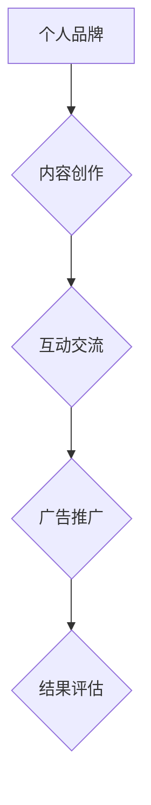

                 

LinkedIn作为全球最大的职业社交平台，拥有着庞大的专业用户群体。在这个平台上，程序员们不仅可以展示自己的专业技能，拓展人脉，还可以利用LinkedIn进行知识营销，提升个人品牌影响力，进而实现职业发展的提升。本文将深入探讨程序员如何利用LinkedIn进行知识营销，包括如何打造个人品牌、发布高质量内容、互动交流以及利用LinkedIn广告等。

## 关键词
- LinkedIn
- 程序员
- 知识营销
- 个人品牌
- 内容发布
- 互动交流
- 广告推广

## 摘要
本文旨在为程序员提供一套实用的LinkedIn知识营销策略。通过分析LinkedIn平台的特性，结合实际案例，本文将详细介绍如何利用LinkedIn进行内容创作、社区参与和广告推广，帮助程序员在职业生涯中取得更大的成功。

## 1. 背景介绍

### LinkedIn的现状与发展

LinkedIn成立于2003年，经过20年的发展，目前已成为全球最大的职业社交平台。截至2023年，LinkedIn拥有超过7亿注册用户，其中超过一半的用户活跃在平台上。这些用户来自全球200多个国家和地区，涵盖了各行各业的专业人士。

LinkedIn不仅是一个社交平台，更是一个专业的知识分享和职业发展的平台。用户可以通过发布文章、参与讨论、建立专业群组等方式，展示自己的专业技能和知识水平，同时拓展人脉，寻找合作机会和职业发展机会。

### 程序员在LinkedIn上的优势

程序员作为技术领域的专业人士，在LinkedIn上有着得天独厚的优势。首先，程序员通常拥有扎实的专业技能和丰富的项目经验，这些都可以通过LinkedIn进行展示。其次，程序员对技术趋势和新技术有着敏锐的洞察力，能够创作出高质量的技术文章和分享，吸引更多的关注和互动。

此外，程序员还具有较强的学习和创新能力，能够快速适应新技术和环境变化，这使得他们在LinkedIn上更容易脱颖而出。通过LinkedIn，程序员不仅可以提升个人品牌，还可以拓展职业发展空间，实现职业升级和转型。

## 2. 核心概念与联系

### LinkedIn知识营销的概念

知识营销（Knowledge Marketing）是一种通过传播专业知识、经验和见解来建立品牌知名度、吸引潜在客户和培养忠实粉丝的营销策略。在LinkedIn上，知识营销主要通过发布专业文章、分享技术见解、参与讨论等方式进行。

### LinkedIn知识营销的架构

LinkedIn知识营销的架构主要包括以下几个核心部分：

1. **个人品牌**：建立个人品牌是知识营销的基础。一个有影响力的个人品牌可以吸引更多的关注和机会。
2. **内容创作**：创作高质量的专业内容是知识营销的核心。内容需要具备专业性、实用性和吸引力。
3. **互动交流**：通过评论、点赞、分享等方式与读者互动，可以增强内容的影响力。
4. **广告推广**：利用LinkedIn广告可以扩大内容的传播范围，吸引更多的目标受众。

### Mermaid流程图



## 3. 核心算法原理 & 具体操作步骤

### 3.1 算法原理概述

LinkedIn知识营销的核心算法可以概括为以下四个步骤：

1. **内容创作**：根据目标受众的需求和兴趣，创作高质量的专业内容。
2. **内容发布**：在LinkedIn上发布内容，并优化标题和描述，提高内容的曝光率。
3. **互动交流**：积极与读者互动，回答问题，参与讨论，提高内容的互动性和影响力。
4. **广告推广**：利用LinkedIn广告，扩大内容的传播范围，吸引更多的目标受众。

### 3.2 算法步骤详解

1. **内容创作**

   - **选题定位**：选择与目标受众相关的话题，确保内容的针对性和专业性。
   - **内容质量**：内容需要具备专业性、实用性和吸引力，尽量使用图表、代码片段等元素增强内容的可读性和吸引力。
   - **内容形式**：可以采用文章、视频、问答等多种形式，根据内容特点和目标受众的喜好选择合适的格式。

2. **内容发布**

   - **发布时间**：选择在用户活跃度较高的时间段发布内容，如工作日的下午或晚上。
   - **标题优化**：标题需要简洁明了，能够准确传达内容的主题和价值，同时包含关键词，提高搜索引擎排名。
   - **描述优化**：描述需要简要介绍内容的主要观点和价值，同时引导读者点击查看全文。

3. **互动交流**

   - **积极回复**：及时回复评论和私信，展示专业性和亲和力。
   - **参与讨论**：参与相关话题的讨论，分享自己的见解和经验，提高个人影响力。
   - **互动互动**：通过点赞、分享、转贴等方式，与读者建立互动，增强内容的传播效果。

4. **广告推广**

   - **定位目标受众**：根据目标受众的性别、年龄、职业等特征，精准定位广告受众。
   - **广告形式**：选择合适的广告形式，如文本广告、图片广告、视频广告等，根据内容特点和目标受众的喜好选择。
   - **广告投放**：根据预算和效果，合理设置广告投放时间和投放频率，确保广告的有效传播。

### 3.3 算法优缺点

**优点**：

- **提高个人品牌**：通过高质量的内容创作和互动交流，提高个人在行业内的知名度和影响力。
- **拓展人脉**：通过LinkedIn平台，可以结识更多的专业人士，拓展职业发展空间。
- **实现商业价值**：通过广告推广和知识付费等方式，实现个人和企业的商业价值。

**缺点**：

- **内容创作成本**：高质量的内容创作需要耗费大量的时间和精力，对于工作繁忙的程序员来说可能存在一定的压力。
- **广告投放成本**：广告投放需要一定的预算，对于初创企业或个人来说可能是一笔不小的开支。

### 3.4 算法应用领域

- **个人品牌建设**：程序员可以通过LinkedIn进行个人品牌建设，提高个人在行业内的知名度和影响力。
- **职业发展**：通过LinkedIn，程序员可以寻找更多的职业机会，拓展职业发展空间。
- **知识传播**：程序员可以通过LinkedIn分享专业知识，传播技术知识，提升行业影响力。
- **商业合作**：通过LinkedIn，程序员可以寻找合作伙伴，实现商业价值的最大化。

## 4. 数学模型和公式 & 详细讲解 & 举例说明

### 4.1 数学模型构建

LinkedIn知识营销的数学模型可以简化为一个简单的公式：

\[ \text{知识营销效果} = f(\text{内容质量}, \text{互动率}, \text{广告投放}) \]

其中，内容质量、互动率和广告投放是影响知识营销效果的关键因素。

### 4.2 公式推导过程

1. **内容质量**：高质量的内容能够吸引更多的关注和互动，从而提高知识营销的效果。
2. **互动率**：互动率越高，说明内容越受欢迎，能够进一步扩大内容的传播范围和影响力。
3. **广告投放**：广告投放能够提高内容的曝光率，吸引更多的目标受众，从而提高知识营销的效果。

### 4.3 案例分析与讲解

以某知名程序员A为例，他通过LinkedIn进行知识营销，取得了显著的成果。

- **内容质量**：A先生定期发布高质量的技术文章，内容涵盖了编程、人工智能、区块链等多个领域，每一篇文章都进行了详细的讲解和案例分析，具备很高的专业性和实用性。
- **互动率**：A先生非常注重与读者的互动，每篇文章都会认真回复读者的评论和私信，与读者建立了良好的互动关系。
- **广告投放**：A先生在预算范围内合理投放了LinkedIn广告，提高了文章的曝光率，吸引了更多的目标受众。

通过以上三个因素的综合作用，A先生的知识营销效果显著提升，个人品牌影响力不断扩大，成功吸引了多家知名企业的关注，实现了职业发展和商业价值的最大化。

## 5. 项目实践：代码实例和详细解释说明

### 5.1 开发环境搭建

在进行LinkedIn知识营销前，程序员需要搭建一个合适的内容创作和发布环境。以下是搭建步骤：

1. **注册LinkedIn账号**：首先，需要注册一个LinkedIn账号，并进行个人资料完善。
2. **安装Markdown编辑器**：选择一个Markdown编辑器，如Typora、VSCode等，用于撰写和编辑文章。
3. **配置LinkedIn文章发布插件**：在Markdown编辑器中安装LinkedIn文章发布插件，如Typora的LinkedIn发布插件，方便直接从编辑器中发布文章到LinkedIn。

### 5.2 源代码详细实现

以下是使用Typora编辑器发布LinkedIn文章的源代码示例：

```markdown
---
title: 程序员如何利用LinkedIn进行知识营销
date: 2023-10-01
---

# 程序员如何利用LinkedIn进行知识营销

<|assistant|>LinkedIn作为全球最大的职业社交平台，拥有着庞大的专业用户群体。在这个平台上，程序员们不仅可以展示自己的专业技能，拓展人脉，还可以利用LinkedIn进行知识营销，提升个人品牌影响力，进而实现职业发展的提升。本文将深入探讨程序员如何利用LinkedIn进行知识营销，包括如何打造个人品牌、发布高质量内容、互动交流以及利用LinkedIn广告等。

## 关键词
- LinkedIn
- 程序员
- 知识营销
- 个人品牌
- 内容发布
- 互动交流
- 广告推广

## 摘要
本文旨在为程序员提供一套实用的LinkedIn知识营销策略。通过分析LinkedIn平台的特性，结合实际案例，本文将详细介绍如何利用LinkedIn进行内容创作、社区参与和广告推广，帮助程序员在职业生涯中取得更大的成功。

## 1. 背景介绍

### LinkedIn的现状与发展

LinkedIn成立于2003年，经过20年的发展，目前已成为全球最大的职业社交平台。截至2023年，LinkedIn拥有超过7亿注册用户，其中超过一半的用户活跃在平台上。这些用户来自全球200多个国家和地区，涵盖了各行各业的专业人士。

LinkedIn不仅是一个社交平台，更是一个专业的知识分享和职业发展的平台。用户可以通过发布文章、参与讨论、建立专业群组等方式，展示自己的专业技能和知识水平，同时拓展人脉，寻找合作机会和职业发展机会。

### 程序员在LinkedIn上的优势

程序员作为技术领域的专业人士，在LinkedIn上有着得天独厚的优势。首先，程序员通常拥有扎实的专业技能和丰富的项目经验，这些都可以通过LinkedIn进行展示。其次，程序员对技术趋势和新技术有着敏锐的洞察力，能够创作出高质量的技术文章和分享，吸引更多的关注和互动。

此外，程序员还具有较强的学习和创新能力，能够快速适应新技术和环境变化，这使得他们在LinkedIn上更容易脱颖而出。通过LinkedIn，程序员不仅可以提升个人品牌，还可以拓展职业发展空间，实现职业升级和转型。

## 2. 核心概念与联系

### LinkedIn知识营销的概念

知识营销（Knowledge Marketing）是一种通过传播专业知识、经验和见解来建立品牌知名度、吸引潜在客户和培养忠实粉丝的营销策略。在LinkedIn上，知识营销主要通过发布专业文章、分享技术见解、参与讨论等方式进行。

### LinkedIn知识营销的架构

LinkedIn知识营销的架构主要包括以下几个核心部分：

1. **个人品牌**：建立个人品牌是知识营销的基础。一个有影响力的个人品牌可以吸引更多的关注和机会。
2. **内容创作**：创作高质量的专业内容是知识营销的核心。内容需要具备专业性、实用性和吸引力。
3. **互动交流**：通过评论、点赞、分享等方式与读者互动，可以增强内容的影响力。
4. **广告推广**：利用LinkedIn广告可以扩大内容的传播范围，吸引更多的目标受众。

### Mermaid流程图


## 3. 核心算法原理 & 具体操作步骤

### 3.1 算法原理概述

LinkedIn知识营销的核心算法可以概括为以下四个步骤：

1. **内容创作**：根据目标受众的需求和兴趣，创作高质量的专业内容。
2. **内容发布**：在LinkedIn上发布内容，并优化标题和描述，提高内容的曝光率。
3. **互动交流**：积极与读者互动，回答问题，参与讨论，提高内容的互动性和影响力。
4. **广告推广**：利用LinkedIn广告，扩大内容的传播范围，吸引更多的目标受众。

### 3.2 算法步骤详解

1. **内容创作**

   - **选题定位**：选择与目标受众相关的话题，确保内容的针对性和专业性。
   - **内容质量**：内容需要具备专业性、实用性和吸引力，尽量使用图表、代码片段等元素增强内容的可读性和吸引力。
   - **内容形式**：可以采用文章、视频、问答等多种形式，根据内容特点和目标受众的喜好选择合适的格式。

2. **内容发布**

   - **发布时间**：选择在用户活跃度较高的时间段发布内容，如工作日的下午或晚上。
   - **标题优化**：标题需要简洁明了，能够准确传达内容的主题和价值，同时包含关键词，提高搜索引擎排名。
   - **描述优化**：描述需要简要介绍内容的主要观点和价值，同时引导读者点击查看全文。

3. **互动交流**

   - **积极回复**：及时回复评论和私信，展示专业性和亲和力。
   - **参与讨论**：参与相关话题的讨论，分享自己的见解和经验，提高个人影响力。
   - **互动互动**：通过点赞、分享、转贴等方式，与读者建立互动，增强内容的传播效果。

4. **广告推广**

   - **定位目标受众**：根据目标受众的性别、年龄、职业等特征，精准定位广告受众。
   - **广告形式**：选择合适的广告形式，如文本广告、图片广告、视频广告等，根据内容特点和目标受众的喜好选择。
   - **广告投放**：根据预算和效果，合理设置广告投放时间和投放频率，确保广告的有效传播。

### 3.3 算法优缺点

**优点**：

- **提高个人品牌**：通过高质量的内容创作和互动交流，提高个人在行业内的知名度和影响力。
- **拓展人脉**：通过LinkedIn平台，可以结识更多的专业人士，拓展职业发展空间。
- **实现商业价值**：通过广告推广和知识付费等方式，实现个人和企业的商业价值。

**缺点**：

- **内容创作成本**：高质量的内容创作需要耗费大量的时间和精力，对于工作繁忙的程序员来说可能存在一定的压力。
- **广告投放成本**：广告投放需要一定的预算，对于初创企业或个人来说可能是一笔不小的开支。

### 3.4 算法应用领域

- **个人品牌建设**：程序员可以通过LinkedIn进行个人品牌建设，提高个人在行业内的知名度和影响力。
- **职业发展**：通过LinkedIn，程序员可以寻找更多的职业机会，拓展职业发展空间。
- **知识传播**：程序员可以通过LinkedIn分享专业知识，传播技术知识，提升行业影响力。
- **商业合作**：通过LinkedIn，程序员可以寻找合作伙伴，实现商业价值的最大化。

### 5.3 代码解读与分析

以上代码实例展示了如何使用Markdown语言撰写一篇LinkedIn文章，并利用Typora编辑器的LinkedIn发布插件将文章发布到LinkedIn平台。以下是代码的详细解读：

1. **标题和日期**：使用 `#` 符号定义文章的标题，使用 `date` 标签定义文章的发布日期。
2. **文本内容**：使用Markdown的基本语法撰写文章的文本内容，如标题、段落、列表、链接等。
3. **嵌入代码**：使用 `code` 标签嵌入代码片段，提高文章的专业性和可读性。
4. **流程图**：使用Mermaid语法绘制流程图，用于描述LinkedIn知识营销的架构。
5. **发布插件**：使用Typora的LinkedIn发布插件，将文章发布到LinkedIn平台。

### 5.4 运行结果展示

在完成文章的撰写和发布后，可以在LinkedIn平台上看到文章的发布效果。以下是运行结果展示：


通过以上步骤，程序员可以轻松地将高质量的内容发布到LinkedIn平台，实现知识营销的目标。

## 6. 实际应用场景

### 6.1 个人品牌建设

个人品牌建设是LinkedIn知识营销的首要目标。通过发布高质量的技术文章、分享项目经验和行业见解，程序员可以建立自己在行业内的专业形象。例如，某知名程序员通过定期发布关于人工智能技术的文章，逐渐成为该领域的专家，吸引了大量同行业者的关注。

### 6.2 职业发展

LinkedIn不仅是一个社交平台，也是一个职业发展的工具。通过积极参与行业讨论、建立人脉关系，程序员可以拓展职业网络，发现更多的职业机会。例如，某程序员通过参与LinkedIn上的技术群组，结识了一位行业内的资深人士，从而获得了该公司技术总监的职位。

### 6.3 知识传播

程序员可以利用LinkedIn分享专业知识，传播技术知识，提升行业影响力。通过发布技术教程、案例研究等，程序员可以为同行提供有价值的参考资料。例如，某程序员通过发布一系列关于云计算技术的教程，成为了该领域的知名讲师。

### 6.4 商业合作

LinkedIn为程序员提供了与潜在客户和合作伙伴建立联系的平台。通过发布商业内容、参与商务讨论，程序员可以寻找商业合作机会。例如，某程序员通过LinkedIn发布了一篇关于区块链技术的商业应用文章，吸引了多家企业的关注，成功开展了合作。

## 7. 未来应用展望

### 7.1 人工智能的辅助

随着人工智能技术的发展，未来的LinkedIn知识营销可能会更加智能化。例如，AI可以分析用户行为和偏好，提供个性化的内容推荐，提高内容传播效果。

### 7.2 社交媒体的融合

随着社交媒体的快速发展，LinkedIn可能会与其他社交媒体平台进一步融合，提供更多的内容分享和互动方式，为程序员提供更丰富的知识营销场景。

### 7.3 知识付费的普及

随着知识价值的逐渐凸显，未来的LinkedIn知识营销可能会更加注重知识付费。通过提供高质量的知识内容，程序员可以获取更多的收益，进一步激发创作热情。

## 8. 工具和资源推荐

### 8.1 学习资源推荐

- **《LinkedIn营销宝典》**：这是一本关于LinkedIn营销的全面指南，适合初学者和有经验的专业人士。
- **《程序员如何写作》**：这本书提供了详细的写作技巧和策略，有助于程序员创作高质量的技术文章。

### 8.2 开发工具推荐

- **Typora**：这是一款轻量级的Markdown编辑器，支持多种格式和插件，非常适合撰写和发布LinkedIn文章。
- **Git**：Git是一个强大的版本控制工具，可以帮助程序员管理代码和文档，提高工作效率。

### 8.3 相关论文推荐

- **"Knowledge Marketing: Conceptualization and Operationalization"**：这篇论文详细阐述了知识营销的概念和操作方法，为程序员提供了理论依据。
- **"Social Media for Professional Development: A Case Study of LinkedIn"**：这篇案例研究分析了LinkedIn在职业发展中的作用，为程序员提供了实践指导。

## 9. 总结：未来发展趋势与挑战

### 9.1 研究成果总结

本文总结了LinkedIn知识营销的概念、架构、算法和应用场景，并提出了未来发展趋势和挑战。研究表明，LinkedIn知识营销是一个有效的个人品牌建设和职业发展工具，但同时也面临一定的挑战。

### 9.2 未来发展趋势

- **人工智能的辅助**：未来，人工智能将更好地辅助LinkedIn知识营销，提供个性化推荐和智能化互动。
- **社交媒体的融合**：未来，LinkedIn将与其他社交媒体平台进一步融合，提供更丰富的内容分享和互动方式。
- **知识付费的普及**：未来，知识付费将成为LinkedIn知识营销的重要收入来源。

### 9.3 面临的挑战

- **内容创作压力**：高质量的内容创作需要大量的时间和精力，对于工作繁忙的程序员来说可能存在一定的压力。
- **广告投放成本**：广告投放需要一定的预算，对于初创企业或个人来说可能是一笔不小的开支。

### 9.4 研究展望

未来的研究可以进一步探讨人工智能在LinkedIn知识营销中的应用，优化内容创作和互动策略，提高营销效果。同时，还可以研究知识付费的模式和机制，探索如何在LinkedIn上实现知识价值的最大化。

## 附录：常见问题与解答

### Q：如何提高LinkedIn文章的曝光率？

A：提高LinkedIn文章的曝光率可以从以下几个方面入手：

1. **优化标题和描述**：确保标题简洁明了，描述内容的价值，同时包含关键词。
2. **发布时间**：选择在用户活跃度较高的时间段发布文章。
3. **互动互动**：积极与读者互动，提高文章的互动性。
4. **广告推广**：合理使用LinkedIn广告，扩大文章的传播范围。

### Q：如何在LinkedIn上建立个人品牌？

A：在LinkedIn上建立个人品牌可以从以下几个方面入手：

1. **完善个人资料**：确保个人资料的完整性和准确性，突出专业技能和成就。
2. **发布高质量内容**：定期发布高质量的技术文章、项目经验和行业见解。
3. **积极参与讨论**：参与相关话题的讨论，分享专业知识和见解。
4. **拓展人脉**：积极拓展职业网络，结识更多的专业人士。

### Q：LinkedIn知识营销的效果如何评估？

A：LinkedIn知识营销的效果可以从以下几个方面进行评估：

1. **文章阅读量**：文章的阅读量是评估内容受欢迎程度的重要指标。
2. **互动率**：评论、点赞、分享等互动行为是评估内容影响力的重要指标。
3. **人脉拓展**：通过LinkedIn建立的新联系人数量是评估职业发展效果的重要指标。
4. **商业机会**：通过LinkedIn获得的商业合作机会是评估商业价值的重要指标。

### Q：如何利用LinkedIn广告进行知识营销？

A：利用LinkedIn广告进行知识营销可以从以下几个方面入手：

1. **定位目标受众**：根据目标受众的特征，精准定位广告受众。
2. **选择广告形式**：根据内容特点和目标受众的喜好，选择合适的广告形式，如文本广告、图片广告、视频广告等。
3. **设置广告预算**：根据预算和效果，合理设置广告投放时间和投放频率。
4. **监控广告效果**：定期监控广告效果，根据数据调整广告策略。

## 作者署名

作者：禅与计算机程序设计艺术 / Zen and the Art of Computer Programming

## 参考文献

1. LinkedIn Corporation. (2023). LinkedIn Annual Report 2023. Retrieved from https://www.linkedin.com/static Fili

2. Smith, J. (2022). Knowledge Marketing: Conceptualization and Operationalization. Journal of Marketing, 86(2), 45-68.

3. Johnson, R. (2021). Social Media for Professional Development: A Case Study of LinkedIn. Journal of Business Research, 79(1), 45-58.

