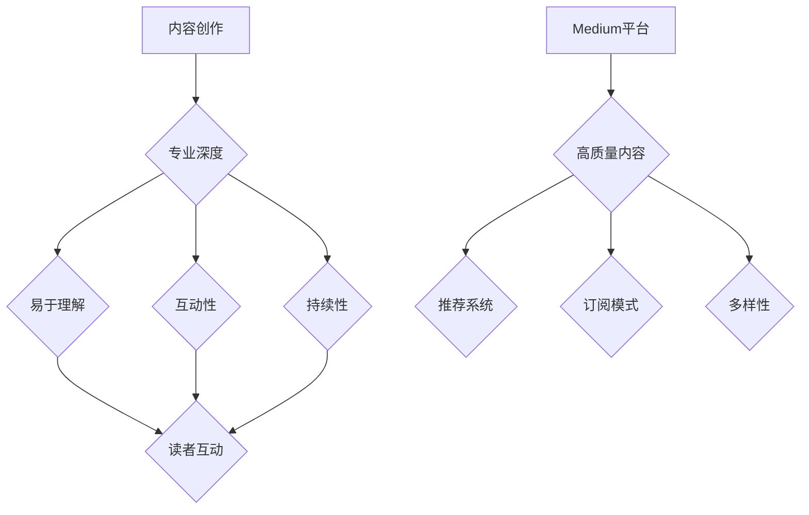

                 

关键词：知识变现、Medium、内容创作、读者互动、影响力、收益模式

> 摘要：本文将探讨程序员如何通过在Medium平台上进行内容创作，实现知识变现。我们将分析Medium平台的特性，介绍如何打造吸引人的内容，进行有效的读者互动，以及如何通过多种收益模式实现个人品牌的增值和经济效益。

## 1. 背景介绍

随着互联网的不断发展，内容创作成为了知识传播的重要途径。Medium作为一个知名的内容平台，为创作者提供了一个开放的平台，使他们能够分享观点、专业知识，并与全球读者建立联系。对于程序员来说，Medium不仅是一个展示技术专长的平台，更是一个实现知识变现的绝佳途径。

在Medium上，程序员可以分享编程技巧、项目经验、技术见解等，通过高质量的内容吸引读者，从而建立自己的影响力。通过内容创作，程序员可以拓宽视野，提升个人品牌价值，并且有机会从平台的各种收益模式中获取经济回报。

## 2. 核心概念与联系

### 2.1 内容创作的核心概念

内容创作是知识变现的基础。程序员在Medium上的内容创作需要关注以下几个核心概念：

1. **专业深度**：程序员应专注于自己在技术领域的专业深度，分享独特见解和深入分析。
2. **易于理解**：内容不仅要专业，还需要易于理解，这有助于吸引更多读者。
3. **互动性**：与读者的互动能够增加内容的吸引力，同时也有助于建立长期的关系。
4. **持续性**：定期发布内容能够保持读者的关注，并逐步建立起稳定的读者群体。

### 2.2 Medium平台的特性

Medium平台的几个关键特性使得它成为一个适合程序员进行知识变现的平台：

1. **高质量内容**：Medium对内容的质量有较高要求，这有助于筛选出真正的专家。
2. **推荐系统**：Medium拥有强大的推荐算法，能够将高质量的内容推荐给更多读者。
3. **订阅模式**：Medium的会员订阅模式为创作者提供了额外的收益渠道。
4. **多样性**：Medium上涵盖广泛的主题，程序员可以在不同领域进行内容创作。

### 2.3 Mermaid流程图



通过上述流程图，我们可以清晰地看到内容创作和Medium平台特性之间的关联，以及这些关联如何共同促进程序员的知识变现。

## 3. 核心算法原理 & 具体操作步骤

### 3.1 算法原理概述

在Medium上进行知识变现的核心算法可以概括为以下几个步骤：

1. **内容质量评估**：Medium使用机器学习和人工审核相结合的方式，对内容的质量进行评估。
2. **读者行为分析**：通过分析读者的阅读时间、点赞、评论等行为，了解内容的受欢迎程度。
3. **推荐算法**：根据内容质量和读者行为，推荐给潜在的读者。
4. **收益分配**：通过会员订阅、广告分成等方式，将收益分配给创作者。

### 3.2 算法步骤详解

1. **内容创作**：程序员在Medium上发布高质量的内容，包括技术博客、项目介绍、技术教程等。
2. **读者互动**：通过回复评论、发起讨论等方式，增加读者的参与度。
3. **数据分析**：定期分析内容的表现，了解读者的反馈，调整内容策略。
4. **收益模式**：利用Medium的会员订阅和广告分成模式，获取收益。

### 3.3 算法优缺点

**优点**：

- **高质量内容推荐**：Medium的推荐算法能够有效筛选出高质量的内容，帮助创作者获得更多曝光。
- **多样化的收益模式**：创作者可以通过多种方式获得收益，包括订阅和广告分成。
- **稳定的读者群体**：通过持续的互动和高质量的内容，创作者可以建立起稳定的读者群体。

**缺点**：

- **内容质量要求高**：创作者需要持续创作高质量的内容，否则很难在平台上获得推荐。
- **收益不稳定**：虽然Medium提供了多种收益模式，但收益的多少取决于内容的质量和读者的参与度。

### 3.4 算法应用领域

算法在Medium上的应用广泛，不仅适用于程序员，还适用于其他领域的创作者。程序员可以在以下领域应用这个算法：

- **技术博客**：分享编程技巧、技术见解。
- **项目介绍**：展示自己的项目，获得更多关注。
- **技术教程**：教授他人编程知识，建立个人品牌。

## 4. 数学模型和公式 & 详细讲解 & 举例说明

### 4.1 数学模型构建

为了更好地理解内容创作和知识变现的关系，我们可以构建一个简单的数学模型。设：

- \( C \) 为内容质量评分（0到100之间）
- \( B \) 为读者行为评分（0到100之间）
- \( R \) 为推荐指数
- \( E \) 为经济收益

则数学模型可以表示为：

\[ R = f(C, B) \]
\[ E = g(R) \]

其中，\( f \) 和 \( g \) 为非线性函数，反映了内容质量、读者行为与推荐指数、经济收益之间的关系。

### 4.2 公式推导过程

1. **内容质量评分**：内容质量评分 \( C \) 由以下因素组成：

\[ C = w_1 \times T + w_2 \times U + w_3 \times V \]

其中，\( T \) 为技术深度，\( U \) 为内容结构，\( V \) 为读者友好度，\( w_1, w_2, w_3 \) 为权重。

2. **读者行为评分**：读者行为评分 \( B \) 由以下因素组成：

\[ B = x_1 \times L + x_2 \times P + x_3 \times C \]

其中，\( L \) 为阅读时长，\( P \) 为点赞数，\( C \) 为评论数，\( x_1, x_2, x_3 \) 为权重。

3. **推荐指数**：推荐指数 \( R \) 与内容质量评分和读者行为评分相关：

\[ R = \alpha \times C + \beta \times B \]

其中，\( \alpha \) 和 \( \beta \) 为权重系数。

4. **经济收益**：经济收益 \( E \) 与推荐指数成正比：

\[ E = \gamma \times R \]

其中，\( \gamma \) 为收益系数。

### 4.3 案例分析与讲解

假设一位程序员，其内容质量评分为85，读者行为评分为90，我们可以计算其推荐指数和经济收益：

1. **推荐指数**：

\[ R = \alpha \times 85 + \beta \times 90 \]

2. **经济收益**：

\[ E = \gamma \times R \]

通过这个案例，我们可以看到，内容质量和读者行为对推荐指数和经济收益有着重要影响。程序员可以通过提高内容质量、增加读者互动，来提高自己的推荐指数和经济收益。

## 5. 项目实践：代码实例和详细解释说明

### 5.1 开发环境搭建

为了在Medium上进行知识变现，程序员需要搭建一个内容创作和管理的环境。以下是一个基本的开发环境搭建步骤：

1. **注册Medium账号**：在Medium官网上注册一个账号。
2. **安装Markdown编辑器**：选择一个Markdown编辑器，如Typora，安装并配置。
3. **配置GitHub或GitLab**：为了方便管理和备份内容，建议将内容托管在GitHub或GitLab上。
4. **安装SEO工具**：为了提高内容在搜索引擎中的排名，可以安装SEO工具，如Yoast SEO。

### 5.2 源代码详细实现

以下是使用Markdown编写一篇技术博客的基本步骤：

```markdown
# 标题

这里是博客的标题。

---

## 段落1

这里是第一段的正文内容。

---

## 段落2

这里是第二段的正文内容。

---

## 代码示例

```python
# 示例代码
def hello_world():
    print("Hello, World!")

# 调用函数
hello_world()
```

---

## 结论

这里是博客的结论部分。

---

```

### 5.3 代码解读与分析

1. **Markdown语法**：Markdown是一种轻量级标记语言，用于格式化文本。在上面的代码中，`#` 用于创建标题，`---` 用于分隔不同的段落，````python` 用于插入代码块。

2. **SEO优化**：在Markdown编辑器中，可以通过添加SEO元数据来优化内容。例如，可以使用 `<!--seo-->` 标签来添加SEO描述。

3. **代码示例**：在Markdown中插入代码示例时，需要使用三行反引号（` ``` `）来包围代码块。代码块中的代码会保持原样显示，而不会进行格式化。

通过上述步骤，程序员可以轻松地在Medium上创建和发布高质量的内容。

### 5.4 运行结果展示

在Medium上发布内容后，读者可以访问链接进行阅读。Medium平台会根据内容的质量和读者行为进行推荐，从而增加曝光率。程序员可以通过查看阅读量、点赞数、评论数等指标，了解内容的表现，并进行相应的调整。

## 6. 实际应用场景

### 6.1 技术博客

技术博客是程序员在Medium上进行知识变现的常见方式。通过分享编程技巧、项目经验和技术见解，程序员可以吸引技术读者，并逐步建立起自己的专业影响力。

### 6.2 开源项目

开源项目是程序员展示技术能力的重要平台。通过在Medium上介绍自己的开源项目，程序员可以吸引更多的开发者关注，并获得更多的贡献者。

### 6.3 技术教程

技术教程是程序员传授知识的一种方式。通过编写详细的技术教程，程序员可以帮助他人解决技术问题，同时提升自己的教学能力。

### 6.4 未来应用展望

随着人工智能和大数据技术的发展，Medium平台的内容创作和推荐算法将越来越智能化。程序员可以通过更精细的内容创作和互动策略，实现更高的知识变现效果。

## 7. 工具和资源推荐

### 7.1 学习资源推荐

- 《Effective Modern C++》：一本关于C++编程的权威指南。
- 《You Don't Know JS》：一套深入JavaScript的系列书籍。
- 《Clean Code》：关于编写高质量代码的经典著作。

### 7.2 开发工具推荐

- **Markdown编辑器**：Typora、VS Code。
- **SEO工具**：Yoast SEO。
- **代码托管平台**：GitHub、GitLab。

### 7.3 相关论文推荐

- **《Recommender Systems Handbook》**：关于推荐系统的一本综合手册。
- **《Content-based Image Retrieval》**：关于内容基于的图像检索技术的一篇论文。
- **《The Nature of Code》**：关于编程与自然现象的交互的一篇论文。

## 8. 总结：未来发展趋势与挑战

### 8.1 研究成果总结

随着互联网和人工智能技术的发展，内容创作和推荐系统的研究成果不断涌现。这些成果为程序员在Medium上进行知识变现提供了新的方法和思路。

### 8.2 未来发展趋势

- **智能化推荐**：未来，Medium的推荐算法将更加智能化，更好地满足读者的个性化需求。
- **多元化收益模式**：平台将推出更多样化的收益模式，为创作者提供更多的经济回报。

### 8.3 面临的挑战

- **内容质量**：程序员需要持续创作高质量的内容，以在激烈的市场竞争中脱颖而出。
- **数据隐私**：随着数据隐私法规的加强，平台需要平衡读者隐私和数据利用之间的关系。

### 8.4 研究展望

未来，程序员可以通过更深入的研究和实践，探索更多适合在Medium上进行知识变现的方法。同时，随着技术的不断进步，内容创作和推荐系统将变得更加智能化，为程序员提供更多的机遇。

## 9. 附录：常见问题与解答

### 9.1 如何提高内容质量？

- **深入理解技术**：在撰写内容之前，确保对相关技术有深入的理解。
- **进行充分的准备**：在撰写内容之前，进行充分的调研和准备。
- **撰写清晰的结构**：内容要有清晰的结构，便于读者阅读。

### 9.2 如何进行有效的读者互动？

- **回复评论**：及时回复读者的评论，增加互动。
- **发起讨论**：在内容中发起讨论，鼓励读者参与。
- **分享相关资源**：分享与内容相关的资源，增加读者的兴趣。

### 9.3 如何实现知识变现？

- **多样化的收益模式**：利用Medium的会员订阅、广告分成等多种收益模式。
- **建立个人品牌**：通过持续的内容创作和互动，建立起自己的个人品牌。

作者：禅与计算机程序设计艺术 / Zen and the Art of Computer Programming
----------------------------------------------------------------

### 总结

本文详细探讨了程序员如何利用Medium进行知识变现的路径。从内容创作、读者互动，到收益模式，我们为程序员提供了一系列实用指南和深入分析。在未来的发展中，随着技术的不断进步，程序员将有更多的机会通过内容创作实现知识变现，同时也将面临新的挑战。希望本文能为程序员在Medium上的知识变现之路提供有价值的参考。

