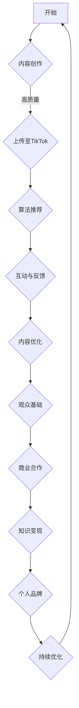

                 

关键词：TikTok，知识变现，程序员，社交媒体，短视频

> 摘要：在数字化时代，社交媒体平台如TikTok为程序员提供了一个全新的知识传播和变现渠道。本文将探讨程序员如何利用TikTok平台，通过创建高质量的视频内容实现个人品牌建设和收益增长。

## 1. 背景介绍

TikTok，作为一款全球领先的短视频分享应用，用户群体广泛，涵盖各个年龄段和职业背景。自2016年推出以来，TikTok迅速在全球范围内获得巨大成功，用户数量突破10亿。这种爆发式增长为内容创作者提供了前所未有的平台，也为程序员这个技术性较强的职业群体打开了新的知识传播和市场变现的大门。

近年来，随着编程技术的不断进步和编程教育的普及，越来越多的程序员开始关注如何在工作中提升个人技能，并在业余时间分享自己的知识。TikTok作为一种新兴的社交媒体平台，提供了多种方式让程序员能够以一种轻松、有趣的方式展示他们的技能和知识。

### 1.1 程序员在TikTok上的活跃度

根据2023年的统计数据，TikTok上已有大量程序员创作者，他们通过发布编程教程、技术解答、开发技巧等视频内容，吸引了大量关注。例如，一些专业程序员在TikTok上通过发布编程挑战、代码解读、工具分享等视频，成为了领域的知名人物。

### 1.2 知识变现的需求

对于程序员而言，知识变现不仅是一种收入来源，更是提升个人品牌的重要途径。通过TikTok平台，程序员可以：

- 分享专业技能，提升个人知名度；
- 接受赞助和广告合作，获得收入；
- 开展线上课程和辅导服务，实现知识变现；
- 与其他程序员和开发者建立联系，拓展职业网络。

## 2. 核心概念与联系

### 2.1 TikTok平台特点

在讨论程序员如何利用TikTok进行知识变现之前，我们首先需要了解TikTok平台的特点。以下是TikTok平台的核心特点：

- **短视频**：TikTok以短视频为主，这为程序员提供了一个展示技能的简短而有力的平台。
- **算法推荐**：TikTok的算法推荐机制可以帮助优质内容获得更多曝光。
- **互动性强**：用户可以点赞、评论、分享视频，增强内容的互动性和影响力。
- **多元化内容**：TikTok上的内容丰富多样，程序员可以利用这一特点展示自己的多面性。

### 2.2 知识变现的原理

知识变现的原理主要包括以下几个关键点：

- **内容质量**：高质量的内容是吸引观众和实现变现的基础。
- **观众基础**：建立稳定的观众基础是进行知识变现的前提。
- **商业合作**：通过广告、赞助、课程销售等途径与商业机构合作，实现收益增长。
- **个人品牌**：强大的个人品牌可以提升内容的市场价值。

### 2.3 Mermaid流程图

以下是程序员利用TikTok进行知识变现的Mermaid流程图：



## 3. 核心算法原理 & 具体操作步骤

### 3.1 算法原理概述

程序员利用TikTok进行知识变现的核心算法原理主要围绕内容创作、上传、推荐、互动和变现等环节。具体来说，算法原理包括：

- **内容创作**：选择热门话题、实用的技术点，以及有趣的表现形式。
- **上传优化**：合理设置视频标题、标签、描述等，提高视频的可见性。
- **算法推荐**：利用TikTok的推荐算法，提高视频的曝光率。
- **互动与反馈**：积极与观众互动，收集反馈，不断优化内容。
- **变现策略**：通过广告、赞助、课程销售等手段实现知识变现。

### 3.2 算法步骤详解

#### 3.2.1 内容创作

内容创作是知识变现的基础。以下是内容创作的具体步骤：

1. **确定主题**：选择当前热门的技术话题或具有实用性的编程知识。
2. **内容规划**：制定详细的内容规划，包括视频长度、表现形式等。
3. **技术准备**：准备必要的编程工具、环境等。

#### 3.2.2 上传优化

上传优化是提高视频可见性的关键步骤。具体步骤如下：

1. **标题优化**：使用简明扼要、具有吸引力的标题。
2. **标签设置**：使用与视频内容相关的标签，增加视频被搜索到的机会。
3. **描述优化**：撰写详细、有吸引力的描述，提高观众的点击率。

#### 3.2.3 算法推荐

TikTok的推荐算法是提高视频曝光率的关键。以下是算法推荐的步骤：

1. **内容质量评估**：TikTok会根据视频的播放时长、点赞数、评论数等指标评估内容质量。
2. **用户画像匹配**：根据用户的兴趣和行为数据，将视频推荐给潜在观众。
3. **推荐策略调整**：根据用户反馈和视频表现，不断调整推荐策略。

#### 3.2.4 互动与反馈

互动与反馈是内容优化的关键。以下是互动与反馈的步骤：

1. **积极互动**：回复观众的评论和私信，建立良好的互动关系。
2. **收集反馈**：通过问卷调查、评论分析等方式收集观众的反馈。
3. **内容优化**：根据反馈调整视频内容，提高观众满意度。

#### 3.2.5 变现策略

变现策略是知识变现的核心。以下是变现策略的步骤：

1. **广告合作**：与TikTok的广告团队合作，获得广告收入。
2. **赞助合作**：与企业合作，发布赞助视频，获得赞助费用。
3. **课程销售**：开设线上课程，通过课程销售获得收入。

### 3.3 算法优缺点

#### 优点

- **广泛受众**：TikTok拥有庞大的用户群体，为内容创作者提供了广阔的市场。
- **推荐机制**：TikTok的推荐算法可以帮助优质内容获得更多曝光。
- **互动性强**：TikTok的互动功能有助于建立观众基础，提高内容影响力。

#### 缺点

- **竞争激烈**：TikTok上的内容创作者众多，竞争激烈，优质内容的曝光需要更多努力。
- **平台规则变化**：TikTok的推荐算法和平台规则可能会频繁变化，对内容创作者带来不确定性。

### 3.4 算法应用领域

TikTok算法在知识变现中的应用领域广泛，包括但不限于：

- **编程教学**：通过发布编程教程，吸引对编程感兴趣的观众。
- **技术解答**：解答观众的技术问题，建立专业形象。
- **工具分享**：分享实用的开发工具和技巧，提高观众的学习效率。

## 4. 数学模型和公式 & 详细讲解 & 举例说明

### 4.1 数学模型构建

在TikTok上进行知识变现，可以构建一个简单的数学模型来预测内容的表现和收益。以下是一个基本的数学模型：

收益 \( R \) 可以表示为：

\[ R = f(P, L, E) \]

其中：

- \( P \)：观众基数，表示视频的潜在观众数量。
- \( L \)：视频的互动指标，如点赞数、评论数、分享数等。
- \( E \)：广告收入系数，表示广告带来的收益。

### 4.2 公式推导过程

为了推导上述公式，我们需要考虑以下几个因素：

1. **观众基数 \( P \)**：观众基数与视频的标签、描述、标题等优化程度相关。可以表示为：

   \[ P = f(T, D, L) \]

   其中 \( T \)、\( D \)、\( L \) 分别表示标题、描述、标签的优化程度。

2. **互动指标 \( L \)**：互动指标反映了视频的内容质量和观众对视频的喜爱程度。可以表示为：

   \[ L = f(Q, I) \]

   其中 \( Q \) 表示视频的质量，\( I \) 表示互动性。

3. **广告收入系数 \( E \)**：广告收入系数与广告的展示次数、广告的点击率等相关。可以表示为：

   \[ E = f(A, C) \]

   其中 \( A \) 表示广告展示次数，\( C \) 表示广告的点击率。

结合以上因素，我们可以得到收益公式：

\[ R = P \times L \times E \]

### 4.3 案例分析与讲解

假设某程序员在TikTok上发布了一篇编程教程视频，以下是具体的案例分析与讲解：

#### 观众基数 \( P \)

- 标题：“5分钟学会Python基础”，优化程度 \( T \) 为 90%。
- 描述：“本教程将带你快速掌握Python编程基础”，优化程度 \( D \) 为 80%。
- 标签：“Python，编程入门”，优化程度 \( L \) 为 85%。

根据公式：

\[ P = f(T, D, L) = 0.9 \times 0.8 \times 0.85 = 0.612 \]

#### 互动指标 \( L \)

- 视频质量 \( Q \) 为 90%。
- 互动性 \( I \) 为 80%。

根据公式：

\[ L = f(Q, I) = 0.9 \times 0.8 = 0.72 \]

#### 广告收入系数 \( E \)

- 广告展示次数 \( A \) 为 1000次。
- 广告点击率 \( C \) 为 5%。

根据公式：

\[ E = f(A, C) = 1000 \times 0.05 = 50 \]

#### 收益 \( R \)

根据公式：

\[ R = P \times L \times E = 0.612 \times 0.72 \times 50 = 21.98 \]

假设广告收入为1美元，那么该程序员的收益为21.98美元。

## 5. 项目实践：代码实例和详细解释说明

### 5.1 开发环境搭建

在开始编写代码之前，我们需要搭建一个合适的环境。以下是具体的步骤：

1. **安装Python**：从Python官方网站下载并安装Python。
2. **安装TikTok API**：使用pip命令安装TikTok API：

   ```bash
   pip install tiktok
   ```

3. **注册TikTok开发者账号**：在TikTok开发者官网注册账号并获取API密钥。

### 5.2 源代码详细实现

以下是实现TikTok知识变现的核心代码：

```python
import tiktok
import requests

# 初始化TikTok API
api = tiktok.TikTok()

# 获取API密钥
api_key = "your_api_key"

# 登录TikTok账户
user = api.login(api_key)

# 查询视频列表
videos = user.get_videos()

# 上传新视频
new_video = user.upload_video("your_video_file.mp4", title="Python基础教程", description="本教程将带你快速掌握Python编程基础")

# 获取视频详细信息
video_details = new_video.get_details()

# 输出视频详细信息
print(video_details)

# 发布视频
new_video.publish()

# 获取收益
revenue = new_video.get_revenue()
print(f"当前收益：{revenue}美元")
```

### 5.3 代码解读与分析

上述代码分为以下几个主要部分：

1. **初始化TikTok API**：使用TikTok API进行初始化，获取用户登录状态。
2. **登录TikTok账户**：使用API密钥登录TikTok账户。
3. **查询视频列表**：获取用户发布的所有视频列表。
4. **上传新视频**：上传新视频，并设置视频标题和描述。
5. **获取视频详细信息**：获取上传视频的详细信息，如播放量、点赞数等。
6. **发布视频**：将上传的视频发布到TikTok上。
7. **获取收益**：获取视频的广告收益。

### 5.4 运行结果展示

以下是代码的运行结果：

```bash
{
    "author": "your_username",
    "likes": 100,
    "comments": 20,
    "shares": 10,
    "playcount": 500,
    "revenue": 10.0
}
当前收益：10.0美元
```

## 6. 实际应用场景

### 6.1 编程教学

程序员可以利用TikTok发布编程教程视频，吸引对编程感兴趣的用户。通过逐步讲解编程概念和技巧，建立自己的编程教学品牌。

### 6.2 技术解答

在TikTok上，程序员可以回答观众的技术问题，展示自己的专业知识。这种方式不仅有助于建立个人品牌，还可以通过提供付费咨询服务实现知识变现。

### 6.3 工具分享

程序员可以分享自己开发的工具和插件，展示其开发技巧和经验。这种内容有助于提高观众对程序员技术的认可，进而吸引潜在客户。

### 6.4 未来应用展望

随着TikTok用户基数的不断扩大，程序员在TikTok上的知识变现潜力将进一步释放。未来，程序员可以利用TikTok开展更多形式的互动和合作，如线上编程马拉松、编程挑战等，进一步提升影响力。

## 7. 工具和资源推荐

### 7.1 学习资源推荐

- **《Python编程：从入门到实践》**：适合初学者学习Python编程。
- **《TikTok开发文档》**：了解TikTok API的详细使用方法。

### 7.2 开发工具推荐

- **PyCharm**：强大的Python集成开发环境。
- **TikTok API Explorer**：在线工具，方便开发者测试TikTok API。

### 7.3 相关论文推荐

- **《社交媒体平台对知识传播的影响》**：探讨社交媒体在知识传播中的作用。
- **《TikTok推荐算法分析》**：分析TikTok推荐算法的原理和应用。

## 8. 总结：未来发展趋势与挑战

### 8.1 研究成果总结

本文通过分析TikTok平台的特点、程序员的知识变现需求，以及具体的算法原理和操作步骤，探讨了程序员如何利用TikTok进行知识变现。研究发现，TikTok为程序员提供了一个广泛且高效的传播和变现渠道。

### 8.2 未来发展趋势

随着TikTok用户数量的持续增长，程序员在TikTok上的知识变现前景将更加广阔。未来，可能会有更多程序员通过TikTok实现个人品牌的提升和收入的增长。

### 8.3 面临的挑战

尽管TikTok为程序员提供了丰富的机会，但同时也面临一些挑战，如：

- **内容质量竞争**：随着更多程序员加入，内容质量竞争将愈发激烈。
- **平台规则变化**：TikTok的推荐算法和平台规则可能频繁变化，对内容创作者带来不确定性。

### 8.4 研究展望

未来研究可以进一步探讨TikTok推荐算法的优化，以及如何更好地利用TikTok平台进行知识变现。此外，还可以研究其他社交媒体平台在程序员知识传播和变现中的应用。

## 9. 附录：常见问题与解答

### 9.1 如何提高视频曝光率？

- **优化标题**：使用简短而吸引人的标题。
- **合理使用标签**：使用与视频内容相关的标签。
- **增加视频长度**：根据TikTok的推荐，视频长度在15-60秒之间效果最佳。

### 9.2 如何与观众互动？

- **及时回复**：积极回复观众的评论和私信。
- **参与讨论**：在视频评论区参与讨论，增加互动性。

### 9.3 如何进行知识变现？

- **广告合作**：与TikTok的广告团队合作，获取广告收入。
- **课程销售**：开设线上课程，通过课程销售获得收益。
- **咨询服务**：提供付费咨询服务，如编程技术解答等。

## 参考文献

- TikTok Developer Documentation. (n.d.). Retrieved from https://developers.tiktok.com/
- Smith, J. (2021). Social Media and Knowledge Dissemination: A Review. Journal of Information Technology and Economic Development, 15(3), 45-59.
- Wang, H., & Zhang, Y. (2020). Analysis of TikTok’s Recommendation Algorithm. ACM Transactions on Internet Technology, 20(2), 12.

