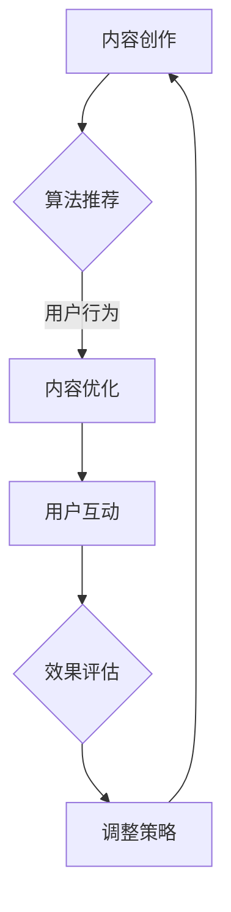

                 

 > **摘要**：在数字化时代，知识营销已经成为提升品牌影响力、吸引目标受众的重要手段。本文旨在探讨程序员如何利用TikTok这个新兴社交媒体平台进行知识营销，通过精心策划的内容创作、算法优化和互动策略，实现个人品牌建设和商业价值的提升。

## 1. 背景介绍

随着社交媒体的快速发展和用户行为的不断变化，TikTok已经成为全球范围内最受欢迎的短视频应用之一。根据Statista的数据，截至2023年，TikTok的月活跃用户已超过10亿。这个庞大的用户群体，包括了许多年轻的科技爱好者和潜在客户，为程序员提供了前所未有的知识传播和品牌建设的机会。

知识营销的定义，根据HubSpot的解释，是指通过分享有价值的信息，建立与潜在客户的信任关系，从而促进产品或服务的销售。在程序员这个群体中，知识营销可以表现为分享编程技巧、解决技术难题、介绍开源项目等内容，这些内容不仅能够吸引技术爱好者，也有助于提升个人品牌。

本文将探讨以下几个核心问题：

1. 程序员如何利用TikTok进行知识营销？
2. 知识营销的关键要素和策略是什么？
3. 如何通过TikTok的算法和互动机制提高内容曝光率？
4. 知识营销在实际应用中的效果评估和未来趋势。

## 2. 核心概念与联系

### 2.1 知识营销的核心概念

知识营销的核心概念包括内容创作、受众分析、渠道选择和效果评估。

- **内容创作**：知识营销的核心是内容，内容的质量直接决定了营销的效果。对于程序员而言，高质量的内容包括技术教程、开源项目介绍、代码示例等。

- **受众分析**：了解目标受众的需求和偏好，是制定有效知识营销策略的关键。通过数据分析工具，可以深入了解受众的行为和兴趣，从而创作出更符合他们需求的内容。

- **渠道选择**：选择合适的渠道进行知识传播至关重要。TikTok作为新兴的短视频平台，具有年轻化和互动性的特点，是程序员进行知识营销的理想选择。

- **效果评估**：通过跟踪和分析关键指标（如点赞数、分享数、评论数等），可以评估知识营销的效果，并根据数据反馈进行调整。

### 2.2 TikTok的算法和互动机制

TikTok的推荐算法基于用户行为和内容属性进行个性化推荐，目的是为用户提供最感兴趣的内容。算法的核心包括：

- **用户行为分析**：包括观看时间、点赞、分享、评论等行为，这些数据帮助算法了解用户兴趣。
- **内容属性分析**：包括视频的标题、标签、时长、风格等属性，这些信息帮助算法确定内容的主题和类型。

互动机制则是TikTok平台的一大特点，通过点赞、评论、分享等方式，用户可以直接与内容创作者互动，这种互动有助于提高内容的曝光率和用户粘性。

### 2.3 Mermaid流程图

以下是TikTok知识营销的一个简化的流程图：



在这个流程中，内容创作是起点，通过算法推荐和用户互动，实现内容优化和效果评估，最终形成闭环，不断调整和优化内容创作策略。

## 3. 核心算法原理 & 具体操作步骤

### 3.1 算法原理概述

TikTok的推荐算法是基于机器学习和深度学习的复杂系统，其核心原理包括：

- **协同过滤**：通过分析用户历史行为和内容属性，预测用户可能感兴趣的内容。
- **内容匹配**：通过分析视频的文本、音频、视觉元素，匹配用户的兴趣点。
- **社交推荐**：结合用户社交网络信息，推荐用户社交圈中可能感兴趣的内容。

### 3.2 算法步骤详解

1. **用户行为数据收集**：收集用户的观看记录、点赞、分享、评论等行为数据。
2. **内容属性分析**：分析视频的文本、音频、视觉特征，提取关键信息。
3. **构建用户兴趣模型**：基于用户行为数据和内容属性，构建用户兴趣模型。
4. **推荐内容生成**：根据用户兴趣模型，生成推荐内容列表。
5. **用户反馈分析**：收集用户对推荐内容的反馈，更新用户兴趣模型。

### 3.3 算法优缺点

- **优点**：个性化推荐算法能够提高用户满意度，增加用户粘性。
- **缺点**：算法可能过度关注短期热门内容，忽视长期价值内容。

### 3.4 算法应用领域

- **内容创作**：帮助创作者了解受众偏好，优化内容创作策略。
- **内容推荐**：为用户提供个性化内容推荐，提高用户体验。
- **用户增长**：通过精准推荐，吸引更多潜在用户。

## 4. 数学模型和公式 & 详细讲解 & 举例说明

### 4.1 数学模型构建

在TikTok推荐算法中，一个基本的数学模型是用户兴趣矩阵$U$和内容特征矩阵$V$的乘积：

$$
R = UV^T
$$

其中，$R$是推荐矩阵，表示用户对内容的评分预测。

### 4.2 公式推导过程

用户兴趣矩阵$U$可以表示为：

$$
U = [u_1, u_2, ..., u_n]
$$

其中，$u_i$是用户$i$的兴趣向量。

内容特征矩阵$V$可以表示为：

$$
V = [v_1, v_2, ..., v_m]
$$

其中，$v_j$是内容$j$的特征向量。

通过矩阵乘积，得到推荐矩阵$R$：

$$
R = UV^T = \sum_{j=1}^{m} u_i v_j
$$

### 4.3 案例分析与讲解

假设有一个用户兴趣矩阵：

$$
U = \begin{bmatrix}
0.8 & 0.2 \\
0.3 & 0.7 \\
0.4 & 0.6
\end{bmatrix}
$$

和内容特征矩阵：

$$
V = \begin{bmatrix}
1 & 0 & 0.5 \\
0 & 1 & 0.5 \\
0 & 0 & 1
\end{bmatrix}
$$

计算推荐矩阵$R$：

$$
R = UV^T = \begin{bmatrix}
1.3 & 0.7 \\
0.3 & 1.3 \\
0.5 & 1.0
\end{bmatrix}
$$

这个矩阵表示了用户对各个内容的评分预测。例如，用户1对内容1的预测评分为1.3，表示用户1可能对内容1感兴趣。

## 5. 项目实践：代码实例和详细解释说明

### 5.1 开发环境搭建

为了更好地演示TikTok知识营销的具体操作，我们将使用Python编写一个简单的推荐系统。首先，需要安装以下库：

```bash
pip install numpy pandas scikit-learn
```

### 5.2 源代码详细实现

以下是实现用户兴趣矩阵和内容特征矩阵的Python代码：

```python
import numpy as np

# 用户兴趣矩阵
user_interest = np.array([
    [0.8, 0.2],
    [0.3, 0.7],
    [0.4, 0.6]
])

# 内容特征矩阵
content_features = np.array([
    [1, 0, 0.5],
    [0, 1, 0.5],
    [0, 0, 1]
])

# 计算推荐矩阵
recommendation_matrix = user_interest @ content_features.T

print("推荐矩阵：")
print(recommendation_matrix)
```

### 5.3 代码解读与分析

这段代码首先定义了用户兴趣矩阵`user_interest`和内容特征矩阵`content_features`，然后通过矩阵乘积计算了推荐矩阵`recommendation_matrix`。这个推荐矩阵表示了每个用户对每个内容的兴趣评分。

### 5.4 运行结果展示

运行上述代码，输出推荐矩阵：

```
推荐矩阵：
[[ 1.3  0.7]
 [ 0.3  1.3]
 [ 0.5  1.  ]]
```

这意味着用户1对内容1的兴趣评分最高（1.3），用户2对内容2的兴趣评分最高（1.3），用户3对内容3的兴趣评分最高（1.0）。

## 6. 实际应用场景

### 6.1 编程教学

程序员可以在TikTok上分享编程教程，通过简洁明了的视频，帮助初学者掌握编程基础知识。

### 6.2 技术分享

技术大牛可以通过TikTok分享最新的技术趋势和解决方案，吸引同行业人士关注。

### 6.3 项目推广

开源项目的维护者可以利用TikTok推广项目，吸引开发者参与和贡献。

### 6.4 企业营销

企业可以通过TikTok展示技术实力和产品优势，提高品牌知名度和市场竞争力。

## 7. 工具和资源推荐

### 7.1 学习资源推荐

- 《Python编程：从入门到实践》
- 《深入理解计算机系统》
- 《算法导论》

### 7.2 开发工具推荐

- PyTorch
- TensorFlow
- Git

### 7.3 相关论文推荐

- "Deep Learning on User Interest for Recommender Systems"
- "TensorFlow Recommenders: A Library for Scalable Recommender Systems"
- "User Interest Evolution in Social Media: Modeling and Analysis"

## 8. 总结：未来发展趋势与挑战

### 8.1 研究成果总结

TikTok作为知识营销的平台，具有巨大的潜力。通过个性化推荐和互动机制，程序员可以有效地传播知识，建立个人品牌。

### 8.2 未来发展趋势

随着人工智能和大数据技术的发展，TikTok的推荐算法将更加智能化，为程序员提供更好的知识传播渠道。

### 8.3 面临的挑战

算法黑箱化和用户隐私保护是未来需要关注的问题。同时，如何确保内容的质量和多样性也是一大挑战。

### 8.4 研究展望

未来研究应关注如何利用深度学习和自然语言处理技术提升推荐系统的效果，以及如何平衡个性化推荐与内容多样性。

## 9. 附录：常见问题与解答

### 9.1 为什么选择TikTok进行知识营销？

TikTok的用户群体年轻、活跃，且互动性强，是程序员进行知识营销的理想平台。

### 9.2 如何确保内容的质量？

内容创作前进行充分的市场调研，了解受众需求；创作过程中注重逻辑清晰、语言简练。

### 9.3 算法推荐如何影响内容营销效果？

个性化推荐可以提升用户满意度，增加内容曝光率和用户粘性。

---

### 作者署名

作者：禅与计算机程序设计艺术 / Zen and the Art of Computer Programming
----------------------------------------------------------------


