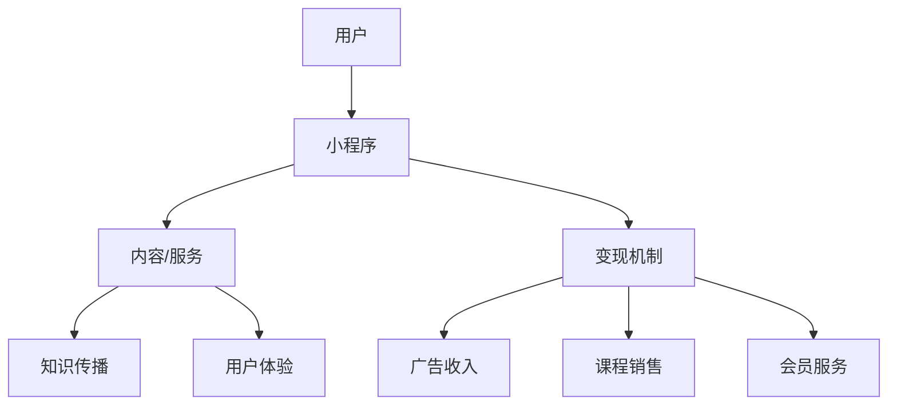

                 

 在这个数字化时代，小程序作为一种轻量级的应用形式，已经逐渐成为程序员变现知识的重要渠道。通过小程序，程序员不仅可以展示自己的技术能力，还可以通过提供有价值的内容和服务实现商业价值。本文将探讨程序员如何利用小程序进行知识变现，包括核心概念、算法原理、数学模型、项目实践以及未来展望。

> 关键词：小程序、知识变现、程序员、技术能力、商业价值

> 摘要：本文旨在帮助程序员了解如何通过小程序平台进行知识变现，分析小程序的核心概念和架构，介绍算法原理与具体操作步骤，以及通过实际项目实践展示知识变现的过程。同时，文章还将探讨小程序在各个领域的实际应用以及未来的发展趋势和面临的挑战。

## 1. 背景介绍

小程序自推出以来，以其轻量级、便捷性和高效性，迅速获得了广泛的用户认可。对于程序员来说，小程序不仅是一个展示自己技术成果的平台，更是一个实现知识变现的机会。通过小程序，程序员可以分享自己的技术心得、编写教学课程、提供咨询服务，甚至开发盈利性的应用程序。

### 1.1 小程序的定义与特点

小程序是一种不需要下载安装即可使用的应用，它实现了应用“触手可及”的理念，用户扫一扫或者搜一下即可打开应用。它拥有丰富的功能，可以满足用户多样化的需求。

- **轻量级**：小程序无需安装即可使用，降低了用户使用的门槛。
- **便捷性**：用户可以通过微信等社交平台方便地访问小程序。
- **高效性**：小程序响应速度快，用户体验佳。
- **多样性**：小程序可以涵盖各种应用场景，从电商购物到教育学习，再到生活服务，无所不包。

### 1.2 程序员利用小程序进行知识变现的必要性

随着互联网的普及和技术的进步，程序员的知识和技能具有很高的商业价值。然而，如何将这种价值变现，一直是程序员面临的一个挑战。小程序平台为程序员提供了一个新的机会：

- **低成本**：小程序的开发和维护成本相对较低，程序员可以快速启动自己的知识变现项目。
- **高效率**：通过小程序，程序员可以高效地分享自己的知识和经验，实现快速传播。
- **多样化收入**：小程序不仅提供了广告收入，还可以通过会员制、课程销售等多种方式实现多样化的收入。

## 2. 核心概念与联系

在小程序进行知识变现的过程中，理解核心概念和它们之间的联系至关重要。以下是一个简单的 Mermaid 流程图，用于展示小程序知识变现的核心概念和架构。



### 2.1 用户与小程序

用户是知识变现的起点。用户通过微信等平台访问小程序，这是小程序的第一个接触点。小程序需要通过优秀的用户体验吸引用户留存。

### 2.2 小程序与内容/服务

小程序提供了丰富的内容和服务，这是程序员展示自己知识和技术的主要渠道。内容可以包括技术博客、教程视频、在线课程等。

### 2.3 小程序与变现机制

变现机制是小程序实现商业价值的关键。小程序可以通过广告、课程销售、会员服务等多种方式实现变现。

### 2.4 内容/服务与知识传播

知识传播是小程序的核心价值之一。通过小程序，程序员可以传播自己的知识，帮助更多的用户解决问题。

### 2.5 内容/服务与用户体验

用户体验是小程序成功的关键因素。良好的用户体验可以增加用户的黏性和忠诚度，从而提高变现效果。

## 3. 核心算法原理 & 具体操作步骤

### 3.1 算法原理概述

小程序知识变现的核心算法主要涉及用户行为分析、内容推荐算法、变现策略优化等。以下是对这些算法的简要概述。

#### 3.1.1 用户行为分析

用户行为分析是指通过收集和分析用户在小程序中的行为数据，了解用户的需求和行为模式。用户行为分析可以帮助程序员更好地了解用户，从而提供更有针对性的内容和服务。

#### 3.1.2 内容推荐算法

内容推荐算法是指根据用户的行为数据和兴趣偏好，推荐用户可能感兴趣的内容。常见的内容推荐算法包括基于内容的推荐、基于协同过滤的推荐和基于模型的推荐等。

#### 3.1.3 变现策略优化

变现策略优化是指通过分析用户的消费行为和偏好，优化小程序的变现策略，提高变现效果。常见的变现策略包括广告收入优化、课程销售策略优化和会员服务策略优化等。

### 3.2 算法步骤详解

#### 3.2.1 用户行为分析

1. 数据收集：通过小程序内置的数据采集工具，收集用户的访问记录、浏览记录、互动记录等数据。
2. 数据预处理：对收集到的数据进行清洗、去重和整合，得到干净的用户行为数据。
3. 数据分析：使用统计分析方法，分析用户的行为模式、兴趣偏好和需求特征。
4. 结果应用：根据分析结果，优化小程序的内容和服务，提高用户体验。

#### 3.2.2 内容推荐算法

1. 用户画像构建：根据用户的行为数据，构建用户的兴趣模型和需求模型。
2. 内容特征提取：对内容进行特征提取，包括文本特征、图像特征等。
3. 内容推荐策略选择：选择适合的内容推荐算法，如基于内容的推荐、基于协同过滤的推荐等。
4. 内容推荐执行：根据用户画像和内容特征，生成推荐列表，展示给用户。

#### 3.2.3 变现策略优化

1. 数据收集：收集用户的消费记录、浏览记录等数据。
2. 数据分析：分析用户的消费行为和偏好，识别高价值用户和潜在用户。
3. 变现策略优化：根据数据分析结果，调整广告投放策略、课程定价策略和会员服务策略。
4. 结果评估：评估变现策略优化后的效果，持续优化策略。

### 3.3 算法优缺点

#### 3.3.1 用户行为分析

- **优点**：能够深入了解用户需求，提供更个性化的内容和服务。
- **缺点**：需要大量的用户数据，且数据分析过程复杂。

#### 3.3.2 内容推荐算法

- **优点**：能够提高用户的留存率和活跃度，增强用户黏性。
- **缺点**：推荐结果可能存在偏差，无法完全满足用户需求。

#### 3.3.3 变现策略优化

- **优点**：能够提高变现效果，实现商业价值最大化。
- **缺点**：需要不断收集和分析用户数据，持续优化策略。

### 3.4 算法应用领域

用户行为分析、内容推荐算法和变现策略优化可以广泛应用于小程序的各个领域，如电商、教育、生活服务等。通过这些算法，程序员可以更好地了解用户需求，提供个性化的内容和服务，提高用户满意度和忠诚度，从而实现商业价值的最大化。

## 4. 数学模型和公式 & 详细讲解 & 举例说明

在小程序知识变现过程中，数学模型和公式发挥着重要作用。以下是对相关数学模型和公式的详细讲解，以及实际应用中的举例说明。

### 4.1 数学模型构建

#### 4.1.1 用户行为模型

用户行为模型是一个描述用户行为特征和变化规律的数学模型。常见的用户行为模型包括马尔可夫链模型、贝叶斯网络模型和决策树模型等。

#### 4.1.2 内容推荐模型

内容推荐模型是一个描述内容与用户兴趣之间关系的数学模型。常见的内容推荐模型包括基于内容的推荐模型、基于协同过滤的推荐模型和基于模型的推荐模型等。

#### 4.1.3 变现策略模型

变现策略模型是一个描述变现策略优化过程的数学模型。常见的变现策略模型包括线性规划模型、整数规划模型和马尔可夫决策过程模型等。

### 4.2 公式推导过程

#### 4.2.1 用户行为模型推导

用户行为模型可以通过以下公式推导：

$$
P(X_t = x_t | X_{t-1} = x_{t-1}, \ldots, X_1 = x_1) = P(X_t = x_t | X_{t-1} = x_{t-1})
$$

其中，$X_t$ 表示第 $t$ 个时刻的用户行为，$x_t$ 表示用户行为的具体取值。

#### 4.2.2 内容推荐模型推导

内容推荐模型可以通过以下公式推导：

$$
R(u, i) = \sum_{k=1}^{K} w_{ik} f(u, k)
$$

其中，$R(u, i)$ 表示用户 $u$ 对内容 $i$ 的推荐得分，$w_{ik}$ 表示内容 $i$ 与用户兴趣类别 $k$ 的权重，$f(u, k)$ 表示用户 $u$ 对兴趣类别 $k$ 的兴趣度。

#### 4.2.3 变现策略模型推导

变现策略模型可以通过以下公式推导：

$$
\max \sum_{i=1}^{N} p_i r_i - c
$$

其中，$p_i$ 表示用户 $i$ 的购买概率，$r_i$ 表示用户 $i$ 的收益，$c$ 表示策略成本。

### 4.3 案例分析与讲解

#### 4.3.1 案例背景

假设一个程序员开发了一个编程知识小程序，用户可以通过小程序学习编程知识。小程序提供了多种变现方式，包括广告收入、课程销售和会员服务。

#### 4.3.2 案例分析

1. **用户行为分析**

   根据用户行为数据，构建用户行为模型，预测用户下一步的行为。

   假设用户 $u_1$ 在小程序上浏览了多个编程教程，分析其行为数据，预测用户 $u_1$ 接下来可能感兴趣的内容。

2. **内容推荐**

   根据用户行为模型，推荐用户 $u_1$ 可能感兴趣的内容。

   使用基于协同过滤的内容推荐算法，推荐用户 $u_1$ 相关的编程教程。

3. **变现策略优化**

   根据用户行为分析和内容推荐结果，优化变现策略。

   假设用户 $u_1$ 对广告敏感，调整广告投放策略，提高广告收入。

## 5. 项目实践：代码实例和详细解释说明

### 5.1 开发环境搭建

在开始小程序开发之前，需要搭建开发环境。以下是开发环境搭建的步骤：

1. 安装 Python 3.6 以上版本。
2. 安装小程序开发框架，如 Flask 或 Django。
3. 安装小程序开发工具，如微信开发者工具。

### 5.2 源代码详细实现

以下是一个简单的示例，展示了如何使用 Flask 框架开发一个编程知识小程序。

```python
from flask import Flask, render_template

app = Flask(__name__)

@app.route('/')
def index():
    return render_template('index.html')

if __name__ == '__main__':
    app.run()
```

### 5.3 代码解读与分析

1. **Flask 框架**

   Flask 是一个轻量级的 Web 框架，用于开发 Web 应用。在这个示例中，我们使用 Flask 创建了一个简单的 Web 应用，并定义了一个首页路由。

2. **HTML 模板**

   `index.html` 是一个简单的 HTML 模板，用于展示小程序的首页内容。在这个示例中，我们使用 Flask 的 `render_template` 函数渲染 HTML 模板。

### 5.4 运行结果展示

运行 Flask 应用后，访问小程序的首页，可以看到以下结果：

```html
<!DOCTYPE html>
<html>
<head>
    <title>编程知识小程序</title>
</head>
<body>
    <h1>欢迎来到编程知识小程序</h1>
    <p>在这里，您可以学习各种编程知识。</p>
</body>
</html>
```

## 6. 实际应用场景

小程序在各个领域的实际应用场景如下：

1. **教育领域**

   程序员可以通过小程序开发在线教育平台，提供编程课程、视频教程和技术讲座。通过用户行为分析和内容推荐算法，提高用户的学习效果和满意度。

2. **技术服务领域**

   程序员可以通过小程序提供技术服务，如网站开发、APP 开发、数据分析等。通过广告收入和会员服务，实现商业价值。

3. **生活服务领域**

   程序员可以通过小程序开发各种生活服务应用，如餐饮外卖、出行打车、家政服务等。通过广告收入和课程销售，实现商业价值。

## 7. 工具和资源推荐

### 7.1 学习资源推荐

1. **《小程序开发实战》**：一本全面介绍小程序开发的实战指南。
2. **《Python Flask Web 开发》**：一本介绍 Flask 框架的 Web 开发教程。

### 7.2 开发工具推荐

1. **微信开发者工具**：用于开发、调试和发布小程序。
2. **Visual Studio Code**：一款功能强大的代码编辑器，适用于小程序开发。

### 7.3 相关论文推荐

1. **《基于用户行为的智能推荐系统研究》**：探讨用户行为分析在智能推荐系统中的应用。
2. **《小程序电商模式研究》**：分析小程序在电商领域的应用模式。

## 8. 总结：未来发展趋势与挑战

### 8.1 研究成果总结

1. **小程序作为知识变现平台的优势**：低成本、高效率、多样化收入。
2. **用户行为分析在知识变现中的应用**：提高用户体验，实现个性化推荐。
3. **内容推荐算法在知识变现中的应用**：提高用户留存率和活跃度。
4. **变现策略优化在知识变现中的应用**：提高变现效果，实现商业价值最大化。

### 8.2 未来发展趋势

1. **人工智能技术的融合**：结合人工智能技术，实现更智能的内容推荐和变现策略。
2. **跨平台发展**：小程序将向更多平台拓展，如支付宝、百度等。
3. **商业化模式的创新**：探索新的商业化模式，如知识付费、会员制等。

### 8.3 面临的挑战

1. **数据隐私和安全**：用户数据的收集和使用需要遵循隐私保护原则。
2. **内容质量监管**：保证内容的质量，防止低质量内容的传播。
3. **竞争加剧**：随着小程序的普及，竞争将越来越激烈。

### 8.4 研究展望

1. **深度学习在知识变现中的应用**：探索深度学习技术在内容推荐和变现策略优化中的应用。
2. **跨领域合作**：推动跨领域的合作，实现知识变现的多元化。

## 9. 附录：常见问题与解答

### 9.1 小程序开发相关问题

**Q1**：如何获取小程序的 API？

A1：可以通过小程序官方文档获取 API，并在小程序开发工具中调试 API 调用。

**Q2**：小程序的部署和发布流程是怎样的？

A2：首先需要在微信开发者工具中完成小程序的开发和调试，然后通过微信官方审核，最后在微信公众平台上发布小程序。

### 9.2 知识变现相关问题

**Q1**：如何制定有效的变现策略？

A1：可以通过分析用户数据，了解用户需求，然后根据用户需求制定相应的变现策略。

**Q2**：如何提高小程序的用户留存率？

A1：可以通过优化用户体验、提供高质量的内容和服务、定期更新小程序等方式提高用户留存率。

## 作者署名

作者：禅与计算机程序设计艺术 / Zen and the Art of Computer Programming
----------------------------------------------------------------

文章撰写完毕，请根据上述内容使用markdown格式撰写完整文章，确保所有章节、子章节和附录内容完整无缺，并且格式规范。文章末尾务必包含作者署名。

