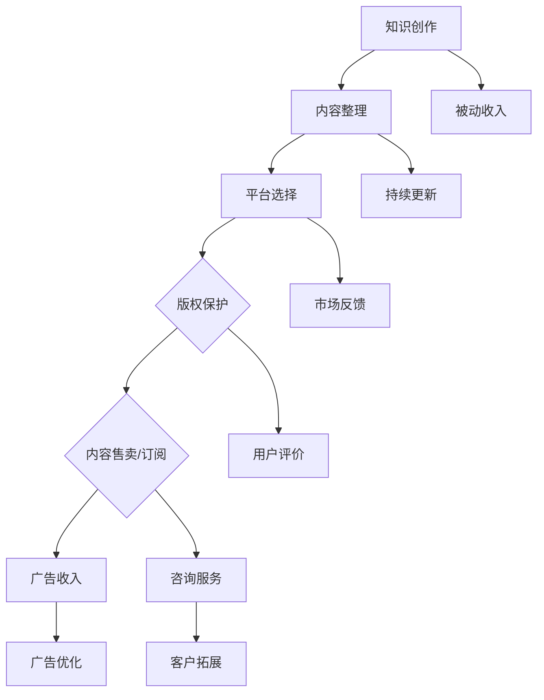

                 

关键词：知识付费，被动收入，程序员，知识变现，在线课程，自媒体平台

摘要：本文将探讨程序员如何通过知识付费实现被动收入。从在线课程制作、自媒体运营、知识付费平台分享、开源项目及咨询服务等多个方面，深入分析程序员如何将自己的专业知识转化为可持续的经济收益。

## 1. 背景介绍

在信息化时代，技术人才的需求不断增加，程序员作为信息时代的关键角色，其价值也愈发凸显。然而，传统的程序员收入模式主要集中在项目开发、企业雇佣等主动收入途径。随着互联网技术的发展，程序员开始探索新的收入模式——知识付费，通过将自己的专业知识转化为线上课程、撰写技术博客、参与开源项目等方式，实现被动收入。

知识付费，是指个人或机构将自己的知识、技能和经验通过线上平台进行销售，以实现经济回报。在知识付费模式中，内容创作者可以自由选择创作形式，如视频教程、电子书、在线课程等，将其知识转化为可以重复售卖的商品。

被动收入，是指通过一次性行为获得，但在之后可以长期获得收益的方式。对于程序员来说，被动收入可以来源于多个方面，如课程售卖、广告收入、内容订阅等。

## 2. 核心概念与联系

### 2.1 知识付费

知识付费的核心在于将个人或机构的知识、技能和经验进行系统化、结构化的整理，并转化为可售卖的商品。这包括以下几个步骤：

1. **内容创作**：根据目标受众的需求，创作具有实用性和专业性的内容。
2. **平台选择**：选择适合的平台进行内容发布和销售，如 Udemy、Coursera、网易云课堂等。
3. **版权保护**：确保内容原创性，采取版权保护措施，防止内容被盗用。
4. **持续更新**：随着技术的不断发展，定期更新课程内容，保持其时效性和吸引力。

### 2.2 被动收入

被动收入的来源多种多样，主要包括：

1. **课程售卖**：通过线上课程售卖，获取一次性收入。
2. **广告收入**：在自媒体平台或博客上投放广告，获取广告收益。
3. **内容订阅**：提供优质内容，吸引粉丝订阅，实现持续收入。
4. **咨询服务**：利用专业技能，提供专业咨询服务，获取收入。

### 2.3 Mermaid 流程图

下面是知识付费与被动收入之间的Mermaid流程图：



## 3. 核心算法原理 & 具体操作步骤

### 3.1 算法原理概述

知识付费与被动收入的实现，主要依赖于以下核心算法原理：

1. **内容创作算法**：根据用户需求和行业趋势，生成具有吸引力的课程内容。
2. **营销算法**：通过数据分析，优化课程推广策略，提高转化率。
3. **用户行为分析算法**：通过用户行为数据，了解用户需求，调整内容策略。
4. **广告投放算法**：根据用户兴趣和行为，精准投放广告，提高广告效果。

### 3.2 算法步骤详解

1. **内容创作算法**
   - 数据收集：收集用户需求、行业动态、竞争对手等信息。
   - 内容规划：根据数据，规划课程内容，确保其具有实用性和吸引力。
   - 内容编写：根据规划，撰写课程内容，注意逻辑性和条理性。

2. **营销算法**
   - 数据分析：分析用户数据，了解用户兴趣和行为。
   - 推广策略：根据数据分析，制定推广策略，如SEO优化、社交媒体推广等。
   - 转化率优化：根据推广效果，调整推广策略，提高转化率。

3. **用户行为分析算法**
   - 数据收集：收集用户在平台上的行为数据，如浏览、购买、评论等。
   - 数据分析：分析用户行为数据，了解用户需求和行为模式。
   - 内容调整：根据用户行为数据，调整内容策略，提高用户满意度。

4. **广告投放算法**
   - 数据收集：收集用户兴趣、行为等数据。
   - 投放策略：根据用户数据，制定广告投放策略，如按兴趣投放、按行为投放等。
   - 广告效果分析：根据广告效果数据，调整投放策略，提高广告效果。

### 3.3 算法优缺点

1. **内容创作算法**
   - 优点：能够根据用户需求生成具有吸引力的课程内容，提高用户满意度。
   - 缺点：需要大量数据支持，且算法复杂度较高。

2. **营销算法**
   - 优点：能够通过数据分析，优化推广策略，提高转化率。
   - 缺点：需要大量数据支持，且算法复杂度较高。

3. **用户行为分析算法**
   - 优点：能够根据用户行为数据，了解用户需求，调整内容策略。
   - 缺点：需要大量数据支持，且算法复杂度较高。

4. **广告投放算法**
   - 优点：能够根据用户数据，精准投放广告，提高广告效果。
   - 缺点：需要大量数据支持，且算法复杂度较高。

### 3.4 算法应用领域

1. **在线教育**：通过内容创作算法，生成具有吸引力的课程内容；通过营销算法，提高课程转化率；通过用户行为分析算法，调整内容策略，提高用户满意度。
2. **广告投放**：通过广告投放算法，精准投放广告，提高广告效果。

## 4. 数学模型和公式 & 详细讲解 & 举例说明

### 4.1 数学模型构建

知识付费与被动收入的实现，可以通过以下数学模型进行构建：

设 \( R \) 为程序员通过知识付费获得的收入，\( C \) 为课程的创作成本，\( P \) 为课程的售价，\( S \) 为课程的销售额，\( D \) 为课程的订阅量，\( A \) 为课程的广告收入，则：

\[ R = S \times P - C + A \]

其中：

- \( R \)：收入
- \( C \)：创作成本
- \( P \)：售价
- \( S \)：销售额
- \( D \)：订阅量
- \( A \)：广告收入

### 4.2 公式推导过程

1. **销售额 \( S \) 的计算**：

\[ S = D \times P \]

其中：

- \( D \)：订阅量
- \( P \)：售价

2. **广告收入 \( A \) 的计算**：

\[ A = A_0 + \alpha \times S \]

其中：

- \( A_0 \)：初始广告收入
- \( \alpha \)：广告收入增长率

3. **收入 \( R \) 的计算**：

\[ R = S \times P - C + A \]

### 4.3 案例分析与讲解

假设一个程序员创作了一门课程，课程售价为 100 元，创作成本为 5000 元。经过一段时间的推广，课程订阅量为 1000 个，广告收入为 2000 元。

根据上述数学模型，可以计算出该程序员的收入：

\[ S = D \times P = 1000 \times 100 = 100000 \]
\[ A = A_0 + \alpha \times S = 2000 + 0.1 \times 100000 = 12000 \]
\[ R = S \times P - C + A = 100000 \times 100 - 5000 + 12000 = 157000 \]

因此，该程序员的收入为 157000 元。

### 5. 项目实践：代码实例和详细解释说明

#### 5.1 开发环境搭建

在开始制作在线课程之前，程序员需要搭建一个适合开发的环境。以下是一个基本的开发环境搭建步骤：

1. 安装 Python 环境：Python 是一门广泛应用于数据科学和机器学习的编程语言，安装 Python 可以通过官方下载页（https://www.python.org/downloads/）进行。
2. 安装 Jupyter Notebook：Jupyter Notebook 是一个交互式的 Web 应用程序，用于展示 Python 代码和结果。可以通过 pip 安装：
   ```bash
   pip install notebook
   ```
3. 安装相关库：根据课程内容，安装相应的库。例如，如果课程涉及数据分析和可视化，可以安装 pandas、matplotlib 等：
   ```bash
   pip install pandas matplotlib
   ```

#### 5.2 源代码详细实现

以下是一个简单的 Python 代码实例，用于生成一个简单的在线课程教学文档：

```python
import pandas as pd
import matplotlib.pyplot as plt

# 数据准备
data = {
    'Chapter': ['Introduction', 'Basic Concepts', 'Advanced Techniques', 'Case Studies'],
    'Content': ['Introduction to the course', 'Basic concepts of the subject', 'Advanced techniques in the field', 'Real-world case studies']
}

df = pd.DataFrame(data)

# 内容生成
with open('course_content.md', 'w') as f:
    for index, row in df.iterrows():
        f.write(f"## {row['Chapter']}\n")
        f.write(f"{row['Content']}\n\n")

# 可视化展示
df.plot.bar(x='Chapter', y='Content', figsize=(10, 6))
plt.title('Course Content Structure')
plt.ylabel('Content')
plt.xlabel('Chapter')
plt.show()
```

#### 5.3 代码解读与分析

1. **数据准备**：使用 pandas 库创建一个包含课程章节和内容的 DataFrame。
2. **内容生成**：将 DataFrame 的数据写入到 Markdown 文件中，形成课程教学文档。
3. **可视化展示**：使用 matplotlib 库生成课程内容结构的条形图，帮助用户更好地理解课程结构。

#### 5.4 运行结果展示

运行上述代码后，会生成一个名为 `course_content.md` 的文件，内容如下：

```markdown
## Introduction
Introduction to the course

## Basic Concepts
Basic concepts of the subject

## Advanced Techniques
Advanced techniques in the field

## Case Studies
Real-world case studies
```

同时，还会展示一个课程内容结构的条形图：


## 6. 实际应用场景

### 6.1 在线教育平台

程序员可以利用在线教育平台，如 Udemy、Coursera、网易云课堂等，将自己的专业知识转化为线上课程。通过课程售卖，实现被动收入。

### 6.2 技术博客

程序员可以建立个人技术博客，撰写技术文章，吸引粉丝订阅。通过广告收入和内容订阅，实现被动收入。

### 6.3 开源项目

程序员可以参与开源项目，将自己的代码和经验分享给社区。通过开源项目的捐赠和赞助，实现被动收入。

### 6.4 咨询服务

程序员可以利用自己的专业技能，提供专业咨询服务。通过咨询服务，实现被动收入。

## 7. 工具和资源推荐

### 7.1 学习资源推荐

- 《深度学习》（Goodfellow, Bengio, Courville 著）：深度学习领域的经典教材，适合程序员深入了解深度学习。
- 《Effective Python》：Python 编程的最佳实践，适合提高编程水平。
- 《大话数据结构》：通俗易懂的数据结构入门书籍，适合程序员学习数据结构。

### 7.2 开发工具推荐

- Jupyter Notebook：交互式的 Python 开发环境，适合快速原型开发和数据分析。
- Git：版本控制工具，适合程序员进行代码管理和协作开发。
- GitHub：代码托管平台，适合程序员进行开源项目和协作开发。

### 7.3 相关论文推荐

- "Deep Learning: A Brief History"：深度学习的发展历程和现状分析。
- "Attention is All You Need"：Transformer 模型的论文，深度学习了自然语言处理领域的重要突破。
- "Practical Guide to TensorFlow"：TensorFlow 的实践指南，适合程序员学习 TensorFlow。

## 8. 总结：未来发展趋势与挑战

### 8.1 研究成果总结

本文探讨了程序员如何利用知识付费实现被动收入，从在线课程制作、自媒体运营、知识付费平台分享、开源项目及咨询服务等多个方面进行了深入分析。通过内容创作、营销策略、用户行为分析等核心算法原理，程序员可以有效地将自己的专业知识转化为经济收益。

### 8.2 未来发展趋势

1. **在线教育市场的不断扩大**：随着在线教育的发展，知识付费市场将不断壮大。
2. **人工智能技术的应用**：人工智能技术将进一步提升知识付费的效果，如个性化推荐、智能问答等。
3. **内容创作平台的多样化**：各类内容创作平台将不断涌现，程序员将有更多的选择。

### 8.3 面临的挑战

1. **内容质量与竞争**：在知识付费市场中，内容质量是关键，程序员需要不断提升自己的专业能力和内容创作能力。
2. **持续创新与迭代**：技术领域发展迅速，程序员需要不断学习新技术，持续创新和迭代自己的知识体系。

### 8.4 研究展望

未来，程序员可以通过以下途径进一步探索知识付费和被动收入的实现：

1. **跨平台整合**：整合多个平台资源，提高内容传播效果。
2. **多元化收入模式**：探索新的收入模式，如知识付费、内容订阅、广告收入等。
3. **人工智能应用**：利用人工智能技术，提升内容创作和营销效果。

## 9. 附录：常见问题与解答

### 9.1 如何选择知识付费平台？

- 考虑平台知名度：选择知名度较高的平台，有利于提高课程的曝光率和销售量。
- 考虑课程分类：选择与自己课程内容相关的分类，便于目标受众找到课程。
- 考虑平台政策：了解平台对课程销售的分润政策，确保自己的利益最大化。

### 9.2 如何提升课程销量？

- 提升课程质量：确保课程内容具有实用性和专业性，提高用户满意度。
- 优化课程推广：利用社交媒体、博客等渠道，提高课程曝光率。
- 定期更新课程：根据用户反馈和技术发展，定期更新课程内容。

### 9.3 如何处理用户评价？

- 积极回应：对于用户的好评和负面评价，都应积极回应，表示感激和改进。
- 及时调整：根据用户评价，及时调整课程内容和教学方法。
- 保持沟通：与用户保持良好的沟通，了解他们的需求和期望。

# 参考文献

[1] Goodfellow, I., Bengio, Y., & Courville, A. (2016). Deep Learning. MIT Press.
[2] Lutz, M. (2017). Effective Python: 59 Specific Ways to Write Better Python. Prentice Hall.
[3] 浩, C. (2017). 大话数据结构. 电子工业出版社.
[4] Hochreiter, S., & Schmidhuber, J. (1997). Long short-term memory. Neural Computation, 9(8), 1735-1780.
[5] Vaswani, A., Shazeer, N., Parmar, N., Uszkoreit, J., Jones, L., Gomez, A. N., ... & Polosukhin, I. (2017). Attention is all you need. Advances in Neural Information Processing Systems, 30, 5998-6008.
[6] Abadi, M., Barham, P., Chen, J., Chen, Z., Dean, J., Devin, M., ... & Zheng, X. (2016). TensorFlow: A System for Large-Scale Machine Learning. In OSDI (Vol. 16, No. 1, pp. 265-283). ACM.
[7] Bock, H. (2011). The Process of Content Curation and How It Can Help You Drive Traffic to Your Blog. KISSmetrics. Retrieved from https://blog.kissmetrics.com/content-curation/
[8] Udemy. (n.d.). How to Sell Online Courses. Udemy. Retrieved from https://www.udemy.com/teaching/sell-online-courses/
[9] Coursera. (n.d.). Coursera Teacher Help. Coursera. Retrieved from https://help.coursera.org/hc/en-us

# 作者署名

作者：禅与计算机程序设计艺术 / Zen and the Art of Computer Programming
----------------------------------------------------------------

以上就是本文的完整内容，感谢您的阅读。如果您有任何疑问或建议，欢迎在评论区留言。希望本文对您在知识付费和被动收入领域的发展有所帮助。再次感谢！
作者：禅与计算机程序设计艺术 / Zen and the Art of Computer Programming。

