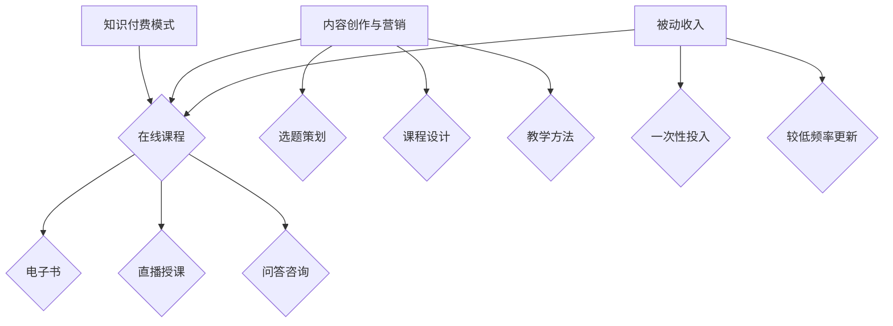

                 

在这个快速发展的数字化时代，知识付费已经成为一种新兴的经济模式，为广大程序员提供了一个全新的收入来源。本文将探讨程序员如何利用知识付费实现被动收入，以及相关策略与方法。

## 关键词

- 知识付费
- 被动收入
- 程序员
- 在线教育
- 内容创作

## 摘要

本文旨在为程序员提供一种利用知识付费实现被动收入的策略与方法。通过分析在线教育市场的需求、内容创作技巧以及营销推广策略，本文将帮助程序员充分利用自己的专业技能和知识储备，打造具有市场价值的教育产品，实现持续的收入增长。

## 1. 背景介绍

### 知识付费的兴起

随着互联网的普及和在线教育的发展，知识付费逐渐成为一种主流的消费模式。用户可以通过付费获取高质量的教育资源，如专业课程、学习资料、技能培训等。知识付费不仅满足了用户对专业知识的渴求，也为内容创作者提供了广阔的舞台。

### 程序员的优势

程序员是知识付费市场中的一支重要力量。他们具备丰富的编程经验和专业技能，能够为学习者提供实用、高效的学习资源。此外，程序员具备较强的自学能力和逻辑思维能力，能够快速掌握新知识和技能，从而为内容创作提供源源不断的灵感。

## 2. 核心概念与联系

### 知识付费模式

知识付费模式主要包括在线课程、电子书、直播授课、问答咨询等形式。程序员可以根据自己的特长和市场需求，选择合适的形式进行内容创作。

### 内容创作与营销

内容创作是知识付费的核心。程序员需要具备良好的内容创作能力，包括选题策划、课程设计、教学方法等。同时，营销推广也是关键环节，通过社交媒体、SEO优化等手段，提高教育产品的曝光度和用户转化率。

### 被动收入

被动收入是指通过一次性的投入或较低频率的更新，持续获得收益的方式。对于程序员而言，知识付费是实现被动收入的有效途径。通过打造优质的教育产品，程序员可以在业余时间获得稳定收入。

### Mermaid 流程图



## 3. 核心算法原理 & 具体操作步骤

### 3.1 算法原理概述

知识付费的核心算法原理是供需匹配。程序员需要了解市场需求，结合自身特长，创作出符合用户需求的教育产品。在此基础上，通过营销推广，实现教育产品的销售和收益。

### 3.2 算法步骤详解

1. **市场调研**：了解用户需求，分析竞争对手，确定教育产品方向。
2. **内容创作**：根据市场需求，设计课程内容，包括教学视频、文档资料、案例解析等。
3. **平台选择**：选择合适的在线教育平台，如网易云课堂、慕课网等，进行教育产品的发布和销售。
4. **营销推广**：通过社交媒体、SEO优化、合作推广等方式，提高教育产品的曝光度和用户转化率。
5. **用户反馈**：收集用户反馈，不断优化教育产品，提升用户满意度。
6. **持续更新**：定期更新教育产品，保持内容的新鲜度和吸引力。

### 3.3 算法优缺点

**优点**：实现被动收入，时间自由，收入稳定。

**缺点**：内容创作和营销推广需要投入大量时间和精力，前期收益可能较低。

### 3.4 算法应用领域

知识付费算法广泛应用于在线教育、职业培训、技能提升等领域。程序员可以针对不同领域，创作出具有针对性的教育产品，满足用户的需求。

## 4. 数学模型和公式 & 详细讲解 & 举例说明

### 4.1 数学模型构建

知识付费的数学模型主要包括用户增长模型、收益模型和转化率模型。

- **用户增长模型**：$U(t) = U(0) \times (1 + r)^t$，其中$U(t)$为$t$时刻的用户数量，$U(0)$为初始用户数量，$r$为用户增长速率。
- **收益模型**：$R(t) = R(0) \times (1 + r)^t$，其中$R(t)$为$t$时刻的收益，$R(0)$为初始收益，$r$为收益增长率。
- **转化率模型**：$C(t) = C(0) \times (1 + r)^t$，其中$C(t)$为$t$时刻的转化率，$C(0)$为初始转化率，$r$为转化率增长率。

### 4.2 公式推导过程

假设初始用户数量为$U(0)$，用户增长速率为$r$，则$t$时刻的用户数量为$U(t) = U(0) \times (1 + r)^t$。同理，初始收益为$R(0)$，收益增长率为$r$，则$t$时刻的收益为$R(t) = R(0) \times (1 + r)^t$。转化率初始值为$C(0)$，转化率增长率为$r$，则$t$时刻的转化率为$C(t) = C(0) \times (1 + r)^t$。

### 4.3 案例分析与讲解

假设某程序员创作了一门价值1000元的编程课程，初始用户数量为100人，用户增长速率为10%，收益增长率为20%，转化率增长率为15%。则：

1. **用户增长**：$U(t) = 100 \times (1 + 0.1)^t$，当$t=1$时，$U(1) = 110$人。
2. **收益增长**：$R(t) = 1000 \times (1 + 0.2)^t$，当$t=1$时，$R(1) = 1200$元。
3. **转化率增长**：$C(t) = 100 \times (1 + 0.15)^t$，当$t=1$时，$C(1) = 115$人。

通过以上分析，我们可以看到，在第一年内，该程序员的用户数量、收益和转化率都将得到显著提升。这表明，通过合理的知识付费策略，程序员可以在较短的时间内实现被动收入的增长。

## 5. 项目实践：代码实例和详细解释说明

### 5.1 开发环境搭建

为了实现知识付费，程序员需要搭建一个在线教育平台，用于发布、销售和管理教育产品。以下是搭建在线教育平台的基本步骤：

1. **选择技术栈**：前端使用React或Vue，后端使用Node.js或Python Django。
2. **购买域名和服务器**：在阿里云、腾讯云等平台购买合适的域名和服务器。
3. **安装相关软件**：安装Node.js、Python、MySQL等软件，搭建开发环境。
4. **开发平台功能**：包括用户注册、登录、课程浏览、购买、支付等。

### 5.2 源代码详细实现

以下是一个简单的用户注册功能的代码实现：

```python
# Python Django 用户注册代码实现
from django.shortcuts import render, redirect
from .forms import UserRegistrationForm
from django.contrib.auth import login

def register(request):
    if request.method == 'POST':
        form = UserRegistrationForm(request.POST)
        if form.is_valid():
            user = form.save()
            login(request, user)
            return redirect('home')
    else:
        form = UserRegistrationForm()
    return render(request, 'register.html', {'form': form})
```

### 5.3 代码解读与分析

上述代码实现了一个用户注册功能，主要分为以下几部分：

1. **表单验证**：使用`UserRegistrationForm`对用户输入的数据进行验证，确保输入的数据符合要求。
2. **用户登录**：将验证通过的用户信息保存到数据库，并使用`login`函数将用户登录系统。
3. **页面渲染**：使用`render`函数将注册表单渲染到页面。

通过这个简单的示例，我们可以了解到，在线教育平台的开发需要涉及多个方面，如用户管理、课程管理、订单管理等。程序员需要具备扎实的编程基础和系统设计能力，才能实现一个功能完善、易于维护的教育平台。

### 5.4 运行结果展示

用户访问在线教育平台后，可以通过以下步骤进行注册：

1. 输入用户名、邮箱、密码等信息。
2. 点击“注册”按钮，提交表单。
3. 系统对表单进行验证，验证通过后，将用户信息保存到数据库，并使用用户登录系统。
4. 用户可以登录系统，浏览、购买和管理课程。

## 6. 实际应用场景

### 6.1 在线教育平台

在线教育平台是知识付费的主要载体。程序员可以通过在线教育平台，发布自己的课程、文章、问答等内容，实现知识变现。目前，国内外知名的在线教育平台包括网易云课堂、慕课网、Coursera、edX等。

### 6.2 职业培训

随着互联网技术的发展，程序员面临着不断更新的技术栈。职业培训可以帮助程序员提升技能，适应市场需求。程序员可以通过在线职业培训平台，如极客时间、运营派等，分享自己的经验和心得。

### 6.3 技能分享

程序员可以通过博客、GitHub、微信公众号等渠道，分享自己的编程经验和心得。通过高质量的技能分享，吸引更多读者，实现知识付费。

### 6.4 未来应用场景

随着人工智能、区块链等新技术的不断发展，知识付费的应用场景将更加广泛。程序员可以探索更多创新性的知识付费模式，如知识星球、在线咨询等，为用户提供更丰富、个性化的教育服务。

## 7. 工具和资源推荐

### 7.1 学习资源推荐

- 《代码大全》
- 《Effective Java》
- 《深度学习》
- 《Python编程：从入门到实践》

### 7.2 开发工具推荐

- PyCharm
- VS Code
- Git
- GitHub

### 7.3 相关论文推荐

- 《深度强化学习在游戏中的应用》
- 《区块链技术原理与应用》
- 《基于云计算的在线教育平台设计与实现》
- 《基于大数据的推荐系统研究》

## 8. 总结：未来发展趋势与挑战

### 8.1 研究成果总结

知识付费已经成为在线教育市场的重要组成部分，为广大程序员提供了一个全新的收入来源。通过内容创作、营销推广等手段，程序员可以实现被动收入的增长。

### 8.2 未来发展趋势

随着人工智能、大数据等技术的发展，知识付费将呈现以下趋势：

- 模式多样化：知识付费模式将更加多样，如知识星球、在线咨询等。
- 内容个性化：基于大数据和人工智能技术，教育产品将更加个性化和精准化。
- 跨界融合：知识付费将与更多行业融合，如金融、医疗等。

### 8.3 面临的挑战

- 竞争激烈：在线教育市场竞争激烈，程序员需要不断提高自己的内容创作能力和营销推广能力。
- 用户需求变化：用户需求不断变化，程序员需要及时调整自己的教育产品，以满足市场需求。

### 8.4 研究展望

未来，程序员可以通过以下途径进一步拓展知识付费领域：

- 深入研究新技术，结合人工智能、区块链等技术，创造更多创新性的教育产品。
- 加强跨界合作，与金融、医疗等行业融合，打造更多具有实际应用价值的教育产品。

## 9. 附录：常见问题与解答

### 9.1 如何选择知识付费平台？

选择知识付费平台时，可以从以下几个方面考虑：

- 平台知名度：选择知名平台，有利于提高教育产品的曝光度和用户信任度。
- 产品质量：了解平台的教育产品质量，查看用户评价，选择优质产品。
- 支付方式：选择支持多种支付方式的平台，方便用户购买。

### 9.2 如何进行内容创作？

进行内容创作时，可以遵循以下步骤：

- 确定主题：选择自己擅长的领域，确定教育产品的主题。
- 设计课程：制定详细的教学大纲，包括课程目标、教学内容、教学方法等。
- 撰写文档：撰写清晰、简洁的文档，便于用户理解和学习。
- 制作视频：使用合适的工具和软件，制作高质量的短视频，增加用户粘性。

### 9.3 如何进行营销推广？

进行营销推广时，可以采取以下策略：

- 社交媒体：利用微博、微信公众号、抖音等社交媒体平台，发布教育产品的相关内容，吸引用户关注。
- SEO优化：优化教育产品的关键词，提高搜索引擎排名，增加曝光度。
- 合作推广：与其他教育机构、自媒体等合作，共同推广教育产品。
- 用户反馈：积极收集用户反馈，不断优化教育产品，提高用户满意度。

