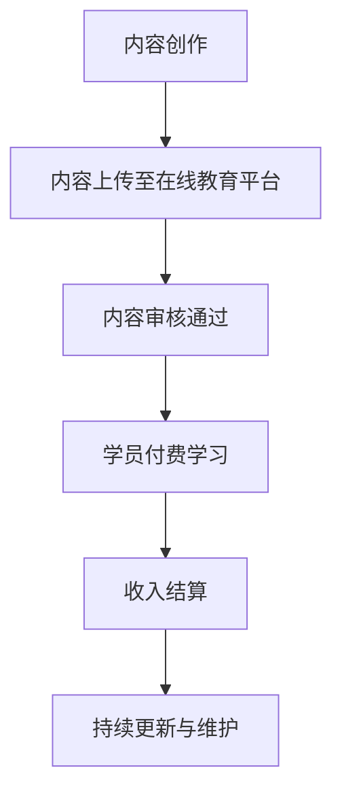

                 

关键词：知识付费、被动收入、程序员、知识变现、在线教育、内容创作

> 摘要：随着互联网和技术的快速发展，知识付费逐渐成为了一种流行的经济模式。本文将探讨程序员如何通过知识付费实现被动收入，并分析其中的机遇与挑战。

## 1. 背景介绍

在互联网的推动下，知识付费作为一种新型的商业模式，正日益受到重视。知识付费指的是用户为了获取有价值的信息、知识或技能，自愿为内容创作者支付费用。对于程序员而言，这不仅仅是一种个人成长的途径，更是一种实现被动收入的有效方式。

### 知识付费的定义与现状
知识付费是指用户为获取信息、知识或技能而自愿支付费用的行为。近年来，随着在线教育平台、专业问答社区、专业课程订阅等服务的兴起，知识付费市场规模迅速扩大。根据数据显示，全球知识付费市场在2022年已达到数百亿美元，并有望在未来继续增长。

### 程序员的优势
程序员群体在知识付费市场中具有独特的优势。首先，程序员具备丰富的技术知识和实践经验，能够提供高质量的技术内容。其次，程序员熟悉编程、技术文档和在线教育平台，能够有效地将知识转化为有价值的付费内容。

## 2. 核心概念与联系

为了更好地理解程序员如何通过知识付费实现被动收入，我们需要探讨以下几个核心概念：

### 被动收入
被动收入指的是不依赖于个人时间、努力而获得的持续性收入。常见的被动收入形式包括版权收入、租赁收入、投资收益等。在知识付费领域，被动收入主要通过内容创作和销售实现。

### 知识变现
知识变现是指将个人知识、技能或经验转化为经济价值的过程。对于程序员来说，知识变现可以通过撰写技术博客、发布在线课程、编写电子书、提供专业咨询服务等多种形式进行。

### 内容创作
内容创作是知识变现的重要手段。程序员可以通过撰写技术博客、编写技术书籍、录制在线课程等方式，将自己的知识和经验分享给他人，从而获得收入。

### 在线教育
在线教育平台为程序员提供了广阔的展示和销售知识的渠道。程序员可以在这些平台上开设课程，通过学员的付费学习来实现被动收入。

### Mermaid 流程图
下面是一个Mermaid流程图，展示了一个程序员通过知识付费实现被动收入的流程：



## 3. 核心算法原理 & 具体操作步骤

### 3.1 算法原理概述

程序员通过知识付费实现被动收入的核心算法可以概括为以下几个步骤：

1. **内容创作**：程序员根据自身专业知识和经验，创作高质量的技术内容。
2. **内容上传**：将创作的内容上传至在线教育平台。
3. **内容审核**：在线教育平台对上传的内容进行审核，确保内容的质量和合规性。
4. **学员付费学习**：学员通过在线教育平台付费学习程序员提供的内容。
5. **收入结算**：在线教育平台根据学员付费情况，将收入结算给程序员。
6. **持续更新与维护**：程序员需要定期更新和维护内容，以保持内容的时效性和吸引力。

### 3.2 算法步骤详解

1. **内容创作**
   程序员需要根据自身的专业领域和兴趣爱好，选择合适的内容创作方向。例如，可以撰写技术博客、编写电子书、录制视频教程等。

2. **内容上传**
   选择一个合适的在线教育平台，如Udemy、Coursera、网易云课堂等，按照平台的指引上传内容。

3. **内容审核**
   在线教育平台会对上传的内容进行审核，确保内容的质量和合规性。审核通过后，内容才能对外销售。

4. **学员付费学习**
   学员通过在线教育平台搜索并付费学习程序员提供的内容。学员的付费行为将触发收入结算。

5. **收入结算**
   在线教育平台根据学员的付费情况，定期将收入结算给程序员。常见的结算方式包括按月结算、按季度结算等。

6. **持续更新与维护**
   程序员需要定期更新和维护内容，以保持内容的时效性和吸引力。更新内容可以通过添加新的章节、修改旧的内容、增加实战案例等方式进行。

### 3.3 算法优缺点

**优点**：
- **被动收入**：程序员可以依靠高质量的内容实现持续性的被动收入。
- **灵活性强**：程序员可以根据自己的时间和兴趣进行内容创作。
- **广泛受众**：在线教育平台提供了广泛的受众群体，有助于扩大影响力。

**缺点**：
- **初期投入**：内容创作和上传需要一定的时间和精力投入。
- **市场竞争**：随着知识付费市场的不断扩大，竞争也日益激烈。
- **内容审核**：在线教育平台的审核流程可能影响内容的上线时间。

### 3.4 算法应用领域

程序员通过知识付费实现被动收入的应用领域非常广泛，包括但不限于以下方面：

- **技术博客**：程序员可以通过撰写技术博客分享自己的知识和经验。
- **在线课程**：程序员可以在在线教育平台上开设课程，提供系统化的知识教学。
- **电子书**：程序员可以编写电子书，分享专业知识和实践经验。
- **专业咨询服务**：程序员可以提供专业咨询服务，帮助他人解决技术问题。

## 4. 数学模型和公式 & 详细讲解 & 举例说明

### 4.1 数学模型构建

为了更好地理解程序员通过知识付费实现被动收入的收益情况，我们可以构建一个简单的数学模型。

设：
- \( C \) 为程序员创作内容的成本（包括时间、精力等）。
- \( P \) 为单个学员的学习费用。
- \( N \) 为学员数量。
- \( R \) 为程序员的收入。

则程序员的收入 \( R \) 可以表示为：

\[ R = N \times P - C \]

### 4.2 公式推导过程

1. **学员数量 \( N \)**：学员数量与内容质量和市场推广等因素相关。
2. **单个学员的学习费用 \( P \)**：学习费用取决于内容的难度、市场需求和竞争状况。
3. **内容创作成本 \( C \)**：内容创作成本包括时间、精力、工具使用等费用。

根据以上设定，我们可以推导出程序员的收入公式：

\[ R = N \times P - C \]

### 4.3 案例分析与讲解

假设一个程序员创作了一篇关于“Python数据处理技术”的技术博客，单篇博客的成本为 \( C = 1000 \) 元。假设博客的市场定价为 \( P = 200 \) 元，且每月有 \( N = 500 \) 个学员学习。

根据收入公式，我们可以计算出该程序员的月收入：

\[ R = 500 \times 200 - 1000 = 95000 \] 元

如果该程序员能够持续创作高质量的内容，并且每月学员数量保持稳定，那么他的月收入将保持在较高水平。

### 4.4 案例分析：程序员A的收益情况

程序员A是一名有多年经验的Python开发者，他在多个在线教育平台上开设了Python课程。以下是他的收益情况：

| 时间 | 学员数量 \( N \) | 每个学员学习费用 \( P \) | 总收入 \( R \) | 成本 \( C \) |
| ---- | ---- | ---- | ---- | ---- |
| 第1个月 | 300 | 200 | 60000 | 10000 |
| 第2个月 | 350 | 200 | 70000 | 10000 |
| 第3个月 | 400 | 200 | 80000 | 10000 |
| 平均每月 | 350 | 200 | 70000 | 10000 |

从上表可以看出，程序员A每月的收入稳定在70000元左右，扣除成本后的净利润为60000元。这意味着程序员A可以通过持续创作高质量的内容，实现稳定的被动收入。

## 5. 项目实践：代码实例和详细解释说明

### 5.1 开发环境搭建

为了实现知识付费，程序员需要搭建一个开发环境。这里我们以一个简单的Python博客为例，介绍如何搭建开发环境。

1. **安装Python**：在官方网站（https://www.python.org/downloads/）下载并安装Python。
2. **安装文本编辑器**：选择一个合适的文本编辑器，如VSCode、Sublime Text等。
3. **安装Markdown插件**：在文本编辑器中安装Markdown插件，以便编写和格式化Markdown文档。

### 5.2 源代码详细实现

以下是Python博客的简单示例代码：

```python
# Python博客示例代码

def write_blog(title, content):
    with open(f"{title}.md", "w") as f:
        f.write(f"# {title}\n\n{content}")

def publish_blog(title):
    write_blog(title, f"欢迎学习我的{title}课程！")
    print(f"博客 '{title}' 已发布。")

if __name__ == "__main__":
    title = input("请输入博客标题：")
    publish_blog(title)
```

### 5.3 代码解读与分析

1. **write_blog函数**：该函数用于编写Markdown文档。参数`title`和`content`分别表示博客的标题和内容。
2. **publish_blog函数**：该函数用于发布博客。首先调用`write_blog`函数生成Markdown文档，然后打印发布成功的提示信息。
3. **主程序**：主程序通过输入博客标题，调用`publish_blog`函数发布博客。

### 5.4 运行结果展示

在终端运行上述代码，输入博客标题：

```bash
请输入博客标题：Python基础教程
博客 'Python基础教程' 已发布。
```

在当前目录下将生成一个名为“Python基础教程.md”的Markdown文档，内容为“欢迎学习我的Python基础教程课程！”

## 6. 实际应用场景

### 6.1 技术博客

技术博客是程序员实现知识付费的常见方式。程序员可以通过撰写高质量的技术博客，分享自己的知识和经验，吸引学员付费学习。

### 6.2 在线课程

在线课程是一种更为系统化的知识分享方式。程序员可以在在线教育平台上开设课程，通过课程视频、文档、互动问答等方式，为学生提供全面的学习体验。

### 6.3 电子书

电子书是一种便捷的知识传播形式。程序员可以编写技术书籍，分享专业知识和实践经验，通过在线书店或自建平台销售。

### 6.4 专业咨询服务

专业咨询服务是程序员通过知识付费实现收入的一种高级形式。程序员可以提供一对一的专业咨询服务，帮助客户解决技术难题。

### 6.5 未来应用展望

随着人工智能、大数据等技术的发展，知识付费的应用场景将更加丰富。例如，程序员可以开发智能问答系统，为用户提供实时、个性化的咨询服务；可以基于大数据分析，为课程推荐提供精准的决策支持。

## 7. 工具和资源推荐

### 7.1 学习资源推荐

1. **在线教育平台**：如Udemy、Coursera、网易云课堂等，提供了丰富的学习资源。
2. **编程社区**：如GitHub、Stack Overflow等，可以获取最新的编程技术和经验分享。
3. **技术博客**：如博客园、CSDN等，提供了大量的技术文章和教程。

### 7.2 开发工具推荐

1. **文本编辑器**：如VSCode、Sublime Text等，提供强大的Markdown编辑功能。
2. **Markdown插件**：如Typora、MarkdownPad等，方便编写和格式化Markdown文档。
3. **版本控制工具**：如Git，方便管理和分享代码。

### 7.3 相关论文推荐

1. **《知识付费产业研究报告》**：分析了知识付费的市场现状、发展趋势和机遇挑战。
2. **《程序员如何实现知识变现》**：探讨了程序员通过知识付费实现收入的各种途径。
3. **《在线教育平台的商业模式分析》**：分析了在线教育平台的发展现状和商业模式。

## 8. 总结：未来发展趋势与挑战

### 8.1 研究成果总结

本文从背景介绍、核心概念、算法原理、数学模型、项目实践等多个角度，探讨了程序员如何通过知识付费实现被动收入的途径。研究表明，知识付费为程序员提供了实现被动收入的有效途径，但同时也面临着市场竞争和内容审核等挑战。

### 8.2 未来发展趋势

1. **个性化学习**：随着人工智能和大数据技术的发展，个性化学习将成为知识付费的重要趋势。
2. **垂直领域深耕**：程序员可以通过深耕垂直领域，提供专业、深度的知识服务，实现差异化竞争。
3. **跨界合作**：程序员可以与其他行业进行跨界合作，拓展知识付费的应用场景。

### 8.3 面临的挑战

1. **内容质量**：高质量的内容是吸引学员的关键，程序员需要不断提升自己的专业能力和写作技巧。
2. **市场竞争**：随着知识付费市场的不断扩大，竞争将更加激烈，程序员需要不断创新和提升自己的竞争力。
3. **内容审核**：在线教育平台的内容审核流程可能影响内容的上线时间，程序员需要确保内容的质量和合规性。

### 8.4 研究展望

未来，知识付费将继续发展，程序员可以通过不断创新和提升自己的专业能力，实现更多的被动收入。同时，我们也需要关注知识付费市场的发展趋势，为程序员提供更多的支持和指导。

## 9. 附录：常见问题与解答

### 9.1 知识付费是否适合所有程序员？

知识付费适合具备一定技术积累和写作能力的程序员。对于初级程序员，建议先提升自己的技术水平和写作技巧，再尝试通过知识付费实现收入。

### 9.2 如何选择在线教育平台？

选择在线教育平台时，可以从平台知名度、课程质量、用户评价等多个方面进行考量。建议选择知名、用户评价良好的平台，以提高内容曝光度和可信度。

### 9.3 如何保证内容的质量和合规性？

为了保证内容的质量和合规性，程序员应遵循以下原则：

- **深入理解技术**：确保内容的技术深度和准确性。
- **遵守法律法规**：确保内容不违反相关法律法规。
- **尊重知识产权**：确保内容的原创性，避免抄袭和侵权。

### 9.4 如何进行内容推广？

内容推广可以通过以下几种方式进行：

- **社交媒体**：利用微博、知乎、公众号等社交媒体平台，分享内容并吸引潜在学员。
- **搜索引擎优化**：优化标题、关键词和内容结构，提高搜索引擎排名。
- **合作与分享**：与其他领域的大V、博主合作，扩大内容的影响力。

## 参考文献

1. 《知识付费产业研究报告》
2. 《程序员如何实现知识变现》
3. 《在线教育平台的商业模式分析》

---

# 附录：常见问题与解答

### 9.1 知识付费是否适合所有程序员？

**知识付费适合具备一定技术积累和写作能力的程序员。对于初级程序员，建议先提升自己的技术水平和写作技巧，再尝试通过知识付费实现收入。**

### 9.2 如何选择在线教育平台？

**选择在线教育平台时，可以从平台知名度、课程质量、用户评价等多个方面进行考量。建议选择知名、用户评价良好的平台，以提高内容曝光度和可信度。以下是一些知名的在线教育平台：**

- **Udemy**：全球知名的在线学习平台，课程种类繁多，用户数量庞大。
- **Coursera**：提供大量优质大学课程，包括计算机科学、人工智能等领域。
- **网易云课堂**：国内领先的在线教育平台，提供丰富的编程课程。
- **极客时间**：专注于技术领域的知识付费平台，提供高质量的技术课程。

### 9.3 如何保证内容的质量和合规性？

**为了保证内容的质量和合规性，程序员应遵循以下原则：**

- **深入理解技术**：确保内容的技术深度和准确性。
- **遵守法律法规**：确保内容不违反相关法律法规。
- **尊重知识产权**：确保内容的原创性，避免抄袭和侵权。

**具体措施包括：**

- **定期更新知识**：关注业界动态，及时更新和调整内容。
- **同行评审**：邀请同行或专家对内容进行评审，提高内容质量。
- **版权保护**：对原创内容进行版权登记，保护知识产权。

### 9.4 如何进行内容推广？

**内容推广可以通过以下几种方式进行：**

- **社交媒体**：利用微博、知乎、公众号等社交媒体平台，分享内容并吸引潜在学员。
- **搜索引擎优化**：优化标题、关键词和内容结构，提高搜索引擎排名。
- **合作与分享**：与其他领域的大V、博主合作，扩大内容的影响力。
- **线下活动**：参加技术沙龙、讲座等活动，展示自己的专业能力和课程。

### 9.5 如何处理学员的反馈？

**处理学员的反馈是提高课程质量和用户满意度的重要环节。以下是一些处理学员反馈的建议：**

- **及时回复**：对于学员的提问和反馈，应及时回复，展示专业性和关怀。
- **倾听学员需求**：关注学员的需求和痛点，根据反馈调整课程内容和教学方法。
- **改进课程**：针对学员的反馈，对课程进行改进，提高课程质量。
- **建立互动机制**：鼓励学员参与课程讨论，提高学员的积极性和满意度。

---

# 作者署名

作者：禅与计算机程序设计艺术 / Zen and the Art of Computer Programming

本文旨在探讨程序员如何通过知识付费实现被动收入，并分析了其中的机遇与挑战。希望通过本文，为广大程序员提供一种实现收入增长的新途径。同时，也期待与读者共同探讨和分享更多的知识和经验。感谢您的阅读！

