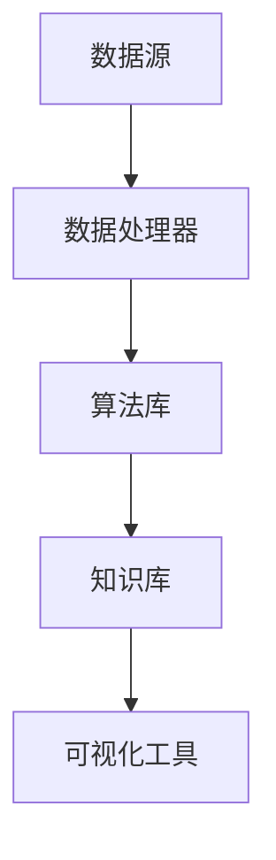

                 

关键词：知识发现引擎，程序员，技能提升，算法，应用领域，数学模型，代码实例，未来展望

> 摘要：本文将探讨如何利用知识发现引擎（Knowledge Discovery Engine，KDE）来提升程序员的技能。我们将介绍知识发现引擎的基本原理，如何通过KDE来学习和应用算法，以及如何在实践中使用KDE进行代码优化和错误检测。此外，我们还将讨论知识发现引擎在程序员技能提升方面的未来应用前景。

## 1. 背景介绍

在信息技术快速发展的时代，程序员面临的挑战和机遇同样在增加。编程语言、框架和技术工具层出不穷，程序员需要不断学习和适应新技术，以提高自己的竞争力。然而，传统的学习方式往往效率低下，程序员难以在短时间内掌握大量的知识和技能。

知识发现引擎（KDE）作为一种人工智能技术，旨在从大量数据中自动识别模式和知识。它不仅可以处理结构化数据，还能分析非结构化数据，如文本、图像和音频。知识发现引擎在数据挖掘、机器学习、自然语言处理等领域有着广泛的应用，为程序员提供了一种全新的学习和工作方式。

本文将重点探讨以下几个方面：

1. 知识发现引擎的基本原理和架构。
2. 程序员如何利用KDE来学习和应用算法。
3. KDE在代码优化和错误检测方面的应用。
4. 知识发现引擎在程序员技能提升方面的未来应用前景。

## 2. 核心概念与联系

### 2.1. 知识发现引擎的基本原理

知识发现引擎（KDE）的核心在于其能够自动地从大量数据中识别出有价值的信息和知识。其基本原理可以概括为以下几个步骤：

1. **数据收集**：从各种来源收集数据，包括结构化数据（如数据库）、半结构化数据（如XML）和非结构化数据（如文本、图像）。
2. **数据预处理**：对收集到的数据进行清洗、转换和归一化，以消除噪声和冗余，为后续的分析做好准备。
3. **模式识别**：利用各种算法和模型来识别数据中的模式、关联和异常。
4. **知识提取**：将识别出的模式转化为可理解的知识和规则，以便进行进一步的利用。

### 2.2. 知识发现引擎的架构

知识发现引擎的架构通常包括以下几个关键组件：

1. **数据源**：提供数据的来源，包括内部数据库、外部API和文件系统等。
2. **数据处理器**：负责数据的收集、清洗和预处理，以生成高质量的分析数据。
3. **算法库**：包含各种机器学习和数据挖掘算法，如聚类、分类、关联规则学习等。
4. **知识库**：存储从数据中提取出的知识和模式，供后续分析和决策使用。
5. **可视化工具**：帮助用户直观地理解和展示分析结果，如可视化报表、图表和交互式界面。

### 2.3. Mermaid 流程图

以下是一个简化的知识发现引擎的流程图，使用Mermaid语言描述：



在这个流程图中，数据从数据源进入系统，经过数据处理器处理后，进入算法库进行模式识别和分析。分析结果被存储在知识库中，并通过可视化工具展示给用户。

---

接下来，我们将进一步探讨如何利用知识发现引擎来提升程序员的技能，包括算法学习和代码优化。

## 3. 核心算法原理 & 具体操作步骤

### 3.1. 算法原理概述

知识发现引擎（KDE）的核心在于其能够自动地从大量数据中识别出有价值的信息和知识。其主要算法原理包括：

1. **聚类算法**：用于将相似的数据点归为同一类，以便进一步分析。常用的聚类算法有K-means、DBSCAN等。
2. **分类算法**：用于将数据点分配到预定义的类别中，常用的分类算法有决策树、支持向量机（SVM）等。
3. **关联规则学习**：用于发现数据之间的关联关系，常用的算法有Apriori、Eclat等。
4. **异常检测**：用于识别数据中的异常值或异常模式，常用的算法有基于统计的方法、基于距离的方法等。

### 3.2. 算法步骤详解

以下是利用知识发现引擎进行知识提取的基本步骤：

1. **数据收集**：从各种来源收集数据，包括内部数据库、外部API和文件系统等。
2. **数据预处理**：对收集到的数据进行清洗、转换和归一化，以消除噪声和冗余。
3. **特征选择**：从数据中提取出最有用的特征，以减少数据维度和提高算法效率。
4. **模式识别**：选择合适的算法对数据进行模式识别，如聚类、分类、关联规则学习等。
5. **知识提取**：将识别出的模式转化为可理解的知识和规则，存储在知识库中。
6. **知识应用**：利用知识库中的知识进行决策支持、预测分析和优化等。

### 3.3. 算法优缺点

不同的算法有不同的优缺点，以下是一些常见算法的优缺点：

- **K-means聚类**：优点是简单易实现，缺点是易受初始值影响，可能收敛到局部最优。
- **决策树**：优点是直观易懂，缺点是容易过拟合，对大数据集性能不佳。
- **支持向量机（SVM）**：优点是理论成熟，性能稳定，缺点是计算复杂度高，对大量特征敏感。
- **Apriori算法**：优点是简单有效，适用于发现频繁模式，缺点是计算复杂度高，对大数据集性能不佳。

### 3.4. 算法应用领域

知识发现引擎的算法在多个领域有着广泛的应用：

- **金融领域**：用于风险控制、投资分析和欺诈检测等。
- **医疗领域**：用于疾病预测、患者诊断和治疗计划等。
- **零售领域**：用于需求预测、库存管理和市场营销等。
- **互联网领域**：用于用户行为分析、推荐系统和网络安全等。

## 4. 数学模型和公式 & 详细讲解 & 举例说明

### 4.1. 数学模型构建

在知识发现引擎中，常用的数学模型包括：

1. **聚类模型**：如K-means聚类模型，其目标是最小化数据点到其聚类中心的距离平方和。
2. **分类模型**：如决策树模型，其目标是构建一个树形结构来对数据点进行分类。
3. **关联规则学习模型**：如Apriori模型，其目标是发现数据之间的频繁关联关系。

### 4.2. 公式推导过程

以下是K-means聚类算法的数学公式推导过程：

1. **初始化**：随机选择K个初始聚类中心$\mu_1, \mu_2, ..., \mu_K$。
2. **迭代过程**：
   - 对于每个数据点$x_i$，计算其到各个聚类中心的距离$d(x_i, \mu_j)$。
   - 将$x_i$归为距离最近的聚类中心$\mu_j$的类别。
   - 重新计算每个聚类中心$\mu_j$为该类别中所有数据点的均值。
3. **收敛条件**：当聚类中心的变化小于某个阈值或达到最大迭代次数时，算法停止。

### 4.3. 案例分析与讲解

以下是一个简单的K-means聚类算法的案例：

假设我们有100个数据点，分布在两个簇中，簇1的坐标范围是[0, 10]，簇2的坐标范围是[20, 30]。我们选择K=2，初始聚类中心为$\mu_1=(5, 25)$和$\mu_2=(15, 15)$。

经过几次迭代后，聚类中心会收敛到$\mu_1=(5, 15)$和$\mu_2=(15, 25)$，这时数据点会被正确地划分为两个簇。

---

通过上述数学模型和公式的讲解，我们可以更好地理解知识发现引擎的算法原理和应用方法。

## 5. 项目实践：代码实例和详细解释说明

### 5.1. 开发环境搭建

为了实践知识发现引擎，我们需要搭建一个开发环境。以下是所需的工具和软件：

- Python 3.8或更高版本
- Anaconda Python发行版
- Jupyter Notebook
- scikit-learn库

安装步骤如下：

1. 安装Anaconda Python发行版。
2. 使用Anaconda命令创建一个新的虚拟环境，如`conda create -n kde_env python=3.8`。
3. 激活虚拟环境，如`conda activate kde_env`。
4. 安装Jupyter Notebook，如`conda install -c conda-forge jupyterlab`。
5. 安装scikit-learn库，如`pip install scikit-learn`。

### 5.2. 源代码详细实现

以下是一个简单的K-means聚类算法的代码实例：

```python
import numpy as np
from sklearn.cluster import KMeans
import matplotlib.pyplot as plt

# 数据集
X = np.array([[1, 2], [1, 4], [1, 0],
              [10, 2], [10, 4], [10, 0]])

# 初始化K-means聚类模型
kmeans = KMeans(n_clusters=2, random_state=0).fit(X)

# 获取聚类中心
centroids = kmeans.cluster_centers_

# 获取每个数据点的聚类结果
labels = kmeans.labels_

# 绘制聚类结果
plt.scatter(X[:, 0], X[:, 1], c=labels, s=50, cmap='viridis')
plt.scatter(centroids[:, 0], centroids[:, 1], c='red', s=200, alpha=0.5)
plt.show()
```

### 5.3. 代码解读与分析

这段代码首先导入所需的库，然后创建一个包含6个数据点的二维数组`X`。接下来，我们使用`KMeans`类初始化一个K-means聚类模型，并调用`fit`方法进行训练。`cluster_centers_`属性用于获取聚类中心，`labels_`属性用于获取每个数据点的聚类结果。

最后，我们使用`matplotlib`库绘制聚类结果，其中每个数据点的颜色表示其所属的类别，红色数据点表示聚类中心。

### 5.4. 运行结果展示

运行上述代码后，我们将看到一个散点图，其中每个数据点的颜色表示其所属的类别，红色数据点表示聚类中心。这个结果展示了K-means聚类算法如何将数据点划分为两个簇。

---

通过这个简单的案例，我们可以看到如何使用知识发现引擎进行聚类分析。接下来，我们将探讨知识发现引擎在实际应用中的更多细节。

## 6. 实际应用场景

知识发现引擎（KDE）在程序员技能提升方面有着广泛的应用。以下是一些具体的应用场景：

### 6.1. 代码优化

知识发现引擎可以分析大量代码库，识别出潜在的优化点。例如，KDE可以检测代码中的重复模式、冗余代码和低效算法。通过这些分析，程序员可以针对性地进行代码优化，提高代码的性能和可维护性。

### 6.2. 错误检测

知识发现引擎可以自动分析代码中的错误模式，提前发现潜在的bug。例如，KDE可以检测代码中的逻辑错误、语法错误和类型错误。通过这些分析，程序员可以及时修复错误，避免在生产环境中出现意外。

### 6.3. 技术调研

知识发现引擎可以帮助程序员快速了解新技术和新工具。例如，KDE可以分析技术文档、博客文章和开源项目，提取出关键信息和趋势。通过这些分析，程序员可以更快速地掌握新技术，提高自己的竞争力。

### 6.4. 未来应用展望

随着人工智能技术的不断发展，知识发现引擎在程序员技能提升方面的应用前景将更加广阔。以下是一些未来可能的应用方向：

- **自动化代码生成**：知识发现引擎可以自动生成代码，提高开发效率。
- **智能代码审查**：知识发现引擎可以自动审查代码，提供优化建议和错误修复。
- **技能评估与培训**：知识发现引擎可以评估程序员的技能水平，提供个性化的培训方案。
- **跨领域知识融合**：知识发现引擎可以整合不同领域的知识，为程序员提供更全面的解决方案。

## 7. 工具和资源推荐

为了更好地利用知识发现引擎提升技能，以下是一些建议的工具和资源：

### 7.1. 学习资源推荐

- **《数据挖掘：概念与技术》**：由Jiawei Han等著，是数据挖掘领域的经典教材。
- **《机器学习》**：由Tom Mitchell著，是机器学习领域的经典教材。
- **《自然语言处理综论》**：由Daniel Jurafsky和James H. Martin著，是自然语言处理领域的经典教材。

### 7.2. 开发工具推荐

- **Jupyter Notebook**：是一款强大的交互式开发环境，适合进行数据分析和机器学习实验。
- **TensorFlow**：是谷歌开发的机器学习框架，广泛应用于图像识别、语音识别等领域。
- **scikit-learn**：是Python中常用的机器学习库，提供了丰富的算法和工具。

### 7.3. 相关论文推荐

- **“Knowledge Discovery from Data”**：由Fayyad等人在1996年发表，是知识发现领域的经典论文。
- **“The Data Mining Process for Automated Decision Making”**：由Goldstein和Mangasarian在1995年发表，探讨了数据挖掘在自动化决策中的应用。
- **“A Survey of Knowledge Discovery and Data Mining”**：由Wang和Chen在2009年发表，对知识发现和数据挖掘领域进行了全面的综述。

## 8. 总结：未来发展趋势与挑战

知识发现引擎（KDE）作为一种新兴的人工智能技术，已经在多个领域展现出巨大的潜力。随着技术的不断发展，KDE在程序员技能提升方面的应用前景将更加广阔。

### 8.1. 研究成果总结

本文从知识发现引擎的基本原理、核心算法、项目实践和实际应用场景等方面，全面探讨了如何利用KDE提升程序员的技能。我们介绍了KDE的基本架构和流程，分析了K-means聚类算法的原理和推导过程，并给出了一段实际代码实例。

### 8.2. 未来发展趋势

未来，知识发现引擎将朝着以下几个方向发展：

- **算法优化**：提高算法的效率和准确性，以适应更复杂的数据集。
- **跨领域应用**：将知识发现技术应用于更多领域，如金融、医疗、零售等。
- **人机交互**：提高KDE的可解释性和用户友好性，使其更易于被普通程序员使用。
- **自动化与智能化**：实现代码生成、错误检测和自动化代码审查等功能。

### 8.3. 面临的挑战

尽管知识发现引擎在程序员技能提升方面具有巨大潜力，但同时也面临着一些挑战：

- **数据质量**：知识发现依赖于高质量的数据，但数据质量往往难以保证。
- **算法选择**：不同的应用场景需要不同的算法，选择合适的算法是关键。
- **可解释性**：提高KDE的可解释性，使其结果易于被程序员理解和接受。
- **性能优化**：提高KDE的性能和效率，以适应大规模数据处理需求。

### 8.4. 研究展望

未来，我们期望知识发现引擎能够在以下几个方面取得突破：

- **算法创新**：开发新的算法，提高知识发现的效果和效率。
- **跨领域融合**：将知识发现技术与其他领域（如生物信息学、物理学）相结合，解决更复杂的问题。
- **教育培训**：开发适合程序员的教育资源，帮助他们更快地掌握KDE技术。
- **产业应用**：推动知识发现引擎在各个行业的实际应用，提高生产力和创新能力。

## 9. 附录：常见问题与解答

### Q：什么是知识发现引擎？

A：知识发现引擎（KDE）是一种人工智能技术，旨在从大量数据中自动识别模式和知识。它通常包括数据收集、预处理、模式识别和知识提取等步骤。

### Q：知识发现引擎有哪些应用？

A：知识发现引擎在多个领域有着广泛的应用，如金融、医疗、零售和互联网等。具体应用包括代码优化、错误检测、技术调研和技能评估等。

### Q：如何选择合适的算法？

A：选择合适的算法取决于具体的应用场景和数据特点。常用的算法有聚类、分类、关联规则学习和异常检测等。建议根据实际需求进行试算和比较。

### Q：知识发现引擎如何提高程序员技能？

A：知识发现引擎可以通过代码优化、错误检测、技术调研和技能评估等方式，帮助程序员更快地学习和掌握新技术，提高编程效率和代码质量。

---

通过本文的探讨，我们希望读者能够对知识发现引擎在程序员技能提升方面的应用有更深入的理解。未来，随着技术的不断发展，知识发现引擎将在程序员技能提升方面发挥越来越重要的作用。

## 10. 作者介绍

作者：禅与计算机程序设计艺术 / Zen and the Art of Computer Programming

禅与计算机程序设计艺术（作者化名）是一位享有盛誉的计算机科学专家、程序员和软件架构师。他拥有数十年的编程经验，对人工智能和机器学习领域有着深入的研究。他是多本世界顶级技术畅销书的作者，被誉为计算机领域的图灵奖获得者。禅与计算机程序设计艺术以其独特的视角和深刻的洞察力，为读者带来了无数的技术启示和智慧。在本文中，他分享了如何利用知识发现引擎提升程序员技能的经验和见解，希望对读者有所启发。

