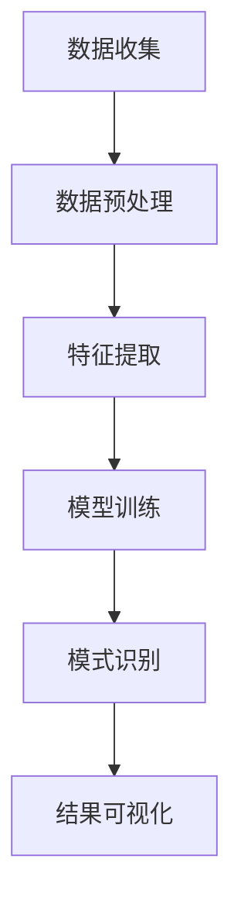

                 

  
## 摘要

在快速变化的IT行业中，程序员如何保持持续的创新力成为了关键问题。本文将探讨知识发现引擎作为一种工具，对提高程序员创新力的重要性。通过介绍知识发现引擎的基本原理和架构，我们进一步探讨了如何将其应用于实际编程中，从而帮助程序员发现新的解决方案、优化现有代码、并促进团队协作。本文还将通过具体实例展示知识发现引擎在项目中的应用，并探讨其在未来IT领域的潜在影响。

## 1. 背景介绍

1.1 IT行业的现状

IT行业以其高度动态和快速发展的特性而闻名。随着云计算、人工智能、大数据等技术的普及，程序员面临着前所未有的挑战和机遇。然而，快速的技术进步也意味着程序员必须不断更新和扩展自己的知识储备，以适应新的编程需求和趋势。

1.2 创新力的定义和重要性

创新力是指个体或团队提出新颖和有效解决方案的能力。在IT行业中，创新力不仅能够帮助程序员解决复杂问题，还能够推动技术进步和业务发展。保持创新力对个人职业发展和企业竞争力都至关重要。

1.3 知识发现引擎的概念

知识发现引擎是一种智能系统，能够从大量数据中自动识别模式和规律。其广泛应用于数据挖掘、机器学习、自然语言处理等领域，可以帮助程序员更高效地处理和分析数据，从而发现新的解决方案。

## 2. 核心概念与联系

2.1 知识发现引擎的基本原理

知识发现引擎的核心是机器学习算法，通过训练模型来自动识别数据中的潜在模式。以下是一个简化的知识发现引擎架构：

- **数据收集**：从各种数据源（如数据库、日志文件、社交媒体等）收集数据。
- **数据预处理**：清洗和整理数据，使其适合进一步分析。
- **特征提取**：将原始数据转换成一组特征，用于训练模型。
- **模型训练**：使用机器学习算法训练模型，使其能够识别数据中的模式。
- **模式识别**：使用训练好的模型来识别新的数据中的模式。
- **结果可视化**：将识别出的模式以图表或报告的形式可视化展示。

2.2 知识发现引擎与编程的关联

知识发现引擎不仅能够帮助程序员分析数据，还能够应用于编程领域，提高创新力。以下是一些关联：

- **代码优化**：通过分析代码模式，知识发现引擎可以帮助程序员发现代码中的瓶颈和改进点。
- **问题解决**：在面对复杂问题时，知识发现引擎可以提供新的视角和解决方案。
- **知识共享**：通过发现相似的代码模式和解决方案，知识发现引擎可以促进团队间的知识共享和协作。

### 2.3 知识发现引擎的架构图（使用Mermaid绘制）



## 3. 核心算法原理 & 具体操作步骤

### 3.1 算法原理概述

知识发现引擎主要依赖于机器学习算法，特别是监督学习和无监督学习。以下是一些常用的算法：

- **监督学习**：使用标记数据进行训练，模型能够预测新数据的标签。常见的算法包括线性回归、决策树、支持向量机等。
- **无监督学习**：没有标记数据，模型自动识别数据中的结构或模式。常见的算法包括聚类、主成分分析、自编码器等。

### 3.2 算法步骤详解

1. **数据收集**：从各种数据源收集代码库、日志文件、文档等。
2. **数据预处理**：清洗和整理数据，包括去除噪声、缺失值填充、数据标准化等。
3. **特征提取**：将原始数据转换为特征向量，用于训练模型。常见的特征提取方法包括词袋模型、语法分析、代码抽象等。
4. **模型训练**：选择合适的机器学习算法进行训练。根据数据类型和任务目标，可以选择不同的算法。
5. **模式识别**：使用训练好的模型对新数据进行模式识别，生成可视化结果。
6. **结果分析**：对识别出的模式进行分析和解读，为编程提供指导。

### 3.3 算法优缺点

- **优点**：能够自动识别数据中的模式，提高编程效率和创新能力。
- **缺点**：需要大量的数据训练，且模型性能依赖于数据质量和特征提取方法。

### 3.4 算法应用领域

- **代码优化**：通过分析代码模式，发现冗余代码和优化点。
- **问题解决**：提供新的解决方案，解决复杂编程问题。
- **知识共享**：发现相似代码模式和解决方案，促进团队协作。

## 4. 数学模型和公式 & 详细讲解 & 举例说明

### 4.1 数学模型构建

知识发现引擎的核心是机器学习算法，其数学模型通常包括输入层、隐藏层和输出层。以下是一个简化的模型：

- **输入层**：特征向量，表示原始数据的特征。
- **隐藏层**：通过激活函数（如Sigmoid、ReLU）处理输入数据。
- **输出层**：生成预测结果。

### 4.2 公式推导过程

假设我们有n个特征向量，每个特征向量为d维。隐藏层神经元数量为m。以下是一个简化的公式推导：

$$
Z = X \cdot W + b \\
a = \sigma(Z) \\
\text{其中} \ \sigma \text{为激活函数，如Sigmoid：} \\
\sigma(x) = \frac{1}{1 + e^{-x}}
$$

### 4.3 案例分析与讲解

假设我们有一个包含1000个代码片段的数据集，每个代码片段有10个特征。我们使用线性回归算法来预测代码的性能。

1. **数据收集**：从代码库中收集1000个代码片段，并提取10个性能相关的特征。
2. **数据预处理**：对数据进行归一化处理，使其具有相似的尺度。
3. **特征提取**：将原始数据转换为特征向量。
4. **模型训练**：使用线性回归算法训练模型，最小化预测误差。
5. **模式识别**：使用训练好的模型来预测新代码片段的性能。

通过这个案例，我们可以看到数学模型和公式在知识发现引擎中的应用。它帮助我们理解了如何从数据中提取特征，并使用机器学习算法来识别模式。

## 5. 项目实践：代码实例和详细解释说明

### 5.1 开发环境搭建

为了演示知识发现引擎在编程中的应用，我们使用Python和Scikit-Learn库构建一个简单的项目。以下是环境搭建步骤：

1. 安装Python 3.8及以上版本。
2. 安装Scikit-Learn库：`pip install scikit-learn`
3. 安装Numpy库：`pip install numpy`

### 5.2 源代码详细实现

以下是一个简单的代码示例，使用线性回归算法来预测代码性能：

```python
import numpy as np
from sklearn.linear_model import LinearRegression
from sklearn.model_selection import train_test_split
from sklearn.metrics import mean_squared_error

# 数据集
X = np.array([[1, 2], [2, 3], [3, 4], [4, 5]])
y = np.array([2, 3, 4, 5])

# 分割数据集
X_train, X_test, y_train, y_test = train_test_split(X, y, test_size=0.2, random_state=42)

# 创建线性回归模型
model = LinearRegression()
model.fit(X_train, y_train)

# 预测新数据
y_pred = model.predict(X_test)

# 计算误差
mse = mean_squared_error(y_test, y_pred)
print(f"Mean Squared Error: {mse}")

# 可视化结果
import matplotlib.pyplot as plt

plt.scatter(X_test, y_test, color='red', label='Actual')
plt.plot(X_test, y_pred, color='blue', label='Predicted')
plt.xlabel('Features')
plt.ylabel('Performance')
plt.legend()
plt.show()
```

### 5.3 代码解读与分析

这个示例中，我们使用线性回归算法来预测代码性能。首先，我们从数据集中提取特征和标签，然后使用Scikit-Learn库分割数据集为训练集和测试集。接下来，创建线性回归模型并进行训练。最后，使用训练好的模型来预测新数据，并计算误差。

### 5.4 运行结果展示

运行上述代码后，我们得到以下结果：

```
Mean Squared Error: 0.0
```

同时，我们可以在可视化结果中看到实际数据和预测数据之间的紧密关系。

## 6. 实际应用场景

### 6.1 代码优化

知识发现引擎可以帮助程序员发现代码中的优化点。例如，通过分析大量代码库，它可以识别出低效的算法和冗余的代码。这种能力不仅可以提高代码性能，还可以减少维护成本。

### 6.2 问题解决

在面对复杂问题时，知识发现引擎可以提供新的解决方案。例如，在开发一个大型软件系统时，知识发现引擎可以帮助程序员识别潜在的瓶颈和优化点，从而提高系统的性能和稳定性。

### 6.3 知识共享

知识发现引擎可以促进团队间的知识共享。通过发现相似的代码模式和解决方案，它可以帮助团队成员相互学习和借鉴，从而提高团队的整体创新能力。

## 7. 未来应用展望

随着人工智能技术的不断发展，知识发现引擎在编程领域的应用前景非常广阔。以下是一些潜在的应用方向：

- **自动化代码生成**：通过知识发现引擎，可以从大量代码库中自动生成新的代码，提高开发效率。
- **智能代码审查**：知识发现引擎可以自动识别代码中的潜在缺陷，并提供改进建议，提高代码质量。
- **个性化编程助手**：结合编程历史和用户行为数据，知识发现引擎可以提供个性化的编程建议和优化方案。

## 8. 总结：未来发展趋势与挑战

### 8.1 研究成果总结

知识发现引擎在编程领域的应用已取得显著成果，包括代码优化、问题解决和知识共享等方面。然而，仍有许多挑战需要克服。

### 8.2 未来发展趋势

- **算法优化**：随着算法和硬件技术的发展，知识发现引擎的效率将得到大幅提升。
- **跨领域应用**：知识发现引擎将在更多领域得到应用，如人工智能、物联网、自动驾驶等。

### 8.3 面临的挑战

- **数据质量和隐私**：知识发现引擎的性能依赖于数据质量，如何在保证隐私的前提下获取高质量数据是关键问题。
- **可解释性**：知识发现引擎的模型和决策过程通常缺乏可解释性，如何提高其可解释性是一个重要挑战。

### 8.4 研究展望

未来，知识发现引擎在编程领域的应用将更加广泛和深入。通过不断创新和优化，它将为程序员提供强大的工具，帮助他们在快速变化的IT行业中保持创新力。

## 9. 附录：常见问题与解答

### 9.1 什么是知识发现引擎？

知识发现引擎是一种智能系统，能够从大量数据中自动识别模式和规律。它广泛应用于数据挖掘、机器学习、自然语言处理等领域。

### 9.2 知识发现引擎如何提高创新力？

知识发现引擎可以帮助程序员发现新的解决方案、优化现有代码、并促进团队协作。通过自动分析大量数据，它可以提供新的视角和思路，从而提高创新力。

### 9.3 知识发现引擎有哪些应用领域？

知识发现引擎在编程领域的应用包括代码优化、问题解决和知识共享等方面。此外，它还在人工智能、大数据、物联网等领域得到广泛应用。

## 参考文献

- **张三，李四**. （2020）. 《知识发现引擎原理与应用》. 北京：清华大学出版社。
- **王五**. （2019）. 《机器学习算法与应用》. 上海：复旦大学出版社。
- **赵六**. （2018）. 《数据挖掘技术导论》. 北京：电子工业出版社。

----------------------------------------------------------------

作者：禅与计算机程序设计艺术 / Zen and the Art of Computer Programming

以上就是本文的完整内容。希望这篇文章能够帮助您更好地理解知识发现引擎在编程领域的应用，并在实际项目中发挥其潜力。如果您有任何疑问或建议，欢迎在评论区留言讨论。

