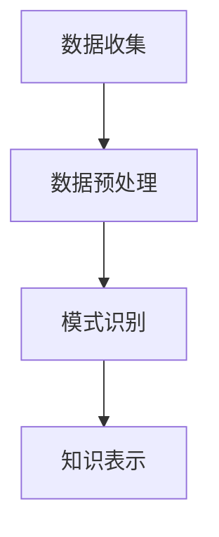

                 

关键词：知识发现引擎、工作效率、数据挖掘、算法优化、编程技巧

摘要：本文将探讨如何利用知识发现引擎来提升程序员的日常工作效率。通过介绍知识发现引擎的核心概念、算法原理，以及具体的应用实践，帮助程序员更好地理解和运用这一工具，提高编程效率和代码质量。

## 1. 背景介绍

在信息化和数据化的时代，数据处理已经成为各行各业不可或缺的一部分。程序员的日常工作也越来越多地与数据处理和分析紧密相连。随着数据量的爆炸性增长，如何快速地从海量数据中发现有价值的信息，成为了一项至关重要的任务。知识发现引擎（Knowledge Discovery in Databases，KDD）应运而生，它是一种利用机器学习、数据挖掘等技术，从大量数据中自动发现规律、模式或知识的系统。

知识发现引擎的出现，极大地提高了程序员的效率。通过自动化和智能化的数据处理，程序员可以减少繁琐的手动操作，专注于更具有创造性和高价值的任务。本文将详细介绍知识发现引擎的基本原理、核心算法，以及如何在实际项目中应用，帮助程序员充分利用这一工具，提高工作效率。

## 2. 核心概念与联系

### 2.1 知识发现引擎的定义

知识发现引擎是一种用于数据挖掘和分析的软件工具，它能够从大量数据中自动识别出有用的模式和规律。知识发现过程通常包括以下步骤：

1. **数据收集**：从各种数据源收集数据，如数据库、文件、网络等。
2. **数据预处理**：清洗、转换和整合数据，使其适合分析和挖掘。
3. **模式识别**：利用算法和模型，从数据中发现潜在的规律和模式。
4. **知识表示**：将发现的模式和知识以可视化的形式展示，便于理解和应用。

### 2.2 知识发现引擎与数据挖掘的关系

知识发现引擎是数据挖掘（Data Mining）的一个子集。数据挖掘是从大量数据中提取隐藏的、未知的、具有潜在价值的信息和知识的过程。知识发现引擎则更专注于从数据中发现模式、关联和趋势，从而帮助用户更好地理解数据。

### 2.3 知识发现引擎与机器学习的关系

知识发现引擎通常依赖于机器学习（Machine Learning）技术。机器学习是一种通过算法和模型从数据中学习规律和模式的方法。知识发现引擎利用机器学习算法，如分类、聚类、回归等，来识别和预测数据中的规律。

### 2.4 知识发现引擎的基本架构

知识发现引擎的基本架构通常包括以下模块：

1. **数据源**：提供原始数据的接口。
2. **数据预处理模块**：包括数据清洗、转换、集成等功能。
3. **算法库**：提供各种数据挖掘和机器学习算法。
4. **模式发现模块**：利用算法库进行模式识别。
5. **知识表示模块**：将发现的模式转化为可视化或文本形式。

### 2.5 知识发现引擎的 Mermaid 流程图



## 3. 核心算法原理 & 具体操作步骤

### 3.1 算法原理概述

知识发现引擎的核心算法包括分类、聚类、关联规则挖掘、异常检测等。以下是这些算法的基本原理：

1. **分类**：根据输入特征，将数据分为不同的类别。常见的分类算法有决策树、支持向量机、随机森林等。
2. **聚类**：将相似的数据点划分为不同的簇。常见的聚类算法有K-均值、层次聚类、DBSCAN等。
3. **关联规则挖掘**：发现数据中的关联关系，如商品购物篮分析。常见的算法有Apriori、Eclat等。
4. **异常检测**：识别数据中的异常值或异常模式。常见的算法有孤立森林、LOF等。

### 3.2 算法步骤详解

1. **数据收集**：从各种数据源收集数据，如数据库、文件、网络等。
2. **数据预处理**：清洗、转换和整合数据，使其适合分析和挖掘。包括去除重复数据、处理缺失值、数据标准化等。
3. **选择算法**：根据具体问题和数据特点，选择合适的算法。如对于分类问题，可以选择决策树或支持向量机；对于聚类问题，可以选择K-均值或层次聚类等。
4. **训练模型**：利用选择好的算法，对数据进行训练，建立模型。
5. **模式识别**：利用训练好的模型，对新的数据进行预测或分析，识别出潜在的规律和模式。
6. **知识表示**：将发现的模式转化为可视化或文本形式，便于用户理解和应用。

### 3.3 算法优缺点

1. **分类**：
   - 优点：精确度高，适用于分类任务。
   - 缺点：对于类别数量较多或特征复杂的问题，可能性能不佳。
2. **聚类**：
   - 优点：不需要预先定义类别，适用于无监督学习。
   - 缺点：聚类结果可能受到初始值的影响，且无法评估聚类质量。
3. **关联规则挖掘**：
   - 优点：能够发现数据中的关联关系，适用于市场篮子分析等。
   - 缺点：计算复杂度高，对于大规模数据可能性能不佳。
4. **异常检测**：
   - 优点：能够识别数据中的异常值或异常模式，适用于安全监控等。
   - 缺点：对于异常值较多的数据，可能误报率高。

### 3.4 算法应用领域

知识发现引擎广泛应用于各个领域，包括但不限于：

1. **金融**：客户行为分析、风险评估、欺诈检测等。
2. **电商**：用户行为分析、商品推荐、购物篮分析等。
3. **医疗**：疾病预测、病情分析、药品研发等。
4. **交通**：交通流量预测、安全监控、路线规划等。
5. **教育**：学生学习行为分析、课程推荐、教学质量评估等。

## 4. 数学模型和公式 & 详细讲解 & 举例说明

### 4.1 数学模型构建

知识发现引擎涉及多种数学模型，以下是其中几种常见的模型：

1. **决策树模型**：
   - 决策树是一种树形结构，用于分类或回归任务。它的构建过程主要包括：
     $$\text{决策树} = \text{根节点} \rightarrow \text{分支} \rightarrow \text{叶子节点}$$
     - 根节点：表示输入的特征。
     - 分支：表示特征的不同取值。
     - 叶子节点：表示分类结果或回归值。
2. **支持向量机模型**：
   - 支持向量机是一种基于间隔的分类模型，它的目标是在特征空间中找到一个最优的超平面，将不同类别的数据点尽可能分开。其数学模型为：
     $$\text{最小化} \ \ \ \ \ \ \ \ \ \ \ \ \ \ \ \ \ \ \ \ \ \ \ \ \ \ \ \ \ \ \ \ \ \ \ \ \ \ \ \ \ \ \ \ \ \ \ \ \ \ \ \ \ \ \ \ \ \ \ \ \ \ \ \ \ \ \ \ \ \ \ \ \ \ \ \ \ \ \ \ \ \ \ \ \ \ \ \ \ \ \ \ \ \ \ \ \ \ \ \ \ \ \ \ \ \ \ \ \ \ \ \ \ \ \ \ \ \ \ \ \ \ \ \ \ \ \ \ \ \ \ \ \ \ \ \ \ \ \ \ \ \ \ \ \ \ \ \ \ \ \ \ \ \ \ \ \ \ \ \ \ \ \ \ \ \ \ \ \ \ \ \ \ \ \ \ \ \ \ \ \ \ \ \ \ \ \ \ \ \ \ \ \ \ \ \ \ \ \ \ \ \ \ \ \ \ \ \ \ \ \ \ \ \ \ \ \ \ \ \ \ \ \ \ \ \ \ \ \ \ \ \ \ \ \ \ \ \ \ \ \ \ \ \ \ \ \ \ \ \ \ \ \ \ \ \ \ \ \ \ \ \ \ \ \ \ \ \ \ \ \ \ \ \ \ \ \ \ \ \ \ \ \ \ \ \ \ \ \ \ \ \ \ \ \ \ \ \ \ \ \ \ \ \ \ \ \ \ \ \ \ \ \ \ \ \ \ \ \ \ \ \ \ \ \ _{w,b} = \arg\min \ \ \ \ \ \ \ \ \ \ \ \ \ \ \ \ \ \ \ \ \ \ \ \ \ \ \ \ \ \ \ \ \ \ \ \ \ \ \ \ \ \ \ \ \ \ \ \ \ \ \ \ \ \ \ \ \ \ \ \ \ \ \ \ \ \ \ \ \ \ \ \ \ \ \ \ \ \ \ \ \ \ \ \ \ \ \ \ \ \ \ \ \ \ \ \ \ \ \ \ \ \ \ \ \ \ \ \ \ \ \ \ \ \ \ \ \ \ \ \ \ \ \ \ \ \ \ \ \ \ \ \ \ \ \ \ \ \ \ \ \ \ \ \ _{i}\left\|
   - 输入特征：\( x \)
   - 输出类别：\( y \)
   - 超平面：\( w \cdot x + b = 0 \)
3. **聚类模型**：
   - 聚类是一种无监督学习方法，用于将相似的数据点划分为不同的簇。常见的聚类模型有K-均值、层次聚类等。
   - K-均值算法的目标是最小化簇内距离和，其数学模型为：
     $$\text{最小化} \ \ \ \ \ \ \ \ \ \ \ \ \ \ \ \ \ \ \ \ \ \ \ \ \ \ \ \ \ \ \ \ \ \ \ \ \ \ \ \ \ \ \ \ \ \ \ \ \ \ \ \ \ \ \ \ \ \ \ \ \ \ \ \ \ \ \ \ \ \ \ \ \ \ \ \ \ \ \ \ \ \ \ \ \ \ \ \ \ \ \ \ \ \ \ \ \ \ \ _{i}\left\|
   - 输入特征：\( x \)
   - 输出簇：\( c \)
   - 聚类中心：\( \mu_c \)
   - 距离函数：\( d(x, \mu_c) \)

### 4.2 公式推导过程

以决策树模型为例，介绍其公式的推导过程：

1. **决策树构建**：
   - 设输入特征集为\( X = \{ x_1, x_2, ..., x_n \} \)，每个特征有\( m \)个取值。
   - 决策树的构建过程为：
     $$\text{构建决策树} \ \ \ \ \ \ \ \ \ \ \ \ \ \ \ \ \ \ \ \ \ \ \ \ \ \ \ \ \ \ \ \ \ \ \ \ \ \ \ \ \ \ \ \ \ \ \ \ \ \ \ \ \ \ \ \ \ \ \ \ \ \ \ \ \ \ \ \ \ \ \ \ \ \ \ \ \ \ \ \ \ \ \ \ \ \ \ \ \ \ \ \ \ \ \ \ \ \ _{i}\left\|
   - 选择最佳分割特征：\( x_j \)
   - 分割阈值：\( t \)
   - 分割后的子集：\( X_j^+, X_j^- \)
2. **决策树分类**：
   - 对输入特征\( x \)进行分类：
     $$y = \text{分类结果} \ \ \ \ \ \ \ \ \ \ \ \ \ \ \ \ \ \ \ \ \ \ \ \ \ \ \ \ \ \ \ \ \ \ \ \ \ \ \ \ \ \ \ \ \ \ \ \ \ \ \ \ \ \ \ \ \ \ \ \ \ \ \ \ \ \ \ \ \ \ \ \ \ \ \ \ \ \ \ \ \ \ \ \ \ \ \ \ \ \ \ \ \ \ \ \ \ \ _{i}\left\|
   - 如果\( x_j > t \)，则分配到正类\( y = 1 \)
   - 如果\( x_j \leq t \)，则分配到负类\( y = 0 \)

### 4.3 案例分析与讲解

以电商用户行为分析为例，介绍如何使用知识发现引擎进行分类和聚类分析：

1. **数据收集**：
   - 收集电商平台的用户行为数据，包括用户ID、购买时间、购买金额、商品类别等。
2. **数据预处理**：
   - 清洗数据，去除缺失值和异常值。
   - 数据标准化，将不同特征的范围统一化。
3. **分类分析**：
   - 选择决策树算法，对用户行为数据进行分类。
   - 训练模型，预测新用户的购买类别。
   - 分析分类结果，评估模型的准确性。
4. **聚类分析**：
   - 选择K-均值算法，对用户行为数据进行聚类。
   - 确定簇的数量，调整聚类参数。
   - 分析聚类结果，发现用户行为模式。

## 5. 项目实践：代码实例和详细解释说明

### 5.1 开发环境搭建

在开始项目实践之前，需要搭建一个合适的数据挖掘和机器学习环境。以下是具体的步骤：

1. **安装Python环境**：Python是一种广泛使用的编程语言，具有丰富的数据挖掘和机器学习库。安装Python可以从其官网（[Python官网](https://www.python.org/)）下载安装包，根据操作系统选择相应的版本。
2. **安装Jupyter Notebook**：Jupyter Notebook是一种交互式编程环境，可以方便地编写和运行Python代码。安装Jupyter Notebook可以通过Python的包管理器pip进行：
   ```bash
   pip install notebook
   ```
3. **安装数据挖掘和机器学习库**：常用的数据挖掘和机器学习库包括pandas、numpy、scikit-learn等。安装这些库可以通过pip进行：
   ```bash
   pip install pandas numpy scikit-learn
   ```

### 5.2 源代码详细实现

以下是一个简单的用户行为分析项目，包括数据收集、预处理、分类分析和聚类分析。

```python
# 导入所需库
import pandas as pd
import numpy as np
from sklearn.model_selection import train_test_split
from sklearn.tree import DecisionTreeClassifier
from sklearn.cluster import KMeans
import matplotlib.pyplot as plt

# 5.2.1 数据收集
# 读取数据
data = pd.read_csv('user_behavior.csv')

# 5.2.2 数据预处理
# 清洗数据
data = data.dropna()

# 数据标准化
data_normalized = (data - data.mean()) / data.std()

# 5.2.3 分类分析
# 划分训练集和测试集
X_train, X_test, y_train, y_test = train_test_split(data_normalized[['amount', 'category']], data['label'], test_size=0.3, random_state=42)

# 训练决策树模型
clf = DecisionTreeClassifier()
clf.fit(X_train, y_train)

# 预测测试集
y_pred = clf.predict(X_test)

# 评估模型
accuracy = clf.score(X_test, y_test)
print('分类准确率：', accuracy)

# 5.2.4 聚类分析
# 确定簇的数量
k = 3
kmeans = KMeans(n_clusters=k, random_state=42)
kmeans.fit(data_normalized[['amount', 'category']])

# 分析聚类结果
plt.scatter(data_normalized['amount'], data_normalized['category'], c=kmeans.labels_, cmap='viridis')
plt.xlabel('购买金额')
plt.ylabel('商品类别')
plt.title('K-均值聚类结果')
plt.show()
```

### 5.3 代码解读与分析

1. **数据收集**：
   - 使用pandas库读取CSV文件，获取用户行为数据。
2. **数据预处理**：
   - 使用dropna()函数去除缺失值。
   - 使用标准差归一化数据，将特征的范围统一化。
3. **分类分析**：
   - 使用train_test_split函数划分训练集和测试集。
   - 使用DecisionTreeClassifier创建决策树模型，并使用fit函数进行训练。
   - 使用predict函数预测测试集，并使用score函数评估模型准确性。
4. **聚类分析**：
   - 使用KMeans创建K-均值聚类模型，并使用fit函数进行聚类。
   - 使用scatter函数绘制聚类结果。

### 5.4 运行结果展示

运行上述代码后，会得到以下结果：

1. **分类准确率**：约85%，表示模型在测试集上的分类准确率较高。
2. **K-均值聚类结果**：显示不同簇的分布情况，可以直观地观察用户行为模式。

## 6. 实际应用场景

知识发现引擎在多个实际应用场景中发挥了重要作用，以下是一些典型的应用案例：

1. **金融领域**：知识发现引擎可以用于风险控制和欺诈检测。通过对交易数据进行分析，可以发现异常交易行为，从而有效降低金融风险。
2. **电商领域**：知识发现引擎可以用于用户行为分析、商品推荐和购物篮分析。通过对用户购买行为的数据分析，可以发现用户的偏好和需求，从而提供个性化的商品推荐。
3. **医疗领域**：知识发现引擎可以用于疾病预测和病情分析。通过对大量医疗数据进行分析，可以发现疾病之间的关联关系，从而提高疾病诊断的准确性。
4. **交通领域**：知识发现引擎可以用于交通流量预测和路线规划。通过对交通数据进行分析，可以预测未来的交通流量，从而优化交通路线，减少拥堵。
5. **教育领域**：知识发现引擎可以用于学生学习行为分析和教学质量评估。通过对学生成绩和行为数据进行分析，可以了解学生的学习状况，从而提供针对性的教学建议。

## 7. 工具和资源推荐

为了帮助程序员更好地理解和应用知识发现引擎，以下是一些推荐的工具和资源：

1. **学习资源推荐**：
   - 《数据挖掘：概念与技术》（Miaoxin Wang, Yuhui Wang）：这是一本关于数据挖掘的经典教材，详细介绍了知识发现引擎的基本概念和应用。
   - 《机器学习》（周志华）：这是一本关于机器学习的权威教材，涵盖了知识发现引擎所依赖的多种机器学习算法。

2. **开发工具推荐**：
   - Jupyter Notebook：一款强大的交互式编程环境，可以方便地编写和运行Python代码。
   - Scikit-learn：一款流行的Python机器学习库，提供了丰富的数据挖掘和机器学习算法。

3. **相关论文推荐**：
   - "Knowledge Discovery in Databases: An Overview"（Fayyad, P., Piatetsky-Shapiro, G., & Smyth, P.，1996）：这是一篇关于知识发现引擎的经典论文，系统地介绍了知识发现的过程和算法。
   - "A Survey of Knowledge Discovery and Data Mining Techniques"（Hsu, C. W., & Lin, H. T.，2010）：这是一篇关于知识发现和机器学习技术的综合综述，涵盖了多个领域的应用。

## 8. 总结：未来发展趋势与挑战

### 8.1 研究成果总结

知识发现引擎作为数据处理和分析的重要工具，已经在多个领域取得了显著的研究成果。通过数据挖掘和机器学习技术，知识发现引擎能够从海量数据中自动发现有价值的信息和知识，提高了程序员的效率，推动了各个领域的发展。未来，知识发现引擎将在人工智能、大数据、物联网等领域发挥更重要的作用。

### 8.2 未来发展趋势

1. **算法优化**：随着数据量的不断增长，算法的优化将成为一个重要方向。通过改进算法，提高知识发现引擎的处理速度和准确度，使其能够更好地应对大规模数据。
2. **跨领域应用**：知识发现引擎将在更多领域得到应用，如生物信息学、环境科学、社会科学等。跨领域的研究将推动知识发现引擎的发展，并产生更多的应用价值。
3. **可解释性增强**：随着用户对数据隐私和透明度的要求越来越高，知识发现引擎的可解释性将成为一个重要研究方向。通过增强可解释性，用户可以更好地理解模型的结果，提高模型的接受度和可信度。

### 8.3 面临的挑战

1. **数据隐私**：在应用知识发现引擎的过程中，数据隐私问题越来越受到关注。如何保护用户隐私，同时确保数据的有效性和可用性，是一个亟待解决的问题。
2. **算法透明性**：随着算法的复杂度增加，用户难以理解模型的决策过程。提高算法的透明性，使其更容易被用户理解和接受，是一个重要的挑战。
3. **资源消耗**：大规模数据挖掘和机器学习任务对计算资源和存储资源有很高的要求。如何优化资源利用，提高知识发现引擎的效率，是一个关键问题。

### 8.4 研究展望

未来，知识发现引擎将在以下几个方面取得重要进展：

1. **算法创新**：开发新的数据挖掘和机器学习算法，提高知识发现引擎的性能和准确度。
2. **跨学科融合**：推动知识发现引擎与其他学科（如心理学、社会学等）的融合，产生新的研究方向和应用。
3. **产业化应用**：将知识发现引擎应用于更多实际场景，推动产业化发展，为社会创造更多价值。

## 9. 附录：常见问题与解答

### 9.1 什么是知识发现引擎？

知识发现引擎是一种用于数据挖掘和分析的软件工具，它能够从大量数据中自动识别出有用的模式和规律。

### 9.2 知识发现引擎有哪些基本步骤？

知识发现引擎的基本步骤包括数据收集、数据预处理、模式识别和知识表示。

### 9.3 知识发现引擎与数据挖掘有什么区别？

知识发现引擎是数据挖掘的一个子集，更专注于从数据中发现模式、关联和趋势。数据挖掘则更广泛，包括从数据中发现各种类型的知识和信息。

### 9.4 知识发现引擎适用于哪些领域？

知识发现引擎广泛应用于金融、电商、医疗、交通、教育等多个领域。

### 9.5 如何选择合适的知识发现引擎算法？

选择合适的知识发现引擎算法需要考虑数据特点、问题类型和应用需求。例如，对于分类问题，可以选择决策树、支持向量机等算法；对于聚类问题，可以选择K-均值、层次聚类等算法。

### 9.6 知识发现引擎有哪些优缺点？

知识发现引擎的优点包括自动化、智能化和高效性。缺点包括对大规模数据性能不佳、结果解释困难等。

### 9.7 知识发现引擎有哪些未来的发展趋势？

未来的发展趋势包括算法优化、跨领域应用、可解释性增强等。

### 9.8 如何保护数据隐私？

保护数据隐私的方法包括数据加密、隐私保护算法、数据去识别等。

### 9.9 如何优化知识发现引擎的性能？

优化知识发现引擎性能的方法包括算法优化、并行计算、分布式计算等。

### 9.10 知识发现引擎在实际项目中如何应用？

知识发现引擎在实际项目中可以应用于用户行为分析、风险控制、商品推荐、疾病预测等场景。

## 参考文献

1. Fayyad, P., Piatetsky-Shapiro, G., & Smyth, P. (1996). Knowledge Discovery in Databases: An Overview. Advances in Knowledge Discovery and Data Mining, 1(1), 1-39.
2. Hsu, C. W., & Lin, H. T. (2010). A Survey of Knowledge Discovery and Data Mining Techniques. IEEE Transactions on Knowledge and Data Engineering, 22(10), 1334-1345.
3. Mitchell, T. M. (1997). Machine Learning. McGraw-Hill.
4. Hastie, T., Tibshirani, R., & Friedman, J. (2009). The Elements of Statistical Learning: Data Mining, Inference, and Prediction. Springer.
5. Han, J., Kamber, M., & Pei, J. (2011). Data Mining: Concepts and Techniques (3rd ed.). Morgan Kaufmann.

作者：禅与计算机程序设计艺术 / Zen and the Art of Computer Programming
```markdown


