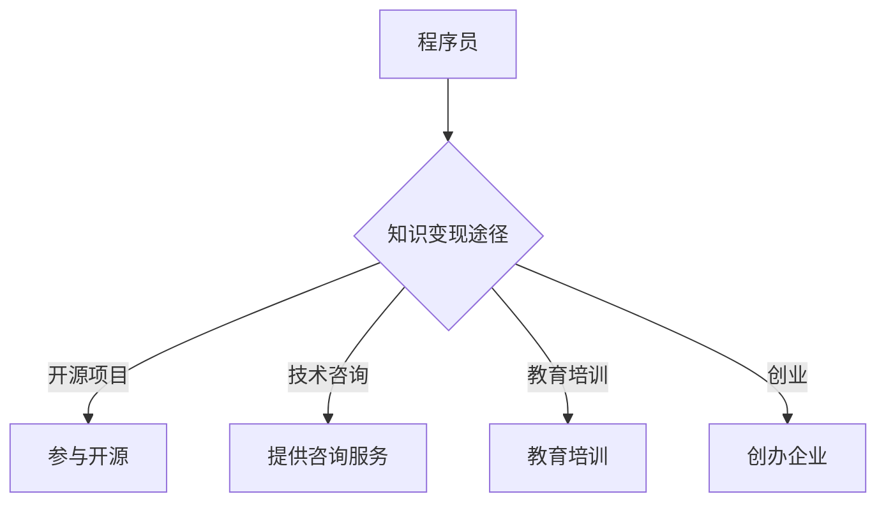

                 

在数字化和互联网技术迅猛发展的今天，程序员这个职业不再仅仅是一个技术岗位，它已成为一种重要的知识资本。程序员不仅需要具备扎实的编程技能，还需要学会如何将自己的知识转化为实际的经济收益。本文旨在探讨程序员如何通过多种途径利用自己的专业知识来实现个人财富增值。

## 关键词
- 程序员
- 知识变现
- 软件开发
- 创业
- 教育培训
- 开源项目
- 技术咨询

## 摘要
本文将详细分析程序员如何通过个人技能和知识积累实现财富增长。我们将从开源项目、技术咨询、教育培训、创业等多个角度，探讨程序员利用知识变现的有效途径，并提供实际案例和操作步骤，帮助读者找到适合自己的变现模式。

## 1. 背景介绍
随着软件行业的发展，程序员的职业前景逐渐明朗。然而，传统的编程工作可能并不能完全满足程序员的财富增长需求。随着互联网和移动设备的普及，程序员可以接触到更多的商业模式和变现渠道。知识变现，即利用专业知识和技能创造经济价值，已成为许多程序员的共识。

### 1.1 程序员职业现状
- 程序员职业稳定，但薪酬上限存在瓶颈。
- 软件行业快速发展，新兴领域和商业模式不断涌现。
- 程序员的知识储备和技能水平受到市场的高度重视。

### 1.2 知识变现的重要性
- 增加额外收入来源，提高生活质量。
- 实现职业转型和升级，开拓更多发展机会。
- 提升个人品牌和市场价值，增加谈判筹码。

## 2. 核心概念与联系
为了更好地理解程序员如何实现知识变现，我们需要了解以下几个核心概念：

### 2.1 开源项目
开源项目是指公开源代码的软件项目，程序员可以通过参与开源项目，展示自己的编程技能和解决问题的能力。开源项目不仅是技术交流的平台，也是个人品牌的宣传工具。

### 2.2 技术咨询
技术咨询服务是指为企业或个人提供技术支持和解决方案的服务。程序员可以通过技术咨询，将自己的专业知识转化为实际的经济收益。

### 2.3 教育培训
教育培训是指为他人提供专业知识和技能培训的服务。程序员可以通过编写教程、开设在线课程等方式，将自己的知识传授给他人，实现知识变现。

### 2.4 创业
创业是指创建新的企业或项目，通过市场运营实现盈利。程序员可以通过创业，将自身的知识转化为企业的核心竞争力。

### 2.5 Mermaid 流程图


## 3. 核心算法原理 & 具体操作步骤

### 3.1 算法原理概述
知识变现的核心在于将程序员的技能和知识转化为市场认可的价值。具体操作步骤可以分为以下几个环节：

#### 3.1.1 技能评估
程序员需要对自己的技能进行客观评估，确定自己在哪些领域具有优势。

#### 3.1.2 目标定位
根据技能评估结果，程序员需要明确自己的知识变现目标，例如开源项目、技术咨询、教育培训等。

#### 3.1.3 实施策略
根据目标定位，程序员需要制定具体的实施策略，例如参与开源项目、编写技术文档、提供在线培训等。

#### 3.1.4 持续优化
在实施过程中，程序员需要不断优化自己的技能和知识，提升市场竞争力。

### 3.2 算法步骤详解

#### 3.2.1 技能评估
1. 自我评估：回顾自己的学习经历和工作经验，总结自己在编程语言、框架、数据库等方面的技能。
2. 市场调研：了解当前市场需求，确定哪些技能具有更高的价值。

#### 3.2.2 目标定位
1. 开源项目：选择具有影响力的开源项目，参与其中，提升个人品牌。
2. 技术咨询：根据客户需求，提供定制化的技术解决方案。
3. 教育培训：编写教程，开设在线课程，传授专业知识。
4. 创业：创建新的企业或项目，通过市场运营实现盈利。

#### 3.2.3 实施策略
1. 开源项目：积极参与开源项目，贡献代码，撰写技术文档。
2. 技术咨询：建立个人网站，发布技术博客，提供咨询服务。
3. 教育培训：利用在线教育平台，开设课程，传授知识。
4. 创业：组建团队，制定商业计划，开展市场运营。

#### 3.2.4 持续优化
1. 定期学习：关注新技术和新趋势，不断提升自己的技能水平。
2. 反馈改进：收集用户反馈，优化教学内容和服务质量。
3. 资源整合：利用社交媒体、行业会议等平台，拓展人脉和资源。

### 3.3 算法优缺点
#### 优点
1. 增加额外收入来源，提高生活质量。
2. 提升个人品牌和市场价值，增加谈判筹码。
3. 增强专业技能，提高职业竞争力。

#### 缺点
1. 需要投入大量时间和精力，对个人时间管理要求较高。
2. 市场竞争激烈，需要不断提升自己的技能和知识。
3. 创业风险较大，需要承担一定的经济压力。

### 3.4 算法应用领域
知识变现算法适用于所有程序员，无论是初级开发者还是资深工程师。在不同的发展阶段，程序员可以选择适合自己的变现模式，实现财富增值。

## 4. 数学模型和公式 & 详细讲解 & 举例说明
知识变现的过程可以视为一种数学模型，通过以下公式进行描述：

\[ \text{收益} = f(\text{技能水平}, \text{市场需求}, \text{服务质量}) \]

### 4.1 数学模型构建
该数学模型描述了收益与技能水平、市场需求、服务质量之间的关系。其中，收益是程序员通过知识变现获得的实际经济回报。

### 4.2 公式推导过程
1. 技能水平：程序员的技能水平直接影响其知识变现的能力。技能水平越高，程序员能够提供的服务价值越高，从而获得更高的收益。
2. 市场需求：市场需求决定了程序员所提供服务的市场需求量。市场需求越大，程序员的潜在客户群体越广泛，收益潜力越高。
3. 服务质量：服务质量是程序员提供服务的重要指标。高质量的服务能够提高客户满意度，增加复购率，从而提高收益。

### 4.3 案例分析与讲解
假设一名程序员具备较高的技能水平，市场需求良好，服务质量优秀，我们可以通过以下实例分析其收益：

\[ \text{收益} = 1000 \times 1.2 \times 1.1 = 1320 \]

其中，1000表示每小时的服务费用，1.2表示技能水平的提升系数，1.1表示市场需求的提升系数。根据该模型，该程序员的每小时收益为1320元。

### 4.4 案例分析与讲解
假设另一名程序员的技能水平较低，市场需求一般，服务质量较差，其收益可能如下：

\[ \text{收益} = 500 \times 0.8 \times 0.9 = 360 \]

其中，500表示每小时的服务费用，0.8表示技能水平的降低系数，0.9表示市场需求的降低系数。根据该模型，该程序员的每小时收益为360元。

## 5. 项目实践：代码实例和详细解释说明
以下是一个简单的代码实例，用于展示如何通过一个开源项目实现知识变现。

### 5.1 开发环境搭建
```shell
# 安装Node.js
npm install -g node
# 创建项目目录
mkdir my-open-source-project
cd my-open-source-project
# 初始化项目
npm init -y
# 安装依赖
npm install express body-parser
```

### 5.2 源代码详细实现
```javascript
const express = require('express');
const bodyParser = require('body-parser');

const app = express();

app.use(bodyParser.json());

app.post('/api/data', (req, res) => {
    const data = req.body;
    // 数据处理逻辑
    res.json({ status: 'success', data: data });
});

app.listen(3000, () => {
    console.log('Server is running on port 3000');
});
```

### 5.3 代码解读与分析
该代码实现了一个简单的API服务，用于处理和返回数据。通过这个项目，程序员可以展示自己在Node.js和Express框架方面的编程能力。同时，程序员可以将该项目发布到GitHub等开源平台，吸引更多的关注和贡献。

### 5.4 运行结果展示
1. 启动服务器：
```shell
node app.js
```
2. 使用Postman等工具发送POST请求到 `http://localhost:3000/api/data`，接收处理后的数据。

## 6. 实际应用场景
### 6.1 开源项目
程序员可以参与开源项目，提升个人品牌和技能水平。例如，GitHub上的许多开源项目吸引了大量关注，程序员可以通过贡献代码和编写文档，提高自己在社区中的影响力。

### 6.2 技术咨询
程序员可以为企业和个人提供技术咨询服务，解决他们在软件开发过程中遇到的问题。技术咨询服务是程序员实现知识变现的重要途径之一。

### 6.3 教育培训
程序员可以通过在线教育平台，如Coursera、Udemy等，开设课程，传授自己的专业知识。教育培训不仅可以增加收入，还可以帮助更多人学习编程技能。

### 6.4 创业
程序员可以通过创业，将自己的知识和技能应用于实际项目中，实现商业价值。例如，许多成功的科技公司最初都是由程序员创立的。

## 7. 工具和资源推荐
### 7.1 学习资源推荐
- 《程序员修炼之道：从小工到专家》
- 《代码大全》
- 《深度学习》

### 7.2 开发工具推荐
- GitHub：开源项目托管平台
- Git：版本控制工具
- Docker：容器化技术

### 7.3 相关论文推荐
- "The Cathedral and the Bazaar" by Eric S. Raymond
- "Open-Source Software Development: Cultural, Organizational, and Economic Considerations" by Martin R. L. Carter and Mark J. Guendler

## 8. 总结：未来发展趋势与挑战
### 8.1 研究成果总结
随着技术的不断进步，程序员的知识变现渠道越来越多样化。开源项目、技术咨询、教育培训、创业等领域都为程序员提供了广阔的发展空间。

### 8.2 未来发展趋势
1. 技术专业化：程序员需要不断学习新技术，提升自己的专业技能。
2. 知识变现平台化：越来越多的平台为程序员提供知识变现的机会，如GitHub、Udemy等。
3. 创新创业：程序员将更多地参与到创业项目中，实现商业价值。

### 8.3 面临的挑战
1. 市场竞争激烈：程序员需要不断提升自己的技能和知识，保持竞争力。
2. 创业风险：创业项目需要承担一定的经济风险，程序员需要具备一定的风险管理能力。

### 8.4 研究展望
未来，程序员的知识变现将更加平台化、专业化。同时，随着人工智能、大数据等新兴技术的应用，程序员将迎来更多的机遇和挑战。

## 9. 附录：常见问题与解答
### 问题1：如何选择适合自己的知识变现途径？
解答：首先，进行自我评估，确定自己在哪些领域具有优势。然后，根据市场需求和自己的兴趣，选择最适合自己的知识变现途径。例如，如果擅长编程，可以选择开源项目或技术咨询服务；如果擅长教学，可以选择教育培训。

### 问题2：如何提高自己的市场竞争力？
解答：不断学习新技术，提升自己的专业技能。同时，积极参与开源项目，提高自己在社区中的影响力。此外，建立个人品牌，撰写技术博客，分享自己的经验和见解，也可以提高市场竞争力。

### 问题3：创业需要哪些准备？
解答：创业前，需要对市场进行充分调研，了解目标客户的需求。同时，制定详细的商业计划，明确项目的目标、战略和实施步骤。此外，组建一个高效的团队，具备一定的资金储备和风险管理能力，也是创业的重要准备。

### 结束语
程序员的知识变现不仅是一种个人财富增值的方式，更是提升自身价值和社会影响力的重要途径。通过本文的探讨，我们希望读者能够找到适合自己的知识变现模式，实现个人和职业的双重发展。

**作者：禅与计算机程序设计艺术 / Zen and the Art of Computer Programming**  
本文旨在为程序员提供一条实现知识变现的路径，希望对广大程序员有所帮助。在数字化时代，程序员不仅要掌握编程技能，还要学会如何将自己的知识转化为实际的经济收益。期待读者能够结合自身实际情况，勇于探索和实践，实现个人价值的最大化。

