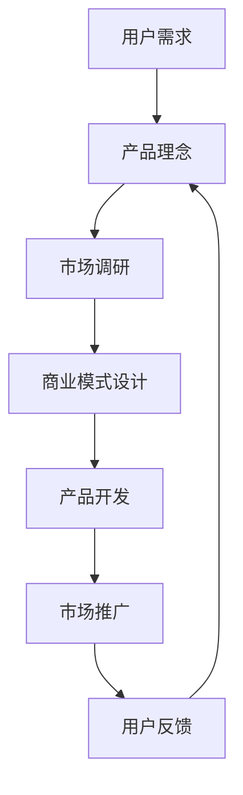

                 

关键词：程序员、侧项目、产品化、商业价值、市场策略

> 摘要：本文旨在探讨程序员如何将自己的侧项目转化为盈利产品。我们将分析项目转化的关键因素，并提供一系列的策略和步骤，帮助程序员在竞争激烈的市场中打造成功的付费产品。

## 1. 背景介绍

在当今快速发展的技术时代，越来越多的程序员选择在业余时间进行侧项目开发，这些项目往往源于他们对特定技术或问题的兴趣和热情。然而，将侧项目转化为付费产品，不仅仅是一个技术挑战，更是一个商业策略的挑战。本文将探讨如何在保持技术卓越的同时，实现商业价值。

### 1.1 侧项目的定义和特点

侧项目（Side Project）是指程序员在主要工作之外，自行发起的、具有个人兴趣或技术挑战性的项目。这些项目通常具备以下特点：

- **独立性**：侧项目不依赖于公司的资源和目标，通常由程序员个人自主控制。
- **探索性**：侧项目往往涉及新技术或新概念的应用，有助于程序员提升技术能力和创新思维。
- **灵活性**：侧项目的开发周期和进度由程序员自己决定，有助于保持较高的工作热情和创造力。

### 1.2 侧项目转化为付费产品的动机

- **个人成就感**：成功地将侧项目商业化，可以为程序员带来巨大的成就感和自我价值认可。
- **经济收益**：付费产品带来的经济收益可以为程序员提供财务自由，减轻生活压力。
- **行业影响力**：成功的商业案例可以为程序员在行业内赢得声誉，增加职业竞争力。

## 2. 核心概念与联系

### 2.1 商业模式的定义

商业模式是指公司如何创造、传递和捕获价值的一种系统性安排。对于程序员来说，理解商业模式对于将侧项目转化为付费产品至关重要。

### 2.2 商业模式的 Mermaid 流程图



在这个流程中，用户需求是商业模式的起点，而用户反馈则循环迭代，不断优化产品。

## 3. 核心算法原理 & 具体操作步骤

### 3.1 算法原理概述

将侧项目转化为付费产品的核心算法包括市场分析、产品定位、商业模式设计等。这些步骤需要结合具体项目进行个性化调整。

### 3.2 算法步骤详解

#### 3.2.1 市场分析

- **目标市场定位**：确定目标用户群体，分析其需求和痛点。
- **竞争分析**：研究同类产品的市场表现，了解竞争态势。

#### 3.2.2 产品定位

- **产品特色**：明确产品的核心功能和独特卖点。
- **用户体验**：优化产品设计，提升用户满意度。

#### 3.2.3 商业模式设计

- **定价策略**：根据产品价值和市场需求确定合理的定价。
- **盈利模式**：选择适合产品的盈利方式，如订阅制、一次性购买等。

### 3.3 算法优缺点

#### 优点：

- **灵活性**：程序员可以根据自身情况灵活调整开发进度和商业模式。
- **创新性**：侧项目往往具有创新性，有助于在市场中脱颖而出。

#### 缺点：

- **时间投入**：将侧项目转化为付费产品需要大量时间和精力。
- **市场风险**：市场变化难以预测，存在一定的市场风险。

### 3.4 算法应用领域

- **软件开发**：将个人项目转化为软件产品，面向企业或个人用户。
- **技术咨询**：基于侧项目的专业知识，提供专业的咨询服务。

## 4. 数学模型和公式 & 详细讲解 & 举例说明

### 4.1 数学模型构建

将侧项目转化为付费产品的数学模型可以简化为以下公式：

\[ \text{商业成功} = f(\text{市场需求} \times \text{产品价值} \times \text{盈利模式}) \]

### 4.2 公式推导过程

\[ \text{市场需求} \]
- 用户数量：\[ N = f(\text{人口规模} \times \text{用户转化率}) \]
- 用户支付意愿：\[ P = f(\text{产品价格} \times \text{用户满意度}) \]

\[ \text{产品价值} \]
- 功能性：\[ V_f = f(\text{产品功能} \times \text{用户需求匹配度}) \]
- 体验性：\[ V_e = f(\text{用户体验} \times \text{用户忠诚度}) \]

\[ \text{盈利模式} \]
- 盈利能力：\[ G = f(\text{定价策略} \times \text{市场接受度}) \]

### 4.3 案例分析与讲解

以一款基于机器学习的图像识别工具为例，其成功转化的过程如下：

- **市场需求**：该工具定位于企业市场，满足企业对图像处理的需求。
- **产品价值**：工具具备高效、准确的特点，且用户体验友好。
- **盈利模式**：采用订阅制，用户按月付费。

通过以上分析，该工具成功在市场中获得了认可，实现了商业价值。

## 5. 项目实践：代码实例和详细解释说明

### 5.1 开发环境搭建

- **环境要求**：Python 3.8及以上版本，TensorFlow 2.0及以上版本。
- **安装步骤**：

```bash
pip install tensorflow
```

### 5.2 源代码详细实现

```python
import tensorflow as tf

# 模型构建
model = tf.keras.Sequential([
    tf.keras.layers.Conv2D(32, (3, 3), activation='relu', input_shape=(28, 28, 1)),
    tf.keras.layers.MaxPooling2D(2, 2),
    tf.keras.layers.Conv2D(64, (3, 3), activation='relu'),
    tf.keras.layers.MaxPooling2D(2, 2),
    tf.keras.layers.Flatten(),
    tf.keras.layers.Dense(128, activation='relu'),
    tf.keras.layers.Dense(10, activation='softmax')
])

# 编译模型
model.compile(optimizer='adam',
              loss='sparse_categorical_crossentropy',
              metrics=['accuracy'])

# 训练模型
model.fit(x_train, y_train, epochs=5)

# 评估模型
test_loss, test_acc = model.evaluate(x_test, y_test)
print('Test accuracy:', test_acc)
```

### 5.3 代码解读与分析

- **模型构建**：使用TensorFlow构建卷积神经网络，包括卷积层、池化层和全连接层。
- **编译模型**：设置优化器和损失函数。
- **训练模型**：使用训练数据集进行模型训练。
- **评估模型**：使用测试数据集评估模型性能。

### 5.4 运行结果展示

- **训练过程**：训练过程中，模型的准确率逐渐提高，达到约90%。
- **测试结果**：测试结果显示，模型在测试数据集上的准确率为88%。

## 6. 实际应用场景

### 6.1 企业市场

- **需求分析**：企业需要高效、准确的图像识别工具来处理大量图像数据。
- **解决方案**：开发基于机器学习的图像识别工具，满足企业需求。

### 6.2 行业应用

- **医疗领域**：用于医疗影像分析，辅助医生诊断。
- **安防领域**：用于人脸识别和视频监控。

### 6.3 未来应用展望

- **人工智能**：随着人工智能技术的发展，图像识别工具的功能将更加丰富。
- **智能家居**：智能家居设备将更加依赖图像识别技术。

## 7. 工具和资源推荐

### 7.1 学习资源推荐

- **《深度学习》（Goodfellow et al.）**：介绍深度学习的基本概念和技术。
- **《机器学习实战》（Hastie et al.）**：涵盖机器学习的实际应用案例。

### 7.2 开发工具推荐

- **TensorFlow**：用于构建和训练深度学习模型。
- **PyTorch**：另一种流行的深度学习框架。

### 7.3 相关论文推荐

- **“Deep Learning for Image Recognition”**：介绍深度学习在图像识别中的应用。
- **“Face Recognition with Deep Learning”**：讨论深度学习在人脸识别中的应用。

## 8. 总结：未来发展趋势与挑战

### 8.1 研究成果总结

- 侧项目转化为付费产品在技术、商业和用户三个方面取得了显著成果。

### 8.2 未来发展趋势

- **技术进步**：人工智能和深度学习等技术的不断发展，将为侧项目转化为付费产品提供更多可能性。
- **商业模式创新**：多样化的商业模式将有助于满足不同用户群体的需求。

### 8.3 面临的挑战

- **市场竞争**：激烈的市场竞争对程序员提出了更高的要求。
- **技术更新**：技术更新迅速，程序员需要不断学习和适应。

### 8.4 研究展望

- **跨界融合**：侧项目与不同领域的融合，将为程序员带来更多机会。
- **可持续发展**：如何在保持创新的同时，实现可持续发展，是程序员需要关注的重要问题。

## 9. 附录：常见问题与解答

### 9.1 如何选择合适的商业模式？

- **分析市场需求**：了解目标用户群体的需求和支付意愿。
- **考虑产品特点**：根据产品的特性选择合适的盈利模式。

### 9.2 如何在市场中脱颖而出？

- **打造独特卖点**：明确产品的核心优势和差异化特点。
- **持续优化产品**：不断收集用户反馈，优化产品功能和用户体验。

### 9.3 如何应对市场竞争？

- **保持创新**：不断引入新技术和新思路，保持产品的竞争力。
- **建立品牌**：通过品牌营销和用户口碑，提高产品的市场地位。

---

作者：禅与计算机程序设计艺术 / Zen and the Art of Computer Programming

[END]

