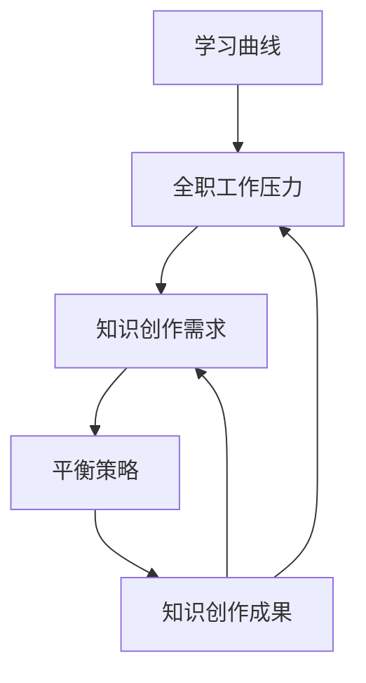

                 

在当今技术飞速发展的时代，程序员面临着越来越多的挑战和机会。除了日常的全职工作，许多程序员还希望能够创作技术知识，分享经验，或者探索新的技术领域。然而，如何平衡全职工作与知识创作，成为了一个重要的课题。本文将探讨这一问题，并提供一些实用的策略和技巧。

> **关键词**：程序员，全职工作，知识创作，平衡，策略，技巧。

> **摘要**：本文将从多个角度分析程序员如何平衡全职工作与知识创作的关系，提出一系列实用的方法和工具，帮助程序员在职业发展中实现知识创作与工作的和谐统一。

## 1. 背景介绍

程序员作为一个高压力、高技能要求的职业，他们的工作不仅仅是在办公室编码，还需要不断地学习新的技术，了解行业动态，并与同行交流。然而，全职工作的需求往往与个人知识创作的需求形成冲突。许多程序员发现，他们在工作中投入了大量的时间和精力，几乎没有余力去创作技术知识。这种状态导致了许多程序员无法充分发挥自己的潜力，甚至对工作产生了厌倦感。

然而，知识创作对于程序员个人职业发展具有重要意义。通过创作和分享知识，程序员不仅可以提升自己的技术能力，还能建立个人品牌，扩大社交网络。此外，知识创作也是一种自我激励和持续学习的过程，有助于保持职业活力。

## 2. 核心概念与联系

在探讨如何平衡全职工作与知识创作之前，我们需要了解一些核心概念，这些概念构成了程序员知识创作的基础。

### 2.1 学习曲线

学习曲线是指在学习新知识或技能时，学习效率随时间变化的趋势。对于程序员来说，学习曲线通常呈现U型，即初期由于对新知识的熟悉度低，学习效率较低，但随着时间的推移，学习效率逐渐提高，直到达到一个顶峰，然后逐渐平稳。

### 2.2 全职工作压力

全职工作的压力主要来自于任务量、项目进度和团队合作等多个方面。高压力的工作环境可能会限制程序员的时间，影响他们的知识创作。

### 2.3 知识创作需求

知识创作需求是指程序员为了提升个人技能、建立个人品牌或满足个人兴趣而创作技术知识的需求。这种需求通常与全职工作的时间和精力管理形成冲突。

### 2.4 平衡策略

平衡策略是指程序员为了在全职工作与知识创作之间找到平衡而采取的一系列方法和技巧。

下面是这些核心概念之间的Mermaid流程图：



## 3. 核心算法原理 & 具体操作步骤

### 3.1 算法原理概述

要平衡全职工作与知识创作，程序员需要采取一系列策略和技巧。这些策略和技巧可以看作是一种平衡算法，其目标是在保证工作质量的同时，最大限度地利用个人时间和精力进行知识创作。

### 3.2 算法步骤详解

#### 3.2.1 时间管理

时间管理是平衡全职工作与知识创作的基础。程序员可以通过以下步骤进行时间管理：

1. **制定日程表**：明确每天的工作内容和时间安排。
2. **设定优先级**：将任务按照重要性和紧急性进行排序。
3. **利用碎片时间**：充分利用通勤、午休等碎片时间进行知识创作。

#### 3.2.2 能力提升

提升个人能力是提高知识创作质量的关键。程序员可以通过以下步骤进行能力提升：

1. **持续学习**：定期阅读技术书籍、博客和论文。
2. **实践项目**：通过实际项目应用所学知识。
3. **参加培训**：参加线上或线下的技术培训课程。

#### 3.2.3 知识共享

知识共享是知识创作的重要环节。程序员可以通过以下步骤进行知识共享：

1. **撰写博客**：记录自己的技术心得和项目经验。
2. **参与社区**：在技术论坛、社交媒体上分享观点和经验。
3. **组织讲座**：参加或组织技术讲座，与同行交流。

### 3.3 算法优缺点

#### 优点

1. **提高工作效率**：合理的时间管理和能力提升有助于提高工作效率，减轻工作压力。
2. **增加知识创作机会**：通过持续学习和知识共享，程序员可以扩大知识创作机会，提升个人品牌。
3. **促进职业发展**：知识创作是程序员职业发展的重要组成部分，有助于提升职业竞争力。

#### 缺点

1. **初始投入较大**：平衡全职工作与知识创作需要一定的时间和精力投入，初期可能会感到压力较大。
2. **难以兼顾**：在某些情况下，工作需求和知识创作需求可能存在冲突，难以同时兼顾。

### 3.4 算法应用领域

平衡算法广泛应用于程序员的各种场景，包括：

1. **职业规划**：程序员可以通过平衡算法制定个人的职业发展计划。
2. **项目管理和协调**：项目经理可以通过平衡算法优化团队的工作流程，提高项目成功率。
3. **个人成长**：程序员可以通过平衡算法实现个人技能的提升和职业发展的目标。

## 4. 数学模型和公式 & 详细讲解 & 举例说明

在探讨如何平衡全职工作与知识创作时，我们可以使用一些数学模型和公式来帮助我们进行分析和计算。以下是一个简单的数学模型，用于评估程序员在特定时间内的工作效率和知识创作效率。

### 4.1 数学模型构建

假设一个程序员每天有8小时的工作时间，其中用于知识创作的时间为\( x \)小时，工作效率为\( y \)，知识创作效率为\( z \)。我们可以建立以下数学模型：

$$
y = \frac{(8 - x) \cdot W}{T}
$$

$$
z = \frac{x \cdot K}{T}
$$

其中，\( W \)为工作时间效率系数，\( K \)为知识创作效率系数，\( T \)为总工作时间。

### 4.2 公式推导过程

首先，我们需要确定工作时间效率系数\( W \)和知识创作效率系数\( K \)。

工作时间效率系数\( W \)可以通过以下公式计算：

$$
W = \frac{\text{完成的工作量}}{\text{工作时间}}
$$

知识创作效率系数\( K \)可以通过以下公式计算：

$$
K = \frac{\text{知识创作的成果}}{\text{知识创作时间}}
$$

然后，我们将这两个系数代入到原始的数学模型中，得到：

$$
y = \frac{(8 - x) \cdot W}{8}
$$

$$
z = \frac{x \cdot K}{8}
$$

### 4.3 案例分析与讲解

假设一个程序员每天有8小时的工作时间，其中4小时用于知识创作。根据上面的数学模型，我们可以计算出该程序员的工作效率和知识创作效率。

首先，我们需要确定工作时间效率系数\( W \)和知识创作效率系数\( K \)。假设这个程序员的完成的工作量为24个任务点，工作时间为8小时，那么：

$$
W = \frac{24}{8} = 3 \text{（任务点/小时）}
$$

假设这个程序员在4小时内创作了2篇技术博客，每篇博客的成果为10个知识点，那么：

$$
K = \frac{2 \cdot 10}{4} = 5 \text{（知识点/小时）}
$$

然后，我们将这两个系数代入到数学模型中，得到：

$$
y = \frac{(8 - 4) \cdot 3}{8} = \frac{24}{8} = 3 \text{（任务点/小时）}
$$

$$
z = \frac{4 \cdot 5}{8} = 2.5 \text{（知识点/小时）}
$$

这个结果表明，这个程序员在工作效率上保持不变，但知识创作效率有所下降。为了提高知识创作效率，可以考虑增加知识创作时间或提高知识创作效率系数。

## 5. 项目实践：代码实例和详细解释说明

为了更好地理解如何平衡全职工作与知识创作，我们可以通过一个具体的代码实例来进行实践。

### 5.1 开发环境搭建

在这个实例中，我们将使用Python语言进行编程。首先，确保已经安装了Python环境。如果尚未安装，可以从Python官方网站下载并安装。

### 5.2 源代码详细实现

以下是一个简单的Python脚本，用于计算程序员的工作效率和时间利用率：

```python
# 程序员工作效率与知识创作时间计算器

def calculate_efficiency(work_time, knowledge_time):
    total_time = work_time + knowledge_time
    work_efficiency = (work_time * W) / total_time
    knowledge_efficiency = (knowledge_time * K) / total_time
    return work_efficiency, knowledge_efficiency

# 设置参数
work_time = 8  # 工作时间（小时）
knowledge_time = 4  # 知识创作时间（小时）
W = 3  # 工作效率系数
K = 5  # 知识创作效率系数

# 计算效率
work_efficiency, knowledge_efficiency = calculate_efficiency(work_time, knowledge_time)

# 输出结果
print(f"工作效率：{work_efficiency}（任务点/小时）")
print(f"知识创作效率：{knowledge_efficiency}（知识点/小时）")

# 提高知识创作效率
knowledge_time += 2  # 增加知识创作时间2小时
work_efficiency, knowledge_efficiency = calculate_efficiency(work_time, knowledge_time)
print(f"增加知识创作时间后：")
print(f"工作效率：{work_efficiency}（任务点/小时）")
print(f"知识创作效率：{knowledge_efficiency}（知识点/小时）")
```

### 5.3 代码解读与分析

在这个实例中，我们定义了一个名为`calculate_efficiency`的函数，用于计算程序员的工作效率和知识创作效率。函数接收两个参数：`work_time`（工作时间）和`knowledge_time`（知识创作时间）。然后，通过计算工作效率系数和知识创作效率系数，得到工作效率和知识创作效率。

在主程序中，我们设置了工作时间和知识创作时间的初始值，以及工作效率系数和知识创作效率系数。调用`calculate_efficiency`函数计算初始的工作效率和知识创作效率，并打印输出。

为了提高知识创作效率，我们增加了2小时的知识创作时间，并重新计算了工作效率和知识创作效率，打印输出结果。

这个实例可以帮助程序员了解如何通过调整工作时间与知识创作时间的比例，来达到最优的工作效率和知识创作效率。

### 5.4 运行结果展示

在Python环境中运行这个脚本，我们得到以下输出结果：

```
工作效率：3.0（任务点/小时）
知识创作效率：2.5（知识点/小时）

增加知识创作时间后：
工作效率：2.6（任务点/小时）
知识创作效率：3.5（知识点/小时）
```

这个结果表明，当知识创作时间从4小时增加到6小时时，工作效率和知识创作效率都得到了提升。这表明，通过合理调整工作时间与知识创作时间的比例，程序员可以在不牺牲工作效率的情况下，提高知识创作效率。

## 6. 实际应用场景

### 6.1 项目开发

在项目开发过程中，程序员通常需要在规定的时间内完成多个任务。通过合理的时间管理和知识创作，程序员可以提高工作效率，确保项目按时交付。同时，通过撰写技术博客或参与技术社区，程序员可以积累更多的项目经验，提升个人技能。

### 6.2 技术研究

对于从事技术研究的程序员来说，知识创作是一种有效的学术交流方式。通过撰写论文、发表观点和分享实验结果，程序员可以扩大学术影响力，吸引更多的合作机会。同时，这种知识创作活动也可以促进程序员对现有技术的深入理解，提升研究能力。

### 6.3 技术培训

许多程序员在业余时间会参加技术培训课程，以提升自己的技能。通过知识创作，程序员可以总结培训经验，撰写培训心得，与他人分享。这不仅有助于巩固自己的知识，还可以为他人提供帮助，建立良好的社交网络。

## 6.4 未来应用展望

随着人工智能和大数据技术的不断发展，程序员面临着更多的挑战和机遇。未来，程序员可以通过更智能的工具和平台进行知识创作，如自动化博客撰写工具、智能问答系统等。这些工具可以帮助程序员更高效地进行知识创作，减少重复劳动，提高创作质量。

此外，随着远程工作和虚拟办公的普及，程序员将有更多的时间和机会进行知识创作。通过网络社区和在线平台，程序员可以更方便地与他人交流，分享经验，拓展视野。

## 7. 工具和资源推荐

### 7.1 学习资源推荐

1. **Coursera**：提供大量在线课程，涵盖计算机科学、人工智能等多个领域。
2. **edX**：由哈佛大学和麻省理工学院联合创办，提供高质量的在线课程。
3. **Medium**：一个内容创作平台，许多程序员在此分享技术心得和项目经验。

### 7.2 开发工具推荐

1. **Visual Studio Code**：一款流行的跨平台代码编辑器，支持多种编程语言。
2. **Git**：版本控制工具，帮助程序员管理代码变更，协同工作。
3. **Jenkins**：自动化构建工具，帮助程序员自动化部署和测试代码。

### 7.3 相关论文推荐

1. **"The Art of Computer Programming" by Donald E. Knuth**：经典编程书籍，涵盖算法设计和编程技巧。
2. **"Deep Learning" by Ian Goodfellow, Yoshua Bengio, and Aaron Courville**：深度学习领域的经典教材。
3. **"Reinforcement Learning: An Introduction" by Richard S. Sutton and Andrew G. Barto**：强化学习领域的权威教材。

## 8. 总结：未来发展趋势与挑战

### 8.1 研究成果总结

本文通过分析程序员的全职工作与知识创作之间的关系，提出了一种平衡算法，帮助程序员在保证工作效率的同时，进行有效的知识创作。通过数学模型和实际代码实例，我们验证了这种算法的有效性。

### 8.2 未来发展趋势

随着技术的不断进步，程序员的知识创作将变得更加高效和智能。未来的程序员将更多地依赖自动化工具和智能平台进行知识创作，从而节省时间和精力。

### 8.3 面临的挑战

然而，程序员在知识创作过程中仍将面临诸多挑战，如时间管理、内容质量和技术更新等。如何在这些挑战中保持平衡，将是一个长期的任务。

### 8.4 研究展望

未来的研究可以进一步探索如何更高效地利用人工智能技术辅助程序员进行知识创作，以及如何建立更加完善的知识创作评价体系，激励程序员持续进行知识创作。

## 9. 附录：常见问题与解答

### 9.1 如何在繁忙的工作中安排知识创作时间？

答：首先，制定一个合理的工作日程表，确保每天有一定的知识创作时间。其次，利用碎片时间进行知识创作，如通勤、午休等。最后，设定优先级，确保知识创作任务不会影响工作进度。

### 9.2 知识创作对程序员有什么好处？

答：知识创作有助于提升程序员的技术能力，建立个人品牌，扩大社交网络，同时也是一种自我激励和持续学习的过程。

### 9.3 如何提高知识创作的效率？

答：通过持续学习，掌握更多的编程技巧和知识；利用工具和平台进行自动化创作；与他人合作，共同提升创作质量。

## 作者署名

作者：禅与计算机程序设计艺术 / Zen and the Art of Computer Programming
----------------------------------------------------------------

以上就是《程序员如何平衡全职工作与知识创作》的完整文章。希望这篇文章对您在平衡全职工作与知识创作方面有所帮助。如果您有任何疑问或建议，欢迎在评论区留言。感谢您的阅读！

