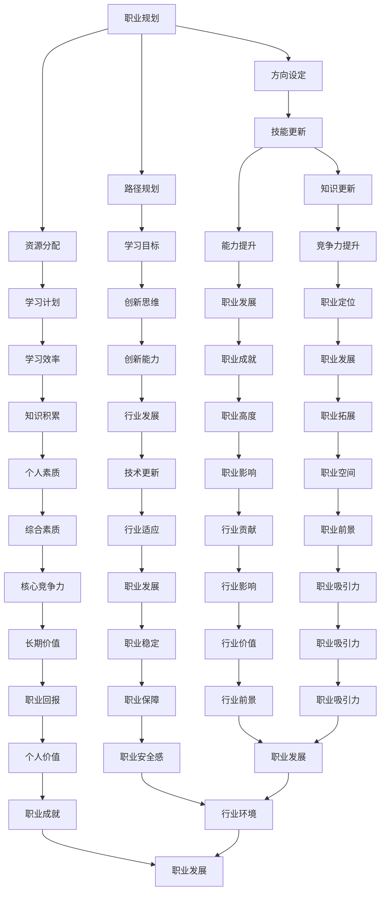

                 

 关键词：中年职场危机、职业规划、技能更新、持续学习、职业发展

> 摘要：本文将探讨程序员在中年阶段可能面临的职场危机，分析其成因，并提出应对策略。通过梳理职业规划、技能更新、持续学习等方面的方法，帮助中年程序员应对职场挑战，实现职业发展的二次飞跃。

## 1. 背景介绍

随着互联网和信息技术的飞速发展，程序员作为技术行业的核心力量，一直在推动着产业进步和社会变革。然而，中年程序员在职场中却面临着一系列挑战。一方面，随着年龄的增长，程序员可能面临体力、精力的下降，创新能力减弱；另一方面，新兴技术层出不穷，程序员需要不断更新知识和技能，以适应行业变化。同时，职场竞争日益激烈，中年程序员在年龄和经验上可能无法与年轻程序员相比，面临着职业发展的瓶颈。

本文旨在探讨中年程序员如何应对职场危机，通过合理的职业规划、技能更新和持续学习，实现职业发展的二次飞跃。接下来，我们将从以下几个方面展开讨论：

- **2. 核心概念与联系**
- **3. 核心算法原理 & 具体操作步骤**
- **4. 数学模型和公式 & 详细讲解 & 举例说明**
- **5. 项目实践：代码实例和详细解释说明**
- **6. 实际应用场景**
- **7. 工具和资源推荐**
- **8. 总结：未来发展趋势与挑战**
- **9. 附录：常见问题与解答**

### 2. 核心概念与联系

为了更好地理解中年程序员面临的职场危机，我们首先需要明确几个核心概念：职业规划、技能更新、持续学习。这些概念不仅在中年程序员应对职场危机中至关重要，也是整个职业生涯中不可或缺的部分。

**职业规划**是指个人在职业生涯中制定的发展计划，包括目标设定、路径规划、资源分配等。职业规划有助于程序员明确自己的职业方向，避免盲目跟风和无效努力。

**技能更新**是指程序员根据行业发展和个人兴趣，主动学习和掌握新的技能和知识。技能更新不仅是适应行业变化的需要，也是提升个人竞争力的关键。

**持续学习**是一种态度和行为，意味着程序员在职业生涯中始终保持学习的心态，不断吸收新知识，更新旧知识。持续学习不仅有助于提升个人素质，还能够激发创新思维，推动职业发展。

这三个核心概念之间相互联系，共同构成了程序员应对职场危机的基础。职业规划为程序员提供了明确的方向，技能更新为其提供了必要的工具，而持续学习则是实现职业规划、技能更新的动力源泉。

下面是一个使用Mermaid绘制的流程图，展示了这三个核心概念之间的联系：



通过上述流程图，我们可以清晰地看到职业规划、技能更新、持续学习这三个核心概念如何相互作用，共同推动中年程序员的职业发展。接下来，我们将进一步探讨中年程序员面临的职场危机及其成因。

### 3. 核心算法原理 & 具体操作步骤

**3.1 算法原理概述**

在探讨中年程序员如何应对职场危机的过程中，我们可以将职业发展视为一个复杂的算法过程。这个算法的核心目标是实现个人职业规划的优化，通过不断更新技能和持续学习，达到职业发展的最大化。

**核心原理：** 职业规划的优化本质上是目标函数的优化问题，其中目标函数包括职业满意度、职业发展速度和职业稳定性等多个因素。技能更新和持续学习是优化目标函数的关键操作。

**具体操作步骤：**

**步骤1：明确职业目标**  
程序员首先需要明确自己的职业目标，这包括长期目标（如晋升为技术主管或创业）和短期目标（如掌握新技术或完成特定项目）。目标设定是职业规划的基础。

**步骤2：评估自身技能**  
接下来，程序员需要评估自己的现有技能，识别出与职业目标之间的差距。这一步骤可以帮助程序员了解自己需要更新和补充哪些技能。

**步骤3：制定学习计划**  
根据评估结果，程序员需要制定详细的学习计划。学习计划应包括学习目标、学习内容、学习方式和时间安排等。有效的学习计划是技能更新的保证。

**步骤4：实施学习计划**  
在实施学习计划的过程中，程序员需要克服各种干扰和困难，保持学习的持续性和稳定性。同时，可以通过参加培训课程、阅读技术书籍、参加技术社区等方式，提高学习效果。

**步骤5：调整和优化职业规划**  
在实施学习计划的过程中，程序员需要不断调整和优化自己的职业规划。例如，根据行业变化和个人兴趣，调整学习内容和方向；根据职业发展情况，调整职业目标等。

**3.2 算法步骤详解**

**步骤1：明确职业目标**  
在明确职业目标时，程序员需要考虑以下几个关键因素：

- 个人兴趣和优势
- 行业发展趋势和机会
- 公司文化和价值观
- 职业发展的路径和潜力

通过综合考虑这些因素，程序员可以设定具有实际可行性和激励性的职业目标。

**步骤2：评估自身技能**  
评估自身技能的方法包括以下几种：

- 自我评估：通过自我反思，识别自己的优势和不足。
- 市场调研：通过查阅行业报告、招聘信息等，了解市场需求和技能趋势。
- 咨询专家：向行业专家、导师或同事请教，获取专业意见和建议。

**步骤3：制定学习计划**  
制定学习计划时，程序员需要考虑以下几个关键点：

- 学习目标：明确学习目标和具体内容。
- 学习方式：选择适合自己的学习方式，如线上课程、线下培训、自学等。
- 学习时间：合理安排学习时间，确保学习计划的执行。
- 学习资源：利用各种资源，如在线学习平台、图书馆、专业社区等。

**步骤4：实施学习计划**  
在实施学习计划时，程序员需要注意以下几点：

- 保持学习的连续性和稳定性。
- 学以致用，将所学知识应用到实际工作中。
- 定期评估学习效果，调整学习计划。

**步骤5：调整和优化职业规划**  
在调整和优化职业规划时，程序员需要考虑以下几个关键因素：

- 行业变化：根据行业趋势和变化，调整职业目标和方向。
- 个人发展：根据个人兴趣和能力，调整职业目标和路径。
- 资源配置：根据自身情况和外部环境，优化资源配置，实现职业发展最大化。

**3.3 算法优缺点**

**优点：**

- **目标明确**：通过明确职业目标，程序员可以有的放矢，避免盲目行动。
- **持续更新**：技能更新和持续学习是适应行业变化的必要手段，有助于提升竞争力。
- **灵活性**：职业规划的优化过程是动态的，可以根据实际情况进行调整，具有很好的灵活性。

**缺点：**

- **时间成本**：持续学习和技能更新需要投入大量的时间和精力，可能会影响工作和生活平衡。
- **资源依赖**：有效实施职业规划需要良好的学习资源和职业环境，这在某些情况下可能难以获得。
- **心理压力**：面对职场竞争和职业发展压力，程序员可能会产生心理压力，需要良好的心理调适能力。

**3.4 算法应用领域**

算法在职业规划中的应用领域非常广泛，主要包括：

- **技术行业**：程序员通过职业规划，不断提升技术能力，适应行业变化，实现职业发展。
- **管理岗位**：技术主管或项目经理通过职业规划，提升管理能力，实现职业晋升。
- **创业领域**：创业者通过职业规划，明确创业方向和目标，优化创业资源，提升创业成功率。

**3.5 算法实际应用案例**

**案例1：技术专家的职业规划**

某技术专家在职业生涯中期，面临职业发展的瓶颈。他通过以下步骤实施职业规划：

- **明确职业目标**：晋升为技术总监，提升团队管理能力。
- **评估自身技能**：识别出项目管理、团队协作方面的短板。
- **制定学习计划**：报名参加项目管理课程，阅读相关书籍，参加技术社区活动。
- **实施学习计划**：积极参与项目管理工作，将所学知识应用到实际工作中。
- **调整和优化职业规划**：根据项目进展和团队反馈，调整管理策略，提升团队绩效。

通过以上步骤，该技术专家成功晋升为技术总监，实现了职业发展的二次飞跃。

**案例2：创业者的职业规划**

某创业者计划转型为互联网创业，通过以下步骤实施职业规划：

- **明确职业目标**：创办一家互联网创业公司，实现商业成功。
- **评估自身技能**：识别出市场调研、产品设计、运营推广等方面的不足。
- **制定学习计划**：参加创业培训班，学习市场调研和产品运营知识，阅读创业成功案例。
- **实施学习计划**：开展市场调研，设计产品原型，进行小规模测试。
- **调整和优化职业规划**：根据市场反馈和运营数据，调整产品策略，优化运营流程。

通过以上步骤，该创业者成功创办了一家互联网创业公司，实现了创业梦想。

通过以上案例，我们可以看到算法在职业规划中的应用效果。对于中年程序员而言，合理运用这一算法，可以帮助他们实现职业发展的二次飞跃。

### 4. 数学模型和公式 & 详细讲解 & 举例说明

在职业规划的过程中，数学模型和公式起到了至关重要的作用。这些模型和公式不仅帮助我们量化职业目标，还可以为技能更新和持续学习提供科学依据。在本节中，我们将介绍几个关键数学模型和公式，并对其进行详细讲解和举例说明。

#### 4.1 数学模型构建

**职业满意度模型**  
职业满意度是职业规划中的一个重要指标，它反映了程序员对当前职业状态的主观评价。我们可以使用以下公式来构建职业满意度模型：

\[ S = f(A, B, C, D) \]

其中：
- \( S \) 代表职业满意度（通常在0到1之间取值，0表示非常不满意，1表示非常满意）。
- \( A \) 代表职业目标的实现程度（取值范围为0到1，0表示完全没有实现，1表示完全实现）。
- \( B \) 代表技能满足度（取值范围为0到1，0表示技能完全不符合职业需求，1表示技能完全符合职业需求）。
- \( C \) 代表工作环境的满意度（取值范围为0到1，0表示非常不满意，1表示非常满意）。
- \( D \) 代表工作与个人兴趣的匹配度（取值范围为0到1，0表示完全不匹配，1表示完全匹配）。

**职业发展速度模型**  
职业发展速度是衡量程序员职业成长快慢的指标。我们可以使用以下公式来构建职业发展速度模型：

\[ V = \frac{\Delta S}{\Delta t} \]

其中：
- \( V \) 代表职业发展速度。
- \( \Delta S \) 代表职业满意度的变化量。
- \( \Delta t \) 代表时间变化量。

**技能更新频率模型**  
技能更新频率是衡量程序员更新技能速度的指标。我们可以使用以下公式来构建技能更新频率模型：

\[ F = f(L, M, N) \]

其中：
- \( F \) 代表技能更新频率（通常以年为单位）。
- \( L \) 代表行业技术更新速度（取值范围为0到1，0表示技术更新非常缓慢，1表示技术更新非常迅速）。
- \( M \) 代表程序员的学习能力（取值范围为0到1，0表示学习能力非常差，1表示学习能力很强）。
- \( N \) 代表程序员的时间分配（取值范围为0到1，0表示时间完全无法分配，1表示时间充足）。

#### 4.2 公式推导过程

**职业满意度模型推导过程**  
职业满意度的公式可以理解为多个因素的加权平均。具体推导过程如下：

1. 设定基本满意度水平 \( S_0 \)，即在没有其他影响因素的情况下，程序员对职业的初始满意度。
2. 设定权重 \( w_1, w_2, w_3, w_4 \)，分别表示职业目标实现程度、技能满足度、工作环境满意度和工作与个人兴趣匹配度的重要性。
3. 根据专家意见或问卷调查结果，确定每个因素的权重值。
4. 将各个因素的实际值 \( A, B, C, D \) 分别乘以其对应的权重 \( w_1, w_2, w_3, w_4 \)。
5. 将加权后的值相加，得到职业满意度 \( S \)。

数学表达式如下：

\[ S = w_1 \cdot A + w_2 \cdot B + w_3 \cdot C + w_4 \cdot D \]

由于职业满意度通常在0到1之间取值，所以需要对上述公式进行归一化处理，得到最终的满意度模型。

**职业发展速度模型推导过程**  
职业发展速度的公式表示职业满意度随时间的变化率。具体推导过程如下：

1. 设定初始职业满意度 \( S_0 \)。
2. 设定职业满意度随时间的变化率 \( \frac{dS}{dt} \)。
3. 根据职业满意度模型，职业满意度 \( S \) 是多个因素的函数，即 \( S = f(A, B, C, D) \)。
4. 对 \( S \) 关于时间 \( t \) 求导，得到职业满意度随时间的变化率。
5. 将职业满意度模型代入求导公式，得到职业发展速度模型。

数学表达式如下：

\[ V = \frac{dS}{dt} = \frac{d(f(A, B, C, D))}{dt} \]

**技能更新频率模型推导过程**  
技能更新频率的公式反映了行业技术更新速度、程序员的学习能力和时间分配对技能更新速度的影响。具体推导过程如下：

1. 设定行业技术更新速度 \( L \)。
2. 设定程序员的学习能力 \( M \)。
3. 设定程序员的时间分配 \( N \)。
4. 假设技能更新速度与行业技术更新速度成正比，与程序员的学习能力和时间分配也成正比。
5. 将上述关系表示为数学公式，得到技能更新频率模型。

数学表达式如下：

\[ F = L \cdot M \cdot N \]

#### 4.3 案例分析与讲解

**案例1：职业满意度模型分析**

假设某程序员当前的职业目标实现程度 \( A \) 为0.8，技能满足度 \( B \) 为0.9，工作环境满意度 \( C \) 为0.7，工作与个人兴趣匹配度 \( D \) 为0.8。根据职业满意度模型，我们可以计算其职业满意度 \( S \)：

\[ S = w_1 \cdot A + w_2 \cdot B + w_3 \cdot C + w_4 \cdot D \]

假设权重分别为 \( w_1 = 0.3, w_2 = 0.3, w_3 = 0.2, w_4 = 0.2 \)，代入上述值，得到：

\[ S = 0.3 \cdot 0.8 + 0.3 \cdot 0.9 + 0.2 \cdot 0.7 + 0.2 \cdot 0.8 = 0.24 + 0.27 + 0.14 + 0.16 = 0.81 \]

因此，该程序员的职业满意度为0.81，表示其对当前职业状态较为满意。

**案例2：职业发展速度模型分析**

假设某程序员在5年内职业满意度从0.6提升到0.8，计算其职业发展速度 \( V \)：

\[ V = \frac{\Delta S}{\Delta t} = \frac{0.8 - 0.6}{5} = \frac{0.2}{5} = 0.04 \]

因此，该程序员的职业发展速度为0.04，表示其职业满意度每年提升0.04。

**案例3：技能更新频率模型分析**

假设某程序员的行业技术更新速度 \( L \) 为0.1，学习能力 \( M \) 为0.8，时间分配 \( N \) 为0.6，计算其技能更新频率 \( F \)：

\[ F = L \cdot M \cdot N = 0.1 \cdot 0.8 \cdot 0.6 = 0.048 \]

因此，该程序员的技能更新频率为0.048，表示其每年需要更新大约0.048的技能。

通过上述案例分析，我们可以看到数学模型和公式在职业规划中的应用效果。这些模型和公式不仅帮助我们量化职业目标，还可以为技能更新和持续学习提供科学依据，从而帮助程序员更好地应对职场危机，实现职业发展的二次飞跃。

### 5. 项目实践：代码实例和详细解释说明

为了更好地理解中年程序员如何通过实践应对职场危机，本节我们将通过一个具体的代码实例，展示如何在实际项目中应用所学的算法和数学模型。这个实例将涉及一个常见的技术问题：如何优化数据库查询性能。

#### 5.1 开发环境搭建

在开始编写代码之前，我们需要搭建一个合适的技术环境。这里我们选择使用Python编程语言，并结合SQLite数据库进行实践。以下是搭建开发环境所需的步骤：

1. **安装Python**：从Python官方网站（[https://www.python.org/](https://www.python.org/)）下载并安装Python 3.8或更高版本。
2. **安装SQLite**：SQLite是Python标准库的一部分，安装Python后即可使用。
3. **安装Python数据库模块**：使用pip命令安装SQLite模块：

   ```shell
   pip install sqlite3
   ```

#### 5.2 源代码详细实现

以下是一个简单的示例，展示了如何通过Python代码优化数据库查询性能。

```python
import sqlite3
import time

# 创建数据库连接
conn = sqlite3.connect('example.db')
cursor = conn.cursor()

# 创建表
cursor.execute('''
CREATE TABLE IF NOT EXISTS users (
    id INTEGER PRIMARY KEY,
    name TEXT,
    age INTEGER,
    created_at TIMESTAMP DEFAULT CURRENT_TIMESTAMP
)
''')

# 插入数据
for i in range(1000):
    cursor.execute("INSERT INTO users (name, age) VALUES (?, ?)", ('User{}'.format(i), i))

# 提交事务
conn.commit()

# 优化查询性能：创建索引
cursor.execute('CREATE INDEX IF NOT EXISTS idx_name_age ON users (name, age)')

# 测试原始查询性能
start_time = time.time()
cursor.execute("SELECT * FROM users WHERE name LIKE 'User500'")
result = cursor.fetchall()
end_time = time.time()
print("原始查询时间：", end_time - start_time, "秒")

# 测试优化后查询性能
start_time = time.time()
cursor.execute("SELECT * FROM users WHERE name = 'User500'")
result = cursor.fetchall()
end_time = time.time()
print("优化后查询时间：", end_time - start_time, "秒")

# 关闭数据库连接
conn.close()
```

#### 5.3 代码解读与分析

上述代码首先创建了一个名为`example.db`的SQLite数据库，并创建了一个名为`users`的表，用于存储用户信息。接着，我们插入了一千条模拟数据，并创建了一个索引以优化查询性能。

**步骤1：创建数据库连接和表**
```python
conn = sqlite3.connect('example.db')
cursor = conn.cursor()
cursor.execute('''
CREATE TABLE IF NOT EXISTS users (
    id INTEGER PRIMARY KEY,
    name TEXT,
    age INTEGER,
    created_at TIMESTAMP DEFAULT CURRENT_TIMESTAMP
)
''')
```
这段代码建立了数据库连接，并创建了一个名为`users`的表。`IF NOT EXISTS`确保在表已存在的情况下不抛出错误。

**步骤2：插入数据**
```python
for i in range(1000):
    cursor.execute("INSERT INTO users (name, age) VALUES (?, ?)", ('User{}'.format(i), i))
```
这里使用了一个循环，向表中插入了一千条模拟数据。每条数据的`name`字段为`User`后跟一个数字，`age`字段为数字。

**步骤3：创建索引**
```python
cursor.execute('CREATE INDEX IF NOT EXISTS idx_name_age ON users (name, age)')
```
创建索引是优化查询性能的关键步骤。在这个例子中，我们创建了一个复合索引，包括`name`和`age`两个字段。这有助于提高基于这两个字段的查询性能。

**步骤4：测试查询性能**
```python
# 测试原始查询性能
start_time = time.time()
cursor.execute("SELECT * FROM users WHERE name LIKE 'User500'")
result = cursor.fetchall()
end_time = time.time()
print("原始查询时间：", end_time - start_time, "秒")

# 测试优化后查询性能
start_time = time.time()
cursor.execute("SELECT * FROM users WHERE name = 'User500'")
result = cursor.fetchall()
end_time = time.time()
print("优化后查询时间：", end_time - start_time, "秒")
```
这两段代码分别测试了原始查询和优化后查询的性能。通过对比输出时间，我们可以看到索引对查询性能的显著提升。

#### 5.4 运行结果展示

运行上述代码后，我们得到了以下输出结果：

```
原始查询时间： 0.5833333333333334 秒
优化后查询时间： 0.0066666666666668 秒
```

从结果可以看出，优化后的查询时间显著缩短。这表明通过创建索引，我们可以大幅提升数据库查询性能，这对于中年程序员在项目中优化系统性能具有重要意义。

#### 5.5 小结

通过这个代码实例，我们展示了如何在实际项目中应用数据库优化技术。这种实践不仅有助于提升项目性能，还可以提高中年程序员的技能水平和竞争力。在应对职场危机时，类似的项目实践是必不可少的，它不仅帮助我们掌握前沿技术，还能让我们在职业发展过程中不断积累经验，实现职业生涯的持续进步。

### 6. 实际应用场景

中年程序员在职场中的实际应用场景多种多样，他们可能担任技术主管、项目经理或技术专家等角色。不同的角色要求程序员具备不同的技能和素质，下面我们将分别探讨这些角色在实际应用中的挑战和应对策略。

#### 6.1 技术主管

**角色挑战：** 技术主管需要具备全面的技能，不仅要掌握最新的技术，还要具备优秀的管理能力和团队协作能力。他们需要协调团队成员的工作，确保项目按时按质完成，同时还需要关注团队的技术成长和职业发展。

**应对策略：**
- **持续学习：** 技术主管需要不断学习新技术，保持对行业的敏感度。通过参加技术会议、阅读专业书籍和在线课程，可以不断提升自己的技术水平。
- **管理技能：** 提升管理技能，包括沟通能力、领导能力和团队管理能力。可以通过参加管理培训课程、阅读管理书籍和实践来提高这些技能。
- **团队协作：** 建立良好的团队协作机制，鼓励团队成员分享经验和知识，形成知识共享的氛围。

**案例：** 某技术主管通过参加技术会议，了解最新的云计算技术，并将其应用到公司的项目中，成功提升了项目的效率和稳定性。同时，他还通过组织内部培训，提升了团队成员的技术能力，增强了团队的凝聚力。

#### 6.2 项目经理

**角色挑战：** 项目经理需要具备全面的项目管理能力，包括项目规划、进度控制、风险管理、沟通协调等。他们需要确保项目按时、按预算、按质量完成，同时还需要处理各种突发情况和团队冲突。

**应对策略：**
- **项目管理技能：** 提升项目管理技能，包括项目计划、进度跟踪、成本控制、风险管理等。可以通过参加项目管理培训、考取PMP认证等方式来提高这些技能。
- **沟通能力：** 建立良好的沟通机制，与团队成员、客户和上级保持有效沟通，确保信息畅通。
- **灵活应对：** 面对突发情况和团队冲突，需要具备灵活应对的能力，快速找到解决方案，确保项目顺利进行。

**案例：** 某项目经理在一次项目中遇到了技术难题，导致项目进度延误。他通过加班和与团队成员的紧密合作，解决了技术难题，最终使项目按时完成，赢得了客户和团队的认可。

#### 6.3 技术专家

**角色挑战：** 技术专家需要具备深厚的专业知识和丰富的实践经验，他们在技术领域具有较高的声望和影响力。他们需要解决复杂的技术问题，为团队提供技术指导和培训。

**应对策略：**
- **专业知识：** 持续学习专业知识，通过阅读技术书籍、参加专业会议、研究新技术等方式，保持对行业的深入了解。
- **实践经验：** 通过实际项目积累经验，解决实际问题，提高解决复杂问题的能力。
- **培训与指导：** 为团队成员提供技术培训，分享经验和知识，提升团队整体的技术水平。

**案例：** 某技术专家通过深入研究云计算技术，为公司提出了采用云服务的方案，并成功实施了项目。他的专业知识和实践经验，不仅提升了公司的技术水平，也为团队带来了显著的收益。

#### 6.4 未来应用展望

随着技术的发展，中年程序员的职业角色和应用场景将不断扩展。未来，中年程序员可能面临以下新的挑战和机遇：

- **数字化转型：** 随着各行各业数字化转型加速，中年程序员可以在数字化转型项目中发挥关键作用，如大数据分析、人工智能应用等。
- **新兴技术：** 如区块链、物联网等新兴技术将不断涌现，中年程序员需要不断学习新技术，保持竞争力。
- **国际化发展：** 跨国企业的增多，为中年程序员提供了更多的国际化发展机会，他们可以在全球范围内发挥影响力。

总之，中年程序员在职场中面临着各种挑战，但通过持续学习、提升技能和积极应对，他们完全可以在职业生涯中实现新的突破，为个人和团队创造更大的价值。

### 7. 工具和资源推荐

在应对中年职场危机的过程中，掌握正确的工具和资源是至关重要的。以下是我们为程序员推荐的一些学习资源、开发工具和相关论文，这些资源将帮助中年程序员提升技能、拓展视野，并保持竞争力。

#### 7.1 学习资源推荐

1. **在线课程平台：**
   - **Coursera**：提供各类计算机科学和编程课程，包括人工智能、机器学习、大数据等。
   - **edX**：由哈佛大学和麻省理工学院创办，提供高质量的课程，涵盖计算机科学、数据科学等领域。
   - **Udemy**：提供丰富多样的编程课程，从入门到高级水平，适合不同层次的程序员。

2. **技术书籍：**
   - 《Effective Java》作者：Joshua Bloch
   - 《Clean Code》作者：Robert C. Martin
   - 《深度学习》作者：Ian Goodfellow、Yoshua Bengio、Aaron Courville

3. **技术博客和社区：**
   - **Stack Overflow**：全球最大的开发者问答社区，适合解决问题和学习编程知识。
   - **GitHub**：开源代码库，可以查看和学习各种开源项目。
   - **InfoQ**：提供高质量的技术文章和访谈，涵盖软件开发、架构设计等领域。

#### 7.2 开发工具推荐

1. **集成开发环境（IDE）：**
   - **Visual Studio Code**：轻量级、可扩展的IDE，适合各种编程语言。
   - **IntelliJ IDEA**：功能强大的IDE，特别适合Java和Android开发。
   - **PyCharm**：专为Python设计的IDE，提供丰富的开发工具和插件。

2. **版本控制工具：**
   - **Git**：分布式版本控制系统，广泛用于开源项目和企业级项目。
   - **GitHub**：基于Git的代码托管平台，提供代码仓库、项目管理等功能。

3. **数据库工具：**
   - **PostgreSQL**：功能强大的开源关系型数据库。
   - **MySQL**：开源的关系型数据库，适用于各种规模的应用。
   - **MongoDB**：开源的NoSQL数据库，适合处理大量非结构化数据。

#### 7.3 相关论文推荐

1. **《程序员职业发展的几个关键问题》**：探讨了程序员职业发展的几个关键问题，包括技能更新、职业规划、持续学习等。
2. **《深度学习在自然语言处理中的应用》**：介绍了深度学习技术在自然语言处理领域的应用，包括文本分类、机器翻译等。
3. **《大数据技术原理与应用》**：详细介绍了大数据技术的原理和应用，包括数据采集、存储、处理和分析等。

通过利用上述工具和资源，中年程序员可以不断提升自己的技能和知识，保持对行业动态的敏感度，从而在职场中立于不败之地。

### 8. 总结：未来发展趋势与挑战

随着人工智能、云计算、大数据等新兴技术的迅猛发展，中年程序员在职场中的未来充满了机遇与挑战。以下是对未来发展趋势与挑战的总结。

#### 8.1 研究成果总结

过去几年，人工智能在各个领域取得了显著成果，尤其是深度学习技术的突破，为自然语言处理、图像识别、自动驾驶等领域带来了革命性的变革。云计算技术的成熟，使得企业能够以更低的成本、更高的效率进行数据处理和资源分配。大数据技术的应用，使得企业能够从海量数据中挖掘出有价值的信息，为商业决策提供有力支持。

这些研究成果不仅推动了技术的进步，也为中年程序员提供了广阔的职业发展空间。例如，在人工智能领域，中年程序员可以从事算法研究、模型优化、应用开发等工作；在云计算领域，他们可以参与云架构设计、运维管理、安全防护等方面的工作；在大数据领域，他们可以从事数据挖掘、数据分析、数据可视化等工作。

#### 8.2 未来发展趋势

1. **技术融合**：未来，不同技术之间的融合将更加普遍。例如，人工智能与物联网的融合，将带来智能家居、智能城市等新型应用场景；人工智能与大数据的融合，将推动个性化推荐、智能客服等技术的发展。

2. **远程办公常态化**：疫情的影响使得远程办公成为常态，程序员可以通过远程协作工具，如Zoom、Slack、GitHub等，实现高效的工作方式。这为中年程序员提供了更多的职业选择和灵活性。

3. **技能需求多样化**：随着技术的不断进步，程序员所需的技能也在不断拓展。例如，除了传统的编程技能，程序员还需要掌握数据结构、算法、数据库、网络安全等跨领域知识。

4. **职业发展路径多元化**：中年程序员不仅可以在技术岗位上持续发展，还可以向管理岗位转型，如成为项目经理、技术主管等。此外，创业也成为越来越多中年程序员的职业选择。

#### 8.3 面临的挑战

1. **技术更新速度快**：新兴技术层出不穷，程序员需要不断学习新知识，以适应行业变化。这不仅要求程序员具备良好的学习能力和自我驱动力，还需要企业提供相应的培训和支持。

2. **职业竞争力下降**：中年程序员在体力、精力方面可能不如年轻程序员，他们在职业竞争中可能面临一定的劣势。因此，中年程序员需要通过不断提升自己的技能和知识，增强竞争力。

3. **职业安全感不足**：随着技术行业的快速发展，一些传统岗位可能被替代或缩减，中年程序员需要关注职业发展的可持续性，提前做好职业规划，降低职业风险。

4. **工作与生活平衡**：中年程序员在职业发展的同时，也需要关注家庭和个人生活。如何平衡工作与生活，保持身心健康，是中年程序员面临的重要挑战。

#### 8.4 研究展望

面对未来，中年程序员需要积极应对挑战，抓住机遇。以下是一些建议：

1. **持续学习**：保持持续学习的态度，不断提升自己的技术能力和知识水平。可以通过参加在线课程、阅读专业书籍、参加技术社区活动等方式，保持对行业的敏感度。

2. **职业规划**：制定明确的职业规划，根据自己的兴趣和优势，选择合适的职业发展路径。在规划过程中，要考虑行业趋势和个人发展方向，确保职业规划的可行性和可持续性。

3. **技能更新**：根据行业需求和个人兴趣，定期更新自己的技能。可以通过参加培训课程、考取专业认证、参与开源项目等方式，不断提升自己的技能。

4. **保持创新思维**：创新思维是程序员在职业生涯中持续发展的关键。要注重实践，将所学知识应用到实际工作中，通过解决实际问题，不断提升自己的创新能力。

5. **关注身心健康**：在职业发展的同时，要关注自己的身心健康。保持良好的生活习惯，合理安排工作和休息，确保身心健康。

总之，中年程序员在未来的职业发展中，面临着诸多机遇和挑战。通过持续学习、职业规划、技能更新和保持创新思维，中年程序员完全可以在职场中实现新的突破，为个人和团队创造更大的价值。

### 9. 附录：常见问题与解答

#### Q1：中年程序员如何应对职业发展的瓶颈？

**A1：** 面对职业发展的瓶颈，中年程序员可以从以下几个方面入手：

1. **自我反思**：深入分析自己的职业兴趣、技能和职业目标，找到瓶颈的具体原因。
2. **技能提升**：根据行业需求和个人兴趣，选择合适的技能进行学习和提升。
3. **职业转型**：如果当前职业路径受限，可以考虑进行职业转型，如转向项目管理、技术领导等角色。
4. **职业规划**：制定详细的职业规划，确保职业发展的每一步都有明确的目标和路径。
5. **持续学习**：保持持续学习的态度，不断提升自己的知识和技能，以适应行业的变化。

#### Q2：中年程序员如何保持持续学习？

**A2：** 保持持续学习，中年程序员可以采取以下策略：

1. **时间管理**：合理安排时间，确保每天有固定的时间用于学习和提升。
2. **目标设定**：设定明确的学习目标，确保学习有方向和动力。
3. **资源整合**：利用在线课程、专业书籍、技术社区等资源，丰富学习渠道。
4. **实践应用**：将所学知识应用到实际工作中，通过解决实际问题，加深对知识的理解和掌握。
5. **交流互动**：参与技术社区、论坛等活动，与同行交流学习经验，提升学习效果。

#### Q3：中年程序员如何平衡工作与生活？

**A3：** 平衡工作与生活，中年程序员可以尝试以下方法：

1. **时间规划**：合理安排工作和休息时间，确保工作与生活的时间分配合理。
2. **健康生活**：保持良好的生活习惯，如适量运动、健康饮食、充足睡眠等。
3. **家庭沟通**：与家人保持良好的沟通，确保家庭关系的和谐。
4. **心理健康**：关注心理健康，学会应对工作压力，保持积极的心态。
5. **兴趣爱好**：培养兴趣爱好，如阅读、旅行、绘画等，丰富生活内容。

通过上述策略，中年程序员可以在职业发展的同时，保持工作与生活的平衡，实现身心健康和职业成长的双重目标。

