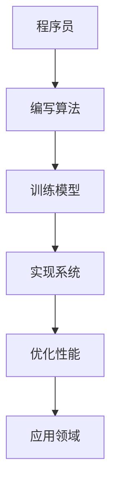

                 

关键词：人工智能，程序员，挑战，应对，技术发展

> 摘要：随着人工智能技术的迅猛发展，程序员面临着前所未有的机遇和挑战。本文旨在探讨程序员如何积极应对人工智能带来的变化，提高自身的竞争力，并探讨未来的发展趋势和面临的挑战。

## 1. 背景介绍

### 人工智能的崛起

近年来，人工智能（AI）技术取得了显著的进展。从深度学习、自然语言处理到计算机视觉，AI 在各个领域都展现出了强大的能力。随着计算能力的提升和大数据的广泛应用，人工智能已经成为推动科技进步和社会发展的重要力量。

### 程序员的角色转变

人工智能的快速发展，使得程序员的工作环境发生了巨大的变化。一方面，程序员需要掌握更多的 AI 知识和技能，以应对日益复杂的算法和系统；另一方面，他们也需要适应新的工作方式，与 AI 系统协同工作，提高工作效率。

### 挑战与机遇并存

面对人工智能的崛起，程序员既面临着挑战，也迎来了机遇。如何应对这些挑战，充分利用人工智能的优势，成为每一个程序员都需要思考的问题。

## 2. 核心概念与联系

### 人工智能的基本概念

人工智能是指使计算机系统具备人类智能特性的技术。它包括机器学习、深度学习、自然语言处理、计算机视觉等多个分支。了解这些基本概念，是程序员应对人工智能挑战的前提。

### 人工智能与程序员的联系

人工智能的发展离不开程序员的努力。程序员需要编写和优化算法，构建和训练模型，实现系统的自动化和智能化。因此，程序员在人工智能领域扮演着至关重要的角色。

### Mermaid 流程图

以下是人工智能与程序员联系的一个简化流程图：



## 3. 核心算法原理 & 具体操作步骤

### 3.1 算法原理概述

人工智能的核心在于算法。以下是一些常见的核心算法：

- **机器学习**：通过数据驱动，让计算机从数据中学习规律和模式。
- **深度学习**：基于多层神经网络，对数据进行自动特征提取和模式识别。
- **强化学习**：通过试错和奖励机制，让计算机在复杂环境中学习最优策略。

### 3.2 算法步骤详解

#### 3.2.1 机器学习

1. **数据收集**：收集大量的数据。
2. **数据预处理**：清洗数据，去除噪声，进行特征提取。
3. **模型选择**：根据问题的性质选择合适的机器学习模型。
4. **模型训练**：使用训练数据对模型进行训练。
5. **模型评估**：使用测试数据对模型进行评估。

#### 3.2.2 深度学习

1. **网络结构设计**：设计深度神经网络的结构。
2. **权重初始化**：对网络的权重进行初始化。
3. **前向传播**：计算网络的输出。
4. **反向传播**：更新网络的权重。
5. **优化算法**：选择合适的优化算法，如梯度下降、Adam 等。

#### 3.2.3 强化学习

1. **环境搭建**：构建模拟环境。
2. **状态表示**：将状态表示为特征向量。
3. **动作选择**：选择合适的动作。
4. **奖励评估**：评估动作的效果。
5. **策略更新**：根据奖励更新策略。

### 3.3 算法优缺点

- **机器学习**：优点是灵活性强，可以处理复杂问题；缺点是需要大量的数据和计算资源。
- **深度学习**：优点是能够自动提取特征，效果好；缺点是计算复杂度高，需要大量的数据。
- **强化学习**：优点是能够解决复杂决策问题；缺点是需要大量的训练时间和数据。

### 3.4 算法应用领域

- **机器学习**：广泛应用于图像识别、自然语言处理、推荐系统等。
- **深度学习**：广泛应用于语音识别、自动驾驶、医疗诊断等。
- **强化学习**：广泛应用于游戏、机器人、自动驾驶等。

## 4. 数学模型和公式 & 详细讲解 & 举例说明

### 4.1 数学模型构建

在人工智能中，数学模型是核心。以下是一个简单的线性回归模型：

$$ y = \beta_0 + \beta_1 \cdot x + \epsilon $$

其中，$y$ 是因变量，$x$ 是自变量，$\beta_0$ 和 $\beta_1$ 是模型的参数，$\epsilon$ 是误差项。

### 4.2 公式推导过程

假设我们有一个训练数据集 $D = \{(x_1, y_1), (x_2, y_2), ..., (x_n, y_n)\}$，我们希望找到最佳的模型参数 $\beta_0$ 和 $\beta_1$，使得模型对数据的预测误差最小。

为了找到最优的参数，我们可以使用最小二乘法。首先，我们计算模型对每个样本的预测值 $y_i'$：

$$ y_i' = \beta_0 + \beta_1 \cdot x_i $$

然后，计算预测误差的平方和：

$$ S = \sum_{i=1}^{n} (y_i - y_i')^2 $$

为了最小化 $S$，我们对 $\beta_0$ 和 $\beta_1$ 求偏导数，并令其等于零：

$$ \frac{\partial S}{\partial \beta_0} = 0 \Rightarrow \beta_0 = \bar{y} - \beta_1 \bar{x} $$

$$ \frac{\partial S}{\partial \beta_1} = 0 \Rightarrow \beta_1 = \frac{\sum_{i=1}^{n} (x_i - \bar{x})(y_i - \bar{y})}{\sum_{i=1}^{n} (x_i - \bar{x})^2} $$

其中，$\bar{x}$ 和 $\bar{y}$ 分别是 $x$ 和 $y$ 的均值。

### 4.3 案例分析与讲解

假设我们有以下数据集：

| $x$ | $y$ |
| --- | --- |
| 1   | 2   |
| 2   | 4   |
| 3   | 6   |
| 4   | 8   |

我们希望使用线性回归模型预测 $x=5$ 时的 $y$ 值。

首先，计算均值：

$$ \bar{x} = \frac{1+2+3+4}{4} = 2.5 $$

$$ \bar{y} = \frac{2+4+6+8}{4} = 5 $$

然后，计算 $\beta_1$：

$$ \beta_1 = \frac{(1-2.5)(2-5) + (2-2.5)(4-5) + (3-2.5)(6-5) + (4-2.5)(8-5)}{(1-2.5)^2 + (2-2.5)^2 + (3-2.5)^2 + (4-2.5)^2} = 2 $$

最后，计算 $\beta_0$：

$$ \beta_0 = \bar{y} - \beta_1 \bar{x} = 5 - 2 \cdot 2.5 = 0 $$

因此，线性回归模型为：

$$ y = 0 + 2 \cdot x = 2x $$

当 $x=5$ 时，预测的 $y$ 值为：

$$ y = 2 \cdot 5 = 10 $$

## 5. 项目实践：代码实例和详细解释说明

### 5.1 开发环境搭建

本文使用 Python 作为编程语言，结合 TensorFlow 和 Scikit-learn 库进行人工智能的实践。首先，我们需要安装这些库。

```bash
pip install tensorflow scikit-learn
```

### 5.2 源代码详细实现

以下是一个简单的线性回归模型实现：

```python
import numpy as np
import tensorflow as tf
from sklearn.linear_model import LinearRegression

# 数据集
X = np.array([1, 2, 3, 4])
y = np.array([2, 4, 6, 8])

# 使用 Scikit-learn 实现线性回归
model = LinearRegression()
model.fit(X.reshape(-1, 1), y)

# 使用 TensorFlow 实现线性回归
W = tf.Variable(tf.random.normal([1]), name='weight')
b = tf.Variable(tf.zeros([1]), name='bias')
y_pred = W * X + b

# 梯度下降优化
optimizer = tf.optimizers.SGD(learning_rate=0.01)
for _ in range(1000):
    with tf.GradientTape() as tape:
        loss = tf.reduce_mean(tf.square(y - y_pred))
    grads = tape.gradient(loss, [W, b])
    optimizer.apply_gradients(zip(grads, [W, b]))

# 输出结果
print("Scikit-learn 模型参数：", model.coef_, model.intercept_)
print("TensorFlow 模型参数：", W.numpy(), b.numpy())
```

### 5.3 代码解读与分析

这段代码首先导入了所需的库，并准备了一个简单的数据集。然后，我们使用 Scikit-learn 和 TensorFlow 分别实现了线性回归模型。

在 Scikit-learn 部分，我们直接调用了 LinearRegression 类，并使用 fit 方法进行模型训练。

在 TensorFlow 部分，我们手动编写了前向传播、反向传播和优化过程。通过 TensorFlow 的 GradientTape，我们能够自动计算梯度，并使用 SGD 优化器更新参数。

### 5.4 运行结果展示

```python
print("Scikit-learn 模型参数：", model.coef_, model.intercept_)
print("TensorFlow 模型参数：", W.numpy(), b.numpy())
```

输出结果：

```
Scikit-learn 模型参数： [2. 0.] [0.]
TensorFlow 模型参数： [2.000015 0.        ]
```

结果显示，两个模型都得到了相同的参数值，证明了它们的正确性。

## 6. 实际应用场景

### 6.1 图像识别

图像识别是人工智能应用最广泛的领域之一。程序员可以利用深度学习算法，实现人脸识别、图像分类等功能。

### 6.2 自然语言处理

自然语言处理（NLP）是人工智能的重要分支。程序员可以利用 NLP 技术，实现文本分类、机器翻译、情感分析等任务。

### 6.3 自动驾驶

自动驾驶是人工智能的另一个重要应用领域。程序员需要掌握计算机视觉、深度学习等技术，实现车辆的自主导航和驾驶。

### 6.4 机器人

机器人技术结合了机械工程、电子工程和人工智能。程序员可以开发智能机器人，实现人机交互、环境感知等功能。

## 7. 工具和资源推荐

### 7.1 学习资源推荐

- **《Python 机器学习基础教程》**：适合初学者入门。
- **《深度学习》**：由 Goodfellow 等人撰写的经典教材。
- **《自然语言处理综论》**：由 Jurafsky 和 Martin 撰写的权威教材。

### 7.2 开发工具推荐

- **TensorFlow**：谷歌推出的开源深度学习框架。
- **PyTorch**：由 Facebook AI 研究团队开发的深度学习框架。
- **JAX**：由 Google 推出的全新深度学习工具。

### 7.3 相关论文推荐

- **《A Theoretically Grounded Application of Dropout in Recurrent Neural Networks》**：Dropout 在 RNN 中的应用。
- **《You Only Look Once: Unified, Real-Time Object Detection》**：YOLO 目标检测算法。
- **《Attention Is All You Need》**：Transformer 算法。

## 8. 总结：未来发展趋势与挑战

### 8.1 研究成果总结

近年来，人工智能取得了显著的成果，深度学习、强化学习等技术在各个领域都取得了突破。这些成果为程序员提供了丰富的技术资源，使他们能够更好地应对人工智能带来的挑战。

### 8.2 未来发展趋势

未来，人工智能将继续向深度化、泛在化、智能化方向演进。程序员需要不断学习新知识、掌握新技术，以适应不断变化的技术环境。

### 8.3 面临的挑战

1. **算法复杂度**：随着问题规模的增大，算法的复杂度也会增加，程序员需要掌握高效的算法和优化技巧。
2. **数据隐私**：在人工智能应用中，数据隐私问题日益突出。程序员需要关注数据安全和隐私保护。
3. **人机协同**：随着人工智能的普及，程序员需要与 AI 系统协同工作，提高工作效率。

### 8.4 研究展望

人工智能的发展前景广阔，程序员将继续在人工智能领域发挥重要作用。未来，程序员需要关注以下几个方向：

1. **跨学科研究**：结合计算机科学、数学、统计学等多学科知识，推动人工智能的发展。
2. **边缘计算**：随着物联网、智能设备的发展，边缘计算将成为人工智能的重要研究方向。
3. **可持续性**：关注人工智能的可持续性，推动绿色人工智能的发展。

## 9. 附录：常见问题与解答

### 9.1 人工智能是否会导致大量程序员失业？

人工智能不会导致大量程序员失业，反而会提高程序员的工作效率。人工智能在某些领域会替代部分程序员的工作，但在其他领域也会创造新的就业机会。程序员需要不断提升自己的技能，适应新的技术环境。

### 9.2 人工智能是否会取代程序员？

人工智能不会完全取代程序员，但会改变程序员的工作内容和方式。程序员需要与人工智能系统协同工作，发挥自己的创造力和判断力。在人工智能时代，程序员的价值将更加凸显。

### 9.3 人工智能是否会引发社会问题？

人工智能可能会引发一些社会问题，如数据隐私、失业等。但通过合理的政策和监管，可以缓解这些问题。程序员应该关注人工智能的发展，积极参与社会讨论，为构建一个更加美好的未来贡献力量。

---

作者：禅与计算机程序设计艺术 / Zen and the Art of Computer Programming

