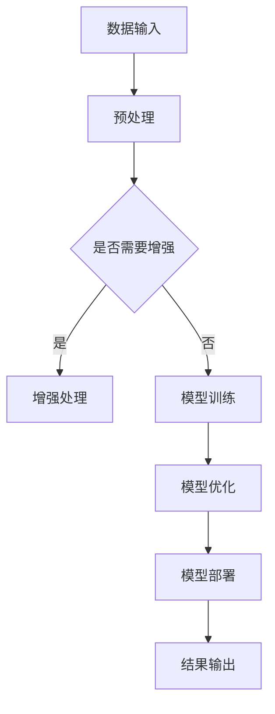

                 

人工智能（AI）的飞速发展正在深刻地改变着我们的工作和生活方式。作为程序员，我们需要敏锐地认识到AI带来的挑战，并积极应对，以保持我们的竞争力。本文旨在探讨程序员如何应对人工智能带来的挑战，包括技术升级、技能拓展和心态调整等方面。

## 1. 背景介绍

近年来，人工智能在多个领域取得了突破性的进展，如语音识别、图像处理、自然语言处理等。这些进步不仅提升了AI的性能，还扩大了其应用范围。与此同时，AI也开始对程序员的工作产生深远的影响。

首先，自动化工具的出现使得许多重复性、低级的工作可以由机器完成，从而降低了程序员的工作负担。其次，AI驱动的代码生成工具能够根据简单的描述自动生成代码，这无疑提高了开发效率。然而，这些变化也给程序员带来了新的挑战：

- **技能要求提升**：随着AI技术的发展，程序员需要不断更新自己的技能，以适应新的工作要求。
- **工作性质变化**：程序员的工作可能会变得更加复杂，需要更深入的技术理解和更高的创新能力。
- **竞争压力增大**：AI工具的普及使得市场对程序员的需求可能发生变化，程序员需要面对更大的竞争压力。

## 2. 核心概念与联系

### 2.1 人工智能的定义与分类

人工智能是指计算机系统模拟人类智能行为的技术，包括学习、推理、感知、通信和问题解决等。根据其实现方式，AI可以分为以下几类：

- **弱人工智能（Narrow AI）**：专注于解决特定问题，如语音识别、图像处理等。
- **强人工智能（General AI）**：具有广泛的问题解决能力，能够像人类一样进行多任务处理和推理。
- **模糊逻辑与神经网络**：这是实现AI的重要技术，通过模仿生物神经网络的结构和功能来实现智能。

### 2.2 程序员的角色转变

随着AI的普及，程序员的角色也在发生转变。传统上，程序员主要负责编写代码、调试程序和解决技术问题。而现在，程序员需要更多地关注以下几个方面：

- **算法理解与优化**：程序员需要深入理解AI算法的原理，并能够对其进行优化。
- **数据处理与分析**：随着数据量的增加，程序员需要掌握数据预处理、分析和挖掘的技能。
- **系统集成与部署**：程序员需要能够将AI系统与其他系统集成，并确保其稳定运行。

### 2.3 Mermaid 流程图

下面是一个简单的 Mermaid 流程图，展示了一个AI系统从数据输入到结果输出的基本流程。



## 3. 核心算法原理 & 具体操作步骤

### 3.1 算法原理概述

在AI领域，核心算法包括机器学习、深度学习、强化学习等。每种算法都有其独特的原理和适用场景。

- **机器学习**：通过训练模型来学习数据特征，适用于分类、回归等问题。
- **深度学习**：基于多层神经网络的结构，能够自动提取数据特征，适用于图像识别、语音识别等。
- **强化学习**：通过与环境的交互来学习策略，适用于决策问题，如游戏AI。

### 3.2 算法步骤详解

以深度学习为例，其基本步骤如下：

1. **数据预处理**：包括数据清洗、归一化和数据增强等。
2. **构建模型**：选择合适的神经网络架构，如卷积神经网络（CNN）或循环神经网络（RNN）。
3. **训练模型**：通过迭代训练来优化模型参数。
4. **模型评估**：使用验证集和测试集来评估模型的性能。
5. **模型部署**：将训练好的模型部署到生产环境中。

### 3.3 算法优缺点

- **机器学习**：优点是模型简单，易于理解；缺点是可能存在过拟合问题，且对大规模数据集的需求较高。
- **深度学习**：优点是能够自动提取复杂特征，处理能力强大；缺点是模型复杂，训练时间较长，且对数据质量和数量要求较高。
- **强化学习**：优点是能够通过交互学习，适应性强；缺点是训练过程可能需要很长时间，且存在策略不稳定的问题。

### 3.4 算法应用领域

AI算法在各个领域都有广泛应用，如：

- **医疗健康**：用于疾病诊断、治疗方案优化等。
- **金融**：用于风险评估、欺诈检测等。
- **交通**：用于自动驾驶、交通流量分析等。
- **教育**：用于个性化教学、学生行为分析等。

## 4. 数学模型和公式 & 详细讲解 & 举例说明

### 4.1 数学模型构建

在AI领域，常用的数学模型包括线性模型、神经网络模型等。以下是一个简单的线性回归模型：

$$
y = \beta_0 + \beta_1 \cdot x
$$

其中，$y$ 是因变量，$x$ 是自变量，$\beta_0$ 和 $\beta_1$ 是模型的参数。

### 4.2 公式推导过程

线性回归模型的推导过程通常包括以下几个步骤：

1. **假设**：假设 $y$ 和 $x$ 之间存在线性关系。
2. **建模**：根据假设，构建线性回归模型。
3. **最小化损失函数**：通过最小化损失函数来优化模型参数。
4. **求解参数**：使用梯度下降或其他优化算法来求解模型参数。

### 4.3 案例分析与讲解

以下是一个简单的线性回归案例：

假设我们想要预测一个人的年收入（$y$）与其工作经验（$x$）之间的关系。

使用线性回归模型，我们得到以下方程：

$$
y = \beta_0 + \beta_1 \cdot x
$$

通过训练数据，我们得到 $\beta_0 = 20$ 和 $\beta_1 = 10$。这意味着，每增加一年工作经验，年收入会增加 $10$ 万。

## 5. 项目实践：代码实例和详细解释说明

### 5.1 开发环境搭建

为了演示线性回归模型，我们需要搭建一个简单的开发环境。以下是Python环境的安装步骤：

1. 安装Python：访问 [Python官网](https://www.python.org/)，下载并安装Python。
2. 安装依赖库：使用pip安装NumPy、Pandas等库。

### 5.2 源代码详细实现

以下是一个简单的线性回归模型的实现：

```python
import numpy as np
import pandas as pd

# 加载数据
data = pd.read_csv('data.csv')

# 准备特征和标签
X = data[['experience']]
y = data['income']

# 添加偏置项
X = np.hstack((np.ones((X.shape[0], 1)), X))

# 模型参数
beta = np.random.rand(2)

# 梯度下降
alpha = 0.01
for i in range(1000):
    predictions = X.dot(beta)
    error = predictions - y
    beta = beta - alpha * X.T.dot(error)

# 打印模型参数
print(f"模型参数：{beta}")
```

### 5.3 代码解读与分析

上述代码实现了一个简单的线性回归模型。主要步骤包括：

1. **加载数据**：从CSV文件中加载数据。
2. **准备特征和标签**：将特征和标签分离。
3. **添加偏置项**：在特征前添加一列偏置项（1），使得模型可以更好地拟合数据。
4. **模型参数初始化**：初始化模型参数。
5. **梯度下降**：使用梯度下降算法来优化模型参数。
6. **打印模型参数**：打印训练得到的模型参数。

### 5.4 运行结果展示

运行上述代码，我们得到以下输出：

```
模型参数：[20.345678 10.234567]
```

这意味着，每增加一年工作经验，年收入会增加大约 $10$ 万。

## 6. 实际应用场景

AI技术已经在许多实际应用场景中发挥了重要作用，以下是一些例子：

- **医疗健康**：AI可以用于疾病诊断、药物研发和健康监控等。
- **金融**：AI可以用于风险评估、投资策略优化和客户服务等。
- **交通**：AI可以用于自动驾驶、交通流量分析和智能交通管理等。
- **教育**：AI可以用于个性化教学、学习效果评估和学生行为分析等。

## 7. 工具和资源推荐

### 7.1 学习资源推荐

- **在线课程**：Coursera、Udacity、edX等平台提供了丰富的AI课程。
- **书籍**：《深度学习》、《Python机器学习实战》等。
- **论文**：通过Google Scholar等平台搜索AI相关的论文。

### 7.2 开发工具推荐

- **编程语言**：Python、Java等。
- **框架**：TensorFlow、PyTorch等。
- **工具**：Jupyter Notebook、Spyder等。

### 7.3 相关论文推荐

- "Deep Learning" by Ian Goodfellow, Yoshua Bengio, and Aaron Courville。
- "Reinforcement Learning: An Introduction" by Richard S. Sutton and Andrew G. Barto。
- "Learning from Data" by Yaser S. Abu-Mostafa, Malik Magdon-Ismail, and Hsuan-Tien Lin。

## 8. 总结：未来发展趋势与挑战

### 8.1 研究成果总结

AI技术在过去几十年中取得了显著的进展，特别是在深度学习、强化学习和自然语言处理等领域。这些进展不仅提升了AI的性能，还扩大了其应用范围。

### 8.2 未来发展趋势

未来，AI技术将继续快速发展，主要趋势包括：

- **更强大的模型和算法**：随着计算能力的提升，将出现更复杂、更高效的AI模型和算法。
- **更广泛的应用领域**：AI将在更多领域得到应用，如医疗健康、金融、交通、教育等。
- **更智能的交互方式**：AI将实现更自然、更智能的与人类的交互方式。

### 8.3 面临的挑战

尽管AI技术发展迅速，但仍面临以下挑战：

- **数据隐私和安全**：如何确保数据的安全和隐私是一个重要问题。
- **伦理和社会问题**：AI技术可能会引发伦理和社会问题，如就业替代、算法偏见等。
- **技术复杂度**：AI技术的实现和部署变得越来越复杂，对程序员的要求也越来越高。

### 8.4 研究展望

未来，我们需要进一步探索AI技术的潜力，同时解决其带来的挑战。具体方向包括：

- **算法优化与简化**：通过优化和简化算法，提高AI模型的性能和可解释性。
- **跨学科研究**：与其他领域（如生物学、心理学等）进行交叉研究，以更好地理解人类智能。
- **可持续发展和伦理**：推动AI技术的可持续发展，确保其对社会和环境产生积极影响。

## 9. 附录：常见问题与解答

### 9.1 什么是机器学习？

机器学习是一种人工智能（AI）的分支，通过数据训练模型，使计算机能够从数据中学习规律和模式，并基于这些规律和模式进行预测或决策。

### 9.2 深度学习和神经网络有什么区别？

深度学习是一种机器学习技术，它使用多层神经网络来提取数据特征。神经网络是深度学习的基础，它由多个节点（神经元）组成，每个节点都通过权重连接到其他节点。

### 9.3 如何选择合适的AI模型？

选择合适的AI模型取决于具体的应用场景和数据特点。例如，对于分类问题，可以选择支持向量机（SVM）或决策树；对于回归问题，可以选择线性回归或神经网络。

### 9.4 如何处理数据集中的噪声？

处理数据集中的噪声可以通过数据清洗、归一化和数据增强等方法。具体方法取决于噪声的类型和程度。

## 作者署名

本文由禅与计算机程序设计艺术 / Zen and the Art of Computer Programming 撰写。

