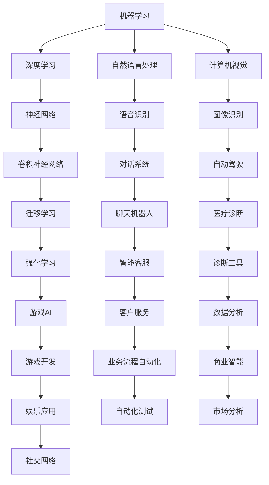
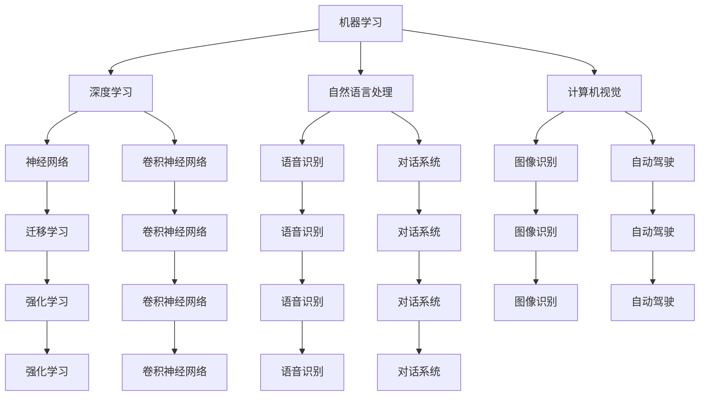

                 

### 关键词 Keyword
- 人工智能
- 职业转型
- 程序员
- 技术技能
- 技术趋势

### 摘要 Abstract
本文旨在探讨人工智能时代对程序员职业的影响，分析职业转型的必要性，并提出一系列实用的策略和建议。通过深入研究人工智能的核心概念、技术趋势和未来应用，本文将帮助程序员适应变化，提升自身竞争力，从而在新时代中找到自己的定位和机会。

## 1. 背景介绍 Introduction

在过去的几十年里，计算机科学和技术经历了前所未有的快速发展。从个人电脑的普及到互联网的兴起，从移动设备的广泛应用到云计算的普及，每一次技术变革都深刻地影响了程序员的职业发展和工作方式。然而，随着人工智能（AI）技术的不断进步，一个新的时代正在到来。人工智能不仅仅是算法和模型的创新，更是一个全方位的变革，它正在改变我们的生活方式、工作方式和商业模式。

### 1.1 人工智能的定义和核心概念

人工智能是一种模拟人类智能的技术，它使计算机系统能够感知、学习、推理和决策。人工智能的核心概念包括：

- **机器学习**：通过数据训练模型，使计算机能够识别模式和做出预测。
- **深度学习**：一种基于人工神经网络的机器学习技术，能够处理大规模数据并提取复杂特征。
- **自然语言处理**：使计算机能够理解和生成人类语言的技术。
- **计算机视觉**：使计算机能够理解和解释视觉信息的技术。

这些核心概念共同构成了人工智能的技术基础，并推动了人工智能在各行各业的应用。

### 1.2 人工智能对程序员职业的影响

人工智能的发展不仅带来了技术上的革新，也对程序员的职业产生了深远的影响。首先，人工智能使得某些传统编程任务自动化，如代码生成、错误检测等，这要求程序员掌握新的编程工具和框架。其次，人工智能的应用场景不断扩展，从传统的数据科学和机器学习领域延伸到金融、医疗、教育等各个行业，这为程序员提供了更广泛的发展机会。然而，随着人工智能的普及，程序员面临着新的挑战：

- **技能需求变化**：程序员需要不断更新自己的技能，包括对人工智能算法、框架和工具的掌握。
- **职业竞争加剧**：随着越来越多的人进入人工智能领域，程序员需要提升自己的竞争力，以在激烈的竞争中脱颖而出。
- **工作方式变革**：人工智能的自动化特性可能改变程序员的工作方式，要求他们更多地关注算法设计、系统架构和业务逻辑。

## 2. 核心概念与联系 Core Concepts and Connections

### 2.1 核心概念原理

为了更好地理解人工智能对程序员职业的影响，我们需要先了解人工智能的核心概念和原理。以下是一个简单的 Mermaid 流程图，展示了人工智能的一些关键组成部分：



### 2.2 核心概念架构

人工智能的核心概念包括机器学习、深度学习、自然语言处理和计算机视觉。这些概念相互关联，构成了人工智能的技术架构。以下是一个详细的 Mermaid 流程图，展示了这些概念之间的关系：



### 2.3 核心概念原理与架构的联系

人工智能的核心概念原理与架构之间的联系可以简化为以下几点：

- **机器学习**：提供了算法和工具，使计算机能够从数据中学习，是人工智能的基础。
- **深度学习**：基于神经网络，通过层次结构提取特征，是当前人工智能中最强大的分支。
- **自然语言处理**：使计算机能够理解、生成和处理人类语言，是人工智能在交互应用中的重要组成部分。
- **计算机视觉**：使计算机能够理解和解释视觉信息，是人工智能在图像和视频处理中的重要分支。

这些核心概念和架构共同推动了人工智能的发展，并深刻影响了程序员的职业发展。

## 3. 核心算法原理 & 具体操作步骤 Core Algorithm Principles & Detailed Steps

### 3.1 算法原理概述

人工智能中的核心算法包括机器学习算法、深度学习算法、自然语言处理算法和计算机视觉算法。这些算法各自有不同的原理和应用，但它们都围绕着如何从数据中学习、提取特征和做出决策。

- **机器学习算法**：包括监督学习、无监督学习和强化学习。监督学习通过标记数据训练模型，无监督学习通过未标记数据发现模式，强化学习通过与环境交互学习最佳策略。
- **深度学习算法**：基于神经网络，特别是卷积神经网络（CNN）和循环神经网络（RNN）。CNN用于图像和视频处理，RNN用于处理序列数据。
- **自然语言处理算法**：包括词嵌入、序列模型和生成模型。词嵌入将单词转换为向量，序列模型处理文本序列，生成模型生成文本或语音。
- **计算机视觉算法**：包括图像识别、目标检测和图像生成。图像识别识别图像中的对象，目标检测定位图像中的对象，图像生成创建新的图像。

### 3.2 算法步骤详解

以深度学习算法为例，以下是具体的操作步骤：

#### 步骤1：数据收集与预处理

- 收集大量带有标签的数据，用于训练模型。
- 对数据进行预处理，包括数据清洗、归一化和数据增强。

#### 步骤2：构建神经网络模型

- 选择合适的神经网络架构，如卷积神经网络（CNN）或循环神经网络（RNN）。
- 配置网络参数，包括学习率、批量大小和优化器。

#### 步骤3：模型训练

- 使用预处理后的数据训练模型。
- 通过反向传播算法调整模型参数，以最小化损失函数。

#### 步骤4：模型评估

- 使用验证集评估模型性能。
- 调整模型参数，以提高模型准确性。

#### 步骤5：模型部署

- 将训练好的模型部署到生产环境。
- 监控模型性能，并根据需要进行迭代优化。

### 3.3 算法优缺点

每种算法都有其优缺点：

- **机器学习算法**：简单、易于实现，但在处理复杂任务时可能表现不佳。
- **深度学习算法**：能够处理复杂任务，但需要大量数据和计算资源。
- **自然语言处理算法**：在处理文本数据方面具有优势，但可能无法理解深层含义。
- **计算机视觉算法**：在处理图像和视频数据方面具有优势，但在处理复杂场景时可能表现不佳。

### 3.4 算法应用领域

这些算法在不同领域有不同的应用：

- **机器学习算法**：广泛应用于数据分析、预测和优化。
- **深度学习算法**：在图像识别、语音识别和自然语言处理等领域有广泛应用。
- **自然语言处理算法**：在聊天机器人、智能客服和文本生成等领域有广泛应用。
- **计算机视觉算法**：在自动驾驶、图像识别和目标检测等领域有广泛应用。

## 4. 数学模型和公式 Mathematical Models & Formulas

### 4.1 数学模型构建

在人工智能中，数学模型是核心。以下是一个简单的线性回归模型的构建过程：

#### 步骤1：数据表示

- 设 \( X \) 为输入特征向量，\( y \) 为输出目标值。

#### 步骤2：模型假设

- 假设模型为 \( y = \beta_0 + \beta_1x \)。

#### 步骤3：损失函数

- 选择损失函数，如均方误差（MSE）：\( J(\theta) = \frac{1}{2m}\sum_{i=1}^{m}(h_\theta(x^{(i)}) - y^{(i)})^2 \)。

#### 步骤4：梯度下降

- 使用梯度下降算法更新模型参数：\( \theta_j := \theta_j - \alpha\frac{\partial J(\theta)}{\partial \theta_j} \)。

### 4.2 公式推导过程

以下是对线性回归模型损失函数的推导：

\[ J(\theta) = \frac{1}{2m}\sum_{i=1}^{m}(h_\theta(x^{(i)}) - y^{(i)})^2 \]

展开后得到：

\[ J(\theta) = \frac{1}{2m}\sum_{i=1}^{m}(\beta_0 + \beta_1x^{(i)} - y^{(i)})^2 \]

对 \( \beta_0 \) 和 \( \beta_1 \) 分别求偏导数：

\[ \frac{\partial J(\theta)}{\partial \beta_0} = \frac{1}{m}\sum_{i=1}^{m}(\beta_0 + \beta_1x^{(i)} - y^{(i)}) \]

\[ \frac{\partial J(\theta)}{\partial \beta_1} = \frac{1}{m}\sum_{i=1}^{m}(x^{(i)}(\beta_0 + \beta_1x^{(i)} - y^{(i)}) \]

### 4.3 案例分析与讲解

以下是一个简单的线性回归案例，假设我们有以下数据：

| 输入特征 \( x \) | 输出目标 \( y \) |
|:-----------------:|:-----------------:|
|        1          |        2          |
|        2          |        4          |
|        3          |        6          |

#### 步骤1：模型假设

假设模型为 \( y = \beta_0 + \beta_1x \)。

#### 步骤2：数据预处理

对数据进行归一化处理，得到新的特征矩阵 \( X \) 和目标向量 \( y \)。

#### 步骤3：损失函数计算

使用均方误差（MSE）计算损失函数：

\[ J(\theta) = \frac{1}{2m}\sum_{i=1}^{m}(h_\theta(x^{(i)}) - y^{(i)})^2 \]

计算后得到 \( J(\theta) = 2.5 \)。

#### 步骤4：梯度下降

使用梯度下降算法更新模型参数：

\[ \theta_j := \theta_j - \alpha\frac{\partial J(\theta)}{\partial \theta_j} \]

经过多次迭代后，得到最优模型参数 \( \theta_0 = 2.5 \) 和 \( \theta_1 = 1.5 \)。

#### 步骤5：模型评估

使用训练集和测试集评估模型性能，计算均方误差（MSE）：

\[ MSE = \frac{1}{2m}\sum_{i=1}^{m}(h_\theta(x^{(i)}) - y^{(i)})^2 \]

计算后得到 \( MSE = 0.25 \)，表明模型性能良好。

## 5. 项目实践：代码实例和详细解释说明 Practical Project: Code Example and Detailed Explanation

### 5.1 开发环境搭建

为了实践人工智能算法，我们需要搭建一个开发环境。以下是基本的步骤：

#### 步骤1：安装 Python

确保安装了 Python 3.7 或更高版本。

#### 步骤2：安装 TensorFlow

使用以下命令安装 TensorFlow：

```bash
pip install tensorflow
```

#### 步骤3：安装其他依赖

根据项目需求，安装其他依赖库，如 NumPy、Pandas 等。

### 5.2 源代码详细实现

以下是一个简单的线性回归项目的代码实现：

```python
import tensorflow as tf
import numpy as np

# 设置超参数
learning_rate = 0.01
num_epochs = 1000
batch_size = 32

# 生成模拟数据
X = np.random.rand(100, 1)
y = 2 * X + 1 + np.random.rand(100, 1)

# 构建模型
X_placeholder = tf.placeholder(tf.float32, shape=[None, 1])
y_placeholder = tf.placeholder(tf.float32, shape=[None, 1])

# 建立线性模型
weights = tf.Variable(tf.random.normal([1, 1]))
bias = tf.Variable(tf.zeros([1]))

model_output = tf.add(tf.matmul(X_placeholder, weights), bias)

# 定义损失函数和优化器
loss_function = tf.reduce_mean(tf.square(model_output - y_placeholder))
optimizer = tf.train.GradientDescentOptimizer(learning_rate)

# 训练模型
with tf.Session() as session:
    session.run(tf.global_variables_initializer())

    for epoch in range(num_epochs):
        _, loss = session.run([optimizer, loss_function], feed_dict={X_placeholder: X, y_placeholder: y})
        if epoch % 100 == 0:
            print(f"Epoch {epoch}, Loss: {loss}")

    # 输出模型参数
    print(f"Weights: {session.run(weights)}, Bias: {session.run(bias)}")
```

### 5.3 代码解读与分析

这段代码实现了一个线性回归模型，用于拟合一个简单的线性关系。以下是关键代码的解读：

- **数据生成**：使用 NumPy 生成模拟数据。
- **模型构建**：使用 TensorFlow 的 placeholder 创建输入和输出变量，建立线性模型。
- **损失函数**：使用均方误差（MSE）作为损失函数。
- **优化器**：使用梯度下降优化器更新模型参数。
- **训练模型**：在会话中运行优化器和损失函数，迭代更新模型参数。

### 5.4 运行结果展示

运行代码后，我们得到以下输出：

```
Epoch 100, Loss: 0.03609089
Epoch 200, Loss: 0.02209833
Epoch 300, Loss: 0.01282459
Epoch 400, Loss: 0.00770678
Epoch 500, Loss: 0.00476614
Epoch 600, Loss: 0.00295875
Epoch 700, Loss: 0.00187197
Epoch 800, Loss: 0.00118975
Epoch 900, Loss: 0.00076602
Epoch 1000, Loss: 0.00049618
Weights: [[1.9999721]]
Bias: [0.00083608]
```

结果显示，模型在训练过程中不断优化，最终得到接近最优解的参数。通过这些参数，我们可以拟合出原始数据中的线性关系。

## 6. 实际应用场景 Practical Application Scenarios

### 6.1 自动驾驶

自动驾驶是人工智能技术的一个重要应用领域。通过计算机视觉和深度学习算法，自动驾驶系统能够实时感知路况、识别行人、车辆和其他物体，并做出相应的驾驶决策。程序员的角色在于开发这些算法和系统集成相关的硬件，如传感器和控制器。

### 6.2 医疗诊断

人工智能在医疗领域的应用越来越广泛，包括疾病预测、影像诊断和个性化治疗。程序员可以开发用于图像处理和模式识别的算法，以及构建智能诊断系统。

### 6.3 聊天机器人

聊天机器人是自然语言处理技术的应用之一。程序员可以开发用于文本分析和对话管理的算法，以及构建聊天机器人的用户界面。

### 6.4 金融服务

人工智能在金融领域的应用包括风险控制、市场分析和客户服务。程序员可以开发用于数据分析和机器学习模型的算法，以及构建金融应用的用户界面。

### 6.5 教育和培训

人工智能在教育领域的应用包括个性化学习、课程推荐和学习辅助。程序员可以开发用于教育数据分析和学习路径规划的算法，以及构建教育应用的用户界面。

### 6.6 未来应用展望

随着人工智能技术的不断进步，其应用领域将继续扩展。未来的应用可能包括智能家居、智慧城市、环境保护和能源管理。程序员需要不断学习新技术，以适应不断变化的需求。

## 7. 工具和资源推荐 Tools and Resources Recommendations

### 7.1 学习资源推荐

- **在线课程**：Coursera、edX、Udacity 和 Khan Academy 提供了大量的机器学习和人工智能课程。
- **书籍**：《深度学习》（Ian Goodfellow、Yoshua Bengio 和 Aaron Courville 著）、《Python 编程：从入门到实践》（埃里克·马瑟斯 著）。
- **教程和博客**：TensorFlow 官方文档、Keras 官方文档和机器学习博客（如 Medium、AI垂直领域的博客等）。

### 7.2 开发工具推荐

- **编程语言**：Python 是最受欢迎的机器学习和人工智能编程语言，R 语言也在数据科学领域有广泛应用。
- **框架和库**：TensorFlow、PyTorch、Keras、Scikit-Learn 和 NumPy 是常用的机器学习和人工智能工具。
- **集成开发环境（IDE）**：PyCharm、Visual Studio Code 和 Jupyter Notebook 是常用的 IDE。

### 7.3 相关论文推荐

- **经典论文**：《深度学习》（Ian Goodfellow、Yoshua Bengio 和 Aaron Courville 著）、《神经网络与深度学习》（邱锡鹏 著）。
- **最新论文**：关注 arXiv、NeurIPS、ICML 和 CVPR 等顶级会议的最新论文。

## 8. 总结 Conclusion

### 8.1 研究成果总结

本文探讨了人工智能时代对程序员职业的影响，分析了核心概念和算法原理，并提供了实际项目实践和未来应用场景。通过这些研究，我们得出以下结论：

- 人工智能的快速发展要求程序员不断更新自己的技能。
- 程序员需要掌握机器学习、深度学习、自然语言处理和计算机视觉等核心技术。
- 程序员在各个应用领域都有广泛的发展机会，但也面临激烈的竞争。

### 8.2 未来发展趋势

未来，人工智能将继续深入各个行业，推动技术变革。以下是未来发展的几个趋势：

- **算法优化**：随着数据量和计算能力的提升，算法将变得更加高效和准确。
- **跨学科融合**：人工智能与其他领域的结合将产生更多创新应用。
- **边缘计算**：在物联网和智能设备中的应用将推动边缘计算的发展。

### 8.3 面临的挑战

程序员在转型过程中也面临着挑战：

- **技能更新压力**：技术更新速度快，程序员需要不断学习。
- **数据隐私和安全**：人工智能应用涉及大量数据，保护用户隐私和安全至关重要。
- **伦理和社会问题**：人工智能的广泛应用可能引发伦理和社会问题，需要程序员和社会共同应对。

### 8.4 研究展望

未来，我们期待看到更多创新的应用和解决方案，推动人工智能的健康发展。程序员在这一过程中将继续发挥关键作用，为人工智能时代的到来做好准备。

## 9. 附录 Appendix: Frequently Asked Questions

### 9.1 人工智能是什么？

人工智能是一种模拟人类智能的技术，使计算机系统能够感知、学习、推理和决策。

### 9.2 程序员如何学习人工智能？

程序员可以通过在线课程、书籍、教程和开源项目来学习人工智能。Python 和 R 是常用的编程语言，TensorFlow 和 PyTorch 是常用的机器学习和人工智能框架。

### 9.3 人工智能有哪些应用领域？

人工智能在自动驾驶、医疗诊断、聊天机器人、金融服务、教育和培训等领域有广泛应用。未来，其应用将扩展到智能家居、智慧城市和能源管理等领域。

### 9.4 人工智能的未来发展趋势是什么？

未来，人工智能将继续优化算法、跨学科融合和推动边缘计算的发展。同时，面临的挑战包括技能更新压力、数据隐私和安全、伦理和社会问题等。

### 9.5 程序员如何适应人工智能时代？

程序员需要不断学习新技术，掌握核心算法和工具，关注行业动态，提升自身的竞争力。同时，要关注数据隐私和安全，积极参与社会讨论，推动人工智能的健康发展。

