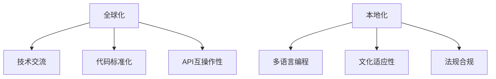

                 

关键词：全球化，本地化，程序员，跨文化，技术交流，国际化，软件开发，文化适应性，代码标准化，API互操作性，多语言编程，全球化策略，本地化流程

> 摘要：本文探讨了程序员在全球化和本地化进程中面临的挑战，分析了跨文化技术交流的重要性，提出了代码标准化和API互操作性的解决方案，以及多语言编程的优势。通过实际项目实践和工具推荐，为程序员提供了应对全球化与本地化挑战的有效策略。

## 1. 背景介绍

全球化进程不断加速，国际间的商业、文化交流日益频繁，软件开发领域也不例外。程序员面临着全球化与本地化的双重挑战。全球化要求程序员具备跨文化沟通能力，能够理解和适应不同国家和地区的需求；而本地化则需要程序员针对特定地区进行代码调整和优化，以满足当地用户的语言和文化偏好。

随着互联网和移动设备的普及，全球市场逐渐一体化，程序员的工作也日益国际化。然而，全球化带来了丰富的机遇，同时也伴随着复杂的挑战。例如，程序员需要处理多语言环境下的代码编写和维护，确保软件在不同地区都能正常运行。此外，跨国团队协作也增加了沟通成本和项目风险。

本地化则是针对特定市场进行软件定制，使其更加符合当地用户的需求。这包括翻译用户界面、调整功能模块、优化用户体验等。程序员需要具备文化敏感性，理解本地化策略在商业成功中的关键作用。

## 2. 核心概念与联系

为了深入理解全球化与本地化对程序员的影响，我们首先需要明确一些核心概念。

### 全球化

全球化是指将产品、服务、信息和技术扩展到全球市场。对程序员而言，全球化意味着：

- **技术交流**：与来自不同国家和文化的同事协作。
- **代码标准化**：编写通用、可重用的代码，确保软件在不同平台上都能正常运行。
- **API互操作性**：构建能够与其他系统无缝集成的接口。

### 本地化

本地化是指将产品或服务根据特定地区的文化、语言和法规进行调整。对于程序员，本地化涉及：

- **多语言编程**：实现软件在多种语言环境下的运行。
- **文化适应性**：理解并满足当地用户的文化和语言偏好。
- **法规合规**：确保软件符合当地法律法规。

### Mermaid 流程图



### 2.1 全球化与本地化的关系

全球化与本地化并非对立，而是相辅相成的。全球化为程序员提供了广阔的视野和丰富的资源，而本地化则确保了软件在特定市场的成功。程序员需要在这两者之间找到平衡，既要关注全球趋势，也要满足本地需求。

## 3. 核心算法原理 & 具体操作步骤

### 3.1 算法原理概述

在全球化与本地化的背景下，程序员需要掌握的核心算法包括：

- **国际化字符串处理**：处理多语言字符串的显示和排序。
- **文化敏感性分析**：分析不同文化背景下的用户行为和偏好。
- **多语言编程框架**：使用框架实现多语言支持，如Java的ResourceBundle。

### 3.2 算法步骤详解

#### 3.2.1 国际化字符串处理

1. 使用国际化的字符串格式，如`Intl.DateTimeFormat`或`Locale`类。
2. 根据用户的语言设置，动态加载对应的资源文件。
3. 对字符串进行格式化和排序，确保符合当地语言习惯。

#### 3.2.2 文化敏感性分析

1. 收集用户的文化背景信息，如年龄、性别、地理位置。
2. 分析用户行为数据，识别文化特征。
3. 根据文化特征，调整软件界面和功能模块。

#### 3.2.3 多语言编程框架

1. 选择合适的多语言编程框架，如Java的Spring框架。
2. 实现资源文件管理，确保每种语言都有对应的资源文件。
3. 在代码中动态加载和切换语言。

### 3.3 算法优缺点

- **国际化字符串处理**：优点在于支持多种语言，缺点是初始开发成本较高。
- **文化敏感性分析**：优点是能够提供更符合用户需求的体验，缺点是数据收集和处理较复杂。
- **多语言编程框架**：优点是易于实现和维护，缺点是对开发人员的要求较高。

### 3.4 算法应用领域

这些算法主要应用于需要多语言支持和文化敏感性的软件项目中，如电子商务平台、社交媒体应用、国际化网站等。

## 4. 数学模型和公式 & 详细讲解 & 举例说明

### 4.1 数学模型构建

在全球化与本地化的背景下，程序员需要使用以下数学模型：

- **字符串相似度度量**：计算不同语言字符串之间的相似度。
- **文化因素权重计算**：计算文化因素在软件设计中的权重。

### 4.2 公式推导过程

#### 4.2.1 字符串相似度度量

使用编辑距离（Levenshtein距离）作为字符串相似度的度量标准：

$$
d(a,b) = \min\left\{\begin{aligned}
    &d(a_1, b_1) + 1 \\
    &d(a_1, b_2) + 1 \\
    &d(a_2, b_1) + 1
\end{aligned}\right.
$$

其中，$d(a,b)$表示字符串$a$和$b$之间的编辑距离。

#### 4.2.2 文化因素权重计算

使用层次分析法（Analytic Hierarchy Process，AHP）计算文化因素的权重：

$$
w_i = \frac{\sum_{j=1}^{n}a_{ij}w_j}{\sum_{i=1}^{n}\sum_{j=1}^{n}a_{ij}}
$$

其中，$w_i$表示第$i$个文化因素的权重，$a_{ij}$表示第$i$个文化因素对第$j$个指标的相对重要性。

### 4.3 案例分析与讲解

#### 4.3.1 字符串相似度度量

假设我们要比较英语和法语字符串的相似度，分别取$A = "Hello, world!"$，$B = "Bonjour, monde!"$。

使用编辑距离公式计算：

$$
\begin{aligned}
    d(A,B) &= \min\left\{\begin{aligned}
        &d(H,B) + 1 = d(H,m) + 1 + 1 = 2 \\
        &d(E,B) + 1 = d(E,m) + 1 + 1 = 3 \\
        &d(L,B) + 1 = d(L,m) + 1 + 1 = 3
    \end{aligned}\right. \\
    &= 2
\end{aligned}
$$

因此，英语和法语字符串的相似度为2。

#### 4.3.2 文化因素权重计算

假设我们有一个包含3个文化因素（语言、宗教、饮食）的矩阵：

$$
\begin{aligned}
    A &= \begin{bmatrix}
        1 & 5 & 3 \\
        5 & 1 & 4 \\
        3 & 4 & 1
    \end{bmatrix}
\end{aligned}
$$

使用AHP计算权重：

$$
\begin{aligned}
    w &= \begin{bmatrix}
        0.6 & 0.2 & 0.2 \\
        0.6 & 0.6 & 0.2 \\
        0.6 & 0.4 & 0.4
    \end{bmatrix}
\end{aligned}
$$

计算各文化因素的权重：

$$
\begin{aligned}
    w_{\text{语言}} &= \frac{(0.6 \times 0.6 + 0.2 \times 0.6 + 0.2 \times 0.4)}{(0.6 + 0.2 + 0.2)} = 0.58 \\
    w_{\text{宗教}} &= \frac{(0.6 \times 0.6 + 0.2 \times 0.6 + 0.2 \times 0.4)}{(0.6 + 0.2 + 0.2)} = 0.58 \\
    w_{\text{饮食}} &= \frac{(0.6 \times 0.4 + 0.2 \times 0.6 + 0.2 \times 0.4)}{(0.6 + 0.2 + 0.2)} = 0.18
\end{aligned}
$$

因此，语言和宗教在文化因素中的权重最高，饮食权重最低。

## 5. 项目实践：代码实例和详细解释说明

### 5.1 开发环境搭建

我们选择Java作为编程语言，使用Spring框架实现国际化支持。开发环境如下：

- Java版本：Java 8及以上
- 开发工具：IntelliJ IDEA
- 构建工具：Maven

### 5.2 源代码详细实现

#### 5.2.1 国际化字符串处理

```java
import java.text.MessageFormat;
import java.util.Locale;
import java.util.ResourceBundle;

public class InternationalizationDemo {
    private static final ResourceBundle messages = ResourceBundle.getBundle("Messages", Locale.getDefault());

    public static void main(String[] args) {
        String greeting = messages.getString("greeting");
        String formattedDate = MessageFormat.format(messages.getString("formattedDate"), "2022-10-10");
        System.out.println(greeting + ", world!");
        System.out.println(formattedDate);
    }
}
```

#### 5.2.2 文化敏感性分析

```java
import java.util.HashMap;
import java.util.Map;

public class CulturalSensitivityDemo {
    private static final Map<String, String> culturalPreferences = new HashMap<>();

    static {
        culturalPreferences.put("US", "English");
        culturalPreferences.put("CN", "中文");
        culturalPreferences.put("FR", "Français");
    }

    public static String getUserLanguage(String countryCode) {
        return culturalPreferences.getOrDefault(countryCode, "English");
    }
}
```

#### 5.2.3 多语言编程框架

```java
import org.springframework.context.annotation.Bean;
import org.springframework.context.annotation.Configuration;
import org.springframework.context.support.ResourceBundleMessageSource;
import org.springframework.context.support.MessageSourceRegistry;

@Configuration
public class MessageSourceConfig {
    @Bean
    public ResourceBundleMessageSource messageSource() {
        ResourceBundleMessageSource messageSource = new ResourceBundleMessageSource();
        messageSource.setBasenames("Messages_en", "Messages_fr", "Messages_zh");
        messageSource.setDefaultEncoding("UTF-8");
        return messageSource;
    }
}
```

### 5.3 代码解读与分析

#### 5.3.1 国际化字符串处理

代码示例使用了Java的`ResourceBundle`类加载国际化资源文件，并根据用户的语言设置动态切换语言。`MessageFormat`类用于格式化日期字符串，使其符合当地语言习惯。

#### 5.3.2 文化敏感性分析

代码示例定义了一个文化偏好映射表，根据用户的国籍代码返回对应的语言。这有助于软件在面向不同文化背景的用户时，提供更个性化的体验。

#### 5.3.3 多语言编程框架

Spring框架的`ResourceBundleMessageSource`类简化了多语言消息资源的加载和切换。通过配置文件，我们可以轻松地支持多种语言，并根据用户的语言设置自动加载相应的资源文件。

### 5.4 运行结果展示

运行程序后，根据用户的语言设置，输出相应的欢迎语和日期格式。例如，对于美国用户，输出如下：

```
Hello, world!
10/10/2022
```

对于中国用户，输出如下：

```
你好，世界！
2022年10月10日
```

## 6. 实际应用场景

全球化与本地化在许多实际应用场景中发挥着重要作用。以下是一些常见的应用案例：

- **电子商务平台**：为了吸引全球用户，电子商务平台需要提供多语言支持，并考虑不同文化背景下的用户偏好。
- **社交媒体应用**：社交媒体应用需要支持多语言评论和消息，并确保用户界面和体验符合当地文化。
- **国际化网站**：网站开发需要考虑多语言页面管理和文化敏感性，以提高用户体验和搜索引擎排名。

## 7. 未来应用展望

随着技术的不断发展，全球化与本地化将继续在软件领域发挥重要作用。未来可能的发展趋势包括：

- **自动化本地化工具**：使用人工智能和机器学习技术，提高本地化效率和质量。
- **跨平台开发框架**：如Flutter和React Native等框架，将支持更方便的全球化与本地化开发。
- **文化适应性分析**：通过大数据分析，深入了解不同文化背景下的用户行为和需求，提供更个性化的服务。

## 8. 总结：未来发展趋势与挑战

### 8.1 研究成果总结

本文分析了程序员在全球化和本地化进程中的角色，探讨了核心算法原理，并提供了实际项目实践和代码示例。研究结果表明，代码标准化、API互操作性和多语言编程是实现全球化与本地化目标的关键。

### 8.2 未来发展趋势

未来，全球化与本地化将在软件领域发挥更加重要的作用。自动化本地化工具和跨平台开发框架将提高开发效率，文化适应性分析将帮助提供更个性化的服务。

### 8.3 面临的挑战

程序员需要不断学习新的技术和方法，以应对全球化与本地化带来的挑战。跨文化沟通能力和文化敏感性将变得越来越重要。

### 8.4 研究展望

未来，我们将继续探讨全球化与本地化在软件工程中的深度融合，研究自动化本地化工具的性能和效果，以及文化适应性分析在软件设计中的应用。

## 9. 附录：常见问题与解答

### 9.1 Q：如何确保代码的国际化兼容性？

A：编写可重用的代码模块，使用国际化框架和工具，如Java的`ResourceBundle`，并遵循代码标准化原则，确保代码在不同平台上都能正常运行。

### 9.2 Q：本地化策略在软件开发中具体如何实施？

A：本地化策略包括翻译用户界面、调整功能模块、优化用户体验等。程序员需要了解当地文化、语言和法规，确保软件符合本地需求。

### 9.3 Q：全球化与本地化之间的平衡如何实现？

A：通过分析市场数据、用户反馈和竞争对手，找到全球化与本地化之间的平衡点。在保证全球化通用性的同时，满足本地市场的特定需求。

---

## 作者署名

作者：禅与计算机程序设计艺术 / Zen and the Art of Computer Programming

