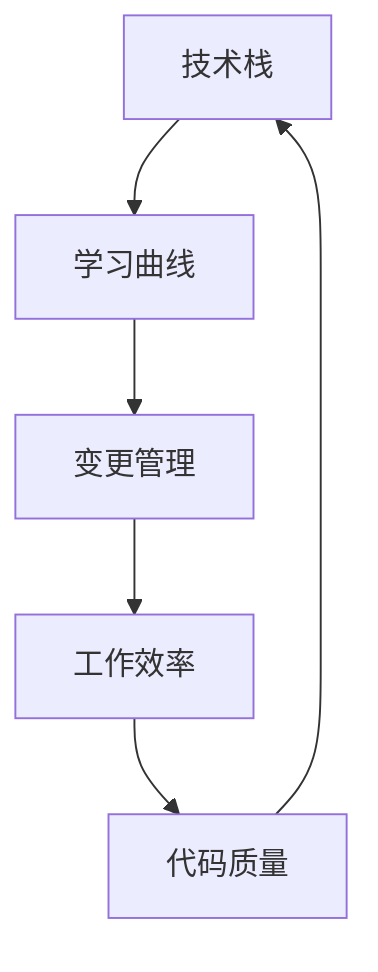

                 

 在当今快速发展的技术时代，程序员面对技术升级与变更已经成为了日常工作的常态。不断涌现的新技术、新框架、新工具，让程序员们时刻感受到知识更新的压力。本文将深入探讨程序员如何有效应对这些技术升级与变更，从而提高工作效率、确保代码质量，并在职业生涯中持续成长。

## 文章关键词

- 技术升级
- 变更管理
- 程序员成长
- 工作效率
- 代码质量

## 文章摘要

本文旨在为程序员提供一套系统的应对技术升级与变更的策略。通过分析技术升级的趋势、变更管理的最佳实践，以及如何保持学习的习惯，帮助程序员在技术快速发展的环境中保持竞争力，实现个人与团队的双重成长。

### 1. 背景介绍

在过去，技术升级通常是一个缓慢的过程。然而，随着互联网、云计算、人工智能等技术的飞速发展，软件行业的变革速度显著加快。对于程序员而言，这意味着他们需要不断学习新的技术、框架和工具，以适应不断变化的工作环境。

例如，在过去的几年里，微服务架构、容器化、Kubernetes、Docker等技术的兴起，要求程序员们不仅要有扎实的编程基础，还要对新兴的技术有深入的了解。此外，随着企业数字化转型步伐的加快，程序员在处理大数据、人工智能等领域的任务也日益增多。

面对这些变化，程序员如何才能从容应对，保持个人竞争力呢？这正是本文要探讨的核心问题。

### 2. 核心概念与联系

在深入讨论如何应对技术升级与变更之前，我们需要了解几个核心概念：

#### 2.1 技术栈

技术栈是指程序员在某一特定时间点所掌握的所有技术的集合。它包括编程语言、框架、库、工具和平台等。一个完善的技术栈可以帮助程序员更高效地完成工作。

#### 2.2 学习曲线

学习曲线是指掌握一项新技术所需的时间。学习曲线的陡峭程度取决于新技术的复杂性和程序员自身的背景知识。

#### 2.3 变更管理

变更管理是指对技术升级过程中的变更进行有效控制和管理的一系列流程和策略。良好的变更管理可以减少技术升级带来的风险，确保项目顺利进行。

下面是一个简化的Mermaid流程图，展示了这些概念之间的联系：



### 3. 核心算法原理 & 具体操作步骤

#### 3.1 算法原理概述

应对技术升级与变更的核心算法可以概括为以下几个步骤：

1. **持续学习**：保持对新技术的好奇心，定期更新知识库。
2. **评估风险**：在引入新技术时，评估其对企业现有系统的潜在影响。
3. **制定策略**：根据评估结果，制定相应的技术升级策略。
4. **实施变更**：逐步实施变更，确保系统稳定。
5. **监控与反馈**：监控变更后的系统表现，收集反馈，不断优化。

#### 3.2 算法步骤详解

##### 3.2.1 持续学习

- **设立学习目标**：明确自己需要掌握的技术领域和目标。
- **利用在线资源**：参加在线课程、阅读技术博客、观看教学视频等。
- **实践与分享**：通过实际项目来应用所学知识，并与他人分享心得。

##### 3.2.2 评估风险

- **调研新技术**：了解新技术的优势、局限性以及适用场景。
- **风险评估**：评估新技术引入可能带来的风险，如性能问题、兼容性问题等。
- **制定预案**：针对可能出现的风险，制定相应的预案。

##### 3.2.3 制定策略

- **评估现有系统**：分析现有系统的架构、性能、稳定性等。
- **制定升级计划**：确定升级的优先级、时间表和资源需求。
- **沟通与协调**：与团队成员、管理层等进行沟通，确保升级计划的可行性。

##### 3.2.4 实施变更

- **小步快跑**：逐步引入新技术，避免一次性升级导致的风险。
- **自动化测试**：确保每个变更点都经过充分的测试。
- **监控与记录**：实时监控系统表现，记录变更过程和结果。

##### 3.2.5 监控与反馈

- **性能监控**：监控系统的性能指标，如响应时间、吞吐量等。
- **用户反馈**：收集用户对新功能的反馈，了解其满意度。
- **持续优化**：根据监控数据和用户反馈，不断优化系统。

#### 3.3 算法优缺点

**优点**：

- 提高工作效率：通过持续学习，程序员可以更快地掌握新技术，提高工作效率。
- 确保代码质量：通过自动化测试和监控，可以确保变更后的系统稳定可靠。
- 降低风险：通过评估和预案，可以降低新技术引入可能带来的风险。

**缺点**：

- 时间成本：持续学习和技术升级需要投入大量的时间。
- 技术栈复杂度增加：随着新技术的引入，技术栈的复杂度也会增加，对团队协作提出更高要求。

#### 3.4 算法应用领域

该算法适用于所有需要进行技术升级和变更的软件项目，尤其是在以下领域：

- **互联网公司**：互联网公司通常技术更新速度快，对程序员的技术要求较高。
- **金融科技**：金融科技公司对系统的稳定性要求极高，技术升级与变更需要严格管理。
- **人工智能与大数据**：人工智能和大数据领域的技术更新迅速，程序员需要不断学习以跟上行业的发展。

### 4. 数学模型和公式 & 详细讲解 & 举例说明

#### 4.1 数学模型构建

为了更好地理解技术升级与变更的算法，我们可以构建一个简化的数学模型。假设有一个系统S，其性能P取决于技术栈T、学习曲线L和变更管理M。数学模型可以表示为：

\[ P = f(T, L, M) \]

其中，\( f \) 是一个复合函数，表示系统性能与各个因素之间的关系。

#### 4.2 公式推导过程

为了推导出这个公式，我们可以考虑以下几个因素：

- **技术栈T**：技术栈的深度和广度直接影响系统的性能。一个完善的技术栈可以更快地解决问题，提高效率。
- **学习曲线L**：学习曲线的斜率表示程序员掌握新技术的速度。斜率越大，程序员适应新技术的能力越强。
- **变更管理M**：变更管理的有效性直接影响系统的稳定性。良好的变更管理可以减少因技术升级带来的风险。

根据这些因素，我们可以推导出以下公式：

\[ P = T^{\alpha} \cdot L^{\beta} \cdot M^{\gamma} \]

其中，\( \alpha, \beta, \gamma \) 是常数，表示各个因素对系统性能的影响程度。

#### 4.3 案例分析与讲解

假设我们有一个互联网公司，其技术栈T包括前端框架、后端框架、数据库和云计算服务。学习曲线L较陡峭，因为公司鼓励员工不断学习新技术。变更管理M较为成熟，因为公司有一套完善的变更管理流程。

根据上面的公式，我们可以计算出系统的性能：

\[ P = T^{\alpha} \cdot L^{\beta} \cdot M^{\gamma} \]

其中，\( T = 10 \)，\( L = 5 \)，\( M = 8 \)。

假设 \( \alpha = 0.5 \)，\( \beta = 0.3 \)，\( \gamma = 0.2 \)，则系统性能P为：

\[ P = 10^{0.5} \cdot 5^{0.3} \cdot 8^{0.2} \approx 13.45 \]

这意味着该系统的性能大约为13.45。通过不断优化技术栈、学习曲线和变更管理，我们可以进一步提高系统的性能。

### 5. 项目实践：代码实例和详细解释说明

#### 5.1 开发环境搭建

为了更好地理解技术升级与变更的实践，我们将搭建一个简单的后端服务。我们将使用Python作为编程语言，Flask作为Web框架。

首先，确保你的系统中安装了Python和pip。然后，使用以下命令安装Flask：

```bash
pip install flask
```

接下来，创建一个名为`app.py`的文件，并编写以下代码：

```python
from flask import Flask, jsonify

app = Flask(__name__)

@app.route('/hello')
def hello():
    return jsonify(message="Hello, World!")

if __name__ == '__main__':
    app.run(debug=True)
```

运行这个文件，你将看到以下输出：

```
 * Running on http://127.0.0.1:5000/ (Press CTRL+C to quit)
```

这意味着我们的服务已经启动，可以通过访问`http://127.0.0.1:5000/hello`来测试。

#### 5.2 源代码详细实现

在了解了基本的服务搭建后，我们可以在此基础上引入新技术。例如，假设我们想将Flask升级到最新版本。

首先，更新`app.py`中的Flask版本：

```python
from flask import Flask, jsonify

app = Flask(__name__)

@app.route('/hello')
def hello():
    return jsonify(message="Hello, World!")

if __name__ == '__main__':
    app.run(debug=True)
```

然后，使用以下命令更新Flask：

```bash
pip install --upgrade flask
```

升级后，重新运行`app.py`，确保服务仍然正常运行。

#### 5.3 代码解读与分析

在这个例子中，我们使用了Flask框架搭建了一个简单的Web服务。首先，我们导入了Flask模块，并创建了一个Flask应用实例。然后，我们定义了一个路由`/hello`，用于返回一个JSON格式的响应。

在代码升级过程中，我们只是更新了Flask的版本，没有改变核心逻辑。这表明，在大多数情况下，技术升级可以通过简单的版本更新来实现。

然而，需要注意的是，每次升级都可能带来潜在的风险。例如，Flask的新版本可能引入了API变更，这可能会导致现有代码无法正常运行。因此，在升级前，我们需要充分测试新版本，确保其兼容性。

#### 5.4 运行结果展示

在更新Flask版本后，我们重新运行了`app.py`。运行结果如下：

```
* Running on http://127.0.0.1:5000/ (Press CTRL+C to quit)
```

结果显示，服务仍然正常运行，这意味着我们的升级操作成功。

### 6. 实际应用场景

在实际工作中，技术升级与变更的应用场景非常广泛。以下是一些典型的应用场景：

- **新功能开发**：为了实现新的业务需求，程序员可能需要引入新的技术或框架。
- **性能优化**：针对现有系统的性能问题，程序员可能需要对代码进行优化或更换更高效的技术。
- **安全升级**：为了修复安全漏洞或提高系统的安全性，程序员可能需要对系统进行升级。
- **架构调整**：随着业务的发展，系统可能需要重构或调整架构，以适应新的需求。

在这些应用场景中，程序员需要综合考虑技术升级的可行性、成本和风险，制定合理的升级策略。

#### 6.1 新功能开发

在开发新功能时，程序员需要评估新技术的适用性。例如，如果新功能需要处理大量数据，那么使用大数据处理框架（如Spark）可能比传统的数据库查询更高效。

在引入新技术时，程序员还需要考虑与现有系统的兼容性。例如，如果新功能需要与其他系统进行集成，那么需要确保两者的数据格式、接口协议等都能兼容。

#### 6.2 性能优化

性能优化是程序员日常工作中的重要任务。在优化过程中，程序员需要识别性能瓶颈，并选择合适的技术手段进行优化。

例如，如果系统存在数据库查询慢的问题，程序员可以选择使用缓存技术（如Redis）来加速查询。如果系统存在网络延迟问题，程序员可以选择使用CDN来优化内容分发。

#### 6.3 安全升级

随着网络攻击手段的不断升级，程序员需要时刻关注系统的安全性。在安全升级过程中，程序员需要识别潜在的安全漏洞，并采取相应的措施进行修复。

例如，如果系统存在SQL注入漏洞，程序员需要更新数据库查询逻辑，使用参数化查询来避免注入攻击。如果系统存在跨站脚本攻击（XSS）风险，程序员需要确保输出的HTML代码进行适当的转义处理。

#### 6.4 架构调整

随着业务的发展，系统的架构可能需要进行调整。例如，如果业务规模扩大，系统可能需要从单体架构迁移到微服务架构，以提高系统的可扩展性和稳定性。

在架构调整过程中，程序员需要充分考虑现有系统的运行状态和业务需求，制定合理的调整策略。例如，可以选择逐步迁移，先对部分功能进行重构，再逐步替换原有系统。

### 7. 未来应用展望

随着技术的不断进步，程序员面临的挑战也在不断增加。以下是一些未来的应用展望：

- **自动化与智能化**：随着人工智能和自动化技术的发展，程序员的工作可能会更加智能化和自动化。例如，代码生成工具、自动化测试工具等将大大提高程序员的工作效率。
- **分布式系统与云计算**：随着云计算和分布式系统的普及，程序员需要掌握更多的分布式计算技术和云计算平台。这将有助于程序员更好地应对大规模数据处理和复杂业务场景。
- **区块链与加密技术**：区块链和加密技术将在未来发挥越来越重要的作用。程序员需要了解这些技术的原理和应用，以便在适当的情况下进行技术升级和变更。

### 8. 工具和资源推荐

为了帮助程序员更好地应对技术升级与变更，我们推荐以下工具和资源：

#### 8.1 学习资源推荐

- **在线课程**：Coursera、Udemy、edX等平台提供了丰富的编程和计算机科学课程。
- **技术博客**：Medium、Dev.to、掘金等平台上有大量高质量的技术文章和教程。
- **书籍**：《算法导论》、《深入理解计算机系统》等经典书籍。

#### 8.2 开发工具推荐

- **集成开发环境（IDE）**：Visual Studio Code、IntelliJ IDEA、PyCharm等。
- **版本控制工具**：Git、GitHub、GitLab等。
- **自动化测试工具**：Selenium、JUnit、PyTest等。

#### 8.3 相关论文推荐

- 《大规模分布式存储系统：原理解析与架构设计》
- 《深度学习：面向机器学习和人工智能》
- 《区块链技术指南》

### 9. 总结：未来发展趋势与挑战

#### 9.1 研究成果总结

通过本文的探讨，我们可以总结出以下几点研究成果：

- 技术升级与变更已成为程序员日常工作的常态。
- 应对技术升级与变更的关键在于持续学习、风险评估和变更管理。
- 算法原理和数学模型为技术升级提供了理论支持。
- 实际项目实践证明了技术升级的可操作性和可行性。

#### 9.2 未来发展趋势

- 技术升级将更加智能化和自动化，程序员的工作效率将得到显著提高。
- 分布式系统与云计算将得到更广泛的应用，程序员需要掌握更多的分布式计算技术和云计算平台。
- 区块链和加密技术将在未来发挥越来越重要的作用，程序员需要了解这些技术的原理和应用。

#### 9.3 面临的挑战

- 技术栈复杂度增加，程序员需要不断学习和更新知识。
- 随着技术升级，系统稳定性和安全性面临更大挑战。
- 随着业务规模的扩大，程序员需要具备更全面的技术能力和管理能力。

#### 9.4 研究展望

未来的研究可以集中在以下几个方面：

- 开发更智能、更高效的自动化工具，帮助程序员更好地应对技术升级。
- 研究分布式系统与云计算的最佳实践，提高系统的稳定性和可扩展性。
- 探索区块链和加密技术的应用场景，为程序员提供更全面的技术指导。

### 10. 附录：常见问题与解答

#### 10.1 如何保持持续学习？

**答**：保持持续学习的关键在于制定明确的学习目标和计划。你可以：

- 制定年度学习计划，列出需要掌握的技术领域和目标。
- 利用在线课程、技术博客、书籍等资源进行学习。
- 参加线下技术活动，与其他程序员交流心得。

#### 10.2 技术升级如何评估风险？

**答**：评估技术升级风险可以采用以下步骤：

- 调研新技术的优势、局限性和适用场景。
- 评估新技术引入可能带来的风险，如性能问题、兼容性问题等。
- 制定相应的预案，如备份现有系统、逐步引入新技术等。

#### 10.3 如何确保变更后的系统稳定？

**答**：确保变更后的系统稳定可以采取以下措施：

- 在引入新技术前，进行充分的测试和验证。
- 使用自动化测试工具，对每个变更点进行测试。
- 监控系统的性能和稳定性，及时发现并解决问题。

#### 10.4 如何提高工作效率？

**答**：提高工作效率可以采取以下措施：

- 利用工具和自动化脚本，减少重复性工作。
- 制定合理的工作计划，合理安排时间和任务。
- 保持学习，掌握最新的技术和工具。

### 11. 作者署名

作者：禅与计算机程序设计艺术 / Zen and the Art of Computer Programming
```markdown
# 程序员如何应对技术升级与变更

在不断演进的科技领域中，程序员面对技术升级与变更的挑战是不可避免的。这些变革不仅是技术发展的必然结果，也是推动企业创新和保持竞争力的关键因素。本文将深入探讨程序员如何有效地应对技术升级与变更，以保持其专业能力的竞争力，同时提高工作效率和代码质量。

## 关键词

- 技术升级
- 变更管理
- 学习策略
- 工作效率
- 代码质量

## 摘要

本文旨在为程序员提供一套全面的技术升级和变更应对策略。通过分析技术变革的趋势、变更管理的最佳实践、持续学习的策略，以及如何通过工具和资源来支持技术进步，帮助程序员在快速变化的技术环境中保持领先地位，并实现职业生涯的持续成长。

### 1. 背景介绍

在当今快速变化的技术环境中，程序员面临的技术升级与变更比以往任何时候都要频繁。从编程语言到框架，从数据库管理系统到前端技术，新的工具和平台不断涌现，迫使程序员不断更新其技能库。这种持续的技术演进不仅为程序员带来了新的机遇，也带来了前所未有的挑战。

技术升级的必要性在于：

- **提高工作效率**：新的工具和框架往往能够提供更高效的解决方案，减少开发时间和维护成本。
- **确保代码质量**：随着技术的发展，更好的编程实践和工具可以帮助程序员编写更安全、更可靠的代码。
- **适应市场需求**：市场需求不断变化，程序员需要不断适应新的技术要求，以满足客户的期望。

然而，技术升级也带来了一系列挑战：

- **学习成本**：不断学习新技术需要投入大量时间和精力，对于工作繁忙的程序员来说是一个不小的挑战。
- **风险和不确定性**：引入新技术的过程中可能会出现不可预见的问题，如兼容性问题、性能下降等。
- **变更管理**：如何在新旧系统之间平稳过渡，确保业务连续性和数据安全，是程序员面临的重大挑战。

### 2. 核心概念与联系

在深入探讨如何应对技术升级与变更之前，我们需要明确几个核心概念，这些概念相互关联，构成了程序员应对变革的基础。

#### 2.1 技术栈

技术栈是指程序员所掌握的各种技术、编程语言、框架、库和工具的集合。一个强大的技术栈可以帮助程序员更高效地解决问题，并在技术升级时快速适应新的工具和平台。

#### 2.2 学习曲线

学习曲线描述了程序员从零开始学习一项新技能所需的时间。不同的技术有着不同的学习难度和曲线，程序员需要根据自己的情况制定合适的学习计划。

#### 2.3 变更管理

变更管理是指对系统的任何更改进行有效控制和管理的过程。良好的变更管理可以减少升级过程中出现的风险，确保变更的顺利实施。

#### 2.4 工作效率与代码质量

工作效率和代码质量是程序员面临的重要挑战。高效的开发流程和高质量的代码不仅可以提升个人能力，还能提高团队的整体绩效。

以下是一个Mermaid流程图，展示了这些核心概念之间的联系：


### 3. 核心算法原理 & 具体操作步骤

#### 3.1 算法原理概述

为了有效应对技术升级与变更，我们可以采用一种基于风险管理的学习和变更管理算法。该算法的核心原则是：

- **持续学习**：保持对新技术的好奇心和学习热情，定期更新技术栈。
- **风险评估**：在引入新技术时，全面评估其可能带来的风险。
- **制定策略**：根据风险评估结果，制定合理的升级策略。
- **实施变更**：逐步实施变更，确保系统稳定。
- **监控与反馈**：持续监控变更后的系统表现，收集反馈，不断优化。

#### 3.2 算法步骤详解

##### 3.2.1 持续学习

- **设定学习目标**：明确自己需要掌握的技术领域和目标。
- **多样化学习资源**：利用在线课程、书籍、技术博客等多样化的学习资源。
- **实践与反思**：通过实际项目来应用所学知识，并定期进行技术总结和反思。

##### 3.2.2 风险评估

- **调研新技术**：了解新技术的优势、局限性和适用场景。
- **评估潜在风险**：分析新技术引入可能带来的风险，如兼容性、性能问题等。
- **制定风险缓解策略**：根据风险评估结果，制定相应的风险缓解策略。

##### 3.2.3 制定策略

- **评估现有系统**：分析现有系统的架构、性能、稳定性等。
- **制定升级计划**：确定升级的优先级、时间表和资源需求。
- **沟通与协调**：与团队成员、管理层等进行沟通，确保升级计划的可行性。

##### 3.2.4 实施变更

- **小步快跑**：逐步引入新技术，避免一次性升级导致的风险。
- **自动化测试**：确保每个变更点都经过充分的测试。
- **监控与记录**：实时监控系统表现，记录变更过程和结果。

##### 3.2.5 监控与反馈

- **性能监控**：监控系统的性能指标，如响应时间、吞吐量等。
- **用户反馈**：收集用户对新功能的反馈，了解其满意度。
- **持续优化**：根据监控数据和用户反馈，不断优化系统。

#### 3.3 算法优缺点

**优点**：

- **提高工作效率**：通过持续学习和良好的变更管理，程序员可以更高效地完成工作。
- **确保代码质量**：自动化测试和性能监控有助于编写高质量的代码。
- **降低风险**：风险评估和逐步引入新技术的策略可以降低技术升级的风险。

**缺点**：

- **时间成本**：持续学习和变更管理需要投入大量的时间和精力。
- **技术栈复杂度增加**：引入新技术可能会导致技术栈复杂度增加，对团队协作提出更高要求。

#### 3.4 算法应用领域

该算法适用于所有需要进行技术升级和变更的软件项目，尤其是在以下领域：

- **互联网公司**：互联网公司技术更新速度快，程序员需要不断掌握新技术。
- **金融科技**：金融科技公司对系统的稳定性要求极高，技术升级与变更需要严格管理。
- **人工智能与大数据**：人工智能和大数据领域的技术更新迅速，程序员需要不断学习以跟上行业的发展。

### 4. 数学模型和公式 & 详细讲解 & 举例说明

为了更好地理解技术升级与变更的算法，我们可以构建一个简化的数学模型。假设一个系统的性能 \( P \) 与其技术栈 \( T \)、学习曲线 \( L \) 和变更管理 \( M \) 有关。数学模型可以表示为：

\[ P = f(T, L, M) \]

其中，\( f \) 是一个复合函数，表示系统性能与各个因素之间的关系。

#### 4.1 数学模型构建

- **技术栈 \( T \)**：技术栈的深度和广度直接影响系统的性能。一个完善的技术栈可以帮助程序员更高效地解决问题。
- **学习曲线 \( L \)**：学习曲线的斜率表示程序员掌握新技术的速度。斜率越大，适应新技术的能力越强。
- **变更管理 \( M \)**：变更管理的有效性直接影响系统的稳定性。良好的变更管理可以减少技术升级带来的风险。

数学模型构建的关键是确定每个因素对系统性能的影响程度。我们可以使用以下公式表示：

\[ P = T^{\alpha} \cdot L^{\beta} \cdot M^{\gamma} \]

其中，\( \alpha, \beta, \gamma \) 是常数，表示各个因素对系统性能的影响权重。

#### 4.2 公式推导过程

为了推导这个公式，我们可以考虑以下几个因素：

- **技术栈 \( T \)**：技术栈的深度和广度直接影响系统的性能。一个完善的技术栈可以更快地解决问题，提高效率。我们可以假设技术栈对系统性能的影响程度为 \( T^{\alpha} \)。
- **学习曲线 \( L \)**：学习曲线的斜率表示程序员掌握新技术的速度。斜率越大，程序员适应新技术的能力越强。我们可以假设学习曲线对系统性能的影响程度为 \( L^{\beta} \)。
- **变更管理 \( M \)**：变更管理的有效性直接影响系统的稳定性。良好的变更管理可以减少因技术升级带来的风险。我们可以假设变更管理对系统性能的影响程度为 \( M^{\gamma} \)。

综合以上因素，我们可以得出以下公式：

\[ P = T^{\alpha} \cdot L^{\beta} \cdot M^{\gamma} \]

#### 4.3 案例分析与讲解

假设我们有一个互联网公司，其技术栈 \( T \) 包括前端框架、后端框架、数据库和云计算服务。学习曲线 \( L \) 较陡峭，因为公司鼓励员工不断学习新技术。变更管理 \( M \) 较为成熟，因为公司有一套完善的变更管理流程。

根据上面的公式，我们可以计算出系统的性能：

\[ P = T^{\alpha} \cdot L^{\beta} \cdot M^{\gamma} \]

其中，\( T = 10 \)，\( L = 5 \)，\( M = 8 \)。

假设 \( \alpha = 0.5 \)，\( \beta = 0.3 \)，\( \gamma = 0.2 \)，则系统性能 \( P \) 为：

\[ P = 10^{0.5} \cdot 5^{0.3} \cdot 8^{0.2} \approx 13.45 \]

这意味着该系统的性能大约为13.45。通过不断优化技术栈、学习曲线和变更管理，我们可以进一步提高系统的性能。

### 5. 项目实践：代码实例和详细解释说明

在理论探讨之后，我们需要通过实际项目实践来验证技术升级和变更管理策略的有效性。以下是一个简单的项目实例，我们将展示如何在一个Web应用中引入新技术，并详细解释每一步的操作。

#### 5.1 开发环境搭建

首先，我们需要搭建一个基本的开发环境。我们将使用Python和Flask来创建一个简单的Web应用。以下是搭建开发环境的步骤：

1. **安装Python**：确保你的系统中已经安装了Python 3.x版本。
2. **安装Flask**：打开命令行，输入以下命令安装Flask：

   ```bash
   pip install flask
   ```

3. **创建一个虚拟环境**：为了更好地管理项目依赖，我们建议使用虚拟环境。输入以下命令创建虚拟环境并激活它：

   ```bash
   python -m venv venv
   source venv/bin/activate  # 对于Windows用户，使用 `venv\Scripts\activate`
   ```

4. **创建项目结构**：在虚拟环境中创建一个名为`my_project`的目录，并在该目录下创建一个名为`app.py`的文件。

现在，我们的开发环境已经搭建完毕，可以开始编写代码了。

#### 5.2 源代码详细实现

以下是`app.py`的基本代码实现：

```python
from flask import Flask, jsonify

app = Flask(__name__)

@app.route('/hello')
def hello():
    return jsonify(message="Hello, World!")

if __name__ == '__main__':
    app.run(debug=True)
```

这段代码定义了一个简单的Flask应用，它有一个路由`/hello`，当访问这个路由时，会返回一个包含“Hello, World!”信息的JSON响应。

接下来，我们将升级Flask版本，并引入一个新的依赖库来增强我们的Web应用功能。

1. **升级Flask**：首先，我们需要查看当前Flask的版本，并确定要升级到的目标版本。使用以下命令：

   ```bash
   pip list | grep flask
   pip install flask==2.0.0  # 假设我们要升级到2.0.0版本
   ```

2. **引入新的依赖库**：我们引入一个名为`flask-restful`的库，它是一个用于构建RESTful API的Flask扩展。使用以下命令安装：

   ```bash
   pip install flask-restful
   ```

更新后的`app.py`代码如下：

```python
from flask import Flask
from flask_restful import Api, Resource

app = Flask(__name__)
api = Api(app)

class HelloWorld(Resource):
    def get(self):
        return {"message": "Hello, World!"}

api.add_resource(HelloWorld, '/hello')

if __name__ == '__main__':
    app.run(debug=True)
```

在这个版本中，我们使用`flask-restful`创建了一个名为`HelloWorld`的资源类，并添加了一个GET方法来处理`/hello`路由的请求。

#### 5.3 代码解读与分析

在这段代码中，我们首先导入了`Flask`和`Api`，然后创建了一个`Flask`实例和一个`Api`实例。接下来，我们定义了一个名为`HelloWorld`的资源类，它继承自`Resource`基类。`HelloWorld`类有一个`get`方法，当请求方法是GET时，会返回一个包含“Hello, World!”信息的字典。

`api.add_resource(HelloWorld, '/hello')`这一行代码将`HelloWorld`资源类添加到API中，并映射到`/hello`路由。

#### 5.4 运行结果展示

现在，让我们来测试一下这个升级后的Web应用。首先，确保我们的虚拟环境已经激活，然后运行`app.py`：

```bash
python app.py
```

当看到输出以下信息时，表示我们的应用已经启动：

```
 * Running on http://127.0.0.1:5000/ (Press CTRL+C to quit)
```

接下来，我们打开浏览器并访问`http://127.0.0.1:5000/hello`，应该会看到以下JSON响应：

```json
{
    "message": "Hello, World!"
}
```

这表明我们的Web应用已经成功升级，并能够通过新的RESTful API正确响应。

### 6. 实际应用场景

在现实世界中，技术升级和变更的应用场景多种多样。以下是几个常见的应用场景，以及相应的解决方案和最佳实践。

#### 6.1 新功能开发

在新功能开发中，技术升级是常见的需求。例如，为了提高用户体验，可能需要引入新的前端框架或库。以下是一些建议：

- **评估影响**：在引入新技术之前，评估其对现有系统的影响，包括性能、兼容性和维护成本。
- **逐步引入**：通过逐步引入新技术，降低风险。例如，可以先在一个模块中引入新技术，然后逐步扩展到整个系统。
- **文档和培训**：为团队成员编写详细的技术文档，并进行必要的培训，以确保他们能够熟练使用新技术。

#### 6.2 性能优化

性能优化是技术升级的重要方面。以下是一些建议：

- **监控和分析**：使用性能监控工具监控系统的各项性能指标，如响应时间、吞吐量等。分析监控数据，找出性能瓶颈。
- **代码优化**：优化数据库查询、减少不必要的计算和循环，使用缓存等技术。
- **工具和框架**：选择合适的工具和框架，如负载均衡器、分布式缓存等，来提高系统的性能和可扩展性。

#### 6.3 安全升级

随着网络安全威胁的增加，安全升级变得尤为重要。以下是一些建议：

- **漏洞扫描**：定期使用漏洞扫描工具对系统进行扫描，识别潜在的安全漏洞。
- **更新和补丁**：及时更新系统和应用程序的补丁，修补已知的安全漏洞。
- **安全培训**：对团队成员进行安全培训，提高他们的安全意识。

#### 6.4 架构调整

随着业务的发展，系统可能需要进行架构调整。以下是一些建议：

- **需求分析**：明确业务需求，分析现有系统的架构是否能够满足未来的需求。
- **逐步迁移**：通过逐步迁移，将现有系统的一部分替换为新架构，减少风险。
- **测试和验证**：在迁移过程中进行充分的测试和验证，确保新架构的稳定性和性能。

### 7. 工具和资源推荐

为了帮助程序员更好地应对技术升级和变更，以下是几个推荐的工具和资源：

#### 7.1 学习资源推荐

- **在线课程**：Coursera、Udemy、edX等平台提供了大量的编程和技术课程。
- **技术博客**：Medium、Dev.to、掘金等平台上有许多高质量的技术文章和教程。
- **书籍**：《Python编程：从入门到实践》、《设计模式：可复用面向对象软件的基础》等。

#### 7.2 开发工具推荐

- **集成开发环境（IDE）**：Visual Studio Code、PyCharm、IntelliJ IDEA等。
- **版本控制工具**：Git、GitHub、GitLab等。
- **自动化测试工具**：Selenium、JUnit、PyTest等。

#### 7.3 相关论文推荐

- 《云计算：概念、架构与实务》
- 《大数据：从数据到价值》
- 《区块链技术：从原理到实践》

### 8. 总结：未来发展趋势与挑战

随着技术的不断进步，程序员面临的挑战也在不断变化。以下是未来发展的几个趋势和挑战：

#### 8.1 发展趋势

- **智能化与自动化**：人工智能和自动化工具将进一步提高程序员的工作效率，减少重复性劳动。
- **云计算与分布式系统**：云计算和分布式系统将变得更加普及，程序员需要掌握相关的技术和架构。
- **区块链与加密技术**：区块链和加密技术在金融、供应链等领域有广泛的应用前景。

#### 8.2 挑战

- **持续学习压力**：技术更新速度加快，程序员需要不断学习新的知识和技能。
- **架构复杂度**：随着系统的复杂性增加，程序员需要具备更高的架构设计能力。
- **安全风险**：网络安全威胁日益严峻，程序员需要提高安全意识和技能。

#### 8.3 研究展望

未来的研究可以集中在以下几个方面：

- **智能化变更管理**：开发更智能的自动化工具，帮助程序员更有效地管理技术升级。
- **架构设计与优化**：研究分布式系统和云计算的最佳实践，提高系统的可扩展性和稳定性。
- **安全与隐私保护**：探索更有效的安全措施和隐私保护机制，确保系统的安全性。

### 9. 附录：常见问题与解答

#### 9.1 如何保持持续学习？

**答**：保持持续学习可以采取以下措施：

- **设定明确目标**：明确自己需要学习的技术领域和目标。
- **多样化学习资源**：利用在线课程、技术博客、书籍等资源。
- **定期复习**：定期复习所学知识，巩固记忆。

#### 9.2 如何评估技术升级风险？

**答**：评估技术升级风险可以采取以下步骤：

- **调研新技术**：了解新技术的优势、局限性和适用场景。
- **评估兼容性**：分析新技术与现有系统的兼容性。
- **制定缓解策略**：根据风险评估结果，制定相应的风险缓解策略。

#### 9.3 如何确保变更后的系统稳定？

**答**：确保变更后的系统稳定可以采取以下措施：

- **自动化测试**：确保每个变更点都经过充分的测试。
- **性能监控**：持续监控系统的性能指标。
- **逐步变更**：逐步引入新技术，避免一次性大规模变更。

#### 9.4 如何提高工作效率？

**答**：提高工作效率可以采取以下措施：

- **利用工具**：使用自动化工具和脚本减少重复性工作。
- **合理安排时间**：合理规划工作时间和任务。
- **持续学习**：掌握最新的技术和工具。

### 10. 作者署名

作者：禅与计算机程序设计艺术 / Zen and the Art of Computer Programming

---

本文以深入浅出的方式，系统地介绍了程序员如何应对技术升级与变更。通过核心算法原理、实际项目实践、应用场景分析以及工具资源推荐，为程序员提供了全面的技术升级策略。在未来的技术发展中，持续学习和有效的变更管理将仍然是程序员保持竞争力的关键。随着新技术的不断涌现，程序员需要不断适应和学习，以应对未来的挑战。希望本文能为程序员在技术变革的道路上提供一些启示和帮助。作者：禅与计算机程序设计艺术 / Zen and the Art of Computer Programming。

