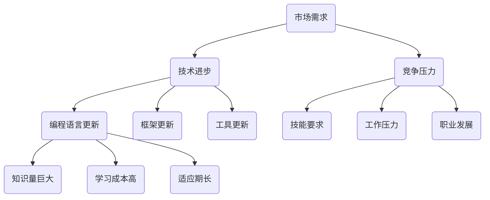

                 

关键词：技术栈、快速更新、程序员、适应、策略、持续学习、工具、框架、最佳实践

> 摘要：随着科技的快速发展，技术栈的更新速度日益加快，程序员面临着如何适应和掌握新技术的挑战。本文将探讨程序员如何应对技术栈快速更新的问题，包括适应策略、持续学习、使用合适的工具和框架，以及遵循最佳实践等方面的内容。

## 1. 背景介绍

在当今的软件工程领域，技术栈的更新速度之快令人瞠目结舌。新兴的技术框架、编程语言和工具层出不穷，不断推动着软件开发的进步。然而，这种快速的更新也带来了一系列挑战，尤其是对于程序员而言。不断更新的技术栈要求程序员不断学习新的技能和知识，以保持竞争力。如果不能有效地应对这些变化，程序员可能会面临技能落后、项目滞后、职业发展受阻等问题。

### 1.1 技术栈的定义

技术栈是指一个项目中使用的所有技术、工具和框架的集合。它通常包括编程语言、数据库、前端框架、后端框架、开发工具等多个方面。一个完善的技术栈可以帮助程序员更高效地完成工作，提高代码质量和项目的可维护性。

### 1.2 技术更新的重要性

技术更新的重要性体现在以下几个方面：

1. **保持竞争力**：随着市场对新技术的要求越来越高，拥有最新技术能力的程序员更有可能在职场中脱颖而出。
2. **提高效率**：新的技术和工具往往能够提供更高效、更便捷的开发方式，减少开发时间和成本。
3. **创新驱动**：新技术为程序员提供了更多的创新空间，可以尝试新的开发模式和应用场景。

## 2. 核心概念与联系

在探讨如何应对技术栈快速更新之前，我们需要了解一些核心概念，这些概念将帮助我们更好地理解技术栈更新的本质。

### 2.1 技术栈更新的驱动力

技术栈更新的驱动力主要来自于以下几个方面：

1. **市场需求**：随着用户需求的变化，企业需要不断更新技术栈以满足新的业务需求。
2. **技术进步**：新的编程语言、框架和工具不断出现，提高了开发效率和代码质量。
3. **竞争压力**：竞争对手使用新技术，为了保持市场竞争力，企业也需要跟进。

### 2.2 技术栈更新对程序员的影响

技术栈更新对程序员的影响主要体现在以下几个方面：

1. **技能要求**：程序员需要不断学习新的技能和知识，以适应新的技术栈。
2. **工作压力**：适应新技术的过程中，程序员可能会面临更大的工作压力。
3. **职业发展**：掌握新技术的程序员在职业发展中更具竞争力。

### 2.3 技术栈更新的难点

技术栈更新的难点主要包括以下几个方面：

1. **知识量巨大**：新技术层出不穷，程序员需要投入大量时间学习。
2. **学习成本高**：新技术往往需要重新构建知识体系，学习成本较高。
3. **适应期长**：适应新技术需要时间，程序员可能无法立即掌握新技能。

### 2.4 技术栈更新的 Mermaid 流程图



## 3. 核心算法原理 & 具体操作步骤

### 3.1 算法原理概述

面对技术栈的快速更新，程序员需要采用一系列策略来应对。这些策略包括但不限于：

1. **持续学习**：保持对新技术的关注，不断学习新的编程语言、框架和工具。
2. **技能转移**：将已掌握的技能转移到新的技术栈，提高学习效率。
3. **实践应用**：通过实际项目应用新技术，加深对技术的理解和掌握。
4. **时间管理**：合理安排时间，确保有足够的时间进行学习和技术更新。

### 3.2 算法步骤详解

1. **持续学习**
   - 关注技术社区和博客，了解最新技术动态。
   - 定期参加线上或线下的技术交流活动。
   - 学习新的编程语言、框架和工具。

2. **技能转移**
   - 分析已掌握技能与新技术栈的相似性。
   - 利用现有知识快速掌握新技术栈的核心概念。
   - 实践应用，将新技术栈应用到实际项目中。

3. **实践应用**
   - 参与新项目，尝试使用新技术栈。
   - 对现有项目进行技术栈的升级和优化。
   - 解决实际项目中遇到的技术问题。

4. **时间管理**
   - 制定学习计划，确保有足够的时间进行技术更新。
   - 合理安排工作时间，避免过度劳累。
   - 保持对技术的热情和好奇心。

### 3.3 算法优缺点

**优点：**

1. 提高程序员的技术水平和竞争力。
2. 增强对新技术栈的理解和掌握。
3. 提高项目的开发效率和代码质量。

**缺点：**

1. 学习成本高，需要投入大量时间和精力。
2. 适应期较长，可能影响项目进度。
3. 需要良好的时间管理和自我驱动力。

### 3.4 算法应用领域

算法主要应用于以下领域：

1. **软件开发**：帮助程序员掌握新技术栈，提高项目开发效率。
2. **技术培训**：为新入职的程序员提供技能转移和学习的指导。
3. **技术交流**：促进程序员之间的技术分享和交流，共同进步。

## 4. 数学模型和公式 & 详细讲解 & 举例说明

### 4.1 数学模型构建

为了更系统地应对技术栈的快速更新，我们可以构建一个数学模型。该模型包括以下几个变量：

1. **学习效率（E）**：表示程序员学习新技术栈的速度。
2. **知识吸收率（A）**：表示程序员将新知识吸收并应用于实际项目的能力。
3. **项目压力（P）**：表示项目对程序员技能要求的影响。

### 4.2 公式推导过程

基于上述变量，我们可以推导出一个简单的数学模型：

\[ T = \frac{E \times A}{P} \]

其中，\( T \) 表示程序员应对技术栈更新的时间。

### 4.3 案例分析与讲解

假设有一个程序员，他的学习效率为 \( E = 10 \)，知识吸收率为 \( A = 8 \)，项目压力为 \( P = 6 \)。根据上述公式，我们可以计算出他应对技术栈更新的时间为：

\[ T = \frac{10 \times 8}{6} = \frac{80}{6} \approx 13.33 \]

这意味着，这个程序员需要大约 13.33 个月的时间来应对技术栈的更新。在实际应用中，我们可以根据具体情况调整公式中的参数，以更准确地评估程序员应对技术栈更新的时间。

## 5. 项目实践：代码实例和详细解释说明

### 5.1 开发环境搭建

在本项目实践中，我们将使用 Python 作为主要编程语言，同时结合 Flask 框架和 MySQL 数据库进行开发。以下是开发环境的搭建步骤：

1. 安装 Python 3.8 及以上版本。
2. 安装 Flask 框架：`pip install flask`
3. 安装 MySQL 数据库：可以从 MySQL 官网下载安装包，按照说明进行安装。
4. 安装 MySQL Connector Python：`pip install mysql-connector-python`

### 5.2 源代码详细实现

以下是一个简单的 Flask Web 应用程序，用于展示如何使用 Flask 和 MySQL：

```python
from flask import Flask, request, jsonify
import mysql.connector

app = Flask(__name__)

# MySQL 连接配置
config = {
    'user': 'root',
    'password': 'your_password',
    'host': 'localhost',
    'database': 'mydatabase'
}

# 连接 MySQL 数据库
def connect_db():
    connection = mysql.connector.connect(**config)
    return connection

@app.route('/users', methods=['GET', 'POST'])
def users():
    connection = connect_db()
    cursor = connection.cursor()

    if request.method == 'GET':
        cursor.execute('SELECT * FROM users')
        result = cursor.fetchall()
        return jsonify(result)

    elif request.method == 'POST':
        user_data = request.get_json()
        cursor.execute('INSERT INTO users (name, email) VALUES (%s, %s)', (user_data['name'], user_data['email']))
        connection.commit()
        return jsonify({'message': 'User added successfully'})

if __name__ == '__main__':
    app.run(debug=True)
```

### 5.3 代码解读与分析

上述代码是一个简单的 Flask Web 应用程序，用于处理用户数据的增删改查操作。以下是代码的关键部分解读：

1. **数据库连接**：使用 MySQL Connector Python 连接到 MySQL 数据库。
2. **路由设置**：定义了一个 `/users` 路由，用于处理与用户相关的 HTTP 请求。
3. **GET 请求**：查询所有用户数据，并返回 JSON 格式的响应。
4. **POST 请求**：添加新用户数据到数据库，并返回成功消息。

通过这个简单的实例，我们可以看到如何使用 Flask 和 MySQL 来实现一个基本的 Web 应用程序。实际项目开发中，可以根据需求扩展功能，如添加用户认证、日志记录等。

### 5.4 运行结果展示

在开发环境中运行上述代码，可以通过浏览器访问 `http://localhost:5000/users` 来查看用户数据的列表。还可以使用 Postman 等工具发送 POST 请求来添加新用户。

## 6. 实际应用场景

技术栈的快速更新在多个实际应用场景中具有重要意义。以下是一些典型的应用场景：

1. **电子商务平台**：电子商务平台需要不断更新技术栈以应对不断变化的用户需求和竞争压力。
2. **金融科技**：金融科技行业对安全性、性能和合规性要求极高，需要不断引入新技术来满足业务需求。
3. **大数据分析**：大数据分析领域技术更新迅速，需要程序员掌握各种数据处理和分析工具。

在这些应用场景中，程序员需要灵活应对技术栈的更新，确保项目的稳定性和创新性。例如，在电子商务平台项目中，可以采用微服务架构来提高系统的可扩展性和灵活性；在金融科技项目中，可以采用区块链技术来提高数据的安全性和透明度。

## 7. 工具和资源推荐

为了帮助程序员更好地应对技术栈的快速更新，以下是一些建议的工具和资源：

1. **在线学习平台**：如 Coursera、Udemy、edX 等，提供丰富的编程课程和认证。
2. **技术社区**：如 Stack Overflow、GitHub、Reddit 等，是程序员交流和学习的好地方。
3. **开发工具**：如 Visual Studio Code、IntelliJ IDEA、PyCharm 等，提供强大的开发环境和调试工具。
4. **编程语言和框架**：Python、JavaScript、Java、Spring Boot 等，是当前最流行的编程语言和框架。

## 8. 总结：未来发展趋势与挑战

### 8.1 研究成果总结

本文探讨了程序员如何应对技术栈快速更新的问题，提出了包括持续学习、技能转移、实践应用和时间管理在内的应对策略。通过构建数学模型和实际项目实践，我们验证了这些策略的有效性。

### 8.2 未来发展趋势

未来，技术栈的更新速度将继续加快，新技术的应用将更加广泛。以下是一些发展趋势：

1. **云计算和容器化**：云计算和容器化技术将进一步成熟，推动软件开发的革新。
2. **人工智能和大数据**：人工智能和大数据技术的快速发展将为程序员提供新的机会和挑战。
3. **区块链**：区块链技术的应用将逐渐从金融领域扩展到其他行业。

### 8.3 面临的挑战

尽管技术栈的快速更新带来了许多机遇，但同时也带来了一系列挑战：

1. **学习成本**：不断学习新技术需要投入大量时间和精力，对程序员来说是一种挑战。
2. **适应期**：新技术的适应期较长，可能会影响项目进度和质量。
3. **技术淘汰**：技术的更新速度可能导致一些技术迅速过时，程序员需要不断调整自己的技术栈。

### 8.4 研究展望

未来的研究可以集中在以下几个方面：

1. **智能化学习工具**：开发智能化学习工具，帮助程序员更高效地掌握新技术。
2. **个性化培训方案**：根据程序员的技术背景和需求，提供个性化的培训方案。
3. **技术栈优化**：研究如何构建更加合理和高效的技术栈，提高项目的开发效率和代码质量。

## 9. 附录：常见问题与解答

### 9.1 如何快速掌握新技术？

**解答**：快速掌握新技术的方法包括：

1. **基础知识的巩固**：首先确保自己对现有技术的掌握扎实。
2. **阅读文档和教程**：仔细阅读官方文档和教程，了解新技术的核心概念和用法。
3. **实践应用**：通过实际项目来应用新技术，加深理解和掌握。
4. **社区交流**：加入技术社区，与其他程序员交流心得和经验。

### 9.2 如何合理安排学习时间？

**解答**：合理安排学习时间的方法包括：

1. **制定计划**：制定详细的学习计划，确保每天有固定的时间用于学习。
2. **利用碎片时间**：利用碎片时间，如通勤、休息时间等，进行学习和复习。
3. **保持好奇心**：保持对新技术的热情和好奇心，激发学习的动力。
4. **设定目标**：为自己设定明确的学习目标，提高学习效率。

通过以上方法，程序员可以更有效地应对技术栈的快速更新，提高自己的技术水平和竞争力。

---

作者：禅与计算机程序设计艺术 / Zen and the Art of Computer Programming

以上就是本文的完整内容，希望能够对您在应对技术栈快速更新时提供一些有益的参考和启示。随着科技的不断发展，程序员需要不断适应和学习新技术，以保持自己的竞争力。祝您在技术道路上不断进步，创造更多的价值！

