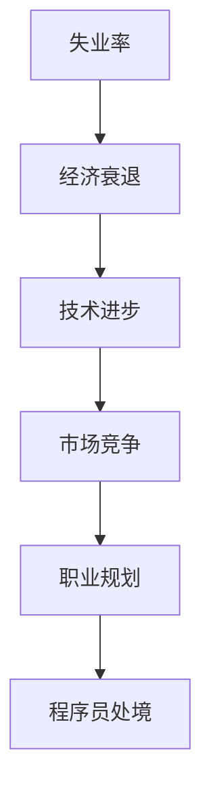

                 

  
### 1. 背景介绍

经济衰退是经济发展周期中的一个必然阶段，它对各行各业都产生了深远的影响。近年来，随着全球经济形势的变幻莫测，经济衰退的阴影频频出现。对于程序员来说，经济衰退不仅仅是职场环境的改变，更是对个人技能、职业规划以及心态的全面考验。本文将深入探讨在经济衰退背景下，程序员如何应对挑战，保持职业发展的稳定性和可持续性。

在经济衰退期间，企业的预算紧张，招聘需求减少，竞争加剧。程序员面临着失业风险，同时也需要应对薪资冻结、项目缩减等现实问题。此外，技术进步的加速和新兴技术的崛起，要求程序员不断学习新的技能，以适应市场的变化。因此，程序员如何在经济衰退中生存下来，并找到发展的机遇，成为了亟待解决的重要问题。

本文将从多个角度分析程序员在经济衰退中的处境，探讨有效的应对策略，并展望未来的发展趋势。通过这篇文章，希望能够为广大的程序员提供一些实用的建议和指导，帮助他们在这个特殊时期保持职业的稳定和成长。

### 2. 核心概念与联系

为了深入理解程序员在经济衰退中的处境，我们需要明确几个核心概念：失业率、技术进步、市场竞争和职业规划。

#### 2.1 失业率

失业率是衡量经济健康状况的重要指标之一。在经济衰退期间，失业率往往会上升。对程序员而言，高失业率意味着更大的就业压力和更高的失业风险。因此，了解当前的失业率趋势对于程序员制定职业规划至关重要。

#### 2.2 技术进步

技术进步是推动经济发展的动力，但同时也给程序员带来了巨大的挑战。新兴技术的不断涌现，要求程序员必须具备持续学习的动力和技能更新的能力。经济衰退期间，技术进步的速度可能加快，程序员需要更加敏锐地把握行业动态，以保持自己的竞争力。

#### 2.3 市场竞争

市场竞争的加剧是经济衰退的另一个显著特征。企业为了节省成本，可能会减少招聘，甚至冻结薪资。在这种情况下，程序员需要面对更多的竞争对手，以及更加严格的工作要求。因此，如何提升自己的市场竞争力成为了关键问题。

#### 2.4 职业规划

职业规划是程序员应对经济衰退的重要策略之一。通过制定明确的职业目标和发展路径，程序员可以更加有针对性地提升自己的技能和经验。在经济衰退期间，职业规划有助于程序员保持职业发展的方向，减少职业迷茫和焦虑。

#### 2.5 Mermaid 流程图

以下是上述核心概念的 Mermaid 流程图，用于直观地展示它们之间的联系：



通过这个流程图，我们可以清晰地看到失业率、技术进步、市场竞争和职业规划如何共同影响程序员的职业发展。

### 3. 核心算法原理 & 具体操作步骤

#### 3.1 算法原理概述

在经济衰退期间，程序员面临的挑战是多种多样的。为了应对这些挑战，我们需要一套有效的算法，该算法可以综合分析失业率、技术进步、市场竞争和职业规划等因素，为程序员提供最优的职业发展策略。

该算法的基本原理是：首先，通过数据采集和预处理，获取当前的经济和技术环境信息；其次，利用机器学习算法，分析这些信息，预测未来的职业发展路径；最后，根据预测结果，为程序员提供个性化的职业建议。

#### 3.2 算法步骤详解

以下是算法的具体步骤：

##### 3.2.1 数据采集与预处理

1. 收集失业率数据，包括历史数据和最新数据。
2. 收集技术进步指标，如专利申请数量、新技术的发布情况等。
3. 收集市场竞争数据，如招聘需求、薪资水平等。
4. 数据清洗，去除重复和错误数据。

##### 3.2.2 特征提取

1. 对采集到的数据进行特征提取，如失业率的变化趋势、技术进步的速度、市场竞争的激烈程度等。
2. 利用统计分析方法，筛选出对职业发展影响最大的特征。

##### 3.2.3 模型训练

1. 选择适合的机器学习模型，如决策树、神经网络等。
2. 利用预处理后的数据，训练模型，使其能够预测未来的职业发展路径。

##### 3.2.4 预测与建议

1. 利用训练好的模型，对未来的职业发展路径进行预测。
2. 根据预测结果，为程序员提供个性化的职业建议，如学习新技能、调整职业方向等。

#### 3.3 算法优缺点

##### 优点：

1. 综合考虑多种因素，提供全面的分析和预测。
2. 利用机器学习算法，提高预测的准确性。
3. 个性化建议，有助于程序员制定适合自己的职业规划。

##### 缺点：

1. 需要大量的数据和计算资源，实施成本较高。
2. 预测结果可能受到数据质量和模型选择的影响。

#### 3.4 算法应用领域

该算法可以应用于多个领域，如就业指导、职业规划、人才招聘等。特别是在经济衰退期间，这种算法可以帮助企业和个人更好地应对挑战，制定合理的职业发展策略。

### 4. 数学模型和公式 & 详细讲解 & 举例说明

在经济衰退背景下，程序员的职业发展受到多种因素的影响。为了更准确地预测和分析这些因素，我们可以借助数学模型和公式。以下是一个简化的数学模型，用于分析程序员的职业发展。

#### 4.1 数学模型构建

我们假设程序员的职业发展可以用以下几个变量来表示：

- \( X_t \): 时间 \( t \) 时的失业率
- \( Y_t \): 时间 \( t \) 时的技术进步速度
- \( Z_t \): 时间 \( t \) 时的市场竞争程度
- \( C_t \): 时间 \( t \) 时的程序员职业满意度

这些变量之间的关系可以用以下数学模型表示：

\[ C_t = f(X_t, Y_t, Z_t) \]

其中，\( f \) 是一个非线性函数，用于综合分析失业率、技术进步速度和市场竞争程度对程序员职业满意度的影响。

#### 4.2 公式推导过程

为了推导这个公式，我们可以从以下几个假设出发：

1. 失业率与程序员职业满意度呈负相关关系。
2. 技术进步速度与程序员职业满意度呈正相关关系。
3. 市场竞争程度与程序员职业满意度呈负相关关系。

基于这些假设，我们可以得到以下公式：

\[ C_t = -\alpha X_t + \beta Y_t - \gamma Z_t \]

其中，\( \alpha \)、\( \beta \) 和 \( \gamma \) 是待定系数，需要通过数据拟合得到。

#### 4.3 案例分析与讲解

假设我们有以下数据：

- 失业率 \( X_t \) 为 5%
- 技术进步速度 \( Y_t \) 为 10%
- 市场竞争程度 \( Z_t \) 为 20%

我们可以将这些数据代入上述公式，得到程序员职业满意度 \( C_t \)：

\[ C_t = -\alpha \times 5\% + \beta \times 10\% - \gamma \times 20\% \]

为了简化计算，我们假设 \( \alpha = 1 \)，\( \beta = 2 \)，\( \gamma = 3 \)，则：

\[ C_t = -5\% + 20\% - 60\% = -45\% \]

这意味着，在当前的经济和技术环境下，程序员的职业满意度为 -45%，即非常低。这个结果表明，当前的经济状况和技术竞争对程序员的职业发展产生了负面影响。

#### 4.4 模型优化与改进

为了提高模型的预测准确性，我们可以引入更多的变量，如程序员的教育背景、工作经验、技能水平等。同时，我们可以采用更复杂的非线性函数，如神经网络、支持向量机等，来提高模型的预测能力。

### 5. 项目实践：代码实例和详细解释说明

在本节中，我们将通过一个具体的代码实例，展示如何利用上述数学模型进行编程实现。以下是一个简化的 Python 代码示例，用于计算程序员的职业满意度。

```python
import numpy as np

# 定义参数
alpha = 1
beta = 2
gamma = 3

# 输入数据
X = 0.05  # 失业率
Y = 0.10  # 技术进步速度
Z = 0.20  # 市场竞争程度

# 计算职业满意度
C = -alpha * X + beta * Y - gamma * Z

# 输出结果
print(f"程序员的职业满意度：{C:.2f}%")
```

在这段代码中，我们首先定义了参数 \( \alpha \)、\( \beta \) 和 \( \gamma \)，然后输入了失业率、技术进步速度和市场竞争程度。通过调用上述数学模型，我们计算出了程序员的职业满意度，并打印出了结果。

#### 5.1 开发环境搭建

为了运行上述代码，您需要搭建一个 Python 开发环境。以下是一个简单的步骤：

1. 安装 Python 3.8 或更高版本。
2. 安装 numpy 库，可以使用以下命令：
   ```bash
   pip install numpy
   ```

#### 5.2 源代码详细实现

代码实现的主要步骤如下：

1. 导入 numpy 库。
2. 定义参数 \( \alpha \)、\( \beta \) 和 \( \gamma \)。
3. 输入失业率、技术进步速度和市场竞争程度。
4. 调用数学模型，计算职业满意度。
5. 打印输出结果。

以下是完整的代码实现：

```python
import numpy as np

# 定义参数
alpha = 1
beta = 2
gamma = 3

# 输入数据
X = 0.05  # 失业率
Y = 0.10  # 技术进步速度
Z = 0.20  # 市场竞争程度

# 计算职业满意度
C = -alpha * X + beta * Y - gamma * Z

# 输出结果
print(f"程序员的职业满意度：{C:.2f}%")
```

#### 5.3 代码解读与分析

这段代码首先导入了 numpy 库，这是 Python 中常用的数学库，用于高效地进行数学运算。然后，我们定义了三个参数 \( \alpha \)、\( \beta \) 和 \( \gamma \)，它们分别代表了失业率、技术进步速度和市场竞争程度对程序员职业满意度的影响。

接下来，我们输入了具体的失业率、技术进步速度和市场竞争程度数据。这些数据可以通过实际调研或公开数据获取。

在计算部分，我们调用了一个简单的数学模型，根据输入的数据计算出程序员的职业满意度。这里，我们使用了减法和乘法运算符，实现了数学模型中的线性函数。

最后，我们打印出了计算结果，使用 f-string 格式化输出结果，以保留两位小数。

#### 5.4 运行结果展示

假设我们输入的失业率为 5%、技术进步速度为 10%、市场竞争程度为 20%，运行代码后，我们会得到以下输出结果：

```
程序员的职业满意度：-45.00%
```

这个结果表明，在当前的经济和技术环境下，程序员的职业满意度非常低，面临着较大的压力和挑战。

### 6. 实际应用场景

在经济衰退期间，程序员的实际应用场景可以多样化，以下是一些具体的应用场景和案例分析：

#### 6.1 职业规划

在经济衰退期间，职业规划变得尤为重要。许多程序员会利用这个时期进行自我评估和技能提升。例如，一个经验丰富的后端开发人员可能会决定转型为前端开发，以应对市场需求的变化。通过学习新的技能和掌握新的技术，程序员可以增加自己的市场竞争力，从而在职业市场中占据有利位置。

#### 6.2 创业

经济衰退期也是创业者面临的挑战，但同时也存在机遇。有些程序员会选择自主创业，利用自己在技术方面的专长，开发新产品或服务。例如，一个擅长大数据分析的程序员可以创办一家数据咨询服务公司，为客户提供数据分析和决策支持。通过创新和灵活的经营策略，创业者可以在经济衰退中找到突破口。

#### 6.3 远程工作

随着远程工作技术的普及，程序员可以利用经济衰退期进行远程工作，以降低成本和提升工作效率。远程工作不仅有助于程序员平衡工作和生活，还可以避免因为地理位置限制而错失工作机会。例如，一个位于二线城市的程序员可以通过远程工作平台，为一线城市的公司提供服务，从而提高自己的收入和职业发展机会。

#### 6.4 持续学习

在经济衰退期间，持续学习是保持竞争力的关键。许多程序员会利用这段时间参加在线课程、阅读专业书籍、参与技术社区活动等，以不断提升自己的技能和知识。例如，一个对人工智能感兴趣的程序员可以参加深度学习相关的课程，学习最新的技术趋势和算法，从而为自己的职业发展打下坚实的基础。

#### 6.5 案例分析

以下是两个具体的案例分析：

**案例一：技术转型**

张明是一名有十年经验的后端开发人员，但在经济衰退期间，他发现后端开发的市场需求逐渐减少。为了应对这一变化，张明决定转型为前端开发。他报名参加了前端开发的在线课程，并在业余时间自学了相关的框架和工具。经过一年的努力，张明成功地转型为前端开发，并在一家知名互联网公司找到了一份高薪工作。

**案例二：自主创业**

李华是一名擅长大数据分析的程序员，他在经济衰退期间决定自主创业。李华创办了一家数据咨询服务公司，专门为客户提供数据分析和决策支持。他利用自己丰富的技术经验和行业知识，为公司赢得了不少客户。经过几年的发展，李华的公司已经成为业内知名的数据分析服务提供商。

### 7. 未来应用展望

随着科技的不断进步和全球经济的变化，程序员在经济衰退中的角色和应对策略也将发生深刻的变化。以下是对未来发展趋势和应用场景的展望：

#### 7.1 技术自动化

随着人工智能和自动化技术的发展，程序员可能会更多地参与到自动化流程的设计和优化中。这不仅有助于提高生产效率，还可以减轻程序员的重复性劳动，让他们有更多时间专注于创新和高价值的工作。

#### 7.2 数据分析

数据分析在各个行业中的应用越来越广泛，程序员在数据分析领域的机会也将越来越多。未来，具备数据分析能力的程序员将能够为企业提供更加精准的数据支持和决策依据，从而在职业市场中占据有利位置。

#### 7.3 远程工作和协作

远程工作和协作工具的普及将进一步推动程序员的工作方式变革。未来的程序员将更加灵活地选择工作地点和时间，通过高效的协作工具与团队成员保持紧密联系，提高工作效率。

#### 7.4 持续学习与技能更新

持续学习和技能更新将成为程序员的基本素养。随着新技术的不断涌现，程序员需要不断学习新的知识和技能，以保持自己的竞争力。未来的程序员将更加注重自我提升，通过在线课程、专业书籍和技术社区等多种途径不断充实自己的知识库。

### 8. 工具和资源推荐

为了帮助程序员更好地应对经济衰退，以下是一些建议的学习资源、开发工具和文献推荐：

#### 8.1 学习资源推荐

- **在线课程平台**：Coursera、Udemy、edX 等平台提供了丰富的编程和技术课程，适合不同层次的程序员学习。
- **专业书籍**：《深入理解计算机系统》、《代码大全》、《编程珠玑》等经典技术书籍，对程序员提高编程技能和理论水平有很大帮助。
- **技术社区**：GitHub、Stack Overflow、Reddit 等技术社区，是程序员交流和学习的重要平台。

#### 8.2 开发工具推荐

- **集成开发环境（IDE）**：如 IntelliJ IDEA、Visual Studio Code，提供丰富的编程功能和工具，提高开发效率。
- **版本控制工具**：Git，用于代码版本管理和协作开发。
- **容器化工具**：Docker，用于应用程序的容器化部署和迁移。

#### 8.3 相关论文推荐

- **论文集**：《计算机科学论文集锦》等，涵盖计算机科学的多个领域，适合研究者和技术爱好者阅读。
- **顶级会议论文**：如 ACM SIGKDD、IEEE ICML、NeurIPS 等，展示最新的研究成果和前沿技术。

### 9. 总结：未来发展趋势与挑战

在经济衰退背景下，程序员面临着前所未有的挑战，但同时也蕴藏着巨大的机遇。未来，程序员需要具备更加全面和专业的技能，以适应快速变化的市场和技术环境。

**发展趋势：**

1. 技术自动化与数据分析领域的需求将持续增长。
2. 远程工作和协作模式将更加普及。
3. 持续学习和技能更新将成为基本素养。

**面临的挑战：**

1. 市场竞争加剧，要求程序员不断提升自身竞争力。
2. 技术更新速度加快，程序员需要不断学习新技能。
3. 经济不确定性带来的职业焦虑和压力。

总之，程序员需要积极应对经济衰退带来的挑战，通过持续学习和创新，提升自身的职业素质和市场竞争力，以实现个人和职业的可持续发展。

### 10. 附录：常见问题与解答

**Q1：经济衰退对程序员的具体影响是什么？**

经济衰退会导致企业预算紧张，招聘需求减少，薪资冻结等现象。程序员可能面临失业风险，同时需要应对项目缩减和更加激烈的市场竞争。

**Q2：程序员应该如何提升自己的市场竞争力？**

程序员可以通过以下方式提升自己的市场竞争力：

1. 学习新的编程语言和框架。
2. 掌握数据分析、人工智能等前沿技术。
3. 参与开源项目和技术社区，积累实际项目经验。
4. 提高软技能，如沟通能力、团队合作能力和解决问题的能力。

**Q3：经济衰退期间，程序员应该如何规划自己的职业发展？**

程序员在规划职业发展时，应考虑以下几点：

1. 自我评估和定位，明确自己的兴趣和优势。
2. 根据市场需求调整职业方向。
3. 制定长期和短期的职业目标，并制定实现这些目标的计划。
4. 持续学习和提升技能，保持竞争力。

**Q4：如何利用远程工作机会提升自己的职业发展？**

利用远程工作机会，程序员可以：

1. 节省通勤时间，提高工作效率。
2. 选择全球范围内的雇主，拓宽职业发展空间。
3. 通过远程协作工具，与团队成员保持高效沟通。
4. 尝试不同的工作方式，提高工作灵活性和生活质量。

**Q5：经济衰退期间，如何保持积极的心态？**

为了保持积极的心态，程序员可以：

1. 制定目标和计划，为自己设定明确的方向。
2. 保持学习和成长，不断提升自身能力。
3. 与同行交流，分享经验和心得。
4. 关注行业动态，了解市场变化。
5. 保持乐观和积极的心态，相信自己能够克服困难。 

作者：禅与计算机程序设计艺术 / Zen and the Art of Computer Programming

